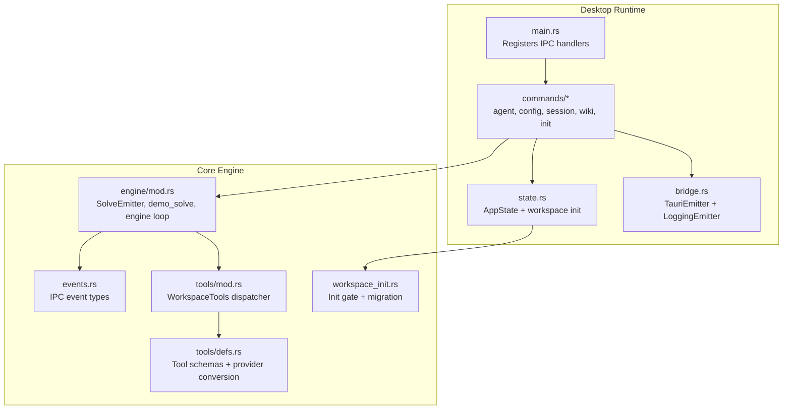
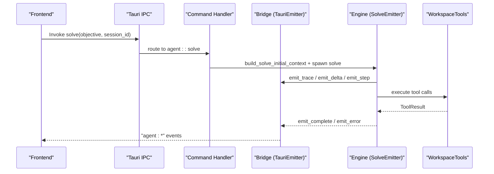
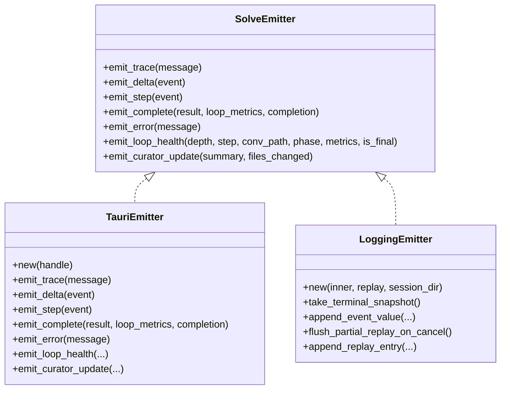
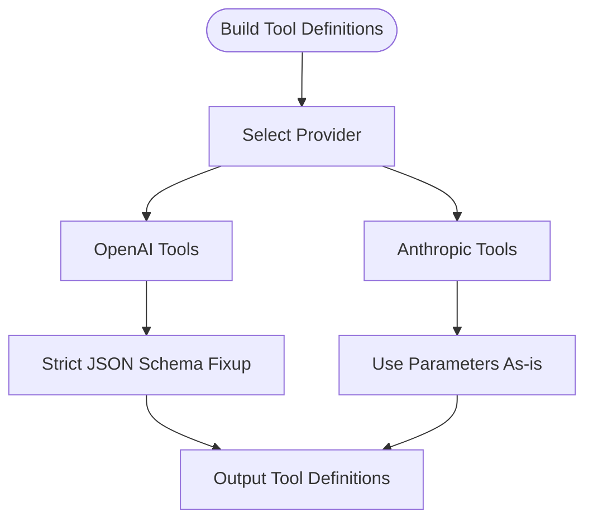
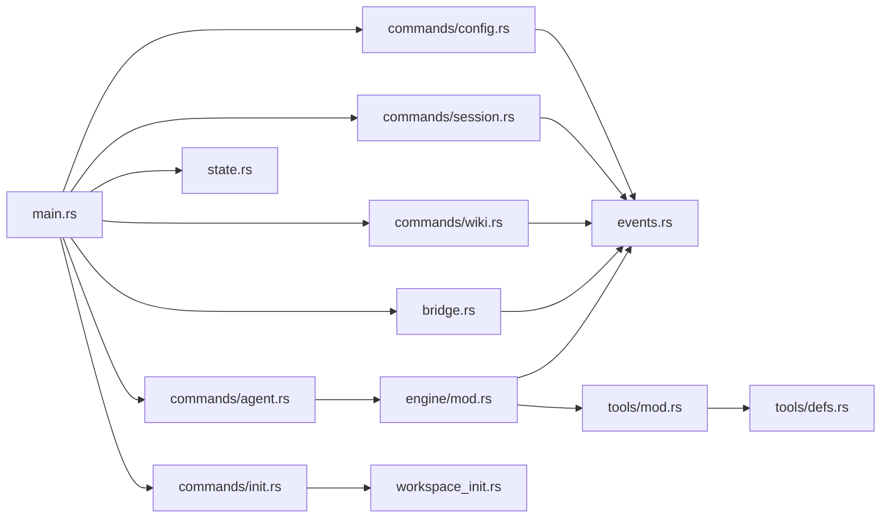

# API Reference

<cite>
**Referenced Files in This Document**
- [main.rs](file://openplanter-desktop/crates/op-tauri/src/main.rs)
- [agent.rs](file://openplanter-desktop/crates/op-tauri/src/commands/agent.rs)
- [config.rs](file://openplanter-desktop/crates/op-tauri/src/commands/config.rs)
- [session.rs](file://openplanter-desktop/crates/op-tauri/src/commands/session.rs)
- [wiki.rs](file://openplanter-desktop/crates/op-tauri/src/commands/wiki.rs)
- [init.rs](file://openplanter-desktop/crates/op-tauri/src/commands/init.rs)
- [bridge.rs](file://openplanter-desktop/crates/op-tauri/src/bridge.rs)
- [state.rs](file://openplanter-desktop/crates/op-tauri/src/state.rs)
- [events.rs](file://openplanter-desktop/crates/op-core/src/events.rs)
- [engine/mod.rs](file://openplanter-desktop/crates/op-core/src/engine/mod.rs)
- [tools/mod.rs](file://openplanter-desktop/crates/op-core/src/tools/mod.rs)
- [tools/defs.rs](file://openplanter-desktop/crates/op-core/src/tools/defs.rs)
- [workspace_init.rs](file://openplanter-desktop/crates/op-core/src/workspace_init.rs)
</cite>

## Table of Contents
1. [Introduction](#introduction)
2. [Project Structure](#project-structure)
3. [Core Components](#core-components)
4. [Architecture Overview](#architecture-overview)
5. [Detailed Component Analysis](#detailed-component-analysis)
6. [Dependency Analysis](#dependency-analysis)
7. [Performance Considerations](#performance-considerations)
8. [Troubleshooting Guide](#troubleshooting-guide)
9. [Conclusion](#conclusion)
10. [Appendices](#appendices)

## Introduction
This document provides a comprehensive API reference for the OpenPlanter IPC command system and tool definitions. It covers:
- Tauri IPC commands for agent control, wiki management, configuration operations, session lifecycle, and initialization
- Tool definitions for workspace operations with JSON schemas and parameter specifications
- Model interface abstractions, provider configuration endpoints, and session management APIs
- Practical examples of programmatic access patterns, error handling strategies, and integration approaches
- Guidance on API versioning, backward compatibility, and migration
- Client implementation guidelines for desktop and CLI integrations

## Project Structure
OpenPlanter’s desktop application exposes a Tauri-based IPC surface implemented in Rust. The primary entry point registers commands and wires state and event bridges. Commands are organized by domain: agent, config, session, wiki, and init. The engine and tooling live in the op-core crate and are invoked by the agent command.

**Diagram sources**
- [main.rs:20-49](file://openplanter-desktop/crates/op-tauri/src/main.rs#L20-L49)
- [state.rs:366-501](file://openplanter-desktop/crates/op-tauri/src/state.rs#L366-L501)
- [bridge.rs:133-246](file://openplanter-desktop/crates/op-tauri/src/bridge.rs#L133-L246)
- [engine/mod.rs:129-157](file://openplanter-desktop/crates/op-core/src/engine/mod.rs#L129-L157)
- [events.rs:311-322](file://openplanter-desktop/crates/op-core/src/events.rs#L311-L322)
- [tools/mod.rs:56-95](file://openplanter-desktop/crates/op-core/src/tools/mod.rs#L56-L95)
- [tools/defs.rs:515-746](file://openplanter-desktop/crates/op-core/src/tools/defs.rs#L515-L746)
- [workspace_init.rs:68-117](file://openplanter-desktop/crates/op-core/src/workspace_init.rs#L68-L117)

**Section sources**
- [main.rs:10-49](file://openplanter-desktop/crates/op-tauri/src/main.rs#L10-L49)
- [state.rs:366-501](file://openplanter-desktop/crates/op-tauri/src/state.rs#L366-L501)

## Core Components
- IPC Command Surface: Registered in main.rs, exposing commands for agent control, configuration, sessions, wiki, and initialization.
- Event Bridge: Emits structured events to the frontend via TauriEmitter and LoggingEmitter.
- Engine: Implements SolveEmitter trait and orchestrates multi-step solves with tool execution.
- Tools: Central dispatcher for workspace tools with provider-neutral schemas.
- Events: Strongly typed event and payload models for IPC.

**Section sources**
- [main.rs:23-47](file://openplanter-desktop/crates/op-tauri/src/main.rs#L23-L47)
- [bridge.rs:133-246](file://openplanter-desktop/crates/op-tauri/src/bridge.rs#L133-L246)
- [engine/mod.rs:129-157](file://openplanter-desktop/crates/op-core/src/engine/mod.rs#L129-L157)
- [tools/mod.rs:56-95](file://openplanter-desktop/crates/op-core/src/tools/mod.rs#L56-L95)
- [events.rs:311-322](file://openplanter-desktop/crates/op-core/src/events.rs#L311-L322)

## Architecture Overview
The IPC architecture connects frontend clients to the Rust engine through Tauri. Commands validate inputs, update AppState, and trigger engine loops. Events are streamed to the frontend with structured payloads.

**Diagram sources**
- [main.rs:23-47](file://openplanter-desktop/crates/op-tauri/src/main.rs#L23-L47)
- [agent.rs:267-500](file://openplanter-desktop/crates/op-tauri/src/commands/agent.rs#L267-L500)
- [bridge.rs:133-246](file://openplanter-desktop/crates/op-tauri/src/bridge.rs#L133-L246)
- [engine/mod.rs:129-157](file://openplanter-desktop/crates/op-core/src/engine/mod.rs#L129-L157)
- [tools/mod.rs:280-722](file://openplanter-desktop/crates/op-core/src/tools/mod.rs#L280-L722)

## Detailed Component Analysis

### IPC Commands: Agent Control
- solve(objective: string, session_id: string) -> Result<(), string>
  - Validates workspace init gate, prevents concurrent runs, sets cancellation token, initializes replay logger, builds initial context (continuity, retrieval), spawns engine solve, persists turn outcome, and finalizes session turn.
  - Emits agent:* events via bridge.
  - Returns error if workspace is uninitialized or another agent task is running.
- cancel() -> Result<(), string>
  - Cancels the current solve and logs a runtime cancel event.
- debug_log(msg: string) -> Result<(), string>
  - Temporary frontend debug logging.

Response formats:
- Success: Empty JSON object {}
- Error: String message

Event emissions:
- agent:trace, agent:delta, agent:step, agent:complete, agent:error, agent:loop-health, agent:curator-update

**Section sources**
- [agent.rs:267-531](file://openplanter-desktop/crates/op-tauri/src/commands/agent.rs#L267-L531)
- [bridge.rs:133-246](file://openplanter-desktop/crates/op-tauri/src/bridge.rs#L133-L246)
- [events.rs:311-322](file://openplanter-desktop/crates/op-core/src/events.rs#L311-L322)

### IPC Commands: Configuration Management
- get_config() -> ConfigView
  - Returns current configuration view including provider, model, reasoning effort, web search provider, embeddings provider, continuity mode, Chrome MCP status, workspace path, session_id, recursion settings, and limits.
- update_config(partial: PartialConfig) -> ConfigView
  - Applies normalized partial updates (provider, model alias, reasoning effort, zai plan, web search provider, embeddings provider, continuity mode, recursion policy, depth limits, Chrome MCP settings) and returns updated ConfigView.
- list_models(provider: string) -> Vec<ModelInfo>
  - Lists known models for a provider or all providers.
- save_settings(settings: PersistentSettings) -> Result<(), string>
  - Merges and saves persistent settings to disk.
- save_credential(service: string, value: Option<string>) -> Result<HashMap<string, bool>, string>
  - Persists credential to workspace store, updates runtime config, merges fallbacks, and returns credential status map.
- get_credentials_status() -> Result<HashMap<string, bool>, string>
  - Returns credential availability per service.

Response formats:
- ConfigView: JSON object with fields provider, model, reasoning_effort, zai_plan, web_search_provider, embeddings_provider, embeddings_status, embeddings_status_detail, embeddings_mode, embeddings_packet_version, continuity_mode, mistral_document_ai_use_shared_key, chrome_mcp_* fields, workspace, session_id, recursive, recursion_policy, min_subtask_depth, max_depth, max_steps_per_call, demo.
- PartialConfig: Subset of ConfigView fields with optional values.
- ModelInfo: { id, name?, provider }.
- Credential status: { service: boolean } map.

**Section sources**
- [config.rs:119-532](file://openplanter-desktop/crates/op-tauri/src/commands/config.rs#L119-L532)
- [events.rs:324-355](file://openplanter-desktop/crates/op-core/src/events.rs#L324-L355)
- [events.rs:357-378](file://openplanter-desktop/crates/op-core/src/events.rs#L357-L378)
- [events.rs:380-386](file://openplanter-desktop/crates/op-core/src/events.rs#L380-L386)

### IPC Commands: Session Management
- list_sessions(limit?: number) -> Vec<SessionInfo>
- open_session(id?: string, resume: boolean) -> SessionInfo
- delete_session(id: string) -> Result<(), string>
- get_session_history(session_id: string) -> Vec<ReplayEntry>

SessionInfo fields:
- id, created_at, turn_count, last_objective?

FailureInfo structure:
- code, category, phase, retryable, message, details, resumable?, user_visible?, provider?, provider_code?, http_status?

**Section sources**
- [session.rs:513-612](file://openplanter-desktop/crates/op-tauri/src/commands/session.rs#L513-L612)
- [session.rs:28-81](file://openplanter-desktop/crates/op-tauri/src/commands/session.rs#L28-L81)
- [events.rs:388-421](file://openplanter-desktop/crates/op-core/src/events.rs#L388-L421)

### IPC Commands: Wiki Management
- get_graph_data() -> GraphData
  - Builds wiki graph from index and source files, computes cross-references and shared fields, returns nodes and edges.
- get_investigation_overview() -> InvestigationOverviewView
  - Aggregates investigation snapshot, focus questions, gaps, actions, recent revelations, and wiki navigation tree.
- read_wiki_file(path: string) -> string
  - Reads a wiki file content.

GraphData fields:
- nodes: [GraphNode { id, label, category, path, node_type?, parent_id?, content? }]
- edges: [GraphEdge { source, target, label? }]

**Section sources**
- [wiki.rs:705-745](file://openplanter-desktop/crates/op-tauri/src/commands/wiki.rs#L705-L745)
- [events.rs:157-194](file://openplanter-desktop/crates/op-core/src/events.rs#L157-L194)
- [events.rs:291-309](file://openplanter-desktop/crates/op-core/src/events.rs#L291-L309)

### IPC Commands: Initialization
- get_init_status() -> InitStatusView
- run_standard_init() -> StandardInitReportView
- complete_first_run_gate() -> InitStatusView
- inspect_migration_source(path: string) -> MigrationSourceInspection
- run_migration_init(request: MigrationInitRequest) -> MigrationInitResultView

InitStatusView fields:
- runtime_workspace, gate_state, onboarding_completed, has_openplanter_root, has_runtime_wiki, has_runtime_index, init_state_path, last_migration_target?, warnings

**Section sources**
- [init.rs:22-82](file://openplanter-desktop/crates/op-tauri/src/commands/init.rs#L22-L82)
- [workspace_init.rs:127-168](file://openplanter-desktop/crates/op-core/src/workspace_init.rs#L127-L168)
- [workspace_init.rs:68-117](file://openplanter-desktop/crates/op-core/src/workspace_init.rs#L68-L117)
- [workspace_init.rs:197-429](file://openplanter-desktop/crates/op-core/src/workspace_init.rs#L197-L429)

### Model Interface Abstraction and Provider Configuration
- SolveEmitter trait defines event emission contract used by engine and bridge.
- Provider-neutral tool definitions converted to provider-specific shapes (OpenAI strict tools, Anthropic input_schema).
- Chrome MCP dynamic tool definitions integrated at runtime.

**Diagram sources**
- [engine/mod.rs:129-157](file://openplanter-desktop/crates/op-core/src/engine/mod.rs#L129-L157)
- [bridge.rs:133-246](file://openplanter-desktop/crates/op-tauri/src/bridge.rs#L133-L246)

**Section sources**
- [engine/mod.rs:129-157](file://openplanter-desktop/crates/op-core/src/engine/mod.rs#L129-L157)
- [bridge.rs:133-246](file://openplanter-desktop/crates/op-tauri/src/bridge.rs#L133-L246)

### Tool Definitions Reference
Provider-neutral tool definitions define schemas for:
- Filesystem: list_files, search_files, read_file, write_file, edit_file, hashline_edit
- Shell: run_shell, run_shell_bg, check_shell_bg, kill_shell_bg
- Web: web_search, fetch_url
- Patching: apply_patch
- Audio/Document: audio_transcribe, document_ocr, document_annotations, document_qa
- Meta: think
- Dynamic: Chrome MCP tools

Each tool definition includes:
- name: string
- description: string
- parameters: JSON Schema object

Provider-specific conversions:
- OpenAI: [{ type: "function", function: { name, description, parameters: strict JSON Schema, strict: true } }]
- Anthropic: [{ name, description, input_schema: JSON Schema }]

**Diagram sources**
- [tools/defs.rs:515-746](file://openplanter-desktop/crates/op-core/src/tools/defs.rs#L515-L746)

**Section sources**
- [tools/defs.rs:15-451](file://openplanter-desktop/crates/op-core/src/tools/defs.rs#L15-L451)
- [tools/defs.rs:515-746](file://openplanter-desktop/crates/op-core/src/tools/defs.rs#L515-L746)

### Programmatic Access Patterns and Examples
- Desktop client (Tauri):
  - Use tauri::invoke to call commands and listen to agent:* events.
  - Example: invoke solve with { objective, session_id }, subscribe to agent:delta for streaming, agent:complete for final result.
- CLI client:
  - Use tauri::invoke from a CLI wrapper or integrate with the same IPC surface.
  - Example: run_standard_init before invoking solve; poll session history via get_session_history.

Integration tips:
- Always check get_init_status before invoking solve.
- Use open_session(resume=true) to continue previous sessions.
- Handle FailureInfo codes and categories for robust error handling.

**Section sources**
- [main.rs:23-47](file://openplanter-desktop/crates/op-tauri/src/main.rs#L23-L47)
- [session.rs:524-570](file://openplanter-desktop/crates/op-tauri/src/commands/session.rs#L524-L570)
- [session.rs:28-81](file://openplanter-desktop/crates/op-tauri/src/commands/session.rs#L28-L81)

### Error Handling Strategies
- FailureInfo taxonomy:
  - cancelled, degraded, unknown_error, provider-specific codes (e.g., rate_limit)
- Engine maps runtime errors to FailureInfo and emits agent:error with failure_code and failure_phase.
- Rate limiting handled with exponential backoff and retry caps.

**Section sources**
- [bridge.rs:67-118](file://openplanter-desktop/crates/op-tauri/src/bridge.rs#L67-L118)
- [engine/mod.rs:432-483](file://openplanter-desktop/crates/op-core/src/engine/mod.rs#L432-L483)
- [events.rs:140-148](file://openplanter-desktop/crates/op-core/src/events.rs#L140-L148)

### API Versioning, Backward Compatibility, and Migration
- Session and trace formats:
  - SessionInfo supports legacy session_id alias deserialization.
  - LoopMetrics backfills missing fields for backward compatibility.
- Migration:
  - run_migration_init copies and merges sessions, settings, credentials, and synthesizes wiki via curator.
  - Emits MigrationProgressEvent with stages and completion status.
- Recommendations:
  - Clients should tolerate optional fields and handle renamed fields gracefully.
  - Use get_init_status to gate operations and avoid partial workspace states.

**Section sources**
- [events.rs:398-421](file://openplanter-desktop/crates/op-core/src/events.rs#L398-L421)
- [events.rs:673-713](file://openplanter-desktop/crates/op-core/src/events.rs#L673-L713)
- [workspace_init.rs:197-429](file://openplanter-desktop/crates/op-core/src/workspace_init.rs#L197-L429)

## Dependency Analysis

**Diagram sources**
- [main.rs:23-47](file://openplanter-desktop/crates/op-tauri/src/main.rs#L23-L47)
- [agent.rs:1-25](file://openplanter-desktop/crates/op-tauri/src/commands/agent.rs#L1-L25)
- [config.rs:1-17](file://openplanter-desktop/crates/op-tauri/src/commands/config.rs#L1-L17)
- [session.rs:1-8](file://openplanter-desktop/crates/op-tauri/src/commands/session.rs#L1-L8)
- [wiki.rs:1-17](file://openplanter-desktop/crates/op-tauri/src/commands/wiki.rs#L1-L17)
- [init.rs:1-9](file://openplanter-desktop/crates/op-tauri/src/commands/init.rs#L1-L9)
- [bridge.rs:1-25](file://openplanter-desktop/crates/op-tauri/src/bridge.rs#L1-L25)
- [state.rs:1-18](file://openplanter-desktop/crates/op-tauri/src/state.rs#L1-L18)
- [engine/mod.rs:1-31](file://openplanter-desktop/crates/op-core/src/engine/mod.rs#L1-L31)
- [events.rs:1-7](file://openplanter-desktop/crates/op-core/src/events.rs#L1-L7)
- [tools/mod.rs:1-18](file://openplanter-desktop/crates/op-core/src/tools/mod.rs#L1-L18)
- [tools/defs.rs:1-7](file://openplanter-desktop/crates/op-core/src/tools/defs.rs#L1-L7)
- [workspace_init.rs:1-22](file://openplanter-desktop/crates/op-core/src/workspace_init.rs#L1-L22)

**Section sources**
- [main.rs:23-47](file://openplanter-desktop/crates/op-tauri/src/main.rs#L23-L47)

## Performance Considerations
- Streaming: Engine emits deltas and steps to minimize latency; clients should render incrementally.
- Rate limiting: Automatic retries with capped backoff reduce transient failures.
- Observation clipping: Tool results are clipped to max_observation_chars to control payload sizes.
- Continuity: Turn history and retrieval packets improve context reuse and reduce redundant work.

[No sources needed since this section provides general guidance]

## Troubleshooting Guide
Common issues and resolutions:
- Workspace not initialized: Call get_init_status and run_standard_init before solve.
- Concurrent agent tasks: Ensure agent_running flag is cleared; avoid overlapping solve invocations.
- Rate limit errors: Expect exponential backoff; adjust provider quotas or retry policies.
- Session not found: Verify session_id exists and metadata.json is present.

**Section sources**
- [agent.rs:276-280](file://openplanter-desktop/crates/op-tauri/src/commands/agent.rs#L276-L280)
- [session.rs:572-600](file://openplanter-desktop/crates/op-tauri/src/commands/session.rs#L572-L600)
- [bridge.rs:432-483](file://openplanter-desktop/crates/op-tauri/src/bridge.rs#L432-L483)

## Conclusion
OpenPlanter’s IPC API provides a robust, event-driven interface for agent control, configuration, session management, and wiki operations. The provider-neutral tool definitions and strong event typing enable flexible integrations across desktop and CLI clients. Adhering to the initialization gate, handling FailureInfo, and leveraging streaming events ensures reliable and responsive integrations.

[No sources needed since this section summarizes without analyzing specific files]

## Appendices

### Appendix A: Event Types and Payloads
- TraceEvent: { message }
- StepEvent: { depth, step, conversation_path?, tool_name?, tokens: { input_tokens, output_tokens }, elapsed_ms, is_final, loop_phase?, loop_metrics? }
- DeltaEvent: { kind: "text"|"thinking"|"tool_call_start"|"tool_call_args", text, conversation_path? }
- CompleteEvent: { result, loop_metrics?, completion? }
- ErrorEvent: { message, failure_code?, failure_phase? }
- LoopHealthEvent: { depth, step, conversation_path?, phase, metrics, is_final }
- CuratorUpdateEvent: { summary, files_changed }

**Section sources**
- [events.rs:6-148](file://openplanter-desktop/crates/op-core/src/events.rs#L6-L148)

### Appendix B: Client Implementation Guidelines
- Desktop (Tauri):
  - Register invoke handlers for commands and listen to agent:* events.
  - Persist and manage session_id in AppState.
- CLI:
  - Use tauri::invoke to call commands and parse JSON responses.
  - Implement retry logic for rate-limited operations.

**Section sources**
- [main.rs:23-47](file://openplanter-desktop/crates/op-tauri/src/main.rs#L23-L47)
- [state.rs:366-501](file://openplanter-desktop/crates/op-tauri/src/state.rs#L366-L501)