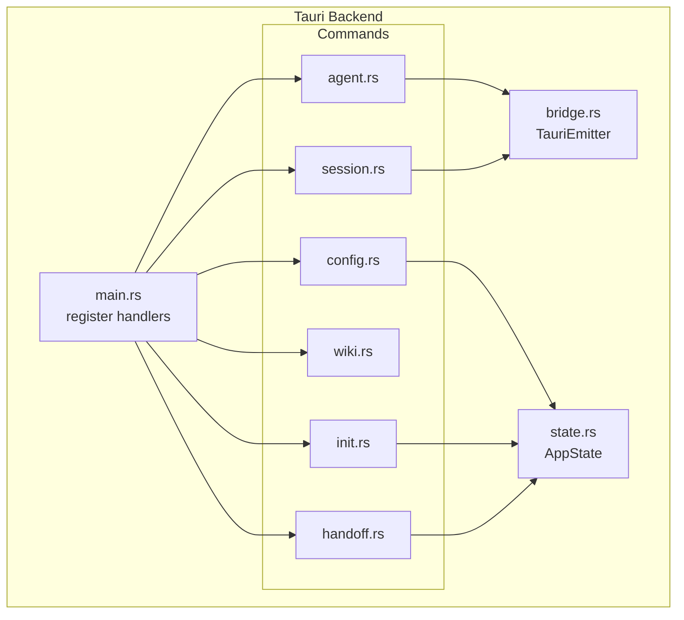
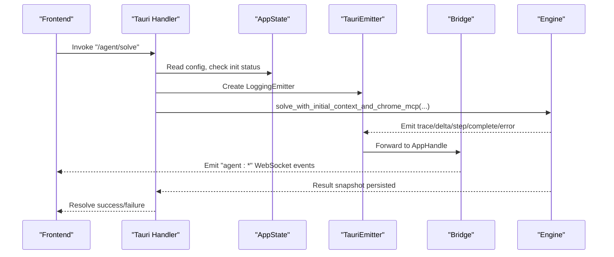
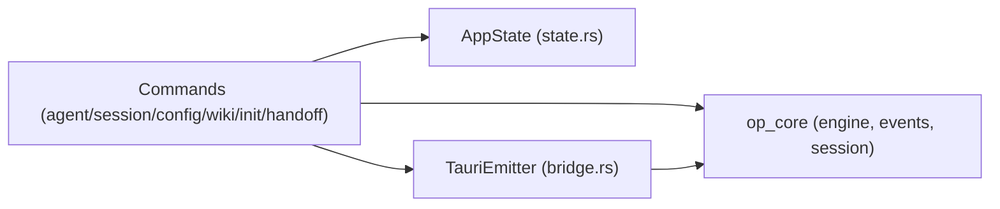

# IPC Commands

<cite>
**Referenced Files in This Document**
- [main.rs](file://openplanter-desktop/crates/op-tauri/src/main.rs)
- [agent.rs](file://openplanter-desktop/crates/op-tauri/src/commands/agent.rs)
- [session.rs](file://openplanter-desktop/crates/op-tauri/src/commands/session.rs)
- [config.rs](file://openplanter-desktop/crates/op-tauri/src/commands/config.rs)
- [wiki.rs](file://openplanter-desktop/crates/op-tauri/src/commands/wiki.rs)
- [init.rs](file://openplanter-desktop/crates/op-tauri/src/commands/init.rs)
- [handoff.rs](file://openplanter-desktop/crates/op-tauri/src/commands/handoff.rs)
- [bridge.rs](file://openplanter-desktop/crates/op-tauri/src/bridge.rs)
- [state.rs](file://openplanter-desktop/crates/op-tauri/src/state.rs)
</cite>

## Table of Contents
1. [Introduction](#introduction)
2. [Project Structure](#project-structure)
3. [Core Components](#core-components)
4. [Architecture Overview](#architecture-overview)
5. [Detailed Component Analysis](#detailed-component-analysis)
6. [Dependency Analysis](#dependency-analysis)
7. [Performance Considerations](#performance-considerations)
8. [Troubleshooting Guide](#troubleshooting-guide)
9. [Conclusion](#conclusion)
10. [Appendices](#appendices)

## Introduction
This document describes the Inter-Process Communication (IPC) command surface for the Tauri backend. It enumerates all IPC endpoints, their method signatures, parameter schemas, response formats, error codes, and usage semantics. It also documents real-time WebSocket event streams, authentication and security considerations, and provides client-side implementation guidance for both Rust and JavaScript.

## Project Structure
The Tauri backend exposes commands via a generated handler list. Each module under `commands/` defines typed IPC commands and supporting types. The bridge module translates internal engine events into frontend WebSocket events. The state module holds shared runtime state (configuration, session ID, cancellation token, etc.).

**Diagram sources**
- [main.rs:20-47](file://openplanter-desktop/crates/op-tauri/src/main.rs#L20-L47)
- [state.rs:365-420](file://openplanter-desktop/crates/op-tauri/src/state.rs#L365-L420)
- [bridge.rs:133-246](file://openplanter-desktop/crates/op-tauri/src/bridge.rs#L133-L246)

**Section sources**
- [main.rs:10-50](file://openplanter-desktop/crates/op-tauri/src/main.rs#L10-L50)

## Core Components
- Command registration: The Tauri builder registers all IPC commands in a single handler list.
- Shared state: AppState encapsulates configuration, session ID, cancellation token, agent running flag, and Chrome MCP runtime.
- Event bridge: TauriEmitter converts internal engine events into frontend WebSocket events.

Key responsibilities:
- Agent control: start solve, cancel, debug logging.
- Session management: list, open (create/resume), delete, get history.
- Configuration: get, update, list models, save settings, save/get credentials.
- Wiki source operations: graph data, overview, read file.
- Initialization: get status, run standard init, complete first-run gate, inspect migration source, run migration init.
- Handoff: export/import session handoff packages.
- Real-time events: agent lifecycle and streaming deltas.

**Section sources**
- [main.rs:23-47](file://openplanter-desktop/crates/op-tauri/src/main.rs#L23-L47)
- [state.rs:365-501](file://openplanter-desktop/crates/op-tauri/src/state.rs#L365-L501)
- [bridge.rs:133-246](file://openplanter-desktop/crates/op-tauri/src/bridge.rs#L133-L246)

## Architecture Overview
The IPC layer sits between the frontend and the core engine. Commands mutate state, orchestrate engine solves, and persist session traces. Events are emitted to the frontend via WebSocket channels.

**Diagram sources**
- [main.rs:23-47](file://openplanter-desktop/crates/op-tauri/src/main.rs#L23-L47)
- [agent.rs:267-500](file://openplanter-desktop/crates/op-tauri/src/commands/agent.rs#L267-L500)
- [bridge.rs:133-246](file://openplanter-desktop/crates/op-tauri/src/bridge.rs#L133-L246)

## Detailed Component Analysis

### Agent Control Commands
- Endpoint: `/agent/solve`
  - Method signature: solve(objective: string, session_id: string)
  - Parameters:
    - objective: string — the investigation objective.
    - session_id: string — active session identifier.
  - Response: Result<void, string> — success or error message.
  - Errors:
    - Workspace not initialized: "Workspace initialization is not complete. Run /init first."
    - Already running: "An agent task is already running."
  - Behavior:
    - Validates initialization and agent idle state.
    - Creates a cancellation token per run.
    - Logs user message to replay.
    - Builds initial context (continuity, reasoning packet, retrieval).
    - Spawns engine solve; persists turn outcome and emits terminal snapshot.
  - WebSocket events:
    - "agent:trace", "agent:delta", "agent:step", "agent:complete", "agent:error", "agent:loop-health", "agent:curator-update".

- Endpoint: `/agent/cancel`
  - Method signature: cancel()
  - Response: Result<void, string>
  - Behavior: Cancels the current run and appends a runtime cancel event.

- Endpoint: `/agent/debug_log`
  - Method signature: debug_log(msg: string)
  - Response: Result<void, string>
  - Behavior: Logs a frontend-originated debug message.

Usage example (Rust):
- Use tauri::invoke to call "/agent/solve" with the objective and active session_id.
- Subscribe to "agent:*" events to render streaming deltas and final results.

Usage example (JavaScript):
- Use @tauri-apps/api invoke to call "/agent/solve" and listen to "agent:*" channel events.

Security considerations:
- No explicit authentication is enforced at the IPC layer. Treat as trusted local process communication.

**Section sources**
- [agent.rs:267-500](file://openplanter-desktop/crates/op-tauri/src/commands/agent.rs#L267-L500)
- [agent.rs:502-524](file://openplanter-desktop/crates/op-tauri/src/commands/agent.rs#L502-L524)
- [agent.rs:526-531](file://openplanter-desktop/crates/op-tauri/src/commands/agent.rs#L526-L531)
- [bridge.rs:133-246](file://openplanter-desktop/crates/op-tauri/src/bridge.rs#L133-L246)

### Session Management Operations
- Endpoint: `/session/list_sessions`
  - Method signature: list_sessions(limit?: number)
  - Response: Result<Array<SessionInfo>, string>
  - Schema: SessionInfo includes id, created_at, turn_count, last_objective.

- Endpoint: `/session/open_session`
  - Method signature: open_session(id?: string, resume: boolean)
  - Response: Result<SessionInfo, string>
  - Behavior:
    - If resume=true and id exists, resumes existing session.
    - Otherwise creates a new session and sets it active.

- Endpoint: `/session/delete_session`
  - Method signature: delete_session(id: string)
  - Response: Result<void, string>
  - Validation: refuses to delete if not a directory or lacks metadata.json.

- Endpoint: `/session/get_session_history`
  - Method signature: get_session_history(session_id: string)
  - Response: Result<Array<ReplayEntry>, string>
  - Notes: Reads replay.jsonl for message history.

Data models (selected):
- SessionInfo: id, created_at, turn_count, last_objective.
- FailureInfo: code, category, phase, retryable, message, details, plus optional fields.
- TurnStartContext: session_id, turn_id, turn_index, started_at, continuity_mode, resumed flags, user_message_event_id, event_start_seq.
- TurnRecordOutcome: status, ended_at, summary, failure, degraded, counts, spans, references.

Usage example (Rust):
- Call "/session/open_session" with resume=false to create a new session.
- Subscribe to "agent:*" events during solve to populate session events.

Usage example (JavaScript):
- Use invoke("/session/list_sessions", { limit: 20 }) to list recent sessions.

Security considerations:
- Session identifiers are validated for safe path segments.

**Section sources**
- [session.rs:514-522](file://openplanter-desktop/crates/op-tauri/src/commands/session.rs#L514-L522)
- [session.rs:524-570](file://openplanter-desktop/crates/op-tauri/src/commands/session.rs#L524-L570)
- [session.rs:572-600](file://openplanter-desktop/crates/op-tauri/src/commands/session.rs#L572-L600)
- [session.rs:602-612](file://openplanter-desktop/crates/op-tauri/src/commands/session.rs#L602-L612)
- [session.rs:28-81](file://openplanter-desktop/crates/op-tauri/src/commands/session.rs#L28-L81)
- [session.rs:99-126](file://openplanter-desktop/crates/op-tauri/src/commands/session.rs#L99-L126)
- [session.rs:100-110](file://openplanter-desktop/crates/op-tauri/src/commands/session.rs#L100-L110)
- [session.rs:113-126](file://openplanter-desktop/crates/op-tauri/src/commands/session.rs#L113-L126)

### Configuration Management
- Endpoint: `/config/get_config`
  - Method signature: get_config()
  - Response: Result<ConfigView, string>
  - Includes provider, model, reasoning_effort, zai_plan, web_search_provider, embeddings_* fields, continuity_mode, chrome_mcp_* fields, workspace, session_id, recursion controls, and flags.

- Endpoint: `/config/update_config`
  - Method signature: update_config(partial: PartialConfig)
  - Response: Result<ConfigView, string>
  - Normalizes provider/model/embeddings/web search/continuity/recursion/chrome_mcp settings and synchronizes Chrome MCP runtime.

- Endpoint: `/config/list_models`
  - Method signature: list_models(provider: string)
  - Response: Result<Array<ModelInfo>, string>
  - Returns known models for the given provider or all providers.

- Endpoint: `/config/save_settings`
  - Method signature: save_settings(settings: PersistentSettings)
  - Response: Result<void, string>
  - Merges incoming settings with existing ones and persists.

- Endpoint: `/config/save_credential`
  - Method signature: save_credential(service: string, value?: string)
  - Response: Result<Map<string, boolean>, string>
  - Saves or clears a credential and applies runtime fallbacks; returns credential status map.

- Endpoint: `/config/get_credentials_status`
  - Method signature: get_credentials_status()
  - Response: Result<Map<string, boolean>, string>
  - Returns whether each service has an effective API key configured.

Usage example (Rust):
- Call "/config/update_config" with PartialConfig to change model or provider.
- Call "/config/save_credential" to set or clear a key.

Usage example (JavaScript):
- Use invoke("/config/get_config") to hydrate UI settings.

Security considerations:
- Credentials are stored in workspace-local credential store and merged with environment sources. Treat as sensitive data.

**Section sources**
- [config.rs:119-125](file://openplanter-desktop/crates/op-tauri/src/commands/config.rs#L119-L125)
- [config.rs:127-203](file://openplanter-desktop/crates/op-tauri/src/commands/config.rs#L127-L203)
- [config.rs:205-284](file://openplanter-desktop/crates/op-tauri/src/commands/config.rs#L205-L284)
- [config.rs:286-296](file://openplanter-desktop/crates/op-tauri/src/commands/config.rs#L286-L296)
- [config.rs:505-532](file://openplanter-desktop/crates/op-tauri/src/commands/config.rs#L505-L532)
- [config.rs:524-532](file://openplanter-desktop/crates/op-tauri/src/commands/config.rs#L524-L532)

### Wiki Source Operations
- Endpoint: `/wiki/get_graph_data`
  - Method signature: get_graph_data()
  - Response: Result<GraphData, string>
  - Behavior: Scans workspace wiki for index and sources, parses nodes/edges, and builds a graph.

- Endpoint: `/wiki/get_investigation_overview`
  - Method signature: get_investigation_overview()
  - Response: Result<InvestigationOverviewView, string>
  - Behavior: Loads investigation state and constructs overview views.

- Endpoint: `/wiki/read_wiki_file`
  - Method signature: read_wiki_file(path: string)
  - Response: Result<string, string>
  - Behavior: Reads a wiki file by path.

Usage example (Rust):
- Call "/wiki/get_graph_data" to power a graph UI.

Usage example (JavaScript):
- Use invoke("/wiki/get_investigation_overview") to render overview panels.

Security considerations:
- Paths are resolved within workspace wiki directories; ensure callers sanitize inputs.

**Section sources**
- [wiki.rs:737-745](file://openplanter-desktop/crates/op-tauri/src/commands/wiki.rs#L737-L745)
- [wiki.rs:747-800](file://openplanter-desktop/crates/op-tauri/src/commands/wiki.rs#L747-800)
- [wiki.rs:1-800](file://openplanter-desktop/crates/op-tauri/src/commands/wiki.rs#L1-L800)

### Initialization Procedures
- Endpoint: `/init/get_init_status`
  - Method signature: get_init_status()
  - Response: Result<InitStatusView, string>
  - Behavior: Reports workspace initialization status.

- Endpoint: `/init/run_standard_init`
  - Method signature: run_standard_init()
  - Response: Result<StandardInitReportView, string>
  - Behavior: Runs standard workspace initialization with concurrency guard.

- Endpoint: `/init/complete_first_run_gate`
  - Method signature: complete_first_run_gate()
  - Response: Result<InitStatusView, string>
  - Behavior: Completes first-run gating.

- Endpoint: `/init/inspect_migration_source`
  - Method signature: inspect_migration_source(path: string)
  - Response: Result<MigrationSourceInspection, string>
  - Behavior: Inspects a potential migration source.

- Endpoint: `/init/run_migration_init`
  - Method signature: run_migration_init(request: MigrationInitRequest)
  - Response: Result<MigrationInitResultView, string>
  - Behavior: Performs migration with progress events on "init:migration-progress".

Usage example (Rust):
- Call "/init/get_init_status" before enabling agent solve.

Usage example (JavaScript):
- Listen to "init:migration-progress" during migration.

Security considerations:
- Initialization requires agent to be idle; concurrent runs are rejected.

**Section sources**
- [init.rs:22-27](file://openplanter-desktop/crates/op-tauri/src/commands/init.rs#L22-L27)
- [init.rs:29-42](file://openplanter-desktop/crates/op-tauri/src/commands/init.rs#L29-L42)
- [init.rs:44-55](file://openplanter-desktop/crates/op-tauri/src/commands/init.rs#L44-L55)
- [init.rs:57-63](file://openplanter-desktop/crates/op-tauri/src/commands/init.rs#L57-L63)
- [init.rs:65-82](file://openplanter-desktop/crates/op-tauri/src/commands/init.rs#L65-L82)

### Handoff Mechanisms
- Endpoint: `/handoff/export_session_handoff`
  - Method signature: export_session_handoff(session_id: string, turn_id?: string)
  - Response: Result<ExportSessionHandoffResult, string>
  - Behavior: Builds a handoff package from a session (selected turn or latest), persists JSON, and appends events.

- Endpoint: `/handoff/import_session_handoff`
  - Method signature: import_session_handoff(request: ImportSessionHandoffRequest)
  - Response: Result<ImportSessionHandoffResult, string>
  - Behavior: Reads a handoff package, resolves target session (create or reuse), imports into session, optionally activates, and appends events.

Data models (selected):
- SessionHandoffPackage: schema_version, package_format, handoff_id, exported_at, objective, open_questions, candidate_actions, evidence_index, replay_span, source, provenance, compat.
- ImportSessionHandoffRequest: package_path, target_session_id?, activate_session=true.
- ExportSessionHandoffResult: path, handoff.
- ImportSessionHandoffResult: path, session_id, created_session, activated_session, handoff.

Usage example (Rust):
- Export: invoke("/handoff/export_session_handoff", { session_id, turn_id? }).
- Import: invoke("/handoff/import_session_handoff", { package_path, target_session_id?, activate_session? }).

Security considerations:
- Session IDs and handoff IDs are validated for safety; replay spans are validated.

**Section sources**
- [handoff.rs:128-186](file://openplanter-desktop/crates/op-tauri/src/commands/handoff.rs#L128-L186)
- [handoff.rs:188-265](file://openplanter-desktop/crates/op-tauri/src/commands/handoff.rs#L188-L265)
- [handoff.rs:72-98](file://openplanter-desktop/crates/op-tauri/src/commands/handoff.rs#L72-L98)
- [handoff.rs:104-120](file://openplanter-desktop/crates/op-tauri/src/commands/handoff.rs#L104-L120)

### WebSocket Event Streams
Real-time events emitted to the frontend:
- "agent:trace": Trace messages.
- "agent:delta": Streaming deltas (text/tool args).
- "agent:step": Step completion with metrics and tool calls.
- "agent:complete": Final result with loop metrics and completion metadata.
- "agent:error": Error with failure code and phase.
- "agent:loop-health": Loop health metrics and phase.
- "agent:curator-update": Curator summary and changed file count.
- "init:migration-progress": Progress events during migration init.

Clients should subscribe to these channels to render live updates.

**Section sources**
- [bridge.rs:143-246](file://openplanter-desktop/crates/op-tauri/src/bridge.rs#L143-L246)
- [init.rs:74-78](file://openplanter-desktop/crates/op-tauri/src/commands/init.rs#L74-L78)

## Dependency Analysis
The IPC command surface depends on shared state and bridges engine events to the UI.

**Diagram sources**
- [main.rs:23-47](file://openplanter-desktop/crates/op-tauri/src/main.rs#L23-L47)
- [state.rs:365-501](file://openplanter-desktop/crates/op-tauri/src/state.rs#L365-L501)
- [bridge.rs:133-246](file://openplanter-desktop/crates/op-tauri/src/bridge.rs#L133-L246)

**Section sources**
- [main.rs:23-47](file://openplanter-desktop/crates/op-tauri/src/main.rs#L23-L47)
- [state.rs:365-501](file://openplanter-desktop/crates/op-tauri/src/state.rs#L365-L501)
- [bridge.rs:133-246](file://openplanter-desktop/crates/op-tauri/src/bridge.rs#L133-L246)

## Performance Considerations
- Streaming events: The bridge truncates previews and tool args to bound memory and log verbosity.
- Replay persistence: Events are appended to JSONL streams; ensure disk I/O is considered in long sessions.
- Concurrency: Initialization and agent operations are guarded to prevent overlapping runs.
- Cancellation: Each solve run has a dedicated cancellation token to abort promptly.

[No sources needed since this section provides general guidance]

## Troubleshooting Guide
Common issues and remedies:
- Initialization not ready: Call "/init/get_init_status" and run "/init/run_standard_init" before solving.
- Agent busy: Wait until "/agent/cancel" completes or agent_running flag clears.
- Session not found: Verify session_id and that metadata.json exists.
- Credential errors: Use "/config/get_credentials_status" and "/config/save_credential" to diagnose and fix.

Error taxonomy:
- FailureInfo fields include code, category, phase, retryable, message, details, and optional provider/http metadata. The bridge classifies common transient failures (rate limit, timeout) and unknown errors.

**Section sources**
- [agent.rs:276-280](file://openplanter-desktop/crates/op-tauri/src/commands/agent.rs#L276-L280)
- [agent.rs:502-524](file://openplanter-desktop/crates/op-tauri/src/commands/agent.rs#L502-L524)
- [session.rs:572-599](file://openplanter-desktop/crates/op-tauri/src/commands/session.rs#L572-L599)
- [config.rs:466-503](file://openplanter-desktop/crates/op-tauri/src/commands/config.rs#L466-L503)
- [bridge.rs:67-118](file://openplanter-desktop/crates/op-tauri/src/bridge.rs#L67-L118)

## Conclusion
The Tauri backend exposes a comprehensive IPC surface for agent control, session lifecycle, configuration, wiki navigation, initialization, and handoff. Real-time event streaming enables responsive UIs. Clients should handle initialization gating, manage session state, and subscribe to WebSocket channels for live updates.

[No sources needed since this section summarizes without analyzing specific files]

## Appendices

### Client Implementation Examples

- Rust (Tauri):
  - Invoke commands using tauri::invoke with appropriate parameters.
  - Subscribe to "agent:*" and "init:*" channels for events.
  - Example: invoke("/agent/solve", { objective, session_id }) and listen to "agent:complete".

- JavaScript (@tauri-apps/api):
  - Use invoke("/session/open_session", { resume: false }) to create a session.
  - Use invoke("/config/update_config", { provider: "openai", model: "gpt-4" }) to update settings.
  - Use invoke("/handoff/export_session_handoff", { session_id }) to export a handoff.

Authentication and security:
- No IPC-level authentication is enforced; treat as trusted local process.
- Store secrets via "/config/save_credential" and query "/config/get_credentials_status".
- Avoid exposing sensitive paths or session IDs outside the app.

**Section sources**
- [main.rs:23-47](file://openplanter-desktop/crates/op-tauri/src/main.rs#L23-L47)
- [config.rs:505-532](file://openplanter-desktop/crates/op-tauri/src/commands/config.rs#L505-L532)
- [init.rs:74-78](file://openplanter-desktop/crates/op-tauri/src/commands/init.rs#L74-L78)