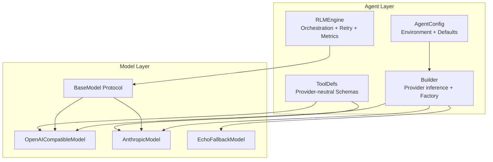
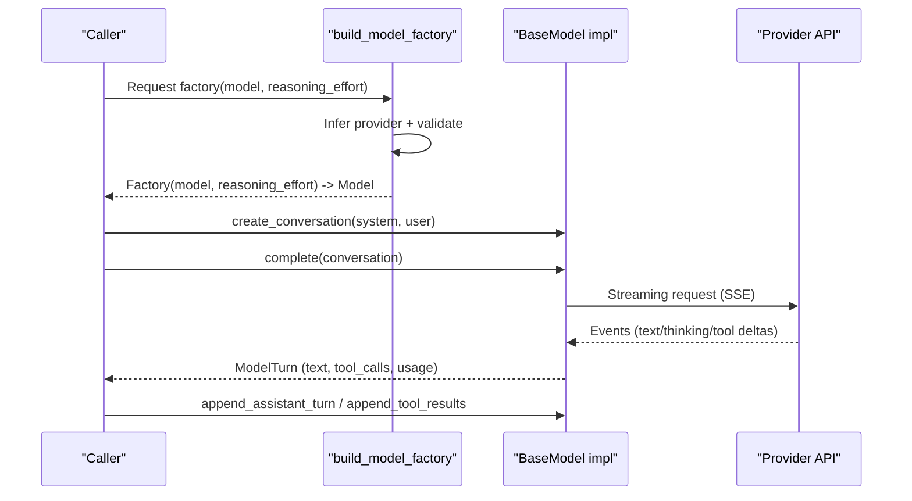
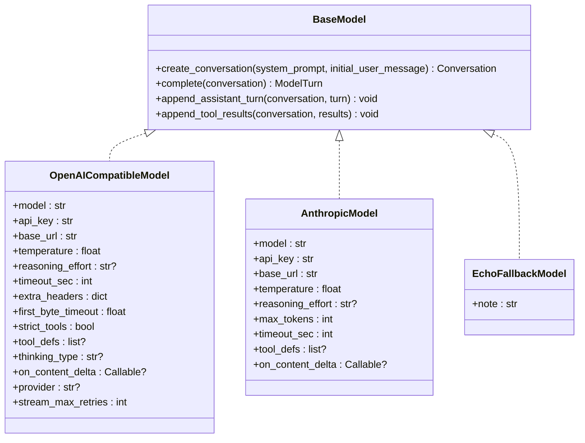
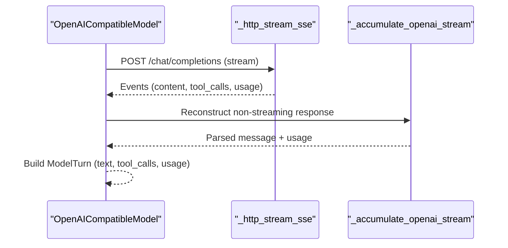
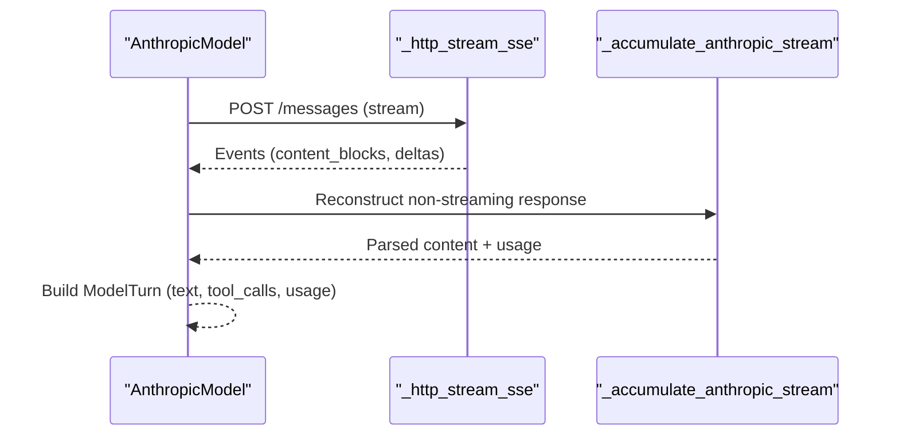
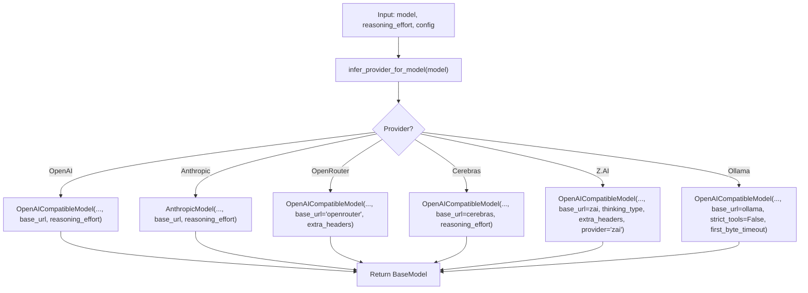
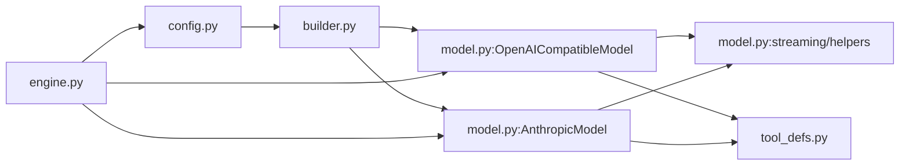

# Model Interface

<cite>
**Referenced Files in This Document**
- [model.py](file://agent/model.py)
- [builder.py](file://agent/builder.py)
- [config.py](file://agent/config.py)
- [engine.py](file://agent/engine.py)
- [tool_defs.py](file://agent/tool_defs.py)
- [test_model.py](file://tests/test_model.py)
</cite>

## Table of Contents
1. [Introduction](#introduction)
2. [Project Structure](#project-structure)
3. [Core Components](#core-components)
4. [Architecture Overview](#architecture-overview)
5. [Detailed Component Analysis](#detailed-component-analysis)
6. [Dependency Analysis](#dependency-analysis)
7. [Performance Considerations](#performance-considerations)
8. [Troubleshooting Guide](#troubleshooting-guide)
9. [Conclusion](#conclusion)
10. [Appendices](#appendices)

## Introduction
This document describes the unified model interface and multi-provider AI integration for the agent. It covers the shared model abstraction, provider configuration schemas for OpenAI, Anthropic, OpenRouter, Cerebras, Z.AI, and Ollama, and the model builder factory pattern. It documents model selection criteria, rate limiting, retries, streaming response handling, error propagation, provider-specific parameters, authentication, endpoints, and performance tuning. It also explains dynamic provider switching, fallback strategies, programmatic model selection, custom provider integration, and monitoring capabilities.

## Project Structure
The model interface spans several modules:
- Unified model abstraction and streaming helpers
- Provider-specific model implementations
- Builder and factory for dynamic model selection
- Configuration and environment resolution
- Engine orchestration and rate-limit/backoff handling
- Tool definitions and provider-neutral tool schemas

**Diagram sources**
- [builder.py:157-233](file://agent/builder.py#L157-L233)
- [model.py:98-103](file://agent/model.py#L98-L103)
- [model.py:779-980](file://agent/model.py#L779-L980)
- [model.py:1024-1260](file://agent/model.py#L1024-L1260)
- [engine.py:504-518](file://agent/engine.py#L504-L518)
- [tool_defs.py:716-756](file://agent/tool_defs.py#L716-L756)

**Section sources**
- [builder.py:157-233](file://agent/builder.py#L157-L233)
- [model.py:98-103](file://agent/model.py#L98-L103)
- [engine.py:504-518](file://agent/engine.py#L504-L518)
- [tool_defs.py:716-756](file://agent/tool_defs.py#L716-L756)

## Core Components
- BaseModel protocol defines the contract for model implementations: conversation creation, completion, appending turns and tool results, and optional conversation condensation.
- OpenAICompatibleModel implements OpenAI-compatible chat completions with streaming, tool-calling, reasoning effort, thinking, and SSE handling.
- AnthropicModel implements Anthropic Messages API with streaming, tool-calling, and thinking modes.
- EchoFallbackModel provides a safe fallback when no provider keys are configured.
- Builder infers providers from model names, validates selections, resolves endpoints and keys, and constructs factories.
- Engine orchestrates model calls, applies rate-limit backoff, tracks metrics, and manages conversation state.

**Section sources**
- [model.py:98-103](file://agent/model.py#L98-L103)
- [model.py:779-980](file://agent/model.py#L779-L980)
- [model.py:1024-1260](file://agent/model.py#L1024-L1260)
- [builder.py:48-82](file://agent/builder.py#L48-L82)
- [engine.py:1040-1084](file://agent/engine.py#L1040-L1084)

## Architecture Overview
The system exposes a unified interface via BaseModel. Providers are selected dynamically by the builder based on model identifiers and configuration. The engine coordinates retries, rate-limit backoff, and telemetry.

**Diagram sources**
- [builder.py:157-233](file://agent/builder.py#L157-L233)
- [model.py:819-965](file://agent/model.py#L819-L965)
- [model.py:1048-1187](file://agent/model.py#L1048-L1187)

## Detailed Component Analysis

### Unified Model Abstraction (BaseModel)
- Methods:
  - create_conversation(system_prompt, initial_user_message) -> Conversation
  - complete(conversation) -> ModelTurn
  - append_assistant_turn(conversation, turn) -> None
  - append_tool_results(conversation, results) -> None
- Data structures:
  - ToolCall(id, name, arguments)
  - ToolResult(tool_call_id, name, content, is_error, image)
  - ModelTurn(tool_calls, text, stop_reason, raw_response, input_tokens, output_tokens)
  - Conversation(_provider_messages, system_prompt, turn_count, stop_sequences)

**Diagram sources**
- [model.py:98-103](file://agent/model.py#L98-L103)
- [model.py:779-794](file://agent/model.py#L779-L794)
- [model.py:1024-1034](file://agent/model.py#L1024-L1034)
- [model.py:1294-1314](file://agent/model.py#L1294-L1314)

**Section sources**
- [model.py:98-103](file://agent/model.py#L98-L103)
- [model.py:45-92](file://agent/model.py#L45-L92)
- [model.py:779-794](file://agent/model.py#L779-L794)
- [model.py:1024-1034](file://agent/model.py#L1024-L1034)

### OpenAI-Compatible Model Implementation
- Streaming via SSE to /chat/completions with include_usage.
- Supports reasoning_effort and thinking for compatible providers (e.g., Z.AI).
- Automatic fallback: if reasoning is unsupported, retries without reasoning_effort.
- Tool-calling via OpenAI function tools; strict mode supported.
- Token usage parsing and ModelTurn population.

**Diagram sources**
- [model.py:819-901](file://agent/model.py#L819-L901)
- [model.py:359-397](file://agent/model.py#L359-L397)
- [model.py:400-474](file://agent/model.py#L400-L474)

**Section sources**
- [model.py:819-965](file://agent/model.py#L819-L965)
- [model.py:400-474](file://agent/model.py#L400-L474)

### Anthropic Model Implementation
- Streaming via SSE to /messages with tool-calling and thinking.
- Adaptive thinking for Opus 4.6; manual budget for older models.
- Automatic fallback: if thinking is unsupported, retries without thinking.
- Tool-calling via Anthropic tool schemas; preserves tool_result blocks.

**Diagram sources**
- [model.py:1048-1148](file://agent/model.py#L1048-L1148)
- [model.py:359-397](file://agent/model.py#L359-L397)
- [model.py:477-571](file://agent/model.py#L477-L571)

**Section sources**
- [model.py:1048-1187](file://agent/model.py#L1048-L1187)
- [model.py:477-571](file://agent/model.py#L477-L571)

### Model Builder Factory Pattern and Dynamic Provider Switching
- Provider inference from model identifiers and prefixes.
- Validation ensures model/provider compatibility.
- Factory builds models with provider-specific defaults and headers.
- Supports OpenRouter, Cerebras, Z.AI, Ollama, and Foundry aliases.

**Diagram sources**
- [builder.py:48-67](file://agent/builder.py#L48-L67)
- [builder.py:157-233](file://agent/builder.py#L157-L233)
- [config.py:32-39](file://agent/config.py#L32-L39)

**Section sources**
- [builder.py:48-82](file://agent/builder.py#L48-L82)
- [builder.py:157-233](file://agent/builder.py#L157-L233)
- [config.py:32-39](file://agent/config.py#L32-L39)

### Provider Configuration Schemas and Authentication
- OpenAI: Authorization Bearer; base_url configurable; reasoning_effort supported.
- Anthropic: x-api-key; anthropic-version header; system prompt support.
- OpenRouter: Authorization Bearer; special referer/X-Title headers.
- Cerebras: Authorization Bearer; OpenAI-compatible endpoints.
- Z.AI: Authorization Bearer; Accept-Language header; thinking enabled/disabled; plan-based base URL selection.
- Ollama: Authorization Bearer "ollama"; OpenAI-compatible format; relaxed tool strictness.

**Section sources**
- [model.py:847-851](file://agent/model.py#L847-L851)
- [model.py:1081-1085](file://agent/model.py#L1081-L1085)
- [builder.py:189-192](file://agent/builder.py#L189-L192)
- [builder.py:209-210](file://agent/builder.py#L209-L210)
- [model.py:736-771](file://agent/model.py#L736-L771)

### Model Selection Criteria and Validation
- Model name patterns identify provider families.
- Validation prevents mismatched model/provider combinations.
- Default model selection per provider; “newest” resolves latest model list.

**Section sources**
- [builder.py:36-67](file://agent/builder.py#L36-L67)
- [builder.py:70-82](file://agent/builder.py#L70-L82)
- [builder.py:142-155](file://agent/builder.py#L142-L155)
- [config.py:32-39](file://agent/config.py#L32-L39)

### Rate Limiting, Backoff, and Retries
- RateLimitError raised for 429 or provider-specific codes/messages.
- Engine retries on RateLimitError with exponential backoff and caps.
- Configurable max retries, base/max backoff, and retry-after cap.
- Z.AI supports separate stream_max_retries.

**Section sources**
- [model.py:198-216](file://agent/model.py#L198-L216)
- [engine.py:1040-1084](file://agent/engine.py#L1040-L1084)
- [config.py:480-484](file://agent/config.py#L480-L484)
- [test_model.py:291-338](file://tests/test_model.py#L291-L338)

### Streaming Response Handling and Delta Forwarding
- SSE event parsing with robust error extraction.
- Delta forwarding to UI callbacks for real-time text/thinking/tool args.
- Accumulation helpers reconstruct non-streaming responses from SSE deltas.

**Section sources**
- [model.py:297-356](file://agent/model.py#L297-L356)
- [model.py:854-888](file://agent/model.py#L854-L888)
- [model.py:1118-1118](file://agent/model.py#L1118-L1118)
- [model.py:400-474](file://agent/model.py#L400-L474)
- [model.py:477-571](file://agent/model.py#L477-L571)

### Error Propagation and Fallback Strategies
- HTTP errors mapped to ModelError/RateLimitError with provider codes and retry-after hints.
- Stream errors propagate as ModelError or RateLimitError depending on content.
- EchoFallbackModel provides a safe default when no keys are configured.

**Section sources**
- [model.py:198-251](file://agent/model.py#L198-L251)
- [model.py:1294-1314](file://agent/model.py#L1294-L1314)

### Programmatic Model Selection and Custom Provider Integration
- Programmatic selection via build_model_factory(model_name, reasoning_effort).
- Custom provider integration: subclass BaseModel, implement streaming and tool-calling, register in builder if desired.
- Tool schemas are provider-neutral; conversion helpers produce OpenAI/Anthropic shapes.

**Section sources**
- [builder.py:157-233](file://agent/builder.py#L157-L233)
- [tool_defs.py:716-756](file://agent/tool_defs.py#L716-L756)

### Monitoring Capabilities
- Token usage tracked per model and aggregated per session.
- Loop metrics include steps, model turns, tool calls, phase counts, and termination reasons.
- Optional replay logging captures provider, model, base_url, tool defs, reasoning effort, and temperature.

**Section sources**
- [engine.py:1106-1124](file://agent/engine.py#L1106-L1124)
- [engine.py:988-988](file://agent/engine.py#L988-L988)
- [engine.py:1006-1015](file://agent/engine.py#L1006-L1015)

## Dependency Analysis
- Builder depends on config for keys and endpoints; constructs models and validates provider compatibility.
- Models depend on shared streaming helpers and tool definitions.
- Engine depends on BaseModel and orchestrates retries, metrics, and conversation lifecycle.

**Diagram sources**
- [builder.py:12-34](file://agent/builder.py#L12-L34)
- [model.py:297-356](file://agent/model.py#L297-L356)
- [tool_defs.py:716-756](file://agent/tool_defs.py#L716-L756)
- [engine.py:504-518](file://agent/engine.py#L504-L518)

**Section sources**
- [builder.py:12-34](file://agent/builder.py#L12-L34)
- [model.py:297-356](file://agent/model.py#L297-L356)
- [engine.py:504-518](file://agent/engine.py#L504-L518)

## Performance Considerations
- Streaming with first-byte and stream timeouts reduces latency and resource usage.
- Strict tool schemas reduce provider-side validation overhead for OpenAI-compatible models.
- Context window-aware condensation reduces memory pressure for long conversations.
- Parallel execution of subtask/execute improves throughput when supported by the environment.

[No sources needed since this section provides general guidance]

## Troubleshooting Guide
Common issues and resolutions:
- Rate limit errors: The engine retries with exponential backoff; adjust rate_limit_max_retries, rate_limit_backoff_* settings.
- Unsupported reasoning/thinking parameters: Models automatically retry without reasoning/thinking when unsupported.
- Empty responses: The engine injects a nudging tool result to guide the model to either call tools or provide a final answer.
- Finalization stalls: The engine attempts a finalizer rescue to rewrite the answer from completed work.

**Section sources**
- [engine.py:1040-1084](file://agent/engine.py#L1040-L1084)
- [model.py:903-915](file://agent/model.py#L903-L915)
- [model.py:1129-1148](file://agent/model.py#L1129-L1148)
- [engine.py:1146-1251](file://agent/engine.py#L1146-L1251)

## Conclusion
The model interface provides a unified, extensible abstraction across multiple providers. The builder and factory enable dynamic provider switching and robust fallbacks. The engine adds resilience via rate-limit backoff and monitoring. Together, these components support reliable, high-performance multi-provider AI integration with clear configuration, streaming, and observability.

## Appendices

### Provider-Specific Configuration Reference
- OpenAI
  - Authentication: Authorization Bearer
  - Endpoint: base_url + /chat/completions
  - Parameters: reasoning_effort, thinking (provider-dependent), stream_options(include_usage)
- Anthropic
  - Authentication: x-api-key + anthropic-version
  - Endpoint: base_url + /messages
  - Parameters: thinking (adaptive/manual), output_config(effort)
- OpenRouter
  - Authentication: Authorization Bearer
  - Endpoint: base_url + /chat/completions
  - Headers: HTTP-Referer, X-Title
- Cerebras
  - Authentication: Authorization Bearer
  - Endpoint: base_url + /chat/completions
- Z.AI
  - Authentication: Authorization Bearer
  - Endpoint: provider-selected base_url
  - Headers: Accept-Language
  - Parameters: thinking type (enabled/disabled), stream_max_retries
- Ollama
  - Authentication: Authorization Bearer "ollama"
  - Endpoint: base_url + /chat/completions (OpenAI-compatible)
  - Behavior: strict_tools disabled

**Section sources**
- [model.py:847-851](file://agent/model.py#L847-L851)
- [model.py:1081-1085](file://agent/model.py#L1081-L1085)
- [builder.py:189-192](file://agent/builder.py#L189-L192)
- [builder.py:209-210](file://agent/builder.py#L209-L210)
- [builder.py:213-221](file://agent/builder.py#L213-L221)
- [model.py:736-771](file://agent/model.py#L736-L771)

### Example: Programmatic Model Selection
- Use build_model_factory to construct a provider-specific model with a given model name and reasoning effort.
- For “newest”, resolve the latest model for the selected provider.
- Override provider-specific defaults (e.g., Z.AI thinking, Ollama timeouts) via constructor parameters or configuration.

**Section sources**
- [builder.py:157-233](file://agent/builder.py#L157-L233)
- [builder.py:142-155](file://agent/builder.py#L142-L155)
- [test_model.py:265-289](file://tests/test_model.py#L265-L289)
- [test_model.py:315-338](file://tests/test_model.py#L315-L338)