# Session Management API

<cite>
**Referenced Files in This Document**
- [session.rs](file://openplanter-desktop/crates/op-tauri/src/commands/session.rs)
- [handoff.rs](file://openplanter-desktop/crates/op-tauri/src/commands/handoff.rs)
- [replay.rs](file://openplanter-desktop/crates/op-core/src/session/replay.rs)
- [credentials.rs](file://openplanter-desktop/crates/op-core/src/session/credentials.rs)
- [settings.rs](file://openplanter-desktop/crates/op-core/src/session/settings.rs)
- [session-trace-v2-spec.md](file://docs/session-trace-v2-spec.md)
- [session-handoffs.md](file://docs/session-handoffs.md)
- [store.ts](file://openplanter-desktop/frontend/src/state/store.ts)
- [continuity.ts](file://openplanter-desktop/frontend/src/commands/continuity.ts)
- [runtime.py](file://agent/runtime.py)
- [engine.py](file://agent/engine.py)
- [test_session.py](file://tests/test_session.py)
- [test_session_complex.py](file://tests/test_session_complex.py)
</cite>

## Table of Contents
1. [Introduction](#introduction)
2. [Project Structure](#project-structure)
3. [Core Components](#core-components)
4. [Architecture Overview](#architecture-overview)
5. [Detailed Component Analysis](#detailed-component-analysis)
6. [Dependency Analysis](#dependency-analysis)
7. [Performance Considerations](#performance-considerations)
8. [Troubleshooting Guide](#troubleshooting-guide)
9. [Conclusion](#conclusion)
10. [Appendices](#appendices)

## Introduction
This document describes the Session Management API that powers investigation sessions across the OpenPlanter system. It covers the lifecycle of sessions (creation, loading, saving, deletion), persistence mechanisms (metadata, event streams, replay logs, turn records), state management, checkpointing and handoffs, session replay, credential and settings persistence, configuration versioning, and collaboration-oriented features. The specification aligns with the v2 session trace contract and provides practical guidance for building robust, durable, and collaborative investigation workflows.

## Project Structure
The session management functionality spans multiple layers:
- Desktop Tauri backend commands for session CRUD, event logging, and handoff export/import
- Core Rust libraries for replay logging and per-session settings/credentials
- Python agent for legacy session state and artifact management
- Frontend state management for continuity mode and UI integration
- Documentation specs defining the v2 trace contract and handoff format

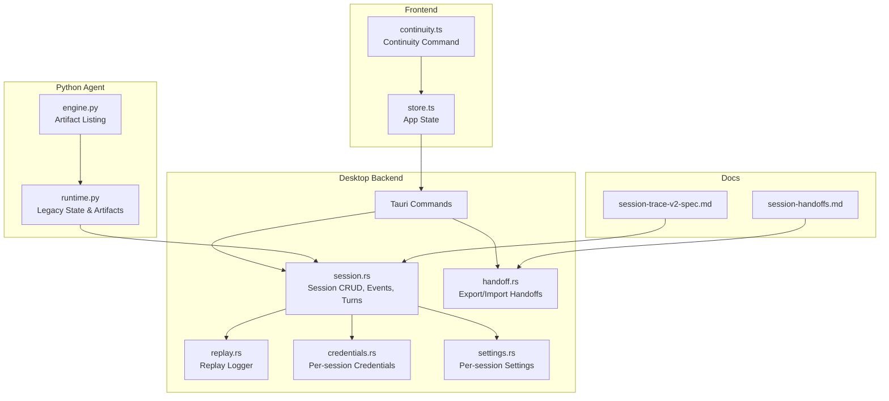

**Diagram sources**
- [session.rs:1-1386](file://openplanter-desktop/crates/op-tauri/src/commands/session.rs#L1-L1386)
- [handoff.rs:1-1265](file://openplanter-desktop/crates/op-tauri/src/commands/handoff.rs#L1-L1265)
- [replay.rs:1-1024](file://openplanter-desktop/crates/op-core/src/session/replay.rs#L1-L1024)
- [credentials.rs:1-68](file://openplanter-desktop/crates/op-core/src/session/credentials.rs#L1-L68)
- [settings.rs:1-97](file://openplanter-desktop/crates/op-core/src/session/settings.rs#L1-L97)
- [runtime.py:335-535](file://agent/runtime.py#L335-L535)
- [engine.py:2160-2191](file://agent/engine.py#L2160-L2191)
- [store.ts:1-186](file://openplanter-desktop/frontend/src/state/store.ts#L1-L186)
- [continuity.ts:1-58](file://openplanter-desktop/frontend/src/commands/continuity.ts#L1-L58)
- [session-trace-v2-spec.md:1-1114](file://docs/session-trace-v2-spec.md#L1-L1114)
- [session-handoffs.md:1-91](file://docs/session-handoffs.md#L1-L91)

**Section sources**
- [session.rs:1-1386](file://openplanter-desktop/crates/op-tauri/src/commands/session.rs#L1-L1386)
- [handoff.rs:1-1265](file://openplanter-desktop/crates/op-tauri/src/commands/handoff.rs#L1-L1265)
- [replay.rs:1-1024](file://openplanter-desktop/crates/op-core/src/session/replay.rs#L1-L1024)
- [credentials.rs:1-68](file://openplanter-desktop/crates/op-core/src/session/credentials.rs#L1-L68)
- [settings.rs:1-97](file://openplanter-desktop/crates/op-core/src/session/settings.rs#L1-L97)
- [runtime.py:335-535](file://agent/runtime.py#L335-L535)
- [engine.py:2160-2191](file://agent/engine.py#L2160-L2191)
- [store.ts:1-186](file://openplanter-desktop/frontend/src/state/store.ts#L1-L186)
- [continuity.ts:1-58](file://openplanter-desktop/frontend/src/commands/continuity.ts#L1-L58)
- [session-trace-v2-spec.md:1-1114](file://docs/session-trace-v2-spec.md#L1-L1114)
- [session-handoffs.md:1-91](file://docs/session-handoffs.md#L1-L91)

## Core Components
- Session metadata and lifecycle: creation, opening (new or resume), deletion, and metadata refresh
- Event and replay logging: canonical envelopes for operational events and curated replay entries
- Turn records: durable per-turn summaries for resumability and handoffs
- Handoff packages: portable checkpoints for collaboration and review
- Replay reader: backward-compatible loader for legacy and v2 formats
- Per-session settings and credentials: isolated overrides and credential references
- Frontend continuity mode: runtime continuity policy persisted in app state

**Section sources**
- [session.rs:348-600](file://openplanter-desktop/crates/op-tauri/src/commands/session.rs#L348-L600)
- [replay.rs:1-143](file://openplanter-desktop/crates/op-core/src/session/replay.rs#L1-L143)
- [handoff.rs:128-265](file://openplanter-desktop/crates/op-tauri/src/commands/handoff.rs#L128-L265)
- [settings.rs:1-97](file://openplanter-desktop/crates/op-core/src/session/settings.rs#L1-L97)
- [credentials.rs:1-68](file://openplanter-desktop/crates/op-core/src/session/credentials.rs#L1-L68)
- [store.ts:130-186](file://openplanter-desktop/frontend/src/state/store.ts#L130-L186)

## Architecture Overview
The session management architecture centers on append-only, durable files and canonical envelopes:
- metadata.json: canonical session header with schema_version, session_format, status, turn_count, continuity_mode, and capability flags
- events.jsonl: operational event stream with canonical envelope and provenance
- replay.jsonl: curated user-facing replay stream with step summaries and provenance
- turns.jsonl: per-turn records for resumability and handoffs
- artifacts/: directory for session-generated artifacts
- Per-session settings.json and credentials.json for overrides and references

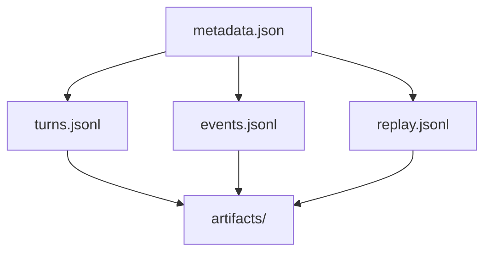

**Diagram sources**
- [session-trace-v2-spec.md:46-90](file://docs/session-trace-v2-spec.md#L46-L90)
- [session.rs:388-416](file://openplanter-desktop/crates/op-tauri/src/commands/session.rs#L388-L416)

**Section sources**
- [session-trace-v2-spec.md:46-90](file://docs/session-trace-v2-spec.md#L46-L90)
- [session.rs:388-416](file://openplanter-desktop/crates/op-tauri/src/commands/session.rs#L388-L416)

## Detailed Component Analysis

### Session Lifecycle API
- Create session: generates unique session_id, initializes metadata, creates artifacts directory
- Open session: supports resume mode by loading existing metadata and updating continuity_mode
- Delete session: removes session directory if it contains metadata.json
- List sessions: scans sessions directory and returns sorted SessionInfo

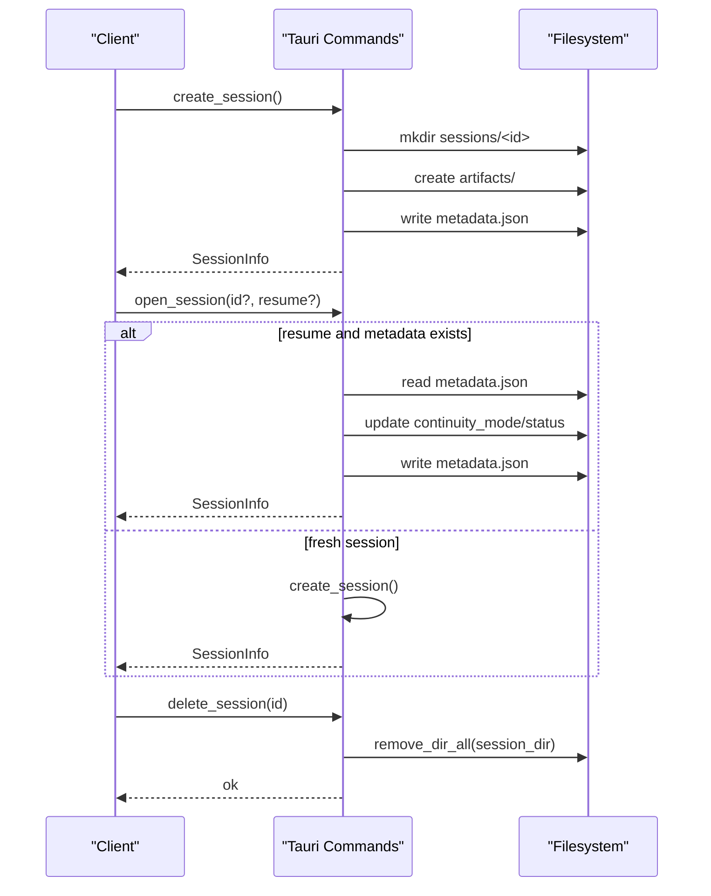

**Diagram sources**
- [session.rs:388-600](file://openplanter-desktop/crates/op-tauri/src/commands/session.rs#L388-L600)

**Section sources**
- [session.rs:388-600](file://openplanter-desktop/crates/op-tauri/src/commands/session.rs#L388-L600)

### Metadata Schema and Validation
- Canonical metadata fields include schema_version, session_format, session_id, timestamps, origin/kind, status, turn_count, continuity_mode, and capability flags
- source_compat and durability flags indicate presence of legacy/desktop files and v2 features
- Validation ensures safe session_id and schema version compatibility

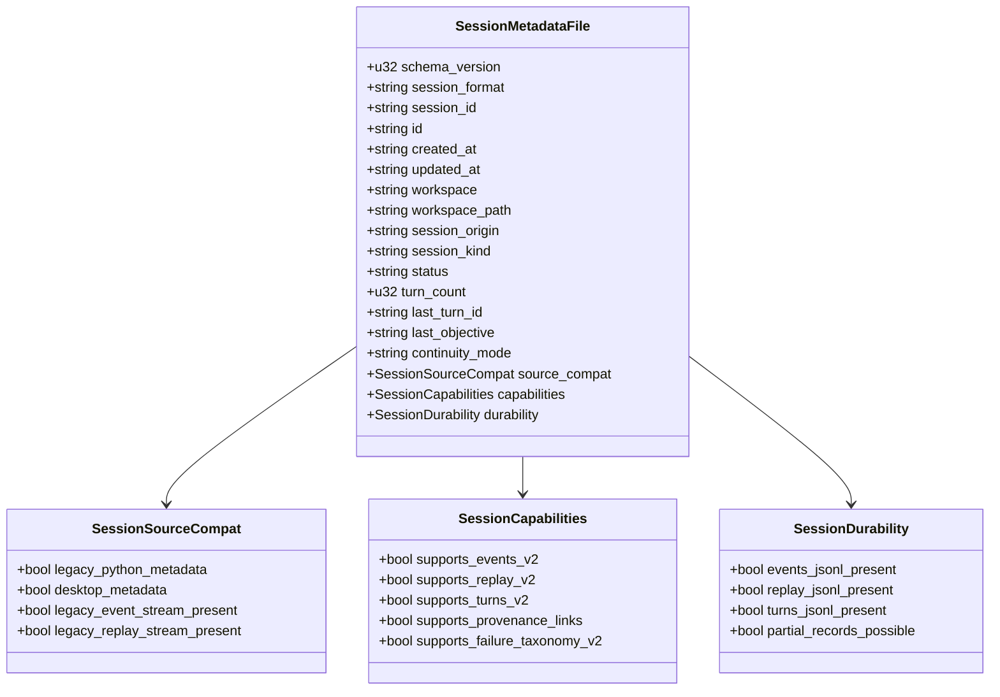

**Diagram sources**
- [session.rs:128-274](file://openplanter-desktop/crates/op-tauri/src/commands/session.rs#L128-L274)

**Section sources**
- [session.rs:128-274](file://openplanter-desktop/crates/op-tauri/src/commands/session.rs#L128-L274)
- [session-trace-v2-spec.md:91-231](file://docs/session-trace-v2-spec.md#L91-L231)

### Event and Replay Logging
- Canonical envelope fields: schema_version, envelope, event_id, session_id, turn_id, seq, recorded_at, event_type, channel, status, actor, payload, failure, provenance, compat
- Replay logger appends entries with monotonic seq, auto-fills timestamps, and tolerates malformed lines
- Replay adapters convert legacy formats (header, call, enveloped entries) to canonical ReplayEntry

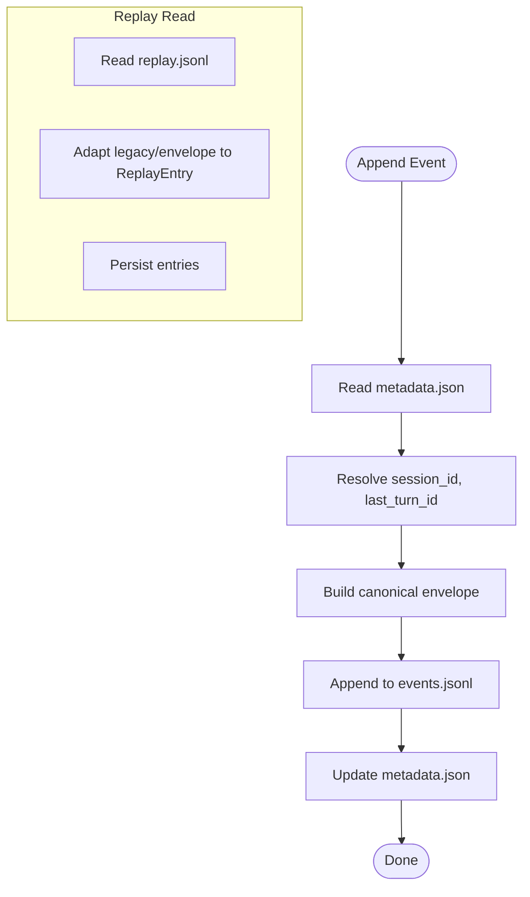

**Diagram sources**
- [session.rs:418-511](file://openplanter-desktop/crates/op-tauri/src/commands/session.rs#L418-L511)
- [replay.rs:50-143](file://openplanter-desktop/crates/op-core/src/session/replay.rs#L50-L143)

**Section sources**
- [session.rs:418-511](file://openplanter-desktop/crates/op-tauri/src/commands/session.rs#L418-L511)
- [replay.rs:50-143](file://openplanter-desktop/crates/op-core/src/session/replay.rs#L50-L143)
- [session-trace-v2-spec.md:246-450](file://docs/session-trace-v2-spec.md#L246-L450)

### Turn Records and Resumability
- Minimum durable per-turn record includes identifiers, timing, objective, continuity, inputs/outputs, execution metrics, outcome, and provenance spans
- Terminal outcomes include completed, failed, cancelled, partial, resumed_from_partial
- Durability rules ensure turns are reconstructable even if process dies between start and terminal events

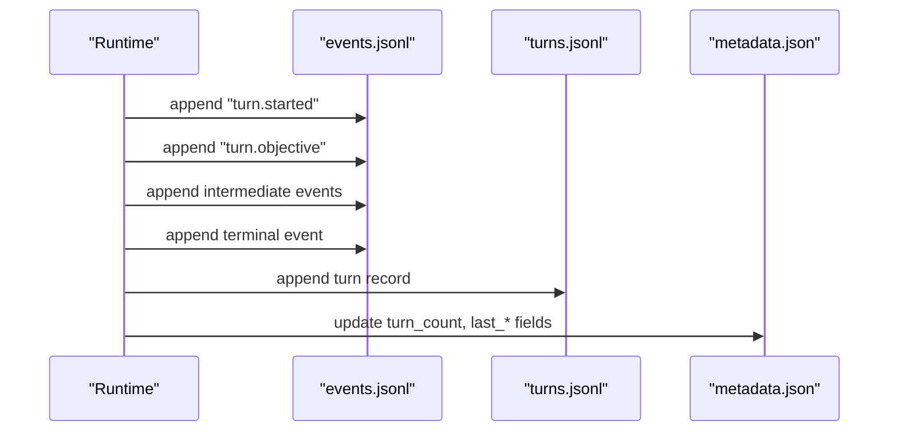

**Diagram sources**
- [session.rs:615-785](file://openplanter-desktop/crates/op-tauri/src/commands/session.rs#L615-L785)
- [session-trace-v2-spec.md:451-558](file://docs/session-trace-v2-spec.md#L451-L558)

**Section sources**
- [session.rs:615-785](file://openplanter-desktop/crates/op-tauri/src/commands/session.rs#L615-L785)
- [session-trace-v2-spec.md:451-558](file://docs/session-trace-v2-spec.md#L451-L558)

### Handoff Packages and Collaboration
- Export handoff: builds package from selected turn, replay span, reasoning packet, and provenance; writes artifact under artifacts/handoffs/
- Import handoff: validates schema/format, resolves target session, copies package, updates metadata continuity_mode, appends curator replay note
- Handoff fields: objective, open_questions, candidate_actions, evidence_index, replay_span, source, provenance, compat

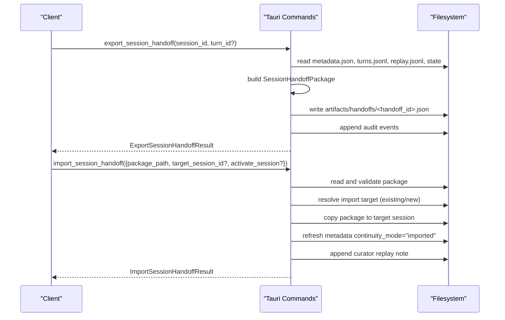

**Diagram sources**
- [handoff.rs:128-265](file://openplanter-desktop/crates/op-tauri/src/commands/handoff.rs#L128-L265)
- [handoff.rs:338-373](file://openplanter-desktop/crates/op-tauri/src/commands/handoff.rs#L338-L373)
- [session-handoffs.md:52-91](file://docs/session-handoffs.md#L52-L91)

**Section sources**
- [handoff.rs:128-265](file://openplanter-desktop/crates/op-tauri/src/commands/handoff.rs#L128-L265)
- [handoff.rs:338-373](file://openplanter-desktop/crates/op-tauri/src/commands/handoff.rs#L338-L373)
- [session-handoffs.md:1-91](file://docs/session-handoffs.md#L1-L91)

### Replay Reader and Backward Compatibility
- Reads replay.jsonl, tolerates malformed lines, auto-fills missing timestamps, and adapts legacy formats to canonical ReplayEntry
- Supports max_seq detection and line-number fallbacks for record_locator

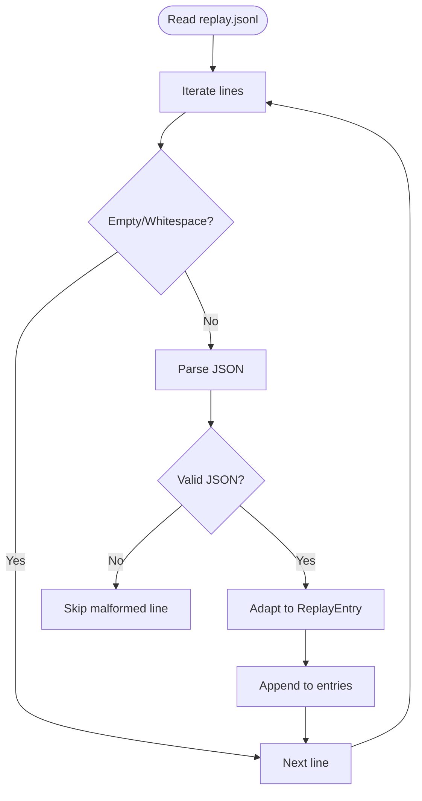

**Diagram sources**
- [replay.rs:118-142](file://openplanter-desktop/crates/op-core/src/session/replay.rs#L118-L142)

**Section sources**
- [replay.rs:118-142](file://openplanter-desktop/crates/op-core/src/session/replay.rs#L118-L142)

### Credential and Settings Persistence
- Per-session settings overlay: optional overrides for provider, model, reasoning_effort, recursive, max_depth, max_steps_per_call
- Per-session credentials reference: stores credential_set name for session-specific credential selection
- User-level credential store persists encrypted bundles with restrictive permissions

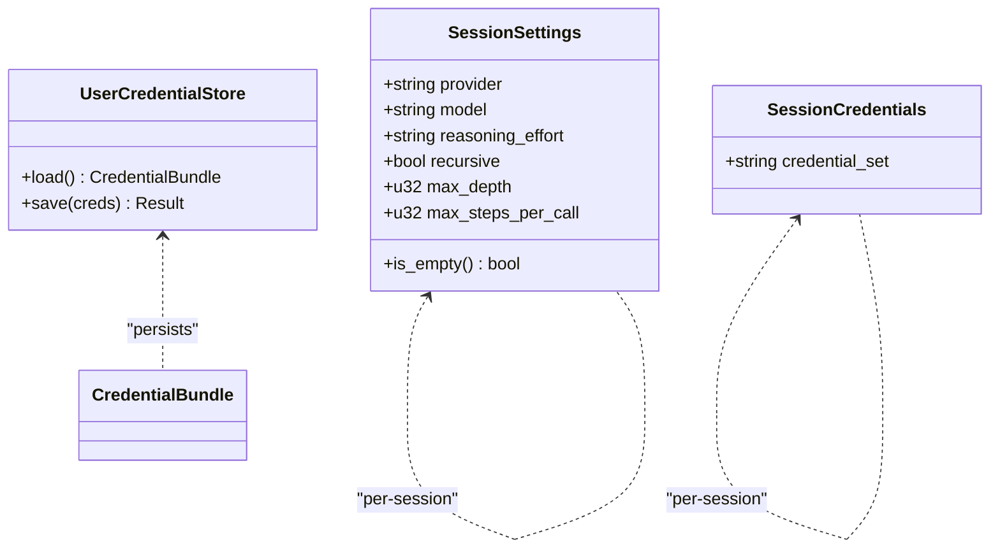

**Diagram sources**
- [settings.rs:10-50](file://openplanter-desktop/crates/op-core/src/session/settings.rs#L10-L50)
- [credentials.rs:9-36](file://openplanter-desktop/crates/op-core/src/session/credentials.rs#L9-L36)
- [credentials.rs:306-380](file://openplanter-desktop/crates/op-core/src/credentials.rs#L306-L380)

**Section sources**
- [settings.rs:1-97](file://openplanter-desktop/crates/op-core/src/session/settings.rs#L1-L97)
- [credentials.rs:1-68](file://openplanter-desktop/crates/op-core/src/session/credentials.rs#L1-L68)
- [credentials.rs:306-380](file://openplanter-desktop/crates/op-core/src/credentials.rs#L306-L380)

### Frontend Continuity Mode
- Continuity command supports modes: auto, fresh, continue
- Updates app state and optionally saves settings
- Integrates with backend continuity_mode for runtime behavior

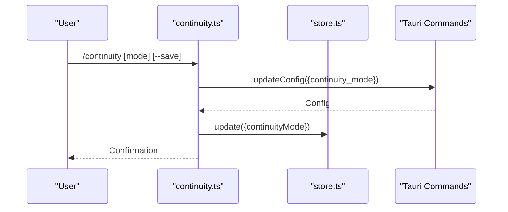

**Diagram sources**
- [continuity.ts:8-57](file://openplanter-desktop/frontend/src/commands/continuity.ts#L8-L57)
- [store.ts:130-186](file://openplanter-desktop/frontend/src/state/store.ts#L130-L186)

**Section sources**
- [continuity.ts:1-58](file://openplanter-desktop/frontend/src/commands/continuity.ts#L1-L58)
- [store.ts:1-186](file://openplanter-desktop/frontend/src/state/store.ts#L1-L186)

### Legacy State and Artifacts (Python Agent)
- Legacy investigation state and artifact management
- Artifact listing and reading utilities
- Backward compatibility with older session formats

**Section sources**
- [runtime.py:335-535](file://agent/runtime.py#L335-L535)
- [engine.py:2160-2191](file://agent/engine.py#L2160-L2191)

## Dependency Analysis
The session management API exhibits clear separation of concerns:
- Tauri commands depend on core replay and session modules for durable logging
- Handoff logic depends on session metadata and replay spans
- Frontend state integrates with backend commands for continuity and session switching
- Tests validate schema compliance, metadata evolution, and legacy compatibility

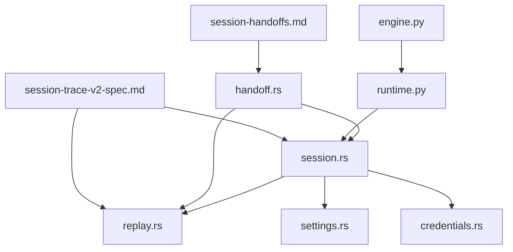

**Diagram sources**
- [session.rs:1-1386](file://openplanter-desktop/crates/op-tauri/src/commands/session.rs#L1-L1386)
- [handoff.rs:1-1265](file://openplanter-desktop/crates/op-tauri/src/commands/handoff.rs#L1-L1265)
- [replay.rs:1-1024](file://openplanter-desktop/crates/op-core/src/session/replay.rs#L1-L1024)
- [settings.rs:1-97](file://openplanter-desktop/crates/op-core/src/session/settings.rs#L1-L97)
- [credentials.rs:1-68](file://openplanter-desktop/crates/op-core/src/session/credentials.rs#L1-L68)
- [runtime.py:335-535](file://agent/runtime.py#L335-L535)
- [engine.py:2160-2191](file://agent/engine.py#L2160-L2191)
- [session-trace-v2-spec.md:1-1114](file://docs/session-trace-v2-spec.md#L1-L1114)
- [session-handoffs.md:1-91](file://docs/session-handoffs.md#L1-L91)

**Section sources**
- [session.rs:1-1386](file://openplanter-desktop/crates/op-tauri/src/commands/session.rs#L1-L1386)
- [handoff.rs:1-1265](file://openplanter-desktop/crates/op-tauri/src/commands/handoff.rs#L1-L1265)
- [replay.rs:1-1024](file://openplanter-desktop/crates/op-core/src/session/replay.rs#L1-L1024)
- [settings.rs:1-97](file://openplanter-desktop/crates/op-core/src/session/settings.rs#L1-L97)
- [credentials.rs:1-68](file://openplanter-desktop/crates/op-core/src/session/credentials.rs#L1-L68)
- [runtime.py:335-535](file://agent/runtime.py#L335-L535)
- [engine.py:2160-2191](file://agent/engine.py#L2160-L2191)
- [session-trace-v2-spec.md:1-1114](file://docs/session-trace-v2-spec.md#L1-L1114)
- [session-handoffs.md:1-91](file://docs/session-handoffs.md#L1-L91)

## Performance Considerations
- Append-only logging minimizes write contention and supports concurrent readers
- Replay and event streams are separated to keep curated replay lightweight
- Sequence number detection scans existing files to avoid renumbering legacy entries
- Per-session settings and credentials are small JSON files; cache where appropriate in higher layers
- Handoff packages are compact snapshots; consider compression for large evidence indices

[No sources needed since this section provides general guidance]

## Troubleshooting Guide
Common issues and resolutions:
- Session not found or not a directory: ensure session_id exists and contains metadata.json
- Malformed replay lines: replay reader skips malformed lines; check upstream writers for envelope compliance
- Resume vs. partial turns: if a terminal event is missing, turns are classified as partial; resume logic handles resumed_from_partial continuity
- Handoff validation failures: verify schema_version, package_format, handoff_id safety, and replay span ordering
- Legacy metadata mapping: canonical fields take precedence; legacy keys are preserved

**Section sources**
- [session.rs:572-600](file://openplanter-desktop/crates/op-tauri/src/commands/session.rs#L572-L600)
- [replay.rs:118-142](file://openplanter-desktop/crates/op-core/src/session/replay.rs#L118-L142)
- [handoff.rs:401-428](file://openplanter-desktop/crates/op-tauri/src/commands/handoff.rs#L401-L428)

## Conclusion
The Session Management API provides a robust, additive, and backwards-compatible foundation for investigation sessions. Its v2 trace contract ensures durability, resumability, and provenance, while handoffs enable collaboration and review. The separation of concerns across backend, core, and frontend layers yields a maintainable and extensible system suitable for complex investigative workflows.

[No sources needed since this section summarizes without analyzing specific files]

## Appendices

### API Reference Index
- Session CRUD: create_session, open_session, delete_session, list_sessions
- Event logging: append_session_event, get_session_history
- Turn lifecycle: update_session_metadata, finalize_session_turn
- Replay: ReplayLogger::read_all, ReplayLogger::max_seq
- Handoffs: export_session_handoff, import_session_handoff
- Settings/Credentials: SessionSettings::load/save, SessionCredentials::load/save
- Frontend: continuity command, app state continuityMode

**Section sources**
- [session.rs:514-785](file://openplanter-desktop/crates/op-tauri/src/commands/session.rs#L514-L785)
- [replay.rs:50-143](file://openplanter-desktop/crates/op-core/src/session/replay.rs#L50-L143)
- [handoff.rs:128-265](file://openplanter-desktop/crates/op-tauri/src/commands/handoff.rs#L128-L265)
- [settings.rs:20-50](file://openplanter-desktop/crates/op-core/src/session/settings.rs#L20-L50)
- [credentials.rs:16-36](file://openplanter-desktop/crates/op-core/src/session/credentials.rs#L16-L36)
- [continuity.ts:8-57](file://openplanter-desktop/frontend/src/commands/continuity.ts#L8-L57)

### Examples and Procedures
- Session manipulation:
  - Create a new session and initialize metadata
  - Resume an existing session and update continuity_mode
  - Delete a session safely by verifying metadata presence
- Backup and restore:
  - Export a handoff package for archival
  - Import a handoff into a new or existing session
- Integration with external storage:
  - Handoff packages are portable JSON artifacts; store under version control or cloud storage
  - Replay and event logs are append-only; suitable for sync to external systems

**Section sources**
- [session.rs:388-600](file://openplanter-desktop/crates/op-tauri/src/commands/session.rs#L388-L600)
- [handoff.rs:128-265](file://openplanter-desktop/crates/op-tauri/src/commands/handoff.rs#L128-L265)
- [session-handoffs.md:52-91](file://docs/session-handoffs.md#L52-L91)