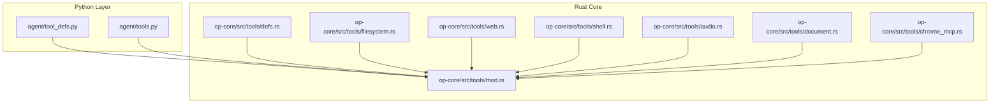
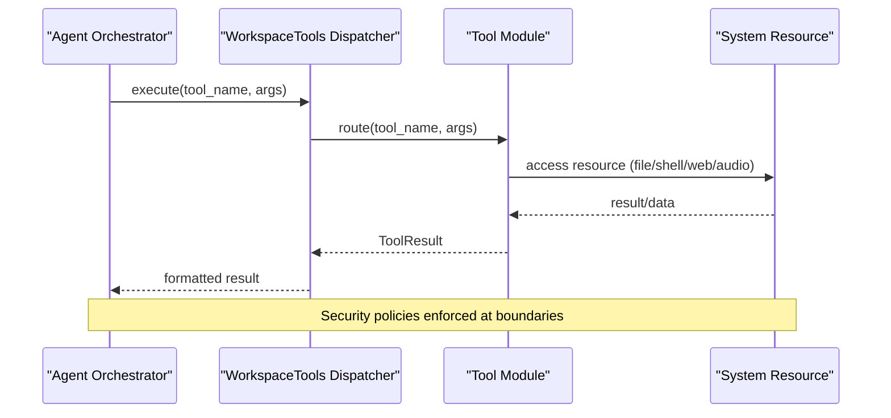
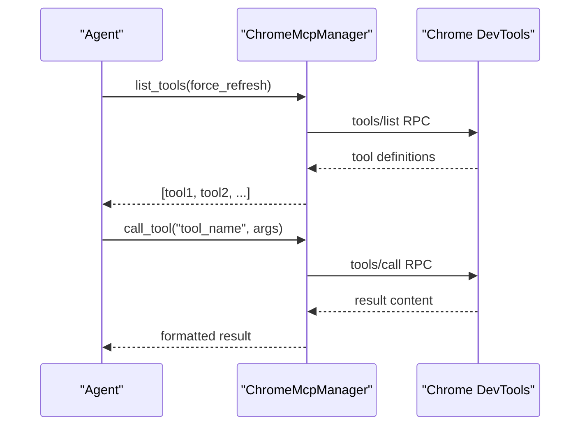
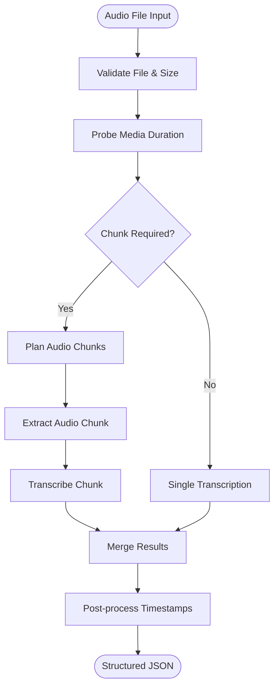
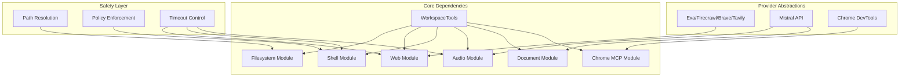

# Tool Definitions

<cite>
**Referenced Files in This Document**
- [tool_defs.py](file://agent/tool_defs.py)
- [tools.py](file://agent/tools.py)
- [defs.rs](file://openplanter-desktop/crates/op-core/src/tools/defs.rs)
- [filesystem.rs](file://openplanter-desktop/crates/op-core/src/tools/filesystem.rs)
- [web.rs](file://openplanter-desktop/crates/op-core/src/tools/web.rs)
- [shell.rs](file://openplanter-desktop/crates/op-core/src/tools/shell.rs)
- [audio.rs](file://openplanter-desktop/crates/op-core/src/tools/audio.rs)
- [document.rs](file://openplanter-desktop/crates/op-core/src/tools/document.rs)
- [chrome_mcp.rs](file://openplanter-desktop/crates/op-core/src/tools/chrome_mcp.rs)
- [mod.rs](file://openplanter-desktop/crates/op-core/src/tools/mod.rs)
</cite>

## Table of Contents
1. [Introduction](#introduction)
2. [Project Structure](#project-structure)
3. [Core Components](#core-components)
4. [Architecture Overview](#architecture-overview)
5. [Detailed Component Analysis](#detailed-component-analysis)
6. [Dependency Analysis](#dependency-analysis)
7. [Performance Considerations](#performance-considerations)
8. [Troubleshooting Guide](#troubleshooting-guide)
9. [Conclusion](#conclusion)

## Introduction
This document provides comprehensive tool definition documentation for the OpenPlanter system. It covers all workspace tools including file operations, web search integration, shell execution with security constraints, Chrome MCP browser automation, audio processing, document AI processing, and filesystem operations. For each tool, we specify the JSON schema definition, parameter validation rules, return value formats, error handling, security restrictions, and practical usage patterns. We also describe tool composition patterns, chaining capabilities, and integration with the investigation workflow.

## Project Structure
The tool definitions are defined in two complementary layers:
- Python provider-neutral definitions for agent orchestration
- Rust core implementation for execution with strong safety and performance guarantees



**Diagram sources**
- [tool_defs.py:1-756](file://agent/tool_defs.py#L1-L756)
- [tools.py:1-800](file://agent/tools.py#L1-L800)
- [defs.rs:1-954](file://openplanter-desktop/crates/op-core/src/tools/defs.rs#L1-L954)
- [mod.rs:1-891](file://openplanter-desktop/crates/op-core/src/tools/mod.rs#L1-L891)

**Section sources**
- [tool_defs.py:1-756](file://agent/tool_defs.py#L1-L756)
- [defs.rs:1-954](file://openplanter-desktop/crates/op-core/src/tools/defs.rs#L1-L954)
- [mod.rs:1-891](file://openplanter-desktop/crates/op-core/src/tools/mod.rs#L1-L891)

## Core Components
OpenPlanter defines 20+ tools organized into functional categories:

### Filesystem Tools
- list_files: Enumerate workspace files with glob filtering
- search_files: Search file contents with ripgrep fallback
- read_file: Read file content with hashline numbering
- write_file: Write content to workspace files
- edit_file: Replace exact text spans in files
- apply_patch: Apply Codex-style patches
- hashline_edit: Edit using hash-anchored line references

### Audio Processing Tools
- audio_transcribe: Offline transcription with Mistral API
- audio_transcription_chunking: Automatic chunking for long-form audio/video

### Document AI Tools
- document_ocr: OCR extraction with sidecar artifacts
- document_annotations: Structured extraction using JSON schemas
- document_qa: Question answering over documents

### Web Search Tools
- web_search: Unified search across Exa, Firecrawl, Brave, Tavily
- fetch_url: Fetch and extract content from URLs

### Shell Execution Tools
- run_shell: Execute commands with timeout and policy enforcement
- run_shell_bg: Background execution with job management
- check_shell_bg: Monitor background job progress
- kill_shell_bg: Terminate background jobs

### Meta Tools
- think: Internal reasoning notes
- subtask/execute: Delegation tools for recursive workflows

**Section sources**
- [tool_defs.py:10-586](file://agent/tool_defs.py#L10-L586)
- [defs.rs:15-755](file://openplanter-desktop/crates/op-core/src/tools/defs.rs#L15-L755)

## Architecture Overview
The tool system follows a layered architecture with clear separation of concerns:



**Diagram sources**
- [mod.rs:282-722](file://openplanter-desktop/crates/op-core/src/tools/mod.rs#L282-L722)
- [tools.py:121-417](file://agent/tools.py#L121-L417)

**Section sources**
- [mod.rs:56-728](file://openplanter-desktop/crates/op-core/src/tools/mod.rs#L56-L728)
- [tools.py:121-417](file://agent/tools.py#L121-L417)

## Detailed Component Analysis

### Filesystem Operations

#### read_file
**Schema Definition:**
```json
{
  "name": "read_file",
  "description": "Read the contents of a file in the workspace",
  "parameters": {
    "type": "object",
    "properties": {
      "path": {"type": "string"},
      "hashline": {"type": "boolean", "default": true}
    },
    "required": ["path"],
    "additionalProperties": false
  }
}
```

**Validation Rules:**
- Path resolution with workspace boundary enforcement
- Hashline numbering for content verification
- Maximum file size clipping (default ~20KB)

**Return Format:** 
- Header with relative path
- Numbered lines with format: `LINENUM:HASH|content`
- Clipped to configured maximum length

**Security Restrictions:**
- Path traversal prevention
- Directory access blocked
- New file creation requires prior read permission

**Usage Pattern:**
```python
# Read with hashline verification
result = await agent.execute("read_file", {
    "path": "analysis/report.md",
    "hashline": True
})

# Read plain text
result = await agent.execute("read_file", {
    "path": "data/input.txt",
    "hashline": False
})
```

**Section sources**
- [tool_defs.py:104-121](file://agent/tool_defs.py#L104-L121)
- [filesystem.rs:77-121](file://openplanter-desktop/crates/op-core/src/tools/filesystem.rs#L77-L121)
- [tools.py:639-661](file://agent/tools.py#L639-L661)

#### write_file
**Schema Definition:**
```json
{
  "name": "write_file",
  "parameters": {
    "type": "object",
    "properties": {
      "path": {"type": "string"},
      "content": {"type": "string"}
    },
    "required": ["path", "content"]
  }
}
```

**Validation Rules:**
- Existing file protection: must be read first
- Directory creation if needed
- Workspace boundary enforcement

**Return Format:**
- Success: "Wrote X chars to path"
- Error: Detailed failure message

**Security Restrictions:**
- Prevents overwriting unverified files
- Path traversal detection
- No interactive editor execution

**Section sources**
- [tool_defs.py:306-323](file://agent/tool_defs.py#L306-L323)
- [filesystem.rs:123-154](file://openplanter-desktop/crates/op-core/src/tools/filesystem.rs#L123-L154)
- [tools.py:639-661](file://agent/tools.py#L639-L661)

### Web Search Integration

#### web_search
**Schema Definition:**
```json
{
  "name": "web_search",
  "parameters": {
    "type": "object",
    "properties": {
      "query": {"type": "string"},
      "num_results": {"type": "integer", "minimum": 1, "maximum": 20, "default": 10},
      "include_text": {"type": "boolean"}
    },
    "required": ["query"],
    "additionalProperties": false
  }
}
```

**Supported Providers:**
- Exa AI: Standard search with highlight text
- Firecrawl: Markdown extraction support
- Brave: Extra snippets support  
- Tavily: Raw content extraction

**Return Format:**
```json
{
  "query": "string",
  "provider": "string",
  "results": [
    {
      "url": "string",
      "title": "string", 
      "snippet": "string",
      "text": "string"  // optional
    }
  ],
  "total": 0
}
```

**Security & Rate Limiting:**
- API key validation per provider
- Request timeout enforcement
- Content length limits (4KB snippets, 8KB full text)

**Section sources**
- [tool_defs.py:65-86](file://agent/tool_defs.py#L65-L86)
- [web.rs:269-552](file://openplanter-desktop/crates/op-core/src/tools/web.rs#L269-L552)

#### fetch_url
**Schema Definition:**
```json
{
  "name": "fetch_url", 
  "parameters": {
    "type": "object",
    "properties": {
      "urls": {
        "type": "array", 
        "items": {"type": "string"}
      }
    },
    "required": ["urls"]
  }
}
```

**Return Format:**
```json
{
  "provider": "string",
  "pages": [
    {
      "url": "string",
      "title": "string",
      "text": "string"
    }
  ],
  "total": 0
}
```

**Section sources**
- [tool_defs.py:88-102](file://agent/tool_defs.py#L88-L102)
- [web.rs:554-728](file://openplanter-desktop/crates/op-core/src/tools/web.rs#L554-L728)

### Shell Execution with Security Constraints

#### run_shell
**Schema Definition:**
```json
{
  "name": "run_shell",
  "parameters": {
    "type": "object",
    "properties": {
      "command": {"type": "string"},
      "timeout": {"type": "integer", "minimum": 1, "maximum": 600}
    },
    "required": ["command"]
  }
}
```

**Security Policy Enforcement:**
- Blocks heredoc syntax (`<< EOF`)
- Blocks interactive editors (vim, nano, less, more, top, htop, man)
- Enforces workspace directory context
- Implements process group termination on timeout

**Return Format:**
```
$ command
[exit_code=N]
[stdout]
output...
[stderr]  
error...
```

**Section sources**
- [tool_defs.py:420-437](file://agent/tool_defs.py#L420-L437)
- [shell.rs:79-135](file://openplanter-desktop/crates/op-core/src/tools/shell.rs#L79-L135)
- [tools.py:253-286](file://agent/tools.py#L253-L286)

#### Background Job Management
- run_shell_bg: Start background processes with job ID
- check_shell_bg: Monitor job progress and output
- kill_shell_bg: Terminate running jobs

**Section sources**
- [tool_defs.py:439-482](file://agent/tool_defs.py#L439-L482)
- [shell.rs:137-225](file://openplanter-desktop/crates/op-core/src/tools/shell.rs#L137-L225)

### Chrome MCP Browser Automation

#### Dynamic Tool Integration
Chrome MCP enables dynamic tool discovery and execution:



**Diagram sources**
- [chrome_mcp.rs:127-167](file://openplanter-desktop/crates/op-core/src/tools/chrome_mcp.rs#L127-L167)

**Section sources**
- [chrome_mcp.rs:1-595](file://openplanter-desktop/crates/op-core/src/tools/chrome_mcp.rs#L1-L595)
- [mod.rs:691-710](file://openplanter-desktop/crates/op-core/src/tools/mod.rs#L691-L710)

### Audio Processing

#### audio_transcribe
**Schema Definition:**
```json
{
  "name": "audio_transcribe",
  "parameters": {
    "type": "object",
    "properties": {
      "path": {"type": "string"},
      "diarize": {"type": "boolean"},
      "timestamp_granularities": {"type": "array", "items": {"type": "string"}},
      "context_bias": {"type": "array", "items": {"type": "string"}},
      "language": {"type": "string"},
      "model": {"type": "string"},
      "temperature": {"type": "number"},
      "chunking": {"type": "string", "enum": ["auto", "off", "force"]},
      "chunk_max_seconds": {"type": "integer"},
      "chunk_overlap_seconds": {"type": "number"},
      "max_chunks": {"type": "integer"},
      "continue_on_chunk_error": {"type": "boolean"}
    },
    "required": ["path"]
  }
}
```

**Processing Pipeline:**


**Diagram sources**
- [audio.rs:384-429](file://openplanter-desktop/crates/op-core/src/tools/audio.rs#L384-L429)

**Section sources**
- [tool_defs.py:138-202](file://agent/tool_defs.py#L138-L202)
- [audio.rs:797-800](file://openplanter-desktop/crates/op-core/src/tools/audio.rs#L797-L800)

### Document AI Processing

#### document_ocr
**Schema Definition:**
```json
{
  "name": "document_ocr",
  "parameters": {
    "type": "object",
    "properties": {
      "path": {"type": "string"},
      "include_images": {"type": "boolean"},
      "pages": {"type": "array", "items": {"type": "integer"}},
      "model": {"type": "string"}
    },
    "required": ["path"]
  }
}
```

**Sidecar Artifact Generation:**
- Markdown preview with page breaks
- JSON envelope with response metadata
- Automatic cleanup of sensitive image data

**Section sources**
- [tool_defs.py:204-234](file://agent/tool_defs.py#L204-L234)
- [document.rs:773-800](file://openplanter-desktop/crates/op-core/src/tools/document.rs#L773-L800)

### Tool Composition Patterns

#### Investigation Workflow Integration


#### Chaining Capabilities
- Output from web_search feeds into fetch_url
- OCR results can be cached as sidecar artifacts
- Audio transcriptions integrate with document processing
- Shell commands can process extracted data

**Section sources**
- [tool_defs.py:10-586](file://agent/tool_defs.py#L10-L586)

## Dependency Analysis



**Diagram sources**
- [mod.rs:56-728](file://openplanter-desktop/crates/op-core/src/tools/mod.rs#L56-L728)
- [defs.rs:15-755](file://openplanter-desktop/crates/op-core/src/tools/defs.rs#L15-L755)

**Section sources**
- [mod.rs:1-891](file://openplanter-desktop/crates/op-core/src/tools/mod.rs#L1-L891)
- [defs.rs:1-954](file://openplanter-desktop/crates/op-core/src/tools/defs.rs#L1-L954)

## Performance Considerations
- **File Operations**: Ripgrep-based search for large repositories; fallback to filesystem walking with entry limits
- **Memory Management**: Streaming responses from external APIs; configurable truncation thresholds
- **Concurrency**: Background job management with automatic cleanup; parallel write claims for coordination
- **Network Efficiency**: Provider-specific optimizations; caching of OCR artifacts
- **Resource Limits**: Hard caps on file sizes, output lengths, and command timeouts

## Troubleshooting Guide

### Common Issues and Solutions

#### Path Resolution Errors
- **Symptom**: "Path escapes workspace" errors
- **Cause**: Attempted traversal outside workspace root
- **Solution**: Use relative paths within workspace; avoid `../` sequences

#### API Key Configuration
- **Symptom**: "X_API_KEY not configured" errors
- **Cause**: Missing environment variables for external providers
- **Solution**: Set appropriate API keys for selected providers

#### Timeout Issues
- **Symptom**: Commands terminated with timeout
- **Cause**: Long-running operations or network delays
- **Solution**: Increase timeout values; use background execution for long tasks

#### Permission Denied
- **Symptom**: Write operations blocked
- **Cause**: Attempting to overwrite files without prior read
- **Solution**: Read file first, then write; use proper edit operations

**Section sources**
- [filesystem.rs:25-75](file://openplanter-desktop/crates/op-core/src/tools/filesystem.rs#L25-L75)
- [shell.rs:27-43](file://openplanter-desktop/crates/op-core/src/tools/shell.rs#L27-L43)
- [web.rs:61-96](file://openplanter-desktop/crates/op-core/src/tools/web.rs#L61-L96)

## Conclusion
OpenPlanter's tool system provides a comprehensive, secure, and extensible foundation for investigative workflows. The dual-layer architecture ensures both flexibility and safety, while the extensive schema definitions and validation rules enable reliable automation. The integration patterns described here support complex research workflows from initial web research through document processing and final reporting, with robust error handling and security enforcement throughout.