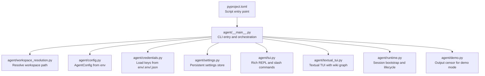
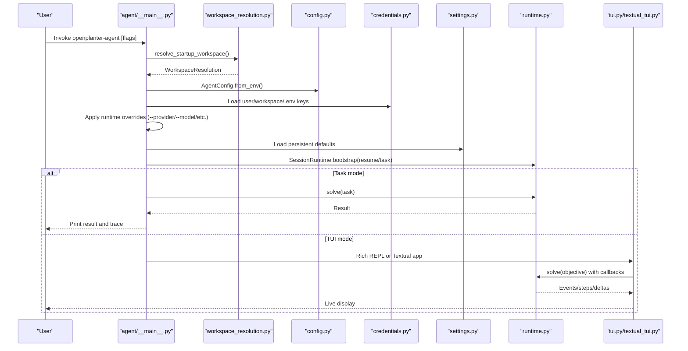
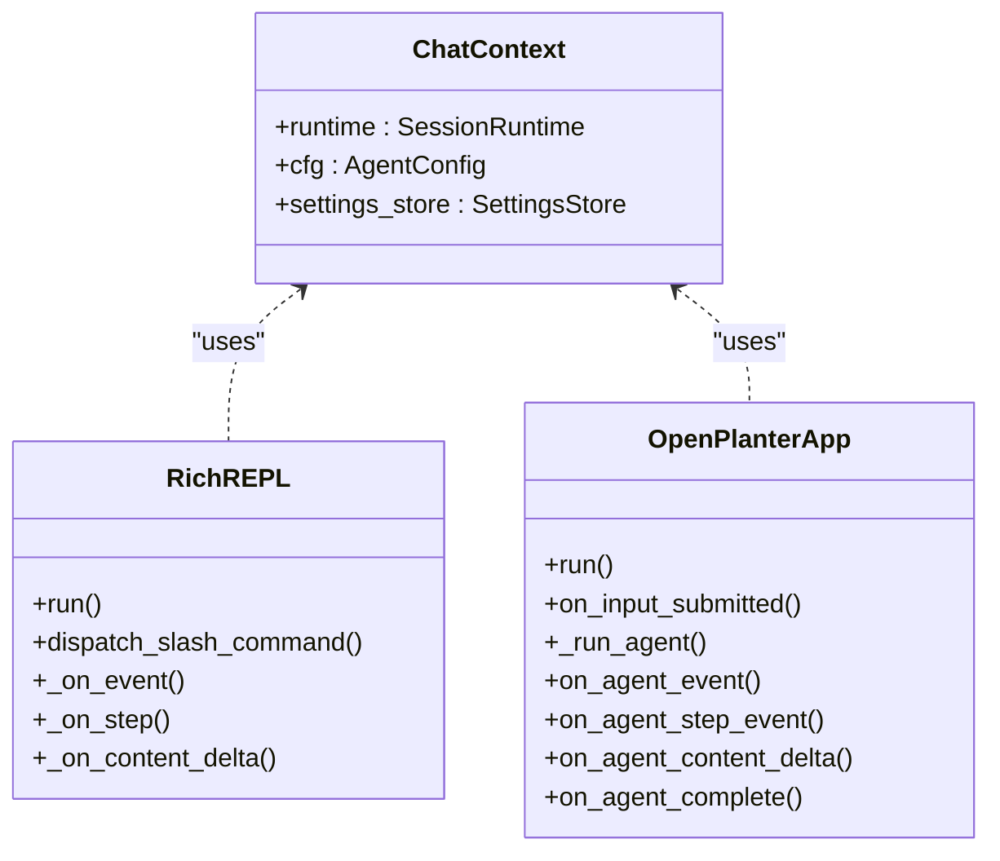
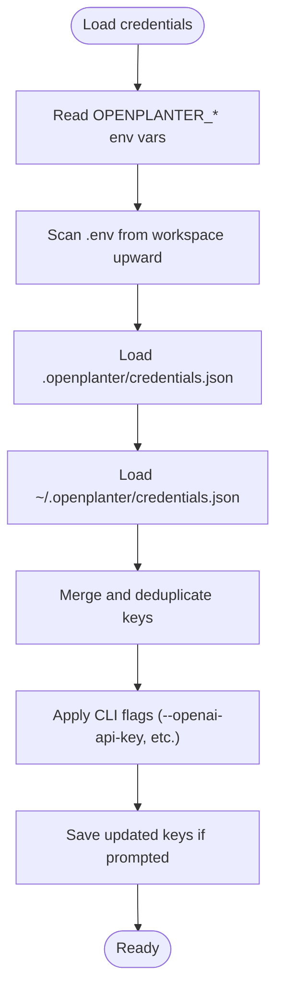
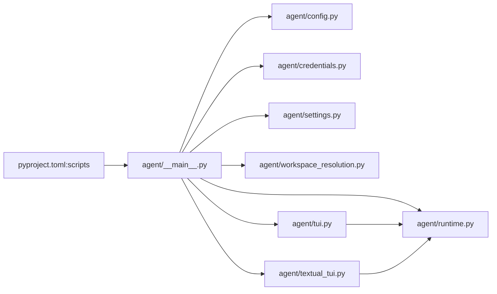

# CLI Agent Usage

<cite>
**Referenced Files in This Document**
- [README.md](file://README.md)
- [pyproject.toml](file://pyproject.toml)
- [agent/__main__.py](file://agent/__main__.py)
- [agent/config.py](file://agent/config.py)
- [agent/settings.py](file://agent/settings.py)
- [agent/credentials.py](file://agent/credentials.py)
- [agent/workspace_resolution.py](file://agent/workspace_resolution.py)
- [agent/tui.py](file://agent/tui.py)
- [agent/textual_tui.py](file://agent/textual_tui.py)
- [agent/demo.py](file://agent/demo.py)
- [tests/test_tui_repl.py](file://tests/test_tui_repl.py)
- [tests/test_settings.py](file://tests/test_settings.py)
</cite>

## Table of Contents
1. [Introduction](#introduction)
2. [Project Structure](#project-structure)
3. [Core Components](#core-components)
4. [Architecture Overview](#architecture-overview)
5. [Detailed Component Analysis](#detailed-component-analysis)
6. [Dependency Analysis](#dependency-analysis)
7. [Performance Considerations](#performance-considerations)
8. [Troubleshooting Guide](#troubleshooting-guide)
9. [Conclusion](#conclusion)
10. [Appendices](#appendices)

## Introduction
This document explains the Python-based CLI agent for OpenPlanter, focusing on the terminal user interface (TUI), headless operation, and interactive REPL capabilities. It covers configuration management via environment variables, .env files, and persistent settings, along with a comprehensive command-line reference. Practical workflows demonstrate single-task execution, recursive investigations, and automated scripting. It also addresses credential management, session persistence, and integration with the desktop application.

## Project Structure
The CLI agent is implemented as a Python package with a single entry point script. The primary runtime orchestrates workspace resolution, configuration loading, credential discovery, engine building, and session lifecycle. Two UI modes are supported: a Rich-based REPL and a Textual-based TUI with a wiki graph panel. Persistent settings and credentials are stored under the workspace’s session directory.

**Diagram sources**
- [pyproject.toml:30-31](file://pyproject.toml#L30-L31)
- [agent/__main__.py:708-907](file://agent/__main__.py#L708-L907)
- [agent/workspace_resolution.py:31-99](file://agent/workspace_resolution.py#L31-L99)
- [agent/config.py:262-494](file://agent/config.py#L262-L494)
- [agent/credentials.py:292-351](file://agent/credentials.py#L292-L351)
- [agent/settings.py:198-225](file://agent/settings.py#L198-L225)
- [agent/tui.py:505-567](file://agent/tui.py#L505-L567)
- [agent/textual_tui.py:785-789](file://agent/textual_tui.py#L785-L789)
- [agent/demo.py:29-71](file://agent/demo.py#L29-L71)

**Section sources**
- [README.md:375-407](file://README.md#L375-L407)
- [pyproject.toml:30-31](file://pyproject.toml#L30-L31)
- [agent/__main__.py:708-907](file://agent/__main__.py#L708-L907)

## Core Components
- CLI entry and orchestration: parses arguments, resolves workspace, loads credentials, applies overrides, builds engine, boots session, and selects UI mode.
- Configuration: AgentConfig reads environment variables and normalizes values, including provider selection, model, reasoning effort, base URLs, and runtime knobs.
- Credentials: Priority across CLI flags, environment variables, .env files, workspace credentials.json, and user credentials.json.
- Persistent settings: Save and load defaults for model, reasoning effort, embeddings provider, and Chrome MCP settings.
- UI modes: Rich REPL (with slash commands), Textual TUI (with wiki graph), and plain REPL fallback.
- Session lifecycle: Bootstrap, resume, and persist sessions with structured metadata and traces.

**Section sources**
- [agent/__main__.py:41-225](file://agent/__main__.py#L41-L225)
- [agent/config.py:146-494](file://agent/config.py#L146-L494)
- [agent/credentials.py:12-351](file://agent/credentials.py#L12-L351)
- [agent/settings.py:70-225](file://agent/settings.py#L70-L225)
- [agent/tui.py:505-567](file://agent/tui.py#L505-L567)
- [agent/textual_tui.py:785-789](file://agent/textual_tui.py#L785-L789)

## Architecture Overview
The CLI agent follows a layered design:
- Argument parsing and orchestration
- Workspace resolution and guardrails
- Configuration hydration from environment and defaults
- Credential discovery and persistence
- Engine and session bootstrap
- UI dispatch and user interaction
- Slash commands for dynamic configuration

**Diagram sources**
- [agent/__main__.py:708-907](file://agent/__main__.py#L708-L907)
- [agent/workspace_resolution.py:31-99](file://agent/workspace_resolution.py#L31-L99)
- [agent/config.py:262-494](file://agent/config.py#L262-L494)
- [agent/credentials.py:292-351](file://agent/credentials.py#L292-L351)
- [agent/settings.py:198-225](file://agent/settings.py#L198-L225)
- [agent/tui.py:505-567](file://agent/tui.py#L505-L567)
- [agent/textual_tui.py:785-789](file://agent/textual_tui.py#L785-L789)

## Detailed Component Analysis

### Terminal User Interface (TUI) and REPL
- Rich REPL: Full-featured interactive mode with live activity display, tool call previews, and slash commands. Supports input queuing while an agent is running.
- Textual TUI: Widget-based layout with a chat pane and a wiki knowledge graph panel. Provides richer visual feedback and a dedicated graph view.
- Plain REPL: Minimal mode without colors or spinner, suitable for non-interactive environments.
- Slash commands: Dynamic configuration for model, reasoning effort, embeddings provider, and Chrome MCP settings, with optional persistence to settings.

**Diagram sources**
- [agent/tui.py:158-163](file://agent/tui.py#L158-L163)
- [agent/tui.py:505-567](file://agent/tui.py#L505-L567)
- [agent/textual_tui.py:341-401](file://agent/textual_tui.py#L341-L401)

**Section sources**
- [agent/tui.py:505-567](file://agent/tui.py#L505-L567)
- [agent/textual_tui.py:785-789](file://agent/textual_tui.py#L785-L789)
- [tests/test_tui_repl.py:231-333](file://tests/test_tui_repl.py#L231-L333)

### Headless Operation and Single-Task Execution
- Headless mode: Requires --task and prints startup info and trace events before printing the final result.
- Non-interactive guardrails: If stdin/stdout are not TTY and --textual is not specified, the agent enforces non-interactive commands or exits with guidance.
- Trace clipping: Long trace lines are truncated for readability.

**Section sources**
- [agent/__main__.py:866-873](file://agent/__main__.py#L866-L873)
- [agent/__main__.py:719-721](file://agent/__main__.py#L719-L721)
- [agent/tui.py:585-596](file://agent/tui.py#L585-L596)

### Interactive REPL Capabilities
- Slash commands: /model, /reasoning, /embeddings, /chrome, /status, /clear, /help, /quit.
- Command dispatch: Parses and executes commands, optionally rebuilding the engine or saving defaults.
- Demo mode: Optional censoring of workspace path segments in UI output.

**Section sources**
- [agent/tui.py:20-30](file://agent/tui.py#L20-L30)
- [agent/tui.py:505-567](file://agent/tui.py#L505-L567)
- [agent/demo.py:29-71](file://agent/demo.py#L29-L71)

### Configuration Management
- Environment variables: OPENPLANTER_* keys for models, providers, base URLs, search providers, embeddings, Chrome MCP, and runtime parameters.
- .env files: Discovered from the resolved workspace upward; merged into credentials.
- Persistent settings: Stored in .openplanter/settings.json; supports defaults for model, reasoning effort, embeddings provider, and Chrome MCP.
- CLI flags: Highest precedence; override environment and persisted settings for the current run.

**Diagram sources**
- [agent/credentials.py:223-278](file://agent/credentials.py#L223-L278)
- [agent/credentials.py:180-221](file://agent/credentials.py#L180-L221)
- [agent/credentials.py:304-321](file://agent/credentials.py#L304-L321)
- [agent/credentials.py:343-350](file://agent/credentials.py#L343-L350)
- [agent/__main__.py:281-416](file://agent/__main__.py#L281-L416)

**Section sources**
- [agent/config.py:262-494](file://agent/config.py#L262-L494)
- [agent/credentials.py:12-351](file://agent/credentials.py#L12-L351)
- [agent/settings.py:198-225](file://agent/settings.py#L198-L225)
- [agent/__main__.py:553-646](file://agent/__main__.py#L553-L646)

### Workspace Resolution and Guardrails
- Resolution order: CLI --workspace, OPENPLANTER_WORKSPACE in process env, OPENPLANTER_WORKSPACE in nearest .env, current working directory.
- Guardrails: Rejects repository root as workspace; redirects to <repo>/workspace if present.

**Section sources**
- [agent/workspace_resolution.py:31-99](file://agent/workspace_resolution.py#L31-L99)
- [README.md:307-323](file://README.md#L307-L323)

### Session Persistence and Lifecycle
- Sessions are bootstrapped and resumed with structured metadata and traces.
- Session IDs are generated or reused; sessions are listed and managed via CLI.

**Section sources**
- [agent/__main__.py:822-830](file://agent/__main__.py#L822-L830)
- [agent/__main__.py:740-754](file://agent/__main__.py#L740-L754)

### Chrome DevTools MCP Integration
- Native Chrome MCP tools can be enabled/disabled and attached via auto-connect or explicit browser URL.
- Slash command /chrome supports status, on/off, auto, url, channel, and persistence.

**Section sources**
- [agent/tui.py:441-502](file://agent/tui.py#L441-L502)
- [agent/textual_tui.py:487-517](file://agent/textual_tui.py#L487-L517)
- [README.md:247-291](file://README.md#L247-L291)

### Command-Line Reference
- Workspace and session
  - --workspace DIR: Explicit workspace directory (non-root).
  - --session-id ID: Use a specific session ID.
  - --resume: Resume the latest or specified session.
  - --list-sessions: List saved sessions and exit.
- Model selection
  - --provider NAME: auto, openai, anthropic, openrouter, cerebras, zai, ollama.
  - --model NAME: Model name or newest.
  - --embeddings-provider NAME: voyage or mistral.
  - --openai-oauth-token TOKEN: ChatGPT Plus/Teams/Pro OAuth bearer token for OpenAI-compatible models.
  - --zai-plan PLAN: paygo or coding.
  - --reasoning-effort LEVEL: low, medium, high, none.
  - --list-models: List provider models.
- Execution
  - --task OBJECTIVE: Run a single task and exit (headless).
  - --recursive: Enable recursive sub-agent delegation.
  - --acceptance-criteria: Judge subtask results with a lightweight model.
  - --max-depth N: Maximum recursion depth.
  - --max-steps N: Maximum steps per call.
  - --timeout N: Shell command timeout in seconds.
- UI
  - --no-tui: Plain REPL (no colors/spinner).
  - --headless: Non-interactive mode (CI).
  - --textual: Force Textual TUI (requires extra dependencies).
  - --demo: Censor entity names and workspace paths in output.
- Chrome MCP
  - --chrome-mcp/--no-chrome-mcp: Toggle native Chrome MCP tools.
  - --chrome-auto-connect/--no-chrome-auto-connect: Auto-connect vs explicit URL.
  - --chrome-browser-url URL: Attach to an existing remote debugging endpoint.
  - --chrome-channel CHANNEL: stable, beta, dev, canary.
- Persistent defaults
  - --default-model, --default-reasoning-effort, --embeddings-provider, and per-provider variants.
  - --show-settings: Show persistent defaults and exit (unless task/list is also provided).

**Section sources**
- [agent/__main__.py:41-225](file://agent/__main__.py#L41-L225)
- [README.md:292-362](file://README.md#L292-L362)

### Practical Workflows
- Single-task execution (headless)
  - Example: Run a task with a specific provider and model, printing startup info and trace events.
- Recursive investigation
  - Enable --recursive and configure acceptance criteria for subtask verification.
- Automated scripting
  - Use --task in CI with --headless and appropriate timeouts.
- Interactive exploration
  - Launch TUI with --textual for the wiki graph panel or fall back to Rich REPL.

**Section sources**
- [agent/__main__.py:866-873](file://agent/__main__.py#L866-L873)
- [agent/__main__.py:883-903](file://agent/__main__.py#L883-L903)
- [README.md:75-81](file://README.md#L75-L81)

## Dependency Analysis
- Script entry point maps to the CLI entry function.
- The CLI depends on configuration, credentials, settings, workspace resolution, runtime, and UI modules.
- UI modules depend on the runtime engine and configuration for rendering and behavior.

**Diagram sources**
- [pyproject.toml:30-31](file://pyproject.toml#L30-L31)
- [agent/__main__.py:708-907](file://agent/__main__.py#L708-L907)

**Section sources**
- [pyproject.toml:30-31](file://pyproject.toml#L30-L31)
- [agent/__main__.py:708-907](file://agent/__main__.py#L708-L907)

## Performance Considerations
- Rate limiting and retries: Z.AI reliability tuning with configurable max retries and backoff caps.
- Streaming resilience: Additional retries for Z.AI stream failures.
- Context windows and token accounting: Engine tracks input/output tokens per step.
- Chunked audio transcription: Automatic chunking for long-form audio with overlap and max chunks.

**Section sources**
- [README.md:150-162](file://README.md#L150-L162)
- [agent/tui.py:176-182](file://agent/tui.py#L176-L182)
- [README.md:181-225](file://README.md#L181-L225)

## Troubleshooting Guide
- No API keys configured
  - Use --configure-keys to interactively set keys, or set OPENPLANTER_* environment variables.
  - Verify .env files and credential stores (.openplanter/credentials.json and ~/.openplanter/credentials.json).
- Provider mismatch
  - If a model implies a different provider, ensure the corresponding key is configured; otherwise, the agent refuses to switch.
- Workspace guardrail
  - Do not run directly in repository root; redirect to <repo>/workspace or set OPENPLANTER_WORKSPACE.
- Non-interactive mode
  - For CI, use --task or a non-interactive command; otherwise, the agent exits with guidance.
- Textual TUI unavailable
  - Install optional dependencies: pip install openplanter-agent[textual].
- Chrome MCP issues
  - Ensure Node.js/npm is available and Chrome remote debugging is enabled; adjust auto-connect or browser URL as needed.

**Section sources**
- [agent/__main__.py:406-416](file://agent/__main__.py#L406-L416)
- [agent/__main__.py:800-811](file://agent/__main__.py#L800-L811)
- [agent/workspace_resolution.py:124-135](file://agent/workspace_resolution.py#L124-L135)
- [agent/__main__.py:719-721](file://agent/__main__.py#L719-L721)
- [agent/__main__.py:889-892](file://agent/__main__.py#L889-L892)
- [README.md:247-291](file://README.md#L247-L291)

## Conclusion
The OpenPlanter CLI agent provides flexible, robust operation across interactive and headless scenarios. Its layered configuration system, comprehensive credential management, and rich UI options enable efficient automation and deep investigation workflows. Persistent settings streamline repeated tasks, while strict guardrails and clear troubleshooting guidance improve safety and operability.

## Appendices

### Environment Variables and CLI Flags Summary
- Provider and model
  - OPENPLANTER_PROVIDER, OPENPLANTER_MODEL, OPENPLANTER_REASONING_EFFORT, OPENPLANTER_EMBEDDINGS_PROVIDER
  - --provider, --model, --reasoning-effort, --embeddings-provider
- Provider base URLs
  - OPENPLANTER_OPENAI_BASE_URL, OPENPLANTER_ANTHROPIC_BASE_URL, OPENPLANTER_OPENROUTER_BASE_URL, OPENPLANTER_CEREBRAS_BASE_URL, OPENPLANTER_ZAI_BASE_URL, OPENPLANTER_OLLAMA_BASE_URL
  - --base-url
- API keys
  - OPENPLANTER_OPENAI_API_KEY, OPENPLANTER_OPENAI_OAUTH_TOKEN, OPENPLANTER_ANTHROPIC_API_KEY, OPENPLANTER_OPENROUTER_API_KEY, OPENPLANTER_CEREBRAS_API_KEY, OPENPLANTER_ZAI_API_KEY, OPENPLANTER_EXA_API_KEY, OPENPLANTER_FIRECRAWL_API_KEY, OPENPLANTER_BRAVE_API_KEY, OPENPLANTER_TAVILY_API_KEY, OPENPLANTER_VOYAGE_API_KEY, OPENPLANTER_MISTRAL_API_KEY, OPENPLANTER_MISTRAL_DOCUMENT_AI_API_KEY, OPENPLANTER_MISTRAL_TRANSCRIPTION_API_KEY
  - --openai-api-key, --openai-oauth-token, --anthropic-api-key, --openrouter-api-key, --cerebras-api-key, --zai-api-key, --exa-api-key, --firecrawl-api-key, --brave-api-key, --tavily-api-key, --voyage-api-key, --mistral-api-key, --mistral-document-ai-api-key, --mistral-transcription-api-key
- Web search and embeddings
  - OPENPLANTER_WEB_SEARCH_PROVIDER, OPENPLANTER_EMBEDDINGS_PROVIDER
  - --web-search-provider, --embeddings-provider
- Chrome MCP
  - OPENPLANTER_CHROME_MCP_ENABLED, OPENPLANTER_CHROME_MCP_AUTO_CONNECT, OPENPLANTER_CHROME_MCP_BROWSER_URL, OPENPLANTER_CHROME_MCP_CHANNEL, OPENPLANTER_CHROME_MCP_CONNECT_TIMEOUT_SEC, OPENPLANTER_CHROME_MCP_RPC_TIMEOUT_SEC
  - --chrome-mcp/--no-chrome-mcp, --chrome-auto-connect/--no-chrome-auto-connect, --chrome-browser-url, --chrome-channel
- Runtime parameters
  - OPENPLANTER_MAX_DEPTH, OPENPLANTER_MAX_STEPS, OPENPLANTER_CMD_TIMEOUT, OPENPLANTER_SHELL, OPENPLANTER_MAX_FILES, OPENPLANTER_MAX_FILE_CHARS, OPENPLANTER_MAX_SEARCH_HITS, OPENPLANTER_MAX_SHELL_CHARS, OPENPLANTER_SESSION_DIR, OPENPLANTER_MAX_PERSISTED_OBS, OPENPLANTER_MAX_SOLVE_SECONDS, OPENPLANTER_RATE_LIMIT_MAX_RETRIES, OPENPLANTER_ZAI_STREAM_MAX_RETRIES, OPENPLANTER_RATE_LIMIT_BACKOFF_BASE_SEC, OPENPLANTER_RATE_LIMIT_BACKOFF_MAX_SEC, OPENPLANTER_RATE_LIMIT_RETRY_AFTER_CAP_SEC, OPENPLANTER_RECURSIVE, OPENPLANTER_RECURSION_POLICY, OPENPLANTER_MIN_SUBTASK_DEPTH, OPENPLANTER_ACCEPTANCE_CRITERIA, OPENPLANTER_MAX_PLAN_CHARS, OPENPLANTER_MAX_TURN_SUMMARIES, OPENPLANTER_DEMO
  - --max-depth, --max-steps, --timeout, --shell, --list-models, --recursive, --acceptance-criteria, --demo
- Workspace
  - OPENPLANTER_WORKSPACE
  - --workspace

**Section sources**
- [agent/config.py:262-494](file://agent/config.py#L262-L494)
- [agent/credentials.py:223-278](file://agent/credentials.py#L223-L278)
- [agent/__main__.py:41-225](file://agent/__main__.py#L41-L225)
- [README.md:363-374](file://README.md#L363-L374)