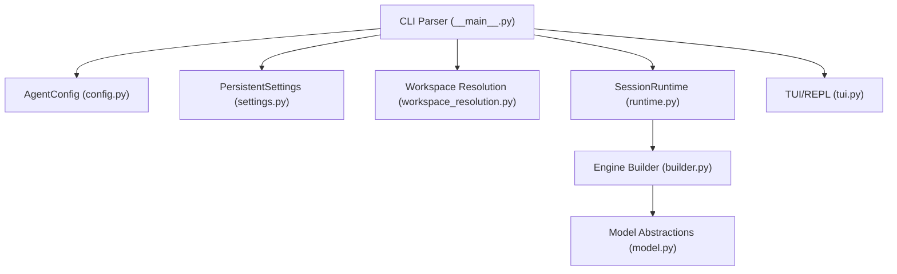
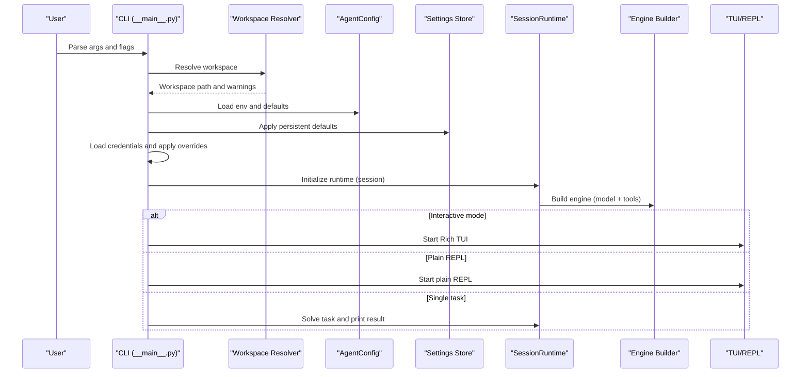
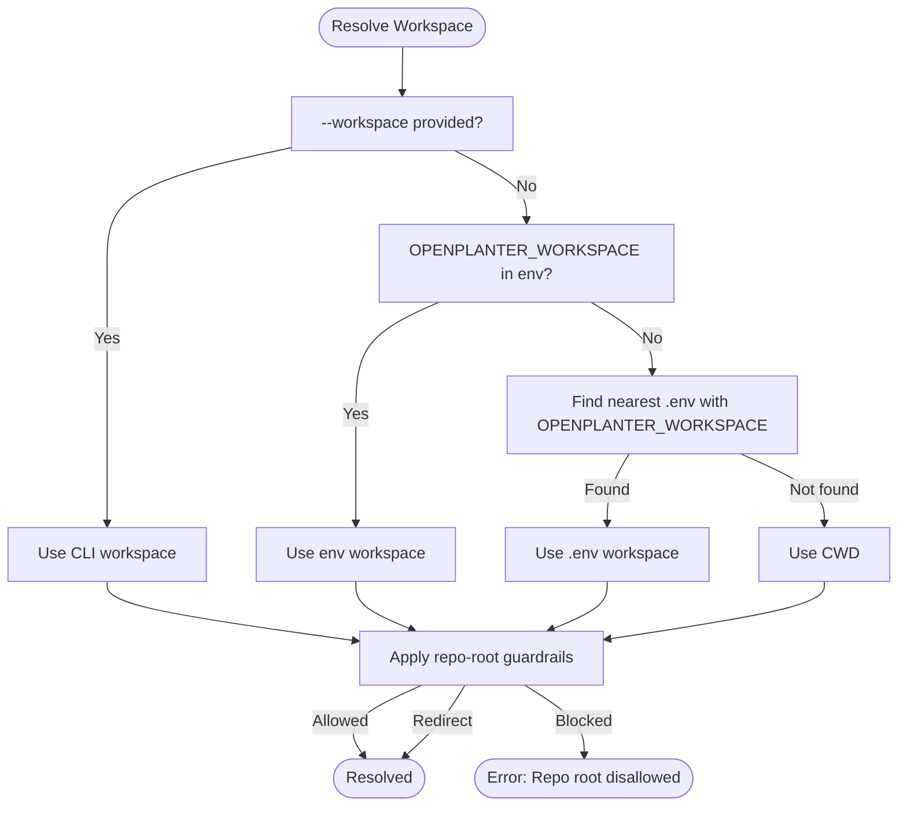
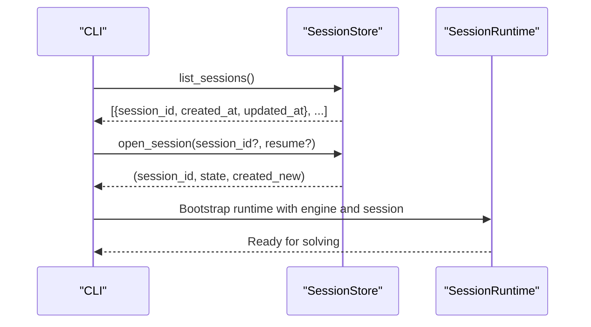
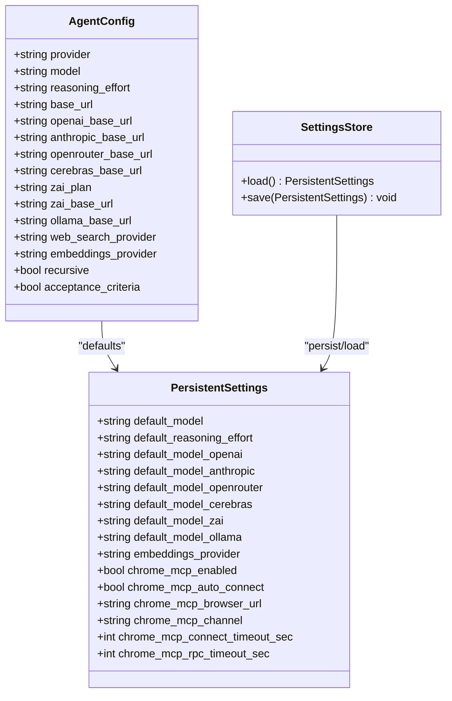
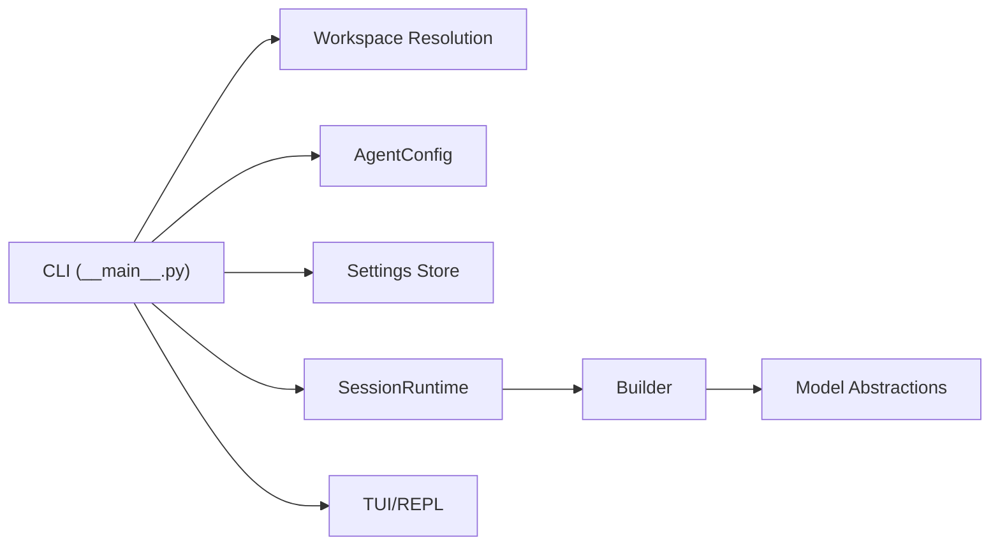

# Command-Line Interface

<cite>
**Referenced Files in This Document**
- [README.md](file://README.md)
- [agent/__main__.py](file://agent/__main__.py)
- [agent/config.py](file://agent/config.py)
- [agent/settings.py](file://agent/settings.py)
- [agent/workspace_resolution.py](file://agent/workspace_resolution.py)
- [agent/runtime.py](file://agent/runtime.py)
- [agent/builder.py](file://agent/builder.py)
- [agent/tui.py](file://agent/tui.py)
- [agent/model.py](file://agent/model.py)
</cite>

## Table of Contents
1. [Introduction](#introduction)
2. [Project Structure](#project-structure)
3. [Core Components](#core-components)
4. [Architecture Overview](#architecture-overview)
5. [Detailed Component Analysis](#detailed-component-analysis)
6. [Dependency Analysis](#dependency-analysis)
7. [Performance Considerations](#performance-considerations)
8. [Troubleshooting Guide](#troubleshooting-guide)
9. [Conclusion](#conclusion)

## Introduction
This document provides comprehensive guidance for the CLI command-line interface of the OpenPlanter agent. It explains all available flags and options, including workspace management, model selection, execution parameters, and UI preferences. It also covers session management, model listing, and practical workflows such as single-task execution, recursive investigations, and batch automation. The goal is to help users configure, run, and troubleshoot the CLI effectively across diverse environments.

## Project Structure
The CLI is implemented in the Python agent module and integrates with configuration, settings, runtime, and workspace resolution subsystems. Key files include:
- CLI argument parser and main entrypoint
- Agent configuration and environment variable handling
- Persistent settings storage
- Workspace resolution with safety guardrails
- Session lifecycle and storage
- Model factory and provider integration
- TUI and plain REPL modes

**Diagram sources**
- [agent/__main__.py:41-225](file://agent/__main__.py#L41-L225)
- [agent/config.py:146-495](file://agent/config.py#L146-L495)
- [agent/settings.py:70-225](file://agent/settings.py#L70-L225)
- [agent/workspace_resolution.py:31-136](file://agent/workspace_resolution.py#L31-L136)
- [agent/runtime.py:232-800](file://agent/runtime.py#L232-L800)
- [agent/builder.py:236-351](file://agent/builder.py#L236-L351)
- [agent/tui.py:158-568](file://agent/tui.py#L158-L568)
- [agent/model.py:146-351](file://agent/model.py#L146-L351)

**Section sources**
- [agent/__main__.py:41-225](file://agent/__main__.py#L41-L225)
- [agent/config.py:146-495](file://agent/config.py#L146-L495)
- [agent/settings.py:70-225](file://agent/settings.py#L70-L225)
- [agent/workspace_resolution.py:31-136](file://agent/workspace_resolution.py#L31-L136)
- [agent/runtime.py:232-800](file://agent/runtime.py#L232-L800)
- [agent/builder.py:236-351](file://agent/builder.py#L236-L351)
- [agent/tui.py:158-568](file://agent/tui.py#L158-L568)
- [agent/model.py:146-351](file://agent/model.py#L146-L351)

## Core Components
- CLI Argument Parser: Defines all flags and options, including workspace, model selection, execution parameters, UI preferences, and session management.
- Agent Configuration: Loads environment variables, applies defaults, and normalizes values for runtime behavior.
- Persistent Settings: Stores workspace defaults (model, reasoning effort, embeddings provider, Chrome MCP settings) in .openplanter/settings.json.
- Workspace Resolution: Resolves the workspace directory with guardrails to prevent operating from repository root.
- Session Management: Lists, opens, resumes, and persists investigation sessions with metadata and artifacts.
- Model Factory and Provider Integration: Builds engines for providers (OpenAI, Anthropic, OpenRouter, Cerebras, Z.AI, Ollama) and validates model/provider compatibility.
- TUI and REPL: Rich terminal UI with slash commands and plain REPL for non-interactive execution.

**Section sources**
- [agent/__main__.py:41-225](file://agent/__main__.py#L41-L225)
- [agent/config.py:146-495](file://agent/config.py#L146-L495)
- [agent/settings.py:70-225](file://agent/settings.py#L70-L225)
- [agent/workspace_resolution.py:31-136](file://agent/workspace_resolution.py#L31-L136)
- [agent/runtime.py:232-800](file://agent/runtime.py#L232-L800)
- [agent/builder.py:236-351](file://agent/builder.py#L236-L351)
- [agent/tui.py:158-568](file://agent/tui.py#L158-L568)

## Architecture Overview
The CLI orchestrates configuration loading, credential resolution, workspace resolution, and runtime initialization. It supports both interactive TUI and non-interactive modes, with optional single-task execution.

**Diagram sources**
- [agent/__main__.py:708-881](file://agent/__main__.py#L708-L881)
- [agent/workspace_resolution.py:31-136](file://agent/workspace_resolution.py#L31-L136)
- [agent/config.py:262-495](file://agent/config.py#L262-L495)
- [agent/settings.py:198-225](file://agent/settings.py#L198-L225)
- [agent/runtime.py:714-800](file://agent/runtime.py#L714-L800)
- [agent/builder.py:236-351](file://agent/builder.py#L236-L351)
- [agent/tui.py:505-568](file://agent/tui.py#L505-L568)

## Detailed Component Analysis

### CLI Argument Parser and Options
The CLI defines a comprehensive set of flags grouped by function:

- Workspace and Session
  - --workspace DIR: Explicit workspace directory override
  - --session-id ID: Use a specific session ID
  - --resume: Resume latest or specified session
  - --list-sessions: List saved sessions and exit

- Model Selection and Provider Integration
  - --provider NAME: Provider selection (auto, openai, anthropic, openrouter, cerebras, zai, ollama, all)
  - --model NAME: Model name or newest to auto-select
  - --reasoning-effort LEVEL: low, medium, high, none
  - --default-model NAME: Persist workspace default model
  - --default-reasoning-effort LEVEL: Persist workspace default reasoning effort
  - --embeddings-provider NAME: Embeddings provider (voyage, mistral)
  - --list-models: List provider models from API
  - --base-url URL: Provider base URL override
  - --api-key KEY, --openai-api-key KEY, --openai-oauth-token TOKEN, --anthropic-api-key KEY, --openrouter-api-key KEY, --cerebras-api-key KEY, --zai-api-key KEY, --exa-api-key KEY, --firecrawl-api-key KEY, --brave-api-key KEY, --tavily-api-key KEY, --voyage-api-key KEY: Provider-specific overrides
  - --web-search-provider NAME: Web search provider (exa, firecrawl, brave, tavily)
  - --zai-plan PLAN: Z.AI plan (paygo, coding)

- Execution Parameters
  - --max-depth N: Maximum recursion depth
  - --max-steps N: Maximum steps per call
  - --timeout N: Shell command timeout seconds
  - --recursive: Enable recursive sub-agent delegation
  - --acceptance-criteria: Judge subtask results with a lightweight model

- UI Preferences and Modes
  - --headless: Disable interactive UI for CI/non-TTY
  - --no-tui: Plain REPL (no colors/spinner)
  - --textual: Textual-based TUI with wiki graph panel
  - --demo: Censor entity names and workspace paths in output

- Slash Commands and Persistence
  - --configure-keys: Prompt to set/update provider API keys
  - --show-settings: Show persistent workspace defaults and exit
  - Per-provider default flags: --default-model-openai, --default-model-anthropic, --default-model-openrouter, --default-model-cerebras, --default-model-zai, --default-model-ollama

Behavioral notes:
- Headless mode requires --task or a non-interactive command unless --textual is used.
- Provider 'all' is only valid with --list-models.
- If --model is unset, defaults are resolved from persistent settings or provider defaults.
- Chrome MCP flags enable native Chrome DevTools MCP tools and auto-connect behavior.

Practical examples:
- Single-task execution: openplanter-agent --task "Summarize FOIA responses" --workspace ./central-fl-ice-workspace
- Recursive investigation: openplanter-agent --recursive --max-depth 3 --max-steps 50
- Automated scripting: openplanter-agent --headless --task "Run trend analysis" --timeout 120
- Batch processing: Loop over tasks with a shell script, setting --session-id and --resume to continue sessions

**Section sources**
- [agent/__main__.py:41-225](file://agent/__main__.py#L41-L225)
- [agent/__main__.py:756-789](file://agent/__main__.py#L756-L789)
- [agent/__main__.py:852-881](file://agent/__main__.py#L852-L881)
- [README.md:292-362](file://README.md#L292-L362)

### Workspace Resolution
The CLI resolves the workspace directory using a deterministic precedence:
1. Explicit --workspace (if provided)
2. Process environment OPENPLANTER_WORKSPACE
3. Nearest ancestor .env file containing OPENPLANTER_WORKSPACE
4. Current working directory with repo-root guardrails

Safety guardrails:
- Refuses to operate directly in repository root
- Redirects to <repo>/workspace if present and allowed
- Emits warnings and errors with actionable guidance

**Diagram sources**
- [agent/workspace_resolution.py:31-136](file://agent/workspace_resolution.py#L31-L136)

**Section sources**
- [agent/workspace_resolution.py:31-136](file://agent/workspace_resolution.py#L31-L136)
- [README.md:307-323](file://README.md#L307-L323)

### Session Management
The CLI supports listing, opening, resuming, and managing sessions:
- --list-sessions prints recent sessions with metadata
- --resume uses latest or specified session ID
- --session-id sets a specific session identifier
- SessionStore manages metadata, state, events, turns, and artifacts

**Diagram sources**
- [agent/__main__.py:740-754](file://agent/__main__.py#L740-L754)
- [agent/runtime.py:232-337](file://agent/runtime.py#L232-L337)

**Section sources**
- [agent/__main__.py:740-754](file://agent/__main__.py#L740-L754)
- [agent/runtime.py:232-337](file://agent/runtime.py#L232-L337)

### Model Selection and Provider Integration
The CLI supports multiple providers and plans:
- Providers: auto, openai, anthropic, openrouter, cerebras, zai, ollama, all
- Z.AI plans: paygo, coding
- Embeddings providers: voyage, mistral
- Web search providers: exa, firecrawl, brave, tavily

Model resolution:
- If --model is "newest", the CLI queries the provider API and selects the newest model
- If --provider is "all", only --list-models is permitted
- Provider inference is performed when switching models

**Diagram sources**
- [agent/config.py:146-235](file://agent/config.py#L146-L235)
- [agent/settings.py:70-129](file://agent/settings.py#L70-L129)
- [agent/settings.py:198-225](file://agent/settings.py#L198-L225)

**Section sources**
- [agent/__main__.py:253-279](file://agent/__main__.py#L253-L279)
- [agent/builder.py:48-82](file://agent/builder.py#L48-L82)
- [agent/builder.py:84-140](file://agent/builder.py#L84-L140)
- [agent/config.py:146-235](file://agent/config.py#L146-L235)
- [agent/settings.py:70-129](file://agent/settings.py#L70-L129)
- [agent/settings.py:198-225](file://agent/settings.py#L198-L225)

### Execution Parameters and Behavior
Execution parameters control agent behavior and resource limits:
- --max-depth: Maximum recursion depth (default 4)
- --max-steps: Maximum steps per call (default 100)
- --timeout: Shell command timeout seconds (default 45)
- --recursive: Enable recursive sub-agent delegation (default True)
- --acceptance-criteria: Judge subtask results with a lightweight model (default True)

These parameters influence the engine configuration and runtime behavior, including budget extension, observation limits, and tool timeouts.

**Section sources**
- [agent/config.py:208-234](file://agent/config.py#L208-L234)
- [agent/config.py:465-491](file://agent/config.py#L465-L491)
- [agent/__main__.py:420-520](file://agent/__main__.py#L420-L520)

### UI Preferences and Modes
- --headless: Disables interactive UI for CI/non-TTY environments
- --no-tui: Uses plain REPL without colors or spinner
- --textual: Enables Textual-based TUI with wiki knowledge graph panel
- --demo: Censors entity names and workspace paths in output

Mode transitions:
- Headless mode requires --task or a non-interactive command unless --textual is used
- Plain REPL is suitable for non-interactive stdin environments

**Section sources**
- [agent/__main__.py:761-766](file://agent/__main__.py#L761-L766)
- [agent/__main__.py:875-881](file://agent/__main__.py#L875-L881)
- [agent/tui.py:505-568](file://agent/tui.py#L505-L568)

### Practical Workflows and Examples
Common CLI workflows:
- Single-task execution: Use --task to run a single objective and exit. Combine with --workspace, --provider, --model, --timeout, and --headless for CI automation.
- Recursive investigations: Enable --recursive with tuned --max-depth and --max-steps for complex, multi-agent investigations.
- Automated scripting: Chain tasks with shell loops, setting --session-id and --resume to continue sessions across runs.
- Batch processing: Iterate over datasets or workspaces, using --workspace and --list-sessions to manage state.

Examples from repository documentation:
- Configure keys and launch TUI
- Run a single task headlessly
- Use local Ollama models
- Manage Z.AI endpoint plans

**Section sources**
- [README.md:59-82](file://README.md#L59-L82)
- [README.md:110-121](file://README.md#L110-L121)
- [README.md:122-149](file://README.md#L122-L149)

## Dependency Analysis
The CLI depends on configuration, settings, workspace resolution, runtime, and model subsystems. The builder constructs engines based on provider and model selection, while the runtime manages sessions and state.

**Diagram sources**
- [agent/__main__.py:708-881](file://agent/__main__.py#L708-L881)
- [agent/workspace_resolution.py:31-136](file://agent/workspace_resolution.py#L31-L136)
- [agent/config.py:262-495](file://agent/config.py#L262-L495)
- [agent/settings.py:198-225](file://agent/settings.py#L198-L225)
- [agent/runtime.py:714-800](file://agent/runtime.py#L714-L800)
- [agent/builder.py:236-351](file://agent/builder.py#L236-L351)
- [agent/tui.py:505-568](file://agent/tui.py#L505-L568)

**Section sources**
- [agent/__main__.py:708-881](file://agent/__main__.py#L708-L881)
- [agent/builder.py:236-351](file://agent/builder.py#L236-L351)

## Performance Considerations
- Tune --max-depth and --max-steps to balance thoroughness and cost/time budgets.
- Adjust --timeout for shell operations that may require longer execution windows.
- Use --headless for CI to avoid interactive stalls.
- Prefer --no-tui for non-interactive environments to reduce overhead.
- Persist defaults with --default-model and --default-reasoning-effort to minimize repeated configuration.

[No sources needed since this section provides general guidance]

## Troubleshooting Guide
Common CLI issues and resolutions:
- Workspace errors: The CLI refuses repository root and may redirect to <repo>/workspace. Check OPENPLANTER_WORKSPACE in .env or pass --workspace explicitly.
- Missing API keys: Use --configure-keys or set environment variables. The CLI prints guidance when no keys are configured.
- Provider 'all' misuse: --provider all is only valid with --list-models.
- Headless mode requirements: --headless requires --task or a non-interactive command unless --textual is used.
- Model/provider mismatch: Ensure the selected model matches the chosen provider or use provider inference.
- Chrome MCP connectivity: Requires Node.js/npm and a running Chrome instance; otherwise, the agent continues with built-in tools and reports unavailable status.

**Section sources**
- [agent/workspace_resolution.py:16-136](file://agent/workspace_resolution.py#L16-L136)
- [agent/__main__.py:761-766](file://agent/__main__.py#L761-L766)
- [agent/__main__.py:787-789](file://agent/__main__.py#L787-L789)
- [agent/tui.py:379-396](file://agent/tui.py#L379-L396)

## Conclusion
The OpenPlanter CLI offers a powerful, configurable interface for running investigations across diverse environments. By understanding workspace resolution, model selection, execution parameters, and session management, users can tailor the agent to single tasks, recursive investigations, and automated workflows. Persistent settings streamline configuration, while robust error handling and guardrails ensure safe operation.