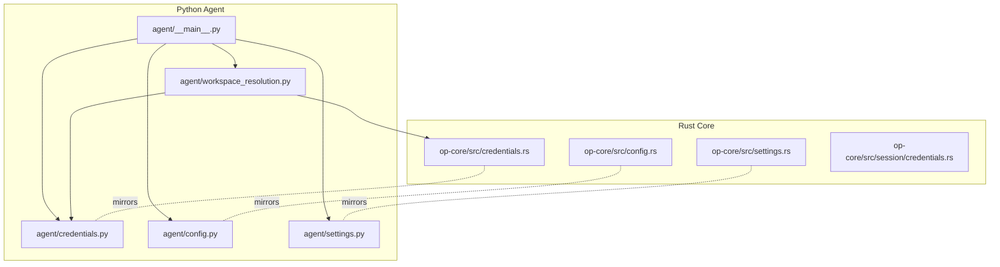
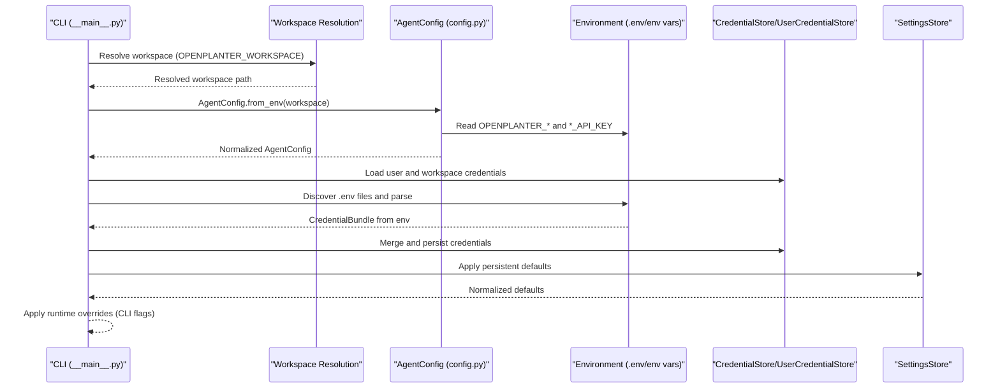
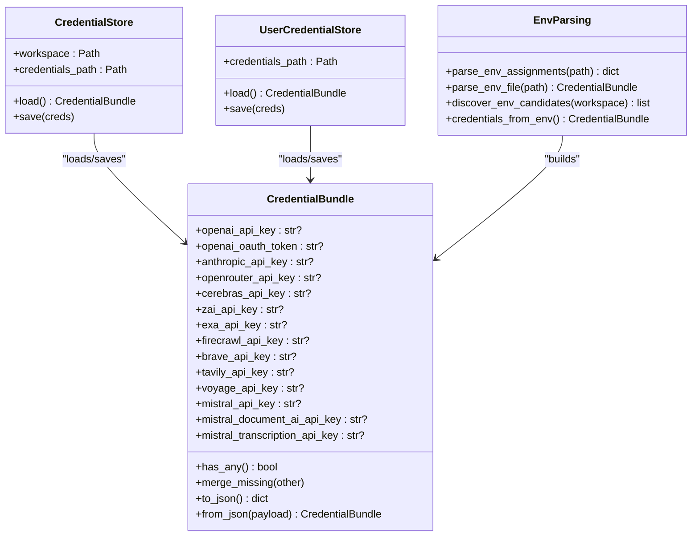
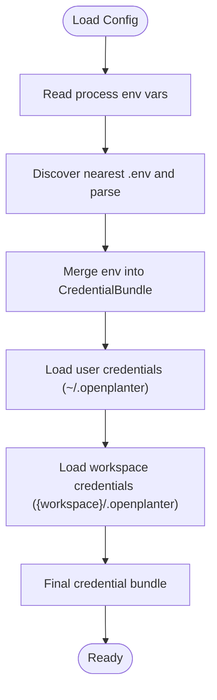
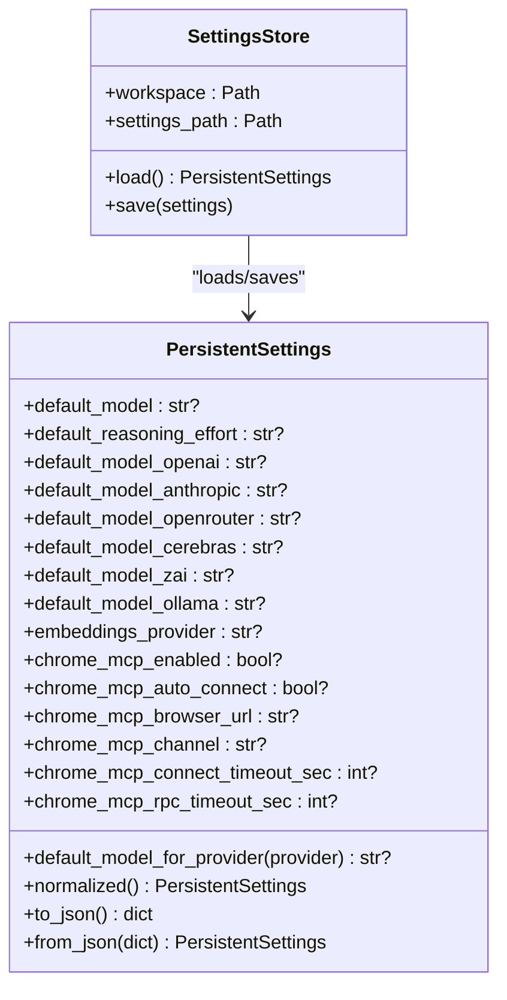
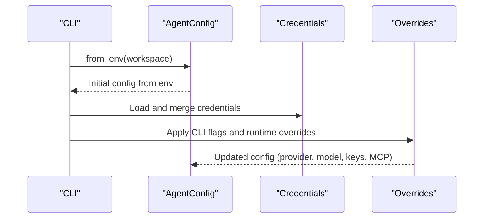
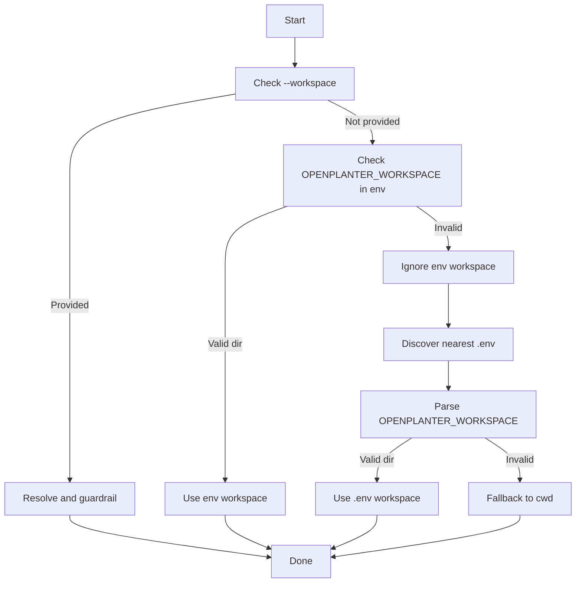
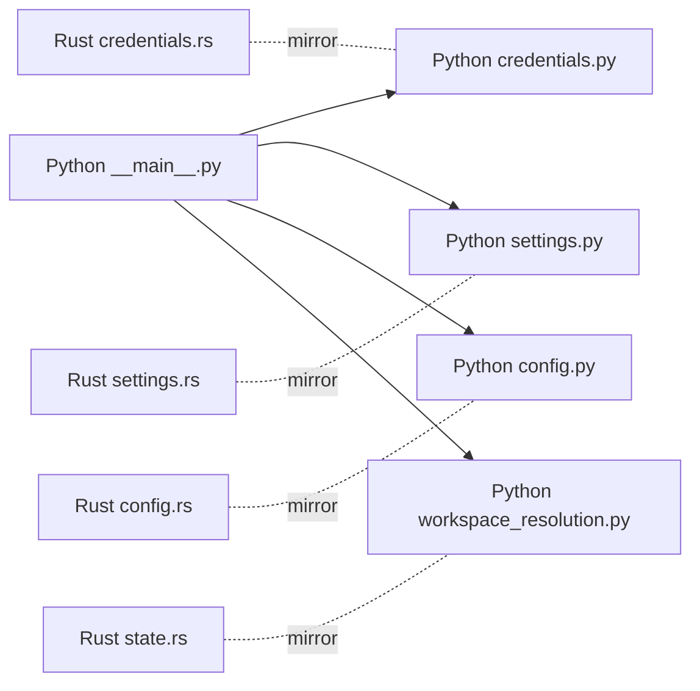

# Configuration Management

<cite>
**Referenced Files in This Document**
- [agent/credentials.py](file://agent/credentials.py)
- [agent/config.py](file://agent/config.py)
- [agent/settings.py](file://agent/settings.py)
- [agent/__main__.py](file://agent/__main__.py)
- [agent/workspace_resolution.py](file://agent/workspace_resolution.py)
- [openplanter-desktop/crates/op-core/src/credentials.rs](file://openplanter-desktop/crates/op-core/src/credentials.rs)
- [openplanter-desktop/crates/op-core/src/config.rs](file://openplanter-desktop/crates/op-core/src/config.rs)
- [openplanter-desktop/crates/op-core/src/settings.rs](file://openplanter-desktop/crates/op-core/src/settings.rs)
- [openplanter-desktop/crates/op-core/src/session/credentials.rs](file://openplanter-desktop/crates/op-core/src/session/credentials.rs)
- [openplanter-desktop/crates/op-tauri/src/state.rs](file://openplanter-desktop/crates/op-tauri/src/state.rs)
- [tests/test_credentials.py](file://tests/test_credentials.py)
- [tests/test_settings.py](file://tests/test_settings.py)
</cite>

## Table of Contents
1. [Introduction](#introduction)
2. [Project Structure](#project-structure)
3. [Core Components](#core-components)
4. [Architecture Overview](#architecture-overview)
5. [Detailed Component Analysis](#detailed-component-analysis)
6. [Dependency Analysis](#dependency-analysis)
7. [Performance Considerations](#performance-considerations)
8. [Troubleshooting Guide](#troubleshooting-guide)
9. [Conclusion](#conclusion)
10. [Appendices](#appendices)

## Introduction
This document explains the configuration management system for credential handling, persistent settings, and environment variable integration across the OpenPlanter project. It covers how credentials are discovered and merged from multiple sources, how persistent settings are applied, and how environment variables and .env files influence runtime behavior. It also documents the precedence order, interactive configuration, validation, and practical examples for providers such as OpenAI and Anthropic.

## Project Structure
The configuration system spans both the Python agent and the Rust core, with shared semantics:
- Python agent: credential parsing, environment variable ingestion, persistent settings, and CLI orchestration
- Rust core: equivalent credential and settings handling for the desktop application and Tauri frontend integration
- Shared workspace resolution logic integrates .env-based workspace selection

**Diagram sources**
- [agent/__main__.py:1-907](file://agent/__main__.py#L1-L907)
- [agent/credentials.py:1-424](file://agent/credentials.py#L1-L424)
- [agent/config.py:1-495](file://agent/config.py#L1-L495)
- [agent/settings.py:1-225](file://agent/settings.py#L1-L225)
- [agent/workspace_resolution.py:1-136](file://agent/workspace_resolution.py#L1-L136)
- [openplanter-desktop/crates/op-core/src/credentials.rs:1-607](file://openplanter-desktop/crates/op-core/src/credentials.rs#L1-L607)
- [openplanter-desktop/crates/op-core/src/config.rs:1-800](file://openplanter-desktop/crates/op-core/src/config.rs#L1-L800)
- [openplanter-desktop/crates/op-core/src/settings.rs:1-491](file://openplanter-desktop/crates/op-core/src/settings.rs#L1-L491)
- [openplanter-desktop/crates/op-core/src/session/credentials.rs:1-67](file://openplanter-desktop/crates/op-core/src/session/credentials.rs#L1-L67)

**Section sources**
- [agent/__main__.py:1-907](file://agent/__main__.py#L1-L907)
- [agent/credentials.py:1-424](file://agent/credentials.py#L1-L424)
- [agent/config.py:1-495](file://agent/config.py#L1-L495)
- [agent/settings.py:1-225](file://agent/settings.py#L1-L225)
- [agent/workspace_resolution.py:1-136](file://agent/workspace_resolution.py#L1-L136)
- [openplanter-desktop/crates/op-core/src/credentials.rs:1-607](file://openplanter-desktop/crates/op-core/src/credentials.rs#L1-L607)
- [openplanter-desktop/crates/op-core/src/config.rs:1-800](file://openplanter-desktop/crates/op-core/src/config.rs#L1-L800)
- [openplanter-desktop/crates/op-core/src/settings.rs:1-491](file://openplanter-desktop/crates/op-core/src/settings.rs#L1-L491)
- [openplanter-desktop/crates/op-core/src/session/credentials.rs:1-67](file://openplanter-desktop/crates/op-core/src/session/credentials.rs#L1-L67)

## Core Components
- CredentialBundle and stores: encapsulate provider API keys and manage merging, serialization, and discovery
- Environment variable ingestion: parse OPENPLANTER_* and legacy *_API_KEY variants, with precedence rules
- Persistent settings: default model/provider defaults, reasoning effort, and Chrome MCP settings
- Runtime configuration: CLI overrides and normalization
- Workspace resolution: .env-based workspace selection and guardrails

**Section sources**
- [agent/credentials.py:12-424](file://agent/credentials.py#L12-L424)
- [agent/config.py:146-495](file://agent/config.py#L146-L495)
- [agent/settings.py:70-225](file://agent/settings.py#L70-L225)
- [agent/__main__.py:281-417](file://agent/__main__.py#L281-L417)
- [agent/workspace_resolution.py:31-136](file://agent/workspace_resolution.py#L31-L136)

## Architecture Overview
The configuration pipeline merges inputs from multiple sources with explicit precedence and applies normalization and validation.

**Diagram sources**
- [agent/__main__.py:708-790](file://agent/__main__.py#L708-L790)
- [agent/workspace_resolution.py:31-99](file://agent/workspace_resolution.py#L31-L99)
- [agent/config.py:262-495](file://agent/config.py#L262-L495)
- [agent/credentials.py:281-321](file://agent/credentials.py#L281-L321)
- [agent/settings.py:200-225](file://agent/settings.py#L200-L225)

## Detailed Component Analysis

### Credential Store System
The credential system supports three layers:
- User-level store (~/.openplanter/credentials.json)
- Workspace-level store ({workspace}/.openplanter/credentials.json)
- Environment variables and .env files

**Diagram sources**
- [agent/credentials.py:12-321](file://agent/credentials.py#L12-L321)
- [agent/credentials.py:323-424](file://agent/credentials.py#L323-L424)
- [openplanter-desktop/crates/op-core/src/credentials.rs:10-380](file://openplanter-desktop/crates/op-core/src/credentials.rs#L10-L380)

Key behaviors:
- Precedence: environment variables override .env; .env overrides workspace credentials; workspace credentials override user credentials
- Interactive configuration: prompt to set/update keys and persist to user store
- Security: workspace credentials file is written with restrictive permissions

Practical examples:
- Setting OpenAI key via environment: OPENPLANTER_OPENAI_API_KEY or OPENAI_API_KEY
- Setting Anthropic key via .env: ANTHROPIC_API_KEY or OPENPLANTER_ANTHROPIC_API_KEY
- Persisting keys: use --configure-keys to enter interactively; saved to ~/.openplanter/credentials.json

**Section sources**
- [agent/credentials.py:12-424](file://agent/credentials.py#L12-L424)
- [agent/__main__.py:281-417](file://agent/__main__.py#L281-L417)
- [tests/test_credentials.py:16-108](file://tests/test_credentials.py#L16-L108)

### Environment Variable Precedence and .env Parsing
- Supported variables include OPENPLANTER_* variants and legacy *_API_KEY names
- .env parsing supports export statements and quoted values
- Workspace resolution can read OPENPLANTER_WORKSPACE from .env to select the workspace directory

**Diagram sources**
- [agent/config.py:262-495](file://agent/config.py#L262-L495)
- [agent/credentials.py:156-220](file://agent/credentials.py#L156-L220)
- [agent/workspace_resolution.py:31-99](file://agent/workspace_resolution.py#L31-L99)

**Section sources**
- [agent/config.py:262-495](file://agent/config.py#L262-L495)
- [agent/credentials.py:156-220](file://agent/credentials.py#L156-L220)
- [agent/workspace_resolution.py:31-99](file://agent/workspace_resolution.py#L31-L99)

### Persistent Settings Persistence
Persistent settings include:
- Default model and reasoning effort
- Provider-specific defaults (per-provider model fallback)
- Embeddings provider and Chrome MCP settings

**Diagram sources**
- [agent/settings.py:70-225](file://agent/settings.py#L70-L225)
- [openplanter-desktop/crates/op-core/src/settings.rs:49-308](file://openplanter-desktop/crates/op-core/src/settings.rs#L49-L308)

Application of persistent defaults:
- If no CLI flag or env var is set, defaults are applied from settings.json
- Validation ensures values are normalized and safe

**Section sources**
- [agent/settings.py:70-225](file://agent/settings.py#L70-L225)
- [agent/__main__.py:553-646](file://agent/__main__.py#L553-L646)
- [tests/test_settings.py:21-164](file://tests/test_settings.py#L21-L164)

### Runtime Configuration and Overrides
- CLI flags override environment variables and persistent settings
- Provider inference and model normalization occur during runtime
- Chrome MCP settings support remote debugging and channel selection

**Diagram sources**
- [agent/config.py:262-495](file://agent/config.py#L262-L495)
- [agent/__main__.py:419-520](file://agent/__main__.py#L419-L520)

**Section sources**
- [agent/config.py:262-495](file://agent/config.py#L262-L495)
- [agent/__main__.py:419-520](file://agent/__main__.py#L419-L520)

### Workspace Resolution and .env Integration
- Workspace can be selected via --workspace, OPENPLANTER_WORKSPACE in env, or OPENPLANTER_WORKSPACE in .env
- Guardrails prevent using repository root as workspace unless redirected to a workspace subdirectory
- Desktop state module mirrors .env discovery and parsing

**Diagram sources**
- [agent/workspace_resolution.py:31-99](file://agent/workspace_resolution.py#L31-L99)
- [openplanter-desktop/crates/op-tauri/src/state.rs:117-177](file://openplanter-desktop/crates/op-tauri/src/state.rs#L117-L177)

**Section sources**
- [agent/workspace_resolution.py:31-99](file://agent/workspace_resolution.py#L31-L99)
- [openplanter-desktop/crates/op-tauri/src/state.rs:117-177](file://openplanter-desktop/crates/op-tauri/src/state.rs#L117-L177)

## Dependency Analysis
- Python and Rust implementations mirror each other for credentials, settings, and configuration
- Workspace resolution logic is shared conceptually between Python and Rust
- CLI orchestrates credential loading, environment parsing, and persistent settings application

**Diagram sources**
- [agent/__main__.py:1-907](file://agent/__main__.py#L1-L907)
- [agent/credentials.py:1-424](file://agent/credentials.py#L1-L424)
- [agent/settings.py:1-225](file://agent/settings.py#L1-L225)
- [agent/config.py:1-495](file://agent/config.py#L1-L495)
- [agent/workspace_resolution.py:1-136](file://agent/workspace_resolution.py#L1-L136)
- [openplanter-desktop/crates/op-core/src/credentials.rs:1-607](file://openplanter-desktop/crates/op-core/src/credentials.rs#L1-L607)
- [openplanter-desktop/crates/op-core/src/settings.rs:1-491](file://openplanter-desktop/crates/op-core/src/settings.rs#L1-L491)
- [openplanter-desktop/crates/op-core/src/config.rs:1-800](file://openplanter-desktop/crates/op-core/src/config.rs#L1-L800)
- [openplanter-desktop/crates/op-tauri/src/state.rs:117-177](file://openplanter-desktop/crates/op-tauri/src/state.rs#L117-L177)

**Section sources**
- [agent/__main__.py:1-907](file://agent/__main__.py#L1-L907)
- [agent/credentials.py:1-424](file://agent/credentials.py#L1-L424)
- [agent/settings.py:1-225](file://agent/settings.py#L1-L225)
- [agent/config.py:1-495](file://agent/config.py#L1-L495)
- [agent/workspace_resolution.py:1-136](file://agent/workspace_resolution.py#L1-L136)
- [openplanter-desktop/crates/op-core/src/credentials.rs:1-607](file://openplanter-desktop/crates/op-core/src/credentials.rs#L1-L607)
- [openplanter-desktop/crates/op-core/src/settings.rs:1-491](file://openplanter-desktop/crates/op-core/src/settings.rs#L1-L491)
- [openplanter-desktop/crates/op-core/src/config.rs:1-800](file://openplanter-desktop/crates/op-core/src/config.rs#L1-L800)
- [openplanter-desktop/crates/op-tauri/src/state.rs:117-177](file://openplanter-desktop/crates/op-tauri/src/state.rs#L117-L177)

## Performance Considerations
- Credential and settings files are small JSON payloads; IO cost is minimal
- Environment parsing reads only necessary keys; .env discovery walks up the directory tree once
- Normalization and validation are lightweight and performed once during initialization

## Troubleshooting Guide
Common issues and resolutions:
- No API keys configured: use --configure-keys to enter interactively; keys are persisted to user store
- Conflicting sources: environment variables override .env; .env overrides workspace credentials; workspace overrides user credentials
- Invalid reasoning effort or boolean values: validation raises errors; use accepted values (low, medium, high) or normalized forms
- Workspace guardrails: repository root cannot be used as workspace unless redirected; set OPENPLANTER_WORKSPACE in .env or pass --workspace
- Chrome MCP connectivity: ensure --chrome-browser-url or auto-connect is configured; timeouts can be tuned via persistent settings

**Section sources**
- [agent/__main__.py:396-417](file://agent/__main__.py#L396-L417)
- [agent/settings.py:13-68](file://agent/settings.py#L13-L68)
- [agent/workspace_resolution.py:124-136](file://agent/workspace_resolution.py#L124-L136)
- [tests/test_settings.py:65-83](file://tests/test_settings.py#L65-L83)

## Conclusion
OpenPlanter’s configuration system provides a robust, layered approach to managing credentials, persistent defaults, and environment-driven settings. By combining environment variables, .env files, and persistent JSON stores, it enables flexible deployment scenarios while maintaining strong validation and security practices. The Python and Rust implementations share the same design principles, ensuring consistency across the agent and desktop application.

## Appendices

### Configuration Hierarchy Reference
1. Environment variables (process)
2. .env file in nearest ancestor directory
3. Workspace-level credentials.json
4. User-level credentials.json
5. Command-line overrides
6. Persistent settings (settings.json) when no CLI/env override present

**Section sources**
- [agent/__main__.py:281-417](file://agent/__main__.py#L281-L417)
- [agent/config.py:262-495](file://agent/config.py#L262-L495)
- [agent/settings.py:200-225](file://agent/settings.py#L200-L225)

### Practical Examples
- Configure OpenAI credentials:
  - Set OPENPLANTER_OPENAI_API_KEY or OPENAI_API_KEY
  - Or create a .env with OPENAI_API_KEY and place it in the workspace root
  - Or run --configure-keys and enter the key interactively
- Configure Anthropic credentials:
  - Set OPENPLANTER_ANTHROPIC_API_KEY or ANTHROPIC_API_KEY
  - Or add ANTHROPIC_API_KEY to .env
- Set default model per provider:
  - Use --default-model-openai, --default-model-anthropic, etc.
  - Or edit .openplanter/settings.json under the appropriate keys
- Manage Chrome MCP:
  - Enable with --chrome-mcp or set persistent defaults in settings.json
  - Configure channel and timeouts via CLI or persistent settings

**Section sources**
- [agent/__main__.py:419-520](file://agent/__main__.py#L419-L520)
- [agent/settings.py:70-225](file://agent/settings.py#L70-L225)
- [tests/test_settings.py:84-140](file://tests/test_settings.py#L84-L140)