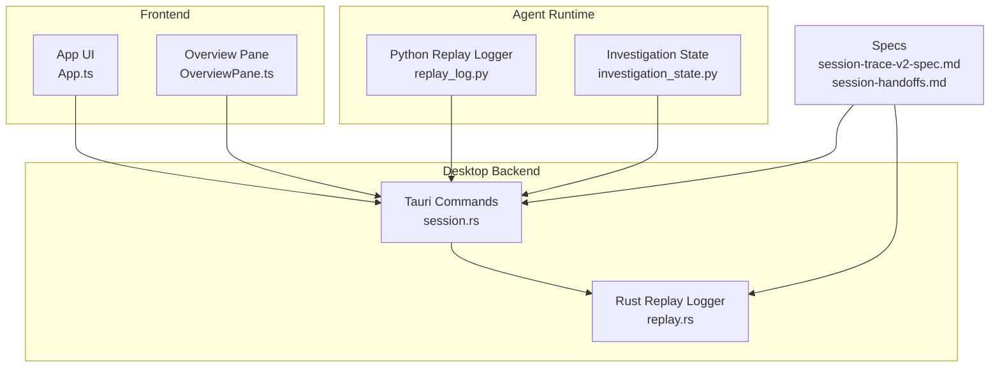
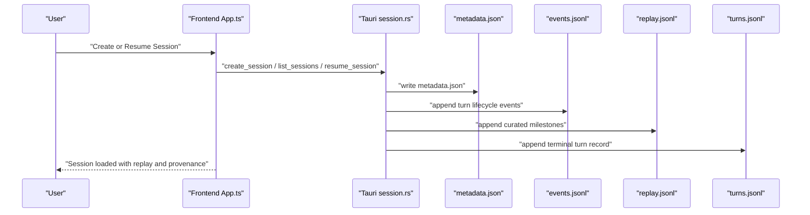
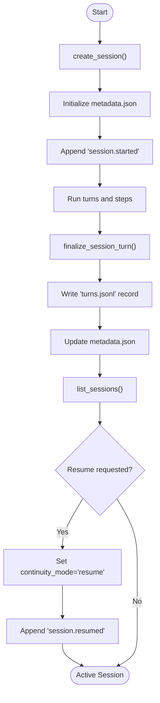
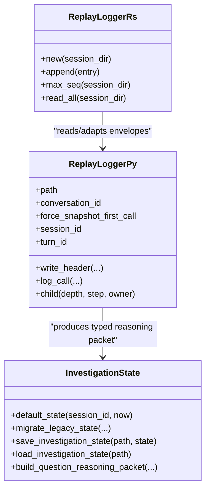
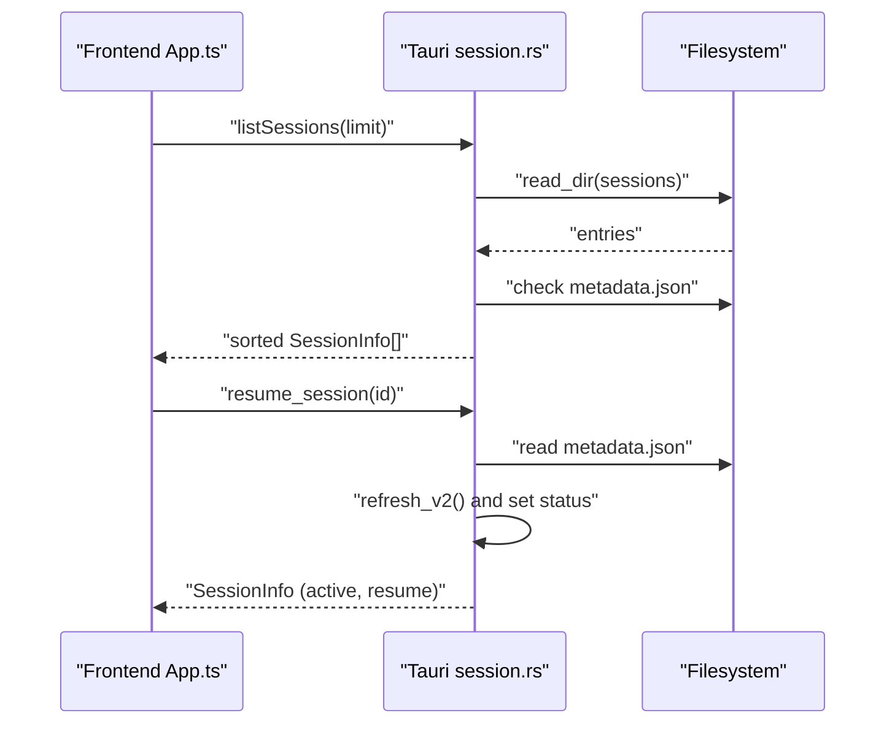
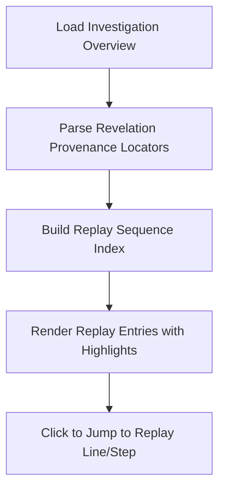
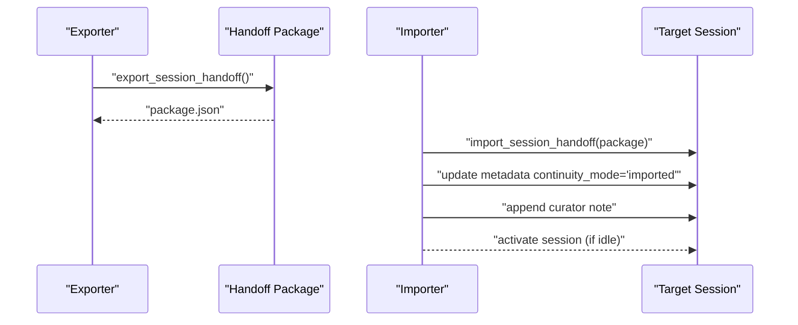
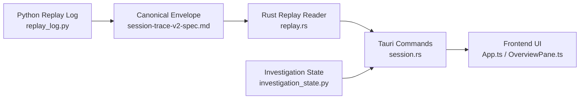

# Session Management

<cite>
**Referenced Files in This Document**
- [session.rs](file://openplanter-desktop/crates/op-tauri/src/commands/session.rs)
- [replay.rs](file://openplanter-desktop/crates/op-core/src/session/replay.rs)
- [replay_log.py](file://agent/replay_log.py)
- [investigation_state.py](file://agent/investigation_state.py)
- [session-trace-v2-spec.md](file://docs/session-trace-v2-spec.md)
- [session-handoffs.md](file://docs/session-handoffs.md)
- [session-change-sets.md](file://docs/session-change-sets.md)
- [App.ts](file://openplanter-desktop/frontend/src/components/App.ts)
- [OverviewPane.ts](file://openplanter-desktop/frontend/src/components/OverviewPane.ts)
- [test_session_complex.py](file://tests/test_session_complex.py)
</cite>

## Table of Contents
1. [Introduction](#introduction)
2. [Project Structure](#project-structure)
3. [Core Components](#core-components)
4. [Architecture Overview](#architecture-overview)
5. [Detailed Component Analysis](#detailed-component-analysis)
6. [Dependency Analysis](#dependency-analysis)
7. [Performance Considerations](#performance-considerations)
8. [Troubleshooting Guide](#troubleshooting-guide)
9. [Conclusion](#conclusion)
10. [Appendices](#appendices)

## Introduction
This document explains session management for investigation persistence, checkpointing, and resume capabilities across the OpenPlanter stack. It covers the session lifecycle from creation to completion, automatic checkpointing and recovery, session ID management, listing sessions, resuming sessions, and the replay log system for investigating agent actions, progress tracking, and debugging. Practical examples illustrate long-running investigations, recovery after interruptions, and collaborative workflows. Cleanup procedures, storage locations, and performance implications are included, along with troubleshooting guidance for session corruption and integration with the desktop application’s session management.

## Project Structure
OpenPlanter implements session management across:
- Desktop Tauri backend for session orchestration, listing, and resume
- Rust core for replay log ingestion and compatibility
- Python agent for legacy-style replay logging and investigation state
- Frontend for session listing, resume UX, and replay navigation
- Documentation specs for trace v2, handoffs, and change sets

**Diagram sources**
- [session.rs:1-200](file://openplanter-desktop/crates/op-tauri/src/commands/session.rs#L1-L200)
- [replay.rs:1-120](file://openplanter-desktop/crates/op-core/src/session/replay.rs#L1-L120)
- [replay_log.py:1-120](file://agent/replay_log.py#L1-L120)
- [investigation_state.py:1-120](file://agent/investigation_state.py#L1-L120)
- [App.ts:282-361](file://openplanter-desktop/frontend/src/components/App.ts#L282-L361)
- [OverviewPane.ts:492-521](file://openplanter-desktop/frontend/src/components/OverviewPane.ts#L492-L521)
- [session-trace-v2-spec.md:1-120](file://docs/session-trace-v2-spec.md#L1-L120)
- [session-handoffs.md:1-91](file://docs/session-handoffs.md#L1-L91)

**Section sources**
- [session.rs:1-200](file://openplanter-desktop/crates/op-tauri/src/commands/session.rs#L1-L200)
- [replay.rs:1-120](file://openplanter-desktop/crates/op-core/src/session/replay.rs#L1-L120)
- [replay_log.py:1-120](file://agent/replay_log.py#L1-L120)
- [investigation_state.py:1-120](file://agent/investigation_state.py#L1-L120)
- [session-trace-v2-spec.md:1-120](file://docs/session-trace-v2-spec.md#L1-L120)
- [session-handoffs.md:1-91](file://docs/session-handoffs.md#L1-L91)
- [App.ts:282-361](file://openplanter-desktop/frontend/src/components/App.ts#L282-L361)
- [OverviewPane.ts:492-521](file://openplanter-desktop/frontend/src/components/OverviewPane.ts#L492-L521)

## Core Components
- Session orchestration and listing: Tauri commands manage session creation, listing, and resume, writing canonical metadata and event streams.
- Replay logging: Rust and Python components append structured, replayable events to JSONL streams with provenance and compatibility adapters.
- Investigation state: Typed state model for questions, claims, evidence, and candidate actions, persisted and migrated across versions.
- Frontend integration: Session listing, resume UX, and replay navigation with provenance linking.

Key responsibilities:
- Session ID generation and uniqueness
- Metadata refresh and continuity mode transitions
- Replay log ingestion and legacy compatibility
- Turn-level durability and resume anchors
- Evidence and provenance references for debugging and auditing

**Section sources**
- [session.rs:388-401](file://openplanter-desktop/crates/op-tauri/src/commands/session.rs#L388-L401)
- [session.rs:361-386](file://openplanter-desktop/crates/op-tauri/src/commands/session.rs#L361-L386)
- [session.rs:533-558](file://openplanter-desktop/crates/op-tauri/src/commands/session.rs#L533-L558)
- [replay.rs:118-154](file://openplanter-desktop/crates/op-core/src/session/replay.rs#L118-L154)
- [replay_log.py:45-100](file://agent/replay_log.py#L45-L100)
- [investigation_state.py:35-86](file://agent/investigation_state.py#L35-L86)

## Architecture Overview
The session architecture centers on append-only, canonical event streams and metadata-driven orchestration. The v2 trace specification defines a unified envelope for events and replay, enabling durable per-turn records and provenance tracing.

**Diagram sources**
- [session.rs:388-401](file://openplanter-desktop/crates/op-tauri/src/commands/session.rs#L388-L401)
- [session.rs:361-386](file://openplanter-desktop/crates/op-tauri/src/commands/session.rs#L361-L386)
- [session.rs:533-558](file://openplanter-desktop/crates/op-tauri/src/commands/session.rs#L533-L558)
- [session-trace-v2-spec.md:45-90](file://docs/session-trace-v2-spec.md#L45-L90)

## Detailed Component Analysis

### Session Lifecycle and Orchestration
- Creation: Generates a safe session ID, creates artifacts directory, initializes metadata, and emits session-started events.
- Listing: Scans session directories for metadata.json, tolerating missing or invalid metadata gracefully.
- Resume: Updates continuity mode and status, refreshes metadata, and appends session-started events for replay.

**Diagram sources**
- [session.rs:388-401](file://openplanter-desktop/crates/op-tauri/src/commands/session.rs#L388-L401)
- [session.rs:361-386](file://openplanter-desktop/crates/op-tauri/src/commands/session.rs#L361-L386)
- [session.rs:533-558](file://openplanter-desktop/crates/op-tauri/src/commands/session.rs#L533-L558)
- [session.rs:1242-1272](file://openplanter-desktop/crates/op-tauri/src/commands/session.rs#L1242-L1272)
- [session.rs:1305-1353](file://openplanter-desktop/crates/op-tauri/src/commands/session.rs#L1305-L1353)

**Section sources**
- [session.rs:388-401](file://openplanter-desktop/crates/op-tauri/src/commands/session.rs#L388-L401)
- [session.rs:361-386](file://openplanter-desktop/crates/op-tauri/src/commands/session.rs#L361-L386)
- [session.rs:533-558](file://openplanter-desktop/crates/op-tauri/src/commands/session.rs#L533-L558)
- [session.rs:1242-1272](file://openplanter-desktop/crates/op-tauri/src/commands/session.rs#L1242-L1272)
- [session.rs:1305-1353](file://openplanter-desktop/crates/op-tauri/src/commands/session.rs#L1305-L1353)

### Replay Log System and Investigation Persistence
- Python replay logger: Delta-encoded messages with snapshot-first calls, maintains conversation hierarchy, and writes canonical trace envelopes.
- Rust replay reader: Reads and adapts legacy and v2 envelopes, auto-filling sequence and timestamps, and supports step summaries and tool calls.
- Investigation state: Typed model for questions, claims, evidence, and candidate actions, with migration and legacy projection support.

**Diagram sources**
- [replay_log.py:45-100](file://agent/replay_log.py#L45-L100)
- [replay_log.py:177-264](file://agent/replay_log.py#L177-L264)
- [replay.rs:50-88](file://openplanter-desktop/crates/op-core/src/session/replay.rs#L50-L88)
- [replay.rs:118-154](file://openplanter-desktop/crates/op-core/src/session/replay.rs#L118-L154)
- [investigation_state.py:35-86](file://agent/investigation_state.py#L35-L86)
- [investigation_state.py:224-233](file://agent/investigation_state.py#L224-L233)
- [investigation_state.py:235-385](file://agent/investigation_state.py#L235-L385)

**Section sources**
- [replay_log.py:45-100](file://agent/replay_log.py#L45-L100)
- [replay_log.py:177-264](file://agent/replay_log.py#L177-L264)
- [replay.rs:50-88](file://openplanter-desktop/crates/op-core/src/session/replay.rs#L50-L88)
- [replay.rs:118-154](file://openplanter-desktop/crates/op-core/src/session/replay.rs#L118-L154)
- [investigation_state.py:35-86](file://agent/investigation_state.py#L35-L86)
- [investigation_state.py:224-233](file://agent/investigation_state.py#L224-L233)
- [investigation_state.py:235-385](file://agent/investigation_state.py#L235-L385)

### Session Listing (--list-sessions) and Resumption (--resume)
- Listing: Enumerates directories containing metadata.json, sorts by updated_at, and truncates to limit.
- Resumption: Validates session directory and metadata existence, updates continuity_mode and status, and appends session-started events.

**Diagram sources**
- [session.rs:361-386](file://openplanter-desktop/crates/op-tauri/src/commands/session.rs#L361-L386)
- [session.rs:533-558](file://openplanter-desktop/crates/op-tauri/src/commands/session.rs#L533-L558)
- [App.ts:282-361](file://openplanter-desktop/frontend/src/components/App.ts#L282-L361)

**Section sources**
- [session.rs:361-386](file://openplanter-desktop/crates/op-tauri/src/commands/session.rs#L361-L386)
- [session.rs:533-558](file://openplanter-desktop/crates/op-tauri/src/commands/session.rs#L533-L558)
- [App.ts:282-361](file://openplanter-desktop/frontend/src/components/App.ts#L282-L361)

### Replay Navigation and Debugging
- Frontend replay rendering: Parses provenance locators and renders replay entries with step indices, event IDs, and replay sequence numbers.
- Replay entry indexing: Links recent revelations to replay sequences for targeted navigation.

**Diagram sources**
- [OverviewPane.ts:492-521](file://openplanter-desktop/frontend/src/components/OverviewPane.ts#L492-L521)
- [OverviewPane.ts:1142-1157](file://openplanter-desktop/frontend/src/components/OverviewPane.ts#L1142-L1157)
- [OverviewPane.ts:1159-1183](file://openplanter-desktop/frontend/src/components/OverviewPane.ts#L1159-L1183)

**Section sources**
- [OverviewPane.ts:492-521](file://openplanter-desktop/frontend/src/components/OverviewPane.ts#L492-L521)
- [OverviewPane.ts:1142-1157](file://openplanter-desktop/frontend/src/components/OverviewPane.ts#L1142-L1157)
- [OverviewPane.ts:1159-1183](file://openplanter-desktop/frontend/src/components/OverviewPane.ts#L1159-L1183)

### Collaborative Investigation Workflows and Handoffs
- Handoff packages: Durable checkpoints for importing/exporting investigation snapshots, anchored to turns and replay spans, preserving typed reasoning packets and provenance.
- Import behavior: Normalizes package into target session, updates continuity mode, and annotates replay.

**Diagram sources**
- [session-handoffs.md:52-77](file://docs/session-handoffs.md#L52-L77)

**Section sources**
- [session-handoffs.md:1-91](file://docs/session-handoffs.md#L1-L91)

## Dependency Analysis
- Tauri session.rs depends on Rust core replay.rs for replay ingestion and compatibility.
- Python replay_log.py produces trace envelopes compatible with Rust replay.rs adapters.
- Frontend components depend on canonical replay entries and provenance references for navigation.
- Investigation state provides typed reasoning packets consumed by replay and UI.

**Diagram sources**
- [replay_log.py:101-176](file://agent/replay_log.py#L101-L176)
- [replay.rs:145-167](file://openplanter-desktop/crates/op-core/src/session/replay.rs#L145-L167)
- [session-trace-v2-spec.md:246-351](file://docs/session-trace-v2-spec.md#L246-L351)
- [session.rs:1-200](file://openplanter-desktop/crates/op-tauri/src/commands/session.rs#L1-L200)
- [investigation_state.py:235-385](file://agent/investigation_state.py#L235-L385)
- [App.ts:282-361](file://openplanter-desktop/frontend/src/components/App.ts#L282-L361)
- [OverviewPane.ts:492-521](file://openplanter-desktop/frontend/src/components/OverviewPane.ts#L492-L521)

**Section sources**
- [replay_log.py:101-176](file://agent/replay_log.py#L101-L176)
- [replay.rs:145-167](file://openplanter-desktop/crates/op-core/src/session/replay.rs#L145-L167)
- [session-trace-v2-spec.md:246-351](file://docs/session-trace-v2-spec.md#L246-L351)
- [session.rs:1-200](file://openplanter-desktop/crates/op-tauri/src/commands/session.rs#L1-L200)
- [investigation_state.py:235-385](file://agent/investigation_state.py#L235-L385)
- [App.ts:282-361](file://openplanter-desktop/frontend/src/components/App.ts#L282-L361)
- [OverviewPane.ts:492-521](file://openplanter-desktop/frontend/src/components/OverviewPane.ts#L492-L521)

## Performance Considerations
- Append-only streams: Prefer appending to JSONL files to avoid expensive rewrites and reduce I/O contention.
- Delta encoding: Python replay logger minimizes payload sizes by storing snapshots initially and subsequent deltas.
- Legacy compatibility: Rust replay reader tolerates mixed formats and malformed lines, ensuring robustness without strict validation overhead.
- Concurrency: Use async file operations and thread-safe replay registry to handle concurrent writes safely.
- Memory footprint: Limit per-turn reasoning packet size and prune legacy fields when migrating to v2.

[No sources needed since this section provides general guidance]

## Troubleshooting Guide
Common issues and remedies:
- Session listing fails silently: Ensure metadata.json exists and is valid JSON; the listing routine skips invalid or missing metadata.
- Resume fails: Verify session directory and metadata presence; continuity_mode and status are updated atomically.
- Replay parsing errors: Malformed lines are skipped with warnings; check for truncated or corrupted JSONL entries.
- Session corruption recovery: Tests demonstrate graceful recovery when metadata is corrupted—writing metadata again yields a valid JSON structure.

Practical checks:
- Validate metadata.json schema and required fields.
- Confirm replay.jsonl and events.jsonl line integrity.
- Rebuild sequence numbers if needed using replay reader utilities.
- Use handoff import/export to stabilize checkpoints when local state diverges.

**Section sources**
- [session.rs:361-386](file://openplanter-desktop/crates/op-tauri/src/commands/session.rs#L361-L386)
- [session.rs:533-558](file://openplanter-desktop/crates/op-tauri/src/commands/session.rs#L533-L558)
- [replay.rs:118-154](file://openplanter-desktop/crates/op-core/src/session/replay.rs#L118-L154)
- [test_session_complex.py:333-360](file://tests/test_session_complex.py#L333-L360)

## Conclusion
OpenPlanter’s session management provides robust, durable investigation workflows with clear checkpointing and resume semantics. The v2 trace specification, append-only event streams, and provenance references enable reliable debugging, collaboration, and handoffs. The combination of Tauri orchestration, Rust replay ingestion, Python replay logging, and typed investigation state delivers a cohesive system for long-running investigations across desktop and agent environments.

[No sources needed since this section summarizes without analyzing specific files]

## Appendices

### Session Storage Locations
- Sessions live under a sessions directory with per-session subdirectories named by session IDs.
- Each session directory contains:
  - metadata.json: Canonical session header and capabilities
  - events.jsonl: Operational event stream
  - replay.jsonl: Curated replay stream
  - turns.jsonl: Optional per-turn records for resume anchors
  - artifacts/: Directory for exported artifacts and handoffs

**Section sources**
- [session-trace-v2-spec.md:46-90](file://docs/session-trace-v2-spec.md#L46-L90)
- [session.rs:388-401](file://openplanter-desktop/crates/op-tauri/src/commands/session.rs#L388-L401)

### Cleanup Procedures
- Delete session: Remove the session directory; listing routines ignore missing metadata.
- Artifact cleanup: Remove artifacts from the artifacts/ directory as needed.
- Handoff cleanup: Remove handoff packages from artifacts/handoffs/.

**Section sources**
- [session.rs:1218-1240](file://openplanter-desktop/crates/op-tauri/src/commands/session.rs#L1218-L1240)
- [session-handoffs.md:11-17](file://docs/session-handoffs.md#L11-L17)

### Practical Examples
- Long-running investigation: Create a session, run multiple turns, and rely on turns.jsonl for resume anchors.
- Recovery after interruption: Resume with continuity_mode set to “resume”; partial turns are surfaced as “partial”.
- Collaborative handoff: Export a handoff package from one session and import it into another to share checkpoints.

**Section sources**
- [session.rs:1242-1272](file://openplanter-desktop/crates/op-tauri/src/commands/session.rs#L1242-L1272)
- [session.rs:1305-1353](file://openplanter-desktop/crates/op-tauri/src/commands/session.rs#L1305-L1353)
- [session-handoffs.md:52-77](file://docs/session-handoffs.md#L52-L77)