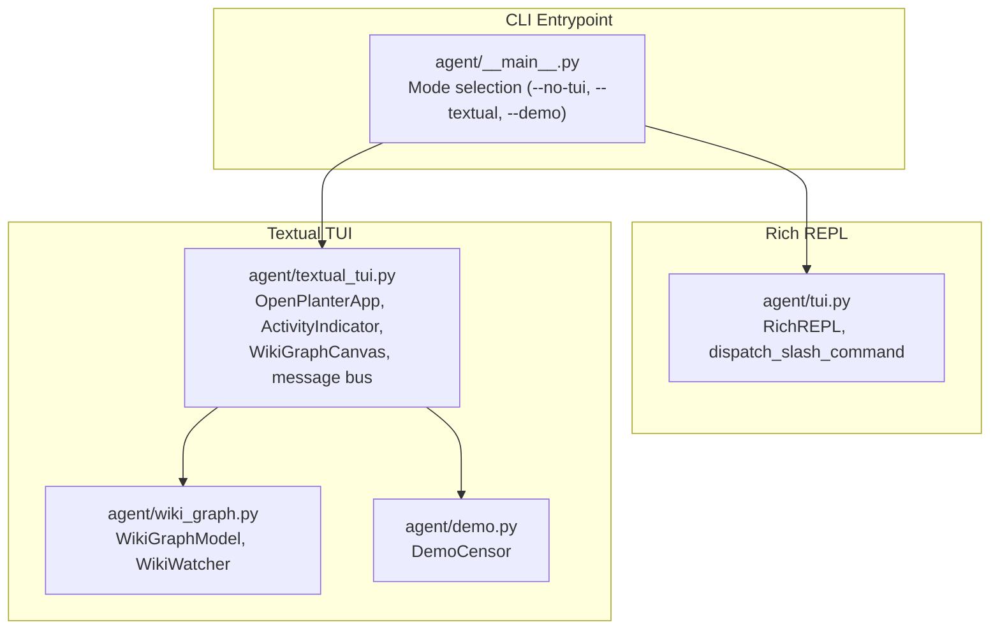
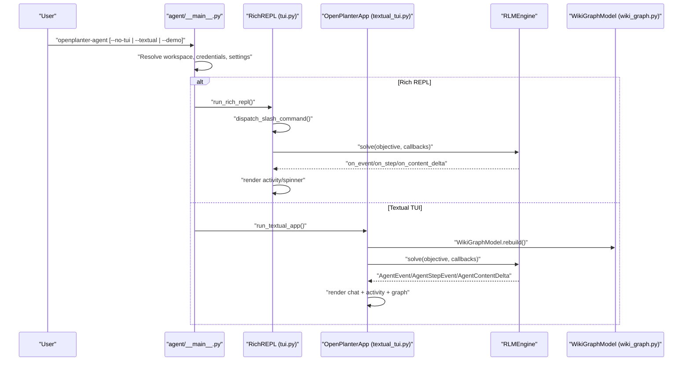
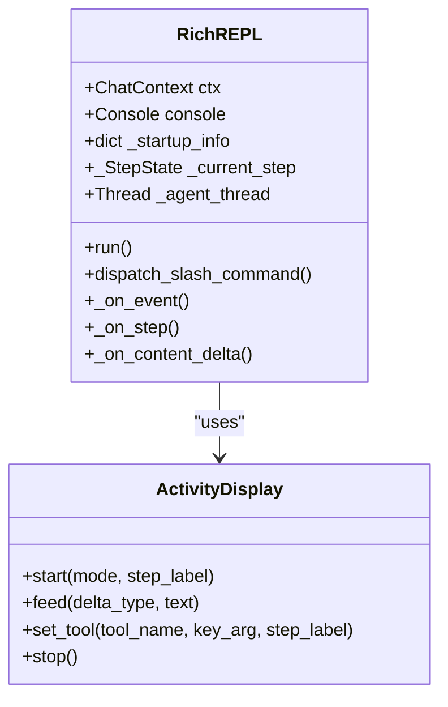
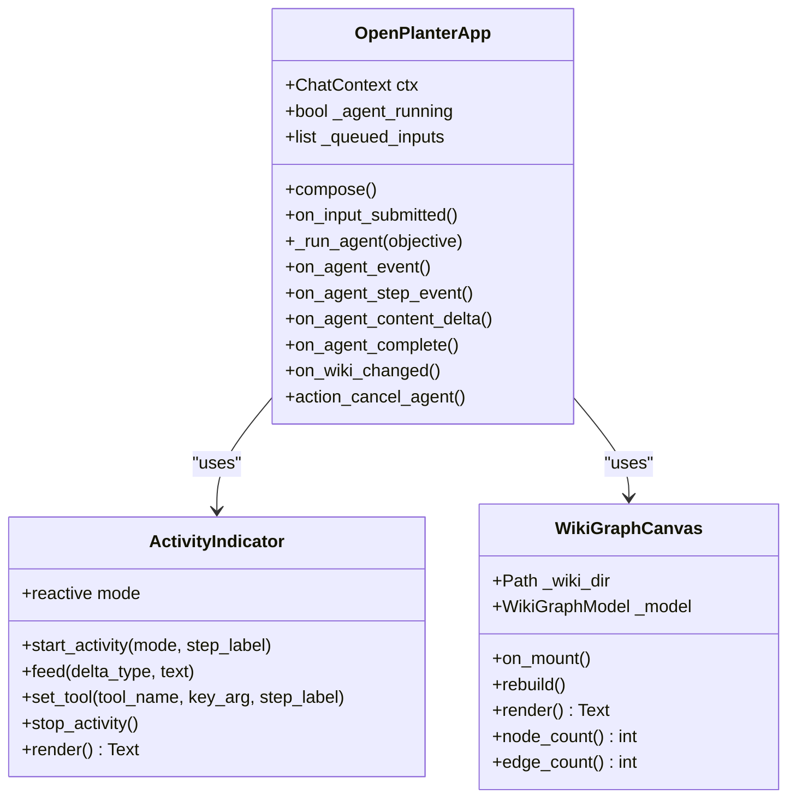
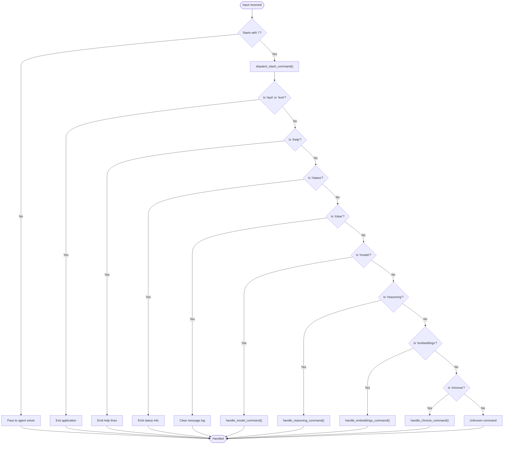
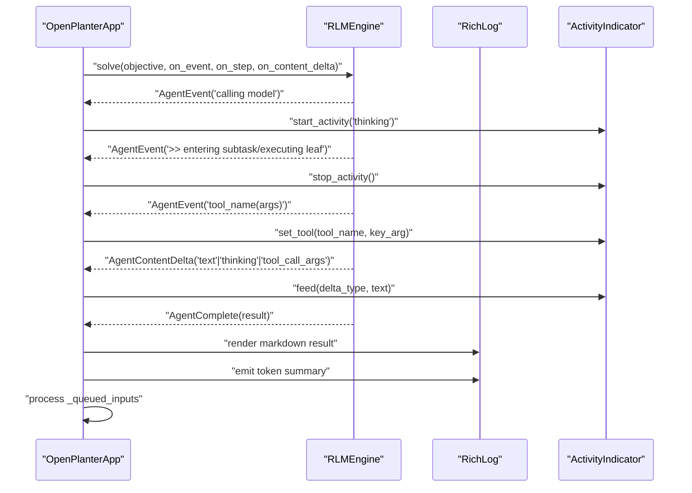
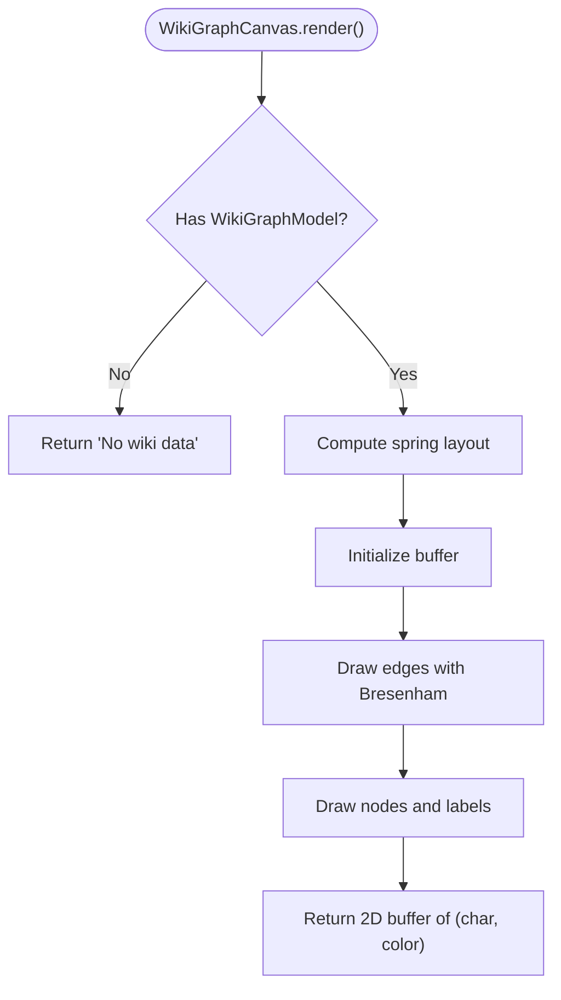
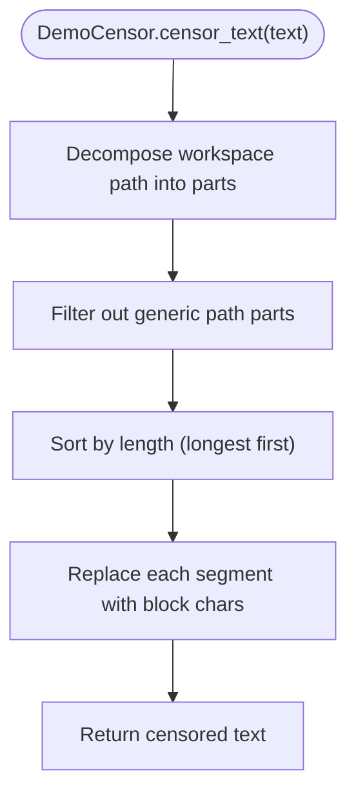
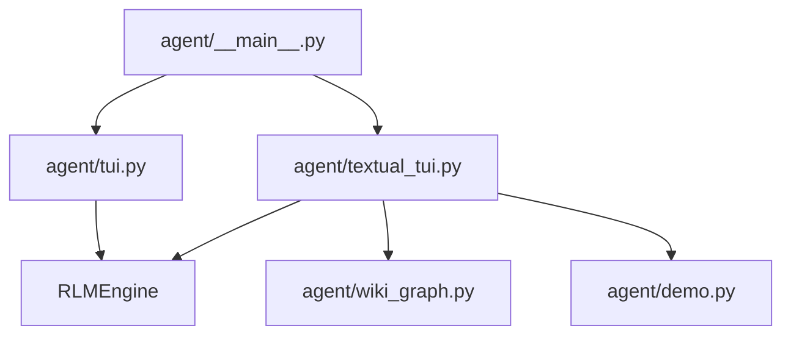

# Terminal User Interface

<cite>
**Referenced Files in This Document**
- [textual_tui.py](file://agent/textual_tui.py)
- [tui.py](file://agent/tui.py)
- [demo.py](file://agent/demo.py)
- [wiki_graph.py](file://agent/wiki_graph.py)
- [__main__.py](file://agent/__main__.py)
- [test_textual_tui.py](file://tests/test_textual_tui.py)
- [test_tui_repl.py](file://tests/test_tui_repl.py)
- [README.md](file://README.md)
- [DEMO.md](file://DEMO.md)
</cite>

## Table of Contents
1. [Introduction](#introduction)
2. [Project Structure](#project-structure)
3. [Core Components](#core-components)
4. [Architecture Overview](#architecture-overview)
5. [Detailed Component Analysis](#detailed-component-analysis)
6. [Dependency Analysis](#dependency-analysis)
7. [Performance Considerations](#performance-considerations)
8. [Troubleshooting Guide](#troubleshooting-guide)
9. [Conclusion](#conclusion)
10. [Appendices](#appendices)

## Introduction
This document explains the terminal user interface (TUI) functionality for OpenPlanter, focusing on:
- The Rich REPL (with colors and spinners)
- The Textual-based TUI with a wiki knowledge graph panel
- Interactive chat interface and slash command system
- Real-time conversation flow and session management
- Demo mode for anonymized output
- Terminal compatibility and performance considerations
- Troubleshooting guidance for terminal rendering issues

## Project Structure
The terminal UI is implemented primarily in the agent package:
- Rich REPL and plain REPL: [tui.py](file://agent/tui.py)
- Textual TUI with wiki graph: [textual_tui.py](file://agent/textual_tui.py)
- Wiki knowledge graph model and renderer: [wiki_graph.py](file://agent/wiki_graph.py)
- Demo mode output censoring: [demo.py](file://agent/demo.py)
- CLI entry point and mode selection: [__main__.py](file://agent/__main__.py)
- Tests validating TUI behavior: [test_textual_tui.py](file://tests/test_textual_tui.py), [test_tui_repl.py](file://tests/test_tui_repl.py)

**Diagram sources**
- [__main__.py:708-800](file://agent/__main__.py#L708-L800)
- [tui.py:940-1317](file://agent/tui.py#L940-L1317)
- [textual_tui.py:341-789](file://agent/textual_tui.py#L341-L789)
- [wiki_graph.py:243-495](file://agent/wiki_graph.py#L243-L495)
- [demo.py:29-111](file://agent/demo.py#L29-L111)

**Section sources**
- [__main__.py:708-800](file://agent/__main__.py#L708-L800)
- [README.md:55-90](file://README.md#L55-L90)

## Core Components
- Rich REPL: A colorful, spinner-enhanced terminal interface powered by Rich and prompt_toolkit. Supports slash commands, live step rendering, and queued inputs while an agent is running.
- Textual TUI: A widget-based terminal UI using Textual, featuring a chat pane, an activity indicator, a prompt input, and a wiki knowledge graph panel with live updates.
- Slash Command System: A unified dispatcher for commands like /help, /quit, /exit, /status, /clear, /model, /reasoning, /embeddings, and /chrome.
- Demo Mode: Anonymizes workspace paths in TUI output for safe demonstrations.
- Wiki Knowledge Graph: Parses wiki entries, extracts cross-references, and renders a character-cell graph with live filesystem watching.

**Section sources**
- [tui.py:20-31](file://agent/tui.py#L20-L31)
- [tui.py:505-567](file://agent/tui.py#L505-L567)
- [textual_tui.py:341-789](file://agent/textual_tui.py#L341-L789)
- [demo.py:29-111](file://agent/demo.py#L29-L111)
- [wiki_graph.py:243-495](file://agent/wiki_graph.py#L243-L495)

## Architecture Overview
The terminal UI architecture separates concerns between:
- CLI mode selection and runtime configuration
- Rich REPL for immediate, non-blocking interaction
- Textual TUI for advanced visualization and real-time graph updates
- Slash command dispatch and session management
- Demo mode censorship for anonymization

**Diagram sources**
- [__main__.py:708-800](file://agent/__main__.py#L708-L800)
- [tui.py:940-1317](file://agent/tui.py#L940-L1317)
- [textual_tui.py:547-693](file://agent/textual_tui.py#L547-L693)
- [wiki_graph.py:264-302](file://agent/wiki_graph.py#L264-L302)

## Detailed Component Analysis

### Rich REPL (with colors and spinners)
The Rich REPL provides a fully interactive terminal experience with:
- Colorful output via Rich
- Spinner-like activity display for thinking, streaming, tool execution, and tool argument generation
- Slash command handling and queued input processing
- Demo mode integration for anonymized output

Key behaviors:
- Slash commands are dispatched before launching the agent
- While an agent is running, non-slash inputs are queued and executed after completion
- Activity transitions from thinking to streaming when text deltas arrive
- Tool calls are tracked and rendered with elapsed time and error flags

**Diagram sources**
- [tui.py:940-1317](file://agent/tui.py#L940-L1317)
- [tui.py:698-939](file://agent/tui.py#L698-L939)

**Section sources**
- [tui.py:940-1317](file://agent/tui.py#L940-L1317)
- [tui.py:698-939](file://agent/tui.py#L698-L939)
- [test_tui_repl.py:231-333](file://tests/test_tui_repl.py#L231-L333)

### Textual-based TUI with wiki knowledge graph panel
The Textual TUI offers a widget-based layout with:
- Chat pane: RichLog for message history, ActivityIndicator for live status, Input for prompts
- Graph pane: WikiGraphCanvas rendering a force-directed graph of wiki sources
- Message bus: AgentEvent, AgentStepEvent, AgentContentDelta, AgentComplete, WikiChanged
- Live graph updates via WikiWatcher polling the wiki directory

**Diagram sources**
- [textual_tui.py:341-789](file://agent/textual_tui.py#L341-L789)
- [textual_tui.py:106-257](file://agent/textual_tui.py#L106-L257)
- [textual_tui.py:279-335](file://agent/textual_tui.py#L279-L335)

**Section sources**
- [textual_tui.py:341-789](file://agent/textual_tui.py#L341-L789)
- [test_textual_tui.py:176-250](file://tests/test_textual_tui.py#L176-L250)

### Slash Command System
The slash command system supports:
- /help: Displays available commands and usage
- /status: Shows provider, model, reasoning effort, embeddings, tokens, and Chrome MCP status
- /clear: Clears the chat log
- /quit /exit: Exits the application
- /model: Switch models, list providers/models, persist defaults
- /reasoning: Adjust reasoning effort and persist
- /embeddings: Switch embeddings provider and persist
- /chrome: Control Chrome DevTools MCP (status, on/off/auto/url/channel) and persist

**Diagram sources**
- [tui.py:505-567](file://agent/tui.py#L505-L567)
- [tui.py:222-316](file://agent/tui.py#L222-L316)
- [tui.py:319-357](file://agent/tui.py#L319-L357)
- [tui.py:414-438](file://agent/tui.py#L414-L438)
- [tui.py:441-502](file://agent/tui.py#L441-L502)

**Section sources**
- [tui.py:20-31](file://agent/tui.py#L20-L31)
- [tui.py:114-124](file://agent/tui.py#L114-L124)
- [tui.py:505-567](file://agent/tui.py#L505-L567)

### Real-time Conversation Flow
The conversation flow integrates agent callbacks with UI rendering:
- AgentEvent: Parses trace prefixes and transitions activity modes
- AgentStepEvent: Builds step state, tracks tool calls, and flags errors
- AgentContentDelta: Feeds text deltas to the activity indicator
- AgentComplete: Renders final markdown result, token summary, and processes queued inputs

**Diagram sources**
- [textual_tui.py:575-693](file://agent/textual_tui.py#L575-L693)
- [textual_tui.py:709-770](file://agent/textual_tui.py#L709-L770)

**Section sources**
- [textual_tui.py:575-693](file://agent/textual_tui.py#L575-L693)
- [textual_tui.py:709-770](file://agent/textual_tui.py#L709-L770)

### Wiki Knowledge Graph Integration
The wiki graph panel:
- Parses wiki/index.md and individual markdown files to extract cross-references
- Builds a NetworkX graph and computes a spring layout scaled to character cells
- Renders a character-cell visualization with node colors by category
- Watches the wiki directory for changes and rebuilds the graph live

**Diagram sources**
- [wiki_graph.py:348-406](file://agent/wiki_graph.py#L348-L406)
- [textual_tui.py:279-335](file://agent/textual_tui.py#L279-L335)

**Section sources**
- [wiki_graph.py:243-495](file://agent/wiki_graph.py#L243-L495)
- [textual_tui.py:279-335](file://agent/textual_tui.py#L279-L335)

### Demo Mode for Anonymized Output
Demo mode censors workspace path segments in TUI output:
- Builds replacement tables from the workspace path
- Preserves Rich Text style spans by replacing characters with block characters of equal length
- Applies to text, markdown, and rules before display

**Diagram sources**
- [demo.py:29-111](file://agent/demo.py#L29-L111)

**Section sources**
- [demo.py:29-111](file://agent/demo.py#L29-L111)
- [__main__.py:517-519](file://agent/__main__.py#L517-L519)

## Dependency Analysis
The terminal UI components depend on:
- Rich and prompt_toolkit for Rich REPL
- Textual for the TUI widgets and message bus
- NetworkX for the wiki graph layout
- Engine callbacks for real-time agent events

**Diagram sources**
- [tui.py:13-16](file://agent/tui.py#L13-L16)
- [textual_tui.py:25-42](file://agent/textual_tui.py#L25-L42)
- [wiki_graph.py:17-21](file://agent/wiki_graph.py#L17-L21)
- [__main__.py:35](file://agent/__main__.py#L35)

**Section sources**
- [tui.py:13-16](file://agent/tui.py#L13-L16)
- [textual_tui.py:25-42](file://agent/textual_tui.py#L25-L42)
- [wiki_graph.py:17-21](file://agent/wiki_graph.py#L17-L21)
- [__main__.py:35](file://agent/__main__.py#L35)

## Performance Considerations
- Rich REPL: Uses a Live renderer at 8fps for smooth spinner updates; minimal overhead for small terminal sizes.
- Textual TUI: Character-cell rendering scales with terminal dimensions; layout recomputation occurs on resize and graph rebuild.
- Wiki graph: Spring layout computation is O(N^2) in worst case; caching and incremental rebuilds reduce cost.
- Demo mode: String replacement operations scale linearly with output length; minimal impact on agent throughput.
- Terminal compatibility: Rich REPL requires ANSI-capable terminals; Textual relies on Textual’s rendering pipeline.

[No sources needed since this section provides general guidance]

## Troubleshooting Guide
Common terminal rendering issues and resolutions:
- Rich REPL spinner not updating:
  - Ensure the terminal supports ANSI sequences and cursor control.
  - Verify Rich and prompt_toolkit are installed.
- Textual TUI not displaying:
  - Confirm Textual is installed and the terminal supports Unicode block characters.
  - Check that the terminal size is sufficient for the layout.
- Wiki graph not appearing:
  - Ensure the wiki directory exists and contains index.md and markdown files.
  - Verify NetworkX is installed for graph layout calculations.
- Demo mode not censoring:
  - Confirm demo mode is enabled via CLI flag.
  - Verify workspace path resolution is correct.

**Section sources**
- [README.md:444](file://README.md#L444)
- [__main__.py:517-519](file://agent/__main__.py#L517-L519)

## Conclusion
OpenPlanter’s terminal UI provides two complementary experiences:
- Rich REPL for quick, colorful interaction with live activity feedback
- Textual TUI for advanced visualization with a live wiki knowledge graph

Both integrate a robust slash command system, real-time conversation flow, and demo mode for anonymized output. Choose Rich REPL for simplicity and speed, or Textual TUI for richer visual context and graph exploration.

[No sources needed since this section summarizes without analyzing specific files]

## Appendices

### Practical Examples
- Interactive investigations:
  - Use /help to explore available commands.
  - Use /status to verify model and provider configuration.
  - Use /model and /reasoning to adjust agent behavior.
  - Use /embeddings and /chrome to configure retrieval and browser tools.
- Session management:
  - Use /clear to reset the conversation.
  - Use /quit or /exit to terminate the session.
- Real-time flow:
  - Observe thinking, streaming, and tool execution phases in the activity indicator.
  - Review step headers, model previews, and tool call trees after completion.

**Section sources**
- [tui.py:114-124](file://agent/tui.py#L114-L124)
- [textual_tui.py:575-693](file://agent/textual_tui.py#L575-L693)
- [DEMO.md:9-120](file://DEMO.md#L9-L120)