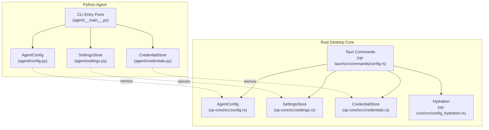
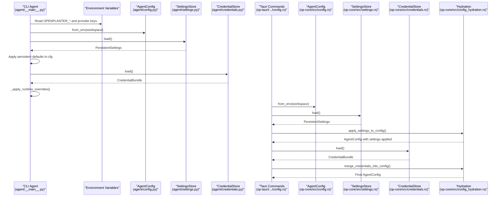
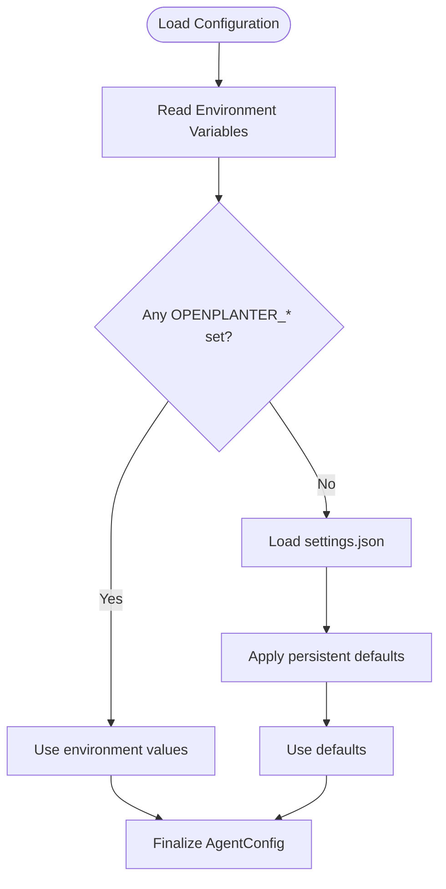
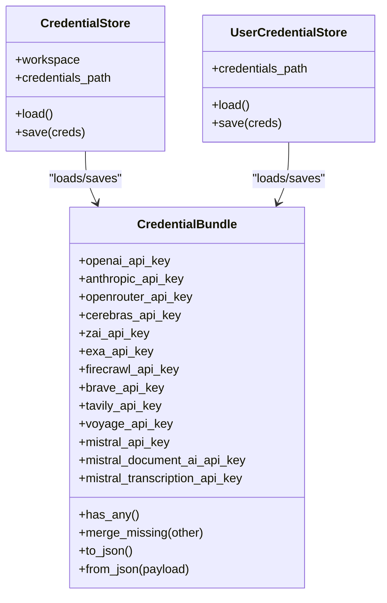
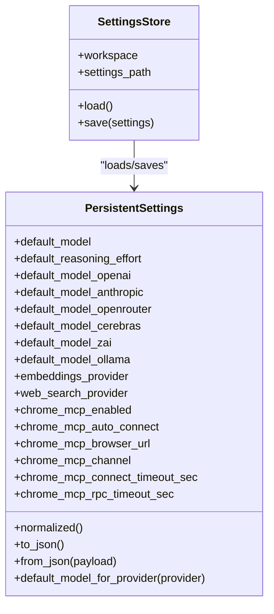
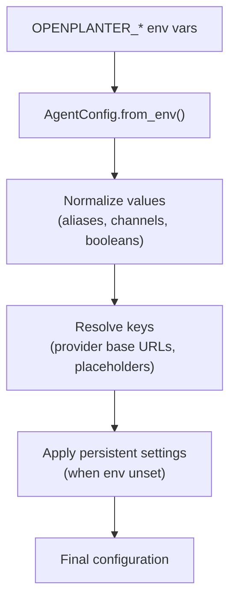
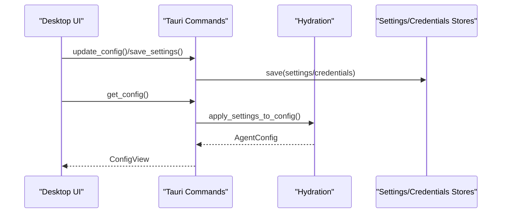
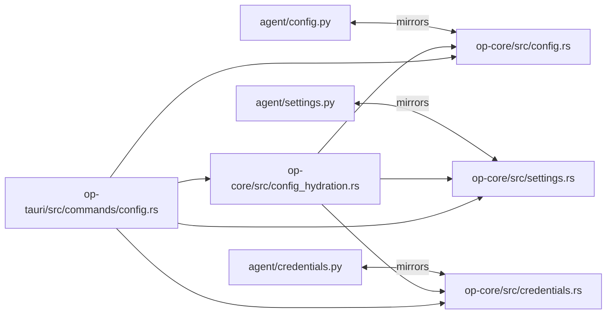

# Configuration Management

<cite>
**Referenced Files in This Document**
- [agent/config.py](file://agent/config.py)
- [agent/settings.py](file://agent/settings.py)
- [agent/credentials.py](file://agent/credentials.py)
- [openplanter-desktop/crates/op-core/src/config.rs](file://openplanter-desktop/crates/op-core/src/config.rs)
- [openplanter-desktop/crates/op-core/src/settings.rs](file://openplanter-desktop/crates/op-core/src/settings.rs)
- [openplanter-desktop/crates/op-core/src/credentials.rs](file://openplanter-desktop/crates/op-core/src/credentials.rs)
- [openplanter-desktop/crates/op-core/src/config_hydration.rs](file://openplanter-desktop/crates/op-core/src/config_hydration.rs)
- [openplanter-desktop/crates/op-tauri/src/commands/config.rs](file://openplanter-desktop/crates/op-tauri/src/commands/config.rs)
- [agent/__main__.py](file://agent/__main__.py)
</cite>

## Table of Contents
1. [Introduction](#introduction)
2. [Project Structure](#project-structure)
3. [Core Components](#core-components)
4. [Architecture Overview](#architecture-overview)
5. [Detailed Component Analysis](#detailed-component-analysis)
6. [Dependency Analysis](#dependency-analysis)
7. [Performance Considerations](#performance-considerations)
8. [Troubleshooting Guide](#troubleshooting-guide)
9. [Conclusion](#conclusion)
10. [Appendices](#appendices)

## Introduction
This document explains configuration management across the OpenPlanter project, focusing on credential handling, persistent settings, and environment variable management. It describes the configuration hierarchy from CLI flags to environment variables to persistent settings, details how credentials are stored and resolved, and provides practical guidance for workspace-specific configuration, provider customization, and migration between environments. It also clarifies the relationship between the desktop application settings and the CLI agent configuration.

## Project Structure
OpenPlanter implements configuration in two complementary stacks:
- Python CLI agent: handles CLI parsing, environment variable loading, persistent settings, and credential persistence.
- Rust desktop core: mirrors the Python configuration model, resolves credentials, applies persistent settings, and exposes configuration via Tauri commands.

**Diagram sources**
- [agent/config.py:146-495](file://agent/config.py#L146-L495)
- [agent/settings.py:70-225](file://agent/settings.py#L70-L225)
- [agent/credentials.py:292-424](file://agent/credentials.py#L292-L424)
- [openplanter-desktop/crates/op-core/src/config.rs:254-675](file://openplanter-desktop/crates/op-core/src/config.rs#L254-L675)
- [openplanter-desktop/crates/op-core/src/settings.rs:49-308](file://openplanter-desktop/crates/op-core/src/settings.rs#L49-L308)
- [openplanter-desktop/crates/op-core/src/credentials.rs:289-386](file://openplanter-desktop/crates/op-core/src/credentials.rs#L289-L386)
- [openplanter-desktop/crates/op-core/src/config_hydration.rs:11-240](file://openplanter-desktop/crates/op-core/src/config_hydration.rs#L11-L240)
- [openplanter-desktop/crates/op-tauri/src/commands/config.rs:119-532](file://openplanter-desktop/crates/op-tauri/src/commands/config.rs#L119-L532)

**Section sources**
- [agent/config.py:146-495](file://agent/config.py#L146-L495)
- [agent/settings.py:70-225](file://agent/settings.py#L70-L225)
- [agent/credentials.py:292-424](file://agent/credentials.py#L292-L424)
- [openplanter-desktop/crates/op-core/src/config.rs:254-675](file://openplanter-desktop/crates/op-core/src/config.rs#L254-L675)
- [openplanter-desktop/crates/op-core/src/settings.rs:49-308](file://openplanter-desktop/crates/op-core/src/settings.rs#L49-L308)
- [openplanter-desktop/crates/op-core/src/credentials.rs:289-386](file://openplanter-desktop/crates/op-core/src/credentials.rs#L289-L386)
- [openplanter-desktop/crates/op-core/src/config_hydration.rs:11-240](file://openplanter-desktop/crates/op-core/src/config_hydration.rs#L11-L240)
- [openplanter-desktop/crates/op-tauri/src/commands/config.rs:119-532](file://openplanter-desktop/crates/op-tauri/src/commands/config.rs#L119-L532)

## Core Components
- AgentConfig: Central configuration dataclass for both Python and Rust, encapsulating provider selection, model, base URLs, API keys, limits, and browser automation settings. It loads from environment variables and normalizes values.
- PersistentSettings: Workspace-scoped defaults persisted to settings.json, including default model per provider, reasoning effort, embeddings/web search providers, recursion policy, and Chrome MCP settings.
- CredentialBundle and stores: Encapsulate API keys for multiple providers, with separate workspace-level and user-level persistence. Supports .env parsing and secure file permissions.

Key behaviors:
- Environment variable precedence: Values from environment variables override defaults and persistent settings.
- Persistent settings fallback: If environment variables are not set, defaults are taken from settings.json.
- Credential resolution: Runtime credentials can be supplied via environment variables or .env files and merged into the active configuration.

**Section sources**
- [agent/config.py:146-495](file://agent/config.py#L146-L495)
- [agent/settings.py:70-225](file://agent/settings.py#L70-L225)
- [agent/credentials.py:12-147](file://agent/credentials.py#L12-L147)
- [openplanter-desktop/crates/op-core/src/config.rs:254-675](file://openplanter-desktop/crates/op-core/src/config.rs#L254-L675)
- [openplanter-desktop/crates/op-core/src/settings.rs:49-308](file://openplanter-desktop/crates/op-core/src/settings.rs#L49-L308)
- [openplanter-desktop/crates/op-core/src/credentials.rs:10-134](file://openplanter-desktop/crates/op-core/src/credentials.rs#L10-L134)

## Architecture Overview
The configuration pipeline follows a strict hierarchy and hydration process:

**Diagram sources**
- [agent/__main__.py:708-789](file://agent/__main__.py#L708-L789)
- [agent/config.py:262-495](file://agent/config.py#L262-L495)
- [agent/settings.py:210-225](file://agent/settings.py#L210-L225)
- [agent/credentials.py:304-321](file://agent/credentials.py#L304-L321)
- [openplanter-desktop/crates/op-tauri/src/commands/config.rs:119-532](file://openplanter-desktop/crates/op-tauri/src/commands/config.rs#L119-L532)
- [openplanter-desktop/crates/op-core/src/config.rs:439-675](file://openplanter-desktop/crates/op-core/src/config.rs#L439-L675)
- [openplanter-desktop/crates/op-core/src/settings.rs:276-308](file://openplanter-desktop/crates/op-core/src/settings.rs#L276-L308)
- [openplanter-desktop/crates/op-core/src/credentials.rs:294-334](file://openplanter-desktop/crates/op-core/src/credentials.rs#L294-L334)
- [openplanter-desktop/crates/op-core/src/config_hydration.rs:82-199](file://openplanter-desktop/crates/op-core/src/config_hydration.rs#L82-L199)

## Detailed Component Analysis

### Configuration Hierarchy and Resolution
- Environment variables: Highest precedence. Keys include OPENPLANTER_* variants for each provider and feature flag, plus legacy keys for compatibility.
- Persistent settings: Applied when environment variables are not set. Stored under the workspace’s .openplanter/settings.json.
- Defaults: Lowest precedence; provided by the configuration dataclasses.

**Diagram sources**
- [agent/__main__.py:593-646](file://agent/__main__.py#L593-L646)
- [agent/config.py:262-495](file://agent/config.py#L262-L495)
- [agent/settings.py:210-225](file://agent/settings.py#L210-L225)

**Section sources**
- [agent/__main__.py:593-646](file://agent/__main__.py#L593-L646)
- [agent/config.py:262-495](file://agent/config.py#L262-L495)
- [agent/settings.py:210-225](file://agent/settings.py#L210-L225)

### Credential Storage and Security
- Storage locations:
  - Workspace-level: {workspace}/.openplanter/credentials.json
  - User-level: ~/.openplanter/credentials.json
- Persistence behavior:
  - Writes are made with restrictive permissions (owner-only) on Unix-like systems.
  - Parsing supports .env files and strips quotes.
- Resolution order:
  - Existing config values take precedence.
  - Environment-provided credentials override stored values.
  - .env files discovered by walking up the workspace tree are considered.

**Diagram sources**
- [agent/credentials.py:12-147](file://agent/credentials.py#L12-L147)
- [agent/credentials.py:292-424](file://agent/credentials.py#L292-L424)
- [openplanter-desktop/crates/op-core/src/credentials.rs:10-134](file://openplanter-desktop/crates/op-core/src/credentials.rs#L10-L134)
- [openplanter-desktop/crates/op-core/src/credentials.rs:289-386](file://openplanter-desktop/crates/op-core/src/credentials.rs#L289-L386)

**Section sources**
- [agent/credentials.py:12-147](file://agent/credentials.py#L12-L147)
- [agent/credentials.py:292-424](file://agent/credentials.py#L292-L424)
- [openplanter-desktop/crates/op-core/src/credentials.rs:10-134](file://openplanter-desktop/crates/op-core/src/credentials.rs#L10-L134)
- [openplanter-desktop/crates/op-core/src/credentials.rs:289-386](file://openplanter-desktop/crates/op-core/src/credentials.rs#L289-L386)

### Persistent Settings Management
- Purpose: Store workspace-specific defaults for models, reasoning effort, providers, and operational parameters.
- Validation and normalization: Ensures values are trimmed, validated, and normalized (e.g., model aliases, channels, booleans).
- Merge semantics: Desktop commands support merging incoming settings with existing ones.

**Diagram sources**
- [agent/settings.py:70-225](file://agent/settings.py#L70-L225)
- [agent/settings.py:198-225](file://agent/settings.py#L198-L225)
- [openplanter-desktop/crates/op-core/src/settings.rs:49-308](file://openplanter-desktop/crates/op-core/src/settings.rs#L49-L308)
- [openplanter-desktop/crates/op-core/src/settings.rs:276-308](file://openplanter-desktop/crates/op-core/src/settings.rs#L276-L308)

**Section sources**
- [agent/settings.py:70-225](file://agent/settings.py#L70-L225)
- [agent/settings.py:198-225](file://agent/settings.py#L198-L225)
- [openplanter-desktop/crates/op-core/src/settings.rs:49-308](file://openplanter-desktop/crates/op-core/src/settings.rs#L49-L308)
- [openplanter-desktop/crates/op-core/src/settings.rs:276-308](file://openplanter-desktop/crates/op-core/src/settings.rs#L276-L308)

### Provider and Model Customization
- Environment-driven customization:
  - OPENPLANTER_PROVIDER, OPENPLANTER_MODEL, OPENPLANTER_REASONING_EFFORT
  - OPENPLANTER_WEB_SEARCH_PROVIDER, OPENPLANTER_EMBEDDINGS_PROVIDER
  - OPENPLANTER_RECURSIVE, OPENPLANTER_RECURSION_POLICY, OPENPLANTER_MAX_DEPTH, OPENPLANTER_MIN_SUBTASK_DEPTH
- Model alias normalization: Accepts short aliases and maps to canonical model IDs.
- Base URLs and keys: Provider-specific base URLs and keys are resolved, with special handling for Foundry placeholders.

**Diagram sources**
- [agent/config.py:262-495](file://agent/config.py#L262-L495)
- [openplanter-desktop/crates/op-core/src/config.rs:439-675](file://openplanter-desktop/crates/op-core/src/config.rs#L439-L675)
- [openplanter-desktop/crates/op-core/src/config_hydration.rs:82-199](file://openplanter-desktop/crates/op-core/src/config_hydration.rs#L82-L199)

**Section sources**
- [agent/config.py:262-495](file://agent/config.py#L262-L495)
- [openplanter-desktop/crates/op-core/src/config.rs:439-675](file://openplanter-desktop/crates/op-core/src/config.rs#L439-L675)
- [openplanter-desktop/crates/op-core/src/config_hydration.rs:82-199](file://openplanter-desktop/crates/op-core/src/config_hydration.rs#L82-L199)

### Desktop Application vs CLI Agent Configuration
- Both stacks mirror the same configuration model and priorities.
- Tauri commands expose configuration views, update fields, and persist settings.
- Hydration logic merges persistent settings and credentials into the runtime configuration, respecting environment overrides.

**Diagram sources**
- [openplanter-desktop/crates/op-tauri/src/commands/config.rs:119-532](file://openplanter-desktop/crates/op-tauri/src/commands/config.rs#L119-L532)
- [openplanter-desktop/crates/op-core/src/config_hydration.rs:82-199](file://openplanter-desktop/crates/op-core/src/config_hydration.rs#L82-L199)
- [openplanter-desktop/crates/op-core/src/settings.rs:276-308](file://openplanter-desktop/crates/op-core/src/settings.rs#L276-L308)
- [openplanter-desktop/crates/op-core/src/credentials.rs:294-334](file://openplanter-desktop/crates/op-core/src/credentials.rs#L294-L334)

**Section sources**
- [openplanter-desktop/crates/op-tauri/src/commands/config.rs:119-532](file://openplanter-desktop/crates/op-tauri/src/commands/config.rs#L119-L532)
- [openplanter-desktop/crates/op-core/src/config_hydration.rs:82-199](file://openplanter-desktop/crates/op-core/src/config_hydration.rs#L82-L199)
- [openplanter-desktop/crates/op-core/src/settings.rs:276-308](file://openplanter-desktop/crates/op-core/src/settings.rs#L276-L308)
- [openplanter-desktop/crates/op-core/src/credentials.rs:294-334](file://openplanter-desktop/crates/op-core/src/credentials.rs#L294-L334)

## Dependency Analysis
- Python and Rust configurations are designed to mirror each other, ensuring parity in behavior and keys.
- Hydration module orchestrates merging of persistent settings and credentials into the runtime configuration.
- Tauri commands depend on stores and hydration to present and update configuration consistently.

**Diagram sources**
- [agent/config.py:146-495](file://agent/config.py#L146-L495)
- [openplanter-desktop/crates/op-core/src/config.rs:254-675](file://openplanter-desktop/crates/op-core/src/config.rs#L254-L675)
- [openplanter-desktop/crates/op-core/src/config_hydration.rs:11-240](file://openplanter-desktop/crates/op-core/src/config_hydration.rs#L11-L240)
- [openplanter-desktop/crates/op-tauri/src/commands/config.rs:119-532](file://openplanter-desktop/crates/op-tauri/src/commands/config.rs#L119-L532)

**Section sources**
- [agent/config.py:146-495](file://agent/config.py#L146-L495)
- [openplanter-desktop/crates/op-core/src/config.rs:254-675](file://openplanter-desktop/crates/op-core/src/config.rs#L254-L675)
- [openplanter-desktop/crates/op-core/src/config_hydration.rs:11-240](file://openplanter-desktop/crates/op-core/src/config_hydration.rs#L11-L240)
- [openplanter-desktop/crates/op-tauri/src/commands/config.rs:119-532](file://openplanter-desktop/crates/op-tauri/src/commands/config.rs#L119-L532)

## Performance Considerations
- Environment variable reads are fast and occur once during initialization.
- JSON serialization/deserialization for settings and credentials is lightweight and cached in memory by the desktop application state.
- Normalization and validation are performed once during construction; avoid repeated re-parsing unless settings change.

## Troubleshooting Guide
Common issues and resolutions:
- Missing provider credentials:
  - Symptom: Authentication errors when building models.
  - Action: Set OPENPLANTER_* or legacy *_API_KEY environment variables, or store keys via the desktop UI.
  - Reference: [openplanter-desktop/crates/op-core/src/builder.rs:164-232](file://openplanter-desktop/crates/op-core/src/builder.rs#L164-L232)
- Conflicting environment variables:
  - Symptom: Unexpected configuration values.
  - Action: Verify OPENPLANTER_* takes precedence over settings.json; remove conflicting environment variables or adjust values.
  - Reference: [agent/__main__.py:593-646](file://agent/__main__.py#L593-L646)
- .env file not applied:
  - Symptom: Keys not picked up from .env.
  - Action: Ensure .env exists in the workspace or an ancestor directory; verify syntax and quotes.
  - Reference: [agent/credentials.py:281-289](file://agent/credentials.py#L281-L289), [openplanter-desktop/crates/op-core/src/credentials.rs:271-287](file://openplanter-desktop/crates/op-core/src/credentials.rs#L271-L287)
- Permission errors on credentials.json:
  - Symptom: Access denied or insecure file permissions.
  - Action: On Unix-like systems, ensure 0600 permissions; on Windows, check antivirus or file locking.
  - Reference: [agent/credentials.py:317-321](file://agent/credentials.py#L317-L321), [openplanter-desktop/crates/op-core/src/credentials.rs:326-333](file://openplanter-desktop/crates/op-core/src/credentials.rs#L326-L333)
- Model alias not recognized:
  - Symptom: Unexpected model selection.
  - Action: Use canonical model IDs or accepted aliases; verify normalization.
  - Reference: [openplanter-desktop/crates/op-core/src/config.rs:122-149](file://openplanter-desktop/crates/op-core/src/config.rs#L122-L149)

**Section sources**
- [openplanter-desktop/crates/op-core/src/builder.rs:164-232](file://openplanter-desktop/crates/op-core/src/builder.rs#L164-L232)
- [agent/__main__.py:593-646](file://agent/__main__.py#L593-L646)
- [agent/credentials.py:281-289](file://agent/credentials.py#L281-L289)
- [openplanter-desktop/crates/op-core/src/credentials.rs:271-287](file://openplanter-desktop/crates/op-core/src/credentials.rs#L271-L287)
- [agent/credentials.py:317-321](file://agent/credentials.py#L317-L321)
- [openplanter-desktop/crates/op-core/src/credentials.rs:326-333](file://openplanter-desktop/crates/op-core/src/credentials.rs#L326-L333)
- [openplanter-desktop/crates/op-core/src/config.rs:122-149](file://openplanter-desktop/crates/op-core/src/config.rs#L122-L149)

## Conclusion
OpenPlanter’s configuration system provides a robust, layered approach to managing credentials and settings across environments. By prioritizing environment variables, falling back to persistent settings, and offering explicit stores for credentials, it balances flexibility and safety. The mirrored Python and Rust implementations ensure consistent behavior whether using the CLI agent or the desktop application.

## Appendices

### Configuration Scenarios and Examples
- Scenario A: Workspace-specific defaults
  - Persist default model and reasoning effort in settings.json; override only when necessary via environment variables.
  - Reference: [agent/settings.py:210-225](file://agent/settings.py#L210-L225), [openplanter-desktop/crates/op-core/src/settings.rs:288-308](file://openplanter-desktop/crates/op-core/src/settings.rs#L288-L308)
- Scenario B: Provider customization
  - Set OPENPLANTER_PROVIDER and OPENPLANTER_MODEL to preferred values; use aliases for convenience.
  - Reference: [agent/config.py:339-341](file://agent/config.py#L339-L341), [openplanter-desktop/crates/op-core/src/config.rs:523-526](file://openplanter-desktop/crates/op-core/src/config.rs#L523-L526)
- Scenario C: Chrome MCP configuration
  - Enable and tune Chrome MCP via environment variables or persistent settings; verify connectivity.
  - Reference: [agent/config.py:445-464](file://agent/config.py#L445-L464), [openplanter-desktop/crates/op-core/src/config.rs:623-640](file://openplanter-desktop/crates/op-core/src/config.rs#L623-L640)

### Migration Between Environments
- Export current configuration:
  - Use desktop commands to save settings and credentials to disk.
  - Reference: [openplanter-desktop/crates/op-tauri/src/commands/config.rs:287-296](file://openplanter-desktop/crates/op-tauri/src/commands/config.rs#L287-L296)
- Transfer credentials securely:
  - Copy credentials.json and settings.json to the target machine; ensure proper permissions.
  - Reference: [agent/credentials.py:313-321](file://agent/credentials.py#L313-L321)
- Validate environment variables:
  - Confirm OPENPLANTER_* variables align with intended configuration; remove unused keys.
  - Reference: [agent/config.py:262-495](file://agent/config.py#L262-L495)

### Security Considerations
- Credential storage:
  - Restrict file permissions to owner-only on Unix-like systems.
  - Avoid committing credentials.json to version control.
- Environment variables:
  - Prefer environment variables for ephemeral or CI contexts; avoid embedding secrets in scripts.
- Backup strategies:
  - Back up settings.json and credentials.json separately; encrypt backups if required by policy.
  - Reference: [openplanter-desktop/crates/op-core/src/credentials.rs:326-333](file://openplanter-desktop/crates/op-core/src/credentials.rs#L326-L333)