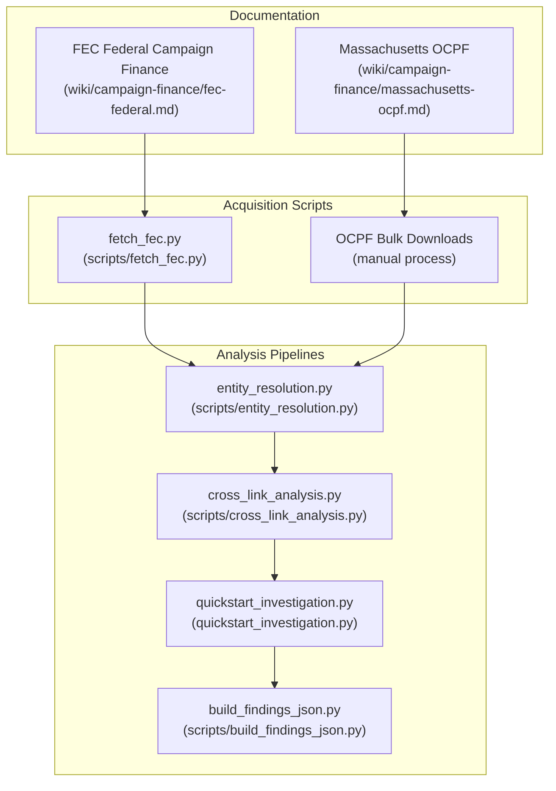
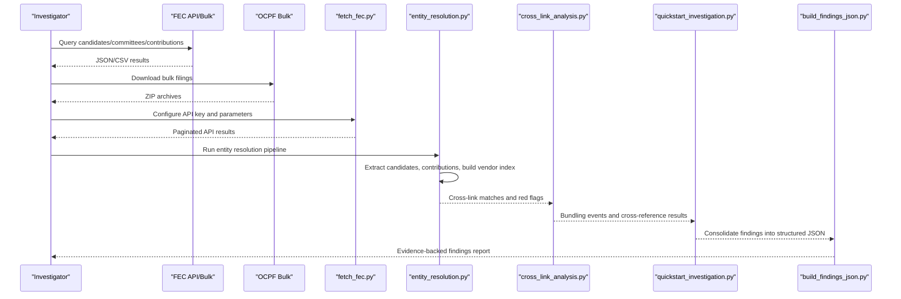
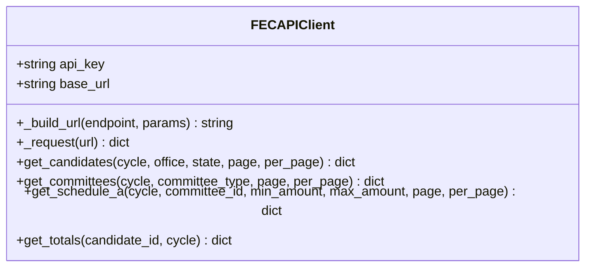
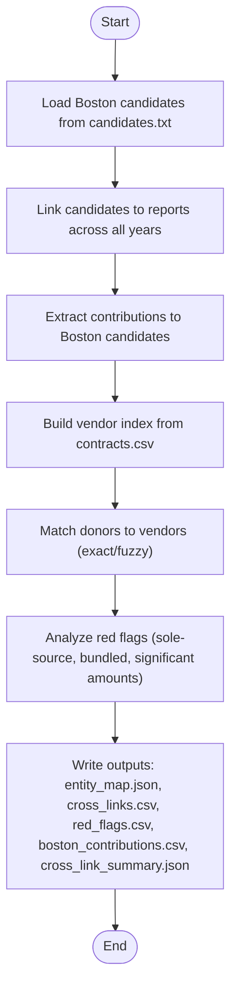
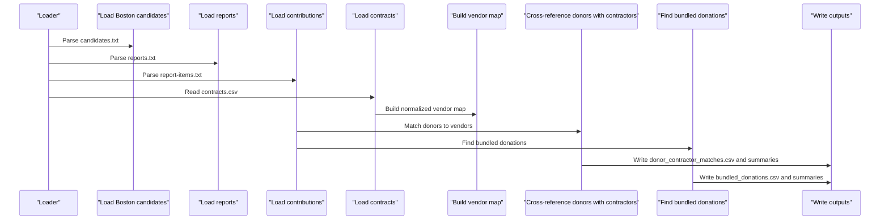
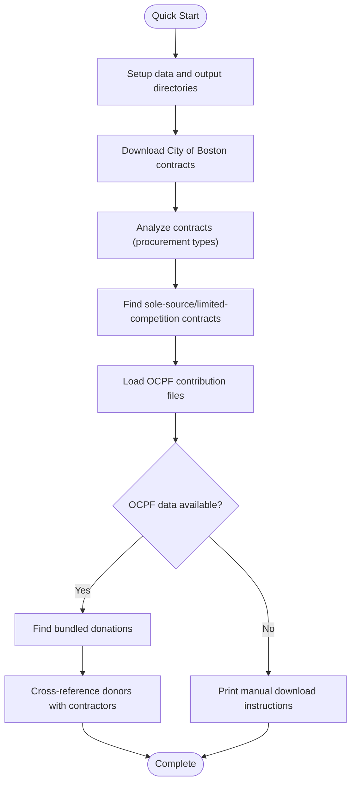
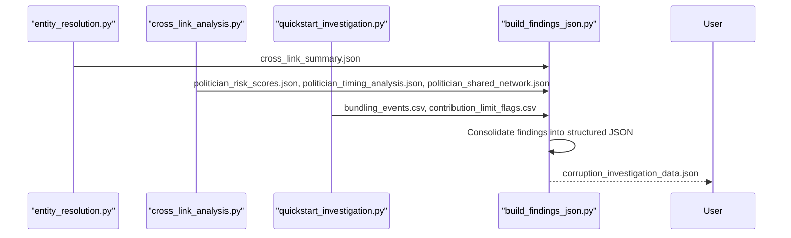
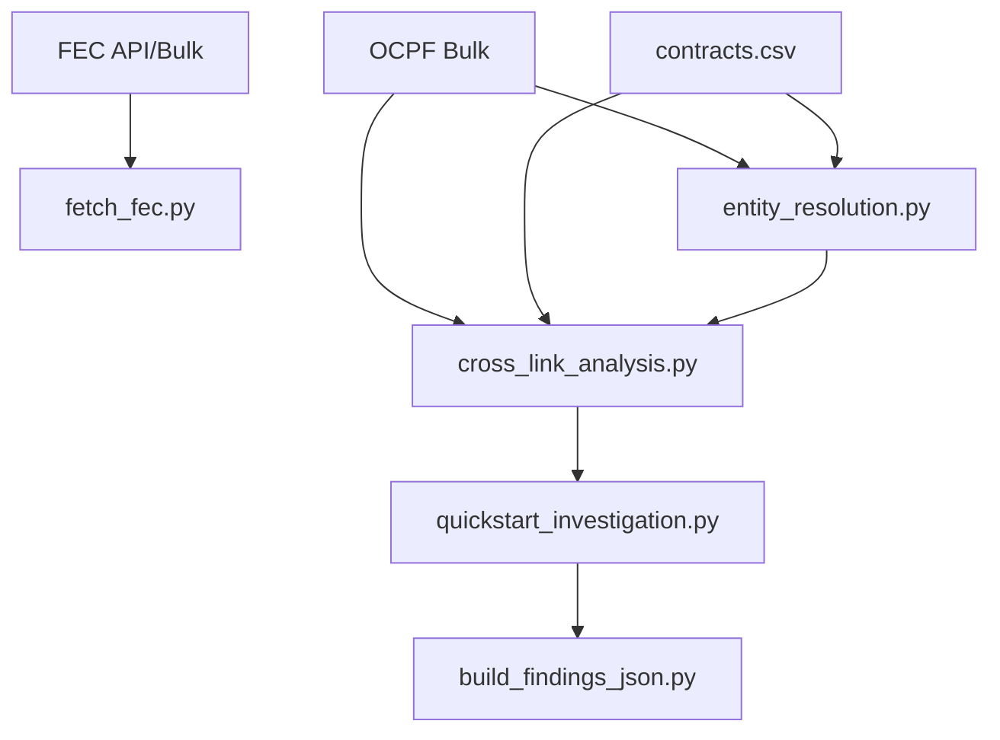

# Campaign Finance Sources

<cite>
**Referenced Files in This Document**
- [fec-federal.md](file://wiki/campaign-finance/fec-federal.md)
- [massachusetts-ocpf.md](file://wiki/campaign-finance/massachusetts-ocpf.md)
- [fetch_fec.py](file://scripts/fetch_fec.py)
- [entity_resolution.py](file://scripts/entity_resolution.py)
- [cross_link_analysis.py](file://scripts/cross_link_analysis.py)
- [build_findings_json.py](file://scripts/build_findings_json.py)
- [quickstart_investigation.py](file://quickstart_investigation.py)
- [README.md](file://README.md)
</cite>

## Table of Contents
1. [Introduction](#introduction)
2. [Project Structure](#project-structure)
3. [Core Components](#core-components)
4. [Architecture Overview](#architecture-overview)
5. [Detailed Component Analysis](#detailed-component-analysis)
6. [Dependency Analysis](#dependency-analysis)
7. [Performance Considerations](#performance-considerations)
8. [Troubleshooting Guide](#troubleshooting-guide)
9. [Conclusion](#conclusion)
10. [Appendices](#appendices)

## Introduction
This document provides comprehensive guidance for working with campaign finance data sources in the OpenPlanter project, focusing on Federal Election Commission (FEC) data and Massachusetts Office of Campaign and Political Finance (OCPF) data. It explains data schemas, access methods, query patterns, cross-referencing opportunities, and practical integration into investigation workflows. It also covers entity resolution strategies, finding generation, data validation, refresh cycles, and quality assurance for campaign finance data.

## Project Structure
The campaign finance documentation and tooling are organized as follows:
- Wiki documentation: dedicated markdown files for FEC and OCPF sources
- Scripts: reusable data acquisition and analysis tools
- Investigation workflows: end-to-end pipelines for entity resolution and finding generation

**Diagram sources**
- [fec-federal.md:1-203](file://wiki/campaign-finance/fec-federal.md#L1-L203)
- [massachusetts-ocpf.md:1-107](file://wiki/campaign-finance/massachusetts-ocpf.md#L1-L107)
- [fetch_fec.py:1-417](file://scripts/fetch_fec.py#L1-L417)
- [entity_resolution.py:1-741](file://scripts/entity_resolution.py#L1-L741)
- [cross_link_analysis.py:1-586](file://scripts/cross_link_analysis.py#L1-L586)
- [quickstart_investigation.py:1-395](file://quickstart_investigation.py#L1-L395)
- [build_findings_json.py:1-164](file://scripts/build_findings_json.py#L1-L164)

**Section sources**
- [README.md:1-449](file://README.md#L1-L449)

## Core Components
- Federal Election Commission (FEC) data: comprehensive federal campaign finance data via OpenFEC API and bulk downloads
- Massachusetts OCPF data: state-level campaign finance filings for Massachusetts, accessed via bulk downloads
- Acquisition scripts: programmatic access to FEC API and bulk downloads
- Analysis pipelines: entity resolution, cross-linking, and finding generation
- Investigation workflows: automated and manual processes for detecting potential conflicts of interest

**Section sources**
- [fec-federal.md:1-203](file://wiki/campaign-finance/fec-federal.md#L1-L203)
- [massachusetts-ocpf.md:1-107](file://wiki/campaign-finance/massachusetts-ocpf.md#L1-L107)
- [fetch_fec.py:1-417](file://scripts/fetch_fec.py#L1-L417)
- [entity_resolution.py:1-741](file://scripts/entity_resolution.py#L1-L741)
- [cross_link_analysis.py:1-586](file://scripts/cross_link_analysis.py#L1-L586)
- [quickstart_investigation.py:1-395](file://quickstart_investigation.py#L1-L395)
- [build_findings_json.py:1-164](file://scripts/build_findings_json.py#L1-L164)

## Architecture Overview
The campaign finance workflow integrates multiple data sources and analysis stages:

**Diagram sources**
- [fetch_fec.py:244-417](file://scripts/fetch_fec.py#L244-L417)
- [entity_resolution.py:540-741](file://scripts/entity_resolution.py#L540-L741)
- [cross_link_analysis.py:399-586](file://scripts/cross_link_analysis.py#L399-L586)
- [quickstart_investigation.py:354-395](file://quickstart_investigation.py#L354-L395)
- [build_findings_json.py:29-164](file://scripts/build_findings_json.py#L29-L164)

## Detailed Component Analysis

### Federal Election Commission (FEC) Data
- Access methods:
  - OpenFEC API: RESTful JSON API with comprehensive search and filter capabilities
  - Bulk downloads: ZIP archives available from the FEC website
- Key API endpoints:
  - Candidates, committees, schedules (A, B, E), totals
- Data schema:
  - API response structure with pagination
  - Candidate, committee, and Schedule A/B/E record schemas
- Coverage and refresh:
  - Jurisdiction: federal elections across all 50 states and U.S. territories
  - Time range: extensive historical coverage
  - Update frequency: API data refreshed within 48 hours; bulk files updated daily to weekly
- Cross-reference potential:
  - State campaign finance systems, corporate registrations, government contracts, lobbying disclosures, IRS 990 filings, property records
- Data quality:
  - Strengths: standardized IDs, well-structured API, machine-readable formats
  - Known issues: free-text fields, amended reports, multiple date formats, missing geocoding, employer/occupation inconsistencies, large file sizes, FTP deprecation, name resolution challenges

Practical integration:
- Use the acquisition script to query candidates, committees, and contributions programmatically
- Apply filters by cycle, office, and state for targeted investigations
- Output results in JSON or CSV for downstream analysis

**Section sources**
- [fec-federal.md:1-203](file://wiki/campaign-finance/fec-federal.md#L1-L203)
- [fetch_fec.py:27-156](file://scripts/fetch_fec.py#L27-L156)

#### FEC API Client Class

**Diagram sources**
- [fetch_fec.py:27-156](file://scripts/fetch_fec.py#L27-L156)

### Massachusetts OCPF Data
- Access methods:
  - Bulk download: ZIP archives on Azure blob storage, updated nightly
  - Web interface: requires JavaScript; no documented API
  - R package: per-candidate scraping (not bulk)
- Data schema:
  - Reports and report-items files with tab-delimited, quoted strings, UTF-8 encoding
  - Key record types for contributions and expenditures
- Coverage and refresh:
  - Jurisdiction: Massachusetts (state and local)
  - Time range: 2002-present (bulk); pre-2002 may be incomplete
  - Update frequency: nightly (3:30 AM ET)
- Cross-reference potential:
  - Boston Open Checkbook, MA Secretary of Commonwealth, lobbying disclosures
- Data quality:
  - Tab-delimited, quoted strings, UTF-8
  - Only latest version of amended reports
  - Multiple date formats, free-text name fields, no geographic index

Practical integration:
- Download annual ZIP archives and extract reports.txt and report-items.txt
- Use entity resolution and cross-linking scripts to match donors to vendors
- Leverage fuzzy matching for name normalization and cross-dataset linkage

**Section sources**
- [massachusetts-ocpf.md:1-107](file://wiki/campaign-finance/massachusetts-ocpf.md#L1-L107)

### Entity Resolution and Cross-Linking Pipeline
The pipeline performs:
- Extract Boston candidates from OCPF candidates file
- Link candidates to reports across all years
- Extract contributions to Boston candidates
- Build vendor index from contracts data
- Match donors (by employer) to vendors using normalization strategies
- Identify red flags (sole-source vendors who are also campaign donors, bundled donations, significant donor amounts)

**Diagram sources**
- [entity_resolution.py:19-741](file://scripts/entity_resolution.py#L19-L741)

**Section sources**
- [entity_resolution.py:1-741](file://scripts/entity_resolution.py#L1-L741)

### Cross-Link Analysis Pipeline
The cross-link analysis pipeline:
- Identifies Boston candidates from candidates.txt
- Loads reports to map Report_ID to CPF_ID
- Extracts contributions to Boston candidates
- Normalizes names for matching
- Builds vendor map from contracts
- Cross-references donors with contractors
- Identifies bundled donations
- Generates comprehensive JSON summary and CSV outputs

**Diagram sources**
- [cross_link_analysis.py:30-586](file://scripts/cross_link_analysis.py#L30-L586)

**Section sources**
- [cross_link_analysis.py:1-586](file://scripts/cross_link_analysis.py#L1-L586)

### Quick Start Investigation Workflow
The quickstart script automates:
- Downloading City of Boston contract awards
- Analyzing contracts for sole-source and limited-competition procurements
- Loading OCPF contribution data (manual download)
- Finding bundled donations
- Cross-referencing donors with contractors
- Generating output files and instructions for obtaining OCPF data

**Diagram sources**
- [quickstart_investigation.py:64-395](file://quickstart_investigation.py#L64-L395)

**Section sources**
- [quickstart_investigation.py:1-395](file://quickstart_investigation.py#L1-L395)

### Finding Generation and Structured Output
The findings generator consolidates outputs from analysis pipelines into a structured JSON report:
- Risk scores for politicians
- Bundling events
- Contribution limit flags
- Evidence file index
- Severity and confidence ratings for findings

**Diagram sources**
- [build_findings_json.py:1-164](file://scripts/build_findings_json.py#L1-L164)

**Section sources**
- [build_findings_json.py:1-164](file://scripts/build_findings_json.py#L1-L164)

## Dependency Analysis
The campaign finance workflow depends on:
- FEC API and bulk downloads for federal-level data
- OCPF bulk downloads for Massachusetts state-level data
- Pandas and CSV parsing for data manipulation
- Rapidfuzz for fuzzy matching (optional)
- JSON and CSV output for structured results

**Diagram sources**
- [fetch_fec.py:1-417](file://scripts/fetch_fec.py#L1-L417)
- [entity_resolution.py:1-741](file://scripts/entity_resolution.py#L1-L741)
- [cross_link_analysis.py:1-586](file://scripts/cross_link_analysis.py#L1-L586)
- [quickstart_investigation.py:1-395](file://quickstart_investigation.py#L1-L395)
- [build_findings_json.py:1-164](file://scripts/build_findings_json.py#L1-L164)

**Section sources**
- [fetch_fec.py:1-417](file://scripts/fetch_fec.py#L1-L417)
- [entity_resolution.py:1-741](file://scripts/entity_resolution.py#L1-L741)
- [cross_link_analysis.py:1-586](file://scripts/cross_link_analysis.py#L1-L586)
- [quickstart_investigation.py:1-395](file://quickstart_investigation.py#L1-L395)
- [build_findings_json.py:1-164](file://scripts/build_findings_json.py#L1-L164)

## Performance Considerations
- FEC API rate limits: use a free API key for higher limits; responses cached for 1 hour
- Bulk file sizes: individual contributions files can exceed 1 GB compressed; plan storage and processing accordingly
- Name normalization: employ aggressive normalization and token overlap matching for fuzzy entity resolution
- Fuzzy matching: optional rapidfuzz dependency; falls back to exact matching if unavailable
- Parallel processing: leverage multiple cores for large-scale entity resolution and cross-linking tasks

[No sources needed since this section provides general guidance]

## Troubleshooting Guide
Common issues and resolutions:
- API key problems: obtain a free API key from api.data.gov; verify rate limits and cache headers
- Network connectivity: handle timeouts and HTTP errors gracefully; implement retries with backoff
- Data format inconsistencies: normalize employer and donor names; handle missing or malformed fields
- Large file processing: stream or chunk large CSV files; monitor memory usage
- Fuzzy matching failures: adjust thresholds and normalization strategies; validate vendor and donor name variations

**Section sources**
- [fetch_fec.py:42-56](file://scripts/fetch_fec.py#L42-L56)
- [entity_resolution.py:213-244](file://scripts/entity_resolution.py#L213-L244)
- [cross_link_analysis.py:17-24](file://scripts/cross_link_analysis.py#L17-L24)

## Conclusion
The OpenPlanter project provides robust tooling for working with campaign finance data from FEC and OCPF. By combining programmatic data acquisition, sophisticated entity resolution, and cross-dataset analysis, investigators can identify potential conflicts of interest, detect coordinated bundling, and generate evidence-backed findings. The modular architecture supports both automated pipelines and manual workflows, enabling scalable and reproducible investigations.

[No sources needed since this section summarizes without analyzing specific files]

## Appendices

### Practical Examples and Workflows
- Investigator workflow:
  - Acquire FEC data via API or bulk downloads
  - Download OCPF bulk filings and extract reports
  - Run entity resolution and cross-linking pipelines
  - Generate structured findings and evidence files
  - Review outputs and refine queries for targeted investigations

- Query patterns:
  - Filter candidates by office and state for federal races
  - Target specific cycles and committee IDs for detailed analysis
  - Use fuzzy matching to connect donors and vendors across datasets

- Cross-referencing opportunities:
  - Combine campaign finance data with contracts, lobbying disclosures, and corporate registrations
  - Integrate with property records and IRS filings for wealth analysis

**Section sources**
- [fec-federal.md:177-184](file://wiki/campaign-finance/fec-federal.md#L177-L184)
- [massachusetts-ocpf.md:93-96](file://wiki/campaign-finance/massachusetts-ocpf.md#L93-L96)
- [entity_resolution.py:540-741](file://scripts/entity_resolution.py#L540-L741)
- [cross_link_analysis.py:399-586](file://scripts/cross_link_analysis.py#L399-L586)
- [quickstart_investigation.py:354-395](file://quickstart_investigation.py#L354-L395)

### Data Validation and Quality Assurance
- Validation strategies:
  - Verify API responses and pagination
  - Check for missing or malformed fields in bulk downloads
  - Validate normalization and matching accuracy
  - Cross-check results across multiple datasets

- Quality assurance:
  - Monitor update frequencies and refresh cycles
  - Audit data sources and licensing terms
  - Document assumptions and limitations in analyses

**Section sources**
- [fec-federal.md:151-168](file://wiki/campaign-finance/fec-federal.md#L151-L168)
- [massachusetts-ocpf.md:85-92](file://wiki/campaign-finance/massachusetts-ocpf.md#L85-L92)