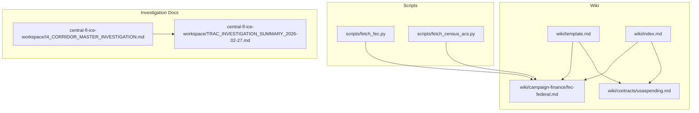
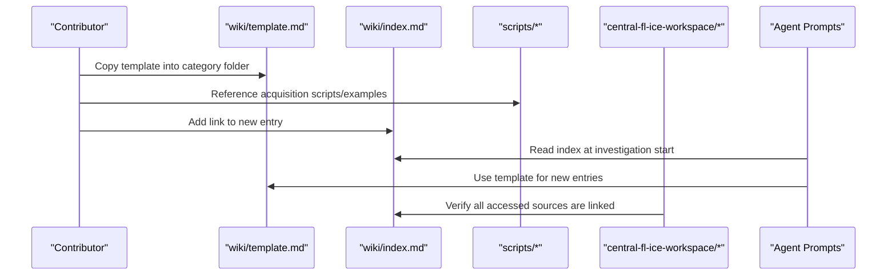
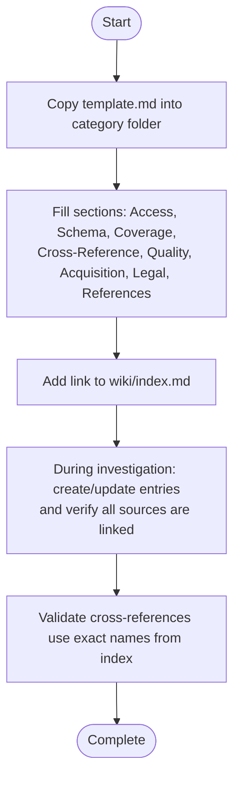
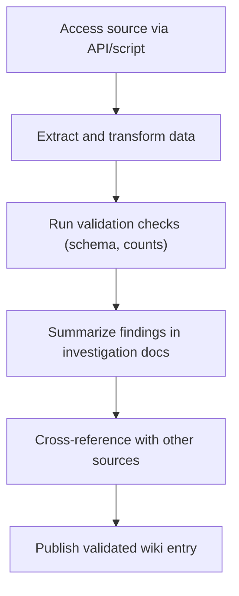
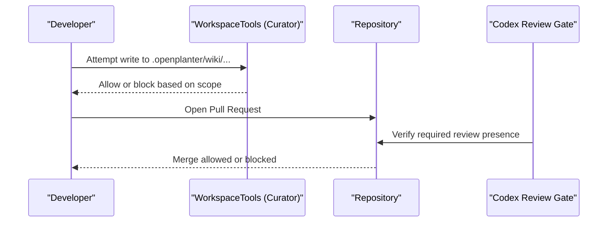
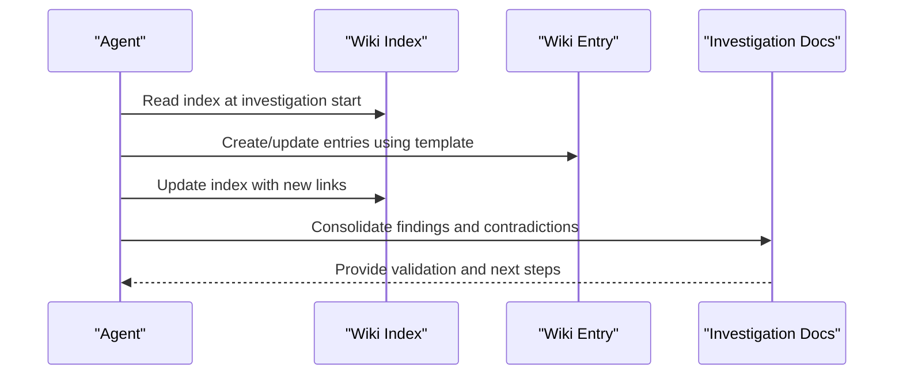
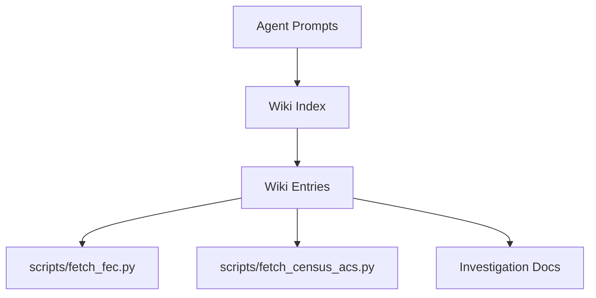

# Contributing Guidelines

<cite>
**Referenced Files in This Document**
- [wiki/template.md](file://wiki/template.md)
- [wiki/index.md](file://wiki/index.md)
- [agent/prompts.py](file://agent/prompts.py)
- [openplanter-desktop/crates/op-core/src/prompts.rs](file://openplanter-desktop/crates/op-core/src/prompts.rs)
- [openplanter-desktop/crates/op-core/src/tools/mod.rs](file://openplanter-desktop/crates/op-core/src/tools/mod.rs)
- [agent/tools.py](file://agent/tools.py)
- [.github/workflows/codex-review-gate.yml](file://.github/workflows/codex-review-gate.yml)
- [scripts/fetch_fec.py](file://scripts/fetch_fec.py)
- [scripts/fetch_census_acs.py](file://scripts/fetch_census_acs.py)
- [wiki/campaign-finance/fec-federal.md](file://wiki/campaign-finance/fec-federal.md)
- [wiki/contracts/usaspending.md](file://wiki/contracts/usaspending.md)
- [central-fl-ice-workspace/I4_CORRIDOR_MASTER_INVESTIGATION.md](file://central-fl-ice-workspace/I4_CORRIDOR_MASTER_INVESTIGATION.md)
- [central-fl-ice-workspace/TRAC_INVESTIGATION_SUMMARY_2026-02-27.md](file://central-fl-ice-workspace/TRAC_INVESTIGATION_SUMMARY_2026-02-27.md)
- [README.md](file://README.md)
</cite>

## Table of Contents
1. [Introduction](#introduction)
2. [Project Structure](#project-structure)
3. [Core Components](#core-components)
4. [Architecture Overview](#architecture-overview)
5. [Detailed Component Analysis](#detailed-component-analysis)
6. [Dependency Analysis](#dependency-analysis)
7. [Performance Considerations](#performance-considerations)
8. [Troubleshooting Guide](#troubleshooting-guide)
9. [Conclusion](#conclusion)
10. [Appendices](#appendices)

## Introduction
This document defines the contribution workflow for adding new data sources to the OpenPlanter wiki. It explains how to copy and complete the standardized template, integrate the entry into the wiki index, and align documentation with investigation workflows. It also covers quality review processes, validation procedures, version control considerations, collaborative editing, moderation gates, and long-term maintenance responsibilities.

## Project Structure
The OpenPlanter wiki is organized by category folders and a shared template. Contributors add new sources by copying the template into the appropriate category and linking the entry from the index. Scripts in the repository demonstrate best practices for acquiring and transforming data, which can be referenced from wiki entries.

**Diagram sources**
- [wiki/template.md:1-41](file://wiki/template.md#L1-L41)
- [wiki/index.md:1-75](file://wiki/index.md#L1-L75)
- [wiki/campaign-finance/fec-federal.md:1-203](file://wiki/campaign-finance/fec-federal.md#L1-L203)
- [wiki/contracts/usaspending.md:1-161](file://wiki/contracts/usaspending.md#L1-L161)
- [scripts/fetch_fec.py:1-417](file://scripts/fetch_fec.py#L1-L417)
- [scripts/fetch_census_acs.py:1-290](file://scripts/fetch_census_acs.py#L1-L290)
- [central-fl-ice-workspace/I4_CORRIDOR_MASTER_INVESTIGATION.md:1-162](file://central-fl-ice-workspace/I4_CORRIDOR_MASTER_INVESTIGATION.md#L1-L162)
- [central-fl-ice-workspace/TRAC_INVESTIGATION_SUMMARY_2026-02-27.md:1-200](file://central-fl-ice-workspace/TRAC_INVESTIGATION_SUMMARY_2026-02-27.md#L1-L200)

**Section sources**
- [wiki/template.md:1-41](file://wiki/template.md#L1-L41)
- [wiki/index.md:1-75](file://wiki/index.md#L1-L75)
- [scripts/fetch_fec.py:1-417](file://scripts/fetch_fec.py#L1-L417)
- [scripts/fetch_census_acs.py:1-290](file://scripts/fetch_census_acs.py#L1-L290)
- [central-fl-ice-workspace/I4_CORRIDOR_MASTER_INVESTIGATION.md:1-162](file://central-fl-ice-workspace/I4_CORRIDOR_MASTER_INVESTIGATION.md#L1-L162)
- [central-fl-ice-workspace/TRAC_INVESTIGATION_SUMMARY_2026-02-27.md:1-200](file://central-fl-ice-workspace/TRAC_INVESTIGATION_SUMMARY_2026-02-27.md#L1-L200)

## Core Components
- Standardized template: Provides a consistent structure for documenting access methods, schema, coverage, cross-reference potential, data quality, acquisition scripts, legal/licensing, and references.
- Wiki index: Maintains categorized tables of contents and links to all entries; contributors must link newly created entries here.
- Investigation workflow integration: Agents and contributors are instructed to read the index before investigations, create entries for every accessed source, update the index, and ensure cross-references use exact names from the index.
- Curator write scope: The runtime wiki is restricted to a curated scope, ensuring only approved wiki writes occur in the designated location.
- Validation and quality gates: Investigation summaries and cross-reference reports demonstrate validation outcomes and quality checks; moderation gates enforce required reviews before merging.

**Section sources**
- [wiki/template.md:1-41](file://wiki/template.md#L1-L41)
- [wiki/index.md:72-75](file://wiki/index.md#L72-L75)
- [agent/prompts.py:457-488](file://agent/prompts.py#L457-L488)
- [openplanter-desktop/crates/op-core/src/prompts.rs:313-330](file://openplanter-desktop/crates/op-core/src/prompts.rs#L313-L330)
- [openplanter-desktop/crates/op-core/src/tools/mod.rs:217-241](file://openplanter-desktop/crates/op-core/src/tools/mod.rs#L217-L241)

## Architecture Overview
The contribution workflow connects the template, index, scripts, and investigation documents into a cohesive pipeline. Agents and contributors use the index to orient themselves, create/update wiki entries using the template, and validate findings against investigation artifacts.

**Diagram sources**
- [wiki/template.md:1-41](file://wiki/template.md#L1-L41)
- [wiki/index.md:1-75](file://wiki/index.md#L1-L75)
- [scripts/fetch_fec.py:1-417](file://scripts/fetch_fec.py#L1-L417)
- [scripts/fetch_census_acs.py:1-290](file://scripts/fetch_census_acs.py#L1-L290)
- [central-fl-ice-workspace/I4_CORRIDOR_MASTER_INVESTIGATION.md:1-162](file://central-fl-ice-workspace/I4_CORRIDOR_MASTER_INVESTIGATION.md#L1-L162)
- [agent/prompts.py:457-488](file://agent/prompts.py#L457-L488)

## Detailed Component Analysis

### Contribution Workflow: From Template to Integration
- Copy the template into the appropriate category folder and fill each section.
- Link the new entry from the index under the correct category table.
- During investigations, ensure every accessed source has a corresponding wiki entry linked from the index.
- Use exact names from the index when referencing cross-references to maintain graph integrity.

**Diagram sources**
- [wiki/template.md:1-41](file://wiki/template.md#L1-L41)
- [wiki/index.md:72-75](file://wiki/index.md#L72-L75)
- [agent/prompts.py:473-487](file://agent/prompts.py#L473-L487)

**Section sources**
- [wiki/template.md:1-41](file://wiki/template.md#L1-L41)
- [wiki/index.md:72-75](file://wiki/index.md#L72-L75)
- [agent/prompts.py:457-488](file://agent/prompts.py#L457-L488)

### Quality Review and Validation Procedures
- Investigation summaries and cross-reference reports serve as validation artifacts demonstrating discrepancies, resolutions, and quality assessments.
- Use scripts to acquire and transform data; reference them in the Acquisition Script section of the wiki entry.
- Apply acceptance criteria similar to those demonstrated in the agent’s examples to validate outputs and methodologies.

**Diagram sources**
- [scripts/fetch_fec.py:1-417](file://scripts/fetch_fec.py#L1-L417)
- [scripts/fetch_census_acs.py:1-290](file://scripts/fetch_census_acs.py#L1-L290)
- [central-fl-ice-workspace/TRAC_INVESTIGATION_SUMMARY_2026-02-27.md:1-200](file://central-fl-ice-workspace/TRAC_INVESTIGATION_SUMMARY_2026-02-27.md#L1-L200)

**Section sources**
- [central-fl-ice-workspace/TRAC_INVESTIGATION_SUMMARY_2026-02-27.md:108-169](file://central-fl-ice-workspace/TRAC_INVESTIGATION_SUMMARY_2026-02-27.md#L108-L169)
- [scripts/fetch_fec.py:1-417](file://scripts/fetch_fec.py#L1-L417)
- [scripts/fetch_census_acs.py:1-290](file://scripts/fetch_census_acs.py#L1-L290)

### Documentation Standards and Examples
- Use the standardized template to ensure consistent structure across entries.
- Reference authoritative sources and include official URLs, endpoints, and data dictionaries.
- Demonstrate practical acquisition scripts and include usage examples.

Examples:
- Federal Election Commission (FEC) entry demonstrates comprehensive access methods, schema, coverage, cross-reference potential, data quality, acquisition script, legal/licensing, and references.
- USASpending.gov entry shows API endpoints, schema, coverage, cross-reference potential, data quality, acquisition script, legal/licensing, and references.

**Section sources**
- [wiki/campaign-finance/fec-federal.md:1-203](file://wiki/campaign-finance/fec-federal.md#L1-L203)
- [wiki/contracts/usaspending.md:1-161](file://wiki/contracts/usaspending.md#L1-L161)
- [wiki/template.md:1-41](file://wiki/template.md#L1-L41)

### Version Control, Collaborative Editing, and Moderation
- Curator write scope restricts wiki writes to the designated wiki path and enforces safe write policies.
- Collaborative editing is supported through shared workspaces and annotations; audit trails track changes.
- A moderation gate enforces required Codex reviews before allowing merges.

**Diagram sources**
- [openplanter-desktop/crates/op-core/src/tools/mod.rs:217-241](file://openplanter-desktop/crates/op-core/src/tools/mod.rs#L217-L241)
- [.github/workflows/codex-review-gate.yml:1-163](file://.github/workflows/codex-review-gate.yml#L1-L163)

**Section sources**
- [openplanter-desktop/crates/op-core/src/tools/mod.rs:217-241](file://openplanter-desktop/crates/op-core/src/tools/mod.rs#L217-L241)
- [agent/tools.py:2416-2434](file://agent/tools.py#L2416-L2434)
- [.github/workflows/codex-review-gate.yml:1-163](file://.github/workflows/codex-review-gate.yml#L1-L163)
- [README.md:248-259](file://README.md#L248-L259)

### Relationship Between Wiki Documentation and Investigation Workflows
- Agents must read the wiki index at the start of investigations and maintain the wiki as a living knowledge map.
- Every investigation requires updating the index to link new entries and verifying that every accessed source has a corresponding entry.
- Investigation documents consolidate findings, contradictions, and next steps, complementing wiki entries with synthesized insights.

**Diagram sources**
- [agent/prompts.py:457-488](file://agent/prompts.py#L457-L488)
- [openplanter-desktop/crates/op-core/src/prompts.rs:313-330](file://openplanter-desktop/crates/op-core/src/prompts.rs#L313-L330)
- [central-fl-ice-workspace/I4_CORRIDOR_MASTER_INVESTIGATION.md:1-162](file://central-fl-ice-workspace/I4_CORRIDOR_MASTER_INVESTIGATION.md#L1-L162)

**Section sources**
- [agent/prompts.py:457-488](file://agent/prompts.py#L457-L488)
- [openplanter-desktop/crates/op-core/src/prompts.rs:313-330](file://openplanter-desktop/crates/op-core/src/prompts.rs#L313-L330)
- [central-fl-ice-workspace/I4_CORRIDOR_MASTER_INVESTIGATION.md:1-162](file://central-fl-ice-workspace/I4_CORRIDOR_MASTER_INVESTIGATION.md#L1-L162)

## Dependency Analysis
The wiki depends on scripts for acquisition and on investigation documents for validation. The agent’s prompts define mandatory indexing requirements that tie wiki entries to investigation workflows.

**Diagram sources**
- [agent/prompts.py:457-488](file://agent/prompts.py#L457-L488)
- [wiki/index.md:1-75](file://wiki/index.md#L1-L75)
- [wiki/template.md:1-41](file://wiki/template.md#L1-L41)
- [scripts/fetch_fec.py:1-417](file://scripts/fetch_fec.py#L1-L417)
- [scripts/fetch_census_acs.py:1-290](file://scripts/fetch_census_acs.py#L1-L290)
- [central-fl-ice-workspace/TRAC_INVESTIGATION_SUMMARY_2026-02-27.md:1-200](file://central-fl-ice-workspace/TRAC_INVESTIGATION_SUMMARY_2026-02-27.md#L1-L200)

**Section sources**
- [agent/prompts.py:457-488](file://agent/prompts.py#L457-L488)
- [wiki/index.md:1-75](file://wiki/index.md#L1-L75)
- [scripts/fetch_fec.py:1-417](file://scripts/fetch_fec.py#L1-L417)
- [scripts/fetch_census_acs.py:1-290](file://scripts/fetch_census_acs.py#L1-L290)
- [central-fl-ice-workspace/TRAC_INVESTIGATION_SUMMARY_2026-02-27.md:1-200](file://central-fl-ice-workspace/TRAC_INVESTIGATION_SUMMARY_2026-02-27.md#L1-L200)

## Performance Considerations
- Prefer API-first acquisition where possible; use bulk downloads for large datasets.
- Paginate API responses and implement retry/backoff strategies for reliability.
- Validate schemas and record counts early to fail fast and reduce downstream processing overhead.

## Troubleshooting Guide
Common pitfalls and remedies:
- Using imprecise names in cross-references: Always reference other sources using their exact names as listed in the index to maintain graph integrity.
- Missing links from the index: Ensure every accessed source has a corresponding wiki entry linked from the index.
- Unsafe write attempts: Curator scope restricts writes outside the wiki path; confirm paths and use allowed scopes.
- Unvalidated acquisitions: Run validation checks on outputs and include acceptance criteria in verification steps.

**Section sources**
- [agent/prompts.py:473-487](file://agent/prompts.py#L473-L487)
- [openplanter-desktop/crates/op-core/src/tools/mod.rs:217-241](file://openplanter-desktop/crates/op-core/src/tools/mod.rs#L217-L241)
- [agent/tools.py:2416-2434](file://agent/tools.py#L2416-L2434)

## Conclusion
Adding a new data source to the OpenPlanter wiki is a straightforward process: copy the template, fill the sections, link from the index, and integrate with investigation workflows. Enforce quality through validation, rely on moderation gates, and maintain long-term quality by keeping acquisition scripts and legal/licensing information current.

## Appendices

### Practical Examples
- FEC Federal Campaign Finance entry demonstrates comprehensive documentation and acquisition script reference.
- USASpending.gov entry shows API endpoints, schema, coverage, cross-reference potential, data quality, acquisition script, legal/licensing, and references.

**Section sources**
- [wiki/campaign-finance/fec-federal.md:1-203](file://wiki/campaign-finance/fec-federal.md#L1-L203)
- [wiki/contracts/usaspending.md:1-161](file://wiki/contracts/usaspending.md#L1-L161)