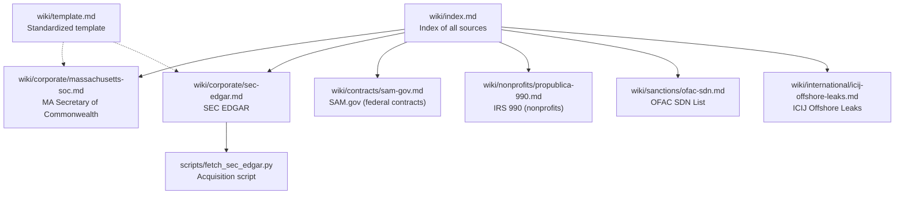
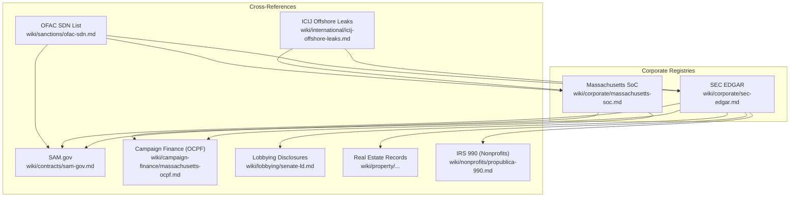
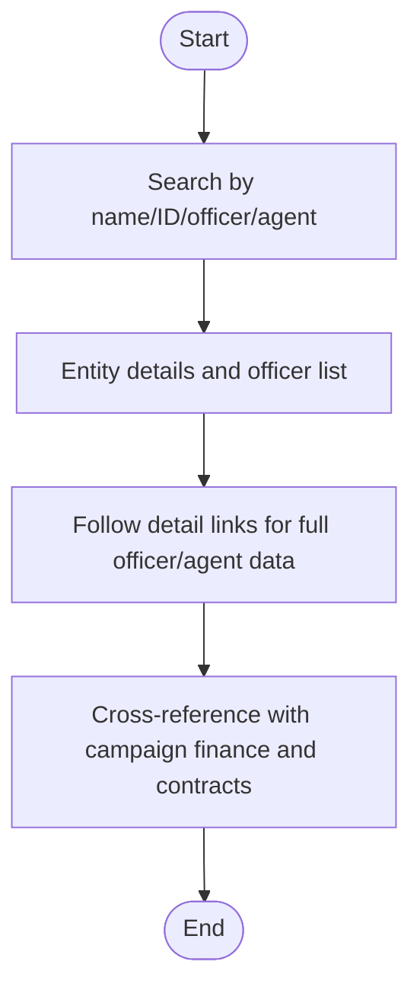
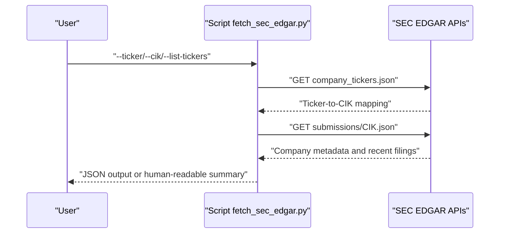
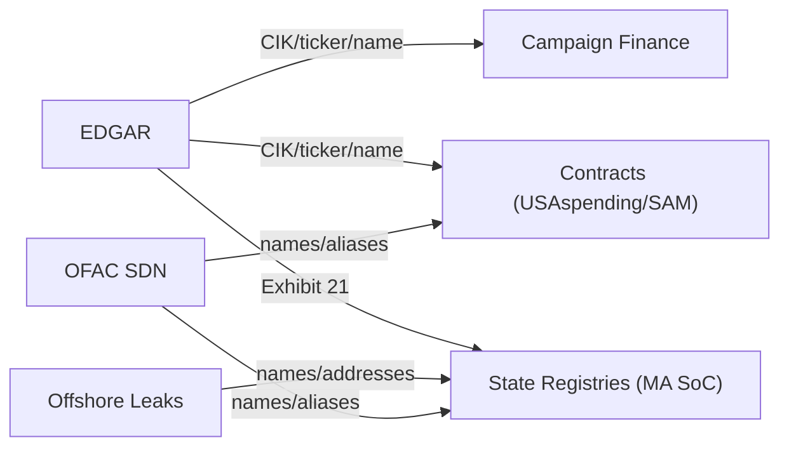
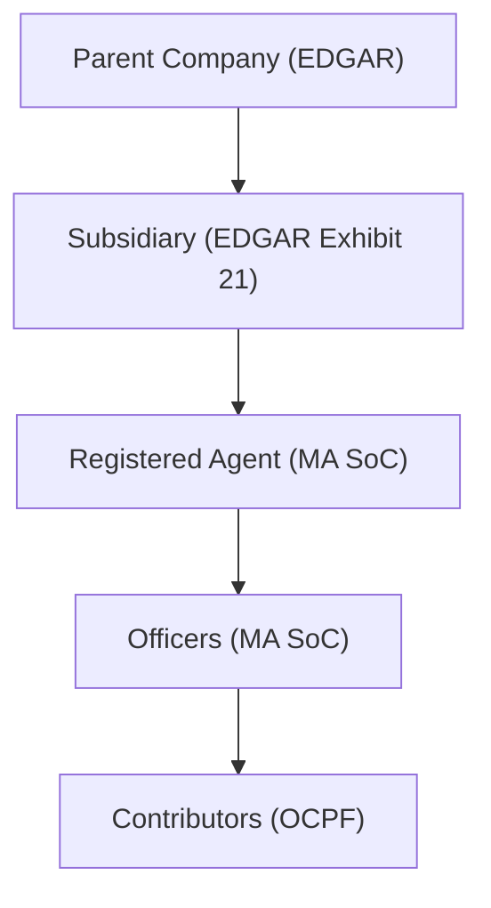
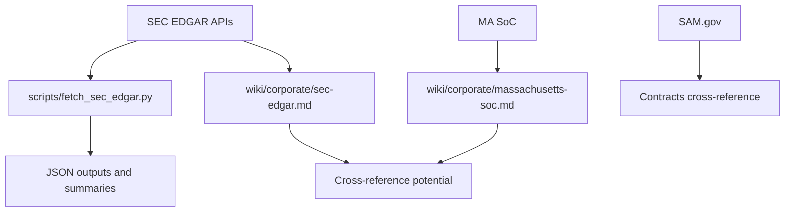
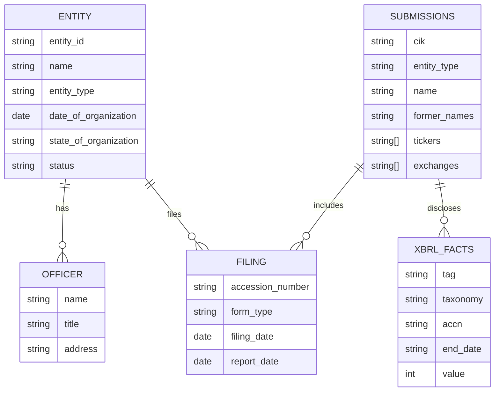

# Corporate Registries Sources

<cite>
**Referenced Files in This Document**
- [wiki/corporate/massachusetts-soc.md](file://wiki/corporate/massachusetts-soc.md)
- [wiki/corporate/sec-edgar.md](file://wiki/corporate/sec-edgar.md)
- [scripts/fetch_sec_edgar.py](file://scripts/fetch_sec_edgar.py)
- [wiki/index.md](file://wiki/index.md)
- [wiki/template.md](file://wiki/template.md)
- [wiki/contracts/sam-gov.md](file://wiki/contracts/sam-gov.md)
- [wiki/nonprofits/propublica-990.md](file://wiki/nonprofits/propublica-990.md)
- [wiki/sanctions/ofac-sdn.md](file://wiki/sanctions/ofac-sdn.md)
- [wiki/international/icij-offshore-leaks.md](file://wiki/international/icij-offshore-leaks.md)
- [jon-maples-oppo/3242_columbia_llc_ownership_research.md](file://jon-maples-oppo/3242_columbia_llc_ownership_research.md)
- [openplanter-desktop/frontend/e2e/fixtures/graph-data.ts](file://openplanter-desktop/frontend/e2e/fixtures/graph-data.ts)
- [DEMO.md](file://DEMO.md)
</cite>

## Table of Contents
1. [Introduction](#introduction)
2. [Project Structure](#project-structure)
3. [Core Components](#core-components)
4. [Architecture Overview](#architecture-overview)
5. [Detailed Component Analysis](#detailed-component-analysis)
6. [Dependency Analysis](#dependency-analysis)
7. [Performance Considerations](#performance-considerations)
8. [Troubleshooting Guide](#troubleshooting-guide)
9. [Conclusion](#conclusion)
10. [Appendices](#appendices)

## Introduction
This document explains the structure and content of corporate filing wiki entries and how to use them for corporate registry data sources. It focuses on Massachusetts Secretary of Commonwealth (MA SoC) and SEC EDGAR, and shows how to integrate them with other datasets (federal contracts, campaign finance, offshore leaks, and sanctions) to analyze corporate entities, ownership disclosure patterns, beneficial ownership, parent-subsidiary relationships, and cross-border structures. It also provides practical guidance for identifying shell companies, detecting front companies, and analyzing corporate governance patterns.

## Project Structure
The repository organizes data source documentation in a standardized wiki format. Corporate registry documentation resides under the corporate category and links to acquisition scripts and cross-source references.

**Diagram sources**
- [wiki/index.md:1-75](file://wiki/index.md#L1-L75)
- [wiki/corporate/massachusetts-soc.md:1-74](file://wiki/corporate/massachusetts-soc.md#L1-L74)
- [wiki/corporate/sec-edgar.md:1-160](file://wiki/corporate/sec-edgar.md#L1-L160)
- [scripts/fetch_sec_edgar.py:1-317](file://scripts/fetch_sec_edgar.py#L1-L317)
- [wiki/contracts/sam-gov.md:1-153](file://wiki/contracts/sam-gov.md#L1-L153)
- [wiki/nonprofits/propublica-990.md:1-144](file://wiki/nonprofits/propublica-990.md#L1-L144)
- [wiki/sanctions/ofac-sdn.md:1-140](file://wiki/sanctions/ofac-sdn.md#L1-L140)
- [wiki/international/icij-offshore-leaks.md:1-140](file://wiki/international/icij-offshore-leaks.md#L1-L140)
- [wiki/template.md:1-41](file://wiki/template.md#L1-L41)

**Section sources**
- [wiki/index.md:1-75](file://wiki/index.md#L1-L75)
- [wiki/template.md:1-41](file://wiki/template.md#L1-L41)

## Core Components
- Massachusetts Secretary of Commonwealth (SoC)
  - Contains domestic and foreign entities authorized to do business in Massachusetts, including officers, registered agents, and filing history.
  - Access methods: online search, FOIA/public records, and scraping (ASP.NET postbacks).
  - Data schema: per-entity fields include entity ID, name, type, organization date, state of organization, status, resident agent, officers, and filing history.
  - Coverage: Massachusetts jurisdiction; decades of historical records; real-time updates; hundreds of thousands of entities.
  - Cross-reference potential: campaign finance (OCPF), city contracts (Boston Open Checkbook), lobbying disclosures.
  - Data quality: web-only access; entity names may include DBAs and legal designators; officer data self-reported and may be outdated; scraping can be fragile.

- SEC EDGAR
  - Repository for public company filings (10-K/10-Q/8-K, proxy statements, insider trading, beneficial ownership, registration statements).
  - Access methods: JSON APIs (preferred), bulk nightly archives, RSS feeds, and web search.
  - Data schema: submissions API includes CIK, entity type, SIC, names, tickers/exchanges, and recent filings; XBRL company facts API provides standardized financial concepts.
  - Coverage: U.S. public companies and foreign private issuers with U.S. listings; 1994–present; real-time ingestion; millions of filings.
  - Cross-reference potential: campaign finance, government contracts, state business registries (subsidiaries in Exhibit 21), lobbying disclosures, real estate records.
  - Data quality: structured XBRL data for financials; unstructured pre-XBRL and non-financial disclosures require parsing; name normalization via CIK and former names; foreign filers use Forms 20-F/6-K; small filers have reduced requirements.

**Section sources**
- [wiki/corporate/massachusetts-soc.md:1-74](file://wiki/corporate/massachusetts-soc.md#L1-L74)
- [wiki/corporate/sec-edgar.md:1-160](file://wiki/corporate/sec-edgar.md#L1-L160)

## Architecture Overview
The corporate registry ecosystem integrates multiple data sources to build a comprehensive view of corporate entities, ownership, and relationships.

**Diagram sources**
- [wiki/corporate/massachusetts-soc.md:1-74](file://wiki/corporate/massachusetts-soc.md#L1-L74)
- [wiki/corporate/sec-edgar.md:1-160](file://wiki/corporate/sec-edgar.md#L1-L160)
- [wiki/contracts/sam-gov.md:1-153](file://wiki/contracts/sam-gov.md#L1-L153)
- [wiki/nonprofits/propublica-990.md:1-144](file://wiki/nonprofits/propublica-990.md#L1-L144)
- [wiki/sanctions/ofac-sdn.md:1-140](file://wiki/sanctions/ofac-sdn.md#L1-L140)
- [wiki/international/icij-offshore-leaks.md:1-140](file://wiki/international/icij-offshore-leaks.md#L1-L140)

## Detailed Component Analysis

### Massachusetts Secretary of Commonwealth (SoC)
- Purpose: Resolve corporate entities to individuals behind them via officers, registered agents, and filing history.
- Access methods: Online search, FOIA/public records, scraping (ASP.NET ViewState).
- Schema highlights: entity ID, name/type, organization date/state, status, resident agent, officers, filing history.
- Practical use:
  - Identify registered agents and officers as potential beneficial owners.
  - Cross-reference entity names and addresses with campaign finance and city contracts.
  - Use FOIA for bulk extracts when available.
- Data quality considerations: Names may include DBAs and legal designators; officer data self-reported and may lag; scraping requires session and rate management.

**Diagram sources**
- [wiki/corporate/massachusetts-soc.md:7-16](file://wiki/corporate/massachusetts-soc.md#L7-L16)
- [wiki/corporate/massachusetts-soc.md:17-31](file://wiki/corporate/massachusetts-soc.md#L17-L31)

**Section sources**
- [wiki/corporate/massachusetts-soc.md:1-74](file://wiki/corporate/massachusetts-soc.md#L1-L74)

### SEC EDGAR
- Purpose: Investigate ownership structures, executive compensation, related-party transactions, and financial relationships.
- Access methods: JSON APIs (Submissions, XBRL Company Facts), bulk nightly archives, RSS feeds, web search.
- Schema highlights: Submissions API includes CIK, entity type, SIC, names, tickers/exchanges, recent filings; XBRL provides standardized financial concepts.
- Practical use:
  - Use CIK/ticker lookups to retrieve filing histories.
  - Extract XBRL financials for trend analysis.
  - Identify subsidiaries via Exhibit 21 in 10-K filings.
  - Detect beneficial ownership via 13D/13G and insider transactions via Forms 3/4/5.
- Data quality considerations: XBRL data standardized since 2009; pre-XBRL filings and non-financial disclosures require parsing; name normalization via CIK and former names; foreign filers use Forms 20-F/6-K.

**Diagram sources**
- [scripts/fetch_sec_edgar.py:1-317](file://scripts/fetch_sec_edgar.py#L1-L317)
- [wiki/corporate/sec-edgar.md:7-49](file://wiki/corporate/sec-edgar.md#L7-L49)

**Section sources**
- [wiki/corporate/sec-edgar.md:1-160](file://wiki/corporate/sec-edgar.md#L1-L160)
- [scripts/fetch_sec_edgar.py:1-317](file://scripts/fetch_sec_edgar.py#L1-L317)

### Cross-Source Integration Patterns
- EDGAR + SAM.gov: Match publicly traded contractors to federal contracts; screen for exclusions.
- EDGAR + Campaign Finance: Link PAC contributions and individual donor employers to parent companies; connect board/executives to personal donations.
- EDGAR + MA SoC: Resolve subsidiaries and registered agents; EDGAR lists subsidiaries in Exhibit 21 of 10-K.
- Offshore Leaks + Corporate Registries: Resolve ultimate beneficial ownership by linking registered agent addresses to known offshore intermediaries; trace shell company networks.
- SDN + Corporate Registries: Cross-reference SDN entity names and aliases against corporate officers, registered agents, and beneficial owners; identify front companies.

**Diagram sources**
- [wiki/corporate/sec-edgar.md:104-112](file://wiki/corporate/sec-edgar.md#L104-L112)
- [wiki/contracts/sam-gov.md:109-118](file://wiki/contracts/sam-gov.md#L109-L118)
- [wiki/sanctions/ofac-sdn.md:97-109](file://wiki/sanctions/ofac-sdn.md#L97-L109)
- [wiki/international/icij-offshore-leaks.md:102-122](file://wiki/international/icij-offshore-leaks.md#L102-L122)

**Section sources**
- [wiki/corporate/sec-edgar.md:104-112](file://wiki/corporate/sec-edgar.md#L104-L112)
- [wiki/contracts/sam-gov.md:109-118](file://wiki/contracts/sam-gov.md#L109-L118)
- [wiki/sanctions/ofac-sdn.md:97-109](file://wiki/sanctions/ofac-sdn.md#L97-L109)
- [wiki/international/icij-offshore-leaks.md:102-122](file://wiki/international/icij-offshore-leaks.md#L102-L122)

### Practical Examples

#### Corporate Entity Analysis
- Use MA SoC to resolve entity ID, resident agent, and officers; then cross-reference with campaign finance (OCPF) to match contributors and addresses.
- Use EDGAR to confirm entity type, SIC, and tickers; normalize names via CIK and former names; retrieve XBRL financials for analysis.

**Section sources**
- [wiki/corporate/massachusetts-soc.md:17-31](file://wiki/corporate/massachusetts-soc.md#L17-L31)
- [wiki/corporate/sec-edgar.md:50-80](file://wiki/corporate/sec-edgar.md#L50-L80)

#### Chain of Custody Tracing
- Trace subsidiaries via EDGAR’s Exhibit 21 in 10-K filings; confirm with MA SoC for registered agents and officers.
- Build a graph of relationships among parent, subsidiaries, and intermediaries using shared addresses and names.

**Diagram sources**
- [wiki/corporate/sec-edgar.md:108-112](file://wiki/corporate/sec-edgar.md#L108-L112)
- [wiki/corporate/massachusetts-soc.md:29-31](file://wiki/corporate/massachusetts-soc.md#L29-L31)

**Section sources**
- [wiki/corporate/sec-edgar.md:108-112](file://wiki/corporate/sec-edgar.md#L108-L112)
- [wiki/corporate/massachusetts-soc.md:29-31](file://wiki/corporate/massachusetts-soc.md#L29-L31)

#### Parent-Subsidiary Relationship Mapping
- Extract subsidiaries from EDGAR filings; join with MA SoC entity records to map registered agents and officers; use SAM.gov to identify federal contracts and potential exclusions.

**Section sources**
- [wiki/corporate/sec-edgar.md:108-112](file://wiki/corporate/sec-edgar.md#L108-L112)
- [wiki/contracts/sam-gov.md:109-118](file://wiki/contracts/sam-gov.md#L109-L118)

#### Identifying Shell Companies and Front Companies
- Screen for reused addresses between shell companies and known politically exposed persons or sanctioned entities.
- Use OFAC SDN list to flag entities with SDN-linked names or aliases; cross-reference with MA SoC and EDGAR.
- Apply fuzzy matching for names and addresses; leverage offshore leaks to identify intermediaries and registered agents.

**Section sources**
- [wiki/sanctions/ofac-sdn.md:97-109](file://wiki/sanctions/ofac-sdn.md#L97-L109)
- [wiki/international/icij-offshore-leaks.md:102-122](file://wiki/international/icij-offshore-leaks.md#L102-L122)
- [DEMO.md:214-221](file://DEMO.md#L214-L221)

#### Analyzing Corporate Governance Patterns
- Use EDGAR proxy statements (DEF 14A) to analyze board composition, executive compensation, and shareholder proposals.
- Cross-reference with campaign finance to identify governance overlap between corporate boards and political donors.

**Section sources**
- [wiki/corporate/sec-edgar.md:85-92](file://wiki/corporate/sec-edgar.md#L85-L92)
- [wiki/corporate/sec-edgar.md:106-107](file://wiki/corporate/sec-edgar.md#L106-L107)

#### Beneficial Ownership Identification
- Use EDGAR 13D/13G filings for beneficial ownership disclosures; combine with insider transaction filings (Forms 3/4/5) to identify holdings by individuals.
- Use MA SoC officer data to identify individuals behind shell companies; cross-reference with offshore leaks for ultimate beneficial owners.

**Section sources**
- [wiki/corporate/sec-edgar.md:89-92](file://wiki/corporate/sec-edgar.md#L89-L92)
- [wiki/corporate/massachusetts-soc.md:29-31](file://wiki/corporate/massachusetts-soc.md#L29-L31)
- [wiki/international/icij-offshore-leaks.md:43-84](file://wiki/international/icij-offshore-leaks.md#L43-L84)

#### Real-World Ownership Research Example
- A $10,000 contribution from an LLC was traced to beneficial owners using state corporate records and property ownership data; this demonstrates the value of combining state registries with property and campaign finance data.

**Section sources**
- [jon-maples-oppo/3242_columbia_llc_ownership_research.md:281-324](file://jon-maples-oppo/3242_columbia_llc_ownership_research.md#L281-L324)

## Dependency Analysis
- Internal dependencies:
  - Acquisition scripts depend on official APIs and endpoints documented in the wiki.
  - Cross-source references rely on shared identifiers (CIK, ticker, UEI/CAGE, entity names, addresses).
- External dependencies:
  - SEC APIs require a User-Agent header and enforce rate limits.
  - SAM.gov requires API keys and enforces rate limits by user role.
  - MA SoC access is web-only; scraping requires handling ViewState and session state.

**Diagram sources**
- [scripts/fetch_sec_edgar.py:1-317](file://scripts/fetch_sec_edgar.py#L1-L317)
- [wiki/corporate/sec-edgar.md:1-160](file://wiki/corporate/sec-edgar.md#L1-L160)
- [wiki/corporate/massachusetts-soc.md:1-74](file://wiki/corporate/massachusetts-soc.md#L1-L74)
- [wiki/contracts/sam-gov.md:1-153](file://wiki/contracts/sam-gov.md#L1-L153)

**Section sources**
- [scripts/fetch_sec_edgar.py:23-27](file://scripts/fetch_sec_edgar.py#L23-L27)
- [wiki/contracts/sam-gov.md:30-42](file://wiki/contracts/sam-gov.md#L30-L42)

## Performance Considerations
- Rate limiting:
  - SEC: 10 requests per second; include a descriptive User-Agent; consider bulk archives for large-scale analysis.
  - SAM.gov: Non-federal users limited to 10/day; federal/system accounts higher limits.
- Data volume:
  - EDGAR: Millions of filings; use bulk archives and targeted API queries.
  - MA SoC: Hundreds of thousands of entities; prefer FOIA for bulk extracts when feasible.
- Parsing and normalization:
  - EDGAR XBRL: Standardized taxonomy simplifies financial analysis.
  - MA SoC: HTML parsing requires robust session and rate management.

[No sources needed since this section provides general guidance]

## Troubleshooting Guide
- SEC EDGAR
  - Symptom: 403 errors or rate-limited responses.
  - Action: Respect rate limits (sleep between requests), include User-Agent header, and consider bulk archives.
  - Reference: SEC rate limit and User-Agent requirements.

- MA SoC
  - Symptom: Scraping fails due to ViewState/session.
  - Action: Maintain session state, handle ViewState tokens, and respect rate limits.

- SAM.gov
  - Symptom: Authentication failures or low daily request quotas.
  - Action: Obtain API key from SAM.gov profile; check user role for higher limits.

**Section sources**
- [scripts/fetch_sec_edgar.py:58-66](file://scripts/fetch_sec_edgar.py#L58-L66)
- [wiki/corporate/sec-edgar.md:24-27](file://wiki/corporate/sec-edgar.md#L24-L27)
- [wiki/contracts/sam-gov.md:30-42](file://wiki/contracts/sam-gov.md#L30-L42)
- [wiki/corporate/massachusetts-soc.md:13-16](file://wiki/corporate/massachusetts-soc.md#L13-L16)

## Conclusion
By integrating Massachusetts SoC and SEC EDGAR with campaign finance, federal contracts, offshore leaks, and sanctions lists, investigators can build a comprehensive picture of corporate entities, ownership, and governance. The standardized wiki templates and acquisition scripts in this repository provide a reproducible framework for acquiring, normalizing, and cross-referencing corporate data to identify shell companies, detect front companies, and trace cross-border structures.

[No sources needed since this section summarizes without analyzing specific files]

## Appendices

### Appendix A: Data Model Overview

**Diagram sources**
- [wiki/corporate/massachusetts-soc.md:17-31](file://wiki/corporate/massachusetts-soc.md#L17-L31)
- [wiki/corporate/sec-edgar.md:50-80](file://wiki/corporate/sec-edgar.md#L50-L80)

### Appendix B: Graph Construction Example
- Nodes: entities, individuals, filings, contracts, addresses.
- Edges: “owns”, “works_at”, “filed”, “awarded_to”, “hired”, “registered_address”.
- Use shared identifiers (CIK, UEI, CAGE, entity names, addresses) to link across sources.

**Section sources**
- [openplanter-desktop/frontend/e2e/fixtures/graph-data.ts:27-41](file://openplanter-desktop/frontend/e2e/fixtures/graph-data.ts#L27-L41)