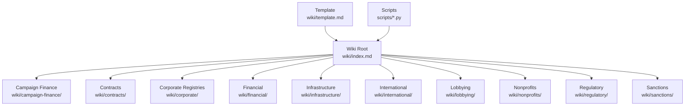
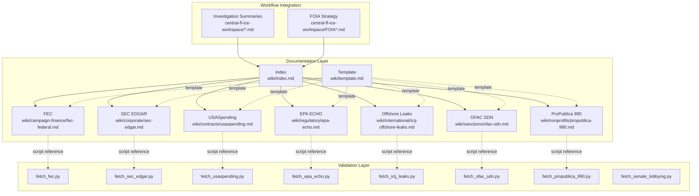
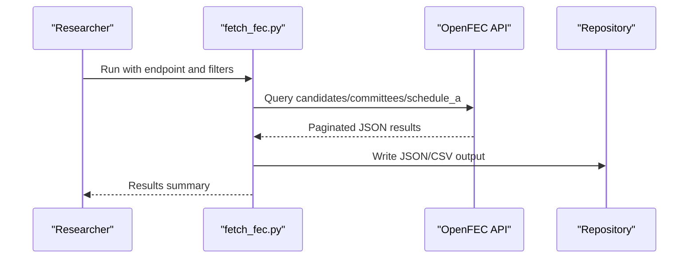
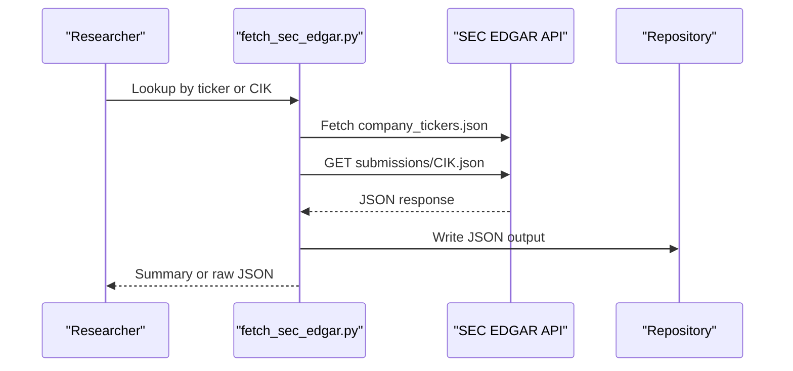
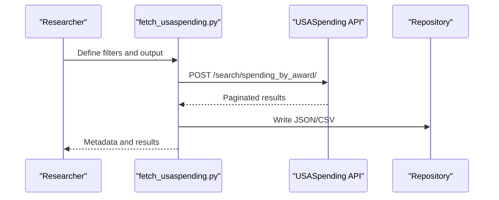
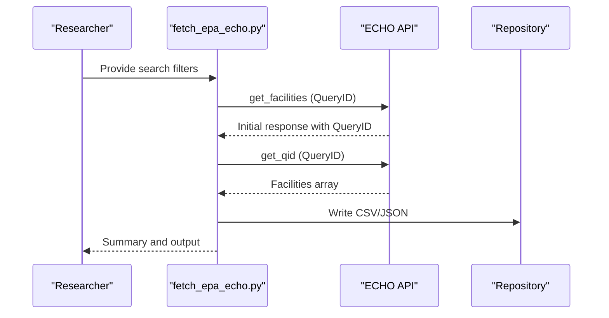
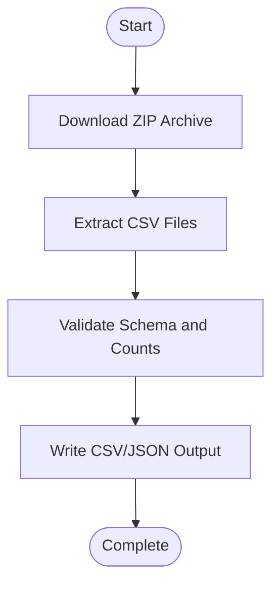
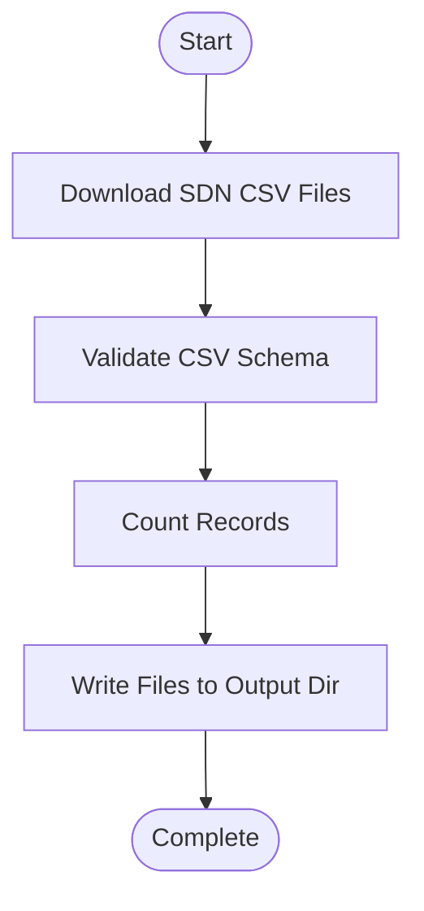
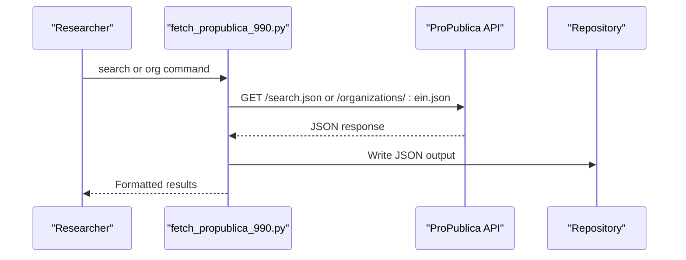
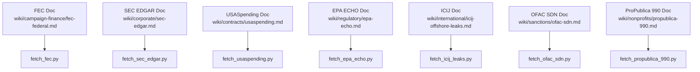

# Data Sources Documentation

<cite>
**Referenced Files in This Document**
- [wiki/index.md](file://wiki/index.md)
- [wiki/template.md](file://wiki/template.md)
- [wiki/campaign-finance/fec-federal.md](file://wiki/campaign-finance/fec-federal.md)
- [wiki/corporate/sec-edgar.md](file://wiki/corporate/sec-edgar.md)
- [wiki/contracts/usaspending.md](file://wiki/contracts/usaspending.md)
- [wiki/regulatory/epa-echo.md](file://wiki/regulatory/epa-echo.md)
- [wiki/international/icij-offshore-leaks.md](file://wiki/international/icij-offshore-leaks.md)
- [wiki/sanctions/ofac-sdn.md](file://wiki/sanctions/ofac-sdn.md)
- [wiki/nonprofits/propublica-990.md](file://wiki/nonprofits/propublica-990.md)
- [scripts/fetch_fec.py](file://scripts/fetch_fec.py)
- [scripts/fetch_sec_edgar.py](file://scripts/fetch_sec_edgar.py)
- [scripts/fetch_usaspending.py](file://scripts/fetch_usaspending.py)
- [scripts/fetch_epa_echo.py](file://scripts/fetch_epa_echo.py)
- [scripts/fetch_icij_leaks.py](file://scripts/fetch_icij_leaks.py)
- [scripts/fetch_ofac_sdn.py](file://scripts/fetch_ofac_sdn.py)
- [scripts/fetch_propublica_990.py](file://scripts/fetch_propublica_990.py)
- [scripts/fetch_senate_lobbying.py](file://scripts/fetch_senate_lobbying.py)
</cite>

## Table of Contents
1. [Introduction](#introduction)
2. [Project Structure](#project-structure)
3. [Core Components](#core-components)
4. [Architecture Overview](#architecture-overview)
5. [Detailed Component Analysis](#detailed-component-analysis)
6. [Dependency Analysis](#dependency-analysis)
7. [Performance Considerations](#performance-considerations)
8. [Troubleshooting Guide](#troubleshooting-guide)
9. [Conclusion](#conclusion)
10. [Appendices](#appendices)

## Introduction
This document describes the standardized wiki format for documenting external data sources in the OpenPlanter project. It explains the wiki structure, template usage, contribution guidelines, and maintenance procedures. It also outlines the categorized data source types used across investigations, including campaign finance, contracts, corporate registries, financial data, infrastructure, international offshore data, lobbying disclosures, nonprofits, regulatory databases, and sanctions lists. Practical guidance is provided for cross-referencing, source validation, and integrating data documentation with investigation workflows.

## Project Structure
The data sources documentation is maintained in the wiki directory with a centralized index and category-specific folders. Each source has a dedicated Markdown file following a standardized template. Acquisition scripts reside under the scripts directory and demonstrate how to programmatically access each source.

**Diagram sources**
- [wiki/index.md:1-75](file://wiki/index.md#L1-L75)
- [wiki/template.md:1-41](file://wiki/template.md#L1-L41)

**Section sources**
- [wiki/index.md:1-75](file://wiki/index.md#L1-L75)
- [wiki/template.md:1-41](file://wiki/template.md#L1-L41)

## Core Components
- Standardized Template: Every data source entry follows a consistent structure to ensure uniformity across the wiki. The template defines sections for summary, access methods, data schema, coverage, cross-reference potential, data quality, acquisition script, legal and licensing, and references.
- Category Index: The index organizes sources by type and provides quick navigation to each source’s documentation.
- Acquisition Scripts: Each source has a corresponding script demonstrating how to programmatically access the data, including authentication, rate limiting, and output formats.

Key template sections and their purpose:
- Summary: One-paragraph overview of the dataset, publisher, and investigative relevance.
- Access Methods: Details on bulk downloads, APIs, scraping, and FOIA, including URLs, authentication, and rate limits.
- Data Schema: Field tables and relationships for complex schemas.
- Coverage: Jurisdiction, time range, update frequency, and approximate volume.
- Cross-Reference Potential: Join keys and complementary sources for linkage.
- Data Quality: Known issues and limitations.
- Acquisition Script: Path to repo scripts and usage examples.
- Legal & Licensing: Public records citations and redistribution terms.
- References: Official documentation and prior analyses.

**Section sources**
- [wiki/template.md:1-41](file://wiki/template.md#L1-L41)
- [wiki/index.md:72-75](file://wiki/index.md#L72-L75)

## Architecture Overview
The data source documentation system integrates three layers:
- Documentation Layer: Markdown files organized by category with a shared template.
- Validation Layer: Scripts that fetch and validate data, ensuring documentation aligns with live sources.
- Workflow Integration: Investigation summaries and research plans that reference and link to data sources.

**Diagram sources**
- [wiki/index.md:1-75](file://wiki/index.md#L1-L75)
- [wiki/template.md:1-41](file://wiki/template.md#L1-L41)
- [scripts/fetch_fec.py:1-417](file://scripts/fetch_fec.py#L1-L417)
- [scripts/fetch_sec_edgar.py:1-317](file://scripts/fetch_sec_edgar.py#L1-L317)
- [scripts/fetch_usaspending.py:1-348](file://scripts/fetch_usaspending.py#L1-L348)
- [scripts/fetch_epa_echo.py:1-290](file://scripts/fetch_epa_echo.py#L1-L290)
- [scripts/fetch_icij_leaks.py:1-234](file://scripts/fetch_icij_leaks.py#L1-L234)
- [scripts/fetch_ofac_sdn.py:1-284](file://scripts/fetch_ofac_sdn.py#L1-L284)
- [scripts/fetch_propublica_990.py:1-327](file://scripts/fetch_propublica_990.py#L1-L327)
- [scripts/fetch_senate_lobbying.py:1-180](file://scripts/fetch_senate_lobbying.py#L1-L180)

## Detailed Component Analysis

### Campaign Finance: FEC Federal
- Purpose: Primary federal campaign finance database for candidates, committees, contributions, expenditures, and filings.
- Access Methods: RESTful API with authentication and rate limits; bulk downloads available.
- Schema: Candidate, committee, and Schedule A/B/E records with standardized fields.
- Coverage: Federal scope, extensive time range, near real-time API updates.
- Cross-Reference Potential: State systems (e.g., Massachusetts OCPF), corporate registries, contracts, lobbying disclosures, IRS 990, property records.
- Data Quality: Strong IDs and schemas; known issues include free-text formatting, amendment handling, and bulk file sizes.
- Acquisition Script: Demonstrates API pagination, filtering, and output formats.

**Diagram sources**
- [scripts/fetch_fec.py:244-417](file://scripts/fetch_fec.py#L244-L417)
- [wiki/campaign-finance/fec-federal.md:1-203](file://wiki/campaign-finance/fec-federal.md#L1-L203)

**Section sources**
- [wiki/campaign-finance/fec-federal.md:1-203](file://wiki/campaign-finance/fec-federal.md#L1-L203)
- [scripts/fetch_fec.py:1-417](file://scripts/fetch_fec.py#L1-L417)

### Corporate Registries: SEC EDGAR
- Purpose: Public company filings repository (10-K, 10-Q, 8-K, proxy statements, insider transactions).
- Access Methods: SEC JSON APIs (no auth), nightly archives, daily filings, RSS feeds, web interface.
- Schema: Submissions API and XBRL company facts; form types and taxonomy concepts.
- Coverage: 1994–present; high-volume daily filings.
- Cross-Reference Potential: Campaign finance, government contracts, state registries, lobbying, real estate.
- Data Quality: Structured XBRL data; unstructured pre-XBRL filings; name normalization and amended filings.
- Acquisition Script: Ticker lookup and submissions API with rate-limit awareness.

**Diagram sources**
- [scripts/fetch_sec_edgar.py:188-317](file://scripts/fetch_sec_edgar.py#L188-L317)
- [wiki/corporate/sec-edgar.md:1-160](file://wiki/corporate/sec-edgar.md#L1-L160)

**Section sources**
- [wiki/corporate/sec-edgar.md:1-160](file://wiki/corporate/sec-edgar.md#L1-L160)
- [scripts/fetch_sec_edgar.py:1-317](file://scripts/fetch_sec_edgar.py#L1-L317)

### Government Contracts: USASpending.gov
- Purpose: Federal spending transparency, contracts, grants, loans, and other awards.
- Access Methods: RESTful API (no auth), bulk downloads, web interface.
- Schema: Universal award fields, contract-specific, grant/loan fields; transaction-level data.
- Coverage: FY2001–present; varying timeliness by agency.
- Cross-Reference Potential: State/local campaign finance, state registries, lobbying, SEC EDGAR, state/local procurement, OpenSecrets/FEC.
- Data Quality: Known gaps in completeness and timeliness; recommendations for UEI/DUNS tracking.
- Acquisition Script: Search and download with filtering and output options.

**Diagram sources**
- [scripts/fetch_usaspending.py:216-348](file://scripts/fetch_usaspending.py#L216-L348)
- [wiki/contracts/usaspending.md:1-161](file://wiki/contracts/usaspending.md#L1-L161)

**Section sources**
- [wiki/contracts/usaspending.md:1-161](file://wiki/contracts/usaspending.md#L1-L161)
- [scripts/fetch_usaspending.py:1-348](file://scripts/fetch_usaspending.py#L1-L348)

### Regulatory Databases: EPA ECHO
- Purpose: Enforcement and compliance history for regulated facilities across environmental statutes.
- Access Methods: REST API (no auth), bulk downloads, web interface, enforcement case API.
- Schema: Facilities, enforcement cases, compliance history; 130+ fields.
- Coverage: ~1 million facilities; varying program time ranges.
- Cross-Reference Potential: Campaign finance, corporate registries, government contracts, lobbying, TRI, Superfund sites.
- Data Quality: Name variations, delayed data, multiple IDs, geocoding accuracy, duplicates.
- Acquisition Script: Two-step query pattern with QueryID pagination and CSV export.

**Diagram sources**
- [scripts/fetch_epa_echo.py:88-125](file://scripts/fetch_epa_echo.py#L88-L125)
- [wiki/regulatory/epa-echo.md:1-137](file://wiki/regulatory/epa-echo.md#L1-L137)

**Section sources**
- [wiki/regulatory/epa-echo.md:1-137](file://wiki/regulatory/epa-echo.md#L1-L137)
- [scripts/fetch_epa_echo.py:1-290](file://scripts/fetch_epa_echo.py#L1-L290)

### International Offshore Data: ICIJ Offshore Leaks
- Purpose: Global offshore entities, beneficial owners, intermediaries, and relationships.
- Access Methods: Bulk CSV download, Neo4j dumps, web interface, reconciliation API.
- Schema: Graph model with nodes and edges; CSV exports; relationship types.
- Coverage: 810K+ entities; 3.9M+ nodes; 29M+ source documents; global scope.
- Cross-Reference Potential: Campaign finance, government contracts, corporate registries, sanctions, land records, lobbying.
- Data Quality: UTF-8 CSV, provenance tracking; name inconsistencies, incomplete addresses, date formats, duplicates.
- Acquisition Script: Downloads and extracts bulk CSV archive.

**Diagram sources**
- [scripts/fetch_icij_leaks.py:134-234](file://scripts/fetch_icij_leaks.py#L134-L234)
- [wiki/international/icij-offshore-leaks.md:1-188](file://wiki/international/icij-offshore-leaks.md#L1-L188)

**Section sources**
- [wiki/international/icij-offshore-leaks.md:1-188](file://wiki/international/icij-offshore-leaks.md#L1-L188)
- [scripts/fetch_icij_leaks.py:1-234](file://scripts/fetch_icij_leaks.py#L1-L234)

### Sanctions Lists: OFAC SDN
- Purpose: U.S. Treasury’s Specially Designated Nationals list for sanctions compliance.
- Access Methods: Legacy CSV bulk downloads; alternative formats; web interface; delta file archives.
- Schema: Relational schema with ent_num primary key; sdn.csv, add.csv, alt.csv, sdn_comments.csv.
- Coverage: Global scope; 1995–present; variable update frequency.
- Cross-Reference Potential: Corporate registries, campaign finance, contracts, real estate, business licenses.
- Data Quality: No header rows; extensive aliases; address granularity varies; transliteration challenges.
- Acquisition Script: Downloads all four CSV files and validates schema and record counts.

**Diagram sources**
- [scripts/fetch_ofac_sdn.py:170-211](file://scripts/fetch_ofac_sdn.py#L170-L211)
- [wiki/sanctions/ofac-sdn.md:1-143](file://wiki/sanctions/ofac-sdn.md#L1-L143)

**Section sources**
- [wiki/sanctions/ofac-sdn.md:1-143](file://wiki/sanctions/ofac-sdn.md#L1-L143)
- [scripts/fetch_ofac_sdn.py:1-284](file://scripts/fetch_ofac_sdn.py#L1-L284)

### Nonprofits: ProPublica Nonprofit Explorer / IRS 990
- Purpose: Nonprofit tax filings (IRS Form 990) with organization profiles and financial data.
- Access Methods: ProPublica API (no auth), web interface; historic bulk data deprecated.
- Schema: Organization profile fields and filing objects; financial line items vary by form type.
- Coverage: 2001–present; daily updates; ~1.8M filings.
- Cross-Reference Potential: Campaign finance, lobbying, government contracts, corporate registries, foundation grants.
- Data Quality: Structured extraction; name/address variations; officer data free-text; NTEE codes inconsistent.
- Acquisition Script: Organization search and EIN lookup with JSON output.

**Diagram sources**
- [scripts/fetch_propublica_990.py:185-327](file://scripts/fetch_propublica_990.py#L185-L327)
- [wiki/nonprofits/propublica-990.md:1-144](file://wiki/nonprofits/propublica-990.md#L1-L144)

**Section sources**
- [wiki/nonprofits/propublica-990.md:1-144](file://wiki/nonprofits/propublica-990.md#L1-L144)
- [scripts/fetch_propublica_990.py:1-327](file://scripts/fetch_propublica_990.py#L1-L327)

### Conceptual Overview
The wiki documentation system supports reproducible research by:
- Providing standardized templates for consistent documentation.
- Linking each source to acquisition scripts that validate schema and coverage.
- Encouraging cross-references to enable multi-source investigations.
- Maintaining a centralized index for discoverability.

[No sources needed since this section doesn't analyze specific files]

## Dependency Analysis
The documentation relies on a tight coupling between source documentation and acquisition scripts. Each source’s wiki entry references its script, and the scripts depend on the upstream APIs or bulk downloads described in the documentation.

**Diagram sources**
- [wiki/campaign-finance/fec-federal.md:1-203](file://wiki/campaign-finance/fec-federal.md#L1-L203)
- [scripts/fetch_fec.py:1-417](file://scripts/fetch_fec.py#L1-L417)
- [wiki/corporate/sec-edgar.md:1-160](file://wiki/corporate/sec-edgar.md#L1-L160)
- [scripts/fetch_sec_edgar.py:1-317](file://scripts/fetch_sec_edgar.py#L1-L317)
- [wiki/contracts/usaspending.md:1-161](file://wiki/contracts/usaspending.md#L1-L161)
- [scripts/fetch_usaspending.py:1-348](file://scripts/fetch_usaspending.py#L1-L348)
- [wiki/regulatory/epa-echo.md:1-137](file://wiki/regulatory/epa-echo.md#L1-L137)
- [scripts/fetch_epa_echo.py:1-290](file://scripts/fetch_epa_echo.py#L1-L290)
- [wiki/international/icij-offshore-leaks.md:1-188](file://wiki/international/icij-offshore-leaks.md#L1-L188)
- [scripts/fetch_icij_leaks.py:1-234](file://scripts/fetch_icij_leaks.py#L1-L234)
- [wiki/sanctions/ofac-sdn.md:1-143](file://wiki/sanctions/ofac-sdn.md#L1-L143)
- [scripts/fetch_ofac_sdn.py:1-284](file://scripts/fetch_ofac_sdn.py#L1-L284)
- [wiki/nonprofits/propublica-990.md:1-144](file://wiki/nonprofits/propublica-990.md#L1-L144)
- [scripts/fetch_propublica_990.py:1-327](file://scripts/fetch_propublica_990.py#L1-L327)

**Section sources**
- [wiki/index.md:1-75](file://wiki/index.md#L1-L75)
- [wiki/template.md:1-41](file://wiki/template.md#L1-L41)

## Performance Considerations
- Rate limits: Respect provider rate limits (e.g., SEC 10 requests/second, FEC API keys, USASpending no documented limits).
- Authentication: Use required keys or headers (e.g., FEC API key, SEC User-Agent).
- Output formats: Prefer CSV/JSON for downstream processing; compress large downloads.
- Pagination: Implement robust pagination and error handling in scripts.
- Data volume: Account for large files (e.g., FEC bulk files >1GB) and plan storage accordingly.

[No sources needed since this section provides general guidance]

## Troubleshooting Guide
Common issues and resolutions:
- HTTP/URL errors: Verify endpoints, check for 404s or network timeouts; retry with delays.
- Schema mismatches: Validate CSV field counts and encodings; add headers programmatically when needed.
- Rate limiting: Implement backoff and adhere to provider limits; use bulk archives for large-scale analysis.
- Name variations and fuzzy matching: Apply fuzzy matching and phonetic algorithms for international names.
- Missing data: Confirm that all required CSV files are downloaded (e.g., OFAC sdn.csv, add.csv, alt.csv, sdn_comments.csv).

**Section sources**
- [scripts/fetch_fec.py:42-57](file://scripts/fetch_fec.py#L42-L57)
- [scripts/fetch_sec_edgar.py:54-70](file://scripts/fetch_sec_edgar.py#L54-L70)
- [scripts/fetch_usaspending.py:65-73](file://scripts/fetch_usaspending.py#L65-L73)
- [scripts/fetch_ofac_sdn.py:101-140](file://scripts/fetch_ofac_sdn.py#L101-L140)

## Conclusion
The OpenPlanter wiki provides a standardized, reproducible framework for documenting external data sources. By following the template, linking to acquisition scripts, and emphasizing cross-references and validation, contributors can produce high-quality documentation that directly supports investigation workflows. Regular maintenance, adherence to provider policies, and attention to data quality ensure reliable, actionable intelligence.

## Appendices

### Contribution Guidelines
- Copy the template into the appropriate category folder.
- Fill in each section thoroughly, referencing official documentation and prior analyses.
- Link the new source from the index when complete.
- Include acquisition script references and usage examples.

**Section sources**
- [wiki/index.md:72-75](file://wiki/index.md#L72-L75)
- [wiki/template.md:1-41](file://wiki/template.md#L1-L41)

### Maintenance and Updating Procedures
- Review source documentation for changes in access methods, schema, or coverage.
- Update acquisition scripts to reflect endpoint changes or improved error handling.
- Validate schema and record counts for bulk downloads.
- Refresh cross-reference strategies as new sources become available.

**Section sources**
- [scripts/fetch_icij_leaks.py:134-234](file://scripts/fetch_icij_leaks.py#L134-L234)
- [scripts/fetch_ofac_sdn.py:170-211](file://scripts/fetch_ofac_sdn.py#L170-L211)

### Quality Assurance for Data Source Documentation
- Verify accuracy of access methods, schema, and coverage.
- Confirm that acquisition scripts run successfully and produce expected outputs.
- Cross-check cross-reference potential with real-world join keys and entity resolution strategies.
- Document known data quality issues and provide recommendations for mitigations.

**Section sources**
- [wiki/campaign-finance/fec-federal.md:151-168](file://wiki/campaign-finance/fec-federal.md#L151-L168)
- [wiki/corporate/sec-edgar.md:114-122](file://wiki/corporate/sec-edgar.md#L114-L122)
- [wiki/contracts/usaspending.md:115-132](file://wiki/contracts/usaspending.md#L115-L132)
- [wiki/regulatory/epa-echo.md:102-112](file://wiki/regulatory/epa-echo.md#L102-L112)
- [wiki/international/icij-offshore-leaks.md:124-146](file://wiki/international/icij-offshore-leaks.md#L124-L146)
- [wiki/sanctions/ofac-sdn.md:111-121](file://wiki/sanctions/ofac-sdn.md#L111-L121)
- [wiki/nonprofits/propublica-990.md:106-115](file://wiki/nonprofits/propublica-990.md#L106-L115)

### Relationship Between Wiki Documentation and Investigation Workflows
- Investigation summaries and FOIA strategies reference specific data sources and their documentation.
- Acquisition scripts support reproducible data collection aligned with documented access methods.
- Cross-references enable multi-source linkage and corroboration across datasets.

**Section sources**
- [wiki/index.md:1-75](file://wiki/index.md#L1-L75)