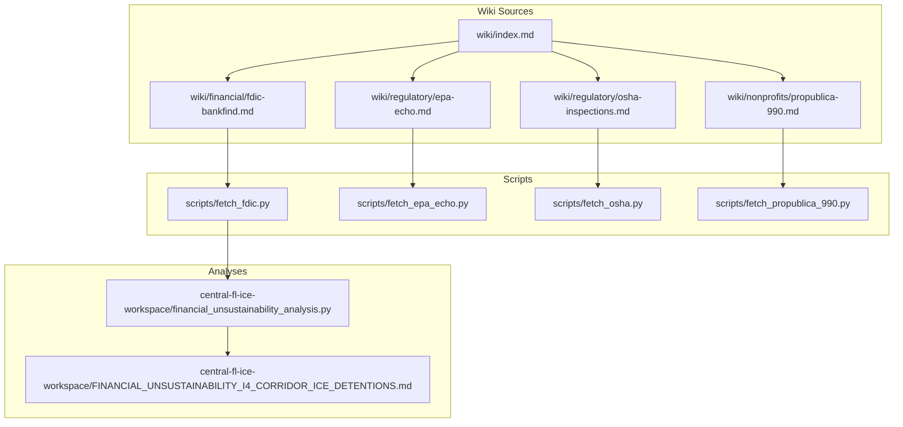
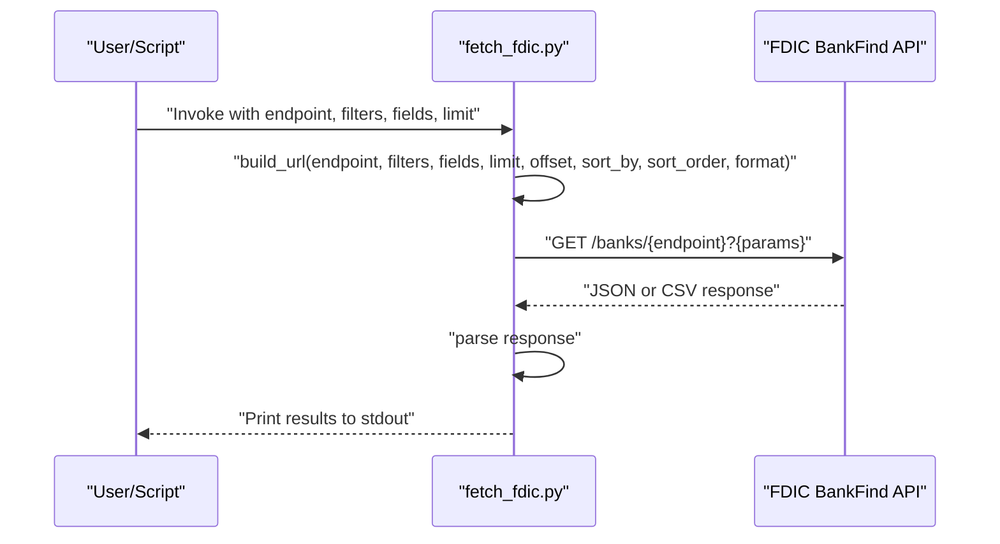
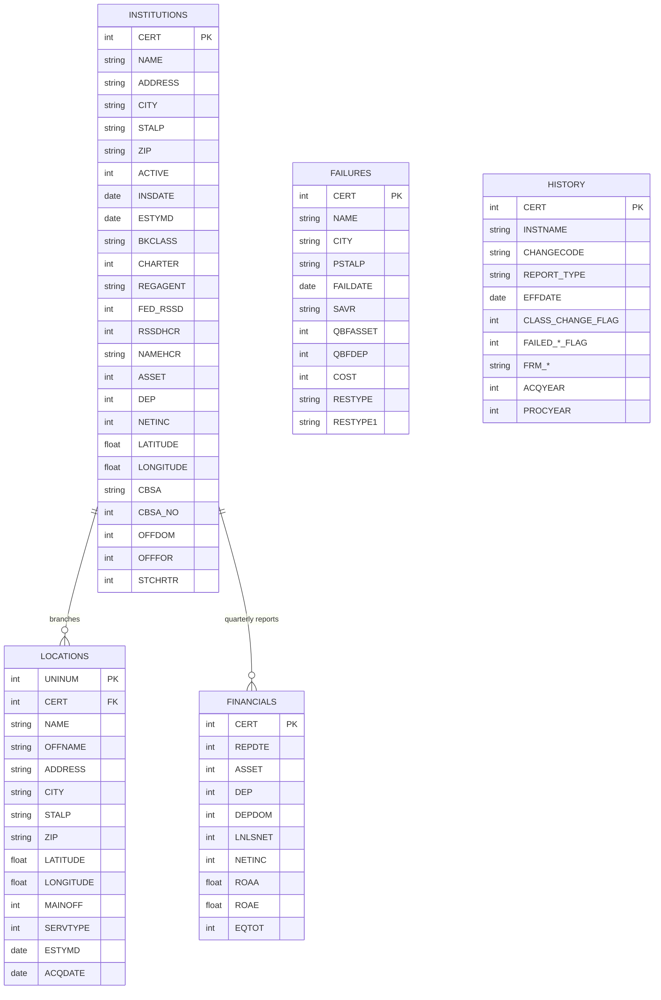
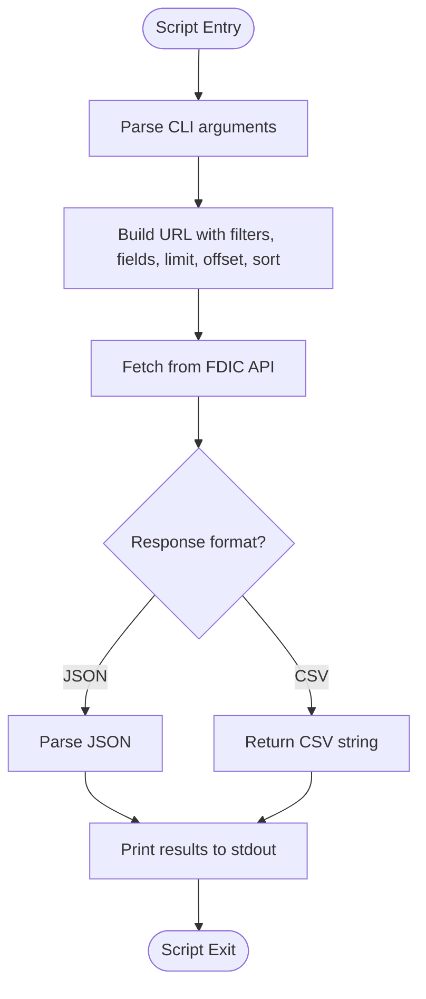
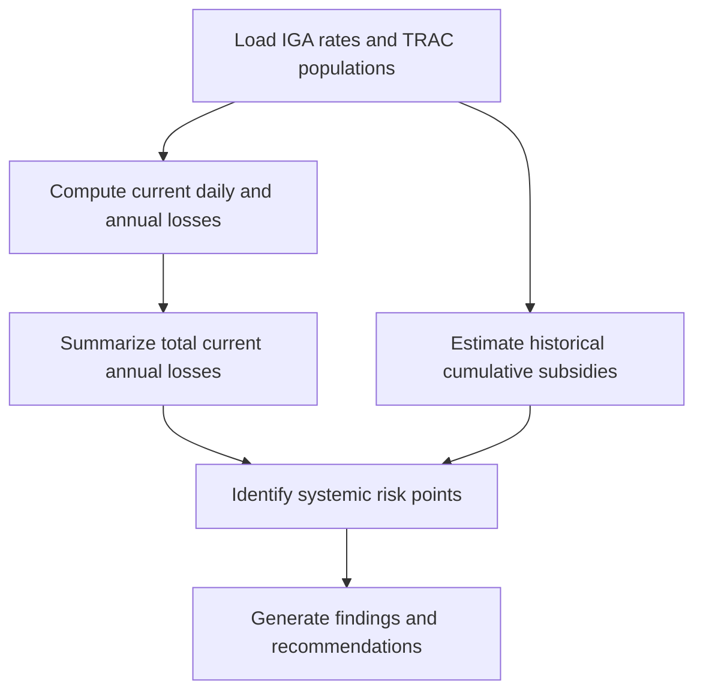
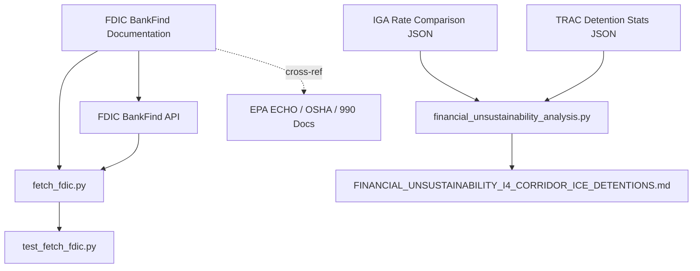

# Financial Registries Sources

<cite>
**Referenced Files in This Document**
- [fdic-bankfind.md](file://wiki/financial/fdic-bankfind.md)
- [fetch_fdic.py](file://scripts/fetch_fdic.py)
- [test_fetch_fdic.py](file://tests/test_fetch_fdic.py)
- [FINANCIAL_UNSUSTAINABILITY_I4_CORRIDOR_ICE_DETENTIONS.md](file://central-fl-ice-workspace/FINANCIAL_UNSUSTAINABILITY_I4_CORRIDOR_ICE_DETENTIONS.md)
- [financial_unsustainability_analysis.py](file://central-fl-ice-workspace/financial_unsustainability_analysis.py)
- [epa-echo.md](file://wiki/regulatory/epa-echo.md)
- [osha-inspections.md](file://wiki/regulatory/osha-inspections.md)
- [propublica-990.md](file://wiki/nonprofits/propublica-990.md)
- [index.md](file://wiki/index.md)
</cite>

## Table of Contents
1. [Introduction](#introduction)
2. [Project Structure](#project-structure)
3. [Core Components](#core-components)
4. [Architecture Overview](#architecture-overview)
5. [Detailed Component Analysis](#detailed-component-analysis)
6. [Dependency Analysis](#dependency-analysis)
7. [Performance Considerations](#performance-considerations)
8. [Troubleshooting Guide](#troubleshooting-guide)
9. [Conclusion](#conclusion)
10. [Appendices](#appendices)

## Introduction
This document provides comprehensive documentation for financial registries data sources, with a focus on banking and financial institution wiki entries, particularly the FDIC BankFind Suite. It explains the structure and content of banking data, regulatory classification systems, asset size thresholds, and geographic presence indicators. It also presents practical examples of financial institution analysis, risk assessment methodologies, and systemic risk identification, along with data limitations, regulatory reporting requirements, and financial stability indicators. Guidance is included for detecting financial irregularities, evaluating institutional health, and understanding banking sector dynamics.

## Project Structure
The repository organizes financial registry documentation under a standardized wiki structure. The FDIC BankFind documentation resides in the financial category and is complemented by acquisition scripts and tests. Additional financial and regulatory sources (EPA ECHO, OSHA, ProPublica 990) are documented in separate wiki pages and support cross-referencing and comparative analysis.

**Diagram sources**
- [index.md:1-75](file://wiki/index.md#L1-L75)
- [fdic-bankfind.md:1-205](file://wiki/financial/fdic-bankfind.md#L1-L205)
- [epa-echo.md:1-137](file://wiki/regulatory/epa-echo.md#L1-L137)
- [osha-inspections.md:1-212](file://wiki/regulatory/osha-inspections.md#L1-L212)
- [propublica-990.md:1-144](file://wiki/nonprofits/propublica-990.md#L1-L144)
- [fetch_fdic.py:1-291](file://scripts/fetch_fdic.py#L1-L291)
- [financial_unsustainability_analysis.py:1-166](file://central-fl-ice-workspace/financial_unsustainability_analysis.py#L1-L166)
- [FINANCIAL_UNSUSTAINABILITY_I4_CORRIDOR_ICE_DETENTIONS.md:1-633](file://central-fl-ice-workspace/FINANCIAL_UNSUSTAINABILITY_I4_CORRIDOR_ICE_DETENTIONS.md#L1-L633)

**Section sources**
- [index.md:1-75](file://wiki/index.md#L1-L75)

## Core Components
- FDIC BankFind Suite: The authoritative public dataset for U.S. FDIC-insured financial institutions, including institution profiles, branch locations, financial performance metrics, historical structure changes, and bank failures. It provides REST endpoints for institutions, locations, failures, history, summary, and financials, with bulk download capabilities and no authentication requirement.
- Acquisition Scripts: A Python client demonstrates how to query FDIC endpoints, apply filters, select fields, paginate, and output JSON or CSV. Tests validate URL construction, filtering, pagination, and CSV output.
- Financial Unsustainability Analysis: A case study analyzing county ICE detention operations along Florida’s I-4 corridor, demonstrating financial modeling, loss calculations, and systemic risk identification in public-private detention partnerships.

**Section sources**
- [fdic-bankfind.md:1-205](file://wiki/financial/fdic-bankfind.md#L1-L205)
- [fetch_fdic.py:1-291](file://scripts/fetch_fdic.py#L1-L291)
- [test_fetch_fdic.py:1-311](file://tests/test_fetch_fdic.py#L1-L311)
- [FINANCIAL_UNSUSTAINABILITY_I4_CORRIDOR_ICE_DETENTIONS.md:1-633](file://central-fl-ice-workspace/FINANCIAL_UNSUSTAINABILITY_I4_CORRIDOR_ICE_DETENTIONS.md#L1-L633)
- [financial_unsustainability_analysis.py:1-166](file://central-fl-ice-workspace/financial_unsustainability_analysis.py#L1-L166)

## Architecture Overview
The FDIC BankFind Suite exposes a REST API with multiple endpoints. The acquisition script constructs URLs with query parameters, handles responses, and prints results. Tests exercise the script’s functionality against live endpoints. The financial unsustainability analysis consumes external datasets (IGA rates, TRAC stats) to compute financial losses and systemic risks.

**Diagram sources**
- [fetch_fdic.py:39-153](file://scripts/fetch_fdic.py#L39-L153)
- [fdic-bankfind.md:7-44](file://wiki/financial/fdic-bankfind.md#L7-L44)

## Detailed Component Analysis

### FDIC BankFind Data Schema and Endpoints
- Institutions endpoint: Provides institution profiles, regulatory data, financial ratios, and geolocation. Key fields include certificate number, legal name, address, activity status, insurance date, establishment date, bank class, charter type, primary regulator, Federal Reserve RSSD ID, holding company identifiers, financial metrics (assets, deposits, net income), latitude/longitude, CBSA, office counts, and state charter indicator.
- Failures endpoint: Details failed institutions since 1934, including certificate number, name, city, state, failure date, resolution authority, assets/deposits at failure, estimated resolution cost, and resolution type/method.
- Locations endpoint: Branch and office locations with unique IDs, institution identifiers, branch names, addresses, geocoordinates, main office flags, service types, establishment dates, and acquisition dates.
- History endpoint: Structure change events (mergers, acquisitions, charter changes, branch relocations) with event codes, effective dates, class change flags, failure-related flags, predecessor values, and processing years.
- Financials endpoint: Detailed quarterly Call Report data with over 1,100 variables, including report dates, total assets, deposits, net loans and leases, net income, return on average assets/equity, total equity capital, and various financial ratios.

**Diagram sources**
- [fdic-bankfind.md:48-131](file://wiki/financial/fdic-bankfind.md#L48-L131)

**Section sources**
- [fdic-bankfind.md:46-171](file://wiki/financial/fdic-bankfind.md#L46-L171)

### FDIC BankFind Acquisition Script and Testing
- The acquisition script builds URLs with query parameters, handles HTTP responses, and supports JSON and CSV output. It validates endpoints, encodes filters, and manages pagination.
- Unit tests validate URL construction, filtering, field selection, pagination, and CSV output. They also confirm response structure and key field presence across endpoints.

**Diagram sources**
- [fetch_fdic.py:39-153](file://scripts/fetch_fdic.py#L39-L153)

**Section sources**
- [fetch_fdic.py:1-291](file://scripts/fetch_fdic.py#L1-L291)
- [test_fetch_fdic.py:1-311](file://tests/test_fetch_fdic.py#L1-L311)

### Financial Unsustainability Analysis: I-4 Corridor ICE Detentions
This analysis demonstrates financial modeling and risk identification using external datasets:
- Current active losses: Computes daily and annual losses per facility based on per-diem rates, estimated actual costs, and populations.
- Historical subsidies: Calculates cumulative subsidies over decades for facilities with stagnant rates.
- Systemic risk: Identifies structural vulnerabilities in public-private detention partnerships, including rate disparities, population growth without cost adjustments, and potential agreement cancellations.

**Diagram sources**
- [financial_unsustainability_analysis.py:1-166](file://central-fl-ice-workspace/financial_unsustainability_analysis.py#L1-L166)
- [FINANCIAL_UNSUSTAINABILITY_I4_CORRIDOR_ICE_DETENTIONS.md:1-633](file://central-fl-ice-workspace/FINANCIAL_UNSUSTAINABILITY_I4_CORRIDOR_ICE_DETENTIONS.md#L1-L633)

**Section sources**
- [FINANCIAL_UNSUSTAINABILITY_I4_CORRIDOR_ICE_DETENTIONS.md:1-633](file://central-fl-ice-workspace/FINANCIAL_UNSUSTAINABILITY_I4_CORRIDOR_ICE_DETENTIONS.md#L1-L633)
- [financial_unsustainability_analysis.py:1-166](file://central-fl-ice-workspace/financial_unsustainability_analysis.py#L1-L166)

### Cross-Reference Potential and Regulatory Context
- FDIC BankFind integrates with other registries for comprehensive analysis:
  - Campaign finance: Match contributor employers against bank names to identify financial sector donations.
  - Corporate registries: Link holding company identifiers to state Secretary of State records for ownership structure.
  - Federal Reserve: Use Federal Reserve RSSD IDs to join NIC data for detailed ownership trees.
  - Lobbying disclosures: Cross-reference bank names and holding companies against federal/state lobbying registrants.
  - Contract/procurement data: Match payee names against banks in government payment records.
  - Real estate records: Geocode branch locations to overlay with property ownership and zoning data.
  - FDIC enforcement actions: Combine with enforcement orders using certificate numbers.
  - Branch deserts: Analyze location data against census demographics to identify underbanked areas.
- EPA ECHO: Environmental compliance and enforcement data for facilities, useful for assessing environmental risks associated with financial institutions.
- OSHA Inspections: Workplace safety enforcement data for facilities, helpful for identifying safety violations among financial services providers.
- ProPublica 990: Nonprofit tax filings for tracing charitable giving and foundation grants, supporting analysis of nonprofit involvement in financial sector activities.

**Section sources**
- [fdic-bankfind.md:147-158](file://wiki/financial/fdic-bankfind.md#L147-L158)
- [epa-echo.md:1-137](file://wiki/regulatory/epa-echo.md#L1-L137)
- [osha-inspections.md:1-212](file://wiki/regulatory/osha-inspections.md#L1-L212)
- [propublica-990.md:1-144](file://wiki/nonprofits/propublica-990.md#L1-L144)

## Dependency Analysis
The FDIC BankFind documentation and acquisition script form the core dependency chain for accessing banking data. The financial unsustainability analysis depends on external datasets (IGA rates, TRAC stats) to produce financial insights. Cross-references to other registries enable comparative and contextual analysis.

**Diagram sources**
- [fdic-bankfind.md:1-205](file://wiki/financial/fdic-bankfind.md#L1-L205)
- [fetch_fdic.py:1-291](file://scripts/fetch_fdic.py#L1-L291)
- [test_fetch_fdic.py:1-311](file://tests/test_fetch_fdic.py#L1-L311)
- [financial_unsustainability_analysis.py:1-166](file://central-fl-ice-workspace/financial_unsustainability_analysis.py#L1-L166)
- [FINANCIAL_UNSUSTAINABILITY_I4_CORRIDOR_ICE_DETENTIONS.md:1-633](file://central-fl-ice-workspace/FINANCIAL_UNSUSTAINABILITY_I4_CORRIDOR_ICE_DETENTIONS.md#L1-L633)
- [epa-echo.md:1-137](file://wiki/regulatory/epa-echo.md#L1-L137)
- [osha-inspections.md:1-212](file://wiki/regulatory/osha-inspections.md#L1-L212)
- [propublica-990.md:1-144](file://wiki/nonprofits/propublica-990.md#L1-L144)

**Section sources**
- [fdic-bankfind.md:147-158](file://wiki/financial/fdic-bankfind.md#L147-L158)
- [index.md:29-33](file://wiki/index.md#L29-L33)

## Performance Considerations
- API behavior: Rate limits are not documented; testing indicates tolerance for multiple concurrent requests. Use appropriate limits and respect server capacity.
- Data volume: The financials endpoint contains over 1.6 million quarterly records; pagination and field selection reduce payload sizes.
- Filtering: Apply filters and field selection to minimize response sizes and improve performance.
- Output formats: CSV can be more efficient for large downloads; JSON provides richer structure for programmatic analysis.

[No sources needed since this section provides general guidance]

## Troubleshooting Guide
- Network connectivity: Tests skip when network is unavailable; ensure connectivity before running tests.
- HTTP errors: The acquisition script prints HTTP error codes and URLs; inspect responses for detailed error messages.
- URL encoding: Filters use Elasticsearch query strings; ensure proper encoding of special characters.
- Pagination: Use limit and offset parameters to manage large result sets; verify total counts in response metadata.
- Data quality: Expect inconsistent date formats, null values, and varying historical completeness; validate and normalize as needed.

**Section sources**
- [test_fetch_fdic.py:27-33](file://tests/test_fetch_fdic.py#L27-L33)
- [fetch_fdic.py:111-134](file://scripts/fetch_fdic.py#L111-L134)
- [fdic-bankfind.md:160-171](file://wiki/financial/fdic-bankfind.md#L160-L171)

## Conclusion
The FDIC BankFind Suite provides comprehensive, public data for analyzing U.S. financial institutions, enabling robust financial institution analysis, risk assessment, and systemic risk identification. The acquisition script and tests demonstrate reliable access patterns, while the financial unsustainability analysis illustrates practical applications for uncovering structural weaknesses in public-private partnerships. Cross-referencing with EPA ECHO, OSHA, and ProPublica 990 enhances the analytical toolkit for regulatory compliance, environmental and safety oversight, and nonprofit financial transparency.

[No sources needed since this section summarizes without analyzing specific files]

## Appendices

### Practical Examples and Methodologies
- Financial institution analysis: Use the institutions endpoint to identify active banks by state or charter type, and cross-reference with holding company identifiers to map ownership structures.
- Risk assessment methodologies: Combine financial ratios from the financials endpoint with branch location data to assess geographic and financial risk concentration.
- Systemic risk identification: Track structure change events (merger/acquisition history) to identify consolidation trends and potential failure propagation pathways.

**Section sources**
- [fdic-bankfind.md:46-131](file://wiki/financial/fdic-bankfind.md#L46-L131)

### Regulatory Reporting Requirements and Financial Stability Indicators
- Regulatory classification systems: Use bank class, charter type, and primary regulator fields to categorize institutions for regulatory oversight.
- Asset size thresholds: Utilize asset and deposit fields to segment institutions by size and monitor changes over time.
- Geographic presence indicators: Use latitude/longitude and CBSA fields to analyze geographic footprint and identify underserved areas.

**Section sources**
- [fdic-bankfind.md:48-70](file://wiki/financial/fdic-bankfind.md#L48-L70)

### Data Limitations and Best Practices
- Data limitations: Inconsistent date formats, historical incompleteness for older records, and lack of comprehensive field documentation require careful validation and normalization.
- Best practices: Apply filters and field selection, implement pagination, validate response structures, and maintain audit trails for reproducibility.

**Section sources**
- [fdic-bankfind.md:160-171](file://wiki/financial/fdic-bankfind.md#L160-L171)