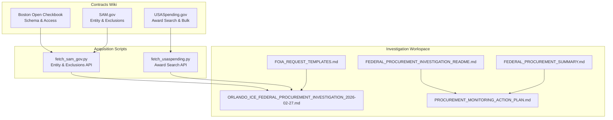
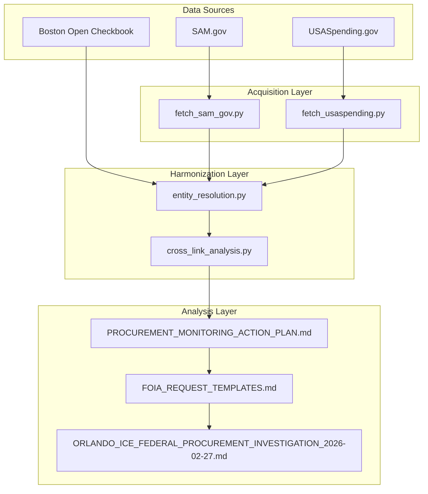
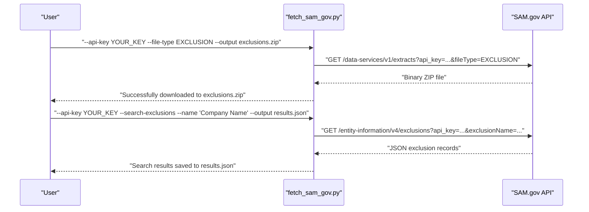
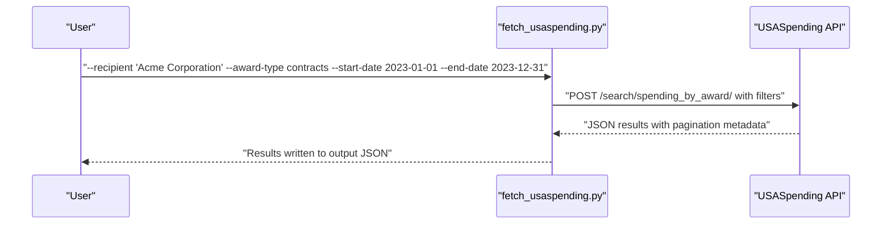
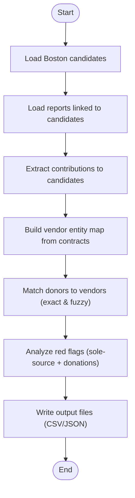
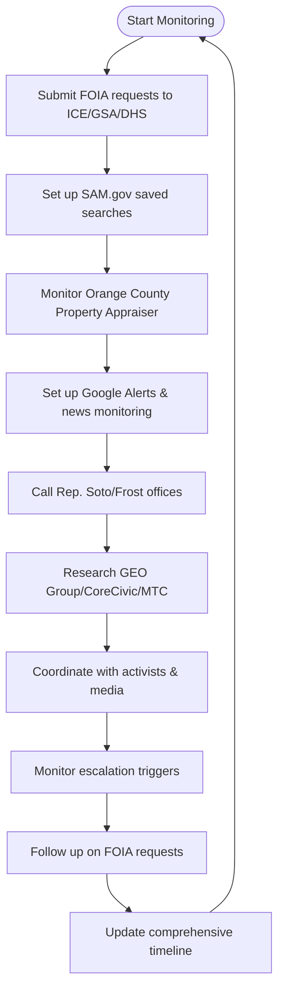
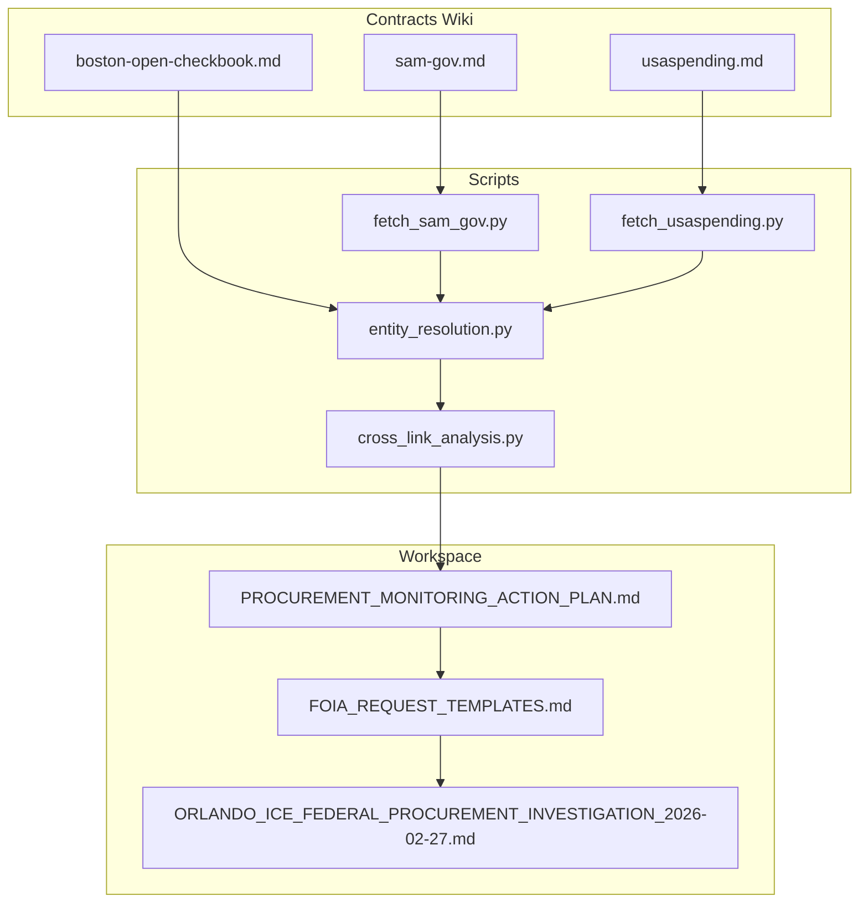

# Government Contracts Sources

<cite>
**Referenced Files in This Document**
- [boston-open-checkbook.md](file://wiki/contracts/boston-open-checkbook.md)
- [sam-gov.md](file://wiki/contracts/sam-gov.md)
- [usaspending.md](file://wiki/contracts/usaspending.md)
- [fetch_sam_gov.py](file://scripts/fetch_sam_gov.py)
- [fetch_usaspending.py](file://scripts/fetch_usaspending.py)
- [FEDERAL_PROCUREMENT_INVESTIGATION_README.md](file://central-fl-ice-workspace/FEDERAL_PROCUREMENT_INVESTIGATION_README.md)
- [FEDERAL_PROCUREMENT_SUMMARY.md](file://central-fl-ice-workspace/FEDERAL_PROCUREMENT_SUMMARY.md)
- [ORLANDO_ICE_FEDERAL_PROCUREMENT_INVESTIGATION_2026-02-27.md](file://central-fl-ice-workspace/ORLANDO_ICE_FEDERAL_PROCUREMENT_INVESTIGATION_2026-02-27.md)
- [FOIA_REQUEST_TEMPLATES.md](file://central-fl-ice-workspace/FOIA_REQUEST_TEMPLATES.md)
- [PROCUREMENT_MONITORING_ACTION_PLAN.md](file://central-fl-ice-workspace/PROCUREMENT_MONITORING_ACTION_PLAN.md)
- [entity_resolution.py](file://scripts/entity_resolution.py)
- [cross_link_analysis.py](file://scripts/cross_link_analysis.py)
- [README.md](file://README.md)
</cite>

## Table of Contents
1. [Introduction](#introduction)
2. [Project Structure](#project-structure)
3. [Core Components](#core-components)
4. [Architecture Overview](#architecture-overview)
5. [Detailed Component Analysis](#detailed-component-analysis)
6. [Dependency Analysis](#dependency-analysis)
7. [Performance Considerations](#performance-considerations)
8. [Troubleshooting Guide](#troubleshooting-guide)
9. [Conclusion](#conclusion)
10. [Appendices](#appendices)

## Introduction
This document provides comprehensive guidance for government contracts data sources, focusing on three primary federal data sources—USASpending.gov, SAM.gov, and the City of Boston Open Checkbook—and demonstrates practical workflows for procurement analysis, vendor network mapping, and award pattern identification. It also addresses data harmonization challenges, jurisdictional boundaries, cross-agency coordination, conflict of interest detection, contractor performance evaluation, and procurement irregularity identification using the methodologies and tools demonstrated in the repository.

## Project Structure
The repository organizes government contracts documentation and acquisition tools into three main areas:
- Contracts wiki: Detailed documentation of data sources, schemas, access methods, and cross-references
- Scripts: Acquisition utilities for SAM.gov and USASpending.gov
- Central Florida ICE workspace: Real-world investigation case study demonstrating end-to-end procurement monitoring and FOIA workflows

**Diagram sources**
- [boston-open-checkbook.md:1-79](file://wiki/contracts/boston-open-checkbook.md#L1-L79)
- [sam-gov.md:1-153](file://wiki/contracts/sam-gov.md#L1-L153)
- [usaspending.md:1-161](file://wiki/contracts/usaspending.md#L1-L161)
- [fetch_sam_gov.py:1-303](file://scripts/fetch_sam_gov.py#L1-L303)
- [fetch_usaspending.py:1-348](file://scripts/fetch_usaspending.py#L1-L348)
- [FEDERAL_PROCUREMENT_INVESTIGATION_README.md:1-272](file://central-fl-ice-workspace/FEDERAL_PROCUREMENT_INVESTIGATION_README.md#L1-L272)
- [FEDERAL_PROCUREMENT_SUMMARY.md:1-162](file://central-fl-ice-workspace/FEDERAL_PROCUREMENT_SUMMARY.md#L1-L162)
- [ORLANDO_ICE_FEDERAL_PROCUREMENT_INVESTIGATION_2026-02-27.md:1-724](file://central-fl-ice-workspace/ORLANDO_ICE_FEDERAL_PROCUREMENT_INVESTIGATION_2026-02-27.md#L1-L724)
- [FOIA_REQUEST_TEMPLATES.md:1-309](file://central-fl-ice-workspace/FOIA_REQUEST_TEMPLATES.md#L1-L309)
- [PROCUREMENT_MONITORING_ACTION_PLAN.md:1-420](file://central-fl-ice-workspace/PROCUREMENT_MONITORING_ACTION_PLAN.md#L1-L420)

**Section sources**
- [README.md:1-449](file://README.md#L1-L449)

## Core Components
This section outlines the three primary data sources and their schemas, access methods, and quality considerations.

### Boston Open Checkbook
- Jurisdiction: City of Boston
- Access: SODA API (JSON/CSV), bulk CSV download, no authentication required
- Key fields: vendor_name, department_name, account_description, amount, fiscal_year, contract_number, check_date/invoice_date
- Coverage: FY2011-present (dataset-dependent), quarterly/annual updates, tens of thousands of line items per fiscal year
- Cross-reference potential: OCPF campaign finance, MA Secretary of Commonwealth, lobbying disclosures
- Data quality: Clean CSV, vendor name variations across years, dataset restructuring between years

**Section sources**
- [boston-open-checkbook.md:1-79](file://wiki/contracts/boston-open-checkbook.md#L1-L79)

### SAM.gov (System for Award Management)
- Jurisdiction: United States federal government (all agencies)
- Access: Entity Management API, Exclusions API, Exclusions Extract API, authentication required (API key)
- Key fields (exclusions): classification, exclusionName, ueiSAM, cageCode, npi, exclusionType, exclusionProgram, excludingAgencyCode, excludingAgencyName, activationDate, terminationDate, recordStatus, stateProvince, country, addressLine1/2, zipCode, fascsaOrder
- Coverage: Current active registrations and exclusions; historical data via extracts; real-time entity registrations; daily exclusions extracts
- Cross-reference potential: Campaign finance data (OCPF, FEC), local/state contract databases, corporate registrations, lobbying disclosures, business ownership databases
- Data quality: Machine-readable JSON/CSV, name/address variations, restricted fields based on access level

**Section sources**
- [sam-gov.md:1-153](file://wiki/contracts/sam-gov.md#L1-L153)

### USASpending.gov
- Jurisdiction: Federal government (all agencies)
- Access: RESTful API (no authentication), bulk downloads, web interface
- Key fields (awards): Award ID, Recipient Name, Recipient UEI, Awarding Agency, Awarding Sub Agency, Funding Agency, Award Amount, Total Outlays, Description, Place of Performance City/State/Zip5, Last Modified Date, COVID-19 Obligations, def_codes, Start/End Date, Contract Award Type, NAICS, PSC, CFDA Number, Assistance Listings, SAI Number
- Coverage: FY2001-present (bulk), FY2008-present advanced search, Q2 FY2017-present financial systems, ~400 million award records total
- Cross-reference potential: State/local campaign finance, state corporate registries, lobbying disclosures, SEC EDGAR filings, state/local procurement, OpenSecrets/FEC
- Data quality: Known issues (incompleteness, timeliness, linkage gaps, name variations, historical data quality, DOD delay)

**Section sources**
- [usaspending.md:1-161](file://wiki/contracts/usaspending.md#L1-L161)

## Architecture Overview
The repository implements a layered approach to government contracts analysis:
- Data ingestion layer: Acquisition scripts for SAM.gov and USASpending.gov
- Schema harmonization layer: Normalization and entity resolution across datasets
- Analysis layer: Cross-dataset linking, vendor network mapping, and red flag detection
- Monitoring layer: Continuous tracking of federal procurement indicators

**Diagram sources**
- [fetch_sam_gov.py:1-303](file://scripts/fetch_sam_gov.py#L1-L303)
- [fetch_usaspending.py:1-348](file://scripts/fetch_usaspending.py#L1-L348)
- [entity_resolution.py:1-741](file://scripts/entity_resolution.py#L1-L741)
- [cross_link_analysis.py:1-586](file://scripts/cross_link_analysis.py#L1-L586)
- [PROCUREMENT_MONITORING_ACTION_PLAN.md:1-420](file://central-fl-ice-workspace/PROCUREMENT_MONITORING_ACTION_PLAN.md#L1-L420)
- [FOIA_REQUEST_TEMPLATES.md:1-309](file://central-fl-ice-workspace/FOIA_REQUEST_TEMPLATES.md#L1-L309)
- [ORLANDO_ICE_FEDERAL_PROCUREMENT_INVESTIGATION_2026-02-27.md:1-724](file://central-fl-ice-workspace/ORLANDO_ICE_FEDERAL_PROCUREMENT_INVESTIGATION_2026-02-27.md#L1-L724)

## Detailed Component Analysis

### SAM.gov Acquisition Workflow
The SAM.gov acquisition script demonstrates robust handling of entity and exclusion data retrieval, including bulk extraction and search modes.

**Diagram sources**
- [fetch_sam_gov.py:182-303](file://scripts/fetch_sam_gov.py#L182-L303)

**Section sources**
- [sam-gov.md:7-42](file://wiki/contracts/sam-gov.md#L7-L42)
- [fetch_sam_gov.py:1-303](file://scripts/fetch_sam_gov.py#L1-L303)

### USASpending.gov Acquisition Workflow
The USASpending.gov acquisition script provides flexible award search with filtering by recipient, agency, award type, and date range.

**Diagram sources**
- [fetch_usaspending.py:216-348](file://scripts/fetch_usaspending.py#L216-L348)

**Section sources**
- [usaspending.md:7-33](file://wiki/contracts/usaspending.md#L7-L33)
- [fetch_usaspending.py:1-348](file://scripts/fetch_usaspending.py#L1-L348)

### Entity Resolution and Cross-Linking
The entity resolution pipeline demonstrates normalization strategies and cross-dataset matching between Boston contracts and campaign finance data.

**Diagram sources**
- [entity_resolution.py:540-741](file://scripts/entity_resolution.py#L540-L741)
- [cross_link_analysis.py:399-586](file://scripts/cross_link_analysis.py#L399-L586)

**Section sources**
- [entity_resolution.py:1-741](file://scripts/entity_resolution.py#L1-L741)
- [cross_link_analysis.py:1-586](file://scripts/cross_link_analysis.py#L1-L586)

### Federal Procurement Monitoring Workflow (Orlando ICE Processing Center)
The investigation workspace demonstrates end-to-end monitoring of federal procurement, including FOIA requests, SAM.gov tracking, property records monitoring, and contractor intelligence.

**Diagram sources**
- [PROCUREMENT_MONITORING_ACTION_PLAN.md:18-420](file://central-fl-ice-workspace/PROCUREMENT_MONITORING_ACTION_PLAN.md#L18-L420)
- [FOIA_REQUEST_TEMPLATES.md:33-309](file://central-fl-ice-workspace/FOIA_REQUEST_TEMPLATES.md#L33-L309)
- [ORLANDO_ICE_FEDERAL_PROCUREMENT_INVESTIGATION_2026-02-27.md:412-637](file://central-fl-ice-workspace/ORLANDO_ICE_FEDERAL_PROCUREMENT_INVESTIGATION_2026-02-27.md#L412-L637)

**Section sources**
- [FEDERAL_PROCUREMENT_INVESTIGATION_README.md:1-272](file://central-fl-ice-workspace/FEDERAL_PROCUREMENT_INVESTIGATION_README.md#L1-L272)
- [FEDERAL_PROCUREMENT_SUMMARY.md:1-162](file://central-fl-ice-workspace/FEDERAL_PROCUREMENT_SUMMARY.md#L1-L162)
- [ORLANDO_ICE_FEDERAL_PROCUREMENT_INVESTIGATION_2026-02-27.md:1-724](file://central-fl-ice-workspace/ORLANDO_ICE_FEDERAL_PROCUREMENT_INVESTIGATION_2026-02-27.md#L1-L724)
- [PROCUREMENT_MONITORING_ACTION_PLAN.md:1-420](file://central-fl-ice-workspace/PROCUREMENT_MONITORING_ACTION_PLAN.md#L1-L420)
- [FOIA_REQUEST_TEMPLATES.md:1-309](file://central-fl-ice-workspace/FOIA_REQUEST_TEMPLATES.md#L1-L309)

## Dependency Analysis
The repository exhibits clear separation of concerns across data sources, acquisition scripts, and analysis workflows.

**Diagram sources**
- [boston-open-checkbook.md:1-79](file://wiki/contracts/boston-open-checkbook.md#L1-L79)
- [sam-gov.md:1-153](file://wiki/contracts/sam-gov.md#L1-L153)
- [usaspending.md:1-161](file://wiki/contracts/usaspending.md#L1-L161)
- [fetch_sam_gov.py:1-303](file://scripts/fetch_sam_gov.py#L1-L303)
- [fetch_usaspending.py:1-348](file://scripts/fetch_usaspending.py#L1-L348)
- [entity_resolution.py:1-741](file://scripts/entity_resolution.py#L1-L741)
- [cross_link_analysis.py:1-586](file://scripts/cross_link_analysis.py#L1-L586)
- [ORLANDO_ICE_FEDERAL_PROCUREMENT_INVESTIGATION_2026-02-27.md:1-724](file://central-fl-ice-workspace/ORLANDO_ICE_FEDERAL_PROCUREMENT_INVESTIGATION_2026-02-27.md#L1-L724)
- [PROCUREMENT_MONITORING_ACTION_PLAN.md:1-420](file://central-fl-ice-workspace/PROCUREMENT_MONITORING_ACTION_PLAN.md#L1-L420)
- [FOIA_REQUEST_TEMPLATES.md:1-309](file://central-fl-ice-workspace/FOIA_REQUEST_TEMPLATES.md#L1-L309)

**Section sources**
- [README.md:375-407](file://README.md#L375-L407)

## Performance Considerations
- API rate limits: SAM.gov enforces strict rate limits based on user roles; USASpending.gov has no documented rate limits but follows standard HTTP etiquette
- Data volume: USASpending.gov contains hundreds of millions of records; implement pagination and filtering to manage large queries
- Authentication overhead: SAM.gov requires API keys; cache and reuse keys appropriately
- Network reliability: Implement retry logic and exponential backoff for API calls
- Data normalization: Use efficient string normalization and indexing strategies to handle fuzzy matching across large datasets

## Troubleshooting Guide
Common issues and resolutions:
- HTTP errors from APIs: Check API keys, rate limit quotas, and network connectivity
- JSON parsing failures: Validate API responses and handle malformed JSON gracefully
- SAM.gov authentication: Ensure API key is valid and user role meets rate limit requirements
- USASpending.gov timeouts: Increase timeout values and implement retry logic
- Data quality issues: Account for name variations, missing identifiers, and historical data inconsistencies

**Section sources**
- [fetch_sam_gov.py:70-81](file://scripts/fetch_sam_gov.py#L70-L81)
- [fetch_usaspending.py:65-73](file://scripts/fetch_usaspending.py#L65-L73)

## Conclusion
The repository provides a comprehensive framework for government contracts analysis, combining authoritative federal data sources with practical acquisition tools and real-world monitoring workflows. By leveraging SAM.gov and USASpending.gov for federal procurement tracking, Boston Open Checkbook for local vendor monitoring, and robust entity resolution techniques, investigators can detect conflicts of interest, evaluate contractor performance, and identify procurement irregularities. The Orlando ICE Processing Center case study demonstrates how to coordinate cross-agency efforts, utilize FOIA effectively, and maintain continuous monitoring of procurement timelines.

## Appendices

### Practical Examples

#### Example 1: Vendor Network Mapping
- Use entity resolution pipeline to match campaign donors to city contractors
- Apply fuzzy matching strategies for name normalization
- Identify sole-source vendors with significant donor contributions

#### Example 2: Award Pattern Identification
- Query USASpending.gov for contracts by recipient, agency, and date range
- Filter by award type codes (contracts, grants, loans, direct payments, IDVs)
- Analyze geographic distribution using Place of Performance fields

#### Example 3: Conflict of Interest Detection
- Cross-reference federal contractor exclusions with campaign finance data
- Monitor vendor relationships across multiple jurisdictions
- Track lobbying disclosures for entities with federal contracts

### Data Harmonization Guidelines
- Use standardized entity identifiers (UEI/DUNS) when available
- Implement consistent name normalization across datasets
- Apply fuzzy matching with configurable thresholds
- Maintain audit trails for all transformations and joins

### Cross-Agency Coordination Best Practices
- Establish shared FOIA request strategies across agencies
- Create joint monitoring teams for multi-jurisdictional procurements
- Develop standardized data sharing protocols
- Coordinate press releases and public disclosures