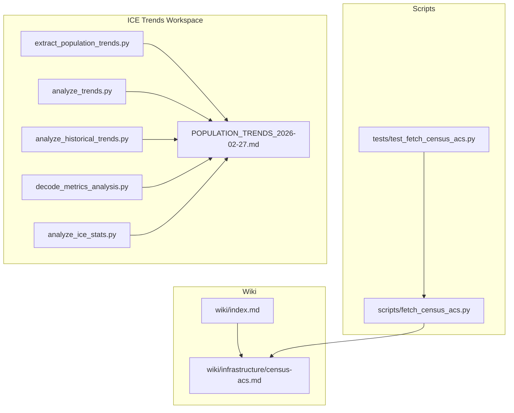
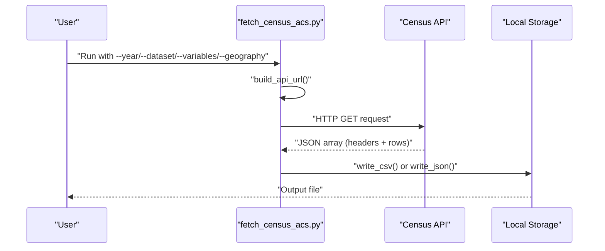
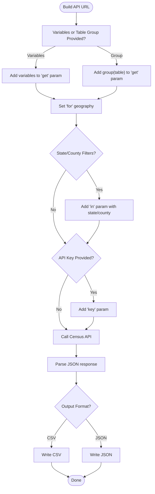
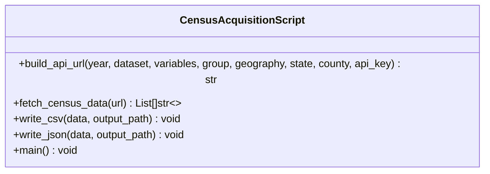
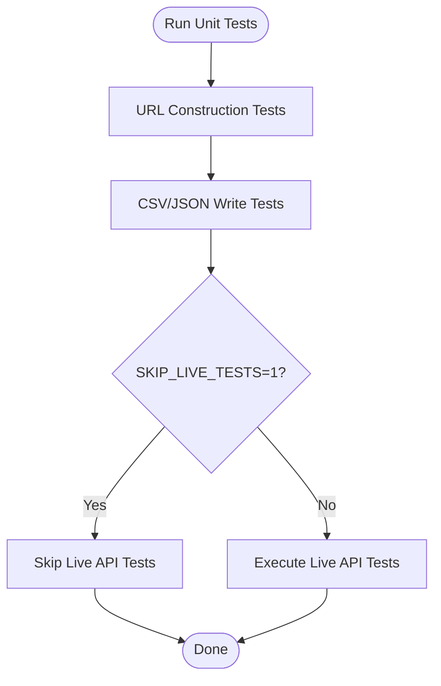
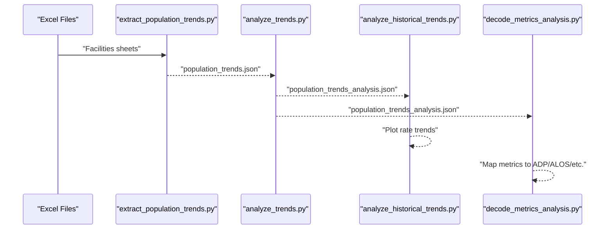
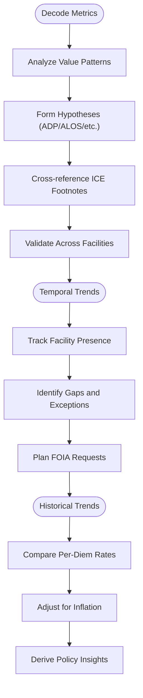
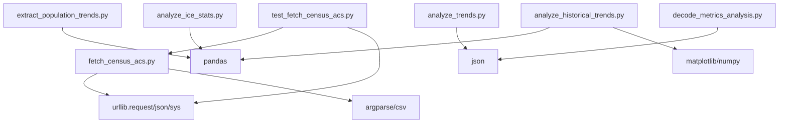

# Infrastructure & Census Sources

<cite>
**Referenced Files in This Document**
- [census-acs.md](file://wiki/infrastructure/census-acs.md)
- [fetch_census_acs.py](file://scripts/fetch_census_acs.py)
- [test_fetch_census_acs.py](file://tests/test_fetch_census_acs.py)
- [POPULATION_TRENDS_2026-02-27.md](file://central-fl-ice-workspace/POPULATION_TRENDS_2026-02-27.md)
- [extract_population_trends.py](file://central-fl-ice-workspace/extract_population_trends.py)
- [analyze_trends.py](file://central-fl-ice-workspace/analyze_trends.py)
- [analyze_historical_trends.py](file://central-fl-ice-workspace/analyze_historical_trends.py)
- [decode_metrics_analysis.py](file://central-fl-ice-workspace/decode_metrics_analysis.py)
- [analyze_ice_stats.py](file://central-fl-ice-workspace/analyze_ice_stats.py)
- [index.md](file://wiki/index.md)
</cite>

## Table of Contents
1. [Introduction](#introduction)
2. [Project Structure](#project-structure)
3. [Core Components](#core-components)
4. [Architecture Overview](#architecture-overview)
5. [Detailed Component Analysis](#detailed-component-analysis)
6. [Dependency Analysis](#dependency-analysis)
7. [Performance Considerations](#performance-considerations)
8. [Troubleshooting Guide](#troubleshooting-guide)
9. [Conclusion](#conclusion)
10. [Appendices](#appendices)

## Introduction
This document consolidates infrastructure and census data sources documentation for the OpenPlanter project, focusing on the US Census Bureau’s American Community Survey (ACS) and complementary demographic data workflows. It explains the structure and content of ACS wiki entries, documents demographic schemas, geographic hierarchies, socioeconomic indicators, and temporal change analysis methods. Practical examples demonstrate community analysis workflows, demographic trend identification, and geographic targeting strategies. Guidance is provided on data aggregation methods, sampling limitations, and demographic proxy construction, with emphasis on understanding community characteristics, identifying vulnerable populations, and analyzing social determinants of health and wellbeing.

## Project Structure
The repository organizes infrastructure and census-related materials as follows:
- Wiki documentation for the ACS source is located at wiki/infrastructure/census-acs.md.
- A Python acquisition script scripts/fetch_census_acs.py provides programmatic access to ACS via the Census API.
- Tests in tests/test_fetch_census_acs.py validate the acquisition script and include live API tests.
- Central Florida ICE detention workspace includes multiple analysis scripts and documents that illustrate temporal trend analysis and metric decoding workflows.

**Diagram sources**
- [census-acs.md:1-171](file://wiki/infrastructure/census-acs.md#L1-L171)
- [index.md:66-70](file://wiki/index.md#L66-L70)
- [fetch_census_acs.py:1-290](file://scripts/fetch_census_acs.py#L1-L290)
- [test_fetch_census_acs.py:1-274](file://tests/test_fetch_census_acs.py#L1-L274)
- [POPULATION_TRENDS_2026-02-27.md:1-252](file://central-fl-ice-workspace/POPULATION_TRENDS_2026-02-27.md#L1-L252)
- [extract_population_trends.py:1-162](file://central-fl-ice-workspace/extract_population_trends.py#L1-L162)
- [analyze_trends.py:1-160](file://central-fl-ice-workspace/analyze_trends.py#L1-L160)
- [analyze_historical_trends.py:1-170](file://central-fl-ice-workspace/analyze_historical_trends.py#L1-L170)
- [decode_metrics_analysis.py:1-140](file://central-fl-ice-workspace/decode_metrics_analysis.py#L1-L140)
- [analyze_ice_stats.py:1-93](file://central-fl-ice-workspace/analyze_ice_stats.py#L1-L93)

**Section sources**
- [census-acs.md:1-171](file://wiki/infrastructure/census-acs.md#L1-L171)
- [index.md:66-70](file://wiki/index.md#L66-L70)

## Core Components
- ACS API documentation and usage patterns are described in the ACS wiki entry, including access methods, rate limits, example queries, and data products.
- The acquisition script provides a command-line interface to query the Census API, supporting variable lists or entire table groups, geographic filters, and output formats.
- Tests validate URL construction, output writing, and live API interactions for small queries.
- ICE detention workspace demonstrates temporal trend analysis and metric decoding workflows that complement demographic analysis.

**Section sources**
- [census-acs.md:7-30](file://wiki/infrastructure/census-acs.md#L7-L30)
- [fetch_census_acs.py:155-286](file://scripts/fetch_census_acs.py#L155-L286)
- [test_fetch_census_acs.py:23-81](file://tests/test_fetch_census_acs.py#L23-L81)

## Architecture Overview
The system integrates ACS data acquisition with downstream analysis workflows. The acquisition script builds Census API URLs, fetches JSON responses, and writes CSV or JSON outputs. The ICE workspace scripts extract, clean, and analyze facility-level trends, while the ACS documentation provides the foundational demographic indicators for geographic targeting and vulnerability assessment.

**Diagram sources**
- [fetch_census_acs.py:36-92](file://scripts/fetch_census_acs.py#L36-L92)
- [fetch_census_acs.py:95-123](file://scripts/fetch_census_acs.py#L95-L123)
- [fetch_census_acs.py:125-153](file://scripts/fetch_census_acs.py#L125-L153)

## Detailed Component Analysis

### ACS API Access and Data Schema
- Access methods include the Census Data API (preferred), with datasets for 1-year and 5-year estimates and thematic products (profile, subject).
- Example queries demonstrate retrieving median household income, population by sex/age, and poverty rates for specific geographies.
- Data products include detailed tables (block group level), subject tables (tract level), data profiles (tract level), and comparison profiles (tract level).
- Geographic response fields support joins across state, county, tract, block group, place, congressional district, metropolitan area, and ZIP code tabulation areas.

**Diagram sources**
- [fetch_census_acs.py:36-92](file://scripts/fetch_census_acs.py#L36-L92)
- [fetch_census_acs.py:125-153](file://scripts/fetch_census_acs.py#L125-L153)

**Section sources**
- [census-acs.md:7-30](file://wiki/infrastructure/census-acs.md#L7-L30)
- [census-acs.md:38-88](file://wiki/infrastructure/census-acs.md#L38-L88)
- [census-acs.md:68-74](file://wiki/infrastructure/census-acs.md#L68-L74)

### Acquisition Script: fetch_census_acs.py
- Purpose: Query the Census API for specified variables or table groups, apply geographic filters, and output CSV or JSON.
- Key functions:
  - build_api_url: Constructs the API endpoint with parameters for variables, table groups, geography, and optional state/county filters and API key.
  - fetch_census_data: Performs HTTP request, handles errors, and returns parsed JSON.
  - write_csv/write_json: Writes results to disk in the chosen format.
- Command-line interface supports required arguments (year, dataset, variables or group, geography, optional state/county, API key) and output format selection.

**Diagram sources**
- [fetch_census_acs.py:36-92](file://scripts/fetch_census_acs.py#L36-L92)
- [fetch_census_acs.py:95-123](file://scripts/fetch_census_acs.py#L95-L123)
- [fetch_census_acs.py:125-153](file://scripts/fetch_census_acs.py#L125-L153)
- [fetch_census_acs.py:155-286](file://scripts/fetch_census_acs.py#L155-L286)

**Section sources**
- [fetch_census_acs.py:1-290](file://scripts/fetch_census_acs.py#L1-L290)

### Tests: test_fetch_census_acs.py
- Validates URL construction for variables, table groups, geographic filters, and API key inclusion.
- Includes CSV and JSON output writing tests.
- Contains live API tests that are conditionally skipped when network is unavailable, ensuring robustness in CI environments.

**Diagram sources**
- [test_fetch_census_acs.py:26-81](file://tests/test_fetch_census_acs.py#L26-L81)
- [test_fetch_census_acs.py:82-127](file://tests/test_fetch_census_acs.py#L82-L127)
- [test_fetch_census_acs.py:128-214](file://tests/test_fetch_census_acs.py#L128-L214)

**Section sources**
- [test_fetch_census_acs.py:1-274](file://tests/test_fetch_census_acs.py#L1-L274)

### ICE Detention Trends: Extraction and Analysis
- Extraction script identifies I-4 corridor facilities across annual Excel files and extracts population/capacity metrics.
- Analysis script cleans and structures the data, filters to Florida facilities, normalizes facility names, and creates structured trend records.
- Historical trends script visualizes rate progressions and compares per-diem rates across counties.
- Metrics decoding analysis attempts to interpret column meanings (ADP, ALOS, capacity) based on value patterns and footnotes.

**Diagram sources**
- [extract_population_trends.py:35-108](file://central-fl-ice-workspace/extract_population_trends.py#L35-L108)
- [analyze_trends.py:53-137](file://central-fl-ice-workspace/analyze_trends.py#L53-L137)
- [analyze_historical_trends.py:13-84](file://central-fl-ice-workspace/analyze_historical_trends.py#L13-L84)
- [decode_metrics_analysis.py:10-131](file://central-fl-ice-workspace/decode_metrics_analysis.py#L10-L131)

**Section sources**
- [POPULATION_TRENDS_2026-02-27.md:1-252](file://central-fl-ice-workspace/POPULATION_TRENDS_2026-02-27.md#L1-L252)
- [extract_population_trends.py:1-162](file://central-fl-ice-workspace/extract_population_trends.py#L1-L162)
- [analyze_trends.py:1-160](file://central-fl-ice-workspace/analyze_trends.py#L1-L160)
- [analyze_historical_trends.py:1-170](file://central-fl-ice-workspace/analyze_historical_trends.py#L1-L170)
- [decode_metrics_analysis.py:1-140](file://central-fl-ice-workspace/decode_metrics_analysis.py#L1-L140)

### Metric Decoding and Temporal Trend Interpretation
- The decoding analysis correlates value distributions with known ICE metrics (ADP, ALOS, capacity) and highlights differences across facilities.
- The trend analysis documents facility presence over time, identifies gaps, and raises questions requiring further FOIA requests.
- The historical trends script compares per-diem rates across counties and performs inflation adjustments to assess real changes.

**Diagram sources**
- [decode_metrics_analysis.py:68-131](file://central-fl-ice-workspace/decode_metrics_analysis.py#L68-L131)
- [POPULATION_TRENDS_2026-02-27.md:167-208](file://central-fl-ice-workspace/POPULATION_TRENDS_2026-02-27.md#L167-L208)
- [analyze_historical_trends.py:108-132](file://central-fl-ice-workspace/analyze_historical_trends.py#L108-L132)

**Section sources**
- [decode_metrics_analysis.py:1-140](file://central-fl-ice-workspace/decode_metrics_analysis.py#L1-L140)
- [POPULATION_TRENDS_2026-02-27.md:135-208](file://central-fl-ice-workspace/POPULATION_TRENDS_2026-02-27.md#L135-L208)
- [analyze_historical_trends.py:1-170](file://central-fl-ice-workspace/analyze_historical_trends.py#L1-L170)

## Dependency Analysis
- The acquisition script depends on Python standard library modules for HTTP requests, JSON parsing, argument parsing, and file I/O.
- Tests depend on the acquisition script module and use mocking and environment variables to control live API testing.
- ICE workspace scripts depend on pandas for data manipulation and matplotlib for visualization.

**Diagram sources**
- [fetch_census_acs.py:26-34](file://scripts/fetch_census_acs.py#L26-L34)
- [test_fetch_census_acs.py:17-20](file://tests/test_fetch_census_acs.py#L17-L20)
- [extract_population_trends.py:7-9](file://central-fl-ice-workspace/extract_population_trends.py#L7-L9)
- [analyze_trends.py:7-8](file://central-fl-ice-workspace/analyze_trends.py#L7-L8)
- [analyze_historical_trends.py:6-11](file://central-fl-ice-workspace/analyze_historical_trends.py#L6-L11)
- [decode_metrics_analysis.py:7-8](file://central-fl-ice-workspace/decode_metrics_analysis.py#L7-L8)
- [analyze_ice_stats.py:6-9](file://central-fl-ice-workspace/analyze_ice_stats.py#L6-L9)

**Section sources**
- [fetch_census_acs.py:26-34](file://scripts/fetch_census_acs.py#L26-L34)
- [test_fetch_census_acs.py:17-20](file://tests/test_fetch_census_acs.py#L17-L20)
- [extract_population_trends.py:7-9](file://central-fl-ice-workspace/extract_population_trends.py#L7-L9)
- [analyze_trends.py:7-8](file://central-fl-ice-workspace/analyze_trends.py#L7-L8)
- [analyze_historical_trends.py:6-11](file://central-fl-ice-workspace/analyze_historical_trends.py#L6-L11)
- [decode_metrics_analysis.py:7-8](file://central-fl-ice-workspace/decode_metrics_analysis.py#L7-L8)
- [analyze_ice_stats.py:6-9](file://central-fl-ice-workspace/analyze_ice_stats.py#L6-L9)

## Performance Considerations
- API rate limits: Without an API key, the limit is approximately 500 queries per day per IP; with a key, limits are effectively higher for reasonable usage. Plan batched queries and cache results when feasible.
- Sampling limitations: ACS is survey-based; all estimates include margins of error. Smaller geographies have wider margins. Use margin-of-error variables for statistical tests and suppressions for small samples.
- Multi-year estimates: 5-year estimates aggregate 60 months of responses for greater stability; avoid using them to detect single-year changes.
- Geography changes: Census tracts and block groups are redrawn periodically; use crosswalk files for longitudinal analyses across boundary changes.

[No sources needed since this section provides general guidance]

## Troubleshooting Guide
- Network and HTTP errors: The acquisition script catches HTTP errors and network issues, printing detailed messages to stderr. Review error codes and response bodies for diagnosis.
- Empty or malformed responses: Validate that the API returns a JSON array with headers and rows; handle cases where no data is returned.
- Output format detection: If not specified, the script determines output format from the file extension; ensure .csv or .json suffixes are used.
- Live API tests: Controlled by an environment variable to skip network-dependent tests; set the variable appropriately in CI or local environments.

**Section sources**
- [fetch_census_acs.py:108-122](file://scripts/fetch_census_acs.py#L108-L122)
- [test_fetch_census_acs.py:128-176](file://tests/test_fetch_census_acs.py#L128-L176)
- [test_fetch_census_acs.py:224-268](file://tests/test_fetch_census_acs.py#L224-L268)

## Conclusion
OpenPlanter’s ACS documentation and acquisition pipeline provide a robust foundation for demographic analysis at multiple geographic scales. The integration with ICE detention trend analysis demonstrates practical workflows for extracting, cleaning, and interpreting facility-level metrics, while the ACS schema and quality notes guide sound statistical inference. By combining ACS indicators with targeted facility analytics, analysts can identify vulnerable populations, understand community characteristics, and evaluate social determinants of health and wellbeing.

[No sources needed since this section summarizes without analyzing specific files]

## Appendices

### Practical Examples and Workflows
- Community analysis workflow:
  - Define target geography (state, county, tract, block group).
  - Select relevant ACS variables (e.g., median household income, poverty, educational attainment, housing costs).
  - Query the Census API using the acquisition script and export results.
  - Join with other datasets (e.g., environmental, infrastructure, or social service records) using geographic identifiers (FIPS codes, ZIP codes).
  - Aggregate and normalize indicators (e.g., per-capita metrics, ratios) to compare communities.
- Demographic trend identification:
  - Use multi-year ACS estimates to track changes over time; align periods to avoid overlap.
  - Apply margin of error thresholds to assess statistical significance of observed changes.
- Geographic targeting strategies:
  - Overlay ACS indicators on maps to identify areas with high concentrations of vulnerable populations.
  - Combine demographic proxies (e.g., median income, unemployment, housing cost burden) with outcome data to prioritize interventions.

[No sources needed since this section provides general guidance]