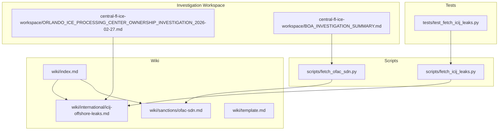
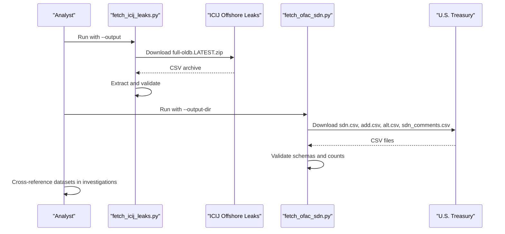
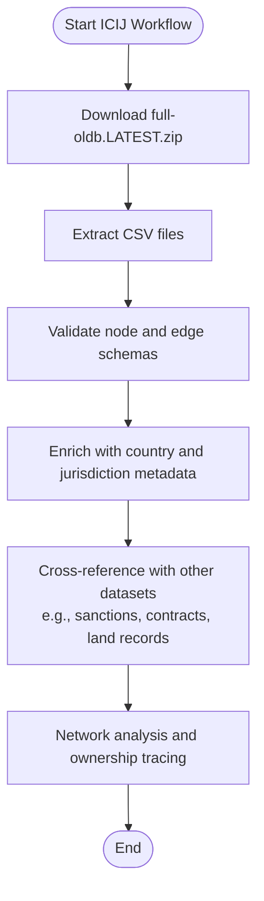
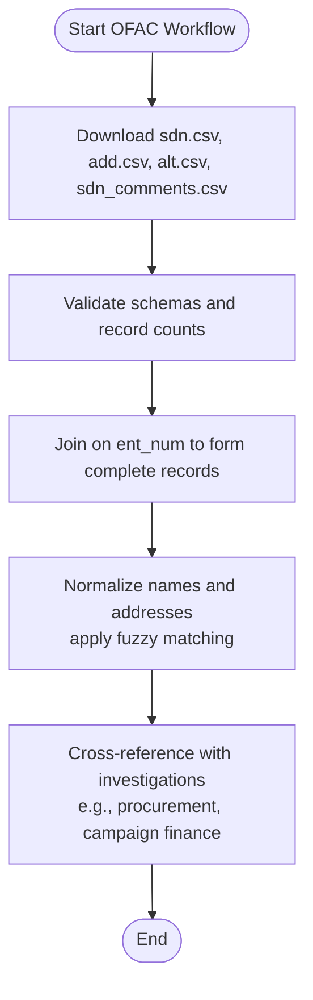
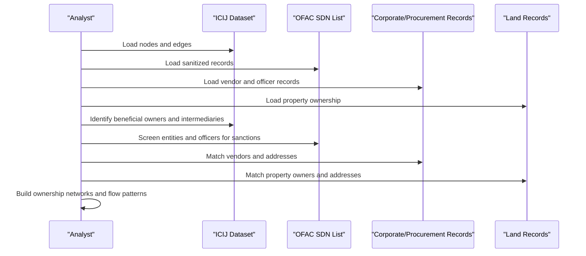
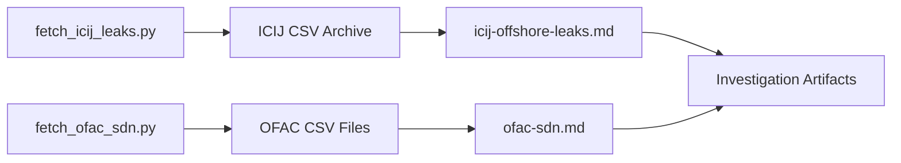

# International & Offshore Sources

<cite>
**Referenced Files in This Document**
- [icij-offshore-leaks.md](file://wiki/international/icij-offshore-leaks.md)
- [fetch_icij_leaks.py](file://scripts/fetch_icij_leaks.py)
- [test_fetch_icij_leaks.py](file://tests/test_fetch_icij_leaks.py)
- [ofac-sdn.md](file://wiki/sanctions/ofac-sdn.md)
- [fetch_ofac_sdn.py](file://scripts/fetch_ofac_sdn.py)
- [index.md](file://wiki/index.md)
- [template.md](file://wiki/template.md)
- [ORLANDO_ICE_PROCESSING_CENTER_OWNERSHIP_INVESTIGATION_2026-02-27.md](file://central-fl-ice-workspace/ORLANDO_ICE_PROCESSING_CENTER_OWNERSHIP_INVESTIGATION_2026-02-27.md)
- [BOA_INVESTIGATION_SUMMARY.md](file://central-fl-ice-workspace/BOA_INVESTIGATION_SUMMARY.md)
</cite>

## Table of Contents
1. [Introduction](#introduction)
2. [Project Structure](#project-structure)
3. [Core Components](#core-components)
4. [Architecture Overview](#architecture-overview)
5. [Detailed Component Analysis](#detailed-component-analysis)
6. [Dependency Analysis](#dependency-analysis)
7. [Performance Considerations](#performance-considerations)
8. [Troubleshooting Guide](#troubleshooting-guide)
9. [Conclusion](#conclusion)
10. [Appendices](#appendices)

## Introduction
This document explains how to work with international and offshore data sources in this repository, focusing on the ICIJ Offshore Leaks Database and the OFAC SDN List. It covers data schemas, entity and ownership models, cross-border flow patterns, and practical investigation workflows. It also addresses data quality, licensing, privacy, legal restrictions, and international cooperation challenges. Guidance is provided for navigating complex ownership structures, detecting tax avoidance schemes, and understanding global financial networks.

## Project Structure
The repository organizes international transparency data as wiki pages and acquisition scripts:
- International datasets are documented in wiki/international/*.md
- Acquisition scripts live under scripts/ and are accompanied by unit tests under tests/

**Diagram sources**
- [index.md](file://wiki/index.md)
- [icij-offshore-leaks.md](file://wiki/international/icij-offshore-leaks.md)
- [ofac-sdn.md](file://wiki/sanctions/ofac-sdn.md)
- [fetch_icij_leaks.py](file://scripts/fetch_icij_leaks.py)
- [fetch_ofac_sdn.py](file://scripts/fetch_ofac_sdn.py)
- [test_fetch_icij_leaks.py](file://tests/test_fetch_icij_leaks.py)
- [ORLANDO_ICE_PROCESSING_CENTER_OWNERSHIP_INVESTIGATION_2026-02-27.md](file://central-fl-ice-workspace/ORLANDO_ICE_PROCESSING_CENTER_OWNERSHIP_INVESTIGATION_2026-02-27.md)
- [BOA_INVESTIGATION_SUMMARY.md](file://central-fl-ice-workspace/BOA_INVESTIGATION_SUMMARY.md)

**Section sources**
- [index.md](file://wiki/index.md)
- [template.md](file://wiki/template.md)

## Core Components
- ICIJ Offshore Leaks Database: A global repository of offshore entities, officers, intermediaries, and addresses, with structured CSV exports and graph relationships.
- OFAC SDN List: U.S. Treasury’s sanctions database with primary records, addresses, and aliases, requiring all four CSV files to form a complete dataset.

Key capabilities:
- Bulk acquisition scripts automate downloading and validating datasets.
- Wiki pages provide schema, coverage, cross-reference opportunities, and legal/licensing guidance.
- Tests validate network availability and script argument handling.

**Section sources**
- [icij-offshore-leaks.md](file://wiki/international/icij-offshore-leaks.md)
- [fetch_icij_leaks.py](file://scripts/fetch_icij_leaks.py)
- [test_fetch_icij_leaks.py](file://tests/test_fetch_icij_leaks.py)
- [ofac-sdn.md](file://wiki/sanctions/ofac-sdn.md)
- [fetch_ofac_sdn.py](file://scripts/fetch_ofac_sdn.py)

## Architecture Overview
The international data ecosystem integrates acquisition scripts, validated datasets, and investigation artifacts:

**Diagram sources**
- [fetch_icij_leaks.py](file://scripts/fetch_icij_leaks.py)
- [icij-offshore-leaks.md](file://wiki/international/icij-offshore-leaks.md)
- [fetch_ofac_sdn.py](file://scripts/fetch_ofac_sdn.py)
- [ofac-sdn.md](file://wiki/sanctions/ofac-sdn.md)

## Detailed Component Analysis

### ICIJ Offshore Leaks Database
- Purpose: Comprehensive offshore entity and ownership graph for investigations.
- Access: Bulk CSV archive, web interface, reconciliation API, Neo4j dumps.
- Schema: Graph model with nodes (Entity, Officer, Intermediary, Address, Other) and typed relationships (e.g., officer_of, shareholder_of, intermediary_of, beneficiary_of).
- Coverage: Global, 200+ jurisdictions, 80+ years of activity across multiple leak investigations.
- Cross-reference potential: Campaign finance, government contracts, corporate registries, sanctions lists, land records, lobbying disclosures.
- Data quality: UTF-8 CSV, provenance via sourceID, structured relationships, multiple date fields; known issues include name inconsistencies, incomplete addresses, date format variations, missing fields, duplicates, language encoding, and sparse officer data.
- Acquisition: See [fetch_icij_leaks.py](file://scripts/fetch_icij_leaks.py) for automated download and extraction.

**Diagram sources**
- [icij-offshore-leaks.md](file://wiki/international/icij-offshore-leaks.md)
- [fetch_icij_leaks.py](file://scripts/fetch_icij_leaks.py)

**Section sources**
- [icij-offshore-leaks.md](file://wiki/international/icij-offshore-leaks.md)
- [fetch_icij_leaks.py](file://scripts/fetch_icij_leaks.py)
- [test_fetch_icij_leaks.py](file://tests/test_fetch_icij_leaks.py)

### OFAC SDN List
- Purpose: U.S. sanctions database for individuals, entities, and vessels under national security and economic programs.
- Access: Legacy CSV files (sdn.csv, add.csv, alt.csv, sdn_comments.csv), XML, fixed-field formats, web interface, Sanctions List Service API.
- Schema: Relational with ent_num as primary key; sdn.csv (names, types, programs), add.csv (addresses), alt.csv (aliases), sdn_comments.csv (remarks overflow).
- Coverage: Global scope, variable update cadence; approximately 12,000+ SDN entries with 20,000+ aliases and 15,000+ addresses.
- Cross-reference potential: Corporate registries, campaign finance, public procurement, real estate, business licenses; join keys include names (fuzzy matching), addresses, DOB, passport numbers, vessel identifiers.
- Data quality: No header row in legacy CSVs; extensive aliasing for transliteration; address granularity varies; requires fuzzy matching and disambiguation.
- Acquisition: See [fetch_ofac_sdn.py](file://scripts/fetch_ofac_sdn.py) for downloading and validating all four CSV files.

**Diagram sources**
- [ofac-sdn.md](file://wiki/sanctions/ofac-sdn.md)
- [fetch_ofac_sdn.py](file://scripts/fetch_ofac_sdn.py)

**Section sources**
- [ofac-sdn.md](file://wiki/sanctions/ofac-sdn.md)
- [fetch_ofac_sdn.py](file://scripts/fetch_ofac_sdn.py)

### Practical Investigation Workflows and Examples
- Offshore entity ownership tracing:
  - Use ICIJ nodes and edges to identify beneficial owners and intermediaries.
  - Cross-reference with corporate registries and land records to trace ultimate beneficial ownership.
  - Example artifact: [ORLANDO_ICE_PROCESSING_CENTER_OWNERSHIP_INVESTIGATION_2026-02-27.md](file://central-fl-ice-workspace/ORLANDO_ICE_PROCESSING_CENTER_OWNERSHIP_INVESTIGATION_2026-02-27.md) documents ownership entities, registered agents, and developers for a logistics center.
- Detecting tax avoidance and shell structures:
  - Combine ICIJ relationships with sanctions and procurement datasets to identify front companies and evasion networks.
  - Apply fuzzy matching on names and addresses; validate with date ranges and jurisdiction metadata.
- Navigating jurisdictional complexity:
  - Use jurisdiction and country fields to filter and group entities; leverage sourceID to assess data vintage and reliability.
- Wealth attribution and financial flows:
  - Map relationships among entities, officers, and addresses; correlate with real estate and procurement records to infer asset ownership and flows.

**Diagram sources**
- [icij-offshore-leaks.md](file://wiki/international/icij-offshore-leaks.md)
- [ofac-sdn.md](file://wiki/sanctions/ofac-sdn.md)
- [ORLANDO_ICE_PROCESSING_CENTER_OWNERSHIP_INVESTIGATION_2026-02-27.md](file://central-fl-ice-workspace/ORLANDO_ICE_PROCESSING_CENTER_OWNERSHIP_INVESTIGATION_2026-02-27.md)

**Section sources**
- [icij-offshore-leaks.md](file://wiki/international/icij-offshore-leaks.md)
- [ofac-sdn.md](file://wiki/sanctions/ofac-sdn.md)
- [ORLANDO_ICE_PROCESSING_CENTER_OWNERSHIP_INVESTIGATION_2026-02-27.md](file://central-fl-ice-workspace/ORLANDO_ICE_PROCESSING_CENTER_OWNERSHIP_INVESTIGATION_2026-02-27.md)

### Data Privacy, Legal Restrictions, and International Cooperation
- ICIJ Offshore Leaks:
  - License: ODbL v1.0 (database) + CC BY-SA (contents); attribution required; commercial use permitted with share-alike and attribution.
  - Privacy: Includes personal information; responsible use requires corroboration and context.
- OFAC SDN List:
  - Public domain; freely redistributable; U.S. persons and entities are legally required to block transactions with SDN-listed parties; use carries legal liability.
  - Export control considerations: Sharing with sanctioned parties or using to facilitate evasion is prohibited.
- International cooperation:
  - Data sources span jurisdictions; harmonize fuzzy matching and normalization across languages and alphabets.
  - Respect publication licenses and attribution requirements when deriving or publishing datasets.

**Section sources**
- [icij-offshore-leaks.md](file://wiki/international/icij-offshore-leaks.md)
- [ofac-sdn.md](file://wiki/sanctions/ofac-sdn.md)

## Dependency Analysis
- Internal dependencies:
  - Acquisition scripts depend on standard libraries and external endpoints.
  - Tests validate network connectivity and script argument handling.
- External dependencies:
  - ICIJ bulk CSV endpoint and web interface.
  - OFAC legacy CSV endpoint and web interface.
- Investigation artifacts depend on cleaned and normalized datasets.

**Diagram sources**
- [fetch_icij_leaks.py](file://scripts/fetch_icij_leaks.py)
- [fetch_ofac_sdn.py](file://scripts/fetch_ofac_sdn.py)
- [icij-offshore-leaks.md](file://wiki/international/icij-offshore-leaks.md)
- [ofac-sdn.md](file://wiki/sanctions/ofac-sdn.md)

**Section sources**
- [index.md](file://wiki/index.md)
- [template.md](file://wiki/template.md)

## Performance Considerations
- Download sizes are large; use chunked transfers and monitor progress.
- CSV parsing benefits from UTF-8 encoding and consistent delimiters.
- Graph-scale queries (e.g., Neo4j dumps) enable efficient relationship traversal.
- Fuzzy matching and normalization can be computationally intensive; pre-filter by jurisdiction and date ranges.

[No sources needed since this section provides general guidance]

## Troubleshooting Guide
- Network connectivity:
  - Verify endpoint accessibility before running scripts; tests demonstrate endpoint validation and argument help.
- Download failures:
  - Check HTTP/URL errors and retry; ensure sufficient disk space.
- Extraction issues:
  - Confirm ZIP integrity; re-download if corrupted.
- Schema mismatches:
  - Validate CSV field counts; legacy OFAC files lack headers and require positional parsing.
- Argument handling:
  - Use --help to review supported options; tests validate help output and script importability.

**Section sources**
- [test_fetch_icij_leaks.py](file://tests/test_fetch_icij_leaks.py)
- [fetch_icij_leaks.py](file://scripts/fetch_icij_leaks.py)
- [fetch_ofac_sdn.py](file://scripts/fetch_ofac_sdn.py)
- [ofac-sdn.md](file://wiki/sanctions/ofac-sdn.md)

## Conclusion
This repository provides robust documentation and automation for international transparency data, especially the ICIJ Offshore Leaks Database and the OFAC SDN List. By leveraging structured schemas, cross-references, and validated acquisition scripts, investigators can navigate complex ownership structures, detect tax avoidance and sanctions evasion, and understand cross-border financial flows. Adherence to licensing, privacy, and legal obligations ensures responsible use of sensitive datasets.

[No sources needed since this section summarizes without analyzing specific files]

## Appendices

### Appendix A: Offshore Entity and Ownership Schema Highlights
- Entities: Companies, trusts, foundations; include jurisdiction, status, incorporation/inactivation dates.
- Officers: Directors, shareholders, beneficiaries; include roles, nationalities, passports.
- Intermediaries: Facilitating firms; include service providers.
- Relationships: officer_of, shareholder_of, intermediary_of, registered_address, beneficiary_of, related_entity, connected_to, same_as.

**Section sources**
- [icij-offshore-leaks.md](file://wiki/international/icij-offshore-leaks.md)

### Appendix B: Sanctions Schema Highlights
- sdn.csv: Primary identifiers, names, types, programs, remarks.
- add.csv: Addresses linked by ent_num; cardinality one-to-many.
- alt.csv: Aliases (AKA, FKA, NKA) linked by ent_num.
- sdn_comments.csv: Remarks overflow data.

**Section sources**
- [ofac-sdn.md](file://wiki/sanctions/ofac-sdn.md)

### Appendix C: Investigation Artifact Example
- Ownership investigation for a logistics center demonstrates how to document registered agents, principals, business types, and connections to broader real estate portfolios.

**Section sources**
- [ORLANDO_ICE_PROCESSING_CENTER_OWNERSHIP_INVESTIGATION_2026-02-27.md](file://central-fl-ice-workspace/ORLANDO_ICE_PROCESSING_CENTER_OWNERSHIP_INVESTIGATION_2026-02-27.md)

### Appendix D: Legal and Policy Context
- BOA investigation summary clarifies the voluntary nature of Basic Ordering Agreements and highlights financial impacts and legal authorities relevant to federal-local cooperation.

**Section sources**
- [BOA_INVESTIGATION_SUMMARY.md](file://central-fl-ice-workspace/BOA_INVESTIGATION_SUMMARY.md)