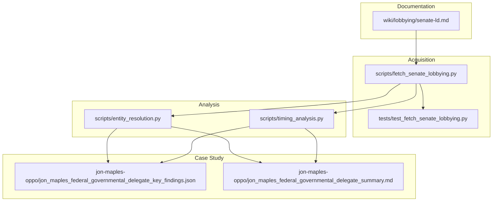
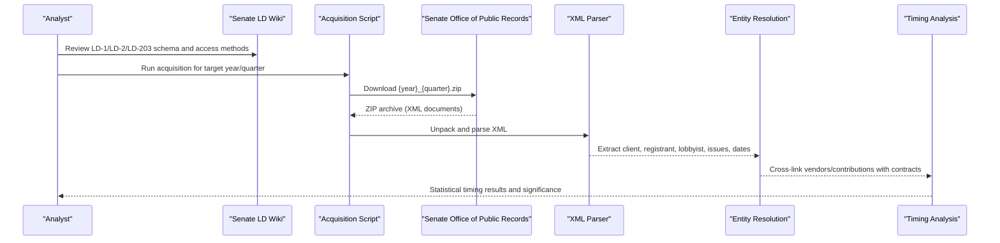
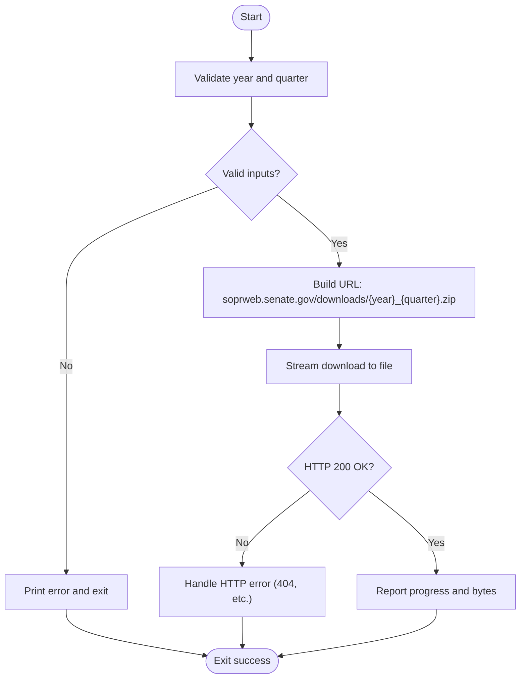
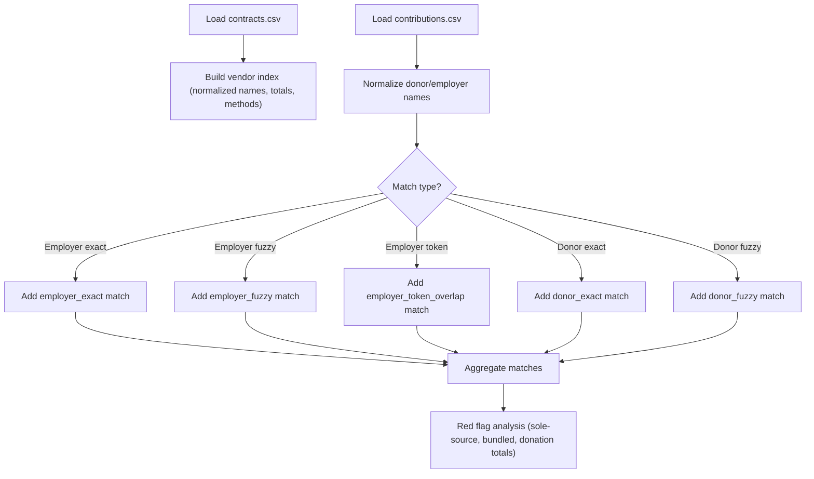
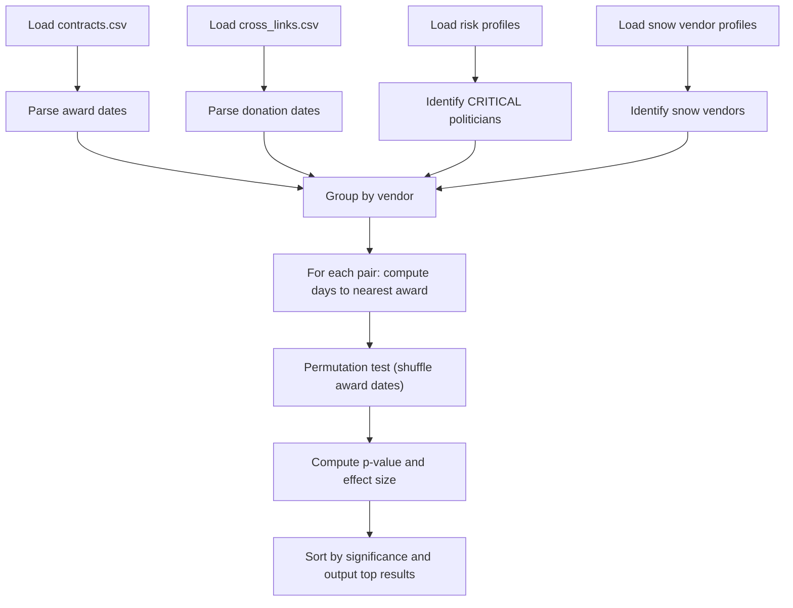
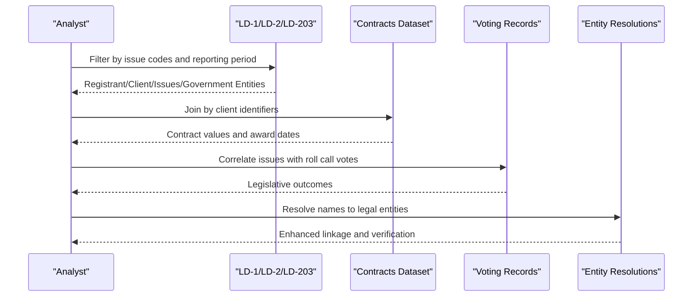
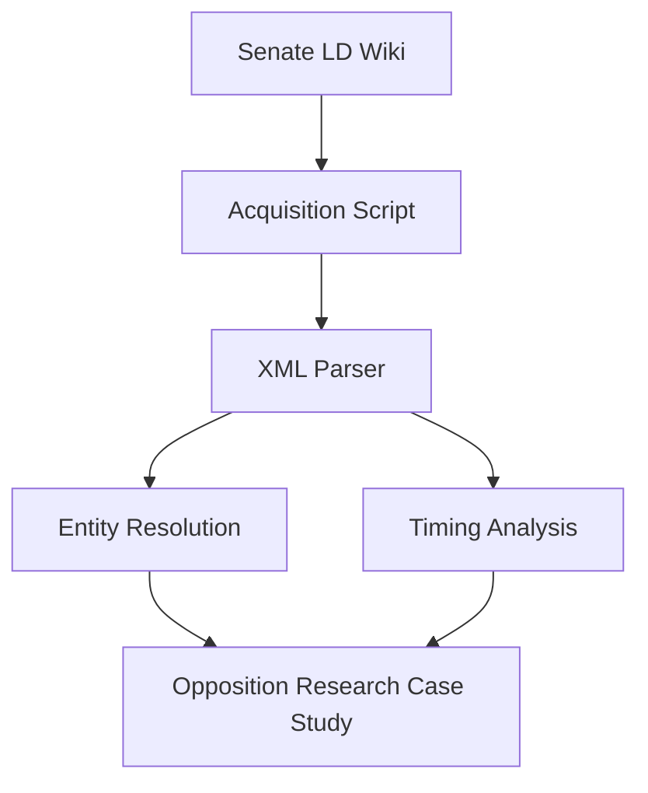

# Lobbying Disclosures Sources

<cite>
**Referenced Files in This Document**
- [senate-ld.md](file://wiki/lobbying/senate-ld.md)
- [fetch_senate_lobbying.py](file://scripts/fetch_senate_lobbying.py)
- [test_fetch_senate_lobbying.py](file://tests/test_fetch_senate_lobbying.py)
- [timing_analysis.py](file://scripts/timing_analysis.py)
- [entity_resolution.py](file://scripts/entity_resolution.py)
- [jon_maples_federal_governmental_delegate_key_findings.json](file://jon-maples-oppo/jon_maples_federal_governmental_delegate_key_findings.json)
- [jon_maples_federal_governmental_delegate_summary.md](file://jon-maples-oppo/jon_maples_federal_governmental_delegate_summary.md)
</cite>

## Table of Contents
1. [Introduction](#introduction)
2. [Project Structure](#project-structure)
3. [Core Components](#core-components)
4. [Architecture Overview](#architecture-overview)
5. [Detailed Component Analysis](#detailed-component-analysis)
6. [Dependency Analysis](#dependency-analysis)
7. [Performance Considerations](#performance-considerations)
8. [Troubleshooting Guide](#troubleshooting-guide)
9. [Conclusion](#conclusion)
10. [Appendices](#appendices)

## Introduction
This document provides comprehensive guidance for working with Senate lobbying disclosure data sources, focusing on LD-1 (registrations), LD-2 (quarterly activity), and LD-203 (contributions) filings. It explains the structure and content of Senate lobbying wiki entries, outlines lobbying activity schemas, describes client identification methods, and details issue advocacy patterns. It also covers lobbyist registration requirements, practical analysis workflows, influence mapping, issue advocacy tracking, disclosure gaps, timing considerations, indirect lobbying strategies, conflict-of-interest identification, policy impact analysis, and democratic accountability mechanisms.

## Project Structure
The repository organizes lobbying data resources and analysis tools as follows:
- Wiki documentation: authoritative source for Senate lobbying schema, coverage, quality, and cross-references
- Acquisition script: automated downloader for quarterly XML archives from the Senate Office of Public Records
- Tests: validation of the acquisition pipeline and endpoint accessibility
- Analysis scripts: entity resolution and timing analysis for cross-dataset linkage and temporal pattern detection
- Opponent research case study: illustrates grassroots advocacy roles, disclosure gaps, and conflict-of-interest considerations

**Diagram sources**
- [senate-ld.md:1-122](file://wiki/lobbying/senate-ld.md#L1-L122)
- [fetch_senate_lobbying.py:1-180](file://scripts/fetch_senate_lobbying.py#L1-L180)
- [test_fetch_senate_lobbying.py:1-128](file://tests/test_fetch_senate_lobbying.py#L1-L128)
- [entity_resolution.py:1-741](file://scripts/entity_resolution.py#L1-L741)
- [timing_analysis.py:1-339](file://scripts/timing_analysis.py#L1-L339)
- [jon_maples_federal_governmental_delegate_key_findings.json:1-164](file://jon-maples-oppo/jon_maples_federal_governmental_delegate_key_findings.json#L1-L164)
- [jon_maples_federal_governmental_delegate_summary.md:1-111](file://jon-maples-oppo/jon_maples_federal_governmental_delegate_summary.md#L1-L111)

**Section sources**
- [senate-ld.md:1-122](file://wiki/lobbying/senate-ld.md#L1-L122)
- [fetch_senate_lobbying.py:1-180](file://scripts/fetch_senate_lobbying.py#L1-L180)
- [test_fetch_senate_lobbying.py:1-128](file://tests/test_fetch_senate_lobbying.py#L1-L128)
- [entity_resolution.py:1-741](file://scripts/entity_resolution.py#L1-L741)
- [timing_analysis.py:1-339](file://scripts/timing_analysis.py#L1-L339)
- [jon_maples_federal_governmental_delegate_key_findings.json:1-164](file://jon-maples-oppo/jon_maples_federal_governmental_delegate_key_findings.json#L1-L164)
- [jon_maples_federal_governmental_delegate_summary.md:1-111](file://jon-maples-oppo/jon_maples_federal_governmental_delegate_summary.md#L1-L111)

## Core Components
- Senate lobbying wiki entry: defines LD-1, LD-2, LD-203 schemas, access methods, coverage, cross-references, data quality, and legal context
- Acquisition script: downloads quarterly XML archives from the Senate Office of Public Records with robust error handling and progress reporting
- Tests: validate endpoint availability, input validation, and file creation behavior
- Entity resolution pipeline: normalizes names, builds vendor indexes, and matches contributions to vendors for red flag analysis
- Timing analysis: performs permutation tests to detect suspicious clustering of donations relative to contract award dates
- Case study: demonstrates grassroots advocacy roles, disclosure gaps, and conflict-of-interest assessment

**Section sources**
- [senate-ld.md:25-122](file://wiki/lobbying/senate-ld.md#L25-L122)
- [fetch_senate_lobbying.py:28-116](file://scripts/fetch_senate_lobbying.py#L28-L116)
- [test_fetch_senate_lobbying.py:17-124](file://tests/test_fetch_senate_lobbying.py#L17-L124)
- [entity_resolution.py:213-438](file://scripts/entity_resolution.py#L213-L438)
- [timing_analysis.py:95-157](file://scripts/timing_analysis.py#L95-L157)
- [jon_maples_federal_governmental_delegate_key_findings.json:58-136](file://jon-maples-oppo/jon_maples_federal_governmental_delegate_key_findings.json#L58-L136)
- [jon_maples_federal_governmental_delegate_summary.md:14-66](file://jon-maples-oppo/jon_maples_federal_governmental_delegate_summary.md#L14-L66)

## Architecture Overview
The Senate lobbying data workflow integrates documentation, acquisition, and analysis:

**Diagram sources**
- [senate-ld.md:7-24](file://wiki/lobbying/senate-ld.md#L7-L24)
- [fetch_senate_lobbying.py:28-116](file://scripts/fetch_senate_lobbying.py#L28-L116)
- [entity_resolution.py:539-736](file://scripts/entity_resolution.py#L539-L736)
- [timing_analysis.py:159-338](file://scripts/timing_analysis.py#L159-L338)

## Detailed Component Analysis

### Senate Lobbying Data Schema and Content
- LD-1 (Registration): captures registrant and client identifiers, effective date, general issue codes, specific issues, lobbyists, prior covered positions, and foreign entity ownership indicators
- LD-2 (Quarterly Activity Report): captures reporting period, income and expenses (rounded), general issue codes, specific issues, government entities contacted, and active lobbyists
- LD-203 (Contributions Report): captures report type, contributor, payee names and organizations, amount, date, and type (FECA, PAC, etc.)

Key identifiers and join keys:
- RegistrantID and ClientID (Senate-assigned unique IDs) are reliable join keys
- RegistrantName and ClientName require fuzzy matching due to variations across filings
- Individual lobbyist names and issue keywords enable targeted analysis

Coverage and quality:
- Jurisdiction: federal (Congress and Executive Branch)
- Time range: 1999 Q1 to present
- Update frequency: LD-1/LD-2 due 20 days after quarter-end; LD-203 semi-annually
- Volume: ~12,000 registrants, ~100,000 active quarterly reports/year, ~5,000 LD-203 filings/period
- Data quality considerations: verbose XML structure, name inconsistencies, free-text fields requiring parsing, rounding affecting trend precision, amendments replacing originals, late filings reflected by ReceivedDate

Cross-reference potential:
- Campaign finance (FEC): match LD-203 FECA contributions to candidate committees
- Federal contracts (USAspending.gov): link clients lobbying for contracts to award outcomes
- Congressional voting records (Congress.gov): correlate issues/bills with roll call votes
- State campaign finance (e.g., MA OCPF): match state contributions by names and employers
- Corporate registrations (SEC): resolve client/registrant names to entities and officers

**Section sources**
- [senate-ld.md:25-104](file://wiki/lobbying/senate-ld.md#L25-L104)

### Acquisition Pipeline: Senate Lobbying Downloader
The acquisition script automates downloading quarterly XML archives:
- Validates year (1999–2030) and quarter (1–4)
- Constructs URL pattern and saves ZIP to output directory
- Streams download with progress reporting and robust error handling for HTTP, network, and file system issues
- Supports verbose logging and returns appropriate exit codes

**Diagram sources**
- [fetch_senate_lobbying.py:28-116](file://scripts/fetch_senate_lobbying.py#L28-L116)

**Section sources**
- [fetch_senate_lobbying.py:28-116](file://scripts/fetch_senate_lobbying.py#L28-L116)
- [test_fetch_senate_lobbying.py:20-124](file://tests/test_fetch_senate_lobbying.py#L20-L124)

### Entity Resolution and Cross-Linking
The entity resolution pipeline:
- Normalizes vendor and donor/employer names to improve matching
- Builds vendor indexes from contracts data with aggregated metrics (total value, sole-source counts, departments)
- Matches contributions to vendors using exact, aggressive, and token-overlap strategies
- Flags red indicators such as sole-source vendors with employee donors, bundled donations, and large donation totals relative to contract value

**Diagram sources**
- [entity_resolution.py:246-438](file://scripts/entity_resolution.py#L246-L438)

**Section sources**
- [entity_resolution.py:213-438](file://scripts/entity_resolution.py#L213-L438)

### Timing Analysis: Donation-to-Award Clustering
The timing analysis script:
- Loads contracts and cross-linked donations
- Calculates days from each donation to the nearest contract award per vendor-politician pair
- Performs a permutation test to compute p-values and effect sizes
- Outputs prioritized results for snow vendors and CRITICAL-risk politicians

**Diagram sources**
- [timing_analysis.py:159-338](file://scripts/timing_analysis.py#L159-L338)

**Section sources**
- [timing_analysis.py:95-157](file://scripts/timing_analysis.py#L95-L157)

### Practical Analysis Workflows and Influence Mapping
Recommended workflows:
- Influence mapping: join LD-1/LD-2 with contracts and voting records to trace lobbying issues to policy outcomes
- Issue advocacy tracking: extract GeneralIssueCode and SpecificIssue to monitor recurring themes and agency contacts
- Client identification: use RegistrantID/ClientID as stable keys; apply fuzzy matching for names; resolve entities via SEC and state registries
- Registration compliance: verify lobbyist registration thresholds and identify grassroots advocacy roles that do not require registration

**Diagram sources**
- [senate-ld.md:86-94](file://wiki/lobbying/senate-ld.md#L86-L94)
- [entity_resolution.py:539-736](file://scripts/entity_resolution.py#L539-L736)
- [timing_analysis.py:159-338](file://scripts/timing_analysis.py#L159-L338)

**Section sources**
- [senate-ld.md:86-94](file://wiki/lobbying/senate-ld.md#L86-L94)
- [entity_resolution.py:539-736](file://scripts/entity_resolution.py#L539-L736)
- [timing_analysis.py:159-338](file://scripts/timing_analysis.py#L159-L338)

### Disclosure Gaps, Timing, and Indirect Lobbying Strategies
Disclosure gaps:
- Name inconsistencies across filings require normalized joins
- Free-text fields (SpecificIssue, GovernmentEntity) require text parsing for bill numbers and agencies
- Rounding reduces precision for trend analysis
- Amendments replace prior filings without version history in bulk downloads
- Late filings are recorded by ReceivedDate

Timing considerations:
- LD-1/LD-2 due 20 days after quarter-end; LD-203 semi-annually
- Use ReceivedDate to account for late filings
- Apply permutation testing to detect clustering of donations relative to contract awards

Indirect lobbying strategies:
- Grassroots advocacy roles (e.g., Federal Governmental Delegate) may not require registration if thresholds are not met
- Focus on issue advocacy programs and trade association involvement
- Monitor PAC contributions and state-level advocacy alongside federal activities

**Section sources**
- [senate-ld.md:96-104](file://wiki/lobbying/senate-ld.md#L96-L104)
- [timing_analysis.py:95-157](file://scripts/timing_analysis.py#L95-L157)
- [jon_maples_federal_governmental_delegate_summary.md:59-66](file://jon-maples-oppo/jon_maples_federal_governmental_delegate_summary.md#L59-L66)
- [jon_maples_federal_governmental_delegate_key_findings.json:100-136](file://jon-maples-oppo/jon_maples_federal_governmental_delegate_key_findings.json#L100-L136)

### Identifying Conflicts of Interest and Analyzing Policy Impact
Conflict-of-interest identification:
- Dual roles: employment and advocacy for opposing policy platforms
- Campaign vs. employment: running on reform while working for the industry
- Lack of disclosure: absence of public records for specific activities
- Federal vs. state jurisdictional conflicts

Policy impact analysis:
- Cross-reference lobbying issues with roll call votes to measure influence
- Track client lobbying for contracts and compare with award outcomes
- Monitor PAC contributions and candidate positions aligned with industry interests

**Section sources**
- [jon_maples_federal_governmental_delegate_summary.md:38-47](file://jon-maples-oppo/jon_maples_federal_governmental_delegate_summary.md#L38-L47)
- [jon_maples_federal_governmental_delegate_key_findings.json:100-126](file://jon-maples-oppo/jon_maples_federal_governmental_delegate_key_findings.json#L100-L126)
- [senate-ld.md:88-92](file://wiki/lobbying/senate-ld.md#L88-L92)

### Democratic Accountability Mechanisms
- Transparency: public access to LD-1/LD-2/LD-203 filings under the LDA
- Oversight: cross-referencing with campaign finance, contracts, and voting records
- Enforcement: registration thresholds and penalties for non-compliance
- Public records: Senate Office of Public Records custodianship and web interface

**Section sources**
- [senate-ld.md:109-122](file://wiki/lobbying/senate-ld.md#L109-L122)

## Dependency Analysis
The Senate lobbying data ecosystem depends on:
- Documentation (wiki) for schema and access methods
- Acquisition script for quarterly XML archives
- Parser for XML unpacking and extraction
- Entity resolution for cross-dataset linkage
- Timing analysis for statistical inference
- Case studies for contextual insights

**Diagram sources**
- [senate-ld.md:1-122](file://wiki/lobbying/senate-ld.md#L1-L122)
- [fetch_senate_lobbying.py:1-180](file://scripts/fetch_senate_lobbying.py#L1-L180)
- [entity_resolution.py:1-741](file://scripts/entity_resolution.py#L1-L741)
- [timing_analysis.py:1-339](file://scripts/timing_analysis.py#L1-L339)
- [jon_maples_federal_governmental_delegate_key_findings.json:1-164](file://jon-maples-oppo/jon_maples_federal_governmental_delegate_key_findings.json#L1-L164)

**Section sources**
- [senate-ld.md:1-122](file://wiki/lobbying/senate-ld.md#L1-L122)
- [fetch_senate_lobbying.py:1-180](file://scripts/fetch_senate_lobbying.py#L1-L180)
- [entity_resolution.py:1-741](file://scripts/entity_resolution.py#L1-L741)
- [timing_analysis.py:1-339](file://scripts/timing_analysis.py#L1-L339)
- [jon_maples_federal_governmental_delegate_key_findings.json:1-164](file://jon-maples-oppo/jon_maples_federal_governmental_delegate_key_findings.json#L1-L164)

## Performance Considerations
- Acquisition: use chunked downloads and handle timeouts; avoid repeated retries on 404s
- Parsing: process XML incrementally; validate content-length for progress
- Matching: precompute normalized indices and token overlaps to reduce computational overhead
- Statistical tests: limit permutations to acceptable runtime; consider stratification by vendor size and politician risk tiers

## Troubleshooting Guide
Common issues and resolutions:
- HTTP errors: verify year/quarter ranges and endpoint availability; check network connectivity
- Empty or corrupted ZIP: confirm file existence and size; retry with verbose logging
- Name mismatch failures: increase fuzzy threshold or expand token overlap criteria
- Statistical significance: ensure sufficient donation counts per pair; adjust permutation iterations

**Section sources**
- [test_fetch_senate_lobbying.py:20-124](file://tests/test_fetch_senate_lobbying.py#L20-L124)
- [fetch_senate_lobbying.py:97-115](file://scripts/fetch_senate_lobbying.py#L97-L115)
- [entity_resolution.py:213-438](file://scripts/entity_resolution.py#L213-L438)
- [timing_analysis.py:95-157](file://scripts/timing_analysis.py#L95-L157)

## Conclusion
Senate lobbying disclosure data provides a robust foundation for transparency and accountability. By combining authoritative schema documentation, automated acquisition, rigorous entity resolution, and statistical timing analysis, analysts can map influence networks, track issue advocacy, and identify potential conflicts of interest. The case study highlights the importance of distinguishing registered lobbying from grassroots advocacy and the risks posed by disclosure gaps and dual roles.

## Appendices
- Access methods and migration notice: legacy ZIP downloads, current REST API, and transition to lda.gov
- Cross-reference opportunities: campaign finance, federal contracts, voting records, state finance, and corporate registrations
- Data quality notes: XML structure, name inconsistencies, free-text parsing needs, rounding, amendments, and late filings

**Section sources**
- [senate-ld.md:7-24](file://wiki/lobbying/senate-ld.md#L7-L24)
- [senate-ld.md:86-104](file://wiki/lobbying/senate-ld.md#L86-L104)
- [senate-ld.md:109-122](file://wiki/lobbying/senate-ld.md#L109-L122)