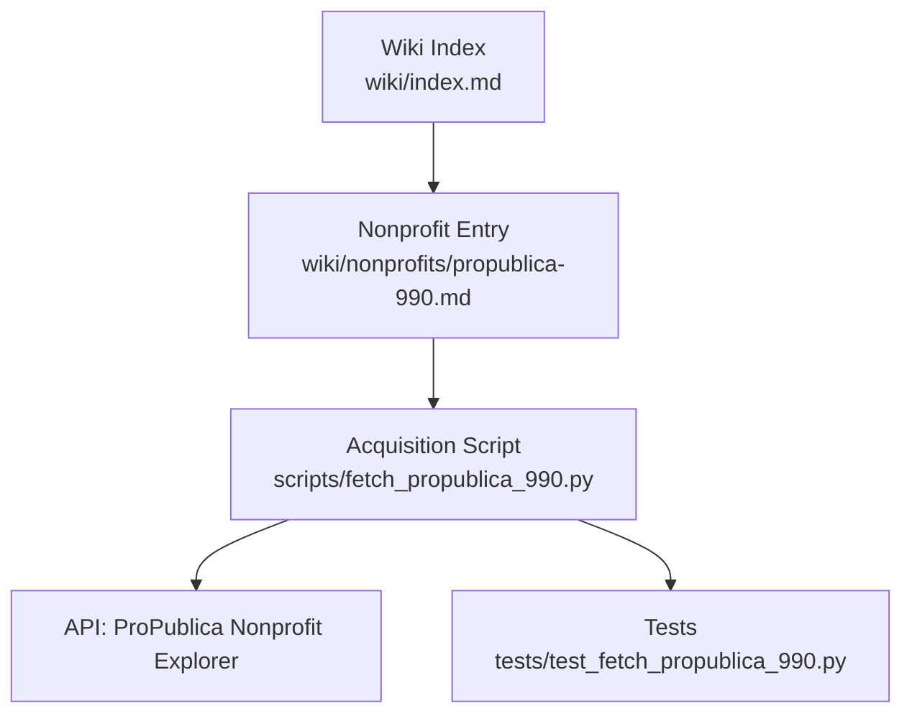
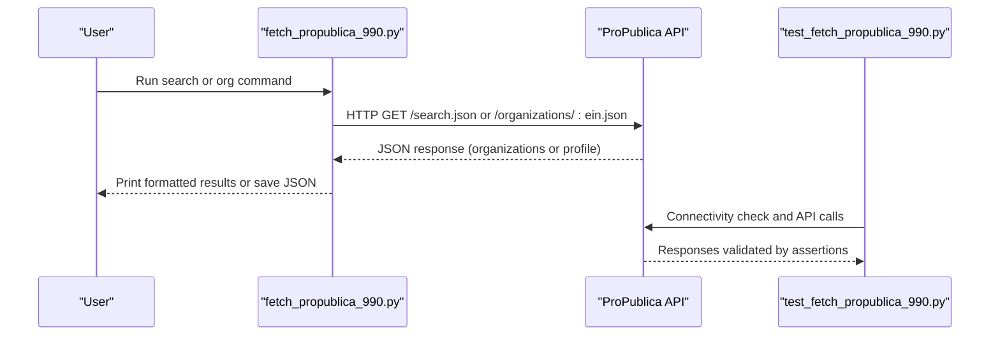
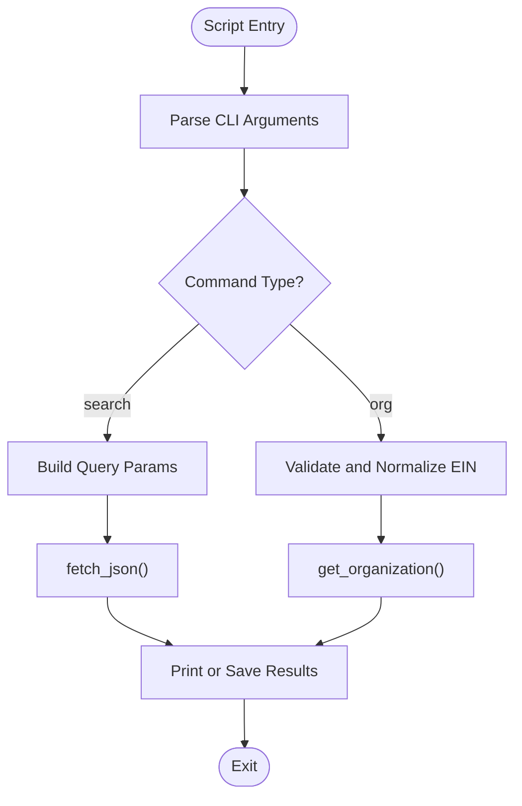
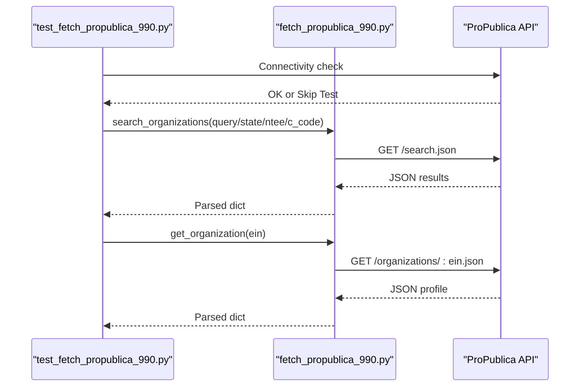
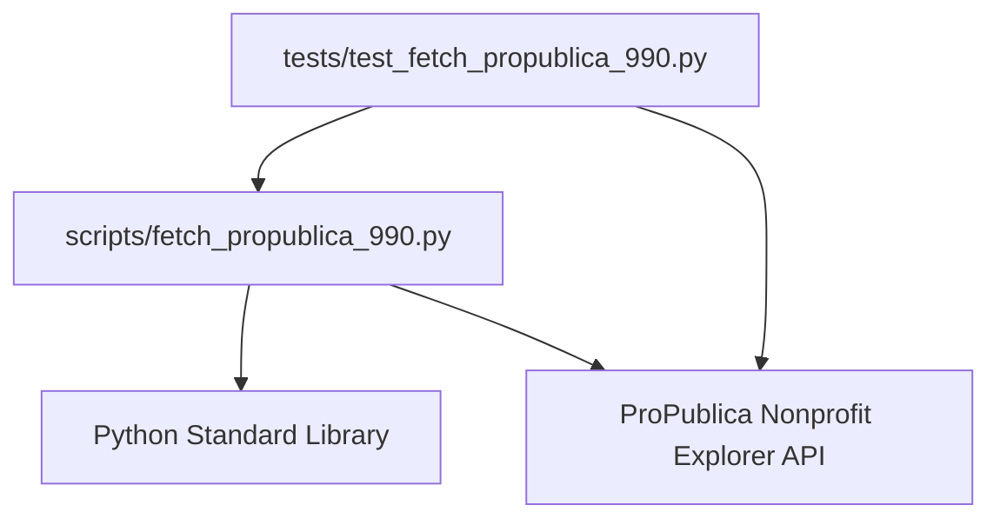

# Nonprofit Sources

<cite>
**Referenced Files in This Document**
- [propublica-990.md](file://wiki/nonprofits/propublica-990.md)
- [fetch_propublica_990.py](file://scripts/fetch_propublica_990.py)
- [test_fetch_propublica_990.py](file://tests/test_fetch_propublica_990.py)
- [index.md](file://wiki/index.md)
- [template.md](file://wiki/template.md)
</cite>

## Table of Contents
1. [Introduction](#introduction)
2. [Project Structure](#project-structure)
3. [Core Components](#core-components)
4. [Architecture Overview](#architecture-overview)
5. [Detailed Component Analysis](#detailed-component-analysis)
6. [Dependency Analysis](#dependency-analysis)
7. [Performance Considerations](#performance-considerations)
8. [Troubleshooting Guide](#troubleshooting-guide)
9. [Conclusion](#conclusion)
10. [Appendices](#appendices)

## Introduction
This document provides comprehensive documentation for nonprofit data sources within the project, focusing on the ProPublica Nonprofit Explorer and IRS Form 990 data. It explains the structure and content of the nonprofit wiki entry, documents the nonprofit schema, tax-exempt status classifications, revenue thresholds, and program activity reporting requirements. It also outlines practical nonprofit analysis workflows, grantmaking pattern identification, and organizational transparency assessment. Guidance is included on data quality issues, Form 990 complexity, nonprofit sector dynamics, detecting potential misconduct, evaluating organizational effectiveness, and understanding nonprofit influence networks.

## Project Structure
The nonprofit data source documentation is organized as a wiki entry with a standardized template. The repository includes:
- A nonprofit wiki entry detailing access methods, schema, coverage, cross-reference potential, data quality, acquisition script, licensing, and references.
- A standalone Python acquisition script for searching organizations and retrieving EIN profiles.
- Tests validating the acquisition script’s behavior against the live API.
- A wiki index linking to the nonprofit source and other datasets.

**Diagram sources**
- [index.md](file://wiki/index.md)
- [propublica-990.md](file://wiki/nonprofits/propublica-990.md)
- [fetch_propublica_990.py](file://scripts/fetch_propublica_990.py)
- [test_fetch_propublica_990.py](file://tests/test_fetch_propublica_990.py)

**Section sources**
- [index.md](file://wiki/index.md)
- [template.md](file://wiki/template.md)

## Core Components
- Nonprofit Explorer wiki entry: Provides summary, access methods, data schema, coverage, cross-reference potential, data quality notes, acquisition script guidance, legal and licensing terms, and references.
- Acquisition script: Implements API search and EIN lookup with robust error handling and CLI support.
- Tests: Validate API connectivity, search filters, pagination, EIN normalization, and error conditions.

**Section sources**
- [propublica-990.md](file://wiki/nonprofits/propublica-990.md)
- [fetch_propublica_990.py](file://scripts/fetch_propublica_990.py)
- [test_fetch_propublica_990.py](file://tests/test_fetch_propublica_990.py)

## Architecture Overview
The nonprofit data pipeline centers on the ProPublica Nonprofit Explorer API. The acquisition script acts as a client, issuing requests and returning structured JSON responses. Tests exercise the script against the live API to ensure reliability.

**Diagram sources**
- [fetch_propublica_990.py](file://scripts/fetch_propublica_990.py)
- [test_fetch_propublica_990.py](file://tests/test_fetch_propublica_990.py)

## Detailed Component Analysis

### Nonprofit Explorer Wiki Entry
The wiki entry consolidates:
- Summary: Purpose, publisher, and investigative value.
- Access Methods: Preferred API base URL, endpoints, parameters, and response format.
- Data Schema: Organization profile fields and filing object fields, including financial line items and additional form-specific fields.
- Coverage: Jurisdiction, time range, update frequency, volume, and organization count with limitations.
- Cross-Reference Potential: Opportunities to join with campaign finance, lobbying, contracts, corporate registries, and private foundation grants.
- Data Quality: Known issues around structured extraction, name/address variations, financial inconsistencies, officer data formatting, NTEE codes, and date formats.
- Acquisition Script: Guidance and usage for the included script.
- Legal & Licensing: Public records basis and ProPublica terms.
- References: Official links and related resources.

**Section sources**
- [propublica-990.md](file://wiki/nonprofits/propublica-990.md)

### Acquisition Script Analysis
The script provides:
- Base URL constant for the API.
- Helper to fetch JSON with user-agent and accept headers.
- Search function supporting keyword, state, NTEE, subsection, and pagination.
- EIN lookup with hyphen normalization and validation.
- Formatted printing for search results and organization profiles.
- Comprehensive CLI with subcommands, arguments, and examples.
- Robust error handling for HTTP, URL, JSON, and value errors.

**Diagram sources**
- [fetch_propublica_990.py](file://scripts/fetch_propublica_990.py)

**Section sources**
- [fetch_propublica_990.py](file://scripts/fetch_propublica_990.py)

### Tests Analysis
The test suite validates:
- Network connectivity to the API.
- Search by keyword, state, NTEE, and subsection.
- Pagination behavior and uniqueness across pages.
- EIN retrieval and normalization.
- Error handling for invalid EIN and unknown organization.
- Response structure and field presence.

**Diagram sources**
- [test_fetch_propublica_990.py](file://tests/test_fetch_propublica_990.py)
- [fetch_propublica_990.py](file://scripts/fetch_propublica_990.py)

**Section sources**
- [test_fetch_propublica_990.py](file://tests/test_fetch_propublica_990.py)

### Practical Analysis Workflows
- Organization discovery and filtering:
  - Use keyword, state, NTEE, and subsection filters to narrow candidates.
  - Iterate pages to expand coverage.
- EIN-based deep dive:
  - Retrieve complete profile and filing history for target organizations.
  - Inspect recent filings for revenue, assets, functional expenses, and program service revenue.
- Cross-referencing workflows:
  - Join with campaign finance data using officer/director names and EIN.
  - Link with lobbying disclosures via Schedule C expenses and registrations.
  - Connect with contracts using Schedule I grant recipients and government agencies.
  - Resolve related organization transactions with corporate registries.
  - Trace private foundation grants to recipient nonprofits and downstream political actors.

**Section sources**
- [propublica-990.md](file://wiki/nonprofits/propublica-990.md)

### Grantmaking Pattern Identification
- Focus on Schedule I grant recipients and Schedule C lobbying expenses.
- Identify recurring grantees and unusual concentrations of funding.
- Correlate grant amounts with lobbying expenditures and policy positions.
- Track changes over time to detect shifts in strategy or influence activities.

**Section sources**
- [propublica-990.md](file://wiki/nonprofits/propublica-990.md)

### Organizational Transparency Assessment
- Evaluate revenue diversification (program service revenue vs. contributions).
- Assess leadership compensation and governance disclosure.
- Monitor asset growth and liability trends.
- Identify missing filings or delays indicative of operational issues.

**Section sources**
- [propublica-990.md](file://wiki/nonprofits/propublica-990.md)

### Data Quality and Complexity
- Structured extraction from XML to JSON with original PDF verification.
- Name variations, address quality, financial inconsistencies, officer data formatting, NTEE categorization, and date formats require careful normalization and fuzzy matching.

**Section sources**
- [propublica-990.md](file://wiki/nonprofits/propublica-990.md)

### Nonprofit Sector Dynamics
- Tax-exempt status classifications (e.g., 501(c)(3) public charities) inform allowable activities and restrictions.
- Revenue thresholds and filing requirements vary by organization size and type.
- Program activity reporting requirements differ by form type and year.

**Section sources**
- [propublica-990.md](file://wiki/nonprofits/propublica-990.md)

### Detecting Potential Misconduct and Evaluating Effectiveness
- Red flags: excessive executive compensation, low program service revenue, high lobbying or political expenditures, lack of financial disclosure, and unusual related organization transactions.
- Effectiveness indicators: consistent revenue growth, transparent governance, adequate program service revenue, and timely filing history.

**Section sources**
- [propublica-990.md](file://wiki/nonprofits/propublica-990.md)

### Understanding Influence Networks
- Map connections between nonprofits, foundations, corporations, and political actors using shared identifiers (EIN), names, and addresses.
- Track grantmaking and lobbying activities to reveal coordinated efforts.

**Section sources**
- [propublica-990.md](file://wiki/nonprofits/propublica-990.md)

## Dependency Analysis
The acquisition script depends on:
- Standard library modules for HTTP requests, JSON parsing, argument parsing, and URL encoding.
- The ProPublica API for data retrieval.
- Tests depend on the script module and the API for validation.

**Diagram sources**
- [fetch_propublica_990.py](file://scripts/fetch_propublica_990.py)
- [test_fetch_propublica_990.py](file://tests/test_fetch_propublica_990.py)

**Section sources**
- [fetch_propublica_990.py](file://scripts/fetch_propublica_990.py)
- [test_fetch_propublica_990.py](file://tests/test_fetch_propublica_990.py)

## Performance Considerations
- API response size and pagination: Results are paginated; use page indexing to manage large result sets.
- Network timeouts: Configure appropriate timeouts for reliable operation.
- Batch processing: For large-scale analysis, implement controlled concurrency and retry logic.
- Data caching: Cache repeated lookups to reduce API load and improve turnaround.

[No sources needed since this section provides general guidance]

## Troubleshooting Guide
Common issues and resolutions:
- Network errors: Verify connectivity and retry with backoff.
- HTTP errors: Check status codes and adjust parameters.
- JSON decode errors: Validate response format and handle malformed payloads.
- Invalid EIN: Ensure 9-digit numeric format; script supports hyphenated input.
- Unknown organization: API returns a stub profile; confirm EIN accuracy.
- Pagination anomalies: Confirm page indices and result counts.

**Section sources**
- [fetch_propublica_990.py](file://scripts/fetch_propublica_990.py)
- [test_fetch_propublica_990.py](file://tests/test_fetch_propublica_990.py)

## Conclusion
The ProPublica Nonprofit Explorer and the associated acquisition script provide a robust foundation for nonprofit data analysis. By leveraging the documented schema, filters, and cross-references, analysts can investigate finances, track grantmaking patterns, assess transparency, and uncover influence networks. Adhering to the data quality guidelines and using the provided script and tests ensures reliable, reproducible research outcomes.

[No sources needed since this section summarizes without analyzing specific files]

## Appendices

### Nonprofit Schema Overview
- Organization profile fields include EIN, name, mailing address, IRS subsection code, NTEE code, and filings array.
- Filing object fields include tax period, form type, PDF URL, financial totals, and governance compensation percentages.

**Section sources**
- [propublica-990.md](file://wiki/nonprofits/propublica-990.md)

### Access Methods and Endpoints
- Preferred API base URL and endpoints for search and organization retrieval.
- Supported parameters: keyword, state, NTEE, subsection, and pagination.

**Section sources**
- [propublica-990.md](file://wiki/nonprofits/propublica-990.md)

### Acquisition Script Usage
- Search organizations by keyword, state, NTEE, or subsection.
- Retrieve a single organization by EIN with full filing history.
- Save JSON output to file or print formatted results.

**Section sources**
- [fetch_propublica_990.py](file://scripts/fetch_propublica_990.py)