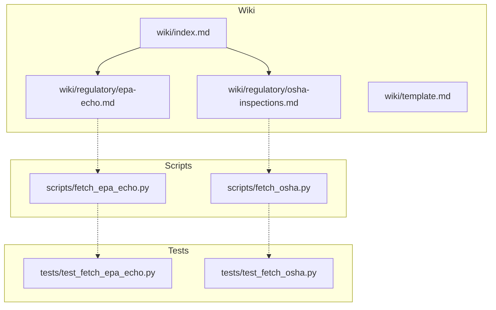
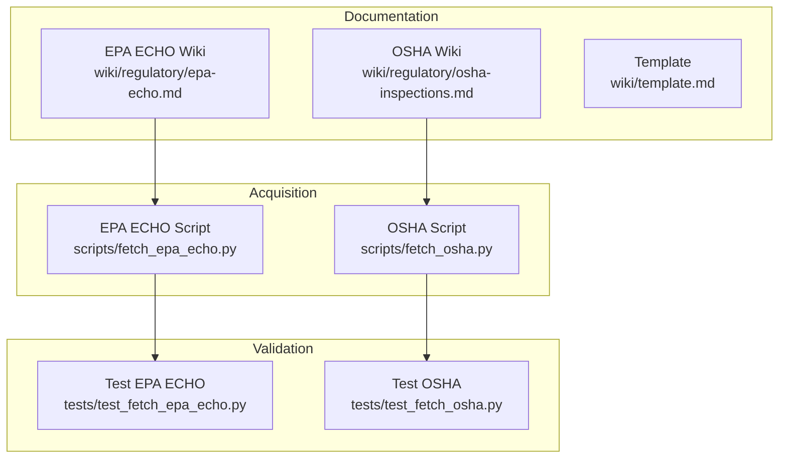
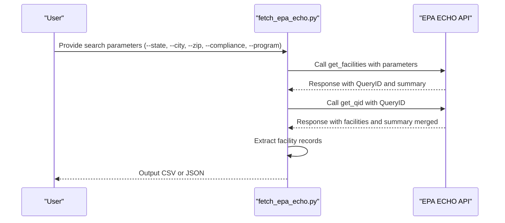
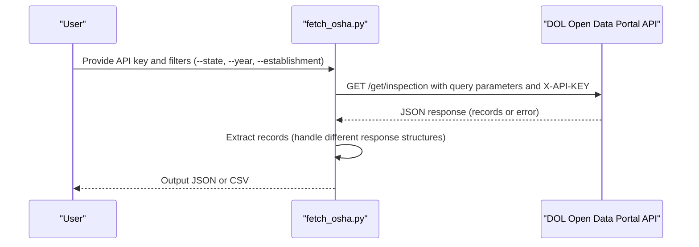
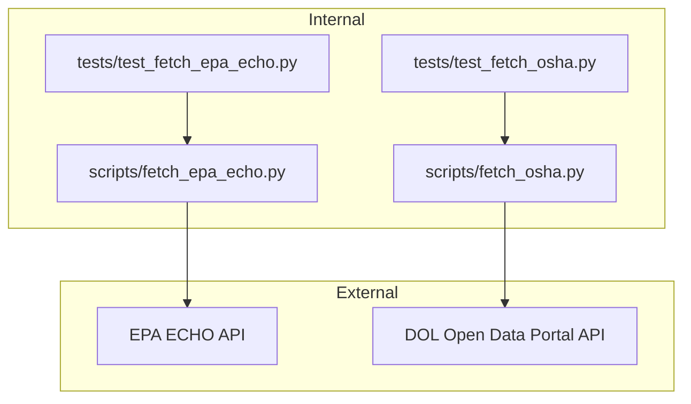

# Regulatory & Enforcement Sources

<cite>
**Referenced Files in This Document**
- [epa-echo.md](file://wiki/regulatory/epa-echo.md)
- [osha-inspections.md](file://wiki/regulatory/osha-inspections.md)
- [fetch_epa_echo.py](file://scripts/fetch_epa_echo.py)
- [fetch_osha.py](file://scripts/fetch_osha.py)
- [test_fetch_epa_echo.py](file://tests/test_fetch_epa_echo.py)
- [test_fetch_osha.py](file://tests/test_fetch_osha.py)
- [index.md](file://wiki/index.md)
- [template.md](file://wiki/template.md)
- [README.md](file://README.md)
</cite>

## Table of Contents
1. [Introduction](#introduction)
2. [Project Structure](#project-structure)
3. [Core Components](#core-components)
4. [Architecture Overview](#architecture-overview)
5. [Detailed Component Analysis](#detailed-component-analysis)
6. [Dependency Analysis](#dependency-analysis)
7. [Performance Considerations](#performance-considerations)
8. [Troubleshooting Guide](#troubleshooting-guide)
9. [Conclusion](#conclusion)
10. [Appendices](#appendices)

## Introduction
This document provides comprehensive documentation for regulatory and enforcement data sources within the OpenPlanter project, focusing on environmental and labor compliance data. It explains the structure and content of the EPA ECHO and OSHA inspection datasets, details schemas and data models, outlines acquisition workflows, and provides practical guidance for regulatory analysis, enforcement pattern identification, and compliance risk assessment. It also addresses data timeliness, geographic coverage, quality considerations, and enforcement discretion factors, and offers guidance on detecting violations, evaluating enforcement effectiveness, and interpreting compliance culture indicators.

## Project Structure
OpenPlanter organizes regulatory and enforcement sources in a dedicated wiki with standardized templates. The relevant sources are documented in:
- EPA ECHO (Enforcement and Compliance History Online)
- OSHA Inspection Data

These entries include access methods, schemas, coverage, cross-reference potential, data quality notes, acquisition scripts, legal and licensing information, and references.

**Diagram sources**
- [index.md:47-52](file://wiki/index.md#L47-L52)
- [epa-echo.md:1-137](file://wiki/regulatory/epa-echo.md#L1-L137)
- [osha-inspections.md:1-212](file://wiki/regulatory/osha-inspections.md#L1-L212)
- [fetch_epa_echo.py:1-290](file://scripts/fetch_epa_echo.py#L1-L290)
- [fetch_osha.py:1-318](file://scripts/fetch_osha.py#L1-L318)
- [test_fetch_epa_echo.py:1-296](file://tests/test_fetch_epa_echo.py#L1-L296)
- [test_fetch_osha.py:1-299](file://tests/test_fetch_osha.py#L1-L299)

**Section sources**
- [index.md:47-52](file://wiki/index.md#L47-L52)
- [README.md:375-407](file://README.md#L375-L407)

## Core Components
- EPA ECHO (Enforcement and Compliance History Online)
  - Provides integrated compliance and enforcement information for over 1 million regulated facilities nationwide across major environmental statutes (Clean Air Act, Clean Water Act, RCRA, SDWA) and Toxics Release Inventory (TRI).
  - Access methods include REST API (preferred), bulk downloads, and web interface.
  - Data schema covers facility records, enforcement case records, and geographic clustering.
  - Coverage spans all 50 states and territories, with varying time ranges by program; update frequency is near real-time for API and periodic for bulk downloads.
  - Cross-reference potential includes campaign finance, corporate registries, government contracts, lobbying disclosures, TRI, and Superfund sites.
  - Data quality considerations include inconsistent facility names, delayed enforcement data, missing penalties, multiple IDs per facility, quarterly compliance history encoding, geocoding accuracy, and duplicate records.

- OSHA Inspection Data
  - Publishes comprehensive enforcement data covering approximately 90,000 annual workplace inspections, including inspection metadata, violation citations, penalty assessments, accident investigations, and strategic enforcement program codes.
  - Access methods include DOL Open Data Portal API (requires free API key), bulk download, and legacy interfaces.
  - Data schema includes inspection, violation, accident, and strategic codes tables.
  - Coverage spans all 50 states and territories, with a time range from 1970-present; daily updates to the enforcement data catalog with near real-time API data.
  - Cross-reference potential includes corporate registries, government contracts, business permits, campaign finance, workers’ compensation claims, and EPA enforcement.
  - Data quality considerations include inconsistent employer names, missing geographic data, penalty adjustments, state plan variations, deleted records, case closure lag, industry code accuracy, and date formats.

**Section sources**
- [epa-echo.md:1-137](file://wiki/regulatory/epa-echo.md#L1-L137)
- [osha-inspections.md:1-212](file://wiki/regulatory/osha-inspections.md#L1-L212)

## Architecture Overview
The regulatory data ecosystem integrates wiki documentation, acquisition scripts, and tests to support reproducible data workflows. The scripts encapsulate API interactions and output formatting, while tests validate argument parsing, response extraction, and basic data integrity. The wiki serves as the authoritative source for schema, coverage, and cross-reference guidance.

**Diagram sources**
- [epa-echo.md:1-137](file://wiki/regulatory/epa-echo.md#L1-L137)
- [osha-inspections.md:1-212](file://wiki/regulatory/osha-inspections.md#L1-L212)
- [template.md:1-41](file://wiki/template.md#L1-L41)
- [fetch_epa_echo.py:1-290](file://scripts/fetch_epa_echo.py#L1-L290)
- [fetch_osha.py:1-318](file://scripts/fetch_osha.py#L1-L318)
- [test_fetch_epa_echo.py:1-296](file://tests/test_fetch_epa_echo.py#L1-L296)
- [test_fetch_osha.py:1-299](file://tests/test_fetch_osha.py#L1-L299)

## Detailed Component Analysis

### EPA ECHO Data Source
- Purpose and scope
  - Aggregates inspection, violation, enforcement action, and penalty data across major environmental statutes and TRI.
  - Supports investigation of corporate environmental compliance patterns, enforcement gaps, and regulatory capture.

- Access methods
  - REST API (preferred): JSON/XML/JSONP endpoints via HTTPS, no authentication required.
  - Bulk downloads: Periodic compressed ZIP files for ICIS-Air, ICIS-NPDES, RCRAInfo, and other program-specific datasets.
  - Web interface: JavaScript-based search tool, no API key required.
  - Enforcement case API: Separate endpoints for civil and criminal case searches.

- Recommended workflow
  - Use get_facilities to validate query and obtain a QueryID.
  - Use get_qid with the QueryID to paginate through facility arrays (max 1,000 records/page).
  - Use get_download to generate CSV exports for large result sets.

- Data schema highlights
  - Results object: QueryID, FacilityInfo, Summary, ClusterInfo.
  - Facility record fields: RegistryID, FacilityName, address fields, coordinates, program-specific IDs (AIRIDs, NPDESIDs, RCRAIDs, SDWISIDs), major facility designation, compliance statuses by statute, 3-year quarterly compliance history, enforcement action counts, inspections over 5 years, significant noncompliance and high priority violator status, penalties over 5 years, NAICS/SIC codes.

- Enforcement case schema highlights
  - CaseNumber, CaseName, CaseType (CI/civil or CR/criminal), LeadAgency, FiledDate, SettlementDate, TotalFederalPenalty, ViolationDescription, ProgramCodes.

- Coverage and timeliness
  - Jurisdiction: United States (all 50 states, territories).
  - Time range: Varies by program; CAA/CWA data generally available from early 2000s; enforcement case data from 1970s for major cases.
  - Update frequency: API near real-time; bulk downloads quarterly or monthly depending on dataset.

- Cross-reference potential
  - Campaign finance data (OCPF, FEC): Match company names and corporate officers from violating facilities to political contributions using fuzzy matching and industry codes.
  - Corporate registries: Resolve facility owners and parent corporations to officers, registered agents, and subsidiaries.
  - Government contracts (USASpending, city procurement): Identify contractors with poor environmental compliance records by joining on company name and address.
  - Lobbying disclosures: Cross-reference violators and penalized entities with lobbying expenditures.
  - TRI and Superfund sites: Link facilities to toxic release quantities and hazardous waste cleanup responsibilities.

- Data quality considerations
  - Inconsistent facility names requiring fuzzy matching.
  - Address standardization issues and delayed enforcement data.
  - Missing penalty amounts and multiple IDs per facility.
  - Quarterly compliance history encoded as strings requiring decoding.
  - Geocoding accuracy varies; duplicate records may exist.

- Acquisition script
  - See scripts/fetch_epa_echo.py for a Python script using stdlib to query the ECHO API for facility data, supporting geographic search, state filtering, compliance status filtering, and CSV export.

- Legal and licensing
  - ECHO data is public information provided under FOIA and EPA’s open data policy; no restrictions on redistribution, analysis, or derived works.
  - Disclaimer: Compliance data reflects self-reported information and inspection records; data quality depends on reporting accuracy and timeliness.

**Diagram sources**
- [fetch_epa_echo.py:88-124](file://scripts/fetch_epa_echo.py#L88-L124)
- [epa-echo.md:23-27](file://wiki/regulatory/epa-echo.md#L23-L27)

**Section sources**
- [epa-echo.md:1-137](file://wiki/regulatory/epa-echo.md#L1-L137)
- [fetch_epa_echo.py:1-290](file://scripts/fetch_epa_echo.py#L1-L290)
- [test_fetch_epa_echo.py:1-296](file://tests/test_fetch_epa_echo.py#L1-L296)

### OSHA Inspection Data Source
- Purpose and scope
  - Comprehensive enforcement data covering approximately 90,000 annual workplace inspections, including inspection metadata, violation citations, penalty assessments, accident investigations, and strategic enforcement program codes.

- Access methods
  - DOL Open Data Portal API (preferred): Requires a free API key via X-API-KEY header.
  - Key endpoints: inspection, violation, accident, strategic_codes.
  - Query parameters: top, skip, filter, fields, sort_by, sort.
  - Response format: JSON (default), XML available via suffix.
  - Bulk download: Daily updates to enforcement data catalog; legacy interface being phased out.

- Data schema highlights
  - Inspection table (osha_inspection): Unique inspection identifier, reporting area, state/federal jurisdiction, establishment name, site address, NAICS/SIC codes, owner type, inspection type/scope, union status, industry flags, employee counts, dates (open, case modification, closing conference, close case).
  - Violation table (osha_violation): Links to inspection via activity_nr, citation identifiers, delete flags, standard violated, violation type (Serious, Willful, Repeat, Other), issuance and abatement dates, current and initial penalties, final order date, instances and exposed employees, rec category, gravity rating, emphasis program flag, hazard category and substance codes.
  - Accident table (osha_accident): Unique accident summary identifier, links to inspection, event date and description, keywords, inspection type triggered, injuries and fatalities, hospitalizations, severity classification.
  - Strategic codes table (osha_strategic_codes): Links inspections to national/local emphasis programs (NEP, LEP).

- Coverage and timeliness
  - Jurisdiction: United States (all 50 states + territories), including federal OSHA and state plan jurisdictions.
  - Time range: 1970-present; complete digital records from ~1980 forward.
  - Update frequency: Daily updates to enforcement data catalog; API reflects near real-time data (typically 24–48 hour lag).

- Cross-reference potential
  - Corporate registries: Match establishment name to business entity records to identify corporate officers, parent companies, and DBAs.
  - Government contracts: Cross-reference establishment name against municipal/state/federal contractor databases.
  - Business permits and licenses: Join on site address and establishment name to correlate safety violations with permits and licenses.
  - Campaign finance: Match corporate donors and contributor employers to inspection histories and penalty assessments.
  - Workers’ compensation claims: Link activity numbers and accident dates to state workers’ comp databases.
  - EPA enforcement: Cross-reference NAICS code and site address with EPA violation data for environmental and occupational health overlaps.

- Data quality considerations
  - Inconsistent employer names requiring entity resolution.
  - Missing geographic data for mobile worksites; geocoding success rate ~85–90%.
  - Penalty adjustments over time; use current_penalty for financial analysis.
  - State plan variations affecting citation types, penalty structures, and completeness.
  - Deleted records (vacated or contested citations); always filter for active citations.
  - Case closure lag for open inspections pending litigation or abatement verification.
  - Industry codes self-reported by employers may be misclassified; verify critical filters manually.
  - Date formats are ISO 8601; null dates appear as empty fields.

- Acquisition script
  - See scripts/fetch_osha.py for a Python stdlib implementation using urllib.request to query the DOL inspection endpoint with optional filters (state, date range, establishment name) and outputs JSON or CSV.

- Legal and licensing
  - Public domain: OSHA enforcement data is published under 29 CFR § 1904 and considered public information under FOIA; no restrictions on redistribution or derived works.
  - Privacy: PII such as worker names, SSNs, and medical details are redacted per FOIA Exemption 6; only establishment-level data is published.
  - Citation contests: Employers may contest citations through OSHRC; contested citations appear with final_order_date = NULL until adjudication.
  - Terms of use: The DOL Open Data Portal does not impose licensing restrictions; standard attribution to “U.S. Department of Labor, OSHA Enforcement Database” is recommended.

**Diagram sources**
- [fetch_osha.py:80-142](file://scripts/fetch_osha.py#L80-L142)
- [osha-inspections.md:18-37](file://wiki/regulatory/osha-inspections.md#L18-L37)

**Section sources**
- [osha-inspections.md:1-212](file://wiki/regulatory/osha-inspections.md#L1-L212)
- [fetch_osha.py:1-318](file://scripts/fetch_osha.py#L1-L318)
- [test_fetch_osha.py:1-299](file://tests/test_fetch_osha.py#L1-L299)

### Practical Regulatory Analysis Workflows
- Environmental compliance analysis using EPA ECHO
  - Define search scope: state, city, ZIP code, radius, compliance status (e.g., Significant Noncompliance), major facilities only, program filters (e.g., NPDES).
  - Execute two-step API workflow: validate query and obtain QueryID, then paginate results and merge summary statistics.
  - Export CSV for downstream analysis; leverage cross-references to campaign finance, corporate registries, and government contracts.
  - Evaluate trends: track penalties over 5 years, formal and informal enforcement actions, and 3-year quarterly compliance history.

- Labor compliance analysis using OSHA
  - Obtain API key and define filters: state, year, establishment name, open-after date.
  - Query inspection endpoint with pagination and selective fields; handle different response structures.
  - Enrich with violation and accident tables; assess penalties, gravity ratings, emphasis program flags, and failure-to-abate penalties.
  - Cross-reference with corporate registries, contracts, permits, and campaign finance to identify systemic safety issues.

- Enforcement pattern identification
  - Use quarterly compliance history from EPA ECHO to identify recurring violations and persistent noncompliance.
  - Track OSHA violation types (Serious, Willful, Repeat) and penalties to uncover enforcement discretion patterns and industry-specific risks.
  - Correlate environmental and safety violations to detect organizations with weak compliance cultures.

- Compliance risk assessment
  - Combine facility-level penalties, enforcement actions, and inspection counts from EPA ECHO.
  - Incorporate OSHA violation severity, gravity ratings, and repeated violations to quantify risk.
  - Integrate cross-references to contracts, permits, and political contributions to evaluate governance and oversight risks.

- Detecting regulatory violations
  - EPA ECHO: Monitor significant noncompliance and high-priority violator status; review enforcement case data for civil and criminal penalties.
  - OSHA: Focus on Serious and Willful violations, repeat violations, and failure-to-abate penalties; investigate accident-triggered inspections.

- Evaluating enforcement effectiveness
  - Compare penalties to violation severity and gravity; track settlement dates and final orders.
  - Assess state plan differences and enforcement program emphasis to understand regional variations.
  - Monitor case closure lag and contested citations to gauge administrative and legal outcomes.

- Understanding compliance culture indicators
  - Repeated violations and failure-to-abate patterns suggest inadequate corrective actions.
  - High penalties and frequent enforcement actions indicate weak compliance systems.
  - Cross-references to contracts and permits reveal whether violators continue to receive public business.

**Section sources**
- [epa-echo.md:34-111](file://wiki/regulatory/epa-echo.md#L34-L111)
- [osha-inspections.md:43-178](file://wiki/regulatory/osha-inspections.md#L43-L178)
- [fetch_epa_echo.py:192-290](file://scripts/fetch_epa_echo.py#L192-L290)
- [fetch_osha.py:167-318](file://scripts/fetch_osha.py#L167-L318)

## Dependency Analysis
The regulatory data sources depend on external APIs and publishers, with internal scripts and tests providing acquisition and validation layers.

**Diagram sources**
- [fetch_epa_echo.py:25-86](file://scripts/fetch_epa_echo.py#L25-L86)
- [fetch_osha.py:27-142](file://scripts/fetch_osha.py#L27-L142)
- [test_fetch_epa_echo.py:17-20](file://tests/test_fetch_epa_echo.py#L17-L20)
- [test_fetch_osha.py:16-20](file://tests/test_fetch_osha.py#L16-L20)

**Section sources**
- [fetch_epa_echo.py:1-290](file://scripts/fetch_epa_echo.py#L1-L290)
- [fetch_osha.py:1-318](file://scripts/fetch_osha.py#L1-L318)
- [test_fetch_epa_echo.py:1-296](file://tests/test_fetch_epa_echo.py#L1-L296)
- [test_fetch_osha.py:1-299](file://tests/test_fetch_osha.py#L1-L299)

## Performance Considerations
- EPA ECHO
  - Two-step API workflow: get_facilities followed by get_qid to manage result pagination efficiently.
  - Use get_download for large result sets to avoid repeated paginated queries.
  - Respect rate limits and timeouts; handle network errors gracefully.

- OSHA
  - API key required; ensure proper header usage and error handling for HTTP 401 and 400 responses.
  - Pagination enforced at 200 per request; use skip parameter for incremental fetching.
  - Response structures vary; normalize records across different response keys.

- General
  - Validate arguments and enforce limits (e.g., radius, limit) to prevent excessive resource usage.
  - Prefer CSV export for large datasets to reduce memory overhead.

[No sources needed since this section provides general guidance]

## Troubleshooting Guide
- EPA ECHO
  - Network and HTTP errors: The script catches urllib HTTPError and URLError, prints diagnostic messages, and exits with non-zero status.
  - JSON decode errors: The script handles JSONDecodeError and exits with diagnostic output.
  - Argument validation: The script validates radius and limit constraints and raises parser errors for invalid combinations.

- OSHA
  - Missing API key: The script requires DOL_API_KEY via flag or environment variable; exits with error if absent.
  - Authentication failures: HTTP 401 indicates invalid API key; check registration and key validity.
  - Bad requests: HTTP 400 suggests filter syntax issues; verify filter JSON structure.
  - Live tests: Tests skip when DOL_API_KEY is not set; ensure environment variable is configured for live API tests.

- Validation
  - Unit tests cover parameter building, response extraction, CSV/JSON writing, and summary printing for EPA ECHO.
  - Unit tests cover filter building, CSV formatting, and response normalization for OSHA.

**Section sources**
- [fetch_epa_echo.py:67-86](file://scripts/fetch_epa_echo.py#L67-L86)
- [fetch_osha.py:124-142](file://scripts/fetch_osha.py#L124-L142)
- [test_fetch_epa_echo.py:125-176](file://tests/test_fetch_epa_echo.py#L125-L176)
- [test_fetch_osha.py:135-194](file://tests/test_fetch_osha.py#L135-L194)

## Conclusion
OpenPlanter’s regulatory and enforcement data sources provide robust, standardized documentation and acquisition scripts for EPA ECHO and OSHA inspection data. The wiki documents cover access methods, schemas, coverage, cross-reference potential, and data quality considerations. Scripts and tests enable reproducible workflows for acquiring and validating data, facilitating regulatory analysis, enforcement pattern identification, and compliance risk assessment. By leveraging these resources, analysts can detect violations, evaluate enforcement effectiveness, and understand compliance culture indicators across environmental and labor domains.

[No sources needed since this section summarizes without analyzing specific files]

## Appendices
- Cross-reference keys and join strategies
  - EPA ECHO: Facility name (fuzzy matching), address, NAICS/SIC codes, FRS Registry ID, latitude/longitude.
  - OSHA: Establishment name (fuzzy matching), site address, NAICS/SIC codes, industry filters.

- Legal and licensing references
  - EPA ECHO: Public information under FOIA and EPA open data policy; no restrictions on redistribution.
  - OSHA: Public domain under FOIA; privacy protections for PII; standard attribution recommended.

**Section sources**
- [epa-echo.md:121-126](file://wiki/regulatory/epa-echo.md#L121-L126)
- [osha-inspections.md:190-198](file://wiki/regulatory/osha-inspections.md#L190-L198)