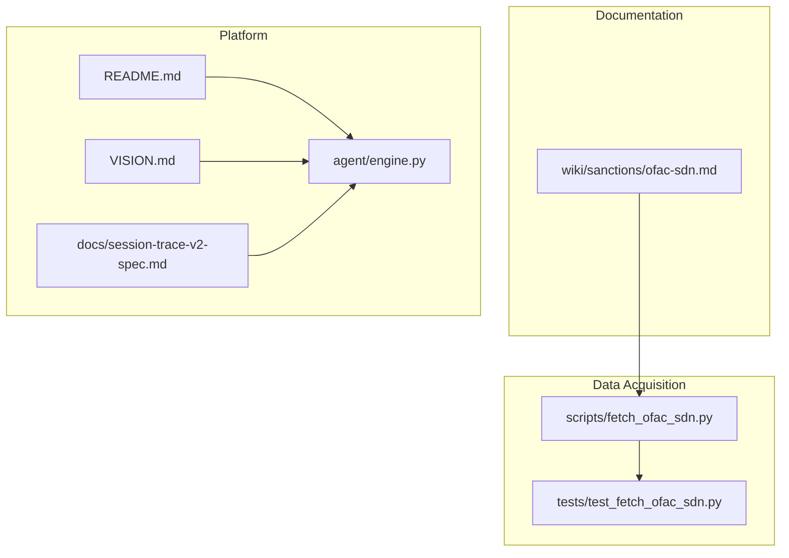
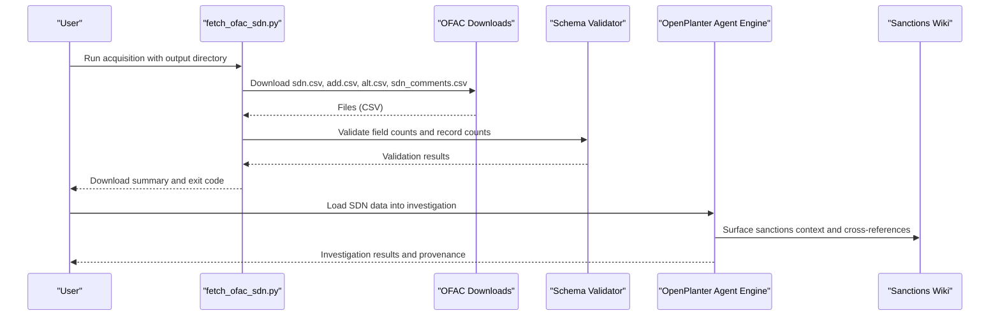
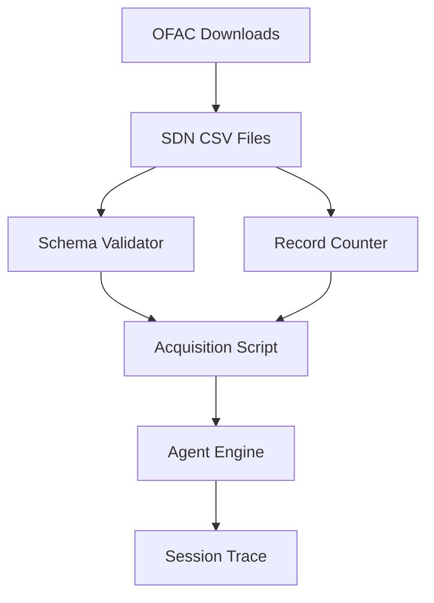

# Sanctions Lists Sources

<cite>
**Referenced Files in This Document**
- [ofac-sdn.md](file://wiki/sanctions/ofac-sdn.md)
- [fetch_ofac_sdn.py](file://scripts/fetch_ofac_sdn.py)
- [test_fetch_ofac_sdn.py](file://tests/test_fetch_ofac_sdn.py)
- [README.md](file://README.md)
- [VISION.md](file://VISION.md)
- [session-trace-v2-spec.md](file://docs/session-trace-v2-spec.md)
- [engine.py](file://agent/engine.py)
</cite>

## Table of Contents
1. [Introduction](#introduction)
2. [Project Structure](#project-structure)
3. [Core Components](#core-components)
4. [Architecture Overview](#architecture-overview)
5. [Detailed Component Analysis](#detailed-component-analysis)
6. [Dependency Analysis](#dependency-analysis)
7. [Performance Considerations](#performance-considerations)
8. [Troubleshooting Guide](#troubleshooting-guide)
9. [Conclusion](#conclusion)
10. [Appendices](#appendices)

## Introduction
This document provides comprehensive guidance for understanding and working with sanctions list data sources, with a focus on the Office of Foreign Assets Control (OFAC) Specially Designated Nationals (SDN) List. It explains the structure and content of OFAC SDN list wiki entries, documents the SDN schema and entity classification systems, outlines secondary sanctions considerations and geographic scope limitations, and provides practical examples for sanctions screening workflows, debarment detection, and transaction risk assessment. It also covers data refresh cycles, legal interpretations, compliance obligations, and offers guidance on understanding sanctions evasion tactics, evaluating exposure risks, and implementing effective screening programs.

## Project Structure
The repository organizes sanctions-related information and tooling as follows:
- Wiki documentation: A dedicated wiki entry describes the OFAC SDN List, including access methods, schema, coverage, cross-reference potential, data quality, and legal licensing.
- Data acquisition script: A Python script automates downloading the SDN CSV files and validating their schema.
- Tests: Unit tests validate the acquisition script’s behavior and network accessibility.
- Agent and platform: The broader OpenPlanter platform supports investigation workflows, session tracing, and AI-driven analysis that can incorporate sanctions data.

**Diagram sources**
- [ofac-sdn.md:1-143](file://wiki/sanctions/ofac-sdn.md#L1-L143)
- [fetch_ofac_sdn.py:1-284](file://scripts/fetch_ofac_sdn.py#L1-L284)
- [test_fetch_ofac_sdn.py:1-200](file://tests/test_fetch_ofac_sdn.py#L1-L200)
- [README.md:1-449](file://README.md#L1-L449)
- [VISION.md:1-729](file://VISION.md#L1-L729)
- [session-trace-v2-spec.md:1-1114](file://docs/session-trace-v2-spec.md#L1-L1114)
- [engine.py:1-2192](file://agent/engine.py#L1-L2192)

**Section sources**
- [ofac-sdn.md:1-143](file://wiki/sanctions/ofac-sdn.md#L1-L143)
- [fetch_ofac_sdn.py:1-284](file://scripts/fetch_ofac_sdn.py#L1-L284)
- [test_fetch_ofac_sdn.py:1-200](file://tests/test_fetch_ofac_sdn.py#L1-L200)
- [README.md:1-449](file://README.md#L1-L449)
- [VISION.md:1-729](file://VISION.md#L1-L729)
- [session-trace-v2-spec.md:1-1114](file://docs/session-trace-v2-spec.md#L1-L1114)
- [engine.py:1-2192](file://agent/engine.py#L1-L2192)

## Core Components
- OFAC SDN List wiki entry: Describes access methods, schema, coverage, cross-reference potential, data quality, and legal licensing.
- Acquisition script: Downloads SDN CSV files and validates schema and record counts.
- Tests: Validate network accessibility, schema validation, and record counting.
- Platform integration: The agent engine and session tracing support end-to-end investigation workflows that can incorporate sanctions screening.

Key responsibilities:
- Data ingestion and validation for SDN data.
- Cross-referencing SDN entities with other datasets (e.g., corporate registries, campaign finance, procurement).
- Compliance and legal obligations around blocking transactions and export control.

**Section sources**
- [ofac-sdn.md:1-143](file://wiki/sanctions/ofac-sdn.md#L1-L143)
- [fetch_ofac_sdn.py:170-211](file://scripts/fetch_ofac_sdn.py#L170-L211)
- [test_fetch_ofac_sdn.py:56-125](file://tests/test_fetch_ofac_sdn.py#L56-L125)
- [README.md:25-31](file://README.md#L25-L31)
- [engine.py:586-628](file://agent/engine.py#L586-L628)

## Architecture Overview
The sanctions data workflow integrates documentation, acquisition, validation, and platform-level investigation:

**Diagram sources**
- [fetch_ofac_sdn.py:170-211](file://scripts/fetch_ofac_sdn.py#L170-L211)
- [test_fetch_ofac_sdn.py:93-125](file://tests/test_fetch_ofac_sdn.py#L93-L125)
- [engine.py:586-628](file://agent/engine.py#L586-L628)
- [ofac-sdn.md:122-124](file://wiki/sanctions/ofac-sdn.md#L122-L124)

## Detailed Component Analysis

### OFAC SDN List Wiki Entry
The wiki entry documents:
- Purpose and scope: Primary U.S. Treasury sanctions database for individuals, entities, and vessels.
- Access methods: Bulk download (CSV, fixed-field, XML, PDF), web interface, and API.
- Data schema: Relational schema with ent_num as the primary key; CSV files without headers; field positions documented.
- Coverage: Global jurisdiction, 1995–present, variable update frequency, large volume.
- Cross-reference potential: Corporate registries, campaign finance, procurement, real estate, business licenses.
- Data quality: UTF-8 CSV, no header row, extensive aliases, address granularity varies, date formats vary, entity disambiguation without unique identifiers, frequent updates tracked via delta files.
- Legal and licensing: Public domain; legal obligations to block transactions; export control restrictions.

Practical implications:
- Always download all four CSV files and join on ent_num for completeness.
- Expect fuzzy matching for names due to transliterations and aliases.
- Validate schema and record counts after download.

**Section sources**
- [ofac-sdn.md:3-31](file://wiki/sanctions/ofac-sdn.md#L3-L31)
- [ofac-sdn.md:33-88](file://wiki/sanctions/ofac-sdn.md#L33-L88)
- [ofac-sdn.md:90-121](file://wiki/sanctions/ofac-sdn.md#L90-L121)
- [ofac-sdn.md:126-133](file://wiki/sanctions/ofac-sdn.md#L126-L133)

### Acquisition Script
The acquisition script:
- Defines the base URL and file configurations for SDN CSV files.
- Implements download_file with user-agent headers to avoid 403 errors.
- Validates CSV schema by checking field counts (CSVs have no header row).
- Counts records in CSV files (no header to exclude).
- Supports quiet mode, validation toggle, and prints a summary with success counts.

Operational notes:
- Creates output directories if needed.
- Exits with non-zero status if any file fails to download or validate.
- Provides a CLI with examples and file descriptions.

**Section sources**
- [fetch_ofac_sdn.py:27-53](file://scripts/fetch_ofac_sdn.py#L27-L53)
- [fetch_ofac_sdn.py:56-99](file://scripts/fetch_ofac_sdn.py#L56-L99)
- [fetch_ofac_sdn.py:101-140](file://scripts/fetch_ofac_sdn.py#L101-L140)
- [fetch_ofac_sdn.py:142-168](file://scripts/fetch_ofac_sdn.py#L142-L168)
- [fetch_ofac_sdn.py:170-211](file://scripts/fetch_ofac_sdn.py#L170-L211)
- [fetch_ofac_sdn.py:213-284](file://scripts/fetch_ofac_sdn.py#L213-L284)

### Tests for Acquisition Script
The tests:
- Verify the FILES configuration and expected fields.
- Confirm BASE_URL formatting.
- Check endpoint accessibility via HEAD request.
- Validate download of the primary SDN CSV file and basic content checks.
- Validate CSV schema validation and record counting functions.
- Ensure output directory creation behavior.

These tests ensure the acquisition script behaves correctly and can be run in CI environments.

**Section sources**
- [test_fetch_ofac_sdn.py:26-88](file://tests/test_fetch_ofac_sdn.py#L26-L88)
- [test_fetch_ofac_sdn.py:93-125](file://tests/test_fetch_ofac_sdn.py#L93-L125)
- [test_fetch_ofac_sdn.py:126-156](file://tests/test_fetch_ofac_sdn.py#L126-L156)
- [test_fetch_ofac_sdn.py:157-170](file://tests/test_fetch_ofac_sdn.py#L157-L170)
- [test_fetch_ofac_sdn.py:171-196](file://tests/test_fetch_ofac_sdn.py#L171-L196)

### Platform Integration and Investigation Workflows
OpenPlanter’s agent engine and session tracing support:
- Investigation lifecycle with turns, steps, and provenance.
- Tool-based workflows for data ingestion, cross-referencing, and synthesis.
- Replay and trace envelopes for evidentiary drill-down.

These capabilities enable integrating SDN screening into broader compliance and risk assessment workflows.

**Section sources**
- [README.md:25-31](file://README.md#L25-L31)
- [engine.py:586-628](file://agent/engine.py#L586-L628)
- [session-trace-v2-spec.md:23-33](file://docs/session-trace-v2-spec.md#L23-L33)

## Dependency Analysis
The sanctions data pipeline depends on:
- OFAC downloads for SDN CSV files.
- Local validation and record counting.
- Platform tools for ingestion, cross-referencing, and synthesis.

**Diagram sources**
- [fetch_ofac_sdn.py:56-99](file://scripts/fetch_ofac_sdn.py#L56-L99)
- [fetch_ofac_sdn.py:101-140](file://scripts/fetch_ofac_sdn.py#L101-L140)
- [fetch_ofac_sdn.py:142-168](file://scripts/fetch_ofac_sdn.py#L142-L168)
- [engine.py:586-628](file://agent/engine.py#L586-L628)
- [session-trace-v2-spec.md:46-90](file://docs/session-trace-v2-spec.md#L46-L90)

**Section sources**
- [fetch_ofac_sdn.py:170-211](file://scripts/fetch_ofac_sdn.py#L170-L211)
- [engine.py:586-628](file://agent/engine.py#L586-L628)
- [session-trace-v2-spec.md:46-90](file://docs/session-trace-v2-spec.md#L46-L90)

## Performance Considerations
- Network reliability: Use HEAD requests to probe endpoint availability before attempting downloads.
- Validation overhead: Schema validation and record counting add minimal CPU and I/O cost compared to download size.
- Batch processing: Join CSV files locally to minimize repeated I/O and enable efficient indexing.
- Fuzzy matching: Expect increased processing time for name matching due to transliterations; consider indexing and caching strategies.

[No sources needed since this section provides general guidance]

## Troubleshooting Guide
Common issues and resolutions:
- HTTP errors: The acquisition script catches HTTP and URL errors and prints diagnostic messages; retry with a valid user-agent and check network connectivity.
- Schema mismatches: Validate field counts; ensure positional parsing aligns with documented field positions.
- Empty downloads: Verify file existence and non-empty content; confirm network access to the base URL.
- Endpoint unavailability: Tests skip network-dependent checks on Windows and when endpoints are unreachable; run tests on supported platforms or configure timeouts appropriately.

**Section sources**
- [fetch_ofac_sdn.py:90-98](file://scripts/fetch_ofac_sdn.py#L90-L98)
- [test_fetch_ofac_sdn.py:32-55](file://tests/test_fetch_ofac_sdn.py#L32-L55)
- [test_fetch_ofac_sdn.py:89-112](file://tests/test_fetch_ofac_sdn.py#L89-L112)

## Conclusion
The OFAC SDN List is a critical data source for sanctions screening, requiring careful ingestion, validation, and cross-referencing. The repository provides a robust acquisition script, validation routines, and platform integration to support comprehensive screening workflows. By adhering to the documented schema, leveraging fuzzy matching for names, and integrating with the platform’s investigation and tracing capabilities, organizations can implement effective sanctions compliance programs.

[No sources needed since this section summarizes without analyzing specific files]

## Appendices

### Appendix A: Practical Screening Workflows
- Entity screening: Download SDN CSV files, join on ent_num, and apply fuzzy matching for names, addresses, DOBs, and passport numbers.
- Cross-referencing: Match SDN entities against corporate registries, campaign finance data, procurement contracts, real estate records, and business licenses.
- Transaction risk assessment: Evaluate counterparties, ultimate beneficial owners, and vessel/IMO identifiers for exposure.

[No sources needed since this section provides general guidance]

### Appendix B: Secondary Sanctions and Geographic Scope
- Jurisdiction: Global; OFAC sanctions programs apply worldwide.
- Update frequency: Variable; OFAC updates lists at an “ever increasing pace” without a fixed schedule; delta files track changes.
- Scope limitations: OFAC designations include multiple transliterations of non-Latin names; fuzzy matching is essential.

**Section sources**
- [ofac-sdn.md:92-96](file://wiki/sanctions/ofac-sdn.md#L92-L96)
- [ofac-sdn.md:109-110](file://wiki/sanctions/ofac-sdn.md#L109-L110)

### Appendix C: Legal Interpretations and Compliance Obligations
- Legal obligations: U.S. persons and entities are legally required to block transactions with SDN-listed parties; use carries legal liability; false negatives can result in penalties.
- Export control: While data is public, sharing it with sanctioned parties or using it to facilitate evasion is prohibited.

**Section sources**
- [ofac-sdn.md:130-133](file://wiki/sanctions/ofac-sdn.md#L130-L133)

### Appendix D: Understanding Evasion Tactics and Exposure Risks
- Evasion tactics: Use of aliases, transliterations, shell companies, and front entities; focus on entity disambiguation and cross-referencing.
- Exposure risks: Evaluate counterparties, ownership chains, and geographic presence; monitor updates via delta files.

**Section sources**
- [ofac-sdn.md:111-121](file://wiki/sanctions/ofac-sdn.md#L111-L121)
- [ofac-sdn.md:94-96](file://wiki/sanctions/ofac-sdn.md#L94-L96)

### Appendix E: Data Refresh Cycles
- Frequency: Variable; OFAC updates lists frequently; rely on delta files for incremental changes.
- Strategy: Schedule periodic downloads and validate schema and record counts; maintain historical snapshots for change tracking.

**Section sources**
- [ofac-sdn.md:94-96](file://wiki/sanctions/ofac-sdn.md#L94-L96)
- [ofac-sdn.md:31-31](file://wiki/sanctions/ofac-sdn.md#L31-L31)