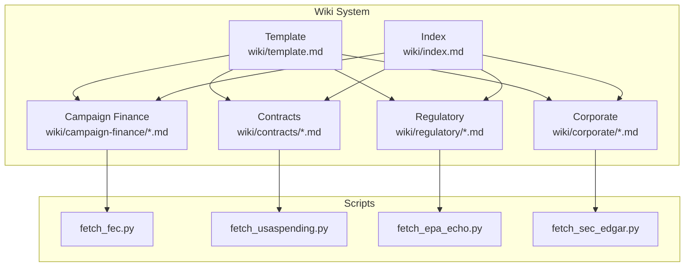
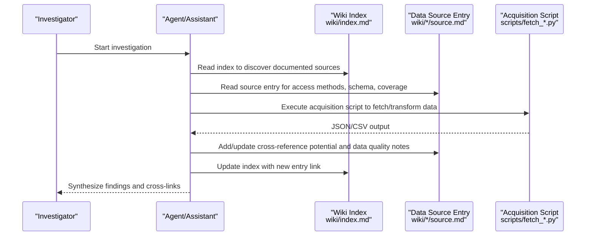
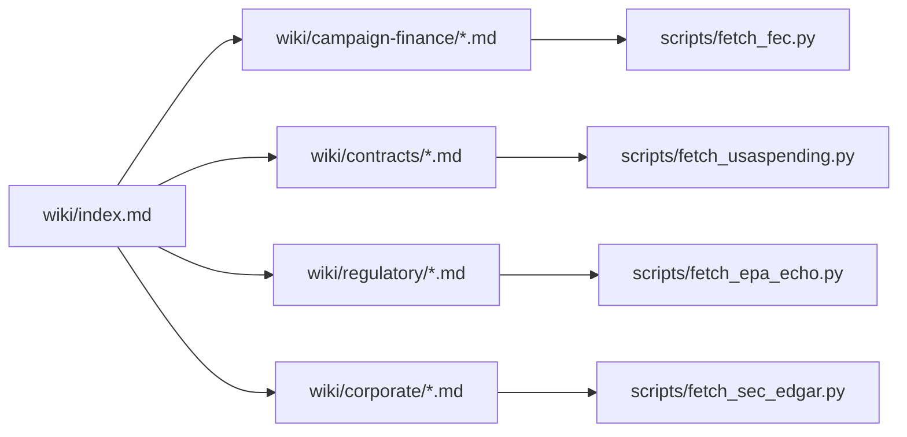

# Wiki Template System

<cite>
**Referenced Files in This Document**
- [wiki/template.md](file://wiki/template.md)
- [wiki/index.md](file://wiki/index.md)
- [wiki/campaign-finance/fec-federal.md](file://wiki/campaign-finance/fec-federal.md)
- [wiki/contracts/usaspending.md](file://wiki/contracts/usaspending.md)
- [wiki/regulatory/epa-echo.md](file://wiki/regulatory/epa-echo.md)
- [wiki/corporate/sec-edgar.md](file://wiki/corporate/sec-edgar.md)
- [scripts/fetch_fec.py](file://scripts/fetch_fec.py)
- [scripts/fetch_usaspending.py](file://scripts/fetch_usaspending.py)
- [scripts/fetch_epa_echo.py](file://scripts/fetch_epa_echo.py)
- [scripts/fetch_sec_edgar.py](file://scripts/fetch_sec_edgar.py)
- [prompts.rs](file://openplanter-desktop/crates/op-core/src/prompts.rs)
- [prompts.py](file://agent/prompts.py)
- [central-fl-ice-workspace/FOIA_STRATEGY.md](file://central-fl-ice-workspace/FOIA_STRATEGY.md)
</cite>

## Table of Contents
1. [Introduction](#introduction)
2. [Project Structure](#project-structure)
3. [Core Components](#core-components)
4. [Architecture Overview](#architecture-overview)
5. [Detailed Component Analysis](#detailed-component-analysis)
6. [Dependency Analysis](#dependency-analysis)
7. [Performance Considerations](#performance-considerations)
8. [Troubleshooting Guide](#troubleshooting-guide)
9. [Conclusion](#conclusion)
10. [Appendices](#appendices)

## Introduction
This document explains the standardized wiki template system used to document all data sources in OpenPlanter. The template ensures consistent, machine-friendly documentation of data sources across categories such as campaign finance, contracts, corporate registries, financial data, lobbying, nonprofits, regulatory enforcement, sanctions, international datasets, and infrastructure. It defines required sections, formatting guidelines, and practical examples, and connects template fields to investigation workflows and acquisition scripts.

## Project Structure
The wiki system consists of:
- A standardized template defining the structure and required sections
- Category-specific data source entries that follow the template
- An index that catalogs all sources by category and links to entries
- Acquisition scripts that demonstrate how to programmatically access and transform data described in the templates

**Diagram sources**
- [wiki/template.md:1-41](file://wiki/template.md#L1-L41)
- [wiki/index.md:1-75](file://wiki/index.md#L1-L75)
- [wiki/campaign-finance/fec-federal.md:1-203](file://wiki/campaign-finance/fec-federal.md#L1-L203)
- [wiki/contracts/usaspending.md:1-161](file://wiki/contracts/usaspending.md#L1-L161)
- [wiki/regulatory/epa-echo.md:1-137](file://wiki/regulatory/epa-echo.md#L1-L137)
- [wiki/corporate/sec-edgar.md:1-160](file://wiki/corporate/sec-edgar.md#L1-L160)
- [scripts/fetch_fec.py:1-417](file://scripts/fetch_fec.py#L1-L417)
- [scripts/fetch_usaspending.py:1-348](file://scripts/fetch_usaspending.py#L1-L348)
- [scripts/fetch_epa_echo.py:1-290](file://scripts/fetch_epa_echo.py#L1-L290)
- [scripts/fetch_sec_edgar.py:1-317](file://scripts/fetch_sec_edgar.py#L1-L317)

**Section sources**
- [wiki/template.md:1-41](file://wiki/template.md#L1-L41)
- [wiki/index.md:1-75](file://wiki/index.md#L1-L75)

## Core Components
The standardized template defines nine required sections that must be filled out for each data source:

1. Summary
   - Purpose: One-paragraph overview explaining what the dataset contains, who publishes it, and why it matters for investigations.
   - Validation criteria: Concise, factual, and scoped to investigative utility.

2. Access Methods
   - Purpose: How to obtain the data (bulk download, API, scraping, FOIA). Include URLs, authentication requirements, and rate limits.
   - Validation criteria: Complete URLs, documented rate limits, and clear steps to reproduce access.

3. Data Schema
   - Purpose: Key fields, record types, and relationships between tables. Include a field table if the schema is complex.
   - Validation criteria: Consistent field naming, clear descriptions, and representative examples.

4. Coverage
   - Purpose: Jurisdiction, time range, update frequency, and approximate volume.
   - Validation criteria: Specificity (e.g., “all 50 states” vs. “selected states”), precise date ranges, and realistic volume estimates.

5. Cross-Reference Potential
   - Purpose: Which other data sources can be joined and on what keys (entity names, IDs, addresses, dates).
   - Validation criteria: Exact source names as they appear in the index, and precise join keys.

6. Data Quality
   - Purpose: Known issues such as inconsistent formatting, missing fields, duplicates, encoding problems.
   - Validation criteria: Evidence-backed issues, actionable remediation notes.

7. Acquisition Script
   - Purpose: Path to scripts in the repo that download or transform the data, or instructions for writing one.
   - Validation criteria: Working script references, clear usage examples, and support for filters and formats.

8. Legal & Licensing
   - Purpose: Public records law citation, terms of use, or license governing redistribution and derived works.
   - Validation criteria: Accurate legal references and clear redistribution terms.

9. References
   - Purpose: Links to official documentation, data dictionaries, and prior analyses that used the source.
   - Validation criteria: Reliable, persistent links and cited authoritative sources.

Formatting guidelines:
- Use Markdown headings and lists consistently.
- Use tables for field definitions and endpoint listings.
- Keep prose concise and avoid jargon; define acronyms on first use.
- Reference exact source names in cross-references to enable knowledge graph linking.

**Section sources**
- [wiki/template.md:1-41](file://wiki/template.md#L1-L41)

## Architecture Overview
The wiki template system integrates with investigation workflows and acquisition scripts to create a living knowledge base:

**Diagram sources**
- [prompts.rs:313-343](file://openplanter-desktop/crates/op-core/src/prompts.rs#L313-L343)
- [prompts.py:457-488](file://agent/prompts.py#L457-L488)
- [wiki/index.md:1-75](file://wiki/index.md#L1-L75)
- [scripts/fetch_fec.py:1-417](file://scripts/fetch_fec.py#L1-L417)
- [scripts/fetch_usaspending.py:1-348](file://scripts/fetch_usaspending.py#L1-L348)
- [scripts/fetch_epa_echo.py:1-290](file://scripts/fetch_epa_echo.py#L1-L290)
- [scripts/fetch_sec_edgar.py:1-317](file://scripts/fetch_sec_edgar.py#L1-L317)

## Detailed Component Analysis

### Template Structure and Required Sections
- Template file: [wiki/template.md:1-41](file://wiki/template.md#L1-L41)
- Index catalog: [wiki/index.md:1-75](file://wiki/index.md#L1-L75)
- Example entries:
  - FEC Federal Campaign Finance: [wiki/campaign-finance/fec-federal.md:1-203](file://wiki/campaign-finance/fec-federal.md#L1-L203)
  - USASpending.gov: [wiki/contracts/usaspending.md:1-161](file://wiki/contracts/usaspending.md#L1-L161)
  - EPA ECHO: [wiki/regulatory/epa-echo.md:1-137](file://wiki/regulatory/epa-echo.md#L1-L137)
  - SEC EDGAR: [wiki/corporate/sec-edgar.md:1-160](file://wiki/corporate/sec-edgar.md#L1-L160)

Validation criteria per section:
- Summary: Clear scope and investigative relevance
- Access Methods: URLs, authentication, rate limits, and bulk options
- Data Schema: Field tables and endpoint listings
- Coverage: Jurisdiction, time range, update cadence, and volume
- Cross-Reference Potential: Exact source names and join keys
- Data Quality: Documented issues and mitigation strategies
- Acquisition Script: Script path and usage examples
- Legal & Licensing: Accurate legal references
- References: Persistent and authoritative links

Practical examples:
- FEC entry demonstrates API endpoints, pagination, and bulk downloads with a working acquisition script reference.
- USASpending entry documents award search fields, transaction-level data, and bulk archives.
- EPA ECHO entry outlines a two-step API workflow and field coverage for enforcement and compliance.
- SEC EDGAR entry covers JSON APIs, XBRL data, and bulk nightly archives.

**Section sources**
- [wiki/template.md:1-41](file://wiki/template.md#L1-L41)
- [wiki/index.md:1-75](file://wiki/index.md#L1-L75)
- [wiki/campaign-finance/fec-federal.md:1-203](file://wiki/campaign-finance/fec-federal.md#L1-L203)
- [wiki/contracts/usaspending.md:1-161](file://wiki/contracts/usaspending.md#L1-L161)
- [wiki/regulatory/epa-echo.md:1-137](file://wiki/regulatory/epa-echo.md#L1-L137)
- [wiki/corporate/sec-edgar.md:1-160](file://wiki/corporate/sec-edgar.md#L1-L160)

### Field Definitions and Cross-Reference Keys
- Jurisdiction: Geographic or organizational scope (e.g., “US federal”, “all 50 states + DC, territories”)
- Time range: Earliest and latest records available (e.g., “1979–present”, “FY2001–present”)
- Update frequency: How often the publisher refreshes the data (e.g., “daily to weekly”, “within 5 days”)
- Volume: Approximate record counts (e.g., “millions of itemized transactions per cycle”)
- Cross-reference keys: Entity identifiers (e.g., FEC IDs, UEI/DUNS), names, addresses, dates, and industry codes

Examples:
- FEC: Candidate/committee IDs, entity names, addresses, employer names, dates
- USASpending: UEI (post-2022), DUNS (pre-2022), recipient name, parent company name
- EPA ECHO: Facility name, address, NAICS/SIC codes, FRS Registry ID, latitude/longitude
- SEC EDGAR: CIK, ticker symbol, company name, executive names, addresses

**Section sources**
- [wiki/campaign-finance/fec-federal.md:124-149](file://wiki/campaign-finance/fec-federal.md#L124-L149)
- [wiki/contracts/usaspending.md:81-113](file://wiki/contracts/usaspending.md#L81-L113)
- [wiki/regulatory/epa-echo.md:78-100](file://wiki/regulatory/epa-echo.md#L78-L100)
- [wiki/corporate/sec-edgar.md:94-112](file://wiki/corporate/sec-edgar.md#L94-L112)

### Practical Examples and Formatting Patterns
- Use tables for field definitions and endpoint listings
- Include code-like examples for acquisition script usage
- Provide exact URLs and official documentation links
- Maintain consistent terminology and acronyms

Examples:
- FEC: API endpoint table, bulk file categories, and script usage examples
- USASpending: Award search fields, transaction-level data, and script usage examples
- EPA ECHO: Two-step API workflow, facility record fields, and script usage examples
- SEC EDGAR: JSON API endpoints, XBRL taxonomy, and script usage examples

**Section sources**
- [wiki/campaign-finance/fec-federal.md:1-203](file://wiki/campaign-finance/fec-federal.md#L1-L203)
- [wiki/contracts/usaspending.md:1-161](file://wiki/contracts/usaspending.md#L1-L161)
- [wiki/regulatory/epa-echo.md:1-137](file://wiki/regulatory/epa-echo.md#L1-L137)
- [wiki/corporate/sec-edgar.md:1-160](file://wiki/corporate/sec-edgar.md#L1-L160)

### Relationship Between Template Fields and Investigation Workflows
- Discovery: Read the index to identify documented sources and their categories
- Access: Use Access Methods to obtain data; leverage Acquisition Scripts for automation
- Schema understanding: Apply Data Schema to design queries and transformations
- Coverage awareness: Account for Coverage to plan time windows and update cadences
- Cross-linking: Use Cross-Reference Potential to join datasets and validate findings
- Quality control: Address Data Quality issues and adjust extraction logic accordingly
- Legal compliance: Follow Legal & Licensing terms when redistributing or deriving works
- Evidence linkage: Reference References to cite authoritative sources

Operational guidance embedded in system prompts:
- Treat the wiki as a derived knowledge surface, not primary memory
- Update or create entries using the template
- Maintain the index with accurate links
- Use exact source names for cross-references to power knowledge graph visualization

**Section sources**
- [prompts.rs:313-343](file://openplanter-desktop/crates/op-core/src/prompts.rs#L313-L343)
- [prompts.py:457-488](file://agent/prompts.py#L457-L488)
- [wiki/index.md:1-75](file://wiki/index.md#L1-L75)

### Template Customization for Different Data Source Types
- Campaign Finance: Emphasize candidate/committee IDs, contribution/disbursement fields, and election cycles
- Contracts: Focus on award IDs, recipient identifiers (UEI/DUNS), award types, and place of performance
- Regulatory: Highlight facility identifiers, compliance statuses, enforcement actions, and program-specific IDs
- Corporate: Stress CIK/ticker mappings, XBRL financial concepts, and related-party disclosures
- Nonprofits: Include IRS filing references and Form 990 disclosures
- Sanctions: Detail SDN lists and licensing terms
- International: Cover global datasets and applicable jurisdictions
- Infrastructure: Include census and demographic indicators

Guidance:
- Adapt Access Methods to the dominant access mode (API vs. bulk)
- Tailor Data Schema to the primary record types and relationships
- Adjust Coverage to reflect publisher refresh schedules and historical availability
- Customize Cross-Reference Potential to align with typical investigative linkages

**Section sources**
- [wiki/campaign-finance/fec-federal.md:1-203](file://wiki/campaign-finance/fec-federal.md#L1-L203)
- [wiki/contracts/usaspending.md:1-161](file://wiki/contracts/usaspending.md#L1-L161)
- [wiki/regulatory/epa-echo.md:1-137](file://wiki/regulatory/epa-echo.md#L1-L137)
- [wiki/corporate/sec-edgar.md:1-160](file://wiki/corporate/sec-edgar.md#L1-L160)

## Dependency Analysis
The wiki template system depends on:
- Consistency between index entries and actual source files
- Accuracy of cross-reference names to enable knowledge graph linking
- Availability and correctness of acquisition scripts
- Adherence to formatting guidelines across all entries

**Diagram sources**
- [wiki/index.md:1-75](file://wiki/index.md#L1-L75)
- [scripts/fetch_fec.py:1-417](file://scripts/fetch_fec.py#L1-L417)
- [scripts/fetch_usaspending.py:1-348](file://scripts/fetch_usaspending.py#L1-L348)
- [scripts/fetch_epa_echo.py:1-290](file://scripts/fetch_epa_echo.py#L1-L290)
- [scripts/fetch_sec_edgar.py:1-317](file://scripts/fetch_sec_edgar.py#L1-L317)

**Section sources**
- [wiki/index.md:1-75](file://wiki/index.md#L1-L75)

## Performance Considerations
- API rate limits: Respect documented limits and implement backoff strategies
- Pagination: Use pagination controls to retrieve large result sets efficiently
- Output formats: Prefer CSV for large tabular datasets; JSON for hierarchical structures
- Filtering: Apply filters at the API level to minimize payload sizes
- Bulk downloads: Use pre-generated archives for large-scale analysis
- Script reliability: Include timeouts, retries, and error handling in acquisition scripts

[No sources needed since this section provides general guidance]

## Troubleshooting Guide
Common issues and resolutions:
- Authentication failures: Verify API keys and required headers (e.g., User-Agent)
- Rate limiting: Reduce request frequency or use bulk downloads
- Missing or inconsistent fields: Normalize free-text fields and apply deduplication strategies
- Name variations: Use fuzzy matching and entity resolution techniques
- Data delays: Account for publisher refresh schedules and known lags
- Script errors: Validate URLs, parameters, and output paths

Evidence of operational guidance:
- SEC EDGAR requires a User-Agent header and enforces rate limits
- USASpending bulk downloads provide pre-generated archives
- EPA ECHO uses a two-step API workflow with QueryID pagination
- FEC bulk files can be large; use targeted cycles and filters

**Section sources**
- [scripts/fetch_sec_edgar.py:23-26](file://scripts/fetch_sec_edgar.py#L23-L26)
- [scripts/fetch_usaspending.py:28-31](file://scripts/fetch_usaspending.py#L28-L31)
- [scripts/fetch_epa_echo.py:94-124](file://scripts/fetch_epa_echo.py#L94-L124)
- [scripts/fetch_fec.py:22-25](file://scripts/fetch_fec.py#L22-L25)

## Conclusion
The OpenPlanter wiki template system provides a standardized, extensible framework for documenting data sources. By adhering to the nine-section template, maintaining accurate cross-references, and integrating with acquisition scripts, contributors can create a robust knowledge base that supports reproducible investigations and cross-domain analysis.

[No sources needed since this section summarizes without analyzing specific files]

## Appendices

### Appendix A: Template Field Mapping to Investigation Workflows
- Discovery: Read index and entries to identify relevant sources
- Access: Use Access Methods and Acquisition Scripts to obtain data
- Schema design: Apply Data Schema to inform queries and transformations
- Coverage planning: Align Coverage with timelines and update frequencies
- Cross-linking: Use Cross-Reference Potential to join datasets
- Quality assurance: Address Data Quality issues and refine extraction logic
- Legal compliance: Follow Legal & Licensing terms
- Evidence tracking: Reference References for authoritative citations

**Section sources**
- [prompts.rs:313-343](file://openplanter-desktop/crates/op-core/src/prompts.rs#L313-L343)
- [prompts.py:457-488](file://agent/prompts.py#L457-L488)
- [wiki/index.md:1-75](file://wiki/index.md#L1-L75)

### Appendix B: FOIA Strategy Context
The wiki system supports FOIA-driven investigations by documenting data sources and access methods. The FOIA Strategy emphasizes prioritizing records requests and federal FOIA submissions to close evidence gaps, aligning with the wiki’s role as a knowledge base for source discovery and access.

**Section sources**
- [central-fl-ice-workspace/FOIA_STRATEGY.md:1-64](file://central-fl-ice-workspace/FOIA_STRATEGY.md#L1-L64)