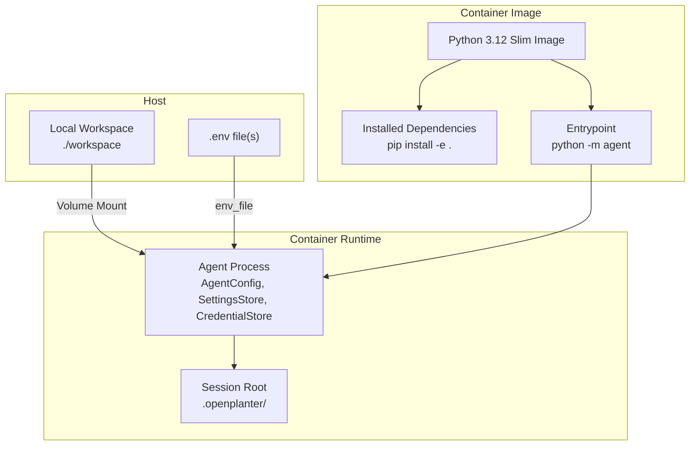
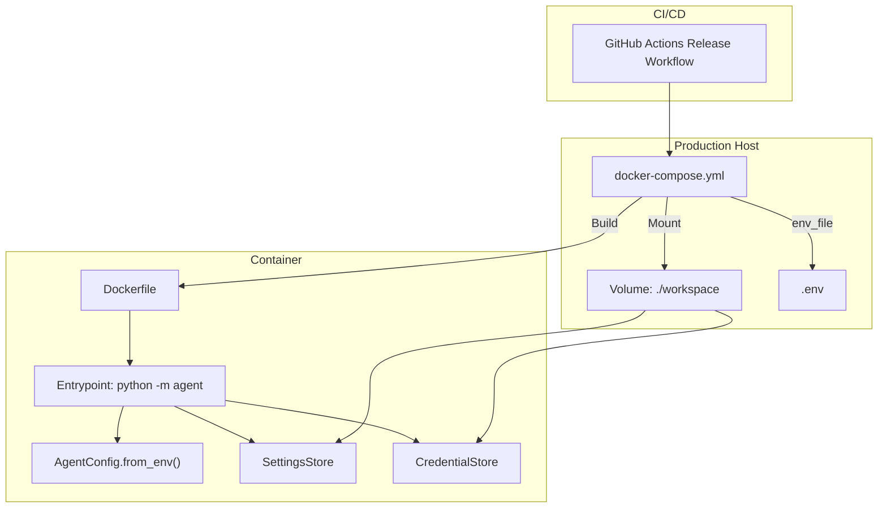
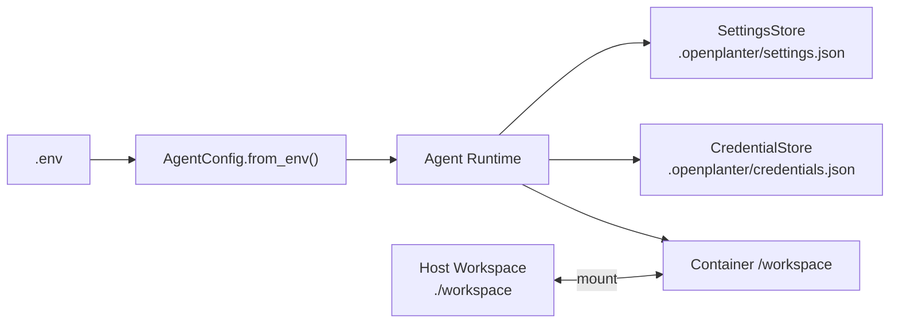

# Deployment and Operations

<cite>
**Referenced Files in This Document**
- [Dockerfile](file://Dockerfile)
- [docker-compose.yml](file://docker-compose.yml)
- [pyproject.toml](file://pyproject.toml)
- [agent/__main__.py](file://agent/__main__.py)
- [agent/config.py](file://agent/config.py)
- [agent/settings.py](file://agent/settings.py)
- [agent/credentials.py](file://agent/credentials.py)
- [.github/workflows/release.yml](file://.github/workflows/release.yml)
- [.github/workflows/codex-review-gate.yml](file://.github/workflows/codex-review-gate.yml)
- [.github/workflows/devin-review-gate.yml](file://.github/workflows/devin-review-gate.yml)
- [openplanter-desktop/crates/op-core/src/credentials.rs](file://openplanter-desktop/crates/op-core/src/credentials.rs)
</cite>

## Table of Contents
1. [Introduction](#introduction)
2. [Project Structure](#project-structure)
3. [Core Components](#core-components)
4. [Architecture Overview](#architecture-overview)
5. [Detailed Component Analysis](#detailed-component-analysis)
6. [Dependency Analysis](#dependency-analysis)
7. [Performance Considerations](#performance-considerations)
8. [Troubleshooting Guide](#troubleshooting-guide)
9. [Conclusion](#conclusion)
10. [Appendices](#appendices)

## Introduction
This document provides comprehensive guidance for deploying and operating OpenPlanter in production. It covers Docker-based deployment using docker-compose, container configuration, and volume management. It documents GitHub Actions workflows for automated builds and releases, environment configuration, scaling considerations, monitoring approaches, security and access control, troubleshooting, performance optimization, backup and disaster recovery, and operational best practices.

## Project Structure
OpenPlanter includes a minimal container image definition and a docker-compose service that mounts a workspace directory for persistence. The Python packaging metadata defines the agent entry point and dependencies. The agent loads configuration from environment variables and optional .env files, and persists settings and credentials under a workspace-controlled directory.

**Diagram sources**
- [Dockerfile:1-10](file://Dockerfile#L1-L10)
- [docker-compose.yml:1-9](file://docker-compose.yml#L1-L9)
- [agent/__main__.py:708-738](file://agent/__main__.py#L708-L738)
- [agent/config.py:146-260](file://agent/config.py#L146-L260)
- [agent/settings.py:198-225](file://agent/settings.py#L198-L225)
- [agent/credentials.py:281-311](file://agent/credentials.py#L281-L311)

**Section sources**
- [Dockerfile:1-10](file://Dockerfile#L1-L10)
- [docker-compose.yml:1-9](file://docker-compose.yml#L1-L9)
- [pyproject.toml:1-35](file://pyproject.toml#L1-L35)

## Core Components
- Container image: Python 3.12 slim base, installs project in editable mode, exposes a workspace directory, and sets the agent as the entrypoint.
- Compose service: Builds the image from the repository root, loads environment variables from a .env file, mounts a local workspace directory, and keeps the container interactive.
- Agent configuration: Loads environment variables for provider endpoints, API keys, and operational parameters; supports overrides via CLI flags.
- Settings and credentials stores: Persist default preferences and API keys under the workspace’s session root directory (.openplanter).

**Section sources**
- [Dockerfile:1-10](file://Dockerfile#L1-L10)
- [docker-compose.yml:1-9](file://docker-compose.yml#L1-L9)
- [agent/config.py:262-494](file://agent/config.py#L262-L494)
- [agent/settings.py:198-225](file://agent/settings.py#L198-L225)
- [agent/credentials.py:281-311](file://agent/credentials.py#L281-L311)

## Architecture Overview
The production runtime consists of a single container running the agent process. The container reads configuration from environment variables and optional .env files, persists settings and credentials under the mounted workspace, and exposes a predictable entrypoint. Optional desktop components (Tauri) are built via GitHub Actions for distribution.

**Diagram sources**
- [.github/workflows/release.yml:1-78](file://.github/workflows/release.yml#L1-L78)
- [docker-compose.yml:1-9](file://docker-compose.yml#L1-L9)
- [Dockerfile:1-10](file://Dockerfile#L1-L10)
- [agent/__main__.py:708-738](file://agent/__main__.py#L708-L738)
- [agent/config.py:262-494](file://agent/config.py#L262-L494)
- [agent/settings.py:198-225](file://agent/settings.py#L198-L225)
- [agent/credentials.py:281-311](file://agent/credentials.py#L281-L311)

## Detailed Component Analysis

### Docker-based Deployment
- Base image and dependencies: The image uses a Python slim base, installs ripgrep for search utilities, copies project metadata and agent code, installs the project in editable mode, creates a workspace directory, and sets the agent as the entrypoint.
- Compose service: Builds the image from the repository root, loads environment variables from a .env file, mounts a local workspace directory, and keeps the container interactive for terminal usage.
- Volume management: The compose service mounts ./workspace to /workspace inside the container. This enables persistent storage of logs, artifacts, and intermediate results across container restarts.

Operational guidance:
- Use a dedicated .env file for secrets and environment-specific overrides.
- Bind mount the workspace directory to a durable host location for persistence.
- Limit container resources using compose resource limits and restart policies suited to your workload.

**Section sources**
- [Dockerfile:1-10](file://Dockerfile#L1-L10)
- [docker-compose.yml:1-9](file://docker-compose.yml#L1-L9)

### Environment Configuration and Secrets Management
- Environment discovery: The agent discovers .env files by walking up the workspace path and merges keys from multiple sources: user-level store, workspace-level store, and discovered .env files. It also supports CLI-provided overrides.
- Provider configuration: The agent normalizes provider endpoints, API keys, and plan selection from environment variables. It supports fallbacks and placeholders for provider-specific keys and base URLs.
- Credential stores: Credentials are persisted under the workspace’s session root directory (.openplanter). The Rust desktop module also provides credential discovery and storage mechanisms.

Security considerations:
- Prefer environment variables or secret managers for API keys.
- Avoid committing .env files or credential files to version control.
- Restrict file permissions on host-mounted volumes and credential files.

**Section sources**
- [agent/__main__.py:281-416](file://agent/__main__.py#L281-L416)
- [agent/config.py:262-494](file://agent/config.py#L262-L494)
- [agent/settings.py:198-225](file://agent/settings.py#L198-L225)
- [agent/credentials.py:281-311](file://agent/credentials.py#L281-L311)
- [openplanter-desktop/crates/op-core/src/credentials.rs:212-304](file://openplanter-desktop/crates/op-core/src/credentials.rs#L212-L304)

### GitHub Actions Workflows
- Release workflow: Builds multi-target desktop applications (Linux, macOS, Windows) using Rust and Node toolchains, installs system dependencies, builds the frontend, and packages the Tauri app into platform-specific bundles. Artifacts are uploaded as release assets on tag pushes.
- Review gates: Separate workflows enforce required reviews from designated bots before allowing merges to protected branches.

Operational guidance:
- Use semantic version tags to trigger releases.
- Store secrets in repository settings for signing and publishing.
- Monitor workflow logs for build failures and artifact availability.

**Section sources**
- [.github/workflows/release.yml:1-78](file://.github/workflows/release.yml#L1-L78)
- [.github/workflows/codex-review-gate.yml:1-163](file://.github/workflows/codex-review-gate.yml#L1-L163)
- [.github/workflows/devin-review-gate.yml:1-85](file://.github/workflows/devin-review-gate.yml#L1-L85)

### Scaling Considerations
- Single-container design: The current compose setup runs one agent container. For horizontal scaling, deploy multiple instances behind a reverse proxy and ensure each instance uses a separate workspace directory or a shared, writable storage backend.
- Resource limits: Configure CPU and memory limits in docker-compose to prevent noisy-neighbor effects.
- Concurrency: Tune agent parameters (e.g., max steps per call, timeouts) to balance throughput and stability.

[No sources needed since this section provides general guidance]

### Monitoring Approaches
- Logs: Stream container logs to a centralized logging system (e.g., syslog, filebeat, or cloud log collectors).
- Health checks: Add a simple HTTP health endpoint or periodic heartbeat to detect stalled agents.
- Metrics: Expose metrics via a Prometheus exporter or integrate with application-level telemetry if extended.

[No sources needed since this section provides general guidance]

### Security Considerations
- Least privilege: Run containers with non-root users and drop unnecessary capabilities.
- Secrets protection: Use environment variables or secret managers; avoid embedding secrets in images or configuration files.
- Network isolation: Place the agent in a private network segment; restrict outbound egress to required providers.
- Access control: Enforce authentication and authorization at the ingress layer; avoid exposing administrative interfaces publicly.
- Desktop security: Desktop builds may require hardened permissions and sandboxing depending on platform.

[No sources needed since this section provides general guidance]

### Backup Strategies and Disaster Recovery
- Backup plan: Regularly snapshot the workspace directory and any external databases or caches used by providers.
- Recovery testing: Periodically restore backups to a staging environment to validate recoverability.
- Immutable artifacts: Store immutable references to model weights or embeddings indices externally if applicable.

[No sources needed since this section provides general guidance]

## Dependency Analysis
The agent depends on environment-driven configuration and local persistence. The container image encapsulates Python runtime and project installation. The compose service orchestrates environment loading and volume mounting.

**Diagram sources**
- [agent/config.py:262-494](file://agent/config.py#L262-L494)
- [agent/settings.py:198-225](file://agent/settings.py#L198-L225)
- [agent/credentials.py:281-311](file://agent/credentials.py#L281-L311)
- [docker-compose.yml:5-6](file://docker-compose.yml#L5-L6)

**Section sources**
- [agent/config.py:262-494](file://agent/config.py#L262-L494)
- [agent/settings.py:198-225](file://agent/settings.py#L198-L225)
- [agent/credentials.py:281-311](file://agent/credentials.py#L281-L311)
- [docker-compose.yml:5-6](file://docker-compose.yml#L5-L6)

## Performance Considerations
- Container sizing: Allocate sufficient CPU and memory to handle concurrent tasks and model calls.
- Disk I/O: Use fast local storage for the workspace volume; consider SSD-backed hosts for intensive file operations.
- Provider latency: Tune timeouts and retry policies for external providers; batch operations where feasible.
- Streaming and chunking: For transcription and document AI, configure chunk sizes and timeouts appropriate for your data.

[No sources needed since this section provides general guidance]

## Troubleshooting Guide
Common deployment issues and resolutions:
- Missing API keys: Ensure environment variables or .env files are present and loaded. Use the agent’s credential configuration option to persist keys locally.
- Workspace not found or inaccessible: Verify the bind-mounted workspace path exists and has correct permissions.
- Provider connectivity: Confirm base URLs and keys; test connectivity to provider endpoints from the host.
- Session and settings persistence: Check that the .openplanter directory exists and is writable within the workspace.

Operational checks:
- Validate environment variables with a dry-run of the agent.
- Inspect container logs for initialization errors.
- Test model listing and session resume to confirm configuration correctness.

**Section sources**
- [agent/__main__.py:708-738](file://agent/__main__.py#L708-L738)
- [agent/config.py:262-494](file://agent/config.py#L262-L494)
- [agent/settings.py:198-225](file://agent/settings.py#L198-L225)
- [agent/credentials.py:281-311](file://agent/credentials.py#L281-L311)

## Conclusion
OpenPlanter’s production deployment is streamlined through a minimal container image and a straightforward compose service. Robust configuration management, secure secrets handling, and clear persistence boundaries enable reliable operations. The included GitHub Actions workflows automate desktop builds and enforce review gates. Apply the operational guidance here to scale safely, monitor effectively, and maintain security and resilience.

## Appendices

### Environment Variables Reference
Key environment variables used by the agent for configuration and credentials:
- Provider keys and base URLs
- Web search and embeddings provider selection
- Chrome MCP settings
- Budget extension and retry parameters
- Session and workspace root directory

These are loaded and normalized by the agent configuration loader and can be overridden via CLI flags.

**Section sources**
- [agent/config.py:262-494](file://agent/config.py#L262-L494)

### Operational Best Practices Checklist
- Use a dedicated .env file for secrets and environment overrides.
- Back up the workspace directory regularly.
- Limit container privileges and apply network policies.
- Monitor logs and set up alerts for critical failures.
- Validate configuration before scaling out.
- Keep provider credentials updated and rotated periodically.

[No sources needed since this section provides general guidance]