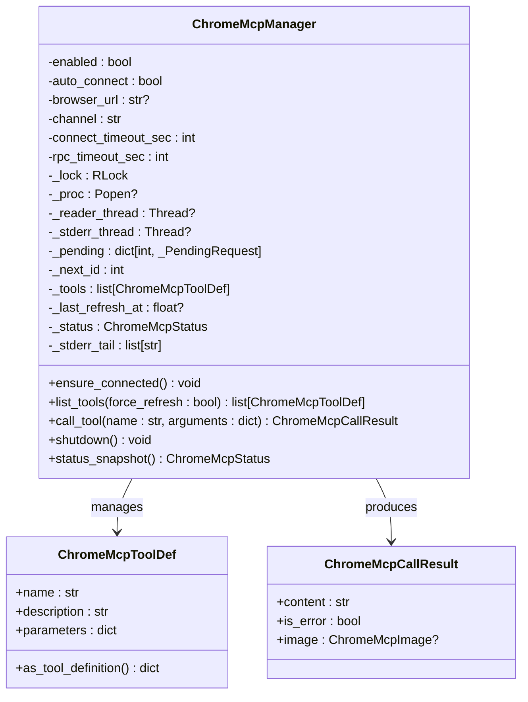
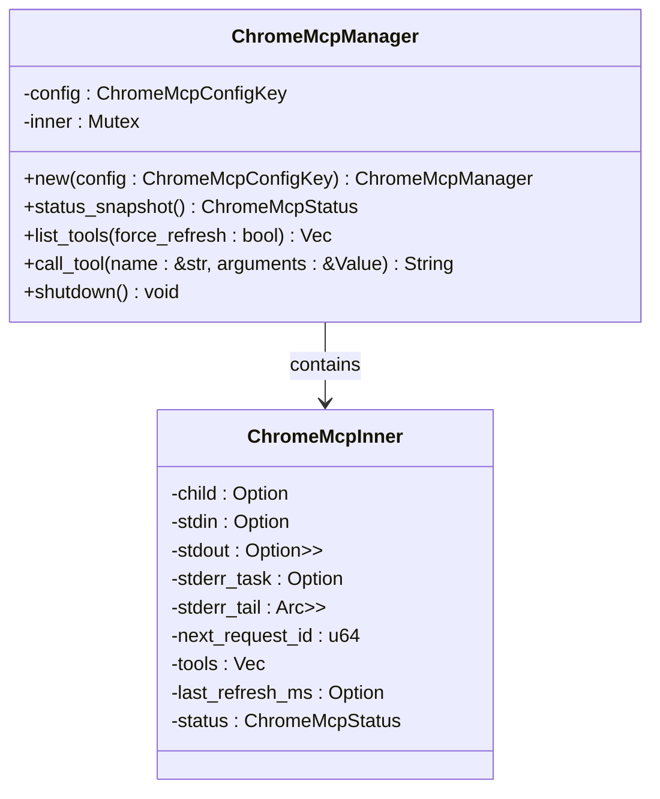
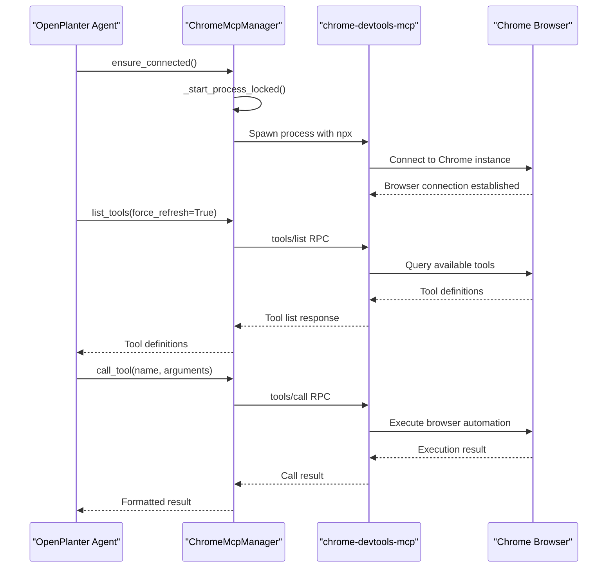
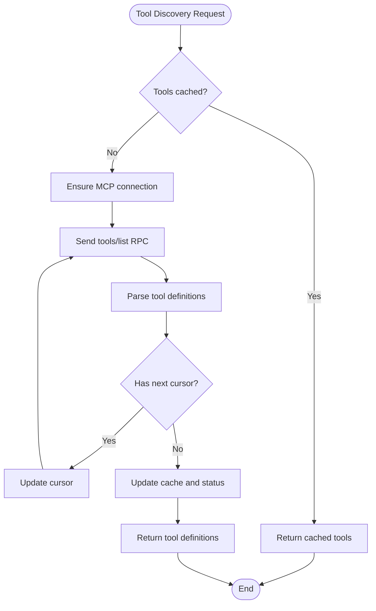
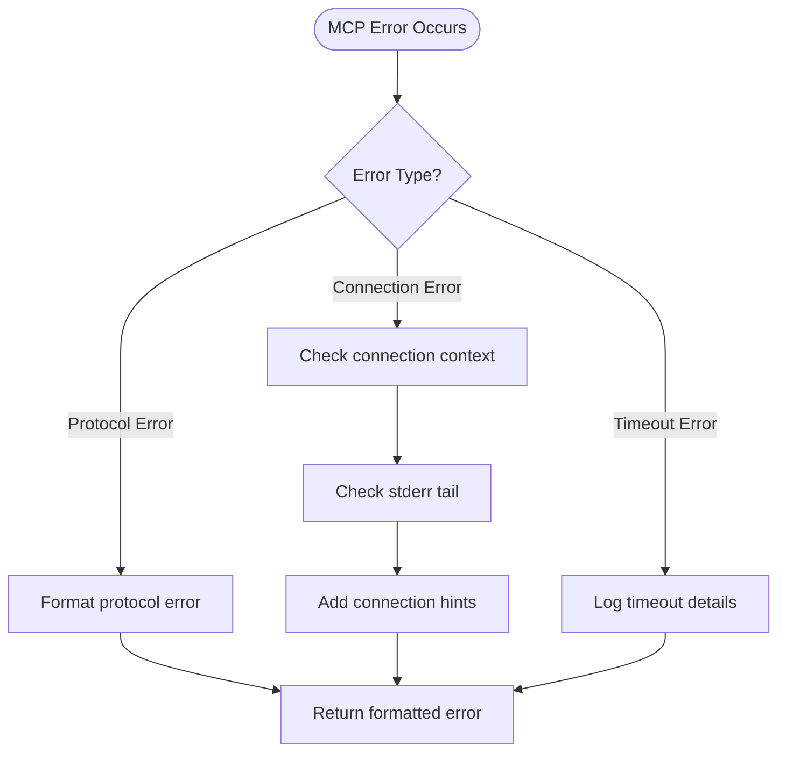

# Chrome DevTools MCP Integration

<cite>
**Referenced Files in This Document**
- [README.md](file://README.md)
- [agent/chrome_mcp.py](file://agent/chrome_mcp.py)
- [openplanter-desktop/crates/op-core/src/tools/chrome_mcp.rs](file://openplanter-desktop/crates/op-core/src/tools/chrome_mcp.rs)
- [agent/config.py](file://agent/config.py)
- [agent/tools.py](file://agent/tools.py)
- [tests/test_chrome_mcp.py](file://tests/test_chrome_mcp.py)
- [openplanter-desktop/frontend/src/commands/chrome.ts](file://openplanter-desktop/frontend/src/commands/chrome.ts)
</cite>

## Table of Contents
1. [Introduction](#introduction)
2. [Project Structure](#project-structure)
3. [Core Components](#core-components)
4. [Architecture Overview](#architecture-overview)
5. [Detailed Component Analysis](#detailed-component-analysis)
6. [Dependency Analysis](#dependency-analysis)
7. [Performance Considerations](#performance-considerations)
8. [Troubleshooting Guide](#troubleshooting-guide)
9. [Security and Resource Management](#security-and-resource-management)
10. [Practical Implementation Examples](#practical-implementation-examples)
11. [Conclusion](#conclusion)

## Introduction

OpenPlanter provides native Chrome DevTools MCP (Model Context Protocol) integration for advanced browser automation capabilities. This integration enables the agent to remotely control Chrome browsers through the official MCP protocol, allowing sophisticated web automation tasks including page navigation, form filling, JavaScript-heavy site handling, and dynamic content extraction.

The Chrome DevTools MCP integration consists of two primary implementations: a Python-based client for the CLI/TUI agent and a Rust-based client for the desktop application. Both implementations share the same protocol semantics and provide seamless browser automation capabilities within OpenPlanter's investigation workflow.

## Project Structure

The Chrome DevTools MCP integration spans multiple components across the codebase:

```mermaid
graph TB
subgraph "Python Agent Layer"
A[agent/chrome_mcp.py<br/>Python MCP Manager]
B[agent/tools.py<br/>Workspace Tools Integration]
C[agent/config.py<br/>Configuration Management]
end
subgraph "Desktop Application Layer"
D[op-core/src/tools/chrome_mcp.rs<br/>Rust MCP Manager]
E[frontend/src/commands/chrome.ts<br/>UI Commands]
end
subgraph "External Dependencies"
F[chrome-devtools-mcp@latest<br/>MCP Server Package]
G[Chrome Browser<br/>Remote Debugging]
end
A --> F
D --> F
B --> A
E --> D
F --> G
```

**Diagram sources**
- [agent/chrome_mcp.py:113-573](file://agent/chrome_mcp.py#L113-L573)
- [openplanter-desktop/crates/op-core/src/tools/chrome_mcp.rs:109-595](file://openplanter-desktop/crates/op-core/src/tools/chrome_mcp.rs#L109-L595)

**Section sources**
- [README.md:247-291](file://README.md#L247-L291)
- [agent/chrome_mcp.py:113-147](file://agent/chrome_mcp.py#L113-L147)
- [openplanter-desktop/crates/op-core/src/tools/chrome_mcp.rs:109-125](file://openplanter-desktop/crates/op-core/src/tools/chrome_mcp.rs#L109-L125)

## Core Components

### ChromeMcpManager (Python Implementation)

The Python implementation provides a robust MCP client with automatic process management and thread-safe operations:



**Diagram sources**
- [agent/chrome_mcp.py:113-147](file://agent/chrome_mcp.py#L113-L147)
- [agent/chrome_mcp.py:25-50](file://agent/chrome_mcp.py#L25-L50)

### ChromeMcpManager (Rust Implementation)

The Rust implementation provides asynchronous operations with Tokio integration:



**Diagram sources**
- [openplanter-desktop/crates/op-core/src/tools/chrome_mcp.rs:109-125](file://openplanter-desktop/crates/op-core/src/tools/chrome_mcp.rs#L109-L125)
- [openplanter-desktop/crates/op-core/src/tools/chrome_mcp.rs:77-107](file://openplanter-desktop/crates/op-core/src/tools/chrome_mcp.rs#L77-L107)

**Section sources**
- [agent/chrome_mcp.py:113-573](file://agent/chrome_mcp.py#L113-L573)
- [openplanter-desktop/crates/op-core/src/tools/chrome_mcp.rs:109-595](file://openplanter-desktop/crates/op-core/src/tools/chrome_mcp.rs#L109-L595)

## Architecture Overview

The Chrome DevTools MCP integration follows a client-server architecture with automatic process management:



**Diagram sources**
- [agent/chrome_mcp.py:158-201](file://agent/chrome_mcp.py#L158-L201)
- [agent/chrome_mcp.py:202-267](file://agent/chrome_mcp.py#L202-L267)

The architecture supports both auto-connect mode (connecting to running Chrome instances) and explicit browser URL mode (connecting to specific debugging endpoints). The implementation handles process lifecycle management, error recovery, and graceful shutdown procedures.

**Section sources**
- [README.md:257-264](file://README.md#L257-L264)
- [agent/chrome_mcp.py:357-468](file://agent/chrome_mcp.py#L357-L468)

## Detailed Component Analysis

### Configuration Management

Both implementations derive configuration from environment variables and runtime settings:

| Configuration Parameter | Python Default | Rust Default | Description |
|------------------------|----------------|--------------|-------------|
| `chrome_mcp_enabled` | `False` | `false` | Enable/disable Chrome MCP integration |
| `chrome_mcp_auto_connect` | `True` | `true` | Enable auto-connect mode |
| `chrome_mcp_browser_url` | `None` | `None` | Explicit browser debugging URL |
| `chrome_mcp_channel` | `"stable"` | `"stable"` | Chrome release channel |
| `chrome_mcp_connect_timeout_sec` | `15` | `15` | Connection timeout in seconds |
| `chrome_mcp_rpc_timeout_sec` | `45` | `45` | RPC call timeout in seconds |

**Section sources**
- [agent/config.py:26-29](file://agent/config.py#L26-L29)
- [agent/config.py:202-207](file://agent/config.py#L202-L207)
- [agent/config.py:445-464](file://agent/config.py#L445-L464)

### Tool Discovery and Execution

The tool discovery mechanism supports pagination and caching:



**Diagram sources**
- [agent/chrome_mcp.py:202-256](file://agent/chrome_mcp.py#L202-L256)
- [openplanter-desktop/crates/op-core/src/tools/chrome_mcp.rs:174-244](file://openplanter-desktop/crates/op-core/src/tools/chrome_mcp.rs#L174-L244)

### Result Processing and Content Extraction

The result processing system handles various content types including text, images, and structured data:

| Content Type | Processing Method | Output Format |
|-------------|-------------------|---------------|
| Text Content | Direct concatenation | Plain text |
| Image Content | Base64 decoding | Image object with MIME type |
| Structured Data | JSON serialization | Pretty-printed JSON |
| Mixed Content | Type-specific parsing | Combined text with resource references |

**Section sources**
- [agent/chrome_mcp.py:469-521](file://agent/chrome_mcp.py#L469-L521)
- [openplanter-desktop/crates/op-core/src/tools/chrome_mcp.rs:527-594](file://openplanter-desktop/crates/op-core/src/tools/chrome_mcp.rs#L527-L594)

## Dependency Analysis

The Chrome DevTools MCP integration has minimal external dependencies and integrates seamlessly with OpenPlanter's existing tool ecosystem:

```mermaid
graph LR
subgraph "Internal Dependencies"
A[agent/tools.py] --> B[agent/chrome_mcp.py]
A --> C[agent/config.py]
D[agent/engine.py] --> A
end
subgraph "External Dependencies"
E[chrome-devtools-mcp@latest] --> F[npx]
F --> G[Node.js/npm]
G --> H[Chrome Browser]
end
subgraph "Desktop Integration"
I[frontend/src/commands/chrome.ts] --> J[op-core/src/tools/chrome_mcp.rs]
J --> E
end
B --> E
C --> B
D --> A
I --> J
```

**Diagram sources**
- [agent/tools.py:30-43](file://agent/tools.py#L30-L43)
- [README.md:53-54](file://README.md#L53-L54)

**Section sources**
- [agent/tools.py:176-183](file://agent/tools.py#L176-L183)
- [README.md:247-291](file://README.md#L247-L291)

## Performance Considerations

### Connection Management

The implementation includes several performance optimizations:

- **Process Reuse**: ChromeMcpManager instances are cached and reused based on configuration parameters
- **Connection Pooling**: Single persistent connection maintained for multiple tool calls
- **Timeout Configuration**: Separate timeouts for connection establishment and RPC operations
- **Background Processing**: Asynchronous operations prevent blocking the main agent thread

### Memory Management

- **Output Limiting**: Configurable limits on observation and file sizes
- **Resource Cleanup**: Automatic cleanup of background processes and temporary files
- **Error Recovery**: Graceful handling of connection failures with retry logic

**Section sources**
- [agent/chrome_mcp.py:523-573](file://agent/chrome_mcp.py#L523-L573)
- [openplanter-desktop/crates/op-core/src/tools/chrome_mcp.rs:398-458](file://openplanter-desktop/crates/op-core/src/tools/chrome_mcp.rs#L398-L458)

## Troubleshooting Guide

### Common Connection Issues

| Issue | Symptoms | Solution |
|-------|----------|----------|
| Node.js not found | Process fails with "npx not found" | Install Node.js 20+ and ensure npm is available on PATH |
| Chrome remote debugging disabled | Connection timeout or permission prompt | Enable remote debugging at `chrome://inspect/#remote-debugging` |
| Chrome version incompatible | Protocol version mismatch errors | Use Chrome 144+ with supported remote debugging |
| Network connectivity issues | RPC timeout errors | Verify firewall settings and network connectivity |

### Error Handling Patterns

The implementation provides comprehensive error handling with contextual information:



**Diagram sources**
- [agent/chrome_mcp.py:82-110](file://agent/chrome_mcp.py#L82-L110)
- [openplanter-desktop/crates/op-core/src/tools/chrome_mcp.rs:460-500](file://openplanter-desktop/crates/op-core/src/tools/chrome_mcp.rs#L460-L500)

**Section sources**
- [agent/chrome_mcp.py:82-110](file://agent/chrome_mcp.py#L82-L110)
- [tests/test_chrome_mcp.py:161-175](file://tests/test_chrome_mcp.py#L161-L175)

## Security and Resource Management

### Security Considerations

- **Process Isolation**: Chrome MCP runs as separate processes with isolated permissions
- **Environment Sandboxing**: Uses `start_new_session=True` to prevent process group hijacking
- **Input Validation**: Strict validation of tool arguments and browser URLs
- **Resource Limits**: Configurable timeouts prevent resource exhaustion

### Resource Management

- **Process Lifecycle**: Automatic cleanup of Chrome MCP processes on shutdown
- **Memory Constraints**: Output size limits prevent memory exhaustion
- **Network Timeouts**: Configurable timeouts prevent hanging connections
- **Graceful Degradation**: Falls back to basic agent functionality when MCP is unavailable

**Section sources**
- [agent/chrome_mcp.py:448-468](file://agent/chrome_mcp.py#L448-L468)
- [openplanter-desktop/crates/op-core/src/tools/chrome_mcp.rs:448-458](file://openplanter-desktop/crates/op-core/src/tools/chrome_mcp.rs#L448-L458)

## Practical Implementation Examples

### Basic Configuration Setup

To enable Chrome DevTools MCP integration:

1. **CLI Configuration**:
   ```bash
   openplanter-agent --chrome-mcp --chrome-auto-connect
   ```

2. **Environment Variables**:
   ```bash
   export OPENPLANTER_CHROME_MCP_ENABLED=true
   export OPENPLANTER_CHROME_MCP_AUTO_CONNECT=true
   ```

3. **Desktop UI Configuration**:
   ```
   /chrome on
   /chrome auto --save
   ```

### Advanced Usage Patterns

#### JavaScript-Heavy Site Handling
For sites with complex JavaScript execution:

```python
# Configure extended timeouts for heavy sites
tools = WorkspaceTools(
    root=workspace_path,
    chrome_mcp_enabled=True,
    chrome_mcp_auto_connect=True,
    chrome_mcp_rpc_timeout_sec=120  # Extended timeout for heavy pages
)
```

#### Dynamic Content Extraction
```python
# Extract structured data from dynamic content
result = tools.try_execute_dynamic_tool(
    "extract_dynamic_content",
    {
        "selector": "#dynamic-content",
        "timeout": 30
    }
)
```

#### Form Automation
```python
# Navigate and fill forms programmatically
tools.try_execute_dynamic_tool(
    "fill_form",
    {
        "url": "https://example.com/form",
        "fields": {
            "username": "john_doe",
            "password": "secure_password"
        }
    }
)
```

**Section sources**
- [README.md:265-291](file://README.md#L265-L291)
- [agent/tools.py:394-416](file://agent/tools.py#L394-L416)

## Conclusion

The Chrome DevTools MCP integration in OpenPlanter provides a robust foundation for browser automation within investigative workflows. The dual implementation approach ensures compatibility across both CLI and desktop environments while maintaining consistent functionality and error handling.

Key benefits include:

- **Seamless Integration**: Native tool discovery and execution within OpenPlanter's tool ecosystem
- **Flexible Configuration**: Support for auto-connect and explicit browser URL modes
- **Robust Error Handling**: Comprehensive error reporting and recovery mechanisms
- **Performance Optimization**: Efficient process management and resource utilization
- **Security Considerations**: Proper sandboxing and isolation of browser processes

The integration enables sophisticated web research capabilities including automated form filling, dynamic content extraction, and complex JavaScript-heavy site navigation, making it an essential component for modern digital investigations.