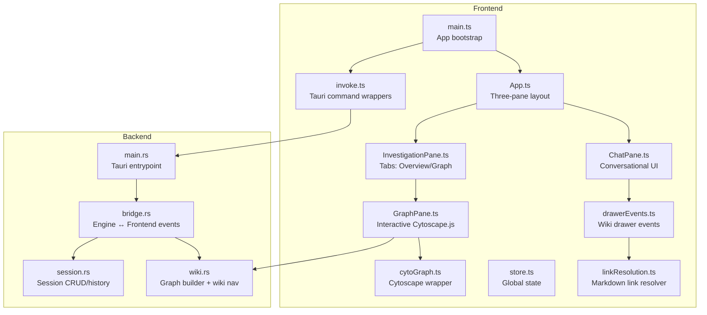
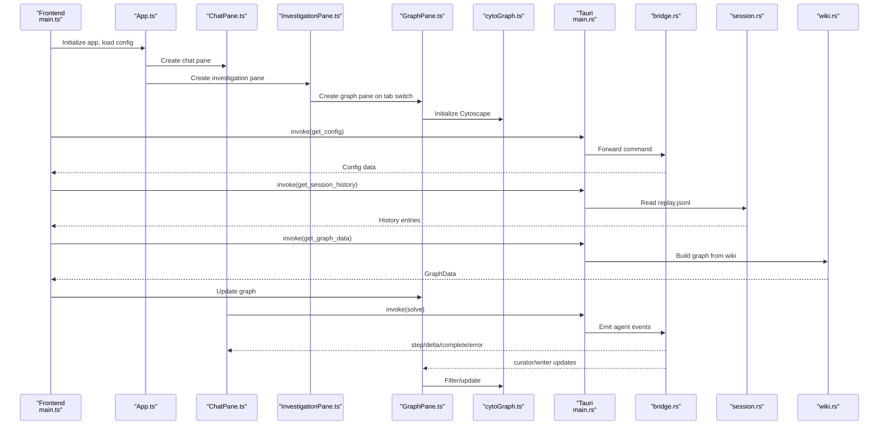
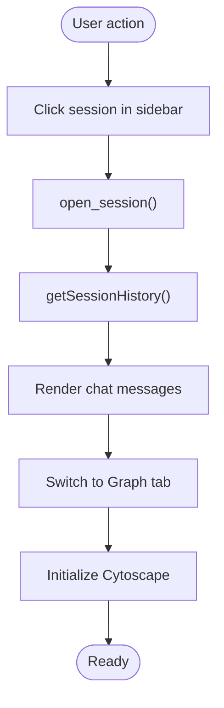
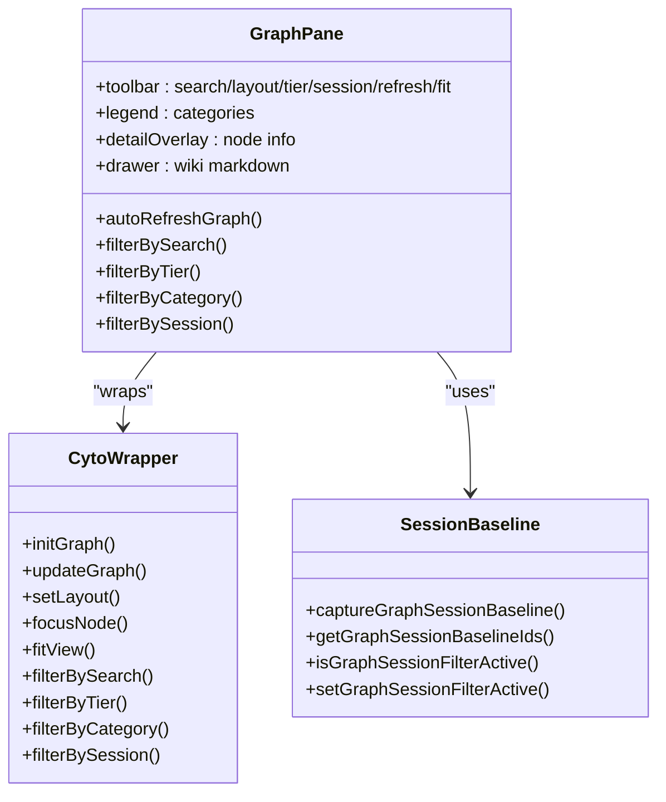
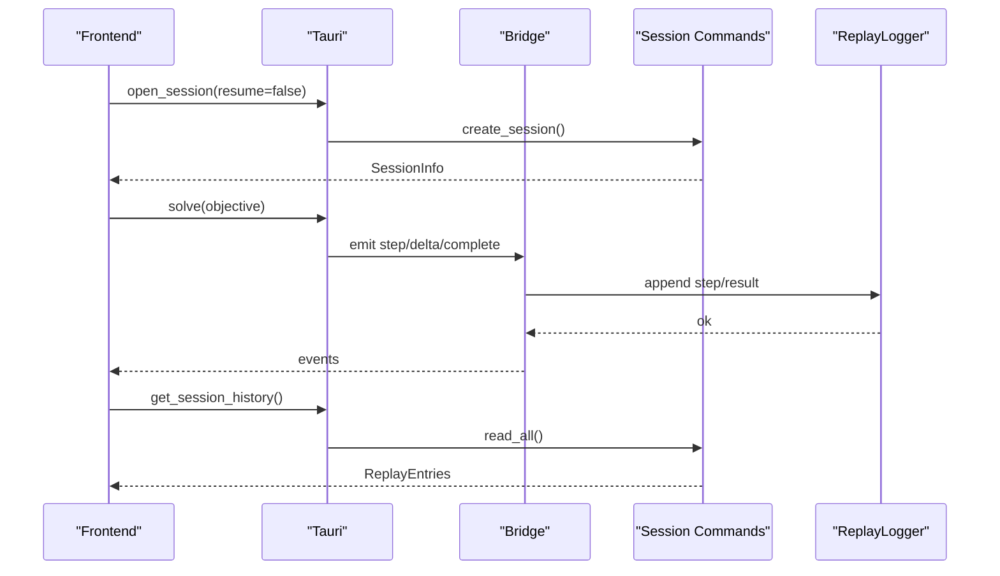
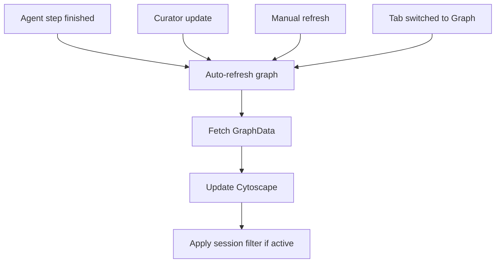
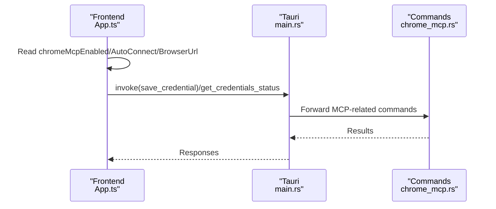
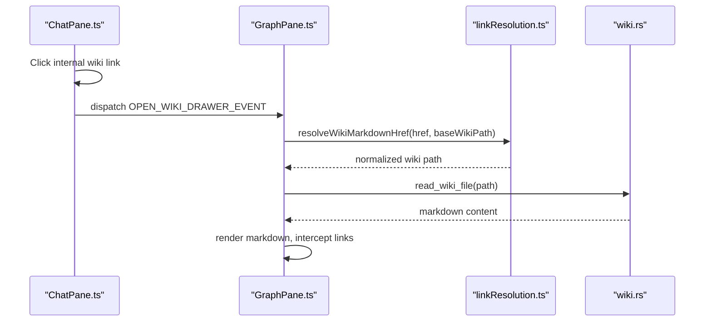
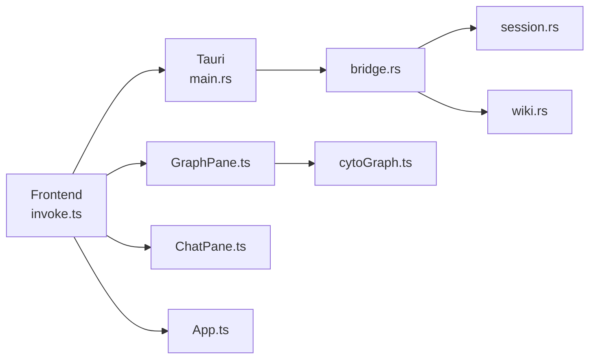

# Desktop Application Guide

<cite>
**Referenced Files in This Document**
- [main.ts](file://openplanter-desktop/frontend/src/main.ts)
- [App.ts](file://openplanter-desktop/frontend/src/components/App.ts)
- [InvestigationPane.ts](file://openplanter-desktop/frontend/src/components/InvestigationPane.ts)
- [ChatPane.ts](file://openplanter-desktop/frontend/src/components/ChatPane.ts)
- [GraphPane.ts](file://openplanter-desktop/frontend/src/components/GraphPane.ts)
- [cytoGraph.ts](file://openplanter-desktop/frontend/src/graph/cytoGraph.ts)
- [store.ts](file://openplanter-desktop/frontend/src/state/store.ts)
- [invoke.ts](file://openplanter-desktop/frontend/src/api/invoke.ts)
- [drawerEvents.ts](file://openplanter-desktop/frontend/src/wiki/drawerEvents.ts)
- [linkResolution.ts](file://openplanter-desktop/frontend/src/wiki/linkResolution.ts)
- [main.rs](file://openplanter-desktop/crates/op-tauri/src/main.rs)
- [bridge.rs](file://openplanter-desktop/crates/op-tauri/src/bridge.rs)
- [session.rs](file://openplanter-desktop/crates/op-tauri/src/commands/session.rs)
- [wiki.rs](file://openplanter-desktop/crates/op-tauri/src/commands/wiki.rs)
</cite>

## Table of Contents
1. [Introduction](#introduction)
2. [Project Structure](#project-structure)
3. [Core Components](#core-components)
4. [Architecture Overview](#architecture-overview)
5. [Detailed Component Analysis](#detailed-component-analysis)
6. [Dependency Analysis](#dependency-analysis)
7. [Performance Considerations](#performance-considerations)
8. [Troubleshooting Guide](#troubleshooting-guide)
9. [Conclusion](#conclusion)

## Introduction
This guide documents the Tauri 2-based desktop application that powers the OpenPlanter investigation interface. It focuses on the three-pane layout (sidebar, chat, and knowledge graph visualization), interactive Cytoscape.js graph with entity categorization and filtering, session persistence and checkpointed wiki synthesis, live graph updates during investigation, Chrome DevTools MCP integration for browser automation, and the wiki source drawer functionality. Practical navigation and interpretation guidance is included, along with troubleshooting and performance optimization tips.

## Project Structure
The desktop application is organized into:
- Frontend (TypeScript/React-like components, Cytoscape.js graph, state management)
- Backend (Tauri commands, Rust bridge, session and wiki graph builders)

**Diagram sources**
- [main.ts:1-340](file://openplanter-desktop/frontend/src/main.ts#L1-L340)
- [App.ts:1-395](file://openplanter-desktop/frontend/src/components/App.ts#L1-L395)
- [ChatPane.ts:1-692](file://openplanter-desktop/frontend/src/components/ChatPane.ts#L1-L692)
- [InvestigationPane.ts:1-128](file://openplanter-desktop/frontend/src/components/InvestigationPane.ts#L1-L128)
- [GraphPane.ts:1-586](file://openplanter-desktop/frontend/src/components/GraphPane.ts#L1-L586)
- [cytoGraph.ts:1-748](file://openplanter-desktop/frontend/src/graph/cytoGraph.ts#L1-L748)
- [store.ts:1-186](file://openplanter-desktop/frontend/src/state/store.ts#L1-L186)
- [invoke.ts:1-131](file://openplanter-desktop/frontend/src/api/invoke.ts#L1-L131)
- [drawerEvents.ts:1-10](file://openplanter-desktop/frontend/src/wiki/drawerEvents.ts#L1-L10)
- [linkResolution.ts:1-49](file://openplanter-desktop/frontend/src/wiki/linkResolution.ts#L1-L49)
- [main.rs:1-51](file://openplanter-desktop/crates/op-tauri/src/main.rs#L1-L51)
- [bridge.rs:1-800](file://openplanter-desktop/crates/op-tauri/src/bridge.rs#L1-L800)
- [session.rs:1-800](file://openplanter-desktop/crates/op-tauri/src/commands/session.rs#L1-L800)
- [wiki.rs:1-800](file://openplanter-desktop/crates/op-tauri/src/commands/wiki.rs#L1-L800)

**Section sources**
- [main.ts:1-340](file://openplanter-desktop/frontend/src/main.ts#L1-L340)
- [App.ts:1-395](file://openplanter-desktop/frontend/src/components/App.ts#L1-L395)
- [main.rs:1-51](file://openplanter-desktop/crates/op-tauri/src/main.rs#L1-L51)

## Core Components
- Three-pane layout:
  - Sidebar: session management (list, create, delete, resume)
  - Chat pane: conversational interface with streaming, markdown rendering, and tool call visualization
  - Investigation pane: tabs for Overview and Graph
- Interactive knowledge graph:
  - Cytoscape.js visualization with entity categorization, node/edge styling, and filtering
  - Live updates driven by agent steps and background wiki updates
- Session persistence:
  - Session creation/resume, history replay, and structured event logging
- Chrome DevTools MCP integration:
  - Browser automation commands exposed to the agent via Tauri
- Wiki source drawer:
  - Slide-out panel for viewing wiki markdown with internal link resolution

**Section sources**
- [App.ts:55-145](file://openplanter-desktop/frontend/src/components/App.ts#L55-L145)
- [ChatPane.ts:243-692](file://openplanter-desktop/frontend/src/components/ChatPane.ts#L243-L692)
- [InvestigationPane.ts:10-128](file://openplanter-desktop/frontend/src/components/InvestigationPane.ts#L10-L128)
- [GraphPane.ts:47-586](file://openplanter-desktop/frontend/src/components/GraphPane.ts#L47-L586)
- [cytoGraph.ts:15-748](file://openplanter-desktop/frontend/src/graph/cytoGraph.ts#L15-L748)
- [store.ts:73-186](file://openplanter-desktop/frontend/src/state/store.ts#L73-L186)
- [invoke.ts:24-131](file://openplanter-desktop/frontend/src/api/invoke.ts#L24-L131)

## Architecture Overview
The desktop app uses Tauri 2 to expose backend commands to the frontend. The Rust bridge translates engine events into frontend events, which drive UI updates and graph refreshes. Sessions are persisted on disk with structured event streams and replay logs.

**Diagram sources**
- [main.ts:85-325](file://openplanter-desktop/frontend/src/main.ts#L85-L325)
- [App.ts:135-145](file://openplanter-desktop/frontend/src/components/App.ts#L135-L145)
- [ChatPane.ts:529-673](file://openplanter-desktop/frontend/src/components/ChatPane.ts#L529-L673)
- [GraphPane.ts:518-573](file://openplanter-desktop/frontend/src/components/GraphPane.ts#L518-L573)
- [main.rs:20-49](file://openplanter-desktop/crates/op-tauri/src/main.rs#L20-L49)
- [bridge.rs:143-246](file://openplanter-desktop/crates/op-tauri/src/bridge.rs#L143-L246)
- [session.rs:514-612](file://openplanter-desktop/crates/op-tauri/src/commands/session.rs#L514-L612)
- [wiki.rs:705-745](file://openplanter-desktop/crates/op-tauri/src/commands/wiki.rs#L705-L745)

## Detailed Component Analysis

### Three-Pane Layout
- Sidebar
  - Lists recent sessions, supports create/delete, and highlights the active session
  - Displays settings and credential status
- Chat Pane
  - Streams model deltas, renders markdown, and shows tool call trees
  - Provides step summaries with tokens and elapsed time
- Investigation Pane
  - Tabs: Overview and Graph
  - Graph pane initializes Cytoscape, applies filters, and handles drawer opening

**Diagram sources**
- [App.ts:147-266](file://openplanter-desktop/frontend/src/components/App.ts#L147-L266)
- [ChatPane.ts:665-673](file://openplanter-desktop/frontend/src/components/ChatPane.ts#L665-L673)
- [InvestigationPane.ts:79-81](file://openplanter-desktop/frontend/src/components/InvestigationPane.ts#L79-L81)

**Section sources**
- [App.ts:55-145](file://openplanter-desktop/frontend/src/components/App.ts#L55-L145)
- [ChatPane.ts:243-692](file://openplanter-desktop/frontend/src/components/ChatPane.ts#L243-L692)
- [InvestigationPane.ts:10-128](file://openplanter-desktop/frontend/src/components/InvestigationPane.ts#L10-L128)

### Interactive Cytoscape.js Knowledge Graph
- Entity categorization and node types
  - Sources, Sections, and Facts with distinct shapes and sizes
  - Category-based colors and edge types (structural, cross-reference, shared-field)
- Filtering capabilities
  - Category toggles, tier filters (all/sources-sections/sources), search matches, and session-filtered “new” nodes
- Interactions
  - Node selection shows detail overlay or opens wiki drawer for source nodes
  - Focus and neighborhood highlighting
- Live updates
  - Auto-refresh on agent steps and curator updates
  - Session baseline captures to highlight newly added nodes

**Diagram sources**
- [GraphPane.ts:47-586](file://openplanter-desktop/frontend/src/components/GraphPane.ts#L47-L586)
- [cytoGraph.ts:335-748](file://openplanter-desktop/frontend/src/graph/cytoGraph.ts#L335-L748)
- [sessionBaseline.ts:95-169](file://openplanter-desktop/frontend/src/graph/sessionBaseline.ts#L95-L169)

**Section sources**
- [GraphPane.ts:47-586](file://openplanter-desktop/frontend/src/components/GraphPane.ts#L47-L586)
- [cytoGraph.ts:15-748](file://openplanter-desktop/frontend/src/graph/cytoGraph.ts#L15-L748)
- [sessionBaseline.ts:1-169](file://openplanter-desktop/frontend/src/graph/sessionBaseline.ts#L1-L169)

### Session Persistence and Checkpointed Wiki Synthesis
- Session lifecycle
  - Create new or resume existing sessions
  - Persist structured events and replay logs
  - Metadata refresh and continuity modes
- Checkpointed synthesis
  - Agent emits step summaries and artifacts
  - Replay entries logged per step and final result
  - Partial runs supported with degraded completion metadata

**Diagram sources**
- [session.rs:524-570](file://openplanter-desktop/crates/op-tauri/src/commands/session.rs#L524-L570)
- [session.rs:603-612](file://openplanter-desktop/crates/op-tauri/src/commands/session.rs#L603-L612)
- [bridge.rs:538-745](file://openplanter-desktop/crates/op-tauri/src/bridge.rs#L538-L745)

**Section sources**
- [session.rs:514-612](file://openplanter-desktop/crates/op-tauri/src/commands/session.rs#L514-L612)
- [bridge.rs:538-745](file://openplanter-desktop/crates/op-tauri/src/bridge.rs#L538-L745)

### Live Graph Updates During Investigation
- Graph refresh triggers
  - On agent step completion
  - On curator background updates
  - On manual refresh and tab activation
- Session-aware visibility
  - Baseline capture on first load
  - “New nodes” filter highlights additions with optional context expansion

**Diagram sources**
- [GraphPane.ts:533-541](file://openplanter-desktop/frontend/src/components/GraphPane.ts#L533-L541)
- [GraphPane.ts:547-573](file://openplanter-desktop/frontend/src/components/GraphPane.ts#L547-L573)
- [cytoGraph.ts:735-740](file://openplanter-desktop/frontend/src/graph/cytoGraph.ts#L735-L740)

**Section sources**
- [GraphPane.ts:518-573](file://openplanter-desktop/frontend/src/components/GraphPane.ts#L518-L573)
- [cytoGraph.ts:663-740](file://openplanter-desktop/frontend/src/graph/cytoGraph.ts#L663-L740)

### Chrome DevTools MCP Integration
- Frontend exposes Chrome MCP settings and status
- Backend integrates MCP commands for browser automation
- Commands are wired into the Tauri command handler

**Diagram sources**
- [App.ts:114-133](file://openplanter-desktop/frontend/src/components/App.ts#L114-L133)
- [main.rs:23-47](file://openplanter-desktop/crates/op-tauri/src/main.rs#L23-L47)

**Section sources**
- [App.ts:114-133](file://openplanter-desktop/frontend/src/components/App.ts#L114-L133)
- [main.rs:23-47](file://openplanter-desktop/crates/op-tauri/src/main.rs#L23-L47)

### Wiki Source Drawer Functionality
- Opening the drawer
  - From chat pane via internal wiki links
  - From graph detail overlay for source nodes
- Drawer behavior
  - Loads markdown content and renders it
  - Intercepts internal links to navigate within the drawer
- Link resolution
  - Resolves relative wiki paths against a base path
  - Normalizes and validates safe wiki URLs

**Diagram sources**
- [ChatPane.ts:256-289](file://openplanter-desktop/frontend/src/components/ChatPane.ts#L256-L289)
- [GraphPane.ts:292-349](file://openplanter-desktop/frontend/src/components/GraphPane.ts#L292-L349)
- [linkResolution.ts:13-49](file://openplanter-desktop/frontend/src/wiki/linkResolution.ts#L13-L49)
- [wiki.rs:737-745](file://openplanter-desktop/crates/op-tauri/src/commands/wiki.rs#L737-L745)

**Section sources**
- [GraphPane.ts:292-349](file://openplanter-desktop/frontend/src/components/GraphPane.ts#L292-L349)
- [linkResolution.ts:13-49](file://openplanter-desktop/frontend/src/wiki/linkResolution.ts#L13-L49)
- [drawerEvents.ts:1-10](file://openplanter-desktop/frontend/src/wiki/drawerEvents.ts#L1-L10)

## Dependency Analysis
- Frontend depends on Tauri invoke wrappers for all backend operations
- GraphPane depends on cytoGraph for rendering and filtering
- Session and wiki graph building are encapsulated in backend commands
- Events flow from Rust bridge to frontend via Tauri events

**Diagram sources**
- [invoke.ts:24-131](file://openplanter-desktop/frontend/src/api/invoke.ts#L24-L131)
- [main.rs:20-49](file://openplanter-desktop/crates/op-tauri/src/main.rs#L20-L49)
- [bridge.rs:143-246](file://openplanter-desktop/crates/op-tauri/src/bridge.rs#L143-L246)
- [session.rs:514-612](file://openplanter-desktop/crates/op-tauri/src/commands/session.rs#L514-L612)
- [wiki.rs:705-745](file://openplanter-desktop/crates/op-tauri/src/commands/wiki.rs#L705-L745)
- [GraphPane.ts:47-586](file://openplanter-desktop/frontend/src/components/GraphPane.ts#L47-L586)
- [cytoGraph.ts:335-748](file://openplanter-desktop/frontend/src/graph/cytoGraph.ts#L335-L748)
- [ChatPane.ts:243-692](file://openplanter-desktop/frontend/src/components/ChatPane.ts#L243-L692)
- [App.ts:55-145](file://openplanter-desktop/frontend/src/components/App.ts#L55-L145)

**Section sources**
- [invoke.ts:24-131](file://openplanter-desktop/frontend/src/api/invoke.ts#L24-L131)
- [main.rs:20-49](file://openplanter-desktop/crates/op-tauri/src/main.rs#L20-L49)
- [bridge.rs:143-246](file://openplanter-desktop/crates/op-tauri/src/bridge.rs#L143-L246)

## Performance Considerations
- Graph rendering
  - Use appropriate layouts (force-directed vs. grouped) based on graph density
  - Debounce search input to reduce filter churn
  - Avoid excessive edge recalculation by syncing edge visibility efficiently
- Streaming UI
  - Limit preview sizes for model text and tool args to control memory
  - Batch DOM updates and use requestAnimationFrame for smooth scrolling
- Session I/O
  - Persist replay logs incrementally; avoid large writes by deferring to background tasks
  - Use incremental graph refresh triggered by agent steps rather than polling

[No sources needed since this section provides general guidance]

## Troubleshooting Guide
- Graph appears blank
  - Ensure wiki index exists and contains valid markdown links
  - Verify session filter is not hiding all nodes; toggle “New nodes only”
- Links inside the wiki drawer do not resolve
  - Confirm the base path normalization and that the target exists under the wiki directory
- Session not loading history
  - Check that replay.jsonl exists for the session and is readable
- Agent errors or rate limits
  - Inspect emitted error events and adjust provider settings or wait before retrying
- Chrome MCP not connecting
  - Verify enabled status, auto-connect setting, and browser URL; check RPC timeouts

**Section sources**
- [GraphPane.ts:518-531](file://openplanter-desktop/frontend/src/components/GraphPane.ts#L518-L531)
- [linkResolution.ts:3-11](file://openplanter-desktop/frontend/src/wiki/linkResolution.ts#L3-L11)
- [session.rs:603-612](file://openplanter-desktop/crates/op-tauri/src/commands/session.rs#L603-L612)
- [bridge.rs:67-118](file://openplanter-desktop/crates/op-tauri/src/bridge.rs#L67-L118)

## Conclusion
The desktop application provides a cohesive three-pane environment for managing investigations, conversing with the agent, and exploring synthesized knowledge through an interactive Cytoscape.js graph. Robust session persistence, live graph updates, and integrated browser automation enable efficient, iterative research workflows. The wiki drawer and link resolution support deep exploration of source materials, while filtering and layout controls help manage complexity.