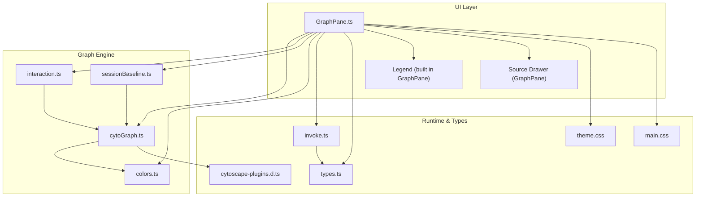
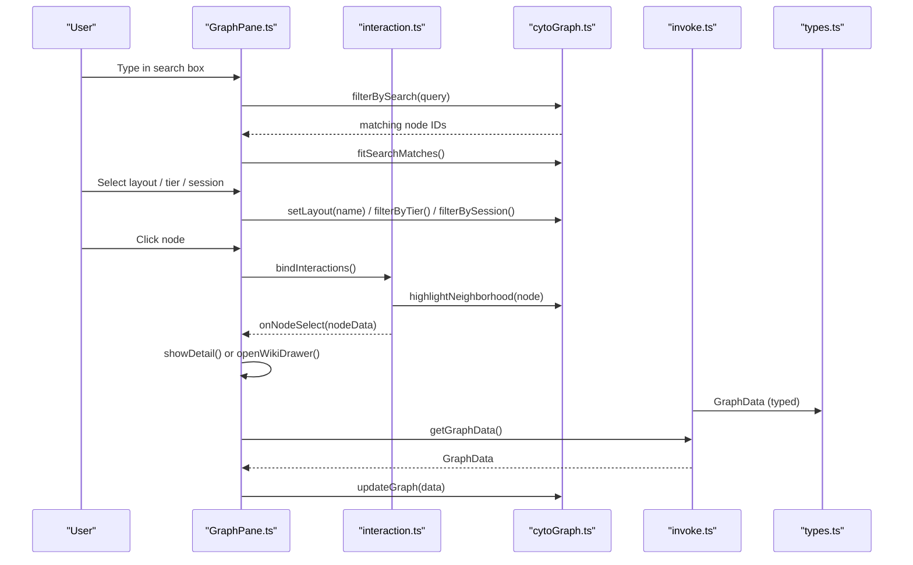
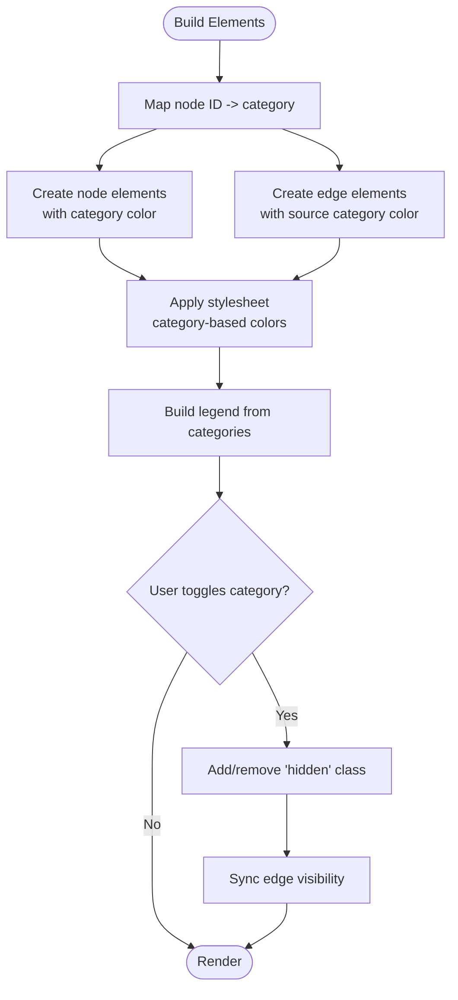
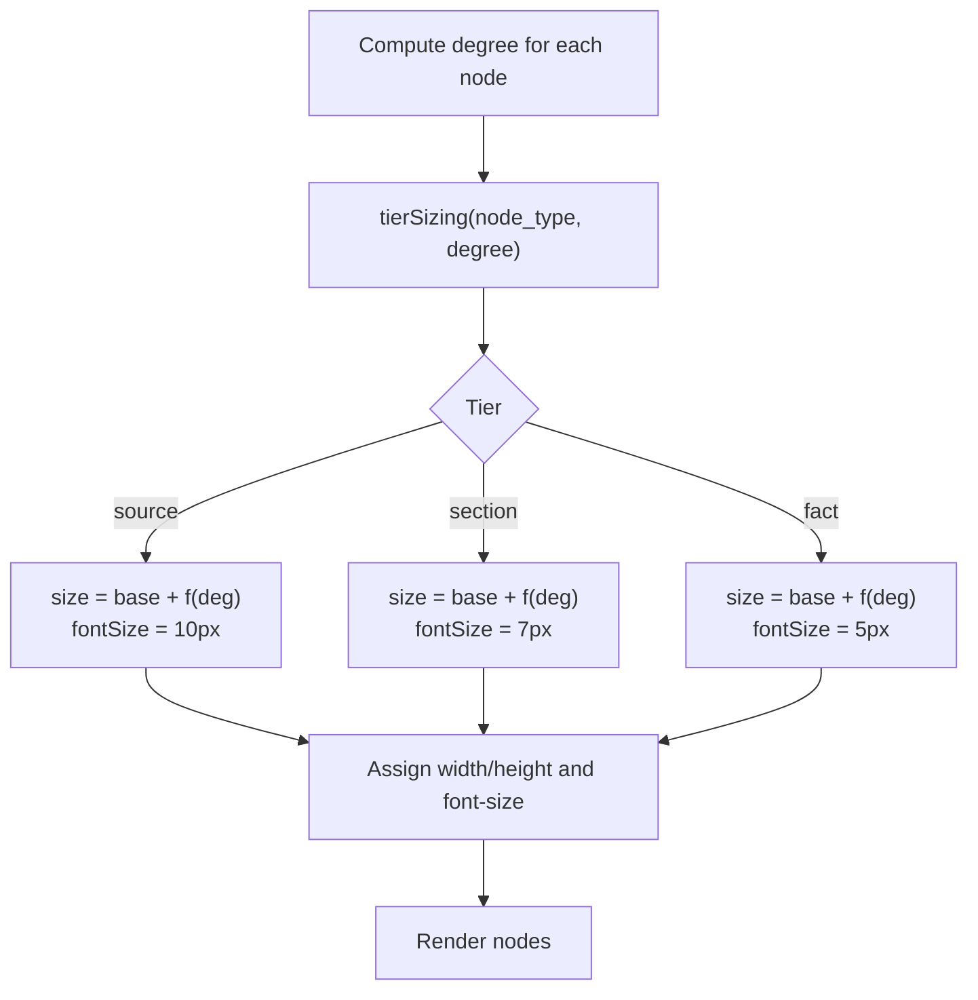
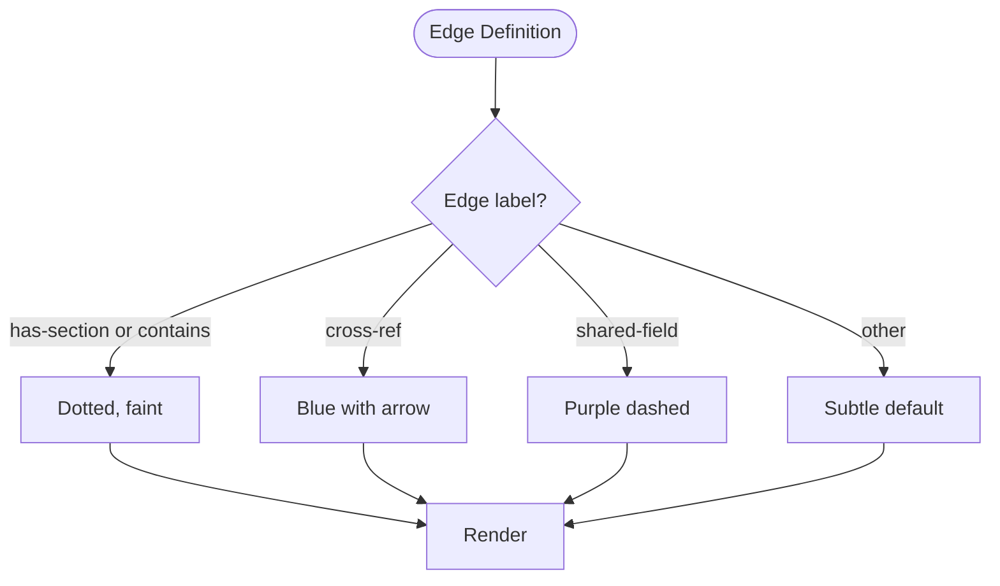
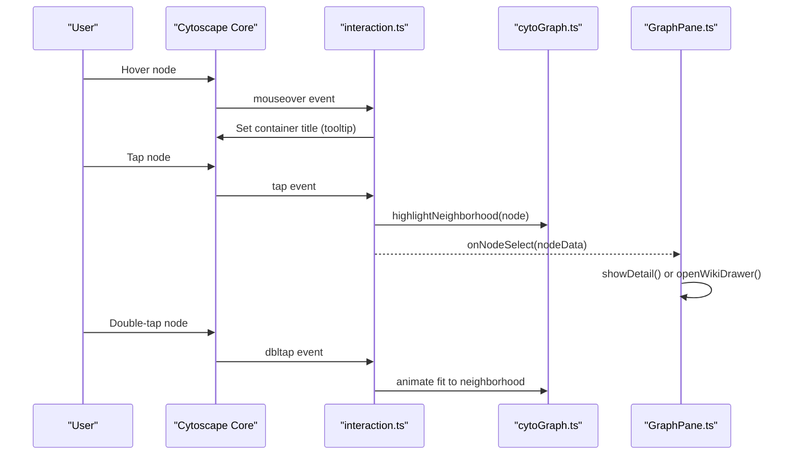
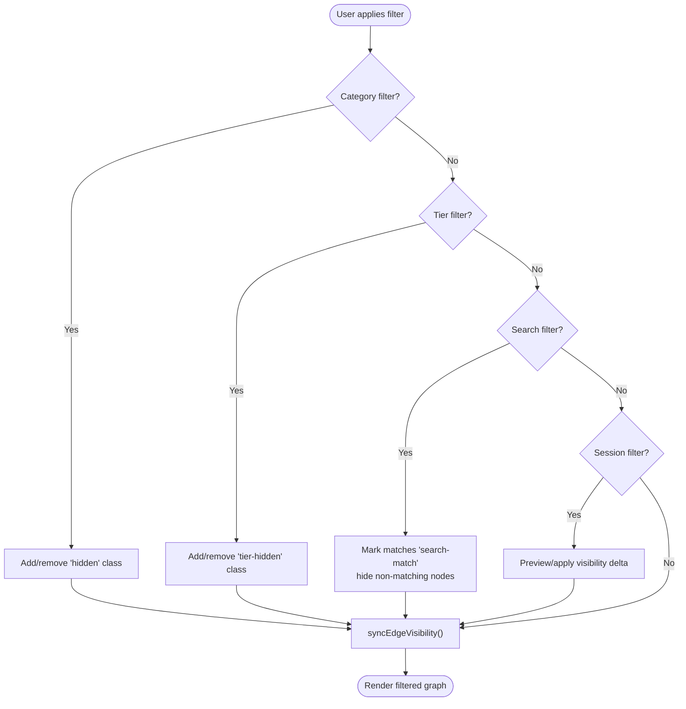
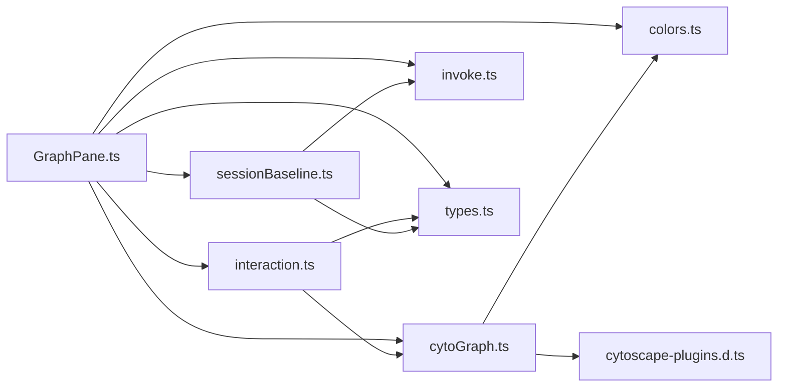

# Knowledge Graph Visualization

<cite>
**Referenced Files in This Document**
- [cytoGraph.ts](file://openplanter-desktop/frontend/src/graph/cytoGraph.ts)
- [interaction.ts](file://openplanter-desktop/frontend/src/graph/interaction.ts)
- [GraphPane.ts](file://openplanter-desktop/frontend/src/components/GraphPane.ts)
- [colors.ts](file://openplanter-desktop/frontend/src/graph/colors.ts)
- [sessionBaseline.ts](file://openplanter-desktop/frontend/src/graph/sessionBaseline.ts)
- [types.ts](file://openplanter-desktop/frontend/src/api/types.ts)
- [invoke.ts](file://openplanter-desktop/frontend/src/api/invoke.ts)
- [theme.css](file://openplanter-desktop/frontend/src/styles/theme.css)
- [main.css](file://openplanter-desktop/frontend/src/styles/main.css)
- [cytoscape-plugins.d.ts](file://openplanter-desktop/frontend/src/graph/cytoscape-plugins.d.ts)
</cite>

## Table of Contents
1. [Introduction](#introduction)
2. [Project Structure](#project-structure)
3. [Core Components](#core-components)
4. [Architecture Overview](#architecture-overview)
5. [Detailed Component Analysis](#detailed-component-analysis)
6. [Dependency Analysis](#dependency-analysis)
7. [Performance Considerations](#performance-considerations)
8. [Troubleshooting Guide](#troubleshooting-guide)
9. [Conclusion](#conclusion)
10. [Appendices](#appendices)

## Introduction
This document describes the knowledge graph visualization system built with Cytoscape.js in the OpenPlanter desktop frontend. It explains how entities are categorized and visually encoded, how node sizes reflect importance, and how edge types communicate relationship semantics. Interactive features include zoom controls, panning, node highlighting, and contextual popups with entity details. Filtering capabilities cover entity type, category, and session-based “new vs. context” views. Practical guidance is provided for interpreting graph patterns, navigating complex investigations, performance optimization for large graphs, memory management, real-time updates, customization of visualization themes, exporting graph data, and integrating with external analysis tools.

## Project Structure
The knowledge graph visualization is implemented as a cohesive unit composed of:
- A Cytoscape.js wrapper that builds and updates the graph, applies layouts, and manages filters and highlights
- Interaction handlers that manage mouse and keyboard events, tooltips, and detail overlays
- A GraphPane component that wires UI controls (toolbar, legend, drawer) to the graph engine
- A session baseline subsystem that tracks new nodes per session and supports “new vs. context” filtering
- Types and API bindings for graph data and runtime operations

**Diagram sources**
- [GraphPane.ts:47-586](file://openplanter-desktop/frontend/src/components/GraphPane.ts#L47-L586)
- [cytoGraph.ts:1-748](file://openplanter-desktop/frontend/src/graph/cytoGraph.ts#L1-L748)
- [interaction.ts:1-112](file://openplanter-desktop/frontend/src/graph/interaction.ts#L1-L112)
- [colors.ts:1-20](file://openplanter-desktop/frontend/src/graph/colors.ts#L1-L20)
- [sessionBaseline.ts:1-169](file://openplanter-desktop/frontend/src/graph/sessionBaseline.ts#L1-L169)
- [invoke.ts:1-131](file://openplanter-desktop/frontend/src/api/invoke.ts#L1-L131)
- [types.ts:87-108](file://openplanter-desktop/frontend/src/api/types.ts#L87-L108)
- [theme.css:1-39](file://openplanter-desktop/frontend/src/styles/theme.css#L1-L39)
- [main.css:1235-1369](file://openplanter-desktop/frontend/src/styles/main.css#L1235-L1369)
- [cytoscape-plugins.d.ts:1-10](file://openplanter-desktop/frontend/src/graph/cytoscape-plugins.d.ts#L1-L10)

**Section sources**
- [GraphPane.ts:47-586](file://openplanter-desktop/frontend/src/components/GraphPane.ts#L47-L586)
- [cytoGraph.ts:1-748](file://openplanter-desktop/frontend/src/graph/cytoGraph.ts#L1-L748)
- [interaction.ts:1-112](file://openplanter-desktop/frontend/src/graph/interaction.ts#L1-L112)
- [colors.ts:1-20](file://openplanter-desktop/frontend/src/graph/colors.ts#L1-L20)
- [sessionBaseline.ts:1-169](file://openplanter-desktop/frontend/src/graph/sessionBaseline.ts#L1-L169)
- [invoke.ts:1-131](file://openplanter-desktop/frontend/src/api/invoke.ts#L1-L131)
- [types.ts:87-108](file://openplanter-desktop/frontend/src/api/types.ts#L87-L108)
- [theme.css:1-39](file://openplanter-desktop/frontend/src/styles/theme.css#L1-L39)
- [main.css:1235-1369](file://openplanter-desktop/frontend/src/styles/main.css#L1235-L1369)
- [cytoscape-plugins.d.ts:1-10](file://openplanter-desktop/frontend/src/graph/cytoscape-plugins.d.ts#L1-L10)

## Core Components
- Cytoscape.js wrapper (cytoGraph.ts)
  - Converts GraphData to Cytoscape elements with tier-based sizing and category colors
  - Applies layout algorithms (force-directed, concentric, hierarchical, circle)
  - Manages zoom, fit-to-view, neighborhood highlighting, and edge visibility synchronization
  - Implements category, tier, search, and session-based filters
- Interaction handlers (interaction.ts)
  - Node click/select, double-click fit, hover tooltip, escape key behavior
  - Bridges graph selections to detail overlays and drawer panels
- GraphPane component (GraphPane.ts)
  - Provides UI controls: search, layout selector, tier filter, session toggle, refresh, fit
  - Builds dynamic legend from categories
  - Opens source drawers for wiki documents and displays compact detail overlays
  - Auto-refreshes graph on agent/tool updates and session changes
- Session baseline (sessionBaseline.ts)
  - Captures baseline node IDs per session and computes “new vs. context” visibility
  - Supports preview and application of visibility deltas
- Colors and theming (colors.ts, theme.css, main.css)
  - Category color palette and CSS variables for consistent theming
  - Node type badges and detail overlay styling
- Types and API (types.ts, invoke.ts)
  - Strongly typed GraphData and GraphNode/Edge interfaces
  - Tauri invoke wrappers for graph data and wiki file reads

**Section sources**
- [cytoGraph.ts:14-210](file://openplanter-desktop/frontend/src/graph/cytoGraph.ts#L14-L210)
- [cytoGraph.ts:211-380](file://openplanter-desktop/frontend/src/graph/cytoGraph.ts#L211-L380)
- [cytoGraph.ts:382-496](file://openplanter-desktop/frontend/src/graph/cytoGraph.ts#L382-L496)
- [cytoGraph.ts:498-747](file://openplanter-desktop/frontend/src/graph/cytoGraph.ts#L498-L747)
- [interaction.ts:10-112](file://openplanter-desktop/frontend/src/graph/interaction.ts#L10-L112)
- [GraphPane.ts:47-586](file://openplanter-desktop/frontend/src/components/GraphPane.ts#L47-L586)
- [sessionBaseline.ts:87-169](file://openplanter-desktop/frontend/src/graph/sessionBaseline.ts#L87-L169)
- [colors.ts:1-20](file://openplanter-desktop/frontend/src/graph/colors.ts#L1-L20)
- [theme.css:1-39](file://openplanter-desktop/frontend/src/styles/theme.css#L1-L39)
- [main.css:1240-1369](file://openplanter-desktop/frontend/src/styles/main.css#L1240-L1369)
- [types.ts:87-108](file://openplanter-desktop/frontend/src/api/types.ts#L87-L108)
- [invoke.ts:92-102](file://openplanter-desktop/frontend/src/api/invoke.ts#L92-L102)

## Architecture Overview
The system follows a layered architecture:
- Presentation layer: GraphPane renders the UI and orchestrates user actions
- Interaction layer: interaction.ts translates user gestures into graph operations
- Graph engine: cytoGraph.ts encapsulates Cytoscape.js lifecycle, styling, layouts, and filters
- State and persistence: sessionBaseline.ts maintains session-aware visibility
- Data and types: invoke.ts and types.ts provide typed access to graph and wiki data

**Diagram sources**
- [GraphPane.ts:157-177](file://openplanter-desktop/frontend/src/components/GraphPane.ts#L157-L177)
- [GraphPane.ts:179-187](file://openplanter-desktop/frontend/src/components/GraphPane.ts#L179-L187)
- [GraphPane.ts:189-217](file://openplanter-desktop/frontend/src/components/GraphPane.ts#L189-L217)
- [GraphPane.ts:483-486](file://openplanter-desktop/frontend/src/components/GraphPane.ts#L483-L486)
- [interaction.ts:24-58](file://openplanter-desktop/frontend/src/graph/interaction.ts#L24-L58)
- [cytoGraph.ts:463-473](file://openplanter-desktop/frontend/src/graph/cytoGraph.ts#L463-L473)
- [cytoGraph.ts:416-421](file://openplanter-desktop/frontend/src/graph/cytoGraph.ts#L416-L421)
- [cytoGraph.ts:509-535](file://openplanter-desktop/frontend/src/graph/cytoGraph.ts#L509-L535)
- [cytoGraph.ts:735-739](file://openplanter-desktop/frontend/src/graph/cytoGraph.ts#L735-L739)
- [invoke.ts:92-102](file://openplanter-desktop/frontend/src/api/invoke.ts#L92-L102)
- [types.ts:105-108](file://openplanter-desktop/frontend/src/api/types.ts#L105-L108)

## Detailed Component Analysis

### Entity Categorization and Color Coding
- Categories are mapped to distinct colors for nodes and edges
- Node color is derived from the category; edge color mirrors the source node’s category
- The legend allows toggling categories on/off

**Diagram sources**
- [cytoGraph.ts:224-268](file://openplanter-desktop/frontend/src/graph/cytoGraph.ts#L224-L268)
- [cytoGraph.ts:446-461](file://openplanter-desktop/frontend/src/graph/cytoGraph.ts#L446-L461)
- [colors.ts:1-20](file://openplanter-desktop/frontend/src/graph/colors.ts#L1-L20)
- [GraphPane.ts:253-282](file://openplanter-desktop/frontend/src/components/GraphPane.ts#L253-L282)

**Section sources**
- [colors.ts:1-20](file://openplanter-desktop/frontend/src/graph/colors.ts#L1-L20)
- [cytoGraph.ts:224-268](file://openplanter-desktop/frontend/src/graph/cytoGraph.ts#L224-L268)
- [cytoGraph.ts:446-461](file://openplanter-desktop/frontend/src/graph/cytoGraph.ts#L446-L461)
- [GraphPane.ts:253-282](file://openplanter-desktop/frontend/src/components/GraphPane.ts#L253-L282)

### Node Sizing Based on Importance
- Node size scales with the square root of degree (connectivity) plus a base size
- Different base sizes and font sizes are applied per node tier (source, section, fact)
- This emphasizes hubs and improves readability

**Diagram sources**
- [cytoGraph.ts:224-222](file://openplanter-desktop/frontend/src/graph/cytoGraph.ts#L224-L222)
- [cytoGraph.ts:211-222](file://openplanter-desktop/frontend/src/graph/cytoGraph.ts#L211-L222)

**Section sources**
- [cytoGraph.ts:211-222](file://openplanter-desktop/frontend/src/graph/cytoGraph.ts#L211-L222)
- [cytoGraph.ts:224-268](file://openplanter-desktop/frontend/src/graph/cytoGraph.ts#L224-L268)

### Relationship Edge Types
- Default edges are subtle and semi-transparent
- Structural edges (e.g., “has-section”, “contains”) are dotted and faint
- Cross-reference edges are blue with arrows
- Shared-field edges are purple dashed
- Highlighted edges become more prominent when neighborhood is selected

**Diagram sources**
- [cytoGraph.ts:89-143](file://openplanter-desktop/frontend/src/graph/cytoGraph.ts#L89-L143)

**Section sources**
- [cytoGraph.ts:89-143](file://openplanter-desktop/frontend/src/graph/cytoGraph.ts#L89-L143)

### Interactive Features
- Zoom and fit
  - Min/max zoom and wheel sensitivity configured
  - Fit-to-view and fit-to-search-matches animations
- Panning and navigation
  - Pan handled by Cytoscape.js; focus on a node centers and zooms in
- Node highlighting
  - Neighborhood highlighting with dimming of non-selected nodes
  - Selected node receives a distinct border
- Contextual popups
  - Hover tooltips show label, category, and connection count
  - Clicking a node selects it, shows neighborhood, and opens detail overlay or source drawer
  - Double-click fits to neighborhood

**Diagram sources**
- [interaction.ts:79-111](file://openplanter-desktop/frontend/src/graph/interaction.ts#L79-L111)
- [cytoGraph.ts:475-491](file://openplanter-desktop/frontend/src/graph/cytoGraph.ts#L475-L491)
- [GraphPane.ts:351-462](file://openplanter-desktop/frontend/src/components/GraphPane.ts#L351-L462)

**Section sources**
- [interaction.ts:79-111](file://openplanter-desktop/frontend/src/graph/interaction.ts#L79-L111)
- [cytoGraph.ts:382-409](file://openplanter-desktop/frontend/src/graph/cytoGraph.ts#L382-L409)
- [cytoGraph.ts:475-491](file://openplanter-desktop/frontend/src/graph/cytoGraph.ts#L475-L491)
- [GraphPane.ts:351-462](file://openplanter-desktop/frontend/src/components/GraphPane.ts#L351-L462)

### Filtering Capabilities
- Category filter
  - Toggle categories on/off via legend; edges inherit hidden state if either endpoint is hidden
- Tier filter
  - “All tiers”, “Sources + Sections”, “Sources only”
- Search filter
  - Case-insensitive substring match on label, category, or content
  - Matches remain visible; edges connect to matches are also shown
- Session filter (“new vs. context”)
  - Tracks baseline node IDs; shows newly added nodes and their 1-hop neighbors
  - Visual cues: “new-node” vs. “session-context”; session hint indicates counts

**Diagram sources**
- [cytoGraph.ts:426-444](file://openplanter-desktop/frontend/src/graph/cytoGraph.ts#L426-L444)
- [cytoGraph.ts:446-461](file://openplanter-desktop/frontend/src/graph/cytoGraph.ts#L446-L461)
- [cytoGraph.ts:509-535](file://openplanter-desktop/frontend/src/graph/cytoGraph.ts#L509-L535)
- [cytoGraph.ts:537-583](file://openplanter-desktop/frontend/src/graph/cytoGraph.ts#L537-L583)
- [cytoGraph.ts:663-739](file://openplanter-desktop/frontend/src/graph/cytoGraph.ts#L663-L739)
- [GraphPane.ts:253-282](file://openplanter-desktop/frontend/src/components/GraphPane.ts#L253-L282)
- [GraphPane.ts:157-177](file://openplanter-desktop/frontend/src/components/GraphPane.ts#L157-L177)
- [GraphPane.ts:189-217](file://openplanter-desktop/frontend/src/components/GraphPane.ts#L189-L217)

**Section sources**
- [cytoGraph.ts:426-444](file://openplanter-desktop/frontend/src/graph/cytoGraph.ts#L426-L444)
- [cytoGraph.ts:446-461](file://openplanter-desktop/frontend/src/graph/cytoGraph.ts#L446-L461)
- [cytoGraph.ts:509-535](file://openplanter-desktop/frontend/src/graph/cytoGraph.ts#L509-L535)
- [cytoGraph.ts:537-583](file://openplanter-desktop/frontend/src/graph/cytoGraph.ts#L537-L583)
- [cytoGraph.ts:663-739](file://openplanter-desktop/frontend/src/graph/cytoGraph.ts#L663-L739)
- [GraphPane.ts:253-282](file://openplanter-desktop/frontend/src/components/GraphPane.ts#L253-L282)
- [GraphPane.ts:157-177](file://openplanter-desktop/frontend/src/components/GraphPane.ts#L157-L177)
- [GraphPane.ts:189-217](file://openplanter-desktop/frontend/src/components/GraphPane.ts#L189-L217)

### Practical Interpretation and Navigation
- Identifying key relationships
  - Look for hubs (large nodes) and shared connections; use neighborhood highlighting to explore
  - Pay attention to edge types: cross-ref edges indicate explicit references; structural edges show containment
- Navigating complex investigations
  - Use “Sources + Sections” to focus on authoritative sources and top-level sections
  - Enable session filter to track new findings and their immediate context
  - Search for terms to quickly locate relevant nodes and center the view
- Real-time updates
  - Graph auto-refreshes after agent steps and curator updates
  - Use the refresh button to manually pull the latest data

**Section sources**
- [GraphPane.ts:518-541](file://openplanter-desktop/frontend/src/components/GraphPane.ts#L518-L541)
- [GraphPane.ts:219-246](file://openplanter-desktop/frontend/src/components/GraphPane.ts#L219-L246)

## Dependency Analysis
The system exhibits clear separation of concerns:
- GraphPane depends on cytoGraph, interaction, sessionBaseline, colors, invoke, and types
- cytoGraph depends on colors and Cytoscape plugins
- interaction depends on cytoGraph and types
- sessionBaseline depends on invoke and types

**Diagram sources**
- [GraphPane.ts:1-31](file://openplanter-desktop/frontend/src/components/GraphPane.ts#L1-L31)
- [cytoGraph.ts:1-9](file://openplanter-desktop/frontend/src/graph/cytoGraph.ts#L1-L9)
- [interaction.ts:1-8](file://openplanter-desktop/frontend/src/graph/interaction.ts#L1-L8)
- [sessionBaseline.ts:1](file://openplanter-desktop/frontend/src/graph/sessionBaseline.ts#L1)
- [invoke.ts:1-22](file://openplanter-desktop/frontend/src/api/invoke.ts#L1-L22)
- [types.ts:1-10](file://openplanter-desktop/frontend/src/api/types.ts#L1-L10)
- [cytoscape-plugins.d.ts:1-10](file://openplanter-desktop/frontend/src/graph/cytoscape-plugins.d.ts#L1-L10)

**Section sources**
- [GraphPane.ts:1-31](file://openplanter-desktop/frontend/src/components/GraphPane.ts#L1-L31)
- [cytoGraph.ts:1-9](file://openplanter-desktop/frontend/src/graph/cytoGraph.ts#L1-L9)
- [interaction.ts:1-8](file://openplanter-desktop/frontend/src/graph/interaction.ts#L1-L8)
- [sessionBaseline.ts:1](file://openplanter-desktop/frontend/src/graph/sessionBaseline.ts#L1)
- [invoke.ts:1-22](file://openplanter-desktop/frontend/src/api/invoke.ts#L1-L22)
- [types.ts:1-10](file://openplanter-desktop/frontend/src/api/types.ts#L1-L10)
- [cytoscape-plugins.d.ts:1-10](file://openplanter-desktop/frontend/src/graph/cytoscape-plugins.d.ts#L1-L10)

## Performance Considerations
- Efficient updates
  - Diff-update removes old elements and adds new ones; re-runs the current layout
  - Avoid full re-initialization when data changes
- Large graph optimization
  - Prefer “concentric” layout when edges are sparse or absent
  - Use tier filters to reduce clutter during exploration
  - Limit simultaneous animations (fit and highlight) to prevent jank
- Memory management
  - Clean up ResizeObserver and destroy Cytoscape instance on unmount
  - Avoid retaining references to removed nodes/edges
- Real-time updates
  - Debounce search input (200 ms) to avoid excessive filtering
  - Batch UI updates (legend rebuild, session hints) after filtering

**Section sources**
- [cytoGraph.ts:361-368](file://openplanter-desktop/frontend/src/graph/cytoGraph.ts#L361-L368)
- [cytoGraph.ts:370-380](file://openplanter-desktop/frontend/src/graph/cytoGraph.ts#L370-L380)
- [GraphPane.ts:157-177](file://openplanter-desktop/frontend/src/components/GraphPane.ts#L157-L177)

## Troubleshooting Guide
- Graph does not appear
  - Verify GraphData contains nodes; GraphPane shows a placeholder when empty
  - Ensure invoke.getGraphData resolves and returns non-empty data
- Filters not working
  - Confirm cy instance exists before applying filters
  - For category filter, ensure hidden classes propagate to edges via syncEdgeVisibility
- Tooltips not showing
  - Container title is set on hover; ensure mouseover events fire and container is accessible
- Session filter shows zero new
  - Baseline may not be captured yet; wait for initialization or trigger manual refresh
- Layout issues
  - If no edges exist, default layout switches to concentric; verify getCurrentLayout and setLayout accordingly

**Section sources**
- [GraphPane.ts:504-516](file://openplanter-desktop/frontend/src/components/GraphPane.ts#L504-L516)
- [invoke.ts:92-102](file://openplanter-desktop/frontend/src/api/invoke.ts#L92-L102)
- [interaction.ts:79-102](file://openplanter-desktop/frontend/src/graph/interaction.ts#L79-L102)
- [cytoGraph.ts:426-444](file://openplanter-desktop/frontend/src/graph/cytoGraph.ts#L426-L444)
- [cytoGraph.ts:326-333](file://openplanter-desktop/frontend/src/graph/cytoGraph.ts#L326-L333)
- [GraphPane.ts:480](file://openplanter-desktop/frontend/src/components/GraphPane.ts#L480)

## Conclusion
The knowledge graph visualization leverages Cytoscape.js to deliver an interactive, filterable, and real-time view of investigative knowledge. Entities are clearly categorized and sized by importance, edges encode relationship semantics, and robust interaction patterns support deep exploration. The session-aware “new vs. context” filter aids iterative investigations, while performance-conscious update strategies keep large graphs usable. With strong typing and modular components, the system is maintainable and extensible for future enhancements.

## Appendices

### Customizing Visualization Themes
- Category colors
  - Adjust CATEGORY_COLORS in colors.ts to change node/edge hues
- CSS variables
  - Modify theme.css variables for background, borders, and accent colors
- Node type styling
  - Update styles for node types (source, section, fact) in cytoGraph.ts stylesheet
- Detail overlay and badges
  - Customize colors and typography in main.css for node type badges and detail panels

**Section sources**
- [colors.ts:1-20](file://openplanter-desktop/frontend/src/graph/colors.ts#L1-L20)
- [theme.css:1-39](file://openplanter-desktop/frontend/src/styles/theme.css#L1-L39)
- [cytoGraph.ts:14-88](file://openplanter-desktop/frontend/src/graph/cytoGraph.ts#L14-L88)
- [main.css:1240-1281](file://openplanter-desktop/frontend/src/styles/main.css#L1240-L1281)

### Exporting Graph Data
- Current implementation exposes GraphData via invoke.getGraphData
- To export, call getGraphData and persist the returned nodes and edges to a file or send to a backend service
- Consider serializing to JSON for portability

**Section sources**
- [invoke.ts:92-102](file://openplanter-desktop/frontend/src/api/invoke.ts#L92-L102)
- [types.ts:105-108](file://openplanter-desktop/frontend/src/api/types.ts#L105-L108)

### Integrating with External Analysis Tools
- Use the node ID and path metadata to link to external tools
- The detail overlay and drawer provide programmatic access to node data and source documents
- For external graph formats, convert GraphData to your target schema using the node and edge structures

**Section sources**
- [GraphPane.ts:351-462](file://openplanter-desktop/frontend/src/components/GraphPane.ts#L351-L462)
- [types.ts:89-103](file://openplanter-desktop/frontend/src/api/types.ts#L89-L103)