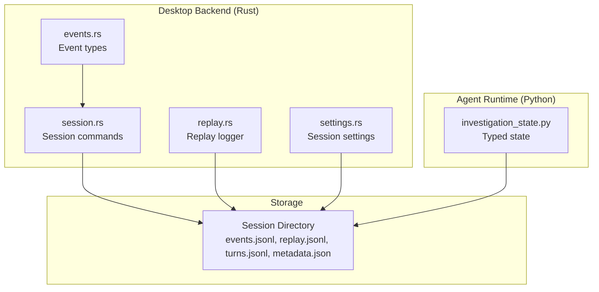
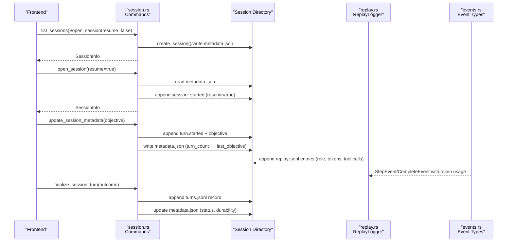
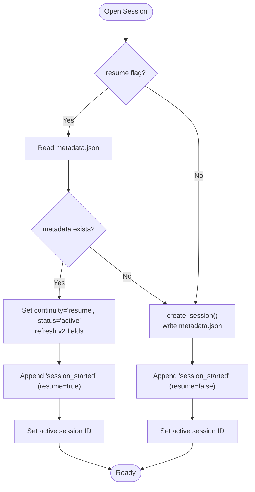
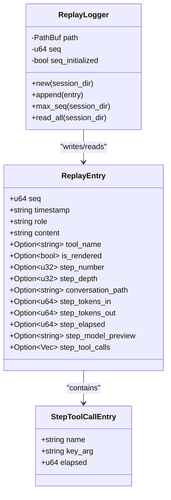
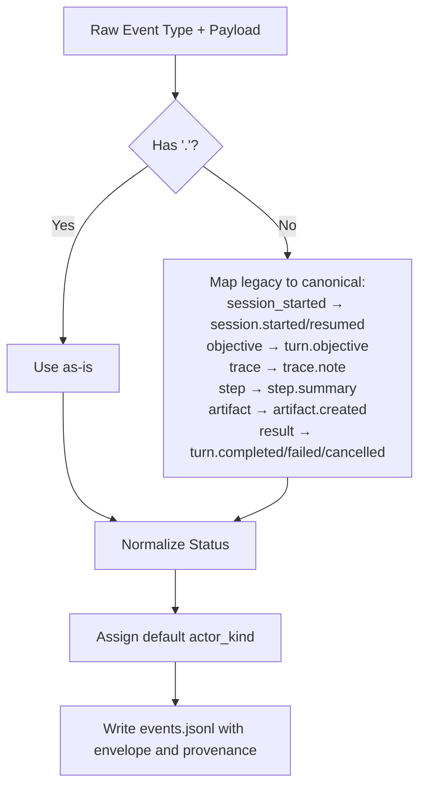
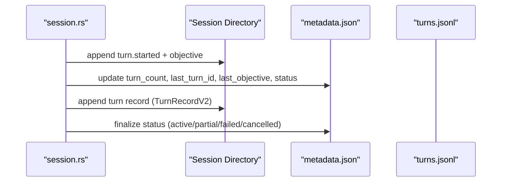
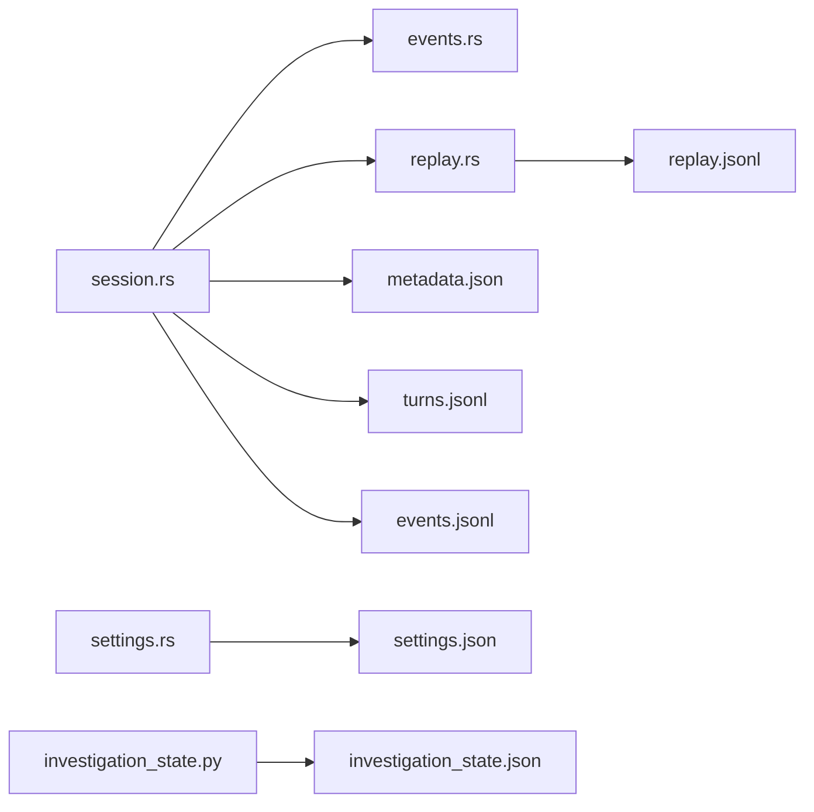

# Session Management and Persistence

<cite>
**Referenced Files in This Document**
- [session.rs](file://openplanter-desktop/crates/op-tauri/src/commands/session.rs)
- [replay.rs](file://openplanter-desktop/crates/op-core/src/session/replay.rs)
- [settings.rs](file://openplanter-desktop/crates/op-core/src/session/settings.rs)
- [events.rs](file://openplanter-desktop/crates/op-core/src/events.rs)
- [test_session.py](file://tests/test_session.py)
- [investigation_state.py](file://agent/investigation_state.py)
</cite>

## Table of Contents
1. [Introduction](#introduction)
2. [Project Structure](#project-structure)
3. [Core Components](#core-components)
4. [Architecture Overview](#architecture-overview)
5. [Detailed Component Analysis](#detailed-component-analysis)
6. [Dependency Analysis](#dependency-analysis)
7. [Performance Considerations](#performance-considerations)
8. [Troubleshooting Guide](#troubleshooting-guide)
9. [Conclusion](#conclusion)

## Introduction
This document explains session management and persistence for the checkpointed investigation workflow. It covers the complete lifecycle from session creation to completion, including automatic checkpointing, resume capability, and data recovery. It documents the session list interface (creation, deletion, selection), message history preservation, token usage tracking, and progress metrics. Practical examples demonstrate creating new investigations, resuming interrupted work, and managing multiple concurrent sessions. Session metadata (timestamps, objectives, performance statistics) and troubleshooting guidance for session corruption, recovery, and data export are included.

## Project Structure
The session management system spans both the desktop Rust backend and Python agent runtime:
- Desktop backend (Rust): session lifecycle, event tracing, replay logging, and metadata management
- Agent runtime (Python): typed investigation state, legacy compatibility, and integration with desktop session logs
- Tests: validate checkpointing, resume behavior, and recovery from corrupted state

**Diagram sources**
- [session.rs:1-1386](file://openplanter-desktop/crates/op-tauri/src/commands/session.rs#L1-L1386)
- [replay.rs:1-1024](file://openplanter-desktop/crates/op-core/src/session/replay.rs#L1-L1024)
- [events.rs:1-731](file://openplanter-desktop/crates/op-core/src/events.rs#L1-L731)
- [settings.rs:1-97](file://openplanter-desktop/crates/op-core/src/session/settings.rs#L1-L97)
- [investigation_state.py:1-1108](file://agent/investigation_state.py#L1-L1108)

**Section sources**
- [session.rs:1-1386](file://openplanter-desktop/crates/op-tauri/src/commands/session.rs#L1-L1386)
- [replay.rs:1-1024](file://openplanter-desktop/crates/op-core/src/session/replay.rs#L1-L1024)
- [events.rs:1-731](file://openplanter-desktop/crates/op-core/src/events.rs#L1-L731)
- [settings.rs:1-97](file://openplanter-desktop/crates/op-core/src/session/settings.rs#L1-L97)
- [investigation_state.py:1-1108](file://agent/investigation_state.py#L1-L1108)

## Core Components
- Session commands: create, open (new or resume), delete, list, and manage turn records
- Replay logger: append-only JSONL log of message history with token usage and tool call details
- Event envelope: canonical event types, statuses, and failure taxonomy
- Session metadata: schema versioning, capabilities, durability flags, and provenance links
- Session settings: per-session overrides for provider/model and runtime parameters
- Typed investigation state: canonical state model for structured reasoning and legacy migration

Key responsibilities:
- Enforce durable, append-only logs for auditability and recovery
- Normalize event types and statuses for consistent UI rendering
- Track per-turn outcomes, tool usage, and performance metrics
- Support safe resume from partial sessions and degrade gracefully on failures

**Section sources**
- [session.rs:347-785](file://openplanter-desktop/crates/op-tauri/src/commands/session.rs#L347-L785)
- [replay.rs:1-143](file://openplanter-desktop/crates/op-core/src/session/replay.rs#L1-L143)
- [events.rs:388-421](file://openplanter-desktop/crates/op-core/src/events.rs#L388-L421)
- [settings.rs:1-50](file://openplanter-desktop/crates/op-core/src/session/settings.rs#L1-L50)
- [investigation_state.py:35-68](file://agent/investigation_state.py#L35-L68)

## Architecture Overview
The session lifecycle integrates desktop commands, replay logging, and typed state:

**Diagram sources**
- [session.rs:514-785](file://openplanter-desktop/crates/op-tauri/src/commands/session.rs#L514-L785)
- [replay.rs:56-143](file://openplanter-desktop/crates/op-core/src/session/replay.rs#L56-L143)
- [events.rs:12-27](file://openplanter-desktop/crates/op-core/src/events.rs#L12-L27)

## Detailed Component Analysis

### Session Lifecycle and Commands
- Creation: generates a unique session ID, creates artifacts directory, initializes metadata, and writes metadata.json
- Resume: validates metadata presence, updates continuity mode, appends session_started event, and sets active session
- Deletion: removes session directory after safety checks
- Listing: scans sessions directory, reads metadata.json, and sorts by created_at
- Turn management: starts a turn by emitting lifecycle events and updating metadata; finalizes by writing a turn record and updating status

**Diagram sources**
- [session.rs:524-570](file://openplanter-desktop/crates/op-tauri/src/commands/session.rs#L524-L570)

**Section sources**
- [session.rs:388-570](file://openplanter-desktop/crates/op-tauri/src/commands/session.rs#L388-L570)
- [session.rs:572-600](file://openplanter-desktop/crates/op-tauri/src/commands/session.rs#L572-L600)
- [session.rs:513-522](file://openplanter-desktop/crates/op-tauri/src/commands/session.rs#L513-L522)

### Message History Preservation and Replay
- Replay entries capture roles, content previews, token usage, elapsed time, and tool call summaries
- Legacy compatibility: adapts older header/call events and enveloped entries into unified replay format
- Append-only design: ensures immutable history for reliable reload and UI rendering

**Diagram sources**
- [replay.rs:12-53](file://openplanter-desktop/crates/op-core/src/session/replay.rs#L12-L53)

**Section sources**
- [replay.rs:118-143](file://openplanter-desktop/crates/op-core/src/session/replay.rs#L118-L143)
- [replay.rs:282-359](file://openplanter-desktop/crates/op-core/src/session/replay.rs#L282-L359)

### Event Envelope, Canonical Types, and Failure Taxonomy
- Canonical event types normalize legacy and new event shapes
- Status normalization handles terminal outcomes (completed, failed, cancelled, partial)
- FailureInfo captures structured failure metadata for UI and diagnostics

**Diagram sources**
- [session.rs:818-893](file://openplanter-desktop/crates/op-tauri/src/commands/session.rs#L818-L893)
- [session.rs:861-884](file://openplanter-desktop/crates/op-tauri/src/commands/session.rs#L861-L884)

**Section sources**
- [session.rs:28-81](file://openplanter-desktop/crates/op-tauri/src/commands/session.rs#L28-L81)
- [session.rs:818-893](file://openplanter-desktop/crates/op-tauri/src/commands/session.rs#L818-L893)
- [session.rs:861-884](file://openplanter-desktop/crates/op-tauri/src/commands/session.rs#L861-L884)

### Turn Records and Outcome Tracking
- Turn records capture continuity, inputs/outputs, execution metrics, and provenance spans
- Outcome includes status, failure code, summary, and event/replay span references
- Metadata updated with turn count, last turn ID/objective, and session status

**Diagram sources**
- [session.rs:614-785](file://openplanter-desktop/crates/op-tauri/src/commands/session.rs#L614-L785)

**Section sources**
- [session.rs:276-346](file://openplanter-desktop/crates/op-tauri/src/commands/session.rs#L276-L346)
- [session.rs:698-785](file://openplanter-desktop/crates/op-tauri/src/commands/session.rs#L698-L785)

### Session Settings and Overrides
- SessionSettings allows overriding provider, model, reasoning effort, recursion, and step limits
- Saved to settings.json and merged with global defaults at runtime

**Section sources**
- [settings.rs:10-50](file://openplanter-desktop/crates/op-core/src/session/settings.rs#L10-L50)

### Typed Investigation State and Legacy Migration
- Typed state defines canonical schema for questions, claims, evidence, and reasoning
- Legacy migration normalizes external observations and turn history into typed projections
- Tests verify resume behavior and fallback to legacy state when typed state is invalid

**Section sources**
- [investigation_state.py:35-68](file://agent/investigation_state.py#L35-L68)
- [investigation_state.py:88-107](file://agent/investigation_state.py#L88-L107)
- [test_session.py:144-206](file://tests/test_session.py#L144-L206)

## Dependency Analysis
- session.rs depends on events.rs for canonical event types and status normalization
- replay.rs depends on tokio filesystem for async IO and serde for JSON serialization
- settings.rs provides per-session overrides integrated with global configuration
- investigation_state.py provides typed state for reasoning and legacy compatibility

**Diagram sources**
- [session.rs:1-15](file://openplanter-desktop/crates/op-tauri/src/commands/session.rs#L1-L15)
- [replay.rs:6-10](file://openplanter-desktop/crates/op-core/src/session/replay.rs#L6-L10)
- [settings.rs:3-5](file://openplanter-desktop/crates/op-core/src/session/settings.rs#L3-L5)
- [events.rs:4-4](file://openplanter-desktop/crates/op-core/src/events.rs#L4-L4)

**Section sources**
- [session.rs:1-15](file://openplanter-desktop/crates/op-tauri/src/commands/session.rs#L1-L15)
- [replay.rs:6-10](file://openplanter-desktop/crates/op-core/src/session/replay.rs#L6-L10)
- [settings.rs:3-5](file://openplanter-desktop/crates/op-core/src/session/settings.rs#L3-L5)
- [events.rs:4-4](file://openplanter-desktop/crates/op-core/src/events.rs#L4-L4)

## Performance Considerations
- Append-only logs minimize random writes; replay and event files grow linearly
- Replay logger tracks sequence numbers and auto-fills missing timestamps to avoid repeated scans
- Turn records are compact JSONL entries; provenance spans enable efficient UI rendering without full reprocessing
- Metadata refresh updates durability flags and capabilities without rewriting entire state

## Troubleshooting Guide
Common issues and recovery procedures:
- Session not found or not a directory: deletion checks ensure metadata presence and directory validity
- Corrupted typed state: runtime preserves the corrupt file and falls back to legacy state; tests confirm warnings and continued operation
- Malformed replay lines: replay reader skips invalid lines and continues loading valid entries
- Resume from partial: metadata status "partial" triggers a notice event; turn continuity resumes from last turn ID

Practical steps:
- Verify session directory contains metadata.json and expected log files
- Inspect events.jsonl and replay.jsonl for canonical event types and timestamps
- Check turns.jsonl for turn records and provenance spans
- Export session data by copying the session directory to another location

**Section sources**
- [session.rs:572-600](file://openplanter-desktop/crates/op-tauri/src/commands/session.rs#L572-L600)
- [test_session.py:251-291](file://tests/test_session.py#L251-L291)
- [replay.rs:118-143](file://openplanter-desktop/crates/op-core/src/session/replay.rs#L118-L143)

## Conclusion
The session management system provides a robust, durable foundation for investigation workflows. It enforces checkpointed persistence, supports seamless resume, and preserves message history with rich metadata. The combination of canonical event envelopes, replay logging, and typed state ensures reliable recovery, transparent progress tracking, and a consistent user experience across interruptions and upgrades.