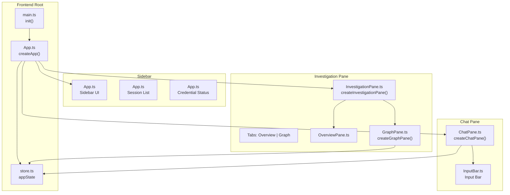
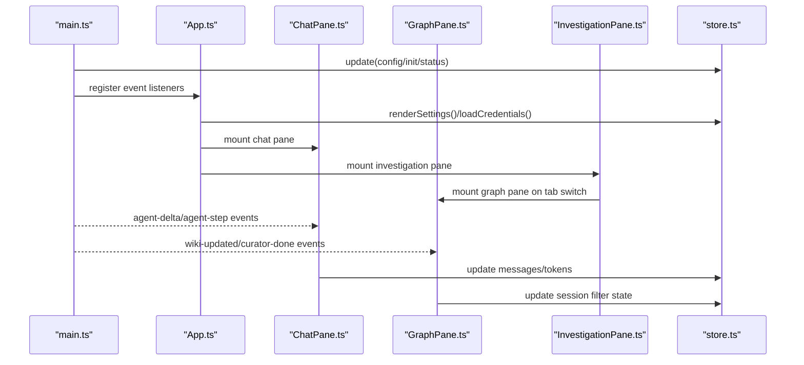
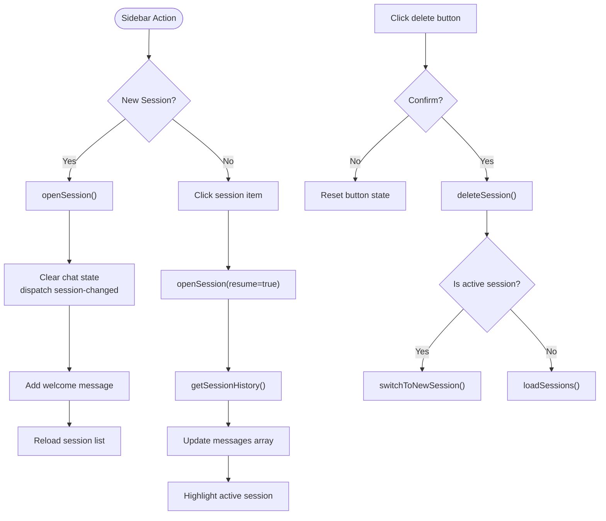
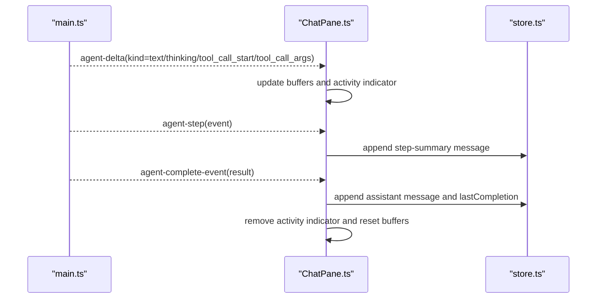
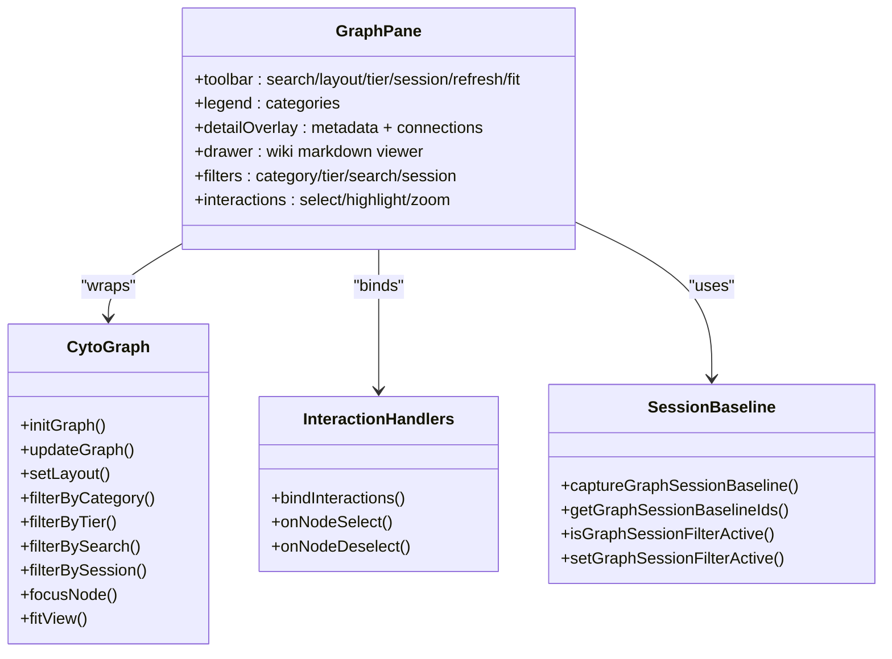
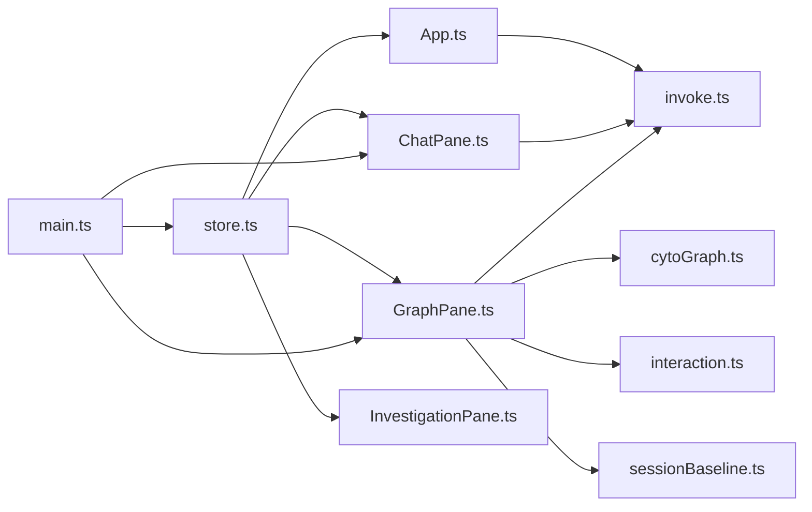

# Three-Pane Interface Layout

<cite>
**Referenced Files in This Document**
- [main.ts](file://openplanter-desktop/frontend/src/main.ts)
- [App.ts](file://openplanter-desktop/frontend/src/components/App.ts)
- [ChatPane.ts](file://openplanter-desktop/frontend/src/components/ChatPane.ts)
- [InvestigationPane.ts](file://openplanter-desktop/frontend/src/components/InvestigationPane.ts)
- [GraphPane.ts](file://openplanter-desktop/frontend/src/components/GraphPane.ts)
- [OverviewPane.ts](file://openplanter-desktop/frontend/src/components/OverviewPane.ts)
- [store.ts](file://openplanter-desktop/frontend/src/state/store.ts)
- [invoke.ts](file://openplanter-desktop/frontend/src/api/invoke.ts)
- [cytoGraph.ts](file://openplanter-desktop/frontend/src/graph/cytoGraph.ts)
- [interaction.ts](file://openplanter-desktop/frontend/src/graph/interaction.ts)
- [sessionBaseline.ts](file://openplanter-desktop/frontend/src/graph/sessionBaseline.ts)
- [main.css](file://openplanter-desktop/frontend/src/styles/main.css)
- [theme.css](file://openplanter-desktop/frontend/src/styles/theme.css)
</cite>

## Table of Contents
1. [Introduction](#introduction)
2. [Project Structure](#project-structure)
3. [Core Components](#core-components)
4. [Architecture Overview](#architecture-overview)
5. [Detailed Component Analysis](#detailed-component-analysis)
6. [Dependency Analysis](#dependency-analysis)
7. [Performance Considerations](#performance-considerations)
8. [Troubleshooting Guide](#troubleshooting-guide)
9. [Conclusion](#conclusion)

## Introduction
This document describes the three-pane interface layout for the Tauri-based desktop application. The UI is organized into three primary areas:
- Sidebar: session management with session listing, creation, deletion, and credential status display
- Chat Pane: conversational AI interaction with message history, token tracking, and streaming responses
- Investigation Pane: knowledge graph visualization powered by Cytoscape.js, including entity nodes, relationship edges, and interactive filtering

The layout uses a CSS Grid to achieve a responsive, resizable split-screen experience. The application state is centralized and reactive, enabling seamless coordination between panes and real-time updates from agent events.

## Project Structure
The three-pane layout is implemented in the frontend under openplanter-desktop/frontend/src. The main entry initializes global event listeners and state, then constructs the root layout with the sidebar, chat pane, and investigation pane. Styles are defined in theme.css and main.css.

**Diagram sources**
- [main.ts:85-340](file://openplanter-desktop/frontend/src/main.ts#L85-L340)
- [App.ts:55-145](file://openplanter-desktop/frontend/src/components/App.ts#L55-L145)
- [ChatPane.ts:243-692](file://openplanter-desktop/frontend/src/components/ChatPane.ts#L243-L692)
- [InvestigationPane.ts:10-128](file://openplanter-desktop/frontend/src/components/InvestigationPane.ts#L10-L128)
- [GraphPane.ts:47-576](file://openplanter-desktop/frontend/src/components/GraphPane.ts#L47-L576)
- [store.ts:130-186](file://openplanter-desktop/frontend/src/state/store.ts#L130-L186)

**Section sources**
- [main.ts:85-340](file://openplanter-desktop/frontend/src/main.ts#L85-L340)
- [App.ts:55-145](file://openplanter-desktop/frontend/src/components/App.ts#L55-L145)
- [main.css:19-26](file://openplanter-desktop/frontend/src/styles/main.css#L19-L26)
- [theme.css:1-39](file://openplanter-desktop/frontend/src/styles/theme.css#L1-L39)

## Core Components
- Root layout and sidebar: createApp builds the grid layout, inserts the sidebar with session controls and credential status, and mounts the chat and investigation panes.
- Chat pane: renders messages, streaming deltas, tool calls/results, and step summaries; integrates with InputBar for user input.
- Investigation pane: hosts Overview and Graph tabs, with dynamic mounting of GraphPane and session baseline management.
- Graph pane: Cytoscape.js-powered visualization with search, layout selection, tier filtering, session-based visibility, and detail overlays.
- State management: appState stores UI state, agent metrics, and session data; components subscribe to updates and react to events.

**Section sources**
- [App.ts:55-145](file://openplanter-desktop/frontend/src/components/App.ts#L55-L145)
- [ChatPane.ts:243-692](file://openplanter-desktop/frontend/src/components/ChatPane.ts#L243-L692)
- [InvestigationPane.ts:10-128](file://openplanter-desktop/frontend/src/components/InvestigationPane.ts#L10-L128)
- [GraphPane.ts:47-576](file://openplanter-desktop/frontend/src/components/GraphPane.ts#L47-L576)
- [store.ts:130-186](file://openplanter-desktop/frontend/src/state/store.ts#L130-L186)

## Architecture Overview
The application uses a reactive state store and event-driven communication:
- main.ts subscribes to agent events and updates appState, which drives UI rendering across panes.
- App.ts manages sidebar interactions (sessions, credentials) and dispatches events to panes.
- ChatPane listens for agent-delta and agent-step events to render streaming and step summaries.
- GraphPane listens for wiki-updated and curator-done events to refresh the knowledge graph.
- InvestigationPane coordinates tab switching and ensures GraphPane is mounted on demand.

**Diagram sources**
- [main.ts:185-325](file://openplanter-desktop/frontend/src/main.ts#L185-L325)
- [App.ts:113-145](file://openplanter-desktop/frontend/src/components/App.ts#L113-L145)
- [ChatPane.ts:528-673](file://openplanter-desktop/frontend/src/components/ChatPane.ts#L528-L673)
- [GraphPane.ts:518-563](file://openplanter-desktop/frontend/src/components/GraphPane.ts#L518-L563)
- [InvestigationPane.ts:35-90](file://openplanter-desktop/frontend/src/components/InvestigationPane.ts#L35-L90)

## Detailed Component Analysis

### Sidebar Panel: Session Management
The sidebar provides:
- Sessions header with “+ New Session” action
- Session list with clickable entries and per-item delete confirmation
- Settings display reflecting provider/model/embeddings/web search/continuity/reasoning/recursion modes
- Credentials status grid indicating availability per service

Behavior highlights:
- New session: openSession creates a new session ID, clears chat state, dispatches session-changed, and adds a welcome message.
- Resume session: openSession(resume=true) loads message history from replay.jsonl and updates messages.
- Delete session: confirmation pattern with “×” → “Delete?” → “...” feedback; if deleting the active session, switches to a new session.

**Diagram sources**
- [App.ts:147-187](file://openplanter-desktop/frontend/src/components/App.ts#L147-L187)
- [App.ts:213-266](file://openplanter-desktop/frontend/src/components/App.ts#L213-L266)
- [App.ts:282-371](file://openplanter-desktop/frontend/src/components/App.ts#L282-L371)
- [invoke.ts:77-90](file://openplanter-desktop/frontend/src/api/invoke.ts#L77-L90)

Practical examples:
- Navigate between panes: click “Graph” tab in Investigation Pane to activate the knowledge graph; click “Overview” to return to structured insights.
- Manage investigation sessions: create a new session to start fresh; resume a previous session to continue work; delete old sessions to keep the list tidy.
- Interpret knowledge graph visualizations: use “Search nodes”, “Layout”, “Tier”, and “Show only new nodes from this session” to explore relationships and focus on recent changes.

**Section sources**
- [App.ts:60-145](file://openplanter-desktop/frontend/src/components/App.ts#L60-L145)
- [App.ts:282-371](file://openplanter-desktop/frontend/src/components/App.ts#L282-L371)
- [invoke.ts:77-90](file://openplanter-desktop/frontend/src/api/invoke.ts#L77-L90)

### Chat Pane: Conversational AI Interaction
The chat pane renders:
- Terminal-style messages for user/system/thinking/tool/assistant
- Streaming deltas for “thinking” and “text” kinds, updating an activity indicator with mode and preview
- Tool call blocks and collapsible tool result blocks
- Step summary messages with timestamps, depth, path, token counts, and tool call trees

Token tracking and streaming:
- Agent events increment input/output token counters and update step/depth/conversation path
- Activity indicator shows elapsed time and transitions between modes (thinking/streaming/tool)
- On completion, messages include assistant responses and optional partial completion hints

**Diagram sources**
- [main.ts:199-259](file://openplanter-desktop/frontend/src/main.ts#L199-L259)
- [ChatPane.ts:528-673](file://openplanter-desktop/frontend/src/components/ChatPane.ts#L528-L673)

Practical examples:
- Observe streaming responses: watch the activity indicator switch from “Thinking…” to “Responding…” as model text arrives.
- Review tool usage: step summaries show tool names, arguments, and elapsed times; expand tool result blocks to inspect outputs.
- Track token usage: monitor input/output token counters in the status bar and step summaries.

**Section sources**
- [ChatPane.ts:243-692](file://openplanter-desktop/frontend/src/components/ChatPane.ts#L243-L692)
- [main.ts:199-259](file://openplanter-desktop/frontend/src/main.ts#L199-L259)

### Investigation Pane: Knowledge Graph Visualization
The investigation pane hosts two tabs:
- Overview: structured summary of the investigation, curated replay, gaps, candidate actions, recent revelations, and wiki navigation
- Graph: Cytoscape.js visualization with interactive filtering and detail overlays

Graph capabilities:
- Toolbar: search (debounced), layout selection, tier filter, session toggle, refresh, fit view
- Legend: category-based color swatches with click-to-hide
- Interactions: node selection/highlighting, double-click to focus neighborhood, hover tooltips, escape to deselect
- Detail overlay: node metadata, connected nodes, “View source” drawer
- Drawer: slide-out wiki markdown viewer with internal link interception

Session-based visibility:
- “Show only new nodes from this session” toggles a filter that highlights nodes not present in the baseline
- Baseline is captured on first graph load or on session change and can be primed asynchronously

**Diagram sources**
- [GraphPane.ts:47-576](file://openplanter-desktop/frontend/src/components/GraphPane.ts#L47-L576)
- [cytoGraph.ts:335-421](file://openplanter-desktop/frontend/src/graph/cytoGraph.ts#L335-L421)
- [interaction.ts:24-112](file://openplanter-desktop/frontend/src/graph/interaction.ts#L24-L112)
- [sessionBaseline.ts:87-118](file://openplanter-desktop/frontend/src/graph/sessionBaseline.ts#L87-L118)

Practical examples:
- Explore relationships: select a node to highlight its neighborhood; use “Fit to view” to center the selection.
- Focus on new findings: enable “Show only new nodes from this session” to see additions since baseline capture.
- Navigate sources: click “View source” in the detail overlay to open the associated wiki markdown in the drawer.

**Section sources**
- [InvestigationPane.ts:10-128](file://openplanter-desktop/frontend/src/components/InvestigationPane.ts#L10-L128)
- [GraphPane.ts:47-576](file://openplanter-desktop/frontend/src/components/GraphPane.ts#L47-L576)
- [cytoGraph.ts:446-583](file://openplanter-desktop/frontend/src/graph/cytoGraph.ts#L446-L583)
- [interaction.ts:24-112](file://openplanter-desktop/frontend/src/graph/interaction.ts#L24-L112)
- [sessionBaseline.ts:95-118](file://openplanter-desktop/frontend/src/graph/sessionBaseline.ts#L95-L118)

## Dependency Analysis
The three-pane layout depends on:
- Centralized state: appState orchestrates UI state and agent metrics
- Event-driven updates: main.ts dispatches agent events to panes
- API wrappers: invoke.ts abstracts Tauri commands for sessions, graph data, and wiki files
- Graph subsystem: cytoGraph.ts encapsulates Cytoscape.js operations; interaction.ts binds UI behaviors; sessionBaseline.ts manages session-based visibility

**Diagram sources**
- [store.ts:130-186](file://openplanter-desktop/frontend/src/state/store.ts#L130-L186)
- [main.ts:185-325](file://openplanter-desktop/frontend/src/main.ts#L185-L325)
- [App.ts:13-13](file://openplanter-desktop/frontend/src/components/App.ts#L13-L13)
- [invoke.ts:1-131](file://openplanter-desktop/frontend/src/api/invoke.ts#L1-L131)
- [GraphPane.ts:19-27](file://openplanter-desktop/frontend/src/components/GraphPane.ts#L19-L27)
- [cytoGraph.ts:1-10](file://openplanter-desktop/frontend/src/graph/cytoGraph.ts#L1-L10)
- [interaction.ts:1-8](file://openplanter-desktop/frontend/src/graph/interaction.ts#L1-L8)
- [sessionBaseline.ts:1-2](file://openplanter-desktop/frontend/src/graph/sessionBaseline.ts#L1-L2)

**Section sources**
- [store.ts:130-186](file://openplanter-desktop/frontend/src/state/store.ts#L130-L186)
- [main.ts:185-325](file://openplanter-desktop/frontend/src/main.ts#L185-L325)
- [invoke.ts:1-131](file://openplanter-desktop/frontend/src/api/invoke.ts#L1-L131)

## Performance Considerations
- Debounced search: GraphPane’s search input uses a 200ms debounce to reduce filtering churn.
- Incremental updates: cytoGraph.updateGraph diffs and re-adds elements to minimize redraw overhead.
- Session filter preview: previewSessionVisibilityDelta computes visibility without altering UX semantics, deferring heavy rendering to filterBySessionDelta.
- Auto-refresh cadence: GraphPane refreshes after agent steps and curator updates; consider throttling if graph updates become frequent.
- Large knowledge graphs: prefer “Show only new nodes from this session” and tier filters to reduce visual clutter; use “Fit to view” after filtering to optimize viewport.

[No sources needed since this section provides general guidance]

## Troubleshooting Guide
Common interface issues and resolutions:
- Graph appears blank: ensure wiki data is available; the pane shows a placeholder when no nodes exist; trigger refresh or wait for wiki-updated events.
- Session deletion fails: the delete button shows “Error!” momentarily; retry after confirming the session is not active.
- Streaming not updating: verify agent-delta and agent-step listeners are firing; check that the chat pane is mounted and subscribed.
- Graph interactions unresponsive: ensure the graph is initialized and cytoscape instance exists; confirm interactions are bound after mount.
- Session filter not working: verify baseline capture occurred; for new sessions, the filter may auto-activate and require a refresh.

**Section sources**
- [GraphPane.ts:503-516](file://openplanter-desktop/frontend/src/components/GraphPane.ts#L503-L516)
- [App.ts:333-361](file://openplanter-desktop/frontend/src/components/App.ts#L333-L361)
- [ChatPane.ts:528-595](file://openplanter-desktop/frontend/src/components/ChatPane.ts#L528-L595)
- [GraphPane.ts:468-501](file://openplanter-desktop/frontend/src/components/GraphPane.ts#L468-L501)
- [sessionBaseline.ts:150-168](file://openplanter-desktop/frontend/src/graph/sessionBaseline.ts#L150-L168)

## Conclusion
The three-pane interface integrates session management, conversational AI, and knowledge graph visualization into a cohesive, responsive desktop experience. The sidebar streamlines session lifecycle, the chat pane delivers transparent streaming and tooling insights, and the investigation pane enables deep exploration of interconnected knowledge. With event-driven state updates and modular graph rendering, the UI remains performant and accessible across panes.