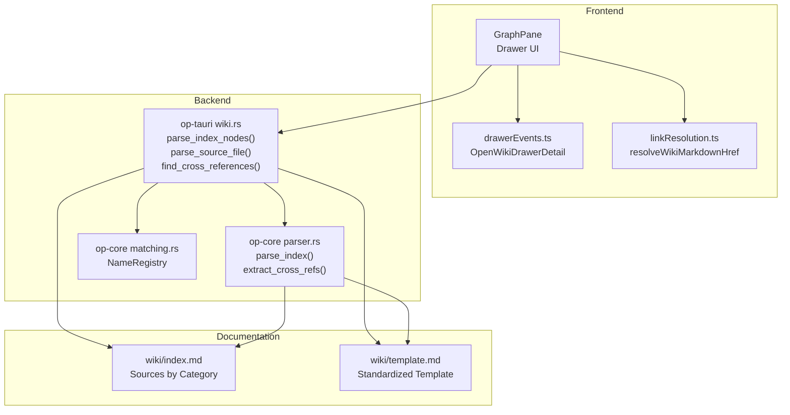
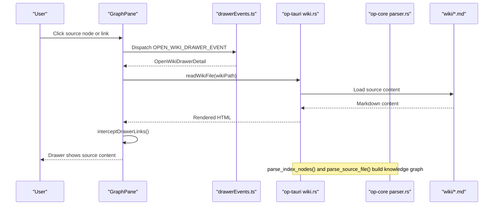
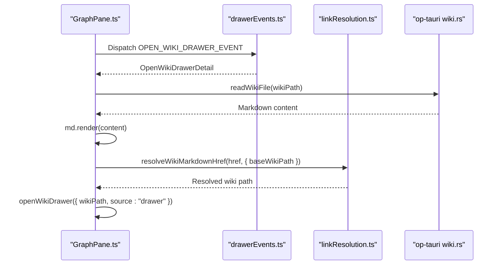
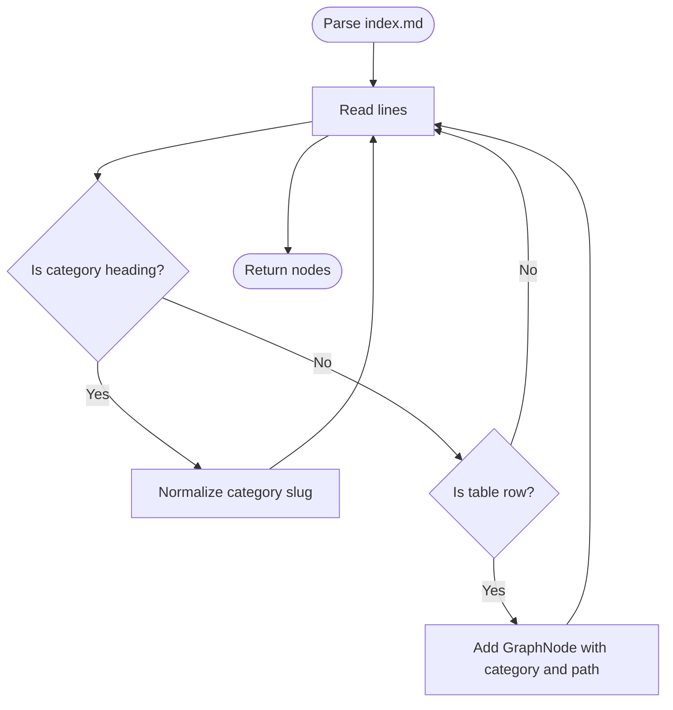
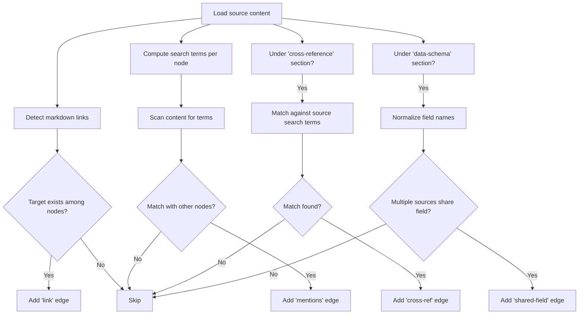
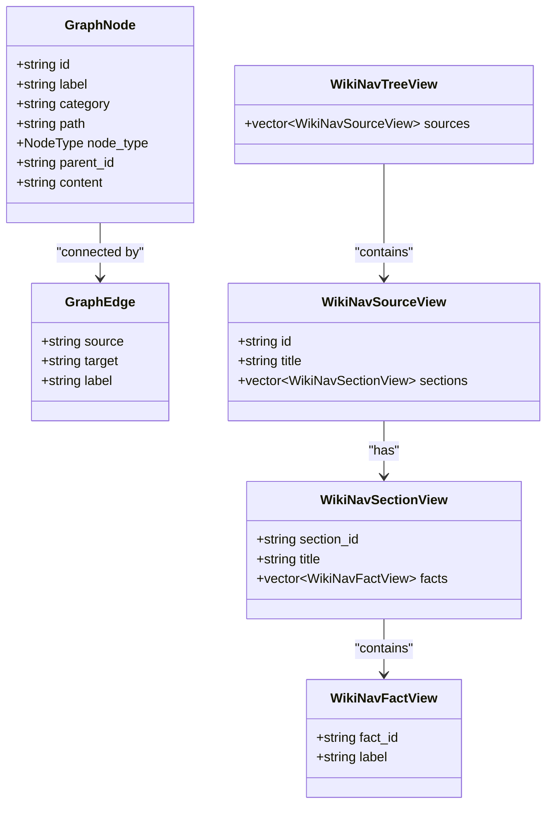
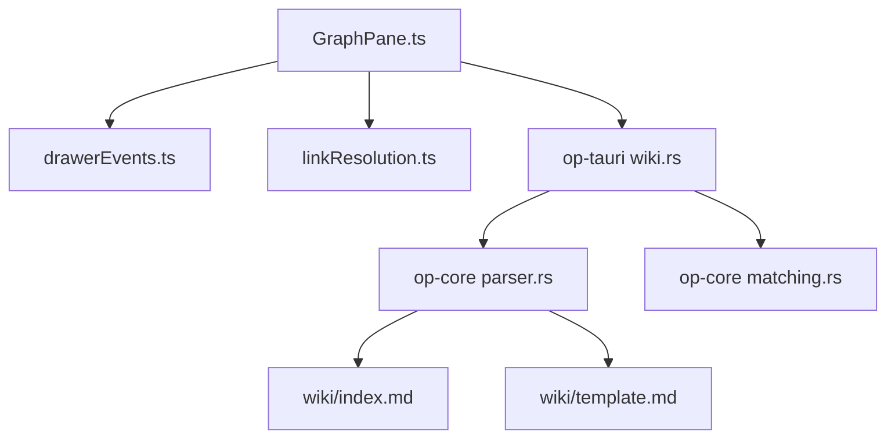
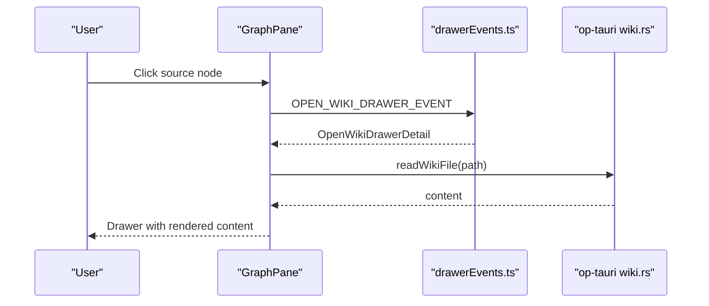
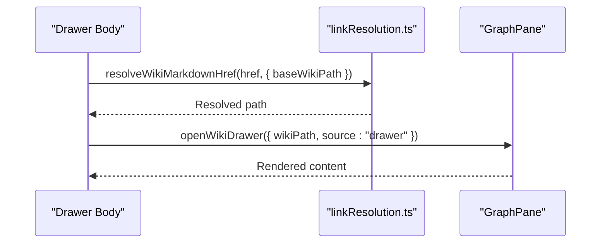

# Wiki Source Drawer and Documentation

<cite>
**Referenced Files in This Document**
- [wiki/index.md](file://wiki/index.md)
- [wiki/template.md](file://wiki/template.md)
- [op-tauri/src/commands/wiki.rs](file://openplanter-desktop/crates/op-tauri/src/commands/wiki.rs)
- [op-core/src/wiki/parser.rs](file://openplanter-desktop/crates/op-core/src/wiki/parser.rs)
- [op-core/src/wiki/matching.rs](file://openplanter-desktop/crates/op-core/src/wiki/matching.rs)
- [frontend/src/wiki/drawerEvents.ts](file://openplanter-desktop/frontend/src/wiki/drawerEvents.ts)
- [frontend/src/wiki/linkResolution.ts](file://openplanter-desktop/frontend/src/wiki/linkResolution.ts)
- [frontend/src/wiki/linkResolution.test.ts](file://openplanter-desktop/frontend/src/wiki/linkResolution.test.ts)
- [frontend/src/components/GraphPane.ts](file://openplanter-desktop/frontend/src/components/GraphPane.ts)
</cite>

## Table of Contents
1. [Introduction](#introduction)
2. [Project Structure](#project-structure)
3. [Core Components](#core-components)
4. [Architecture Overview](#architecture-overview)
5. [Detailed Component Analysis](#detailed-component-analysis)
6. [Dependency Analysis](#dependency-analysis)
7. [Performance Considerations](#performance-considerations)
8. [Troubleshooting Guide](#troubleshooting-guide)
9. [Conclusion](#conclusion)
10. [Appendices](#appendices)

## Introduction
This document explains the wiki source drawer and documentation integration in the OpenPlanter project. It covers how the drawer interface enables browsing and organizing standardized wiki documentation sources, how category filtering and search capabilities are supported, how cross-references are resolved to link investigation findings to relevant data sources, and how the knowledge graph supports automatic source attribution and evidence tracking. Practical guidance is included for adding new wiki sources, organizing documentation hierarchies, resolving ambiguous entity references, validating sources, extracting metadata, generating documentation, contributing templates, maintaining quality, and integrating external documentation systems.

## Project Structure
The wiki system spans three layers:
- Frontend: drawer UI, event handling, and link resolution
- Backend: graph construction, parsing, and cross-reference discovery
- Documentation: standardized wiki sources and templates

**Diagram sources**
- [op-tauri/src/commands/wiki.rs:78-126](file://openplanter-desktop/crates/op-tauri/src/commands/wiki.rs#L78-L126)
- [op-core/src/wiki/parser.rs:25-86](file://openplanter-desktop/crates/op-core/src/wiki/parser.rs#L25-L86)
- [op-core/src/wiki/matching.rs:8-76](file://openplanter-desktop/crates/op-core/src/wiki/matching.rs#L8-L76)
- [frontend/src/wiki/drawerEvents.ts:1-10](file://openplanter-desktop/frontend/src/wiki/drawerEvents.ts#L1-L10)
- [frontend/src/wiki/linkResolution.ts:13-48](file://openplanter-desktop/frontend/src/wiki/linkResolution.ts#L13-L48)
- [frontend/src/components/GraphPane.ts:293-349](file://openplanter-desktop/frontend/src/components/GraphPane.ts#L293-L349)
- [wiki/index.md:1-75](file://wiki/index.md#L1-L75)
- [wiki/template.md:1-41](file://wiki/template.md#L1-L41)

**Section sources**
- [wiki/index.md:1-75](file://wiki/index.md#L1-L75)
- [wiki/template.md:1-41](file://wiki/template.md#L1-L41)
- [op-tauri/src/commands/wiki.rs:78-126](file://openplanter-desktop/crates/op-tauri/src/commands/wiki.rs#L78-L126)
- [op-core/src/wiki/parser.rs:25-86](file://openplanter-desktop/crates/op-core/src/wiki/parser.rs#L25-L86)
- [op-core/src/wiki/matching.rs:8-76](file://openplanter-desktop/crates/op-core/src/wiki/matching.rs#L8-L76)
- [frontend/src/wiki/drawerEvents.ts:1-10](file://openplanter-desktop/frontend/src/wiki/drawerEvents.ts#L1-L10)
- [frontend/src/wiki/linkResolution.ts:13-48](file://openplanter-desktop/frontend/src/wiki/linkResolution.ts#L13-L48)
- [frontend/src/components/GraphPane.ts:293-349](file://openplanter-desktop/frontend/src/components/GraphPane.ts#L293-L349)

## Core Components
- Wiki index and categories: The index defines sources by category and links to individual source documents. Categories are normalized for consistent filtering and navigation.
- Standardized source templates: Templates enforce consistent metadata, access methods, schema, coverage, cross-reference potential, quality notes, acquisition scripts, legal/licensing, and references.
- Drawer UI: A drawer opens from the graph view to render wiki content inline, intercepts internal links, and supports category filtering via graph nodes.
- Cross-reference resolution: Links between sources and mentions within source content are discovered and turned into graph edges for knowledge graph navigation.
- Entity matching: A fuzzy name registry supports resolving ambiguous entity references across sources.

**Section sources**
- [wiki/index.md:1-75](file://wiki/index.md#L1-L75)
- [wiki/template.md:1-41](file://wiki/template.md#L1-L41)
- [frontend/src/components/GraphPane.ts:293-349](file://openplanter-desktop/frontend/src/components/GraphPane.ts#L293-L349)
- [op-tauri/src/commands/wiki.rs:191-265](file://openplanter-desktop/crates/op-tauri/src/commands/wiki.rs#L191-L265)
- [op-core/src/wiki/matching.rs:8-76](file://openplanter-desktop/crates/op-core/src/wiki/matching.rs#L8-L76)

## Architecture Overview
The drawer integrates frontend rendering with backend graph construction and parsing. The backend discovers sources, parses their structure, and builds a knowledge graph enriched with cross-references and shared fields. The frontend renders the graph and opens the drawer to display source content, intercepting internal links for seamless navigation.

**Diagram sources**
- [frontend/src/wiki/drawerEvents.ts:1-10](file://openplanter-desktop/frontend/src/wiki/drawerEvents.ts#L1-L10)
- [frontend/src/components/GraphPane.ts:293-349](file://openplanter-desktop/frontend/src/components/GraphPane.ts#L293-L349)
- [op-tauri/src/commands/wiki.rs:705-735](file://openplanter-desktop/crates/op-tauri/src/commands/wiki.rs#L705-L735)
- [op-core/src/wiki/parser.rs:25-86](file://openplanter-desktop/crates/op-core/src/wiki/parser.rs#L25-L86)

## Detailed Component Analysis

### Drawer Interface and Navigation
- Event-driven opening: The drawer listens for a custom event carrying the target wiki path, origin context, and optional title.
- Inline rendering: Content is loaded and rendered inside the drawer; internal links are intercepted to keep navigation within the drawer.
- Focus behavior: When triggered from the graph, the matching source node is focused to highlight context.
- Safety: Out-of-order loads are handled to ensure the latest content is shown.

**Diagram sources**
- [frontend/src/wiki/drawerEvents.ts:1-10](file://openplanter-desktop/frontend/src/wiki/drawerEvents.ts#L1-L10)
- [frontend/src/wiki/linkResolution.ts:13-48](file://openplanter-desktop/frontend/src/wiki/linkResolution.ts#L13-L48)
- [frontend/src/components/GraphPane.ts:293-349](file://openplanter-desktop/frontend/src/components/GraphPane.ts#L293-L349)
- [op-tauri/src/commands/wiki.rs:705-735](file://openplanter-desktop/crates/op-tauri/src/commands/wiki.rs#L705-L735)

**Section sources**
- [frontend/src/wiki/drawerEvents.ts:1-10](file://openplanter-desktop/frontend/src/wiki/drawerEvents.ts#L1-L10)
- [frontend/src/wiki/linkResolution.ts:13-48](file://openplanter-desktop/frontend/src/wiki/linkResolution.ts#L13-L48)
- [frontend/src/components/GraphPane.ts:293-349](file://openplanter-desktop/frontend/src/components/GraphPane.ts#L293-L349)

### Category Filtering and Search Capabilities
- Category normalization: Index headings are normalized into consistent slugs for grouping and filtering.
- Sorting and presentation: Sources are sorted by category and label for predictable navigation.
- Search terms extraction: Distinctive words and acronyms are extracted from source labels to support text-based matching across content.

**Diagram sources**
- [op-tauri/src/commands/wiki.rs:46-76](file://openplanter-desktop/crates/op-tauri/src/commands/wiki.rs#L46-L76)
- [op-tauri/src/commands/wiki.rs:78-126](file://openplanter-desktop/crates/op-tauri/src/commands/wiki.rs#L78-L126)

**Section sources**
- [op-tauri/src/commands/wiki.rs:46-76](file://openplanter-desktop/crates/op-tauri/src/commands/wiki.rs#L46-L76)
- [op-tauri/src/commands/wiki.rs:78-126](file://openplanter-desktop/crates/op-tauri/src/commands/wiki.rs#L78-L126)

### Cross-Reference Resolution System
- Markdown link-based edges: Links between wiki pages found in source content produce edges labeled as “link”.
- Text-based mention edges: Mentions detected by matching distinctive search terms produce edges labeled as “mentions”.
- Cross-reference section edges: Facts under “cross-reference” sections are scanned to connect to other sources by matching search terms.
- Shared-field edges: Facts under “data-schema” sections are grouped by normalized field names to connect equivalent fields across sources.

**Diagram sources**
- [op-tauri/src/commands/wiki.rs:191-265](file://openplanter-desktop/crates/op-tauri/src/commands/wiki.rs#L191-L265)
- [op-tauri/src/commands/wiki.rs:577-633](file://openplanter-desktop/crates/op-tauri/src/commands/wiki.rs#L577-L633)
- [op-tauri/src/commands/wiki.rs:635-697](file://openplanter-desktop/crates/op-tauri/src/commands/wiki.rs#L635-L697)

**Section sources**
- [op-tauri/src/commands/wiki.rs:191-265](file://openplanter-desktop/crates/op-tauri/src/commands/wiki.rs#L191-L265)
- [op-tauri/src/commands/wiki.rs:577-633](file://openplanter-desktop/crates/op-tauri/src/commands/wiki.rs#L577-L633)
- [op-tauri/src/commands/wiki.rs:635-697](file://openplanter-desktop/crates/op-tauri/src/commands/wiki.rs#L635-L697)

### Knowledge Graph Integration for Automatic Attribution and Evidence Tracking
- Source nodes: Represent individual wiki sources with category and path.
- Section and fact nodes: Represent structured content within sources, enabling granular attribution of findings.
- Edge types: “has-section”, “contains”, “link”, “mentions”, “cross-ref”, “shared-field”.
- Navigation: The drawer presents hierarchical sections and facts, enabling users to trace evidence back to its source.

**Diagram sources**
- [op-tauri/src/commands/wiki.rs:747-800](file://openplanter-desktop/crates/op-tauri/src/commands/wiki.rs#L747-L800)

**Section sources**
- [op-tauri/src/commands/wiki.rs:747-800](file://openplanter-desktop/crates/op-tauri/src/commands/wiki.rs#L747-L800)

### Practical Examples

#### Adding a New Wiki Source
- Copy the standardized template into the appropriate category folder.
- Fill in sections: Summary, Access Methods, Data Schema, Coverage, Cross-Reference Potential, Data Quality, Acquisition Script, Legal & Licensing, References.
- Link the new source from the index under the correct category.

References:
- [wiki/template.md:1-41](file://wiki/template.md#L1-L41)
- [wiki/index.md:72-75](file://wiki/index.md#L72-L75)

#### Organizing Documentation Hierarchies
- Use headings to define sections and subsections; facts are represented as bold-bullet items or table rows.
- Keep section and fact IDs unique within a source by slugifying headings and deduplicating IDs.

References:
- [op-tauri/src/commands/wiki.rs:309-575](file://openplanter-desktop/crates/op-tauri/src/commands/wiki.rs#L309-L575)

#### Resolving Ambiguous Entity References
- Use the fuzzy name registry to find canonical entity IDs for queries.
- Register canonical names and aliases to improve recall and precision.

References:
- [op-core/src/wiki/matching.rs:8-76](file://openplanter-desktop/crates/op-core/src/wiki/matching.rs#L8-L76)

#### Source Validation and Metadata Extraction
- Validate wiki paths and prevent unsafe links during resolution.
- Extract distinctive search terms from labels to power cross-references and mentions.

References:
- [frontend/src/wiki/linkResolution.ts:3-48](file://openplanter-desktop/frontend/src/wiki/linkResolution.ts#L3-L48)
- [op-tauri/src/commands/wiki.rs:128-189](file://openplanter-desktop/crates/op-tauri/src/commands/wiki.rs#L128-L189)

#### Automated Documentation Generation
- Parse index.md to discover sources and categories.
- Parse each source file to build a knowledge graph of sections and facts.
- Automatically generate cross-references and shared-field edges.

References:
- [op-core/src/wiki/parser.rs:25-86](file://openplanter-desktop/crates/op-core/src/wiki/parser.rs#L25-L86)
- [op-core/src/wiki/parser.rs:88-114](file://openplanter-desktop/crates/op-core/src/wiki/parser.rs#L88-L114)
- [op-tauri/src/commands/wiki.rs:705-735](file://openplanter-desktop/crates/op-tauri/src/commands/wiki.rs#L705-L735)

#### Contributing New Wiki Templates and Maintaining Quality
- Follow the template to ensure consistent metadata and structure.
- Maintain quality by documenting data quality issues, coverage, and licensing.
- Keep acquisition scripts synchronized with data access methods.

References:
- [wiki/template.md:1-41](file://wiki/template.md#L1-L41)

#### Integrating External Documentation Systems
- Use markdown links to reference external resources; the drawer will open external links in place when applicable.
- Ensure internal links resolve correctly using the provided resolver to maintain navigation consistency.

References:
- [frontend/src/wiki/linkResolution.ts:13-48](file://openplanter-desktop/frontend/src/wiki/linkResolution.ts#L13-L48)
- [frontend/src/components/GraphPane.ts:331-349](file://openplanter-desktop/frontend/src/components/GraphPane.ts#L331-L349)

## Dependency Analysis
The drawer relies on frontend event handling and link resolution, backed by backend parsing and graph construction. The core parser and matching utilities provide foundational capabilities for discovery and entity resolution.

**Diagram sources**
- [frontend/src/components/GraphPane.ts:293-349](file://openplanter-desktop/frontend/src/components/GraphPane.ts#L293-L349)
- [frontend/src/wiki/drawerEvents.ts:1-10](file://openplanter-desktop/frontend/src/wiki/drawerEvents.ts#L1-L10)
- [frontend/src/wiki/linkResolution.ts:13-48](file://openplanter-desktop/frontend/src/wiki/linkResolution.ts#L13-L48)
- [op-tauri/src/commands/wiki.rs:705-735](file://openplanter-desktop/crates/op-tauri/src/commands/wiki.rs#L705-L735)
- [op-core/src/wiki/parser.rs:25-86](file://openplanter-desktop/crates/op-core/src/wiki/parser.rs#L25-L86)
- [op-core/src/wiki/matching.rs:8-76](file://openplanter-desktop/crates/op-core/src/wiki/matching.rs#L8-L76)
- [wiki/index.md:1-75](file://wiki/index.md#L1-L75)
- [wiki/template.md:1-41](file://wiki/template.md#L1-L41)

**Section sources**
- [op-tauri/src/commands/wiki.rs:705-735](file://openplanter-desktop/crates/op-tauri/src/commands/wiki.rs#L705-L735)
- [op-core/src/wiki/parser.rs:25-86](file://openplanter-desktop/crates/op-core/src/wiki/parser.rs#L25-L86)
- [op-core/src/wiki/matching.rs:8-76](file://openplanter-desktop/crates/op-core/src/wiki/matching.rs#L8-L76)
- [frontend/src/wiki/drawerEvents.ts:1-10](file://openplanter-desktop/frontend/src/wiki/drawerEvents.ts#L1-L10)
- [frontend/src/wiki/linkResolution.ts:13-48](file://openplanter-desktop/frontend/src/wiki/linkResolution.ts#L13-L48)
- [frontend/src/components/GraphPane.ts:293-349](file://openplanter-desktop/frontend/src/components/GraphPane.ts#L293-L349)
- [wiki/index.md:1-75](file://wiki/index.md#L1-L75)
- [wiki/template.md:1-41](file://wiki/template.md#L1-L41)

## Performance Considerations
- Parsing cost: Index and source parsing iterate over lines and content; precompute search terms to reduce repeated work.
- Memory: Store file contents in memory during cross-reference discovery to avoid repeated disk reads.
- Rendering: Debounce or sequence drawer loads to avoid race conditions and redundant renders.
- Matching: Use a thresholded fuzzy matcher to balance precision and performance.

[No sources needed since this section provides general guidance]

## Troubleshooting Guide
- Drawer does not open: Verify the custom event payload includes a valid wiki path and source.
- Internal links fail: Ensure paths are canonical wiki paths ending in .md and do not include unsafe segments.
- Cross-references missing: Confirm that markdown links and distinctive terms are present in source content.
- Entity resolution returns no results: Adjust thresholds or register additional aliases for the entity.

**Section sources**
- [frontend/src/wiki/drawerEvents.ts:1-10](file://openplanter-desktop/frontend/src/wiki/drawerEvents.ts#L1-L10)
- [frontend/src/wiki/linkResolution.ts:3-48](file://openplanter-desktop/frontend/src/wiki/linkResolution.ts#L3-L48)
- [frontend/src/wiki/linkResolution.test.ts:27-35](file://openplanter-desktop/frontend/src/wiki/linkResolution.test.ts#L27-L35)
- [op-tauri/src/commands/wiki.rs:128-189](file://openplanter-desktop/crates/op-tauri/src/commands/wiki.rs#L128-L189)
- [op-core/src/wiki/matching.rs:31-59](file://openplanter-desktop/crates/op-core/src/wiki/matching.rs#L31-L59)

## Conclusion
The wiki source drawer and documentation integration provide a robust framework for browsing, organizing, and linking standardized data source documentation. By combining frontend navigation, backend graph construction, and entity matching, the system supports efficient investigation workflows, automatic source attribution, and scalable knowledge graph growth. Contributors can rely on the standardized template and parsing logic to maintain quality and consistency across sources.

[No sources needed since this section summarizes without analyzing specific files]

## Appendices

### Appendix A: Example Workflows

#### Workflow: Opening the Drawer from the Graph

**Diagram sources**
- [frontend/src/wiki/drawerEvents.ts:1-10](file://openplanter-desktop/frontend/src/wiki/drawerEvents.ts#L1-L10)
- [frontend/src/components/GraphPane.ts:362-375](file://openplanter-desktop/frontend/src/components/GraphPane.ts#L362-L375)
- [op-tauri/src/commands/wiki.rs:705-735](file://openplanter-desktop/crates/op-tauri/src/commands/wiki.rs#L705-L735)

#### Workflow: Resolving Relative Links Inside the Drawer

**Diagram sources**
- [frontend/src/wiki/linkResolution.ts:13-48](file://openplanter-desktop/frontend/src/wiki/linkResolution.ts#L13-L48)
- [frontend/src/components/GraphPane.ts:331-349](file://openplanter-desktop/frontend/src/components/GraphPane.ts#L331-L349)