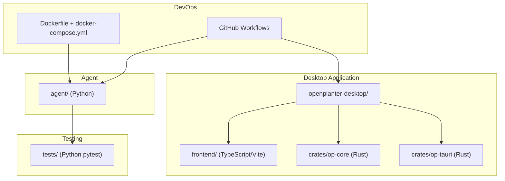
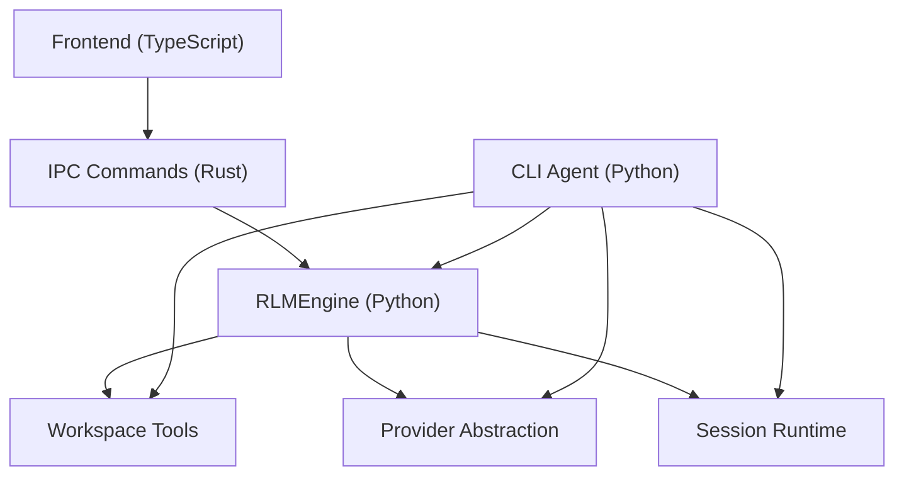
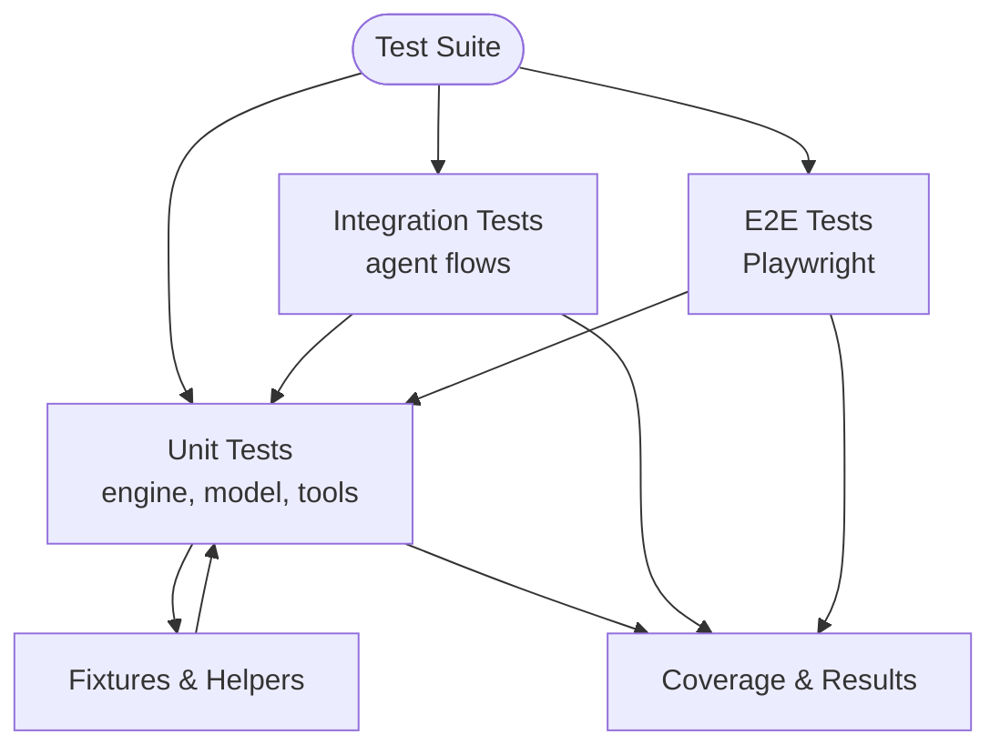
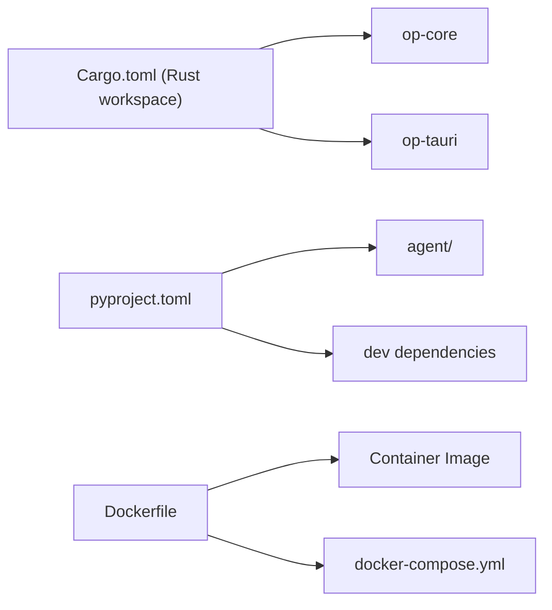

# Development Guide

<cite>
**Referenced Files in This Document**
- [README.md](file://README.md)
- [Dockerfile](file://Dockerfile)
- [docker-compose.yml](file://docker-compose.yml)
- [pyproject.toml](file://pyproject.toml)
- [openplanter-desktop/Cargo.toml](file://openplanter-desktop/Cargo.toml)
- [openplanter-desktop/package.json](file://openplanter-desktop/package.json)
- [.github/workflows/release.yml](file://.github/workflows/release.yml)
- [.github/workflows/codex-review-gate.yml](file://.github/workflows/codex-review-gate.yml)
- [.github/workflows/devin-review-gate.yml](file://.github/workflows/devin-review-gate.yml)
- [openplanter-desktop/frontend/vitest.config.ts](file://openplanter-desktop/frontend/vitest.config.ts)
- [openplanter-desktop/frontend/e2e/playwright.config.ts](file://openplanter-desktop/frontend/e2e/playwright.config.ts)
- [tests/conftest.py](file://tests/conftest.py)
- [tests/test_engine.py](file://tests/test_engine.py)
- [tests/test_model.py](file://tests/test_model.py)
- [agent/__main__.py](file://agent/__main__.py)
</cite>

## Table of Contents
1. [Introduction](#introduction)
2. [Project Structure](#project-structure)
3. [Core Components](#core-components)
4. [Architecture Overview](#architecture-overview)
5. [Detailed Component Analysis](#detailed-component-analysis)
6. [Dependency Analysis](#dependency-analysis)
7. [Performance Considerations](#performance-considerations)
8. [Troubleshooting Guide](#troubleshooting-guide)
9. [Conclusion](#conclusion)
10. [Appendices](#appendices)

## Introduction
This development guide explains how to set up a productive development environment for OpenPlanter, covering both the desktop application (Tauri + Rust + TypeScript) and the Python CLI agent. It documents the testing framework (unit, integration, and end-to-end), build instructions for development and production, cross-platform compilation, Docker-based development, continuous integration, debugging techniques, code organization, contribution workflows, and troubleshooting.

## Project Structure
OpenPlanter is a multi-language project with:
- A Rust/Tauri desktop application under openplanter-desktop
- A Python CLI agent under agent/
- A comprehensive test suite under tests/
- Docker tooling for containerized development and deployment
- GitHub Actions for CI and release automation

**Diagram sources**
- [README.md](file://README.md)
- [openplanter-desktop/Cargo.toml](file://openplanter-desktop/Cargo.toml)
- [pyproject.toml](file://pyproject.toml)
- [Dockerfile](file://Dockerfile)
- [.github/workflows/release.yml](file://.github/workflows/release.yml)

**Section sources**
- [README.md](file://README.md)
- [openplanter-desktop/Cargo.toml](file://openplanter-desktop/Cargo.toml)
- [pyproject.toml](file://pyproject.toml)
- [Dockerfile](file://Dockerfile)
- [.github/workflows/release.yml](file://.github/workflows/release.yml)

## Core Components
- Desktop application (Rust/Tauri): Provides a three-pane UI with chat, knowledge graph, and session management. It exposes IPC commands to the frontend and integrates with the agent runtime.
- Python CLI agent: Provides a terminal UI, session persistence, tool implementations, and configuration management. It supports multiple providers and retrieval backends.
- Testing framework: Unit tests for engine and model behavior, integration tests for agent features, and end-to-end tests for the desktop UI.
- Docker tooling: Containerizes the Python agent for reproducible development and deployment.
- CI/CD: Automated cross-platform builds and gates for reviews.

**Section sources**
- [README.md](file://README.md)
- [agent/__main__.py](file://agent/__main__.py)

## Architecture Overview
The desktop app is a Tauri application with a Rust backend and a TypeScript frontend. The Rust backend exposes IPC commands to the frontend and orchestrates the agent runtime. The Python CLI agent runs independently and can be used for headless tasks or integrated with the desktop app’s runtime.

**Diagram sources**
- [README.md](file://README.md)
- [openplanter-desktop/package.json](file://openplanter-desktop/package.json)
- [agent/__main__.py](file://agent/__main__.py)

## Detailed Component Analysis

### Desktop App Development Environment (Rust/Tauri/TypeScript)
- Prerequisites
  - Rust stable toolchain and Tauri CLI
  - Node.js 20+ for frontend tooling
  - Platform-specific Tauri prerequisites
- Development mode
  - Run the desktop app in development with hot reload
- Frontend tests
  - Unit tests with Vitest
- End-to-end tests
  - Playwright tests targeting Chromium and WebKit
- Backend tests
  - Rust crate tests via cargo test

Build and test commands are documented in the repository.

**Section sources**
- [README.md](file://README.md)
- [openplanter-desktop/package.json](file://openplanter-desktop/package.json)
- [openplanter-desktop/frontend/vitest.config.ts](file://openplanter-desktop/frontend/vitest.config.ts)
- [openplanter-desktop/frontend/e2e/playwright.config.ts](file://openplanter-desktop/frontend/e2e/playwright.config.ts)

### Python CLI Agent Development Environment
- Prerequisites
  - Python 3.10+
  - Install in editable mode with dev dependencies
  - Optional: textual extras for UI-focused tests
- Running tests
  - Use pytest to run the full test suite
  - Skip live API tests by ignoring specific modules

Credential and configuration resolution, CLI argument parsing, and runtime overrides are implemented in the agent entrypoint.

**Section sources**
- [README.md](file://README.md)
- [pyproject.toml](file://pyproject.toml)
- [agent/__main__.py](file://agent/__main__.py)

### Docker-Based Development Environment
- Build and run the agent in a container
- Mount the workspace directory for persistent data
- Configure API keys via .env

This enables consistent environments across platforms and simplifies CI usage.

**Section sources**
- [Dockerfile](file://Dockerfile)
- [docker-compose.yml](file://docker-compose.yml)
- [README.md](file://README.md)

### Continuous Integration and Cross-Platform Builds
- Release workflow
  - Matrix builds for Linux, macOS, and Windows
  - Installs system dependencies, Node.js, Rust, and Tauri CLI
  - Builds frontend and Rust app, then uploads release assets
- Review gates
  - Codex Review Gate: Requires a qualifying review/comment from designated logins
  - Devin Review Gate: Requires a PR review from designated logins

These workflows ensure quality and controlled releases.

**Section sources**
- [.github/workflows/release.yml](file://.github/workflows/release.yml)
- [.github/workflows/codex-review-gate.yml](file://.github/workflows/codex-review-gate.yml)
- [.github/workflows/devin-review-gate.yml](file://.github/workflows/devin-review-gate.yml)

### Testing Framework
- Unit tests
  - Engine tests validate recursion, tool dispatch, runtime policies, and prompt construction
  - Model tests validate payload construction, reasoning effort, thinking budgets, and retry behavior
- Integration tests
  - Agent integration tests exercise higher-level flows and tool interactions
- End-to-end tests (desktop)
  - Playwright tests for UI coverage across browsers
- Test fixtures and helpers
  - Shared fixtures convert provider responses to streaming events for deterministic testing

**Diagram sources**
- [tests/test_engine.py](file://tests/test_engine.py)
- [tests/test_model.py](file://tests/test_model.py)
- [tests/conftest.py](file://tests/conftest.py)
- [openplanter-desktop/frontend/e2e/playwright.config.ts](file://openplanter-desktop/frontend/e2e/playwright.config.ts)

**Section sources**
- [tests/test_engine.py](file://tests/test_engine.py)
- [tests/test_model.py](file://tests/test_model.py)
- [tests/conftest.py](file://tests/conftest.py)
- [openplanter-desktop/frontend/e2e/playwright.config.ts](file://openplanter-desktop/frontend/e2e/playwright.config.ts)

### Build Instructions

#### Desktop App
- Development mode
  - Install frontend dependencies
  - Install Tauri CLI
  - Run cargo tauri dev for hot reload
- Production build
  - Build frontend and Rust app with cargo tauri build

Cross-platform builds are automated in CI for Linux, macOS, and Windows.

**Section sources**
- [README.md](file://README.md)
- [.github/workflows/release.yml](file://.github/workflows/release.yml)

#### Python CLI Agent
- Install in editable mode with dev dependencies
- Run tests with pytest
- Skip live API tests by ignoring specific modules

**Section sources**
- [README.md](file://README.md)
- [pyproject.toml](file://pyproject.toml)

### Debugging Techniques
- Desktop app
  - Use cargo tauri dev for hot reload and logs
  - Inspect frontend console and backend logs
- Python agent
  - Use pytest with verbose output and breakpoints
  - Leverage fixtures to simulate provider responses and tool behaviors
- Docker
  - Run container with interactive shell and mounted workspace for inspection

**Section sources**
- [README.md](file://README.md)
- [openplanter-desktop/package.json](file://openplanter-desktop/package.json)
- [pyproject.toml](file://pyproject.toml)

### Code Organization
- Desktop
  - Rust backend under crates/op-tauri
  - Shared core under crates/op-core
  - Frontend under frontend/ with components, commands, and tests
- Python agent
  - CLI entrypoint, engine, runtime, model, tools, prompts, config, credentials, settings, and TUI under agent/
- Tests
  - Python tests under tests/, with shared fixtures in conftest.py

**Section sources**
- [README.md](file://README.md)
- [openplanter-desktop/Cargo.toml](file://openplanter-desktop/Cargo.toml)
- [pyproject.toml](file://pyproject.toml)

### Contribution Workflows
- Branch and PR
  - Trigger review gates before merge
- CI checks
  - Desktop and Python tests
  - Cross-platform builds
- Docker usage
  - Develop inside containers for consistency

Review gate workflows enforce required approvals.

**Section sources**
- [.github/workflows/codex-review-gate.yml](file://.github/workflows/codex-review-gate.yml)
- [.github/workflows/devin-review-gate.yml](file://.github/workflows/devin-review-gate.yml)
- [.github/workflows/release.yml](file://.github/workflows/release.yml)

## Dependency Analysis
- Desktop workspace dependencies
  - Rust workspace members and shared dependencies
- Python project dependencies
  - Core runtime dependencies and optional dev/textual extras
- Docker image
  - Minimal Python base with essential tools

**Diagram sources**
- [openplanter-desktop/Cargo.toml](file://openplanter-desktop/Cargo.toml)
- [pyproject.toml](file://pyproject.toml)
- [Dockerfile](file://Dockerfile)
- [docker-compose.yml](file://docker-compose.yml)

**Section sources**
- [openplanter-desktop/Cargo.toml](file://openplanter-desktop/Cargo.toml)
- [pyproject.toml](file://pyproject.toml)
- [Dockerfile](file://Dockerfile)
- [docker-compose.yml](file://docker-compose.yml)

## Performance Considerations
- Desktop
  - Prefer incremental builds and avoid unnecessary frontend rebuilds during development
  - Use release builds for performance profiling
- Python
  - Skip heavy live API tests during local development
  - Use fixtures to simulate provider latency and errors
- Retrieval and embeddings
  - Configure embeddings provider and storage paths to minimize I/O overhead during tests

[No sources needed since this section provides general guidance]

## Troubleshooting Guide
- Desktop prerequisites
  - Ensure Rust stable and Tauri CLI are installed and match platform requirements
  - Install Node.js 20+ for frontend tooling
- Python dependencies
  - Install in editable mode with dev extras
  - Use virtual environments to avoid conflicts
- Docker
  - Confirm .env contains required API keys
  - Verify workspace volume mount permissions
- CI failures
  - Review release workflow logs for missing system dependencies or toolchain mismatches
  - Ensure review gates are satisfied before merge

**Section sources**
- [README.md](file://README.md)
- [pyproject.toml](file://pyproject.toml)
- [Dockerfile](file://Dockerfile)
- [.github/workflows/release.yml](file://.github/workflows/release.yml)

## Conclusion
This guide outlined how to set up and develop OpenPlanter across its desktop and Python components, how to run and extend the test suite, how to build and release across platforms, and how to use Docker and CI effectively. Following these practices ensures reliable development, testing, and contribution workflows.

[No sources needed since this section summarizes without analyzing specific files]

## Appendices

### Quick Commands Reference
- Desktop development
  - Install frontend deps, install Tauri CLI, run cargo tauri dev
  - Frontend tests: npm test
  - E2E tests: npm run test:e2e
  - Backend tests: cargo test
- Python agent
  - Install editable with dev extras
  - Run tests: python -m pytest tests/
  - Skip live tests by ignoring specific modules

**Section sources**
- [README.md](file://README.md)
- [openplanter-desktop/package.json](file://openplanter-desktop/package.json)
- [pyproject.toml](file://pyproject.toml)