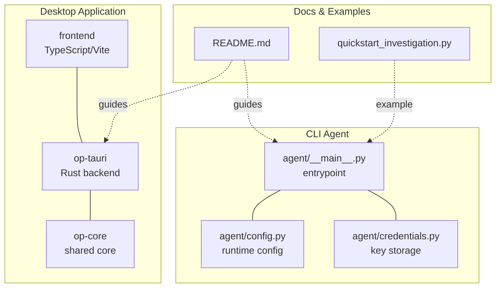
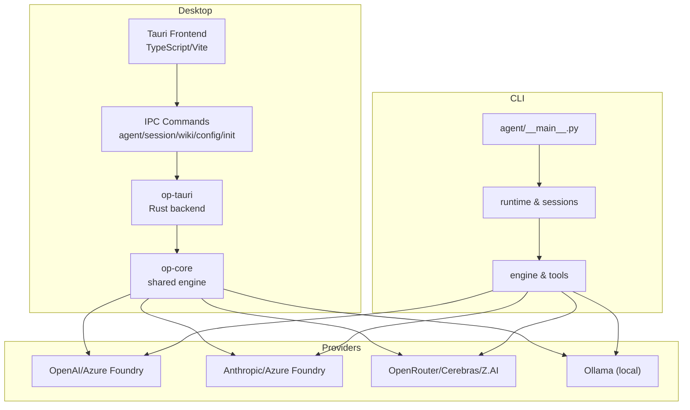
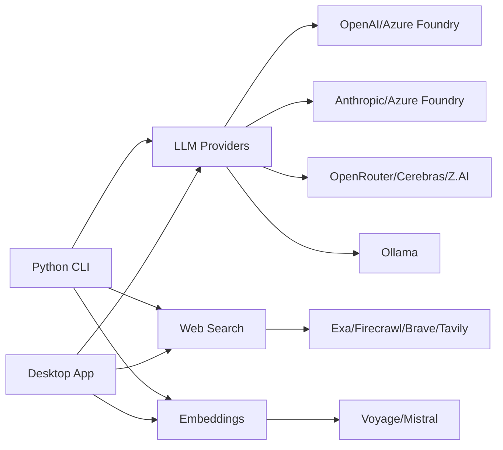

# Getting Started

<cite>
**Referenced Files in This Document**
- [README.md](file://README.md)
- [Cargo.toml](file://openplanter-desktop/Cargo.toml)
- [package.json](file://openplanter-desktop/package.json)
- [tauri.conf.json](file://openplanter-desktop/crates/op-tauri/tauri.conf.json)
- [main.rs](file://openplanter-desktop/crates/op-tauri/src/main.rs)
- [pyproject.toml](file://pyproject.toml)
- [__main__.py](file://agent/__main__.py)
- [config.py](file://agent/config.py)
- [credentials.py](file://agent/credentials.py)
- [quickstart_investigation.py](file://quickstart_investigation.py)
</cite>

## Table of Contents
1. [Introduction](#introduction)
2. [Project Structure](#project-structure)
3. [Core Components](#core-components)
4. [Architecture Overview](#architecture-overview)
5. [Detailed Component Analysis](#detailed-component-analysis)
6. [Dependency Analysis](#dependency-analysis)
7. [Performance Considerations](#performance-considerations)
8. [Troubleshooting Guide](#troubleshooting-guide)
9. [Conclusion](#conclusion)
10. [Appendices](#appendices)

## Introduction
OpenPlanter helps investigators explore heterogeneous datasets, connect entities across sources, and produce evidence-backed findings. It ships as:
- A desktop application with a graphical interface (Tauri 2)
- A Python CLI agent with a terminal UI and optional TUI modes

This guide focuses on fast onboarding: installing on macOS, Windows, and Linux; preparing prerequisites; configuring API keys; initializing a workspace; and completing a first investigation.

## Project Structure
OpenPlanter is organized into:
- Desktop application: Rust/Tauri backend and TypeScript/Vite frontend
- Python CLI agent: terminal UI, session management, and runtime engine
- Supporting assets: documentation, example workspaces, and scripts

**Diagram sources**
- [main.rs:1-51](file://openplanter-desktop/crates/op-tauri/src/main.rs#L1-L51)
- [lib.rs:1-15](file://openplanter-desktop/crates/op-core/src/lib.rs#L1-L15)
- [tauri.conf.json:1-39](file://openplanter-desktop/crates/op-tauri/tauri.conf.json#L1-L39)
- [__main__.py:1-800](file://agent/__main__.py#L1-L800)
- [config.py:1-495](file://agent/config.py#L1-L495)
- [credentials.py:1-424](file://agent/credentials.py#L1-L424)
- [README.md:1-449](file://README.md#L1-L449)
- [quickstart_investigation.py:1-395](file://quickstart_investigation.py#L1-L395)

**Section sources**
- [README.md:375-407](file://README.md#L375-L407)
- [Cargo.toml:1-24](file://openplanter-desktop/Cargo.toml#L1-L24)
- [package.json:1-11](file://openplanter-desktop/package.json#L1-L11)
- [pyproject.toml:1-35](file://pyproject.toml#L1-L35)

## Core Components
- Desktop app (Tauri 2): Three-pane UI with session management, chat, and an interactive knowledge graph. Supports provider switching, session persistence, and live graph updates.
- CLI agent: Terminal UI with slash commands, session resume, and headless operation. Provides a REPL and optional advanced TUI modes.

Key capabilities:
- Live knowledge graph with filtering and category coloring
- Wiki drawer for source documents
- Session persistence and checkpointed synthesis
- Multi-provider model support (OpenAI, Anthropic, OpenRouter, Cerebras, Z.AI, Ollama)
- Web search, shell execution, audio transcription, and dataset ingestion tools

**Section sources**
- [README.md:17-32](file://README.md#L17-L32)
- [README.md:229-246](file://README.md#L229-L246)

## Architecture Overview
High-level runtime architecture for both interfaces:

**Diagram sources**
- [main.rs:20-49](file://openplanter-desktop/crates/op-tauri/src/main.rs#L20-L49)
- [lib.rs:1-15](file://openplanter-desktop/crates/op-core/src/lib.rs#L1-L15)
- [__main__.py:1-800](file://agent/__main__.py#L1-L800)
- [config.py:146-260](file://agent/config.py#L146-L260)

## Detailed Component Analysis

### Desktop Application Setup
Supported platforms:
- macOS: .dmg
- Windows: .msi
- Linux: .AppImage

Prerequisites:
- Rust stable
- Node.js 20+
- Tauri prerequisites for your OS
- Optional: Chrome DevTools MCP requires Node/npm at runtime

Build from source:
- Install frontend deps
- Install Tauri CLI
- Run in development or build distributables

Desktop features:
- Sidebar for sessions, provider/model settings, and credential status
- Chat pane for agent objectives, reasoning, tool calls, and findings
- Knowledge graph with real-time updates and category coloring
- Wiki drawer for source documents
- Session persistence and checkpointed synthesis

**Section sources**
- [README.md:9-49](file://README.md#L9-L49)
- [README.md:25-32](file://README.md#L25-L32)
- [tauri.conf.json:25-32](file://openplanter-desktop/crates/op-tauri/tauri.conf.json#L25-L32)
- [package.json:4-9](file://openplanter-desktop/package.json#L4-L9)

### CLI Agent Setup
Installation:
- Install in editable mode with development extras if desired

Quickstart:
- Configure API keys interactively
- Point to a workspace (e.g., the included workspace)
- Launch the TUI
- Or run a single task headlessly

Docker option:
- Add API keys to .env and run the provided compose setup

Local models:
- Ollama runs models locally; configure base URL and model names

**Section sources**
- [README.md:55-91](file://README.md#L55-L91)
- [pyproject.toml:1-35](file://pyproject.toml#L1-L35)
- [README.md:110-121](file://README.md#L110-L121)

### API Key Configuration
OpenPlanter resolves credentials in priority order:
1. CLI flags
2. Environment variables
3. Ancestor .env files near the workspace
4. Workspace credential store
5. User-level credential store

Interactive configuration:
- Use the CLI’s key configuration command to securely enter keys
- Keys can be saved to workspace or user-level stores

Supported keys:
- Provider keys (OpenAI, Anthropic, OpenRouter, Cerebras, Z.AI)
- Search and embeddings keys (Exa, Firecrawl, Brave, Tavily, Voyage, Mistral)
- Optional Mistral transcription key

**Section sources**
- [README.md:363-374](file://README.md#L363-L374)
- [__main__.py:281-417](file://agent/__main__.py#L281-L417)
- [credentials.py:353-424](file://agent/credentials.py#L353-L424)
- [config.py:262-495](file://agent/config.py#L262-L495)

### Workspace Initialization
Startup workspace resolution follows this order:
1. Explicit CLI workspace
2. Process environment variable
3. Nearest ancestor .env file
4. Entry-point fallback with repo-root guardrails

The repository includes a workspace directory for local experimentation. The intended local setup is to set an environment variable pointing to it.

**Section sources**
- [README.md:307-323](file://README.md#L307-L323)
- [__main__.py:724-735](file://agent/__main__.py#L724-L735)

### First Investigation Tutorial
Two complementary approaches:

Option A: Desktop app
- Launch the desktop app
- Use the sidebar to manage sessions and provider settings
- Use the chat pane to describe your investigation objective
- Observe the live knowledge graph update as the agent works
- Use the wiki drawer to review source documents

Option B: CLI agent
- Configure keys and set the workspace
- Launch the TUI and type your objective
- Review tool calls, reasoning steps, and findings in the chat-like interface
- Use slash commands for model selection, embeddings, and status

Option C: Headless task
- Run a single task with a clear objective and exit

**Section sources**
- [README.md:59-82](file://README.md#L59-L82)
- [README.md:25-32](file://README.md#L25-L32)

### Practical Examples
Basic investigation workflows:
- Cross-reference datasets to uncover overlaps (see the included quickstart script)
- Use web search to gather supplementary data
- Apply shell commands to run analysis scripts
- Transcribe audio/video with Mistral transcription
- Inspect and edit workspace files

Common commands:
- Provider selection and model listing
- Session resume and listing
- Embeddings provider selection
- Chrome DevTools MCP toggles

**Section sources**
- [README.md:229-246](file://README.md#L229-L246)
- [README.md:292-362](file://README.md#L292-L362)
- [quickstart_investigation.py:1-395](file://quickstart_investigation.py#L1-L395)

## Dependency Analysis
Prerequisites and external integrations:

- Desktop app
  - Rust stable and Tauri CLI
  - Node.js 20+ for frontend and optional Chrome MCP integration
  - Platform-specific Tauri dependencies

- CLI agent
  - Python 3.10+ and rich/prompt_toolkit/pyfiglet
  - Optional extras for testing and advanced TUI

- Providers and services
  - OpenAI/Azure Foundry, Anthropic/Azure Foundry, OpenRouter, Cerebras, Z.AI, Ollama
  - Search and embeddings backends (Exa, Firecrawl, Brave, Tavily, Voyage, Mistral)
  - Optional Chrome DevTools MCP for browser automation

**Diagram sources**
- [README.md:92-121](file://README.md#L92-L121)
- [config.py:146-260](file://agent/config.py#L146-L260)

**Section sources**
- [README.md:51-53](file://README.md#L51-L53)
- [README.md:444-445](file://README.md#L444-L445)
- [config.py:146-260](file://agent/config.py#L146-L260)

## Performance Considerations
- First request latency: Expect slower first-byte times for local Ollama models; timeouts and retries are configured by default
- Rate limiting: Z.AI and others may return rate limit errors; configurable backoff and retry behavior
- Streaming reliability: Z.AI streaming can be retried with tunable parameters
- Retrieval: Embeddings retrieval can improve relevance; availability depends on provider configuration

**Section sources**
- [README.md:110-121](file://README.md#L110-L121)
- [README.md:150-162](file://README.md#L150-L162)
- [README.md:164-180](file://README.md#L164-L180)

## Troubleshooting Guide
Common setup issues and resolutions:

- Desktop app fails to start
  - Ensure Rust stable and Tauri prerequisites are installed
  - Verify Node.js 20+ is available if using Chrome MCP features

- CLI agent cannot find Python dependencies
  - Install with development extras if needed
  - Confirm Python 3.10+ is available

- API keys not recognized
  - Use the interactive key configuration command
  - Check environment variables and .env files
  - Verify workspace and user-level credential stores

- Workspace resolution errors
  - Avoid operating directly in the repository root
  - Set the workspace to a subdirectory or use the provided workspace

- Chrome DevTools MCP not available
  - Ensure Node/npm are on PATH
  - Enable auto-connect or supply a browser URL
  - Verify Chrome remote debugging is enabled

- Local Ollama slow startup
  - Allow extra time for model loading
  - Adjust base URL and model selection if needed

**Section sources**
- [README.md:51-53](file://README.md#L51-L53)
- [README.md:247-291](file://README.md#L247-L291)
- [README.md:307-323](file://README.md#L307-L323)
- [README.md:110-121](file://README.md#L110-L121)
- [__main__.py:724-735](file://agent/__main__.py#L724-L735)
- [credentials.py:353-424](file://agent/credentials.py#L353-L424)

## Conclusion
You are ready to investigate. Choose the desktop app for a guided, visual workflow or the CLI agent for a flexible terminal experience. Configure your API keys, initialize a workspace, and run your first investigation. Explore the knowledge graph, leverage web search and shell tools, and iterate with session persistence.

## Appendices

### Quickstart Checklist
- Install prerequisites for your platform
- Obtain API keys for your chosen providers
- Configure keys via CLI or .env
- Initialize workspace and run a first investigation
- Explore the knowledge graph and wiki drawer (desktop) or chat and slash commands (CLI)

**Section sources**
- [README.md:9-91](file://README.md#L9-L91)
- [README.md:307-362](file://README.md#L307-L362)