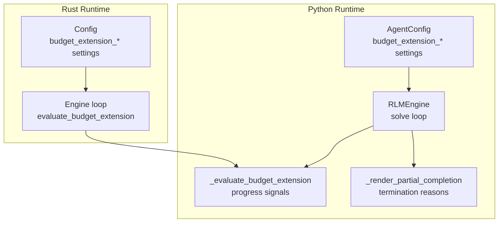
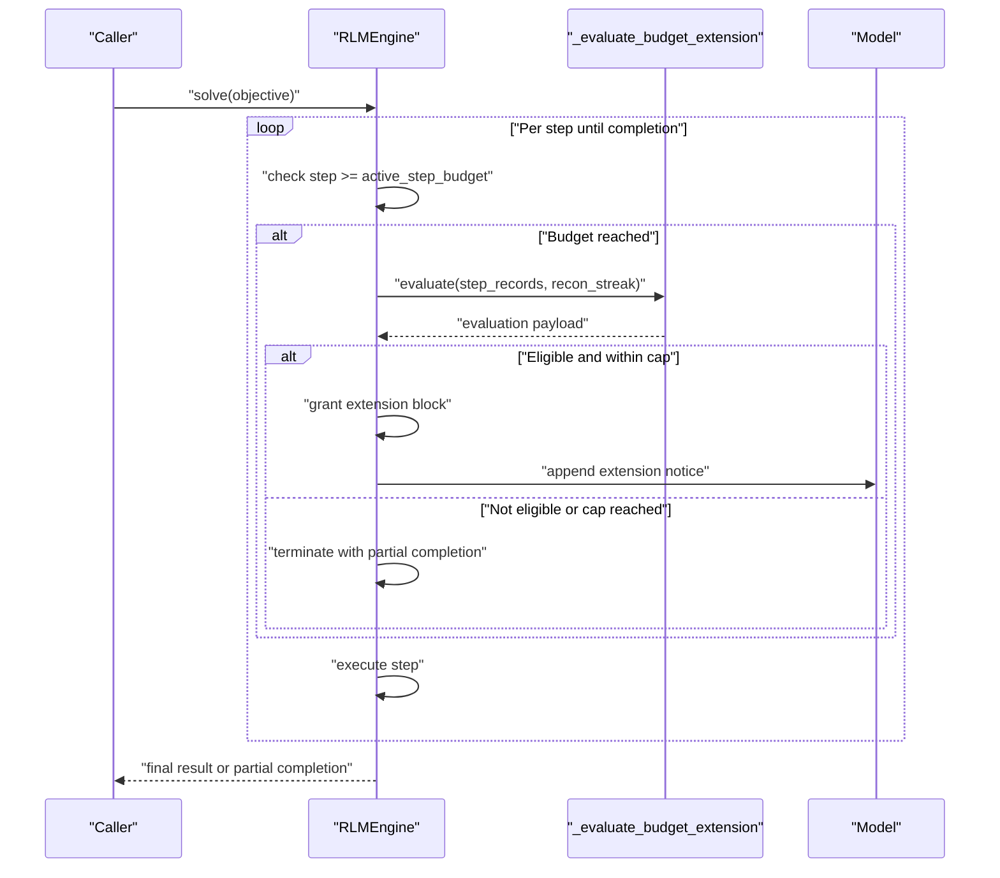
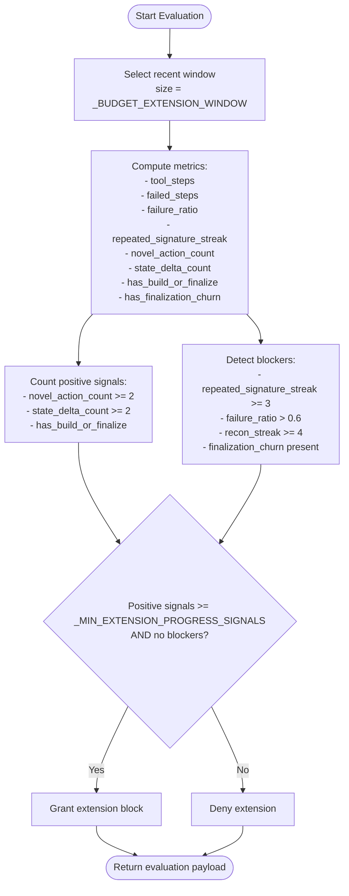
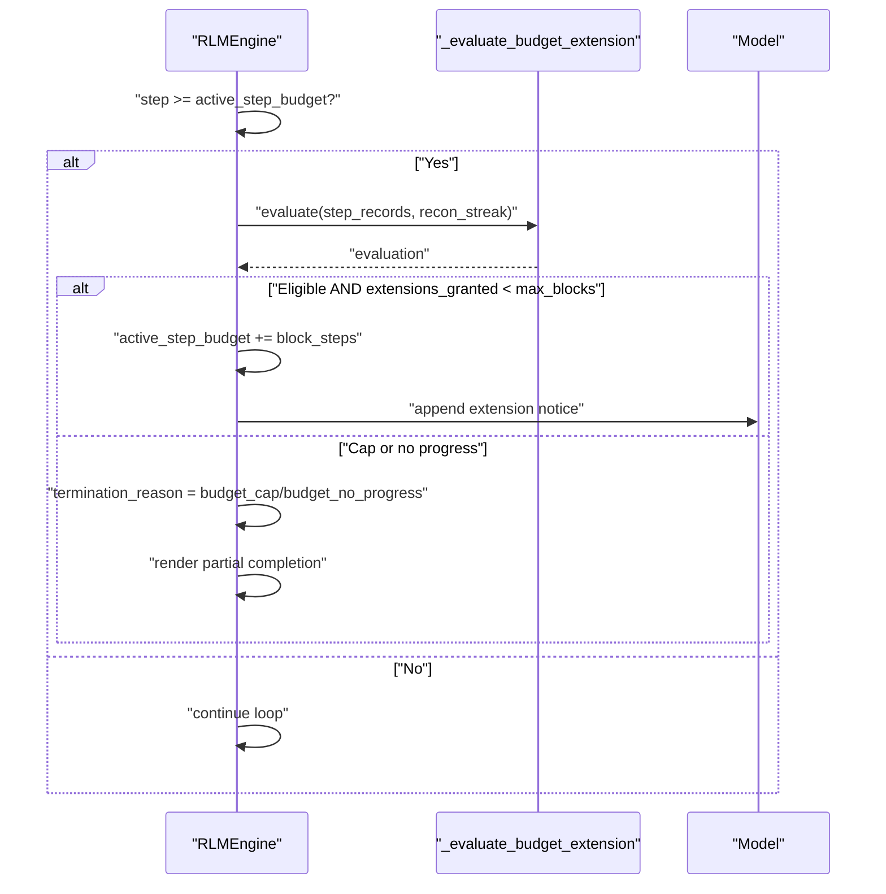
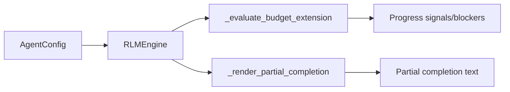

# Budget Management

<cite>
**Referenced Files in This Document**
- [engine.py](file://agent/engine.py)
- [config.py](file://agent/config.py)
- [test_engine_complex.py](file://tests/test_engine_complex.py)
- [mod.rs](file://openplanter-desktop/crates/op-core/src/engine/mod.rs)
</cite>

## Table of Contents
1. [Introduction](#introduction)
2. [Project Structure](#project-structure)
3. [Core Components](#core-components)
4. [Architecture Overview](#architecture-overview)
5. [Detailed Component Analysis](#detailed-component-analysis)
6. [Dependency Analysis](#dependency-analysis)
7. [Performance Considerations](#performance-considerations)
8. [Troubleshooting Guide](#troubleshooting-guide)
9. [Conclusion](#conclusion)

## Introduction
This document explains the budget management subsystem that governs agent execution limits, progress-based budget extensions, and automatic termination with partial completions. It covers the token and step budget system, cost tracking mechanisms, budget extension algorithms, progress signal detection, and automatic budget adjustment logic. Practical guidance is included for configuring budget limits, monitoring costs, and optimizing model usage across different investigation types.

## Project Structure
The budget management logic spans Python and Rust implementations with shared semantics:
- Python engine defines the budget extension evaluation, progress tracking, and termination rendering.
- Rust engine mirrors the evaluation and extension logic for the desktop client.
- Configuration supports toggling budget extensions, setting block sizes, and caps via environment variables.

**Diagram sources**
- [engine.py:118-120](file://agent/engine.py#L118-L120)
- [engine.py:357-428](file://agent/engine.py#L357-L428)
- [engine.py:466-500](file://agent/engine.py#L466-L500)
- [mod.rs:2243-2262](file://openplanter-desktop/crates/op-core/src/engine/mod.rs#L2243-L2262)
- [mod.rs:1044-1060](file://openplanter-desktop/crates/op-core/src/engine/mod.rs#L1044-L1060)

**Section sources**
- [engine.py:118-120](file://agent/engine.py#L118-L120)
- [engine.py:357-428](file://agent/engine.py#L357-L428)
- [engine.py:466-500](file://agent/engine.py#L466-L500)
- [mod.rs:2243-2262](file://openplanter-desktop/crates/op-core/src/engine/mod.rs#L2243-L2262)
- [mod.rs:1044-1060](file://openplanter-desktop/crates/op-core/src/engine/mod.rs#L1044-L1060)

## Core Components
- Budget extension constants: fixed window size and minimum progress signals threshold.
- Progress tracking: per-step records capturing tool usage, failures, action/state deltas, previews, and phases.
- Extension evaluation: computes failure ratio, repeated signature streak, novel actions, state deltas, and blockers.
- Automatic budget adjustment: grants temporary blocks when eligible, updates metrics, and renders partial completion on cap or stall.

Key elements:
- Constants: window size and progress signal threshold.
- StepProgressRecord: structured per-step telemetry.
- _evaluate_budget_extension: core algorithm for eligibility.
- RLMEngine loop: checks budget, evaluates extension, adjusts budget, and terminates with partial completion when needed.
- Environment-driven configuration: toggles and limits for budget extensions.

**Section sources**
- [engine.py:118-120](file://agent/engine.py#L118-L120)
- [engine.py:236-249](file://agent/engine.py#L236-L249)
- [engine.py:357-428](file://agent/engine.py#L357-L428)
- [engine.py:1578-1615](file://agent/engine.py#L1578-L1615)
- [engine.py:466-500](file://agent/engine.py#L466-L500)
- [config.py:326-334](file://agent/config.py#L326-L334)
- [config.py:467-469](file://agent/config.py#L467-L469)

## Architecture Overview
The budget management architecture enforces two-tier controls:
- Hard step budget: stops execution when steps exceed configured limits.
- Soft budget extension: periodically evaluates progress within a sliding window and grants temporary budget blocks when justified.

**Diagram sources**
- [engine.py:1578-1615](file://agent/engine.py#L1578-L1615)
- [engine.py:357-428](file://agent/engine.py#L357-L428)
- [engine.py:466-500](file://agent/engine.py#L466-L500)

## Detailed Component Analysis

### Budget Extension Algorithm
The algorithm evaluates a fixed-size sliding window of recent steps to decide whether to grant a temporary budget extension. It balances positive progress signals against explicit blockers.

**Diagram sources**
- [engine.py:357-428](file://agent/engine.py#L357-L428)
- [engine.py:118-120](file://agent/engine.py#L118-L120)

**Section sources**
- [engine.py:357-428](file://agent/engine.py#L357-L428)
- [engine.py:118-120](file://agent/engine.py#L118-L120)

### Progress Signal Detection
Signals are derived from the evaluation window:
- Novel actions: unique action signatures since prior steps.
- State deltas: unique state change signatures in the window.
- Build/finalize presence: indicates progression into artifact creation or synthesis.
- Finalization churn: detects cycles during finalization (e.g., repeated rejections or rewrite-only violations).

Blockers prevent extension when:
- Repeated signature streak exceeds threshold.
- Failure ratio exceeds threshold.
- Reconnaissance streak exceeds threshold.
- Finalization churn detected.

**Section sources**
- [engine.py:357-428](file://agent/engine.py#L357-L428)
- [engine.py:333-354](file://agent/engine.py#L333-L354)

### Automatic Budget Adjustment Logic
When the active step budget is reached:
- Evaluate extension eligibility.
- If eligible and within max blocks, increment budget by block size and append a system notice.
- If cap reached or no progress, terminate with partial completion and record termination reason.

**Diagram sources**
- [engine.py:1578-1615](file://agent/engine.py#L1578-L1615)
- [engine.py:466-500](file://agent/engine.py#L466-L500)

**Section sources**
- [engine.py:1578-1615](file://agent/engine.py#L1578-L1615)
- [engine.py:466-500](file://agent/engine.py#L466-L500)

### Partial Completion Rendering
On termination, the system constructs a human-readable summary including:
- Objective, steps taken, extensions granted, and termination reason.
- Completed work previews.
- Suggested next actions based on evaluation blockers.

**Section sources**
- [engine.py:466-500](file://agent/engine.py#L466-L500)

### Configuration and Environment Variables
Budget extension behavior is controlled by AgentConfig and environment variables:
- Toggle: enable/disable budget extensions.
- Block size: steps granted per extension.
- Max blocks: total allowed extension blocks.
- Base step budget: max steps per call.

Environment variable normalization ensures defaults and bounds.

**Section sources**
- [config.py:326-334](file://agent/config.py#L326-L334)
- [config.py:467-469](file://agent/config.py#L467-L469)
- [config.py:262-494](file://agent/config.py#L262-L494)

### Cross-Language Consistency (Rust)
The Rust engine implements equivalent logic for evaluation and extension checks, mirroring the Python algorithm and metrics.

**Section sources**
- [mod.rs:1044-1060](file://openplanter-desktop/crates/op-core/src/engine/mod.rs#L1044-L1060)
- [mod.rs:2243-2262](file://openplanter-desktop/crates/op-core/src/engine/mod.rs#L2243-L2262)

## Dependency Analysis
The budget management subsystem depends on:
- Agent configuration for budget extension parameters.
- StepProgressRecord for per-step telemetry.
- Environment variable parsing for runtime overrides.

**Diagram sources**
- [engine.py:146-150](file://agent/engine.py#L146-L150)
- [engine.py:357-428](file://agent/engine.py#L357-L428)
- [engine.py:466-500](file://agent/engine.py#L466-L500)

**Section sources**
- [engine.py:146-150](file://agent/engine.py#L146-L150)
- [engine.py:357-428](file://agent/engine.py#L357-L428)
- [engine.py:466-500](file://agent/engine.py#L466-L500)

## Performance Considerations
- Sliding window size: larger windows smooth transient noise but increase computation overhead.
- Minimum progress signals: raising thresholds reduces false positives but may delay extensions.
- Extension block size: smaller blocks reduce risk of runaway loops; larger blocks improve throughput for sustained progress.
- Termination rendering: avoid excessive previews to minimize overhead.

## Troubleshooting Guide
Common scenarios and mitigations:
- High failure ratio prevents extension: triage failing tool calls to reduce avoidable errors before resuming.
- Repeated signature streak blocks extension: switch tactics and avoid repeating the same command pattern.
- Reconnaissance streak stalls: move from exploration into artifact building or synthesis.
- Finalization churn detected: rewrite the final answer from completed work only; avoid further tool calls or artifact churn.
- Budget cap reached: accept partial completion and refine the objective for subsequent runs.
- Budget exhausted with no progress: review evaluation blockers and adjust strategy.

Practical checks:
- Inspect last budget extension evaluation payload for blockers.
- Verify termination reason recorded in loop metrics.
- Confirm budget extension enabled and configured limits are appropriate for the investigation type.

**Section sources**
- [engine.py:431-449](file://agent/engine.py#L431-L449)
- [engine.py:1606-1615](file://agent/engine.py#L1606-L1615)
- [test_engine_complex.py:70-94](file://tests/test_engine_complex.py#L70-L94)
- [test_engine_complex.py:273-298](file://tests/test_engine_complex.py#L273-L298)

## Conclusion
The budget management subsystem provides robust, progress-aware execution control. By combining a hard step budget with soft, windowed extension checks, it balances cost control with flexibility for sustained progress. Proper configuration and monitoring enable effective cost optimization across diverse investigation types while ensuring graceful partial completions when budgets are exhausted.