# Investigation Engine

<cite>
**Referenced Files in This Document**
- [engine.py](file://agent/engine.py)
- [model.py](file://agent/model.py)
- [tools.py](file://agent/tools.py)
- [mod.rs](file://openplanter-desktop/crates/op-core/src/engine/mod.rs)
- [context.rs](file://openplanter-desktop/crates/op-core/src/engine/context.rs)
- [investigation_state.rs](file://openplanter-desktop/crates/op-core/src/engine/investigation_state.rs)
- [judge.rs](file://openplanter-desktop/crates/op-core/src/engine/judge.rs)
- [mod.rs](file://openplanter-desktop/crates/op-core/src/model/mod.rs)
- [mod.rs](file://openplanter-desktop/crates/op-core/src/tools/mod.rs)
- [investigation_state.py](file://agent/investigation_state.py)
</cite>

## Table of Contents
1. [Introduction](#introduction)
2. [Project Structure](#project-structure)
3. [Core Components](#core-components)
4. [Architecture Overview](#architecture-overview)
5. [Detailed Component Analysis](#detailed-component-analysis)
6. [Dependency Analysis](#dependency-analysis)
7. [Performance Considerations](#performance-considerations)
8. [Troubleshooting Guide](#troubleshooting-guide)
9. [Conclusion](#conclusion)

## Introduction
This document explains the investigation engine’s recursive language model execution system. It covers the core recursive problem-solving architecture, budget management for model calls, progress tracking, subtask delegation, acceptance criteria evaluation, parallel processing, context window condensation, observation processing, and state management. It also provides practical investigation workflow examples, recursive delegation patterns, performance optimization strategies, and troubleshooting guidance. The Rust implementation in the core library integrates with the Python CLI agent to deliver a robust, scalable investigation loop.

## Project Structure
The investigation engine spans two layers:
- Python agent layer: orchestrates recursive solving, budgets, progress tracking, and acceptance criteria evaluation.
- Rust core layer: provides the engine loop, streaming model calls, context condensation, parallel writes, and typed state management.

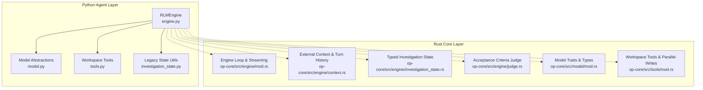

**Diagram sources**
- [engine.py:504-800](file://agent/engine.py#L504-L800)
- [mod.rs:1-200](file://openplanter-desktop/crates/op-core/src/engine/mod.rs#L1-L200)
- [context.rs:1-120](file://openplanter-desktop/crates/op-core/src/engine/context.rs#L1-L120)
- [investigation_state.rs:1-120](file://openplanter-desktop/crates/op-core/src/engine/investigation_state.rs#L1-L120)
- [judge.rs:1-80](file://openplanter-desktop/crates/op-core/src/engine/judge.rs#L1-L80)
- [mod.rs:1-85](file://openplanter-desktop/crates/op-core/src/model/mod.rs#L1-L85)
- [mod.rs:1-120](file://openplanter-desktop/crates/op-core/src/tools/mod.rs#L1-L120)

**Section sources**
- [engine.py:504-800](file://agent/engine.py#L504-L800)
- [mod.rs:1-200](file://openplanter-desktop/crates/op-core/src/engine/mod.rs#L1-L200)

## Core Components
- Recursive Language Model Engine (RLMEngine): Orchestrates recursive solving, tool definitions, budget extension evaluation, and finalization logic.
- Model Abstractions: Unified traits and data types for streaming model calls and tool definitions across providers.
- Workspace Tools: Filesystem, shell, web, OCR, transcription, and patching tools with runtime policies and parallel write scoping.
- Typed Investigation State: Canonical, typed state for observations, evidence, claims, questions, and actions; supports migration from legacy formats.
- External Context and Turn History: Persistent summaries and observations across turns.
- Acceptance Criteria Judge: Heuristic-based evaluation of whether results satisfy acceptance criteria.

Key responsibilities:
- Budget management: Tracks steps, tool usage, and determines budget extensions based on progress signals.
- Progress tracking: Builds step progress records, detects stalls, and suggests next actions.
- Subtask delegation: Enforces recursion depth and delegation-only turns when required.
- Finalization: Validates final answers and rescues partial completions when needed.
- Parallel processing: Coordinates parallel writes and runtime policies to prevent conflicts.

**Section sources**
- [engine.py:504-800](file://agent/engine.py#L504-L800)
- [mod.rs:1-200](file://openplanter-desktop/crates/op-core/src/engine/mod.rs#L1-L200)
- [context.rs:1-120](file://openplanter-desktop/crates/op-core/src/engine/context.rs#L1-L120)
- [investigation_state.rs:1-120](file://openplanter-desktop/crates/op-core/src/engine/investigation_state.rs#L1-L120)
- [judge.rs:1-80](file://openplanter-desktop/crates/op-core/src/engine/judge.rs#L1-L80)
- [mod.rs:1-85](file://openplanter-desktop/crates/op-core/src/model/mod.rs#L1-L85)
- [mod.rs:1-120](file://openplanter-desktop/crates/op-core/src/tools/mod.rs#L1-L120)

## Architecture Overview
The engine runs a multi-step, recursive loop:
- Build initial user message with objective, recursion depth, and session context.
- Stream model turns with tool definitions and handle rate limits.
- Execute tool calls via WorkspaceTools with runtime policies and parallel write scopes.
- Condense context when approaching model context limits.
- Evaluate budget extensions and finalization readiness.
- Persist external context and turn outcomes to typed and legacy state.

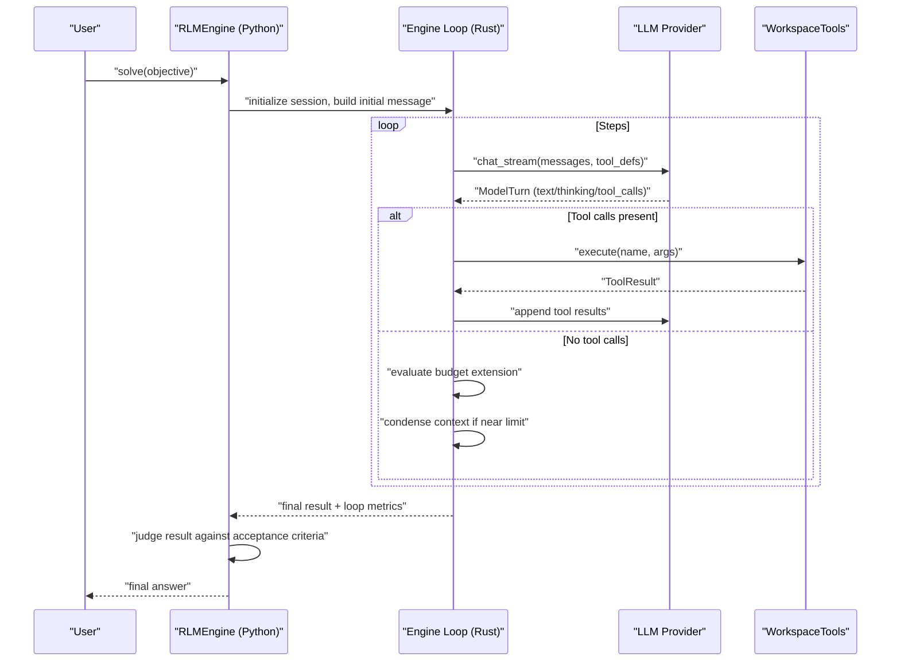

**Diagram sources**
- [engine.py:586-628](file://agent/engine.py#L586-L628)
- [mod.rs:391-483](file://openplanter-desktop/crates/op-core/src/engine/mod.rs#L391-L483)
- [mod.rs:60-85](file://openplanter-desktop/crates/op-core/src/model/mod.rs#L60-L85)
- [mod.rs:280-722](file://openplanter-desktop/crates/op-core/src/tools/mod.rs#L280-L722)

## Detailed Component Analysis

### Recursive Problem-Solving Architecture
- Depth-first recursion with enforced delegation: The engine computes required subtask depth based on objective complexity and recursion policy, ensuring delegation-only turns when needed.
- Forced delegation classification: Detects invalid or missing subtask turns and enforces correct delegation patterns.
- Delegation policy messaging: Guides the model to issue subtask(...) calls with proper acceptance criteria when required.

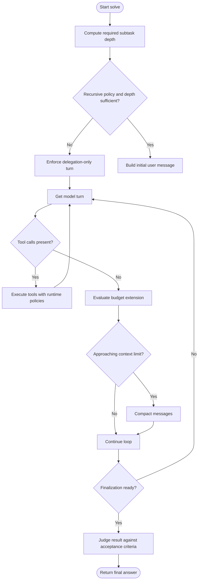

**Diagram sources**
- [engine.py:559-581](file://agent/engine.py#L559-L581)
- [engine.py:791-800](file://agent/engine.py#L791-L800)
- [mod.rs:749-765](file://openplanter-desktop/crates/op-core/src/engine/mod.rs#L749-L765)
- [mod.rs:391-413](file://openplanter-desktop/crates/op-core/src/engine/mod.rs#L391-L413)

**Section sources**
- [engine.py:559-581](file://agent/engine.py#L559-L581)
- [engine.py:791-800](file://agent/engine.py#L791-L800)
- [mod.rs:749-765](file://openplanter-desktop/crates/op-core/src/engine/mod.rs#L749-L765)
- [mod.rs:391-413](file://openplanter-desktop/crates/op-core/src/engine/mod.rs#L391-L413)

### Budget Management for Model Calls
- Window-based evaluation: Uses recent steps to compute failure ratios, repeated signatures, and novel actions to decide budget extensions.
- Positive signals: Novel actions, state deltas, and build/finalize phases increase eligibility.
- Blockers: Repeated signatures, high failure ratio, long reconnaissance streaks, and finalization churn reduce eligibility.
- Extension eligibility threshold: Requires a minimum number of positive signals and no blockers.

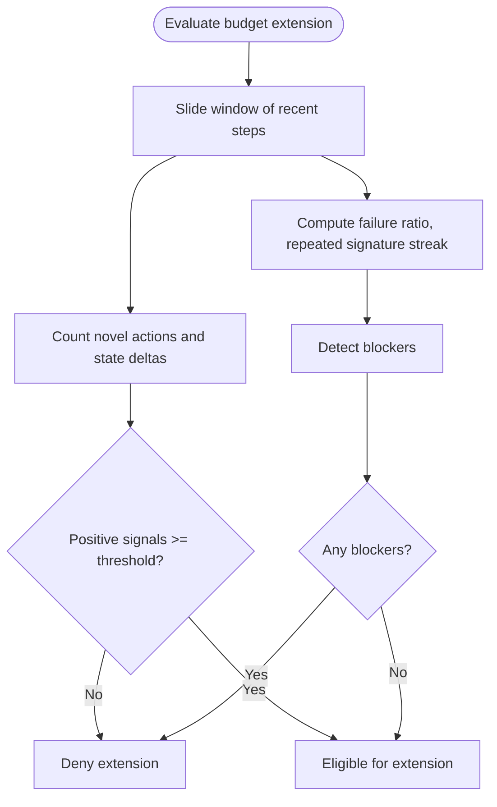

**Diagram sources**
- [engine.py:357-428](file://agent/engine.py#L357-L428)

**Section sources**
- [engine.py:357-428](file://agent/engine.py#L357-L428)

### Progress Tracking Mechanisms
- StepProgressRecord captures tool counts, failed steps, action signatures, and state deltas.
- Normalization and previews summarize completed work for suggestions and partial completions.
- Special records flag final rejections, rewrite-only violations, and post-finalization churn.

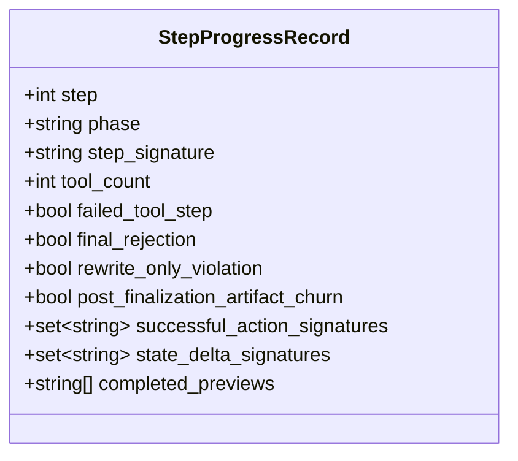

**Diagram sources**
- [engine.py:236-354](file://agent/engine.py#L236-L354)

**Section sources**
- [engine.py:236-354](file://agent/engine.py#L236-L354)

### Subtask Delegation System
- Required depth computation: Auto-detects complexity in objectives and applies recursion policy.
- Forced delegation detection: Ensures model adheres to delegation-only turns when required.
- Delegation policy messaging: Instructs model to issue subtask(...) calls with acceptance criteria.

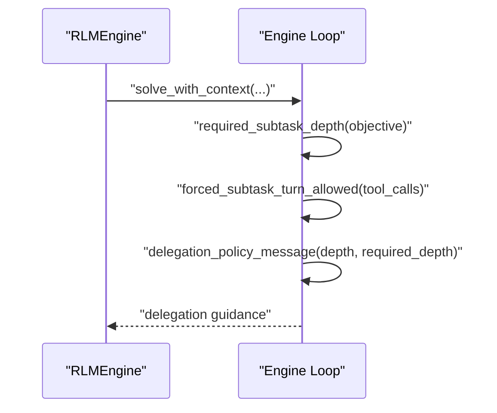

**Diagram sources**
- [engine.py:559-581](file://agent/engine.py#L559-L581)
- [engine.py:791-800](file://agent/engine.py#L791-L800)
- [mod.rs:749-765](file://openplanter-desktop/crates/op-core/src/engine/mod.rs#L749-L765)

**Section sources**
- [engine.py:559-581](file://agent/engine.py#L559-L581)
- [engine.py:791-800](file://agent/engine.py#L791-L800)
- [mod.rs:749-765](file://openplanter-desktop/crates/op-core/src/engine/mod.rs#L749-L765)

### Acceptance Criteria Evaluation
- Heuristic judge: Extracts significant terms from criteria and scores matches.
- Verdicts: Pass (≥70%), Partial (≥30%), Fail (<30%).
- Integration: Optional judge model is cached and used to evaluate subtask results.

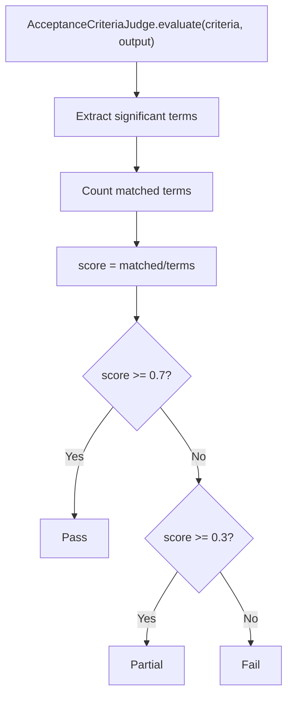

**Diagram sources**
- [judge.rs:38-77](file://openplanter-desktop/crates/op-core/src/engine/judge.rs#L38-L77)

**Section sources**
- [engine.py:660-704](file://agent/engine.py#L660-L704)
- [judge.rs:38-77](file://openplanter-desktop/crates/op-core/src/engine/judge.rs#L38-L77)

### Parallel Processing Capabilities
- Parallel write scopes: Prevent cross-task writes by claiming targets per scope and owner.
- Runtime policies: Enforce shell safety, limit background jobs, and detect interactive commands.
- Background jobs: Start, poll, and terminate background shell commands safely.

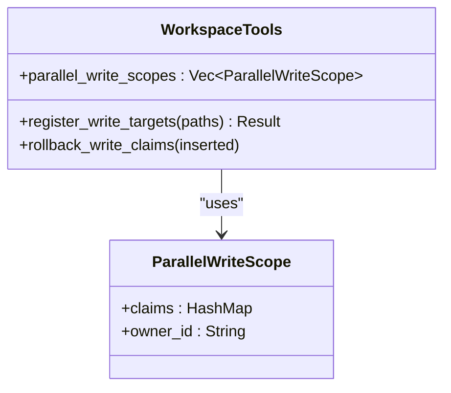

**Diagram sources**
- [mod.rs:49-53](file://openplanter-desktop/crates/op-core/src/tools/mod.rs#L49-L53)
- [mod.rs:243-278](file://openplanter-desktop/crates/op-core/src/tools/mod.rs#L243-L278)
- [mod.rs:56-95](file://openplanter-desktop/crates/op-core/src/tools/mod.rs#L56-L95)

**Section sources**
- [mod.rs:49-53](file://openplanter-desktop/crates/op-core/src/tools/mod.rs#L49-L53)
- [mod.rs:243-278](file://openplanter-desktop/crates/op-core/src/tools/mod.rs#L243-L278)
- [mod.rs:56-95](file://openplanter-desktop/crates/op-core/src/tools/mod.rs#L56-L95)
- [tools.py:216-252](file://agent/tools.py#L216-L252)

### Context Window Condensation
- Token estimation: Rough estimate of tokens for message sizing.
- Message compaction: Retains system/user messages and recent assistant/tool messages while truncating older tool results.
- Rate-limit backoff: Computes delays with retry-after caps and exponential backoff.

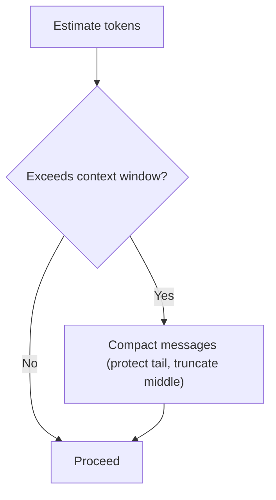

**Diagram sources**
- [mod.rs:250-274](file://openplanter-desktop/crates/op-core/src/engine/mod.rs#L250-L274)
- [mod.rs:391-413](file://openplanter-desktop/crates/op-core/src/engine/mod.rs#L391-L413)
- [mod.rs:415-430](file://openplanter-desktop/crates/op-core/src/engine/mod.rs#L415-L430)

**Section sources**
- [mod.rs:250-274](file://openplanter-desktop/crates/op-core/src/engine/mod.rs#L250-L274)
- [mod.rs:391-413](file://openplanter-desktop/crates/op-core/src/engine/mod.rs#L391-L413)
- [mod.rs:415-430](file://openplanter-desktop/crates/op-core/src/engine/mod.rs#L415-L430)

### Observation Processing and State Management
- ExternalContext: Adds observations with timestamps and persists to both typed and legacy state.
- TurnHistory: Summarizes completed turns and truncates to a bounded history.
- Typed InvestigationState: Canonical state schema with indexes, legacy migration, and projections for compatibility.

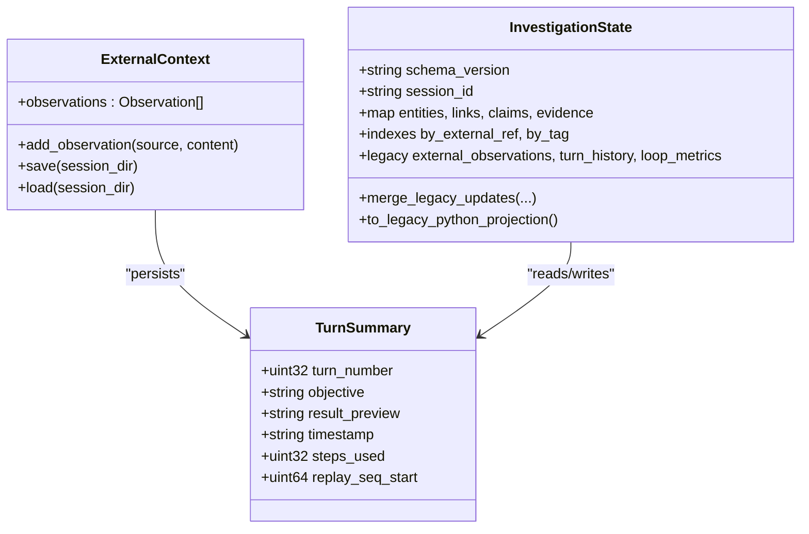

**Diagram sources**
- [context.rs:18-48](file://openplanter-desktop/crates/op-core/src/engine/context.rs#L18-L48)
- [context.rs:136-164](file://openplanter-desktop/crates/op-core/src/engine/context.rs#L136-L164)
- [investigation_state.rs:23-63](file://openplanter-desktop/crates/op-core/src/engine/investigation_state.rs#L23-L63)
- [investigation_state.py:31-68](file://agent/investigation_state.py#L31-L68)

**Section sources**
- [context.rs:18-48](file://openplanter-desktop/crates/op-core/src/engine/context.rs#L18-L48)
- [context.rs:136-164](file://openplanter-desktop/crates/op-core/src/engine/context.rs#L136-L164)
- [investigation_state.rs:23-63](file://openplanter-desktop/crates/op-core/src/engine/investigation_state.rs#L23-L63)
- [investigation_state.py:31-68](file://agent/investigation_state.py#L31-L68)

### Practical Investigation Workflows and Patterns
- Recursive delegation pattern: Break complex objectives into subtasks with acceptance criteria; enforce delegation-only turns when policy requires.
- Budget extension strategy: Focus on varied tool usage, produce state deltas, and avoid repeated patterns to earn extensions.
- Finalization rescue: When finalization stalls, use a “rescue” system prompt to rewrite rejected candidates into the final deliverable.

Example scenarios:
- Investigate multi-surface topics: Use reconnaissance to gather context, then delegate into artifact-building or synthesis.
- Multi-phase objectives: Detect phrases indicating multiple phases and auto-enable recursion depth.
- Artifact-heavy tasks: Prefer build/finalize phases to signal readiness for acceptance criteria evaluation.

**Section sources**
- [engine.py:166-178](file://agent/engine.py#L166-L178)
- [engine.py:431-449](file://agent/engine.py#L431-L449)
- [engine.py:777-800](file://agent/engine.py#L777-L800)
- [mod.rs:749-765](file://openplanter-desktop/crates/op-core/src/engine/mod.rs#L749-L765)

### Performance Optimization Strategies
- Streaming model calls: Use streaming to reduce latency and enable early intervention on rate limits.
- Context condensation: Proactively truncate older tool results to keep conversations compact.
- Parallel writes: Use parallel write scopes to avoid conflicts and improve throughput.
- Rate-limit backoff: Respect provider retry-after and cap delays to minimize wasted time.
- Observation clipping: Limit observation sizes to reduce token overhead.

**Section sources**
- [mod.rs:432-483](file://openplanter-desktop/crates/op-core/src/engine/mod.rs#L432-L483)
- [mod.rs:391-413](file://openplanter-desktop/crates/op-core/src/engine/mod.rs#L391-L413)
- [mod.rs:243-278](file://openplanter-desktop/crates/op-core/src/tools/mod.rs#L243-L278)
- [mod.rs:415-430](file://openplanter-desktop/crates/op-core/src/engine/mod.rs#L415-L430)
- [tools.py:185-189](file://agent/tools.py#L185-L189)

## Dependency Analysis
The Python engine depends on:
- Model abstractions for streaming and tool definitions.
- Workspace tools for executing actions with runtime policies.
- Typed and legacy state for persistence and continuity.

The Rust engine provides:
- Streaming model integration, context condensation, and loop metrics.
- Typed state management and curator checkpoints.
- Parallel write coordination and runtime safety.

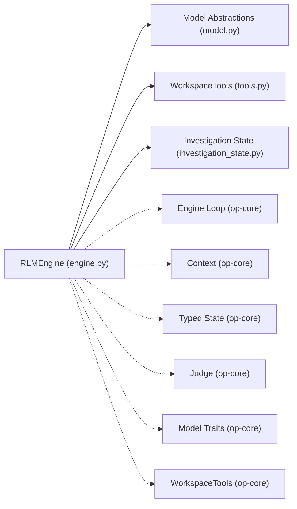

**Diagram sources**
- [engine.py:15-21](file://agent/engine.py#L15-L21)
- [mod.rs:22-31](file://openplanter-desktop/crates/op-core/src/engine/mod.rs#L22-L31)
- [context.rs:1-12](file://openplanter-desktop/crates/op-core/src/engine/context.rs#L1-L12)
- [investigation_state.rs:1-12](file://openplanter-desktop/crates/op-core/src/engine/investigation_state.rs#L1-L12)
- [judge.rs:1-6](file://openplanter-desktop/crates/op-core/src/engine/judge.rs#L1-L6)
- [mod.rs:1-9](file://openplanter-desktop/crates/op-core/src/model/mod.rs#L1-L9)
- [mod.rs:1-14](file://openplanter-desktop/crates/op-core/src/tools/mod.rs#L1-L14)

**Section sources**
- [engine.py:15-21](file://agent/engine.py#L15-L21)
- [mod.rs:22-31](file://openplanter-desktop/crates/op-core/src/engine/mod.rs#L22-L31)

## Performance Considerations
- Prefer streaming model calls to enable earlier feedback and reduced latency.
- Keep context compact by truncating older tool results and summarizing observations.
- Use varied tool usage to signal progress and qualify for budget extensions.
- Limit observation sizes to reduce token overhead and speed up model calls.
- Apply parallel write scopes to avoid contention and improve throughput.

## Troubleshooting Guide
Common issues and resolutions:
- Rate limit errors: The engine retries with exponential backoff and respects retry-after headers. Adjust provider keys or reduce concurrency.
- Stalled finalization: Switch to a “rescue” prompt to rewrite rejected candidates into the final deliverable.
- Repeated tool patterns: Diversify tactics and avoid repeated signatures to qualify for budget extensions.
- High failure ratio: Triage failing tools first; fix path or permission issues before continuing.
- Shell policy violations: Avoid interactive commands and heredocs; use file writing or patching instead.
- Background jobs: Ensure background jobs are cleaned up on shutdown to prevent orphaned processes.

Debugging techniques:
- Inspect loop metrics and step events to identify stalls and blockers.
- Review external context and turn history to trace the progression of the investigation.
- Validate acceptance criteria scoring to ensure judge alignment with expectations.

**Section sources**
- [mod.rs:432-483](file://openplanter-desktop/crates/op-core/src/engine/mod.rs#L432-L483)
- [engine.py:431-449](file://agent/engine.py#L431-L449)
- [engine.py:660-704](file://agent/engine.py#L660-L704)
- [tools.py:203-214](file://agent/tools.py#L203-L214)
- [mod.rs:56-95](file://openplanter-desktop/crates/op-core/src/tools/mod.rs#L56-L95)

## Conclusion
The investigation engine combines a robust recursive language model loop with strong budget management, progress tracking, and state persistence. The Rust core layer ensures efficient streaming, parallel processing, and safety, while the Python agent layer coordinates high-level orchestration and acceptance criteria evaluation. Together, they enable scalable, auditable investigations with clear progress signals and actionable diagnostics.