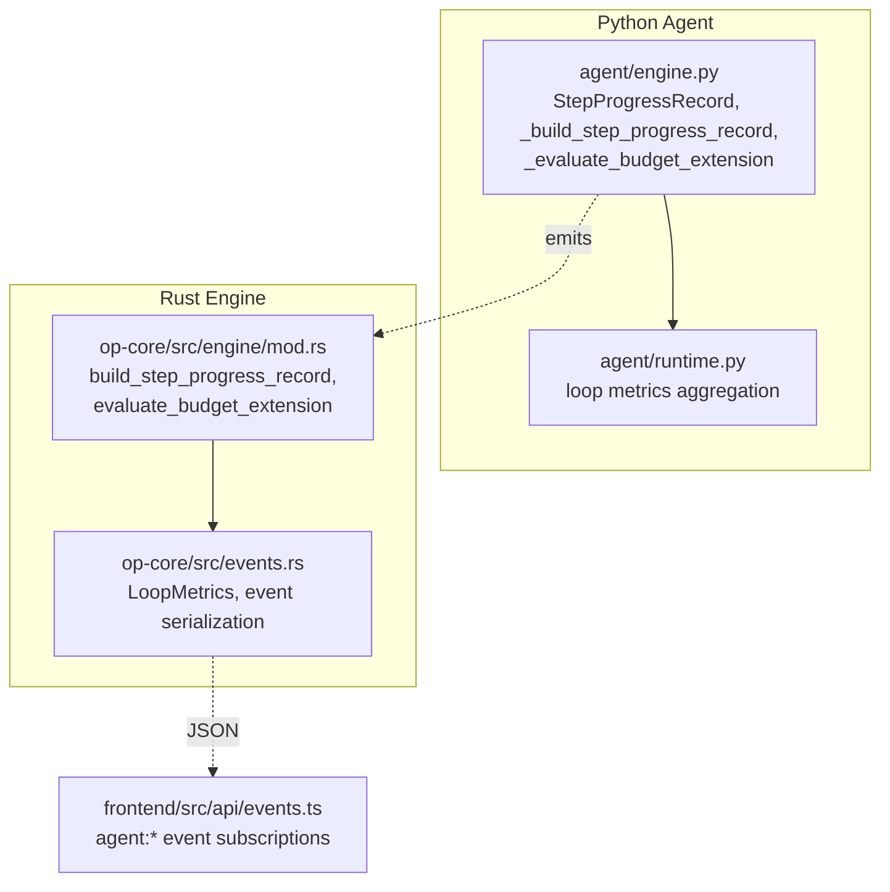
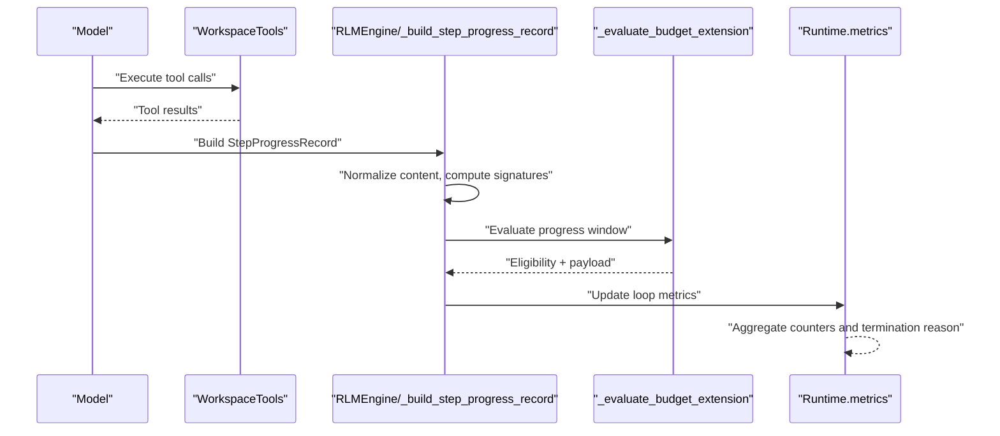
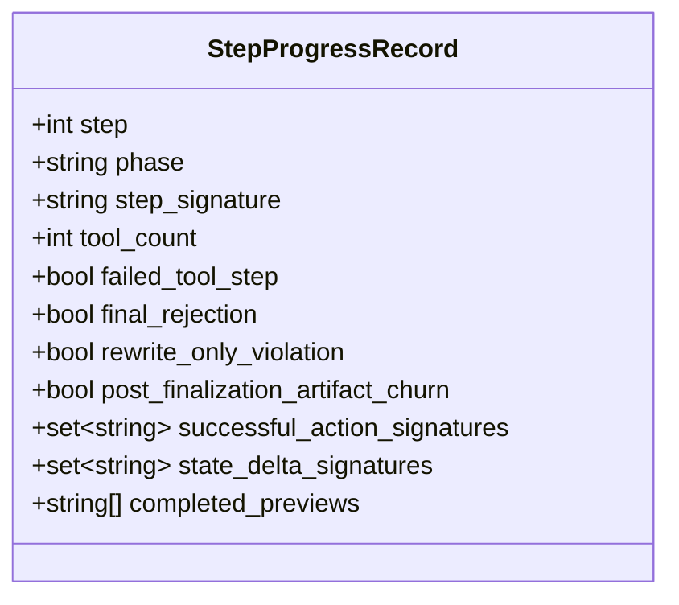
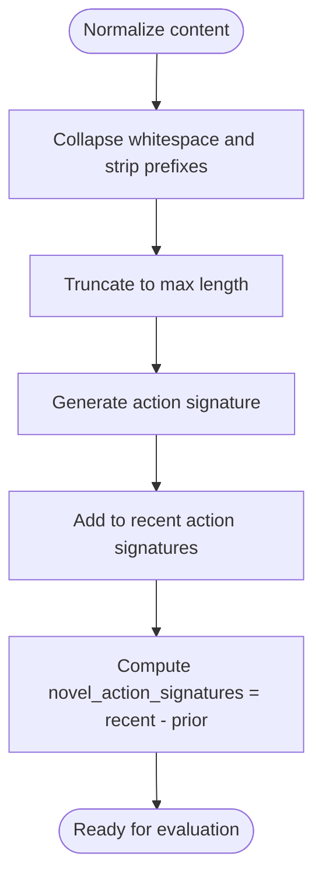
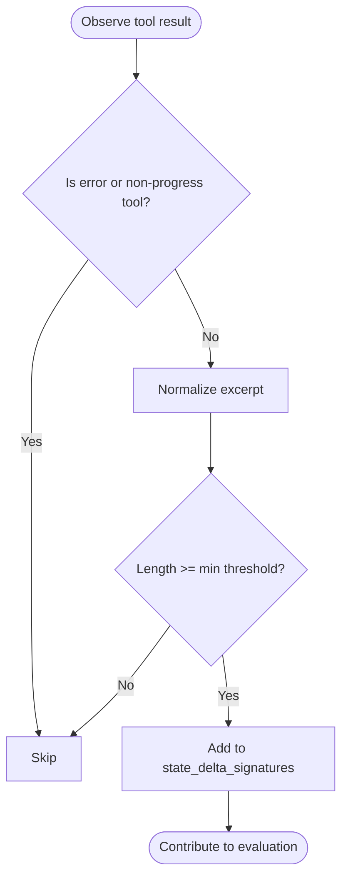
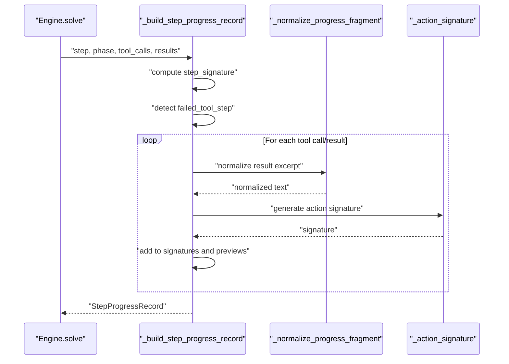
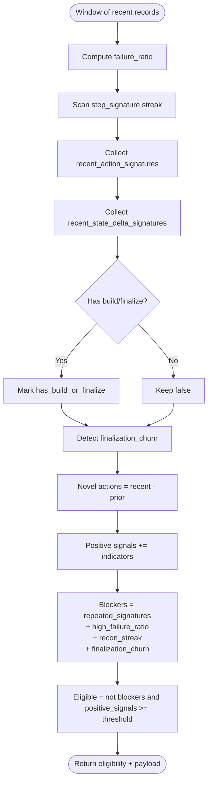
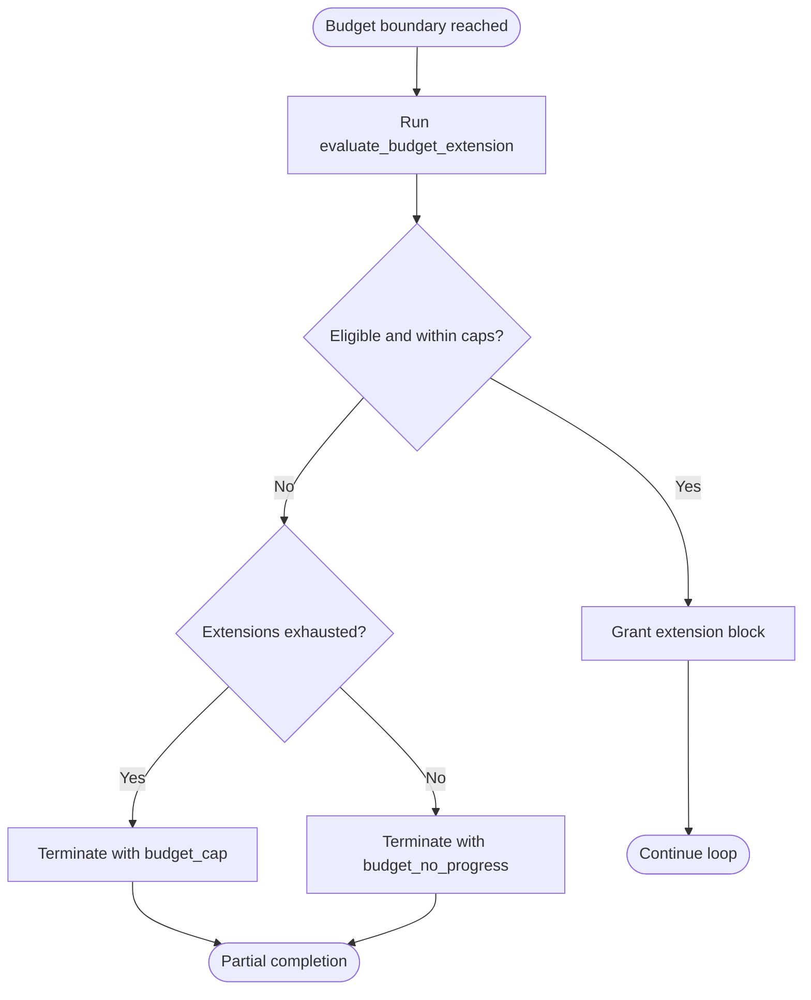
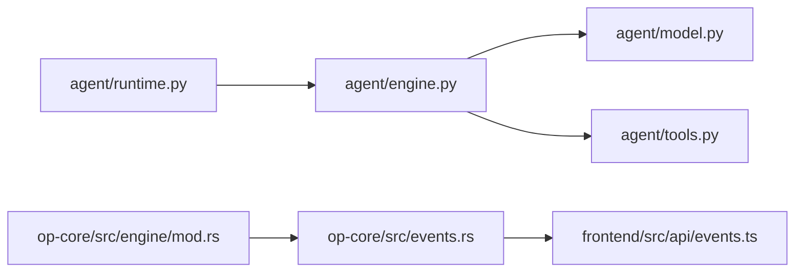

# Progress Tracking and Metrics

<cite>
**Referenced Files in This Document**
- [engine.py](file://agent/engine.py)
- [runtime.py](file://agent/runtime.py)
- [mod.rs](file://openplanter-desktop/crates/op-core/src/engine/mod.rs)
- [events.rs](file://openplanter-desktop/crates/op-core/src/events.rs)
- [events.ts](file://openplanter-desktop/frontend/src/api/events.ts)
- [test_engine_complex.py](file://tests/test_engine_complex.py)
</cite>

## Table of Contents
1. [Introduction](#introduction)
2. [Project Structure](#project-structure)
3. [Core Components](#core-components)
4. [Architecture Overview](#architecture-overview)
5. [Detailed Component Analysis](#detailed-component-analysis)
6. [Dependency Analysis](#dependency-analysis)
7. [Performance Considerations](#performance-considerations)
8. [Troubleshooting Guide](#troubleshooting-guide)
9. [Conclusion](#conclusion)

## Introduction
This document explains the progress tracking and metrics subsystem that governs investigation loops, including the StepProgressRecord system, action signature tracking, and state delta monitoring. It documents the _build_step_progress_record function, progress evaluation algorithms, and termination condition detection. Practical examples illustrate monitoring patterns, performance metrics collection, and workflow analytics. Guidance is provided for interpreting progress metrics, identifying bottlenecks, and optimizing investigation workflows via automated decisions based on progress signals.

## Project Structure
The progress tracking system spans two implementations:
- Python agent engine: defines StepProgressRecord, normalization, action/state signature extraction, and budget extension evaluation.
- Rust engine: mirrors the Python logic for robustness and performance, emitting structured metrics and events.

**Diagram sources**
- [engine.py:236-428](file://agent/engine.py#L236-L428)
- [runtime.py:940-980](file://agent/runtime.py#L940-L980)
- [mod.rs:974-1158](file://openplanter-desktop/crates/op-core/src/engine/mod.rs#L974-L1158)
- [events.rs:660-688](file://openplanter-desktop/crates/op-core/src/events.rs#L660-L688)
- [events.ts:1-51](file://openplanter-desktop/frontend/src/api/events.ts#L1-L51)

**Section sources**
- [engine.py:236-428](file://agent/engine.py#L236-L428)
- [runtime.py:940-980](file://agent/runtime.py#L940-L980)
- [mod.rs:974-1158](file://openplanter-desktop/crates/op-core/src/engine/mod.rs#L974-L1158)
- [events.rs:660-688](file://openplanter-desktop/crates/op-core/src/events.rs#L660-L688)
- [events.ts:1-51](file://openplanter-desktop/frontend/src/api/events.ts#L1-L51)

## Core Components
- StepProgressRecord: Captures per-step progress, including tool usage, artifacts, errors, action signatures, state deltas, and previews.
- Action signature tracking: Normalized fingerprints of tool invocations to detect novelty and repetition.
- State delta monitoring: Normalized excerpts of tool outputs to quantify meaningful change.
- Budget extension evaluation: Window-based scoring of progress signals and blockers to decide extension eligibility.

Key constants and thresholds:
- Budget extension window size and minimum positive signals threshold.
- Minimum meaningful result length to filter noise.
- Non-progress tool categories and artifact tool sets.

**Section sources**
- [engine.py:119-130](file://agent/engine.py#L119-L130)
- [engine.py:236-330](file://agent/engine.py#L236-L330)
- [engine.py:357-428](file://agent/engine.py#L357-L428)
- [mod.rs:974-1008](file://openplanter-desktop/crates/op-core/src/engine/mod.rs#L974-L1008)
- [mod.rs:1062-1158](file://openplanter-desktop/crates/op-core/src/engine/mod.rs#L1062-L1158)

## Architecture Overview
The system builds StepProgressRecord instances from tool calls and results, computes action/state signatures, and evaluates whether to grant a budget extension. Metrics are aggregated per loop and emitted as structured events for UI and analytics.

**Diagram sources**
- [engine.py:299-330](file://agent/engine.py#L299-L330)
- [engine.py:357-428](file://agent/engine.py#L357-L428)
- [runtime.py:1578-1604](file://agent/runtime.py#L1578-L1604)
- [runtime.py:940-980](file://agent/runtime.py#L940-L980)

## Detailed Component Analysis

### StepProgressRecord System
StepProgressRecord encapsulates:
- Signature: step-level fingerprint combining tool names, artifact presence, and error flag.
- Tool usage: total tool count and whether any step was a failed tool step.
- Special flags: final rejection, rewrite-only violation, post-finalization artifact churn.
- Action signatures: unique fingerprints of executed actions.
- State delta signatures: normalized excerpts indicating meaningful state change.
- Previews: summarized observations collected during the step.

**Diagram sources**
- [engine.py:236-248](file://agent/engine.py#L236-L248)

**Section sources**
- [engine.py:236-330](file://agent/engine.py#L236-L330)
- [mod.rs:974-998](file://openplanter-desktop/crates/op-core/src/engine/mod.rs#L974-L998)

### Action Signature Tracking
Action signatures are normalized fingerprints derived from tool names and sorted, compact argument JSON. They enable detecting novel actions across the run versus the recent window.

- Normalization: collapse whitespace, strip leading bracketed prefixes, truncate to a fixed length.
- Signature generation: join tool name with a normalized argument digest.
- Novelty computation: difference between recent and prior action signature sets.

**Diagram sources**
- [engine.py:251-262](file://agent/engine.py#L251-L262)
- [engine.py:398-398](file://agent/engine.py#L398-L398)

**Section sources**
- [engine.py:251-262](file://agent/engine.py#L251-L262)
- [engine.py:398-398](file://agent/engine.py#L398-L398)

### State Delta Monitoring
State delta signatures represent normalized excerpts of tool outputs to quantify meaningful change. Only results exceeding a minimum character threshold are considered.

- Normalization: similar to action signatures.
- Filtering: short outputs are ignored.
- Aggregation: recent state delta signatures inform progress signals.

**Diagram sources**
- [engine.py:319-330](file://agent/engine.py#L319-L330)
- [mod.rs:999-1008](file://openplanter-desktop/crates/op-core/src/engine/mod.rs#L999-L1008)

**Section sources**
- [engine.py:319-330](file://agent/engine.py#L319-L330)
- [mod.rs:999-1008](file://openplanter-desktop/crates/op-core/src/engine/mod.rs#L999-L1008)

### _build_step_progress_record Function
This function transforms tool calls and results into a StepProgressRecord:
- Computes step_signature from tool names, artifact presence, and error flag.
- Flags failed_tool_step if any tool result indicates failure.
- Builds successful_action_signatures and state_delta_signatures.
- Summarizes previews for recent context.

**Diagram sources**
- [engine.py:299-330](file://agent/engine.py#L299-L330)
- [mod.rs:974-1008](file://openplanter-desktop/crates/op-core/src/engine/mod.rs#L974-L1008)

**Section sources**
- [engine.py:299-330](file://agent/engine.py#L299-L330)
- [mod.rs:974-1008](file://openplanter-desktop/crates/op-core/src/engine/mod.rs#L974-L1008)

### Progress Evaluation Algorithms
The evaluation function operates over a fixed-size window of recent steps:
- Compute failure ratio from failed_tool_step counts.
- Track repeated_signature_streak to detect loops.
- Aggregate recent_action_signatures and recent_state_delta_signatures.
- Detect build/finalize activity and finalization churn.
- Score positive_signals and compile blockers.

**Diagram sources**
- [engine.py:357-428](file://agent/engine.py#L357-L428)
- [mod.rs:1062-1158](file://openplanter-desktop/crates/op-core/src/engine/mod.rs#L1062-L1158)

**Section sources**
- [engine.py:357-428](file://agent/engine.py#L357-L428)
- [mod.rs:1062-1158](file://openplanter-desktop/crates/op-core/src/engine/mod.rs#L1062-L1158)

### Termination Condition Detection
Termination occurs when:
- Budget cap is reached and no extension is granted.
- A finalization churn is detected (e.g., final rejection or rewrite-only violations).
- Repeated signatures persist beyond configured thresholds.
- Failure ratio exceeds the configured tolerance.

The runtime aggregates loop metrics and sets a termination reason accordingly.

**Diagram sources**
- [mod.rs:2243-2262](file://openplanter-desktop/crates/op-core/src/engine/mod.rs#L2243-L2262)
- [engine.py:1578-1604](file://agent/engine.py#L1578-L1604)
- [runtime.py:940-980](file://agent/runtime.py#L940-L980)

**Section sources**
- [mod.rs:2243-2262](file://openplanter-desktop/crates/op-core/src/engine/mod.rs#L2243-L2262)
- [engine.py:1578-1604](file://agent/engine.py#L1578-L1604)
- [runtime.py:940-980](file://agent/runtime.py#L940-L980)

### Practical Examples of Progress Monitoring Patterns
- Novel action detection: When recent_action_signatures grows by at least two distinct actions, it contributes a positive signal.
- State delta growth: When recent state_delta_signatures reaches a minimum cardinality, it contributes a positive signal.
- Build/finalize presence: Steps in build or finalize phases boost positive signals.
- Blocker detection: Repeated signatures, high failure ratio, long recon streaks, and finalization churn prevent extensions.

These patterns are validated by unit tests that simulate scenarios such as repeated signatures and finalization churn.

**Section sources**
- [engine.py:398-428](file://agent/engine.py#L398-L428)
- [test_engine_complex.py:273-298](file://tests/test_engine_complex.py#L273-L298)
- [test_engine_complex.py:45-123](file://tests/test_engine_complex.py#L45-L123)

### Performance Metrics Collection and Workflow Analytics
- Loop-level counters: turns, steps, model turns, tool calls, guardrail warnings, final rejections, rewrite-only violations, finalization stalls, extensions granted/denied, and termination reason.
- Phase distribution: investigate/build/iterate/finalize step counts.
- Extension evaluation: window size, repeated signature streak, failure ratio, novel/action/state delta counts, positive signals, and blockers.

Aggregation occurs in the runtime, which merges latest loop metrics into cumulative totals.

**Section sources**
- [runtime.py:940-980](file://agent/runtime.py#L940-L980)
- [events.rs:660-688](file://openplanter-desktop/crates/op-core/src/events.rs#L660-L688)

### Workflow Analytics and Interpretation
- Positive signals: indicate progress; aim for multiple simultaneous signals (novel actions, state deltas, build/finalize steps).
- Blockers: repeated signatures, high failure ratio, recon streaks, and finalization churn suggest stagnation or policy violations.
- Preview summaries: recent completed previews help assess convergence and deliverable quality.

**Section sources**
- [engine.py:398-428](file://agent/engine.py#L398-L428)
- [mod.rs:1118-1158](file://openplanter-desktop/crates/op-core/src/engine/mod.rs#L1118-L1158)

### Progress Stall Detection and Convergence Assessment
- Stall detection: repeated_signature_streak thresholds and recon_streak checks.
- Convergence: recent state delta signatures and build/finalize steps indicate movement toward deliverables.
- Partial completion: when budget caps are hit, the system can render partial outcomes with previews.

**Section sources**
- [mod.rs:1118-1158](file://openplanter-desktop/crates/op-core/src/engine/mod.rs#L1118-L1158)
- [mod.rs:1176-1191](file://openplanter-desktop/crates/op-core/src/engine/mod.rs#L1176-L1191)

### Automated Decision Making Based on Progress Signals
- Budget extension: granted when blockers are absent and positive signals meet the minimum threshold.
- Notice injection: when extended, a system notice is appended to guide the model to finish the deliverable.
- Termination: when caps are reached, the system terminates with a reason and optional partial completion.

**Section sources**
- [engine.py:1578-1604](file://agent/engine.py#L1578-L1604)
- [mod.rs:2243-2262](file://openplanter-desktop/crates/op-core/src/engine/mod.rs#L2243-L2262)

## Dependency Analysis
The Python engine depends on tool definitions and model abstractions to construct StepProgressRecord entries. The Rust engine mirrors this logic and emits structured events consumed by the frontend.

**Diagram sources**
- [engine.py:15-21](file://agent/engine.py#L15-L21)
- [runtime.py:940-980](file://agent/runtime.py#L940-L980)
- [mod.rs:974-1158](file://openplanter-desktop/crates/op-core/src/engine/mod.rs#L974-L1158)
- [events.rs:660-688](file://openplanter-desktop/crates/op-core/src/events.rs#L660-L688)
- [events.ts:1-51](file://openplanter-desktop/frontend/src/api/events.ts#L1-L51)

**Section sources**
- [engine.py:15-21](file://agent/engine.py#L15-L21)
- [runtime.py:940-980](file://agent/runtime.py#L940-L980)
- [mod.rs:974-1158](file://openplanter-desktop/crates/op-core/src/engine/mod.rs#L974-L1158)
- [events.rs:660-688](file://openplanter-desktop/crates/op-core/src/events.rs#L660-L688)
- [events.ts:1-51](file://openplanter-desktop/frontend/src/api/events.ts#L1-L51)

## Performance Considerations
- Normalization cost: Excerpts are normalized once per meaningful result; keep normalization thresholds balanced to avoid excessive CPU.
- Set operations: Using sets for action/state signatures ensures efficient union/difference computations over windows.
- Event emission: Structured payloads minimize parsing overhead in the frontend while preserving diagnostic fidelity.

## Troubleshooting Guide
Common issues and diagnostics:
- Repeated signatures: If repeated_signature_streak is high, consider diversifying tool usage or adjusting objectives to avoid loops.
- High failure ratio: Investigate tool prerequisites and environment; ensure tools receive required arguments.
- Recon streaks: Long recon-only loops indicate insufficient synthesis; introduce mutation steps or synthesis prompts.
- Finalization churn: Final rejections or rewrite-only violations block extensions; stabilize acceptance criteria and reduce churn.

Validation tests demonstrate blocking conditions for repeated signatures and finalization churn.

**Section sources**
- [test_engine_complex.py:273-298](file://tests/test_engine_complex.py#L273-L298)
- [test_engine_complex.py:45-123](file://tests/test_engine_complex.py#L45-L123)

## Conclusion
The progress tracking and metrics subsystem provides a robust, window-based mechanism to assess investigation loop health. By monitoring action novelty, state deltas, and special flags, it enables automated decisions on budget extensions and termination. Operators can interpret metrics to identify bottlenecks, optimize workflows, and improve convergence to deliverables.