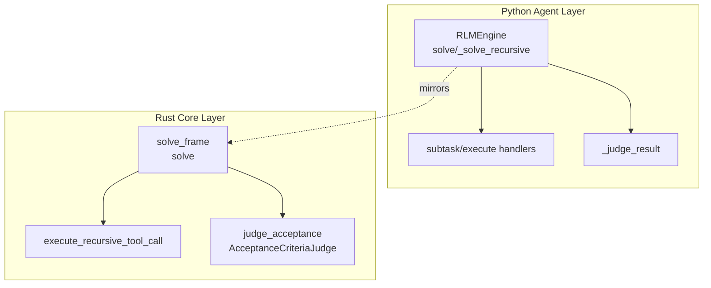
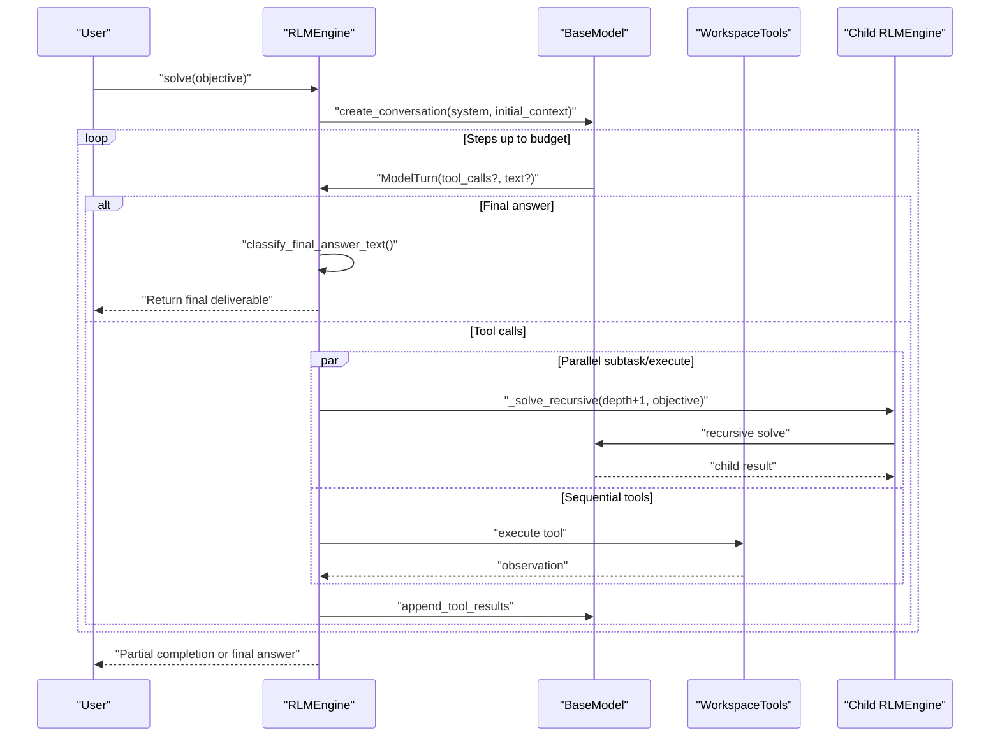
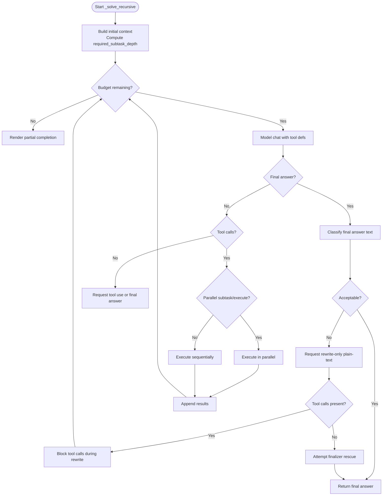
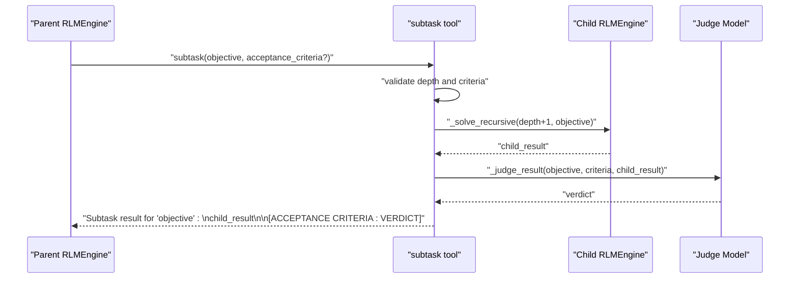
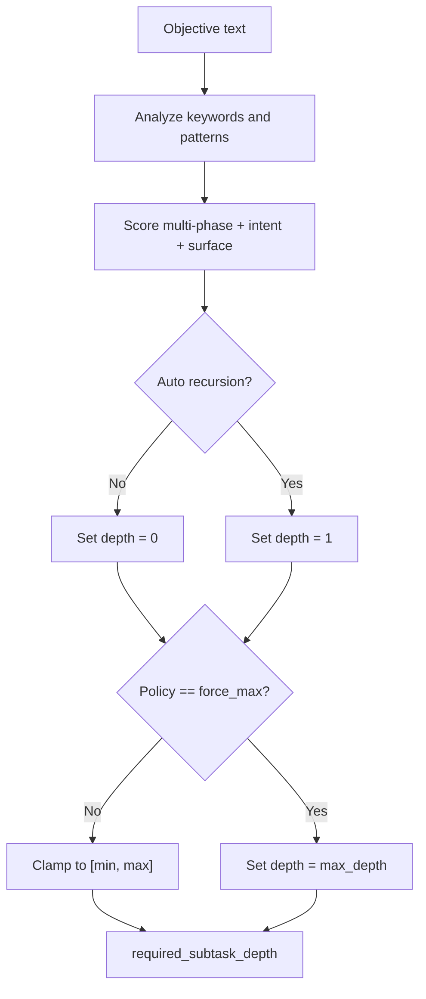
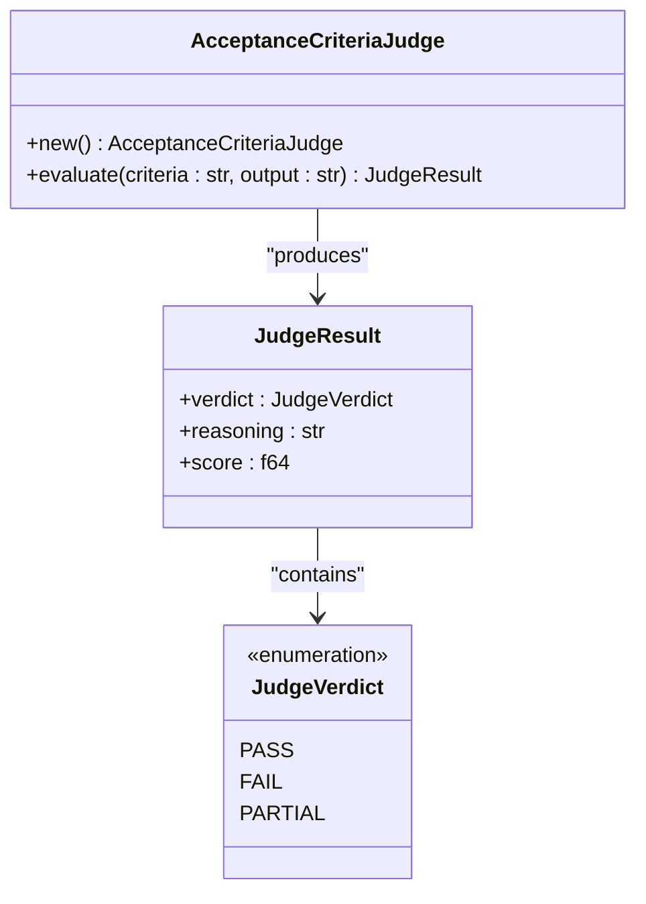
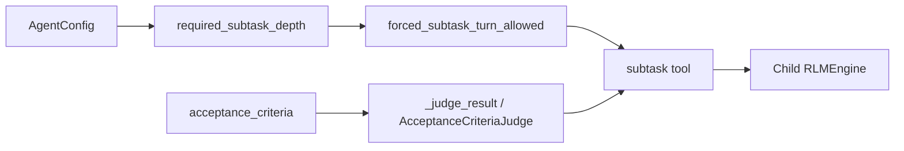
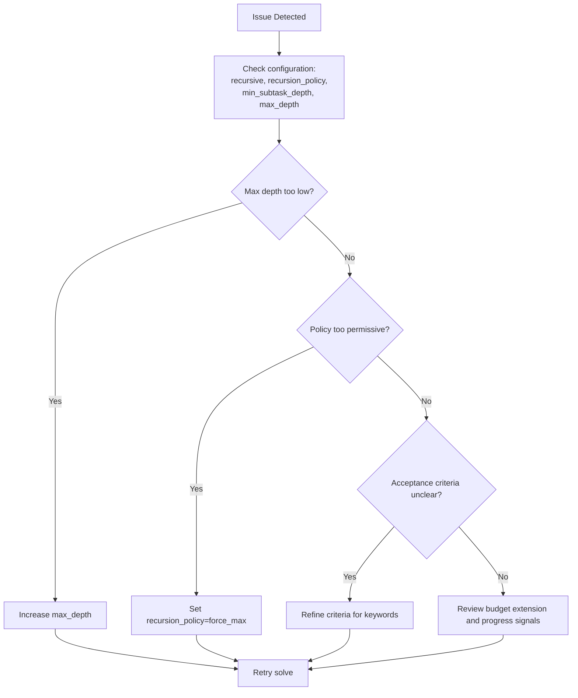

# Recursive Execution Patterns

<cite>
**Referenced Files in This Document**
- [engine.py](file://agent/engine.py)
- [mod.rs](file://openplanter-desktop/crates/op-core/src/engine/mod.rs)
- [judge.rs](file://openplanter-desktop/crates/op-core/src/engine/judge.rs)
- [recursion.ts](file://openplanter-desktop/frontend/src/commands/recursion.ts)
- [test_engine.py](file://tests/test_engine.py)
- [test_integration.py](file://tests/test_integration.py)
- [test_user_stories.py](file://tests/test_user_stories.py)
</cite>

## Table of Contents
1. [Introduction](#introduction)
2. [Project Structure](#project-structure)
3. [Core Components](#core-components)
4. [Architecture Overview](#architecture-overview)
5. [Detailed Component Analysis](#detailed-component-analysis)
6. [Dependency Analysis](#dependency-analysis)
7. [Performance Considerations](#performance-considerations)
8. [Troubleshooting Guide](#troubleshooting-guide)
9. [Conclusion](#conclusion)

## Introduction
This document explains the recursive execution patterns that power OpenPlanter's autonomous investigation and artifact creation workflows. It covers the core recursive language model architecture, subtask delegation mechanisms, depth management systems, objective parsing algorithms, automatic recursion detection, judge model integration for result evaluation, and practical strategies for convergence and quality assurance. It also provides troubleshooting guidance for common recursion issues and performance optimization techniques for deep recursion scenarios.

## Project Structure
OpenPlanter implements recursive execution in two complementary layers:
- Python-based agent engine that orchestrates model conversations, tool execution, and recursive delegation
- Rust-based core engine that mirrors the Python logic, adds robust concurrency, and integrates a lightweight judge model for acceptance criteria

**Diagram sources**
- [engine.py:904-1634](file://agent/engine.py#L904-L1634)
- [mod.rs:1656-2301](file://openplanter-desktop/crates/op-core/src/engine/mod.rs#L1656-L2301)
- [judge.rs:1-187](file://openplanter-desktop/crates/op-core/src/engine/judge.rs#L1-L187)

**Section sources**
- [engine.py:504-628](file://agent/engine.py#L504-L628)
- [mod.rs:2310-2370](file://openplanter-desktop/crates/op-core/src/engine/mod.rs#L2310-L2370)

## Core Components
- Recursive Language Model Engine (RLMEngine): Orchestrates multi-step conversations, enforces recursion policies, manages depth, and delegates to subtasks or leaf executions.
- Subtask Delegation: The subtask tool spawns a new recursive solve at depth+1, optionally overriding model selection and enforcing acceptance criteria.
- Depth Management: Required subtask depth is computed from configuration and objective characteristics; recursion is blocked at max_depth.
- Objective Parsing: Heuristics detect multi-phase, investigative, and multi-surface objectives to trigger automatic recursion.
- Judge Model Integration: Lightweight keyword-based evaluation of acceptance criteria; fallback to pass when judge unavailable.
- Convergence Criteria: Budget boundaries, guardrails, and finalization rules ensure termination with concrete deliverables.

**Section sources**
- [engine.py:504-628](file://agent/engine.py#L504-L628)
- [engine.py:1636-2154](file://agent/engine.py#L1636-L2154)
- [engine.py:660-704](file://agent/engine.py#L660-L704)
- [mod.rs:749-765](file://openplanter-desktop/crates/op-core/src/engine/mod.rs#L749-L765)
- [mod.rs:1485-1493](file://openplanter-desktop/crates/op-core/src/engine/mod.rs#L1485-L1493)

## Architecture Overview
The recursive architecture follows a depth-first exploration strategy controlled by configuration and objective analysis. The system alternates between investigation (reconnaissance), build (artifact creation), and iterate (refinement) phases, with strict recursion policies ensuring meaningful delegation before direct work or finalization.

**Diagram sources**
- [engine.py:904-1634](file://agent/engine.py#L904-L1634)
- [engine.py:1636-2154](file://agent/engine.py#L1636-L2154)

**Section sources**
- [engine.py:904-1634](file://agent/engine.py#L904-L1634)
- [mod.rs:1656-2301](file://openplanter-desktop/crates/op-core/src/engine/mod.rs#L1656-L2301)

## Detailed Component Analysis

### Recursive Language Model Engine (_solve_recursive)
The core recursive loop manages:
- Initial context construction with depth, required subtask depth, and session metadata
- Tool definition toggling between delegation-only and full-tool sets based on recursion policy
- Forced delegation enforcement: blocks non-subtask tool calls below required depth
- Parallel subtask execution and sequential tool execution
- Budget extension evaluation and guardrails
- Finalization classification and rescue workflows

Key behaviors:
- Depth-first exploration: subtask calls increase depth; max_depth prevents further recursion
- Convergence: final answer text is validated; meta/process text triggers rewrite attempts
- Quality: acceptance criteria enforced via judge model when configured

**Diagram sources**
- [engine.py:904-1634](file://agent/engine.py#L904-L1634)

**Section sources**
- [engine.py:904-1634](file://agent/engine.py#L904-L1634)

### Subtask Delegation Mechanisms
The subtask tool:
- Validates recursion enabled and depth limits
- Optionally overrides model selection respecting tier constraints
- Recursively solves with depth+1 and appends child result
- Enforces acceptance criteria when enabled, tagging PASS/FAIL

**Diagram sources**
- [engine.py:2005-2071](file://agent/engine.py#L2005-L2071)
- [engine.py:660-704](file://agent/engine.py#L660-L704)

**Section sources**
- [engine.py:2005-2071](file://agent/engine.py#L2005-L2071)
- [engine.py:660-704](file://agent/engine.py#L660-L704)

### Depth Management Systems
Required subtask depth is computed from:
- Configuration: min_subtask_depth, max_depth, recursion_policy
- Objective analysis: multi-phase, investigative/mutation intent, multi-surface indicators

Enforcement:
- Forced delegation blocks non-subtask tool calls below required depth
- Max depth stops further recursion
- Tests demonstrate min depth forcing and force-max policies

**Diagram sources**
- [engine.py:559-569](file://agent/engine.py#L559-L569)
- [engine.py:166-178](file://agent/engine.py#L166-L178)
- [mod.rs:749-765](file://openplanter-desktop/crates/op-core/src/engine/mod.rs#L749-L765)

**Section sources**
- [engine.py:559-569](file://agent/engine.py#L559-L569)
- [engine.py:166-178](file://agent/engine.py#L166-L178)
- [mod.rs:749-765](file://openplanter-desktop/crates/op-core/src/engine/mod.rs#L749-L765)
- [test_engine.py:132-180](file://tests/test_engine.py#L132-L180)

### Objective Parsing Algorithms
The system detects recursion-worthy objectives using:
- Multi-phase keywords (e.g., "and then", "after", "before", "finally", "compare", "cross-reference", "end-to-end")
- Combined investigative and mutation intents (e.g., "analyze", "investigate" + "write", "edit", "create")
- Multi-surface indicators (e.g., "across", "between", "multiple files", path-like tokens)

Automatic recursion triggers when score ≥ 2.

**Section sources**
- [engine.py:166-178](file://agent/engine.py#L166-L178)
- [mod.rs:670-747](file://openplanter-desktop/crates/op-core/src/engine/mod.rs#L670-L747)

### Automatic Recursion Detection
The system automatically increases required subtask depth for objectives meeting the parsing criteria, enabling depth-first exploration without manual configuration.

**Section sources**
- [engine.py:559-569](file://agent/engine.py#L559-L569)
- [mod.rs:749-765](file://openplanter-desktop/crates/op-core/src/engine/mod.rs#L749-L765)

### Judge Model Integration for Result Evaluation
Two judge implementations evaluate acceptance criteria:
- Python: lightweight keyword-based judge invoked via _judge_result
- Rust: AcceptanceCriteriaJudge with keyword extraction and scoring

Both enforce PASS/FAIL/PARTIAL verdicts and integrate into subtask/execute tool results.

**Diagram sources**
- [judge.rs:1-187](file://openplanter-desktop/crates/op-core/src/engine/judge.rs#L1-L187)

**Section sources**
- [engine.py:660-704](file://agent/engine.py#L660-L704)
- [mod.rs:1485-1493](file://openplanter-desktop/crates/op-core/src/engine/mod.rs#L1485-L1493)
- [judge.rs:1-187](file://openplanter-desktop/crates/op-core/src/engine/judge.rs#L1-L187)

### Convergence Criteria and Finalization
Finalization rules ensure concrete deliverables:
- Final answer classification rejects meta/process text
- Rewrite-only violations block tool calls during finalization attempts
- Finalizer rescue reconstructs deliverable from completed work
- Guardrails detect prolonged reconnaissance without artifacts

**Section sources**
- [engine.py:1146-1251](file://agent/engine.py#L1146-L1251)
- [engine.py:1264-1342](file://agent/engine.py#L1264-L1342)
- [engine.py:802-863](file://agent/engine.py#L802-L863)
- [mod.rs:582-633](file://openplanter-desktop/crates/op-core/src/engine/mod.rs#L582-L633)
- [mod.rs:1956-2056](file://openplanter-desktop/crates/op-core/src/engine/mod.rs#L1956-L2056)

### Practical Examples of Recursive Delegation Patterns
- Depth-first nesting: subtask → subtask → leaf execution with artifact creation
- Parallel subtasks: multiple subtask calls executed concurrently
- Mixed tool sequences: reconnaissance → artifact creation → verification across depths

**Section sources**
- [test_user_stories.py:756-778](file://tests/test_user_stories.py#L756-L778)
- [test_engine.py:156-180](file://tests/test_engine.py#L156-L180)

## Dependency Analysis
The recursive execution depends on:
- Configuration: recursive, recursion_policy, min_subtask_depth, max_depth, acceptance_criteria
- Objective parsing: keyword and pattern matching
- Tool definitions: toggled between delegation-only and full-tool sets
- Judge model: optional, lightweight keyword-based evaluation
- Runtime policies: shell command deduplication and depth limits

**Diagram sources**
- [engine.py:559-569](file://agent/engine.py#L559-L569)
- [engine.py:1344-1362](file://agent/engine.py#L1344-L1362)
- [engine.py:2005-2071](file://agent/engine.py#L2005-L2071)
- [judge.rs:1-187](file://openplanter-desktop/crates/op-core/src/engine/judge.rs#L1-L187)

**Section sources**
- [engine.py:559-569](file://agent/engine.py#L559-L569)
- [engine.py:1344-1362](file://agent/engine.py#L1344-L1362)
- [engine.py:2005-2071](file://agent/engine.py#L2005-L2071)
- [judge.rs:1-187](file://openplanter-desktop/crates/op-core/src/engine/judge.rs#L1-L187)

## Performance Considerations
- Parallel subtask execution: parallelize subtask/execute calls to reduce wall-clock time
- Budget-aware messaging: warnings and critical notices guide focus near budget exhaustion
- Context condensation: long conversations compact to maintain token budgets
- Judge caching: reuse judge model instances to minimize cold-start overhead
- Rate-limit backoff: exponential backoff with jitter for model rate limits

**Section sources**
- [engine.py:1394-1446](file://agent/engine.py#L1394-L1446)
- [engine.py:1462-1499](file://agent/engine.py#L1462-L1499)
- [engine.py:1116-1124](file://agent/engine.py#L1116-L1124)
- [engine.py:1040-1084](file://agent/engine.py#L1040-L1084)

## Troubleshooting Guide
Common recursion issues and resolutions:
- Infinite loops: ensure max_depth is set appropriately; verify forced delegation blocks non-subtask tool calls below required depth
- Shallow final answers: configure min_subtask_depth or use force-max policy to require deeper delegation
- Acceptance criteria failures: refine criteria to improve keyword coverage; leverage judge model feedback
- Depth limit reached: adjust max_depth or split objectives into smaller subtasks
- Budget exhaustion: enable budget extension and ensure progress signals (novel actions/state deltas) are present

**Section sources**
- [engine.py:1344-1362](file://agent/engine.py#L1344-L1362)
- [engine.py:1578-1615](file://agent/engine.py#L1578-L1615)
- [test_integration.py:623-642](file://tests/test_integration.py#L623-L642)

## Conclusion
OpenPlanter's recursive execution patterns combine configurable depth management, objective-driven recursion detection, and robust quality assurance through acceptance criteria evaluation. The dual-layer architecture ensures reliable depth-first exploration, efficient parallelization, and convergent finalization with concrete deliverables. Proper configuration and monitoring of convergence metrics enable scalable and trustworthy autonomous investigations.