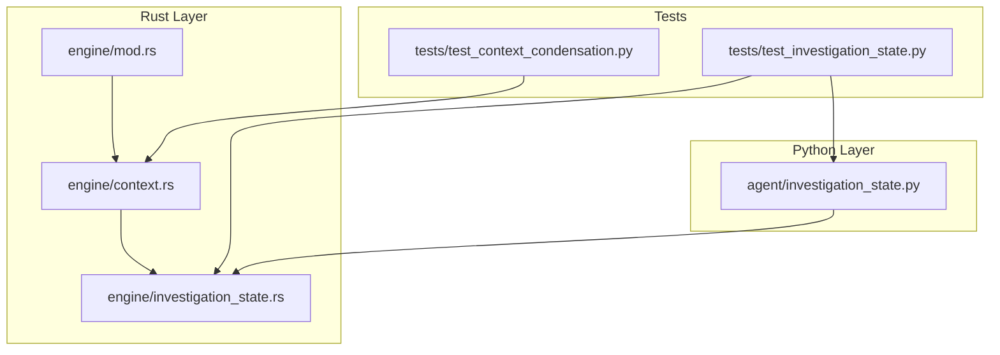
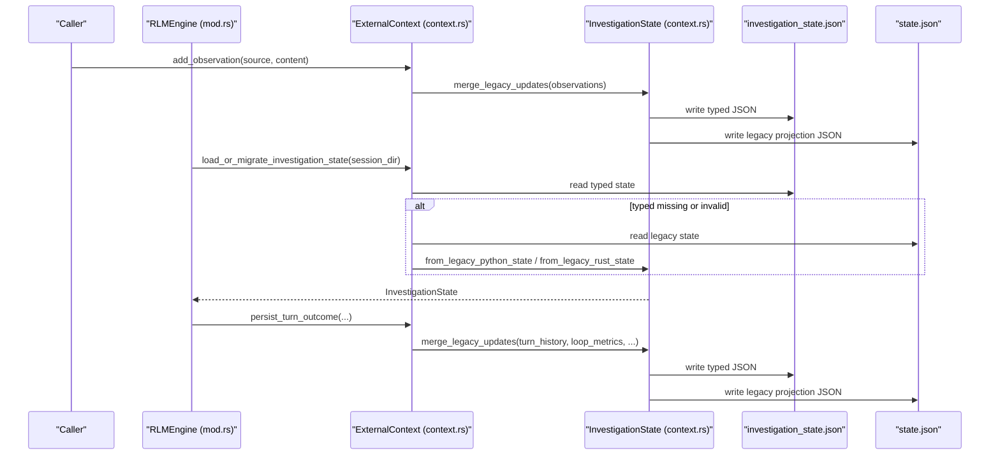
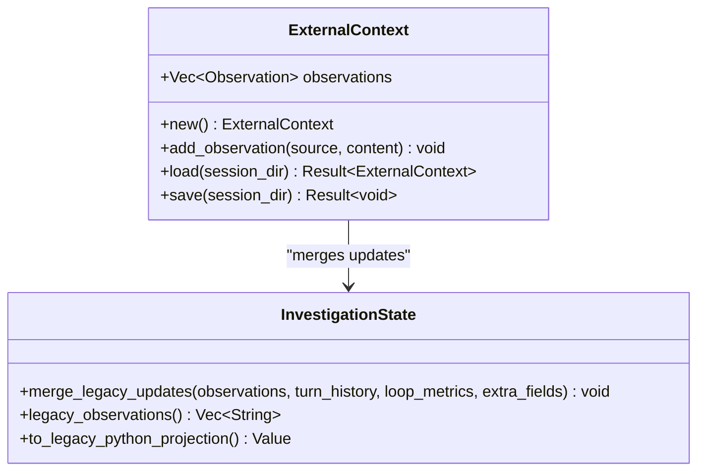
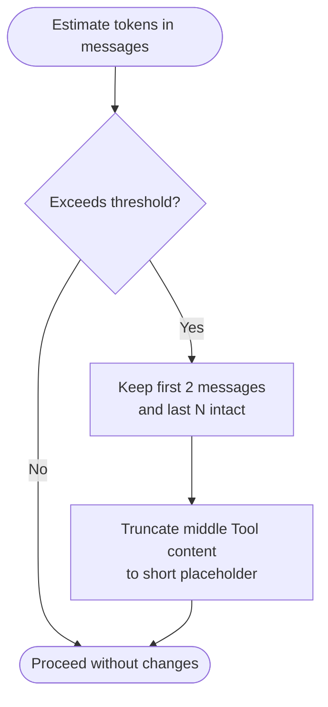
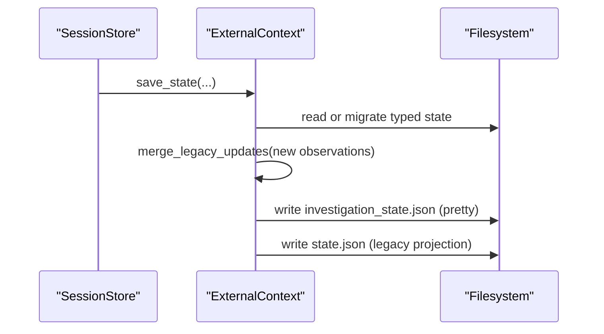
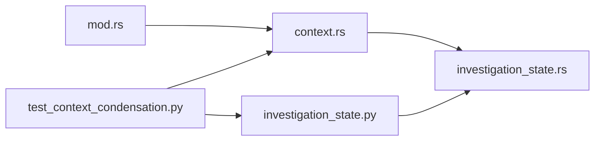

# State Management and Context

<cite>
**Referenced Files in This Document**
- [investigation_state.py](file://agent/investigation_state.py)
- [context.rs](file://openplanter-desktop/crates/op-core/src/engine/context.rs)
- [investigation_state.rs](file://openplanter-desktop/crates/op-core/src/engine/investigation_state.rs)
- [mod.rs](file://openplanter-desktop/crates/op-core/src/engine/mod.rs)
- [test_context_condensation.py](file://tests/test_context_condensation.py)
- [test_investigation_state.py](file://tests/test_investigation_state.py)
</cite>

## Table of Contents
1. [Introduction](#introduction)
2. [Project Structure](#project-structure)
3. [Core Components](#core-components)
4. [Architecture Overview](#architecture-overview)
5. [Detailed Component Analysis](#detailed-component-analysis)
6. [Dependency Analysis](#dependency-analysis)
7. [Performance Considerations](#performance-considerations)
8. [Troubleshooting Guide](#troubleshooting-guide)
9. [Conclusion](#conclusion)

## Introduction
This document explains the state management and context subsystems that power long-running investigations. It covers the ExternalContext system for managing external observations, context window condensation for controlling model input size, and state persistence mechanisms that maintain typed canonical state alongside legacy compatibility. It also documents context summarization, memory management strategies, and serialization/deserialization flows. Practical examples demonstrate context manipulation, state inspection, and optimization patterns for large investigations.

## Project Structure
The state and context system spans both Python and Rust layers:
- Python layer defines canonical state schema, migration helpers, and reasoning packet builders.
- Rust layer implements typed state, external context persistence, turn summaries, and context condensation for model conversations.
- Tests validate migration, persistence, and condensation behavior.

**Diagram sources**
- [investigation_state.py:1-1108](file://agent/investigation_state.py#L1-L1108)
- [context.rs:1-808](file://openplanter-desktop/crates/op-core/src/engine/context.rs#L1-L808)
- [investigation_state.rs:1-2252](file://openplanter-desktop/crates/op-core/src/engine/investigation_state.rs#L1-L2252)
- [mod.rs:1-800](file://openplanter-desktop/crates/op-core/src/engine/mod.rs#L1-L800)
- [test_context_condensation.py:1-196](file://tests/test_context_condensation.py#L1-L196)
- [test_investigation_state.py:1-372](file://tests/test_investigation_state.py#L1-L372)

**Section sources**
- [investigation_state.py:1-1108](file://agent/investigation_state.py#L1-L1108)
- [context.rs:1-808](file://openplanter-desktop/crates/op-core/src/engine/context.rs#L1-L808)
- [investigation_state.rs:1-2252](file://openplanter-desktop/crates/op-core/src/engine/investigation_state.rs#L1-L2252)
- [mod.rs:1-800](file://openplanter-desktop/crates/op-core/src/engine/mod.rs#L1-L800)
- [test_context_condensation.py:1-196](file://tests/test_context_condensation.py#L1-L196)
- [test_investigation_state.py:1-372](file://tests/test_investigation_state.py#L1-L372)

## Core Components
- Canonical InvestigationState schema and migration helpers in Python define the typed state structure and legacy compatibility.
- Typed InvestigationState in Rust mirrors the schema and provides robust merge/update logic for external observations and turn history.
- ExternalContext manages additive persistence of observations to both typed and legacy state files.
- Context condensation reduces conversation size by truncating older tool results while preserving recent context and metadata.
- Reasoning packet builders transform canonical state into planner-friendly structures for prioritized actions and evidence gaps.

Key responsibilities:
- State schema and normalization: canonical fields, indexes, and legacy projections.
- Persistence: typed JSON and legacy JSON coexistence with pruning of stale legacy entries.
- Memory control: limits on persisted observations, turn history, and deduplication of references.
- Context window control: compact messages to fit model token budgets.

**Section sources**
- [investigation_state.py:35-124](file://agent/investigation_state.py#L35-L124)
- [investigation_state.rs:23-132](file://openplanter-desktop/crates/op-core/src/engine/investigation_state.rs#L23-L132)
- [context.rs:36-118](file://openplanter-desktop/crates/op-core/src/engine/context.rs#L36-L118)
- [mod.rs:391-413](file://openplanter-desktop/crates/op-core/src/engine/mod.rs#L391-L413)

## Architecture Overview
The system integrates typed state and external context across Python and Rust layers. ExternalContext reads and writes both typed and legacy state, ensuring continuity for downstream consumers. The engine compacts conversation messages when token estimates exceed thresholds, and the state is periodically persisted with turn summaries and merged observations.

**Diagram sources**
- [context.rs:67-118](file://openplanter-desktop/crates/op-core/src/engine/context.rs#L67-L118)
- [context.rs:166-232](file://openplanter-desktop/crates/op-core/src/engine/context.rs#L166-L232)
- [context.rs:260-327](file://openplanter-desktop/crates/op-core/src/engine/context.rs#L260-L327)
- [investigation_state.rs:134-199](file://openplanter-desktop/crates/op-core/src/engine/investigation_state.rs#L134-L199)
- [mod.rs:391-413](file://openplanter-desktop/crates/op-core/src/engine/mod.rs#L391-L413)

## Detailed Component Analysis

### ExternalContext System
ExternalContext encapsulates additive observations persisted to both typed and legacy state files. It supports loading from either typed or legacy sources, with fallback and migration logic. Observations are merged with existing ones and truncated to a bounded count.

Key behaviors:
- Add observations with timestamps.
- Load from typed state if present; otherwise fall back to legacy Python or Rust shapes.
- Save merges observations into typed state and writes both typed and legacy JSON.
- Merging preserves non-legacy evidence and prunes legacy entries not present in the current batch.

**Diagram sources**
- [context.rs:36-118](file://openplanter-desktop/crates/op-core/src/engine/context.rs#L36-L118)
- [investigation_state.rs:226-295](file://openplanter-desktop/crates/op-core/src/engine/investigation_state.rs#L226-L295)
- [investigation_state.rs:297-331](file://openplanter-desktop/crates/op-core/src/engine/investigation_state.rs#L297-L331)

Practical examples:
- Adding observations and saving to disk ensures both typed and legacy files are updated.
- Loading prefers typed state; if absent or invalid, falls back to legacy shapes and migrates to typed.

**Section sources**
- [context.rs:50-118](file://openplanter-desktop/crates/op-core/src/engine/context.rs#L50-L118)
- [context.rs:269-327](file://openplanter-desktop/crates/op-core/src/engine/context.rs#L269-L327)
- [test_investigation_state.py:63-204](file://tests/test_investigation_state.py#L63-L204)

### Context Window Condensation
The engine maintains a compact conversation when token estimates exceed a threshold. Older tool results are truncated to a short placeholder while keeping system, user, and recent assistant/tool messages intact. Tests verify that condensation preserves recent turns and is idempotent.

**Diagram sources**
- [mod.rs:391-413](file://openplanter-desktop/crates/op-core/src/engine/mod.rs#L391-L413)
- [test_context_condensation.py:64-97](file://tests/test_context_condensation.py#L64-L97)

Guidance:
- Use keep_recent_turns to control how many recent turns remain uncondensed.
- Condensation is applied before model calls to avoid exceeding context limits.
- Idempotency: repeated condensation on the same conversation yields zero changes after the first pass.

**Section sources**
- [mod.rs:391-413](file://openplanter-desktop/crates/op-core/src/engine/mod.rs#L391-L413)
- [test_context_condensation.py:64-97](file://tests/test_context_condensation.py#L64-L97)
- [test_context_condensation.py:131-192](file://tests/test_context_condensation.py#L131-L192)

### State Persistence Mechanisms
Persistence is dual-mode: typed JSON and legacy JSON. The system:
- Writes typed JSON with canonical schema and indexes.
- Writes legacy projection JSON for backward compatibility.
- Merges new observations into existing typed state, preserving non-legacy evidence and pruning stale legacy entries.
- Maintains turn history and loop metrics in both formats.

**Diagram sources**
- [context.rs:90-118](file://openplanter-desktop/crates/op-core/src/engine/context.rs#L90-L118)
- [context.rs:166-232](file://openplanter-desktop/crates/op-core/src/engine/context.rs#L166-L232)

**Section sources**
- [context.rs:90-118](file://openplanter-desktop/crates/op-core/src/engine/context.rs#L90-L118)
- [context.rs:166-232](file://openplanter-desktop/crates/op-core/src/engine/context.rs#L166-L232)
- [test_investigation_state.py:63-204](file://tests/test_investigation_state.py#L63-L204)

### Context Summarization and Turn History
Turn summaries capture objective, result preview, steps used, and replay sequence markers. They are persisted alongside observations and loop metrics, with automatic truncation to a bounded length.

Highlights:
- TurnSummary fields include turn number, objective, result preview, timestamp, steps used, and replay sequence start.
- Result previews are truncated to a fixed width to reduce token usage.
- History truncation keeps only the most recent entries.

**Section sources**
- [context.rs:19-34](file://openplanter-desktop/crates/op-core/src/engine/context.rs#L19-L34)
- [context.rs:145-164](file://openplanter-desktop/crates/op-core/src/engine/context.rs#L145-L164)
- [context.rs:166-232](file://openplanter-desktop/crates/op-core/src/engine/context.rs#L166-L232)
- [context.rs:370-376](file://openplanter-desktop/crates/op-core/src/engine/context.rs#L370-L376)

### Memory Management Strategies
Memory and storage efficiency are achieved through:
- Bounded observation counts: maximum persisted observations are capped and rotated.
- Deduplication: evidence IDs, entity/link IDs, and object references are de-duplicated across actions and reasoning packets.
- Pruning legacy entries: stale legacy evidence is removed when new observations replace them.
- Limits on collected sources and evidence IDs to constrain planner action inputs.

**Section sources**
- [context.rs](file://openplanter-desktop/crates/op-core/src/engine/context.rs#L11)
- [context.rs:234-247](file://openplanter-desktop/crates/op-core/src/engine/context.rs#L234-L247)
- [investigation_state.py:678-689](file://agent/investigation_state.py#L678-L689)
- [investigation_state.rs:1367-1377](file://openplanter-desktop/crates/op-core/src/engine/investigation_state.rs#L1367-L1377)

### State Serialization and Deserialization
- Python layer: JSON load/save helpers and migration/projection functions.
- Rust layer: typed structs with serde derives and explicit merge/update routines.
- Migration: legacy Python and legacy Rust shapes are normalized into typed state.
- Projection: typed state is serialized to legacy-compatible JSON for downstream compatibility.

**Section sources**
- [investigation_state.py:224-233](file://agent/investigation_state.py#L224-L233)
- [investigation_state.py:86-124](file://agent/investigation_state.py#L86-L124)
- [investigation_state.rs:134-199](file://openplanter-desktop/crates/op-core/src/engine/investigation_state.rs#L134-L199)
- [investigation_state.rs:297-331](file://openplanter-desktop/crates/op-core/src/engine/investigation_state.rs#L297-L331)
- [test_investigation_state.py:16-61](file://tests/test_investigation_state.py#L16-L61)

### Managing Large Investigation Contexts
Patterns for long-running investigations:
- Persist regularly: use ExternalContext save/load to checkpoint progress and observations.
- Control context size: rely on built-in condensation and turn history truncation.
- Limit evidence scope: use max_evidence_per_item and deduplication to cap planner action inputs.
- Monitor token usage: estimate tokens and adjust keep_recent_turns accordingly.

**Section sources**
- [context.rs](file://openplanter-desktop/crates/op-core/src/engine/context.rs#L11)
- [context.rs:234-247](file://openplanter-desktop/crates/op-core/src/engine/context.rs#L234-L247)
- [mod.rs:391-413](file://openplanter-desktop/crates/op-core/src/engine/mod.rs#L391-L413)

### Implementing Custom Context Handlers
To extend context handling:
- Define new observation shapes in ExternalContext and ensure they are merged into typed state.
- Add custom fields to legacy projections if needed, leveraging extra_fields preservation.
- Implement custom pruning or summarization logic that respects MAX_PERSISTED_OBSERVATIONS and deduplication.

**Section sources**
- [context.rs:36-118](file://openplanter-desktop/crates/op-core/src/engine/context.rs#L36-L118)
- [investigation_state.rs:226-295](file://openplanter-desktop/crates/op-core/src/engine/investigation_state.rs#L226-L295)
- [test_investigation_state.py:128-204](file://tests/test_investigation_state.py#L128-L204)

## Dependency Analysis
ExternalContext depends on InvestigationState for merging and projecting state. The engine module orchestrates condensation and uses ExternalContext for persistence. Tests validate both layers’ interactions.

**Diagram sources**
- [context.rs:1-808](file://openplanter-desktop/crates/op-core/src/engine/context.rs#L1-L808)
- [investigation_state.rs:1-2252](file://openplanter-desktop/crates/op-core/src/engine/investigation_state.rs#L1-L2252)
- [mod.rs:1-800](file://openplanter-desktop/crates/op-core/src/engine/mod.rs#L1-L800)
- [investigation_state.py:1-1108](file://agent/investigation_state.py#L1-L1108)
- [test_context_condensation.py:1-196](file://tests/test_context_condensation.py#L1-L196)

**Section sources**
- [context.rs:1-808](file://openplanter-desktop/crates/op-core/src/engine/context.rs#L1-L808)
- [investigation_state.rs:1-2252](file://openplanter-desktop/crates/op-core/src/engine/investigation_state.rs#L1-L2252)
- [mod.rs:1-800](file://openplanter-desktop/crates/op-core/src/engine/mod.rs#L1-L800)
- [investigation_state.py:1-1108](file://agent/investigation_state.py#L1-L1108)
- [test_context_condensation.py:1-196](file://tests/test_context_condensation.py#L1-L196)

## Performance Considerations
- Token estimation: estimate tokens by character count divided by 4 to quickly detect oversized conversations.
- Keep recent messages: preserve system, user, and a small tail of assistant/tool messages to minimize rework.
- Truncate tool results: replace older tool outputs with short placeholders to reduce token usage.
- Deduplicate aggressively: evidence IDs, entity/link IDs, and object references prevent combinatorial blow-up.
- Bound persisted observations: enforce a maximum count and rotate old entries to cap storage growth.

[No sources needed since this section provides general guidance]

## Troubleshooting Guide
Common issues and resolutions:
- Invalid typed state: if typed JSON is malformed, the loader falls back to legacy shapes; if neither is valid, an error is raised. Ensure at least one valid legacy shape exists or fix the typed file.
- Missing legacy state: if neither typed nor legacy files exist, a new typed state is created with defaults.
- Legacy migration: legacy Python and Rust shapes are migrated into typed state; verify that external_observations and extra_fields are preserved.
- Condensation not triggered: ensure token estimation exceeds the threshold and that keep_recent_turns is set appropriately.
- Turn history overflow: confirm that truncation is applied and result previews are shortened.

**Section sources**
- [context.rs:269-327](file://openplanter-desktop/crates/op-core/src/engine/context.rs#L269-L327)
- [context.rs:370-376](file://openplanter-desktop/crates/op-core/src/engine/context.rs#L370-L376)
- [test_context_condensation.py:131-192](file://tests/test_context_condensation.py#L131-L192)
- [test_investigation_state.py:567-590](file://tests/test_investigation_state.py#L567-L590)

## Conclusion
The state and context system provides robust, dual-mode persistence with strong backward compatibility, efficient memory management, and built-in context window control. By leveraging ExternalContext, typed state, and condensation, long-running investigations remain responsive and durable. Adhering to the patterns and safeguards outlined here ensures scalable, maintainable state handling across diverse use cases.