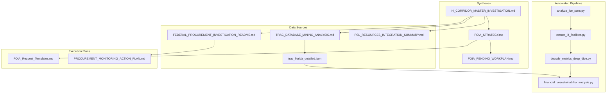
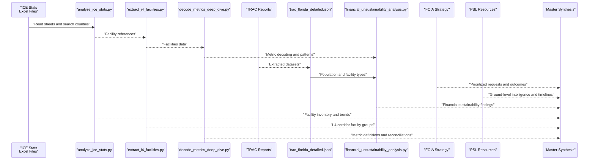
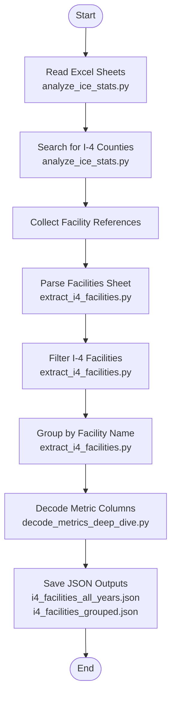
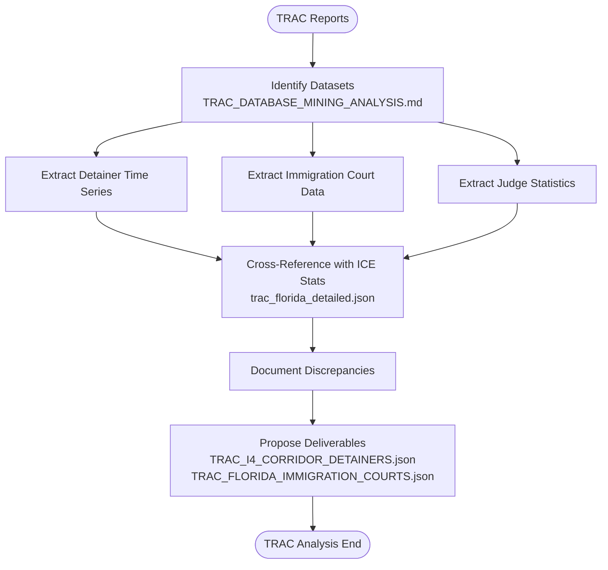
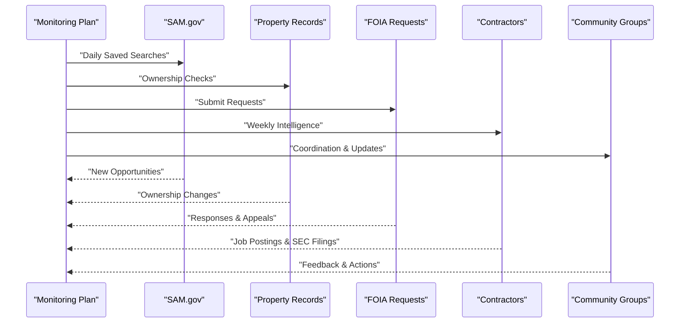
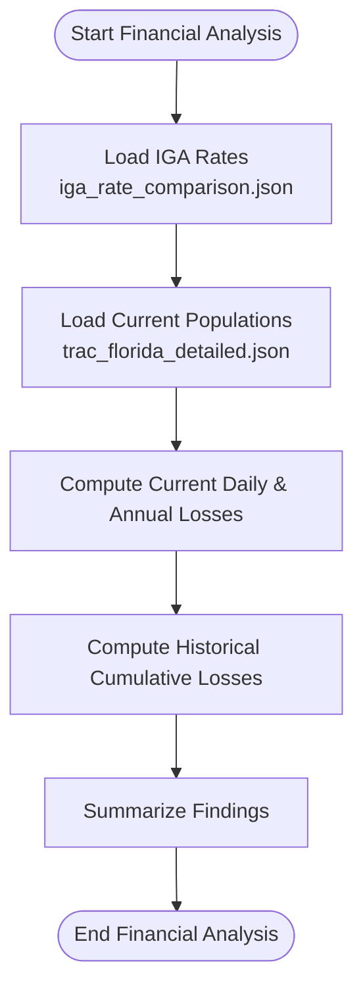
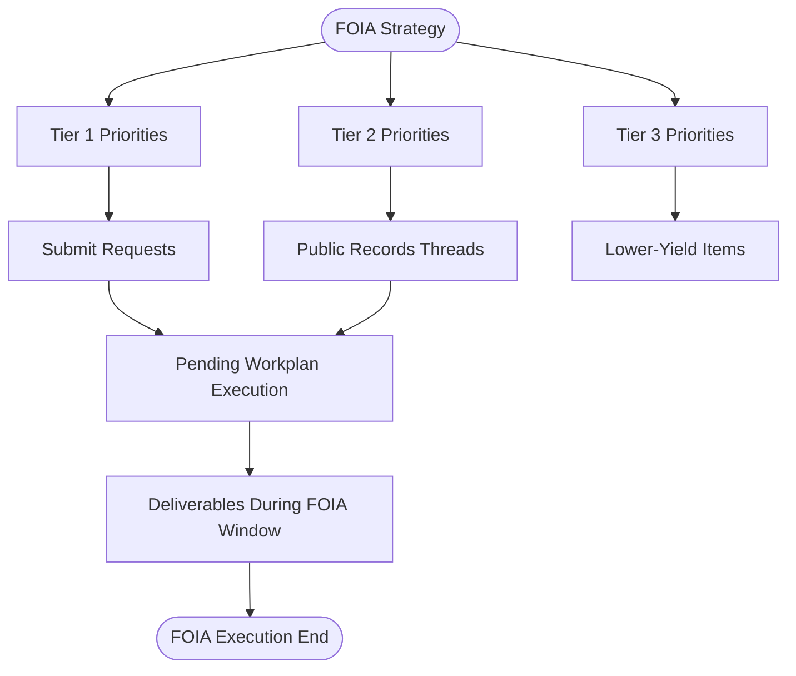
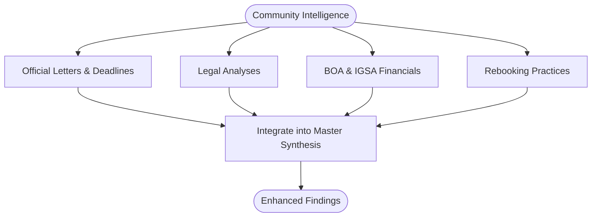
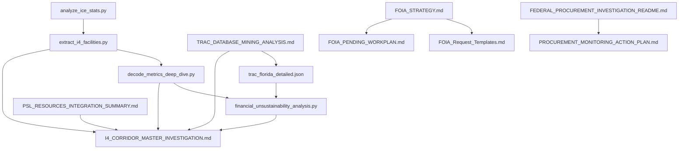

# Central Florida ICE Workspace

<cite>
**Referenced Files in This Document**
- [I4_CORRIDOR_MASTER_INVESTIGATION.md](file://central-fl-ice-workspace/I4_CORRIDOR_MASTER_INVESTIGATION.md)
- [FOIA_STRATEGY.md](file://central-fl-ice-workspace/FOIA_STRATEGY.md)
- [TRAC_DATABASE_MINING_ANALYSIS.md](file://central-fl-ice-workspace/TRAC_DATABASE_MINING_ANALYSIS.md)
- [FEDERAL_PROCUREMENT_INVESTIGATION_README.md](file://central-fl-ice-workspace/FEDERAL_PROCUREMENT_INVESTIGATION_README.md)
- [ANALYSIS_SUMMARY_2026-02-27.md](file://central-fl-ice-workspace/ANALYSIS_SUMMARY_2026-02-27.md)
- [analyze_ice_stats.py](file://central-fl-ice-workspace/analyze_ice_stats.py)
- [extract_i4_facilities.py](file://central-fl-ice-workspace/extract_i4_facilities.py)
- [decode_metrics_deep_dive.py](file://central-fl-ice-workspace/decode_metrics_deep_dive.py)
- [financial_unsustainability_analysis.py](file://central-fl-ice-workspace/financial_unsustainability_analysis.py)
- [trac_florida_detailed.json](file://central-fl-ice-workspace/trac_florida_detailed.json)
- [FOIA_PENDING_WORKPLAN.md](file://central-fl-ice-workspace/FOIA_PENDING_WORKPLAN.md)
- [PROCUREMENT_MONITORING_ACTION_PLAN.md](file://central-fl-ice-workspace/PROCUREMENT_MONITORING_ACTION_PLAN.md)
- [FOIA_Request_Templates.md](file://central-fl-ice-workspace/FOIA_Request_Templates.md)
- [THREADS_TO_PULL_WHILE_FOIA_PENDING_2026-02-27.md](file://central-fl-ice-workspace/THREADS_TO_PULL_WHILE_FOIA_PENDING_2026-02-27.md)
- [PSL_RESOURCES_INTEGRATION_SUMMARY.md](file://central-fl-ice-workspace/PSL_RESOURCES_INTEGRATION_SUMMARY.md)
</cite>

## Table of Contents
1. [Introduction](#introduction)
2. [Project Structure](#project-structure)
3. [Core Components](#core-components)
4. [Architecture Overview](#architecture-overview)
5. [Detailed Component Analysis](#detailed-component-analysis)
6. [Dependency Analysis](#dependency-analysis)
7. [Performance Considerations](#performance-considerations)
8. [Troubleshooting Guide](#troubleshooting-guide)
9. [Conclusion](#conclusion)
10. [Appendices](#appendices)

## Introduction
This document presents a comprehensive, systematic investigation of ICE detention facilities and operations along Florida’s I-4 corridor. The Central Florida ICE workspace integrates multiple data sources—ICE detention statistics, TRAC Immigration datasets, federal procurement systems, FOIA strategy, and community intelligence—to produce robust findings on facility operations, financial sustainability, and legal frameworks. The methodology emphasizes facility data extraction, trend analysis, financial sustainability assessment, and cross-referencing across datasets. It also provides practical guidance for replicating this approach in similar investigations, including data cleaning, automation, and automated analysis workflows.

## Project Structure
The workspace organizes investigation outputs into canonical syntheses, deep-dive analyses, FOIA strategy documents, and executable Python scripts. Key folders and files include:
- Canonical synthesis: I4_CORRIDOR_MASTER_INVESTIGATION.md
- FOIA strategy and pending workplan: FOIA_STRATEGY.md, FOIA_PENDING_WORKPLAN.md
- TRAC mining and integration: TRAC_DATABASE_MINING_ANALYSIS.md, trac_florida_detailed.json
- Federal procurement investigation: FEDERAL_PROCUREMENT_INVESTIGATION_README.md
- Financial sustainability analysis: financial_unsustainability_analysis.py
- Automated analysis scripts: analyze_ice_stats.py, extract_i4_facilities.py, decode_metrics_deep_dive.py
- Community intelligence integration: PSL_RESOURCES_INTEGRATION_SUMMARY.md
- FOIA templates and monitoring plan: FOIA_Request_Templates.md, PROCUREMENT_MONITORING_ACTION_PLAN.md

**Diagram sources**
- [I4_CORRIDOR_MASTER_INVESTIGATION.md:1-162](file://central-fl-ice-workspace/I4_CORRIDOR_MASTER_INVESTIGATION.md#L1-L162)
- [FOIA_STRATEGY.md:1-64](file://central-fl-ice-workspace/FOIA_STRATEGY.md#L1-L64)
- [TRAC_DATABASE_MINING_ANALYSIS.md:1-395](file://central-fl-ice-workspace/TRAC_DATABASE_MINING_ANALYSIS.md#L1-L395)
- [trac_florida_detailed.json:1-182](file://central-fl-ice-workspace/trac_florida_detailed.json#L1-L182)
- [FEDERAL_PROCUREMENT_INVESTIGATION_README.md:1-272](file://central-fl-ice-workspace/FEDERAL_PROCUREMENT_INVESTIGATION_README.md#L1-L272)
- [PSL_RESOURCES_INTEGRATION_SUMMARY.md:1-394](file://central-fl-ice-workspace/PSL_RESOURCES_INTEGRATION_SUMMARY.md#L1-L394)
- [analyze_ice_stats.py:1-93](file://central-fl-ice-workspace/analyze_ice_stats.py#L1-L93)
- [extract_i4_facilities.py:1-236](file://central-fl-ice-workspace/extract_i4_facilities.py#L1-L236)
- [decode_metrics_deep_dive.py:1-103](file://central-fl-ice-workspace/decode_metrics_deep_dive.py#L1-L103)
- [financial_unsustainability_analysis.py:1-166](file://central-fl-ice-workspace/financial_unsustainability_analysis.py#L1-L166)
- [FOIA_Request_Templates.md:1-309](file://central-fl-ice-workspace/FOIA_Request_Templates.md#L1-L309)
- [PROCUREMENT_MONITORING_ACTION_PLAN.md:1-420](file://central-fl-ice-workspace/PROCUREMENT_MONITORING_ACTION_PLAN.md#L1-L420)

**Section sources**
- [I4_CORRIDOR_MASTER_INVESTIGATION.md:1-162](file://central-fl-ice-workspace/I4_CORRIDOR_MASTER_INVESTIGATION.md#L1-L162)
- [FOIA_STRATEGY.md:1-64](file://central-fl-ice-workspace/FOIA_STRATEGY.md#L1-L64)
- [TRAC_DATABASE_MINING_ANALYSIS.md:1-395](file://central-fl-ice-workspace/TRAC_DATABASE_MINING_ANALYSIS.md#L1-L395)
- [FEDERAL_PROCUREMENT_INVESTIGATION_README.md:1-272](file://central-fl-ice-workspace/FEDERAL_PROCUREMENT_INVESTIGATION_README.md#L1-L272)
- [PSL_RESOURCES_INTEGRATION_SUMMARY.md:1-394](file://central-fl-ice-workspace/PSL_RESOURCES_INTEGRATION_SUMMARY.md#L1-L394)

## Core Components
- Canonical synthesis: Consolidates corridor-wide findings, legal framework, priority pressure points, and contradiction register.
- FOIA strategy: Defines tiered priorities, execution phases, and expected outcomes for closing evidence gaps.
- TRAC mining: Identifies additional datasets and extraction opportunities relevant to detainers, arrests, immigration court data, and judge performance.
- Federal procurement investigation: Documents pre-award status of the planned Orlando ICE Processing Center and outlines monitoring and FOIA actions.
- Financial sustainability analysis: Quantifies current and historical losses, highlighting fiscal pressures and structural underfunding.
- Automated analysis scripts: Provide reproducible pipelines for extracting I-4 corridor facilities from Excel, decoding ICE metrics, and analyzing trends.
- Community intelligence integration: Adds grassroots insights on 287(g), IGSA/BOA dynamics, and rebooking practices.

**Section sources**
- [I4_CORRIDOR_MASTER_INVESTIGATION.md:10-162](file://central-fl-ice-workspace/I4_CORRIDOR_MASTER_INVESTIGATION.md#L10-L162)
- [FOIA_STRATEGY.md:10-64](file://central-fl-ice-workspace/FOIA_STRATEGY.md#L10-L64)
- [TRAC_DATABASE_MINING_ANALYSIS.md:9-395](file://central-fl-ice-workspace/TRAC_DATABASE_MINING_ANALYSIS.md#L9-L395)
- [FEDERAL_PROCUREMENT_INVESTIGATION_README.md:7-272](file://central-fl-ice-workspace/FEDERAL_PROCUREMENT_INVESTIGATION_README.md#L7-L272)
- [financial_unsustainability_analysis.py:1-166](file://central-fl-ice-workspace/financial_unsustainability_analysis.py#L1-L166)
- [analyze_ice_stats.py:1-93](file://central-fl-ice-workspace/analyze_ice_stats.py#L1-L93)
- [extract_i4_facilities.py:1-236](file://central-fl-ice-workspace/extract_i4_facilities.py#L1-L236)
- [decode_metrics_deep_dive.py:1-103](file://central-fl-ice-workspace/decode_metrics_deep_dive.py#L1-L103)
- [PSL_RESOURCES_INTEGRATION_SUMMARY.md:7-394](file://central-fl-ice-workspace/PSL_RESOURCES_INTEGRATION_SUMMARY.md#L7-L394)

## Architecture Overview
The investigation architecture combines canonical syntheses, FOIA-driven discovery, TRAC data mining, automated analytics, and community intelligence. The flow below maps how raw data and external records are ingested, processed, and transformed into structured findings.

**Diagram sources**
- [analyze_ice_stats.py:16-93](file://central-fl-ice-workspace/analyze_ice_stats.py#L16-L93)
- [extract_i4_facilities.py:14-236](file://central-fl-ice-workspace/extract_i4_facilities.py#L14-L236)
- [decode_metrics_deep_dive.py:11-103](file://central-fl-ice-workspace/decode_metrics_deep_dive.py#L11-L103)
- [trac_florida_detailed.json:1-182](file://central-fl-ice-workspace/trac_florida_detailed.json#L1-L182)
- [financial_unsustainability_analysis.py:9-166](file://central-fl-ice-workspace/financial_unsustainability_analysis.py#L9-L166)
- [FOIA_STRATEGY.md:13-64](file://central-fl-ice-workspace/FOIA_STRATEGY.md#L13-L64)
- [PSL_RESOURCES_INTEGRATION_SUMMARY.md:154-394](file://central-fl-ice-workspace/PSL_RESOURCES_INTEGRATION_SUMMARY.md#L154-L394)
- [I4_CORRIDOR_MASTER_INVESTIGATION.md:10-162](file://central-fl-ice-workspace/I4_CORRIDOR_MASTER_INVESTIGATION.md#L10-L162)

## Detailed Component Analysis

### Detention Statistics Analysis Pipeline
This pipeline extracts and catalogs I-4 corridor facilities from ICE Excel files, decodes metric columns, and produces structured outputs for further analysis.

**Diagram sources**
- [analyze_ice_stats.py:16-93](file://central-fl-ice-workspace/analyze_ice_stats.py#L16-L93)
- [extract_i4_facilities.py:14-236](file://central-fl-ice-workspace/extract_i4_facilities.py#L14-L236)
- [decode_metrics_deep_dive.py:11-103](file://central-fl-ice-workspace/decode_metrics_deep_dive.py#L11-L103)

**Section sources**
- [analyze_ice_stats.py:16-93](file://central-fl-ice-workspace/analyze_ice_stats.py#L16-L93)
- [extract_i4_facilities.py:101-236](file://central-fl-ice-workspace/extract_i4_facilities.py#L101-L236)
- [decode_metrics_deep_dive.py:54-103](file://central-fl-ice-workspace/decode_metrics_deep_dive.py#L54-L103)

### TRAC Database Mining and Cross-Reference
TRAC provides extensive datasets on detainers, arrests, immigration court backlogs, and judge performance. The analysis identifies high-value datasets and proposes extraction priorities aligned with corridor operations and outcomes.

**Diagram sources**
- [TRAC_DATABASE_MINING_ANALYSIS.md:212-395](file://central-fl-ice-workspace/TRAC_DATABASE_MINING_ANALYSIS.md#L212-L395)
- [trac_florida_detailed.json:1-182](file://central-fl-ice-workspace/trac_florida_detailed.json#L1-L182)

**Section sources**
- [TRAC_DATABASE_MINING_ANALYSIS.md:9-395](file://central-fl-ice-workspace/TRAC_DATABASE_MINING_ANALYSIS.md#L9-L395)
- [trac_florida_detailed.json:15-182](file://central-fl-ice-workspace/trac_florida_detailed.json#L15-L182)

### Federal Procurement Monitoring Workflow
The Orlando ICE Processing Center is in an exploratory phase. The monitoring plan tracks solicitations, property ownership, contractor activity, and FOIA responses, with escalation triggers and success metrics.

**Diagram sources**
- [PROCUREMENT_MONITORING_ACTION_PLAN.md:18-420](file://central-fl-ice-workspace/PROCUREMENT_MONITORING_ACTION_PLAN.md#L18-L420)
- [FEDERAL_PROCUREMENT_INVESTIGATION_README.md:37-272](file://central-fl-ice-workspace/FEDERAL_PROCUREMENT_INVESTIGATION_README.md#L37-L272)
- [FOIA_Request_Templates.md:33-309](file://central-fl-ice-workspace/FOIA_Request_Templates.md#L33-L309)

**Section sources**
- [PROCUREMENT_MONITORING_ACTION_PLAN.md:1-420](file://central-fl-ice-workspace/PROCUREMENT_MONITORING_ACTION_PLAN.md#L1-L420)
- [FEDERAL_PROCUREMENT_INVESTIGATION_README.md:1-272](file://central-fl-ice-workspace/FEDERAL_PROCUREMENT_INVESTIGATION_README.md#L1-L272)
- [FOIA_Request_Templates.md:1-309](file://central-fl-ice-workspace/FOIA_Request_Templates.md#L1-L309)

### Financial Sustainability Assessment
The script computes current and historical losses by comparing per-diem rates to estimated actual costs, highlighting fiscal crises and structural underfunding.

**Diagram sources**
- [financial_unsustainability_analysis.py:9-166](file://central-fl-ice-workspace/financial_unsustainability_analysis.py#L9-L166)
- [trac_florida_detailed.json:13-21](file://central-fl-ice-workspace/trac_florida_detailed.json#L13-L21)

**Section sources**
- [financial_unsustainability_analysis.py:1-166](file://central-fl-ice-workspace/financial_unsustainability_analysis.py#L1-L166)

### FOIA Strategy and Pending Workplan
The FOIA strategy defines priorities across tiers and agencies, while the pending workplan advances the investigation during response latency by focusing on public-data threads, internal reconciliation, and readiness infrastructure.

**Diagram sources**
- [FOIA_STRATEGY.md:16-64](file://central-fl-ice-workspace/FOIA_STRATEGY.md#L16-L64)
- [FOIA_PENDING_WORKPLAN.md:13-63](file://central-fl-ice-workspace/FOIA_PENDING_WORKPLAN.md#L13-L63)

**Section sources**
- [FOIA_STRATEGY.md:10-64](file://central-fl-ice-workspace/FOIA_STRATEGY.md#L10-L64)
- [FOIA_PENDING_WORKPLAN.md:10-63](file://central-fl-ice-workspace/FOIA_PENDING_WORKPLAN.md#L10-L63)
- [THREADS_TO_PULL_WHILE_FOIA_PENDING_2026-02-27.md:1-15](file://central-fl-ice-workspace/THREADS_TO_PULL_WHILE_FOIA_PENDING_2026-02-27.md#L1-L15)

### Community Intelligence Integration
Community organizers provide critical context on 287(g) implementation, IGSA/BOA financial dynamics, and rebooking practices, enriching the canonical synthesis with ground-level insights.

**Diagram sources**
- [PSL_RESOURCES_INTEGRATION_SUMMARY.md:15-394](file://central-fl-ice-workspace/PSL_RESOURCES_INTEGRATION_SUMMARY.md#L15-L394)
- [I4_CORRIDOR_MASTER_INVESTIGATION.md:79-162](file://central-fl-ice-workspace/I4_CORRIDOR_MASTER_INVESTIGATION.md#L79-L162)

**Section sources**
- [PSL_RESOURCES_INTEGRATION_SUMMARY.md:1-394](file://central-fl-ice-workspace/PSL_RESOURCES_INTEGRATION_SUMMARY.md#L1-L394)
- [I4_CORRIDOR_MASTER_INVESTIGATION.md:79-162](file://central-fl-ice-workspace/I4_CORRIDOR_MASTER_INVESTIGATION.md#L79-L162)

## Dependency Analysis
The investigation exhibits strong cohesion among scripts and documents, with clear data dependencies:
- analyze_ice_stats.py depends on ICE-Detention-Stats Excel files and produces facility references for downstream processing.
- extract_i4_facilities.py parses XML within Excel archives and filters I-4 corridor facilities, generating grouped outputs.
- decode_metrics_deep_dive.py correlates metric values across facilities to infer definitions.
- financial_unsustainability_analysis.py consumes IGA rate comparisons and TRAC population data to compute losses.
- TRAC data feeds financial analysis and cross-reference documents.
- FOIA strategy and templates drive monitoring and procurement workflows.

**Diagram sources**
- [analyze_ice_stats.py:16-93](file://central-fl-ice-workspace/analyze_ice_stats.py#L16-L93)
- [extract_i4_facilities.py:101-236](file://central-fl-ice-workspace/extract_i4_facilities.py#L101-L236)
- [decode_metrics_deep_dive.py:54-103](file://central-fl-ice-workspace/decode_metrics_deep_dive.py#L54-L103)
- [financial_unsustainability_analysis.py:9-166](file://central-fl-ice-workspace/financial_unsustainability_analysis.py#L9-L166)
- [trac_florida_detailed.json:1-182](file://central-fl-ice-workspace/trac_florida_detailed.json#L1-L182)
- [TRAC_DATABASE_MINING_ANALYSIS.md:1-395](file://central-fl-ice-workspace/TRAC_DATABASE_MINING_ANALYSIS.md#L1-L395)
- [FOIA_STRATEGY.md:13-64](file://central-fl-ice-workspace/FOIA_STRATEGY.md#L13-L64)
- [FOIA_Request_Templates.md:1-309](file://central-fl-ice-workspace/FOIA_Request_Templates.md#L1-L309)
- [FOIA_PENDING_WORKPLAN.md:13-63](file://central-fl-ice-workspace/FOIA_PENDING_WORKPLAN.md#L13-L63)
- [FEDERAL_PROCUREMENT_INVESTIGATION_README.md:1-272](file://central-fl-ice-workspace/FEDERAL_PROCUREMENT_INVESTIGATION_README.md#L1-L272)
- [PROCUREMENT_MONITORING_ACTION_PLAN.md:1-420](file://central-fl-ice-workspace/PROCUREMENT_MONITORING_ACTION_PLAN.md#L1-L420)
- [PSL_RESOURCES_INTEGRATION_SUMMARY.md:1-394](file://central-fl-ice-workspace/PSL_RESOURCES_INTEGRATION_SUMMARY.md#L1-L394)
- [I4_CORRIDOR_MASTER_INVESTIGATION.md:1-162](file://central-fl-ice-workspace/I4_CORRIDOR_MASTER_INVESTIGATION.md#L1-L162)

**Section sources**
- [I4_CORRIDOR_MASTER_INVESTIGATION.md:1-162](file://central-fl-ice-workspace/I4_CORRIDOR_MASTER_INVESTIGATION.md#L1-L162)
- [FOIA_STRATEGY.md:13-64](file://central-fl-ice-workspace/FOIA_STRATEGY.md#L13-L64)
- [TRAC_DATABASE_MINING_ANALYSIS.md:212-395](file://central-fl-ice-workspace/TRAC_DATABASE_MINING_ANALYSIS.md#L212-L395)
- [FEDERAL_PROCUREMENT_INVESTIGATION_README.md:37-272](file://central-fl-ice-workspace/FEDERAL_PROCUREMENT_INVESTIGATION_README.md#L37-L272)
- [financial_unsustainability_analysis.py:9-166](file://central-fl-ice-workspace/financial_unsustainability_analysis.py#L9-L166)
- [extract_i4_facilities.py:101-236](file://central-fl-ice-workspace/extract_i4_facilities.py#L101-L236)
- [decode_metrics_deep_dive.py:54-103](file://central-fl-ice-workspace/decode_metrics_deep_dive.py#L54-L103)
- [PSL_RESOURCES_INTEGRATION_SUMMARY.md:154-394](file://central-fl-ice-workspace/PSL_RESOURCES_INTEGRATION_SUMMARY.md#L154-L394)

## Performance Considerations
- Data volume: Excel parsing and XML extraction can be memory-intensive; process files incrementally and save intermediate JSON artifacts.
- Cross-source reconciliation: Align temporal and categorical labels (e.g., fiscal years, facility names) to minimize mismatches.
- Automation: Use saved searches and scheduled checks for SAM.gov and property records to reduce manual effort.
- FOIA throughput: Submit multiple requests concurrently to multiple agencies to maximize information inflow and leverage cross-agency redundancy.

[No sources needed since this section provides general guidance]

## Troubleshooting Guide
Common issues and remedies:
- Excel parsing errors: Validate file paths and sheet names; ensure required dependencies are installed.
- Missing facility matches: Expand county name variations and city-to-county mappings; confirm case-insensitive matching.
- Metric decoding ambiguity: Cross-reference multiple fiscal year files and official footnotes to establish consistent definitions.
- FOIA delays: Maintain a centralized intake log with request IDs, agencies, statuses, and extraction completion states; follow up aggressively.
- Procurement monitoring gaps: Set up alerts and saved searches; maintain escalation triggers for ownership transfers and solicitations.

**Section sources**
- [extract_i4_facilities.py:138-177](file://central-fl-ice-workspace/extract_i4_facilities.py#L138-L177)
- [decode_metrics_deep_dive.py:96-103](file://central-fl-ice-workspace/decode_metrics_deep_dive.py#L96-L103)
- [FOIA_PENDING_WORKPLAN.md:55-63](file://central-fl-ice-workspace/FOIA_PENDING_WORKPLAN.md#L55-L63)
- [PROCUREMENT_MONITORING_ACTION_PLAN.md:285-316](file://central-fl-ice-workspace/PROCUREMENT_MONITORING_ACTION_PLAN.md#L285-L316)

## Conclusion
The Central Florida ICE workspace demonstrates a rigorous, multi-source methodology integrating ICE statistics, TRAC datasets, federal procurement records, FOIA strategy, and community intelligence. The automated pipelines enable scalable extraction and decoding of facility and metric data, while financial sustainability analysis quantifies fiscal risks. The canonical synthesis and working plans ensure continuity during FOIA response latency and provide clear next steps for monitoring and advocacy.

[No sources needed since this section summarizes without analyzing specific files]

## Appendices

### Practical Setup Guide for Similar Investigations
- Data ingestion: Automate Excel parsing and XML extraction for facility inventories; validate sheet names and column indices.
- Data cleaning: Normalize facility names, county spellings, and fiscal year labels; reconcile discrepancies across sources.
- Trend analysis: Align time-series data by fiscal year and facility identifiers; track population and detainer trends.
- Financial sustainability: Establish per-diem rate baselines and estimated actual costs; compute daily and annual losses.
- Cross-referencing: Map facility classifications across sources (e.g., TRAC vs. ICE Stats) and document contradictions.
- FOIA execution: Use ready-to-submit templates; track acknowledgments and responses; escalate denials.
- Monitoring workflows: Implement daily/weekly/monthly checklists for procurement indicators and community updates.

**Section sources**
- [analyze_ice_stats.py:16-93](file://central-fl-ice-workspace/analyze_ice_stats.py#L16-L93)
- [extract_i4_facilities.py:101-236](file://central-fl-ice-workspace/extract_i4_facilities.py#L101-L236)
- [decode_metrics_deep_dive.py:54-103](file://central-fl-ice-workspace/decode_metrics_deep_dive.py#L54-L103)
- [financial_unsustainability_analysis.py:1-166](file://central-fl-ice-workspace/financial_unsustainability_analysis.py#L1-L166)
- [TRAC_DATABASE_MINING_ANALYSIS.md:212-395](file://central-fl-ice-workspace/TRAC_DATABASE_MINING_ANALYSIS.md#L212-L395)
- [FOIA_Request_Templates.md:33-309](file://central-fl-ice-workspace/FOIA_Request_Templates.md#L33-L309)
- [PROCUREMENT_MONITORING_ACTION_PLAN.md:18-420](file://central-fl-ice-workspace/PROCUREMENT_MONITORING_ACTION_PLAN.md#L18-L420)