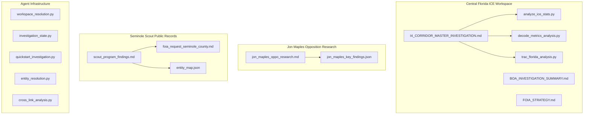
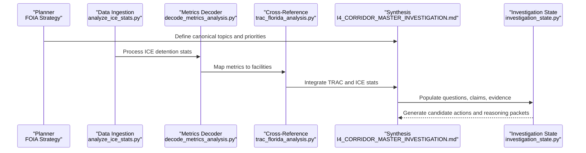
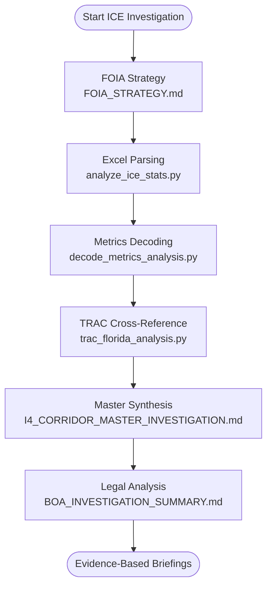
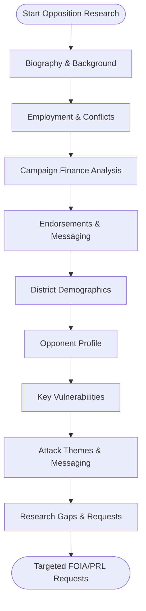
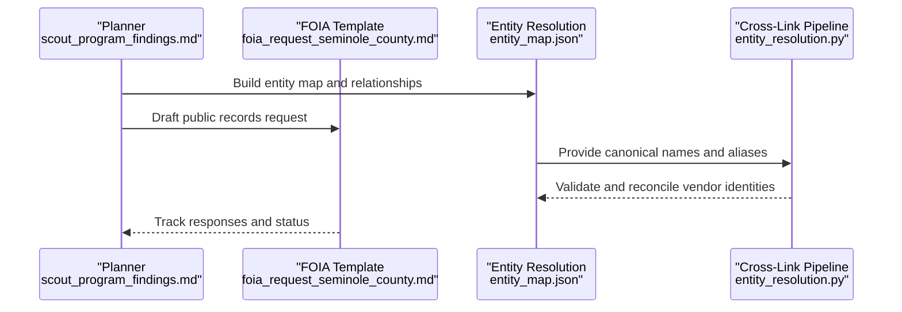
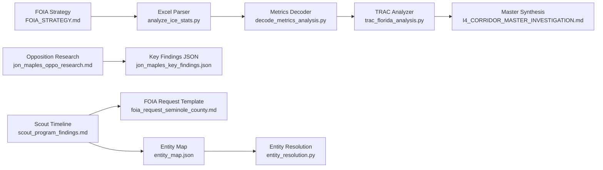

# Investigation Workspaces

<cite>
**Referenced Files in This Document**
- [INVESTIGATION_SUMMARY.md](file://central-fl-ice-workspace/INVESTIGATION_SUMMARY.md)
- [BOA_INVESTIGATION_SUMMARY.md](file://central-fl-ice-workspace/BOA_INVESTIGATION_SUMMARY.md)
- [FOIA_STRATEGY.md](file://central-fl-ice-workspace/FOIA_STRATEGY.md)
- [I4_CORRIDOR_MASTER_INVESTIGATION.md](file://central-fl-ice-workspace/I4_CORRIDOR_MASTER_INVESTIGATION.md)
- [analyze_ice_stats.py](file://central-fl-ice-workspace/analyze_ice_stats.py)
- [decode_metrics_analysis.py](file://central-fl-ice-workspace/decode_metrics_analysis.py)
- [trac_florida_analysis.py](file://central-fl-ice-workspace/trac_florida_analysis.py)
- [jon_maples_oppo_research.md](file://jon-maples-oppo/jon_maples_oppo_research.md)
- [jon_maples_key_findings.json](file://jon-maples-oppo/jon_maples_key_findings.json)
- [scout_program_findings.md](file://seminole-scout-workspace/scout_program_findings.md)
- [foia_request_seminole_county.md](file://seminole-scout-workspace/foia_request_seminole_county.md)
- [entity_map.json](file://seminole-scout-workspace/entity_map.json)
- [workspace_resolution.py](file://agent/workspace_resolution.py)
- [investigation_state.py](file://agent/investigation_state.py)
- [quickstart_investigation.py](file://quickstart_investigation.py)
- [entity_resolution.py](file://scripts/entity_resolution.py)
- [cross_link_analysis.py](file://scripts/cross_link_analysis.py)
</cite>

## Table of Contents
1. [Introduction](#introduction)
2. [Project Structure](#project-structure)
3. [Core Components](#core-components)
4. [Architecture Overview](#architecture-overview)
5. [Detailed Component Analysis](#detailed-component-analysis)
6. [Dependency Analysis](#dependency-analysis)
7. [Performance Considerations](#performance-considerations)
8. [Troubleshooting Guide](#troubleshooting-guide)
9. [Conclusion](#conclusion)

## Introduction
This document explains how the OpenPlanter repository organizes real-world investigation workspaces and demonstrates robust analysis workflows across three distinct domains: central Florida ICE detention operations, opposition research for a political race, and a public records investigation into a municipal transit program. It covers workspace structure, research methodologies, data analysis approaches, and evidence synthesis processes. It also provides practical guidance for setting up workspaces, organizing data, and applying effective investigation methodologies that translate into reliable findings and actionable intelligence.

## Project Structure
The repository is organized around domain-specific workspaces, each containing:
- Primary investigation syntheses and canonical documents
- Supporting deep-dive analyses, FOIA strategies, and status trackers
- Automated analysis scripts for data ingestion, entity resolution, and cross-linking
- Public records requests and FOIA templates
- Entity maps and JSON artifacts that consolidate findings

**Diagram sources**
- [I4_CORRIDOR_MASTER_INVESTIGATION.md:1-162](file://central-fl-ice-workspace/I4_CORRIDOR_MASTER_INVESTIGATION.md#L1-L162)
- [BOA_INVESTIGATION_SUMMARY.md:1-306](file://central-fl-ice-workspace/BOA_INVESTIGATION_SUMMARY.md#L1-L306)
- [FOIA_STRATEGY.md:1-64](file://central-fl-ice-workspace/FOIA_STRATEGY.md#L1-L64)
- [analyze_ice_stats.py:1-93](file://central-fl-ice-workspace/analyze_ice_stats.py#L1-L93)
- [decode_metrics_analysis.py:1-140](file://central-fl-ice-workspace/decode_metrics_analysis.py#L1-L140)
- [trac_florida_analysis.py:1-113](file://central-fl-ice-workspace/trac_florida_analysis.py#L1-L113)
- [jon_maples_oppo_research.md:1-373](file://jon-maples-oppo/jon_maples_oppo_research.md#L1-L373)
- [jon_maples_key_findings.json:1-344](file://jon-maples-oppo/jon_maples_key_findings.json#L1-L344)
- [scout_program_findings.md:1-699](file://seminole-scout-workspace/scout_program_findings.md#L1-L699)
- [foia_request_seminole_county.md:1-262](file://seminole-scout-workspace/foia_request_seminole_county.md#L1-L262)
- [entity_map.json:1-506](file://seminole-scout-workspace/entity_map.json#L1-L506)
- [workspace_resolution.py:1-136](file://agent/workspace_resolution.py#L1-L136)
- [investigation_state.py:1-800](file://agent/investigation_state.py#L1-L800)
- [quickstart_investigation.py:1-395](file://quickstart_investigation.py#L1-L395)
- [entity_resolution.py:1-741](file://scripts/entity_resolution.py#L1-L741)
- [cross_link_analysis.py:1-586](file://scripts/cross_link_analysis.py#L1-L586)

**Section sources**
- [workspace_resolution.py:31-99](file://agent/workspace_resolution.py#L31-L99)
- [investigation_state.py:35-68](file://agent/investigation_state.py#L35-L68)

## Core Components
- Central Florida ICE workspace: Canonical synthesis, FOIA strategy, automated data parsing, and legal analysis of ICE operations and BOA/IGSA dynamics.
- Opposition research workspace: Structured candidate research, key findings extraction, and attack themes for a political race.
- Seminole Scout workspace: Public records request template, entity resolution, and comprehensive timeline of a municipal transit program rollout.

These components demonstrate a repeatable pipeline: planning (strategy and canonical documents), data ingestion (scripts and FOIA), entity resolution and cross-linking, and synthesis into findings and briefings.

**Section sources**
- [I4_CORRIDOR_MASTER_INVESTIGATION.md:13-28](file://central-fl-ice-workspace/I4_CORRIDOR_MASTER_INVESTIGATION.md#L13-L28)
- [BOA_INVESTIGATION_SUMMARY.md:1-306](file://central-fl-ice-workspace/BOA_INVESTIGATION_SUMMARY.md#L1-L306)
- [jon_maples_oppo_research.md:1-373](file://jon-maples-oppo/jon_maples_oppo_research.md#L1-L373)
- [scout_program_findings.md:1-699](file://seminole-scout-workspace/scout_program_findings.md#L1-L699)

## Architecture Overview
The investigation architecture integrates workspace-driven documentation with automated data processing and entity resolution. The agent maintains a typed investigation state that captures questions, claims, evidence, and actions, enabling structured reasoning and candidate action generation.

**Diagram sources**
- [FOIA_STRATEGY.md:10-56](file://central-fl-ice-workspace/FOIA_STRATEGY.md#L10-L56)
- [analyze_ice_stats.py:51-93](file://central-fl-ice-workspace/analyze_ice_stats.py#L51-L93)
- [decode_metrics_analysis.py:10-140](file://central-fl-ice-workspace/decode_metrics_analysis.py#L10-L140)
- [trac_florida_analysis.py:46-113](file://central-fl-ice-workspace/trac_florida_analysis.py#L46-L113)
- [I4_CORRIDOR_MASTER_INVESTIGATION.md:1-162](file://central-fl-ice-workspace/I4_CORRIDOR_MASTER_INVESTIGATION.md#L1-L162)
- [investigation_state.py:235-385](file://agent/investigation_state.py#L235-L385)

## Detailed Component Analysis

### Central Florida ICE Workspace: Operations, Legal Authority, and FOIA Strategy
This workspace demonstrates a comprehensive investigation lifecycle:
- Planning: A canonical FOIA strategy identifies priority records requests across state and federal agencies.
- Data ingestion: Scripts parse Excel files and decode ICE metrics to identify I-4 corridor facilities and operational patterns.
- Cross-reference: TRAC data is compared with local ICE statistics to reconcile discrepancies.
- Synthesis: A master investigation consolidates findings, tracks contradictions, and integrates external resources (e.g., PSL-resources).

**Diagram sources**
- [FOIA_STRATEGY.md:10-56](file://central-fl-ice-workspace/FOIA_STRATEGY.md#L10-L56)
- [analyze_ice_stats.py:51-93](file://central-fl-ice-workspace/analyze_ice_stats.py#L51-L93)
- [decode_metrics_analysis.py:10-140](file://central-fl-ice-workspace/decode_metrics_analysis.py#L10-L140)
- [trac_florida_analysis.py:46-113](file://central-fl-ice-workspace/trac_florida_analysis.py#L46-L113)
- [I4_CORRIDOR_MASTER_INVESTIGATION.md:1-162](file://central-fl-ice-workspace/I4_CORRIDOR_MASTER_INVESTIGATION.md#L1-L162)
- [BOA_INVESTIGATION_SUMMARY.md:1-306](file://central-fl-ice-workspace/BOA_INVESTIGATION_SUMMARY.md#L1-L306)

Key outcomes include:
- Canonical document map guiding further analysis and ensuring consistency across reports.
- FOIA strategy with tiered priorities and execution phases.
- Automated scripts to extract and reconcile facility-level data.
- Legal synthesis clarifying BOA voluntariness and county obligations.

**Section sources**
- [I4_CORRIDOR_MASTER_INVESTIGATION.md:13-28](file://central-fl-ice-workspace/I4_CORRIDOR_MASTER_INVESTIGATION.md#L13-L28)
- [FOIA_STRATEGY.md:16-56](file://central-fl-ice-workspace/FOIA_STRATEGY.md#L16-L56)
- [analyze_ice_stats.py:16-93](file://central-fl-ice-workspace/analyze_ice_stats.py#L16-L93)
- [decode_metrics_analysis.py:10-140](file://central-fl-ice-workspace/decode_metrics_analysis.py#L10-L140)
- [trac_florida_analysis.py:46-113](file://central-fl-ice-workspace/trac_florida_analysis.py#L46-L113)
- [BOA_INVESTIGATION_SUMMARY.md:33-130](file://central-fl-ice-workspace/BOA_INVESTIGATION_SUMMARY.md#L33-L130)

### Jon Maples Opposition Research: Candidate Background, Finance, and Attack Themes
This workspace illustrates a structured approach to opposition research:
- Executive summary and biographical background.
- Employment history and potential conflicts of interest.
- Campaign finance analysis and top contributors.
- Endorsements and messaging analysis.
- District demographics and opponent profile.
- Key vulnerabilities and recommended attack themes.
- Research gaps and FOIA/public records recommendations.

**Diagram sources**
- [jon_maples_oppo_research.md:11-373](file://jon-maples-oppo/jon_maples_oppo_research.md#L11-L373)
- [jon_maples_key_findings.json:170-288](file://jon-maples-oppo/jon_maples_key_findings.json#L170-L288)

Practical guidance:
- Use JSON extracts to quickly identify top donors, conflicts, and messaging angles.
- Translate findings into concise attack themes aligned with district demographics.
- Document research gaps and generate targeted FOIA requests to fill evidence gaps.

**Section sources**
- [jon_maples_oppo_research.md:1-373](file://jon-maples-oppo/jon_maples_oppo_research.md#L1-L373)
- [jon_maples_key_findings.json:170-344](file://jon-maples-oppo/jon_maples_key_findings.json#L170-L344)

### Seminole Scout Public Records Investigation: Entity Resolution and Timeline
This workspace demonstrates public records request planning and entity resolution:
- Comprehensive timeline of the Scout microtransit program rollout.
- Entity map linking Seminole County, BeFree/Freebee, LYNX, and related RFPs.
- FOIA request template for procurement and contract documents.
- Entity resolution pipeline to link vendors and donors across datasets.

**Diagram sources**
- [scout_program_findings.md:200-699](file://seminole-scout-workspace/scout_program_findings.md#L200-L699)
- [foia_request_seminole_county.md:26-130](file://seminole-scout-workspace/foia_request_seminole_county.md#L26-L130)
- [entity_map.json:1-506](file://seminole-scout-workspace/entity_map.json#L1-L506)
- [entity_resolution.py:209-438](file://scripts/entity_resolution.py#L209-L438)

**Section sources**
- [scout_program_findings.md:1-699](file://seminole-scout-workspace/scout_program_findings.md#L1-L699)
- [foia_request_seminole_county.md:1-262](file://seminole-scout-workspace/foia_request_seminole_county.md#L1-L262)
- [entity_map.json:1-506](file://seminole-scout-workspace/entity_map.json#L1-L506)
- [entity_resolution.py:1-741](file://scripts/entity_resolution.py#L1-L741)

## Dependency Analysis
The investigation workflows depend on:
- Workspace structure: Canonical documents define priorities and track contradictions.
- Data ingestion scripts: Parse structured data sources (Excel, CSV) and produce machine-readable outputs.
- Cross-linking pipelines: Normalize and match entities across datasets.
- FOIA templates: Standardize public records requests for transparency and accountability.

**Diagram sources**
- [FOIA_STRATEGY.md:10-56](file://central-fl-ice-workspace/FOIA_STRATEGY.md#L10-L56)
- [analyze_ice_stats.py:16-93](file://central-fl-ice-workspace/analyze_ice_stats.py#L16-L93)
- [decode_metrics_analysis.py:10-140](file://central-fl-ice-workspace/decode_metrics_analysis.py#L10-L140)
- [trac_florida_analysis.py:46-113](file://central-fl-ice-workspace/trac_florida_analysis.py#L46-L113)
- [I4_CORRIDOR_MASTER_INVESTIGATION.md:1-162](file://central-fl-ice-workspace/I4_CORRIDOR_MASTER_INVESTIGATION.md#L1-L162)
- [jon_maples_oppo_research.md:1-373](file://jon-maples-oppo/jon_maples_oppo_research.md#L1-L373)
- [jon_maples_key_findings.json:1-344](file://jon-maples-oppo/jon_maples_key_findings.json#L1-L344)
- [scout_program_findings.md:1-699](file://seminole-scout-workspace/scout_program_findings.md#L1-L699)
- [foia_request_seminole_county.md:1-262](file://seminole-scout-workspace/foia_request_seminole_county.md#L1-L262)
- [entity_map.json:1-506](file://seminole-scout-workspace/entity_map.json#L1-L506)
- [entity_resolution.py:209-438](file://scripts/entity_resolution.py#L209-L438)

**Section sources**
- [investigation_state.py:235-385](file://agent/investigation_state.py#L235-L385)
- [cross_link_analysis.py:399-586](file://scripts/cross_link_analysis.py#L399-L586)

## Performance Considerations
- Data ingestion: Use targeted parsing scripts to minimize memory overhead and accelerate discovery of I-4 corridor references.
- Entity resolution: Normalize names consistently and apply fuzzy matching judiciously to balance precision and recall.
- FOIA workflows: Prioritize high-yield requests and maintain acknowledgments and timelines to track progress efficiently.
- State management: Leverage typed investigation state to reduce redundant processing and maintain coherent reasoning across iterations.

[No sources needed since this section provides general guidance]

## Troubleshooting Guide
Common issues and remedies:
- Workspace path resolution: Ensure the workspace points to a valid directory and avoid using the repository root directly.
- State migration: When upgrading investigation state formats, use migration helpers to preserve legacy observations and turn history.
- Cross-dataset mismatches: Apply entity resolution pipelines to reconcile vendor names and donor identities across datasets.
- FOIA response delays: Track acknowledgments and escalate appeals when necessary; maintain a canonical status tracker.

**Section sources**
- [workspace_resolution.py:124-135](file://agent/workspace_resolution.py#L124-L135)
- [investigation_state.py:88-107](file://agent/investigation_state.py#L88-L107)
- [entity_resolution.py:209-438](file://scripts/entity_resolution.py#L209-L438)
- [cross_link_analysis.py:471-586](file://scripts/cross_link_analysis.py#L471-L586)

## Conclusion
The OpenPlanter repository demonstrates a scalable, reproducible framework for real-world investigations. By combining canonical planning documents, automated data ingestion, entity resolution, and FOIA workflows, teams can systematically organize complex investigations, synthesize findings, and produce actionable intelligence. The three workspaces—central Florida ICE operations, opposition research, and Seminole Scout public records—illustrate how consistent methodology, rigorous data handling, and transparent documentation lead to reliable outcomes and effective advocacy.