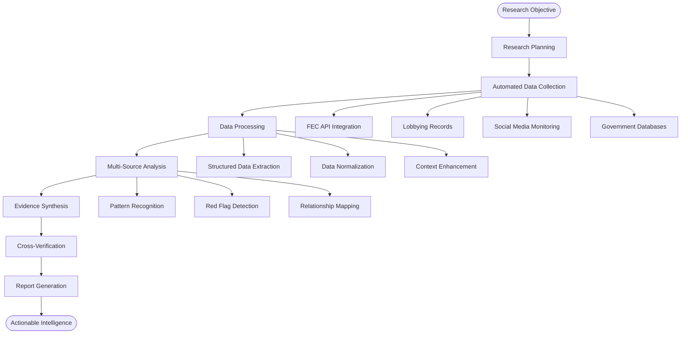
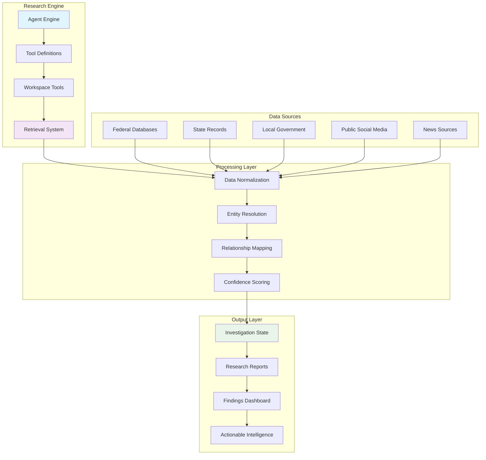
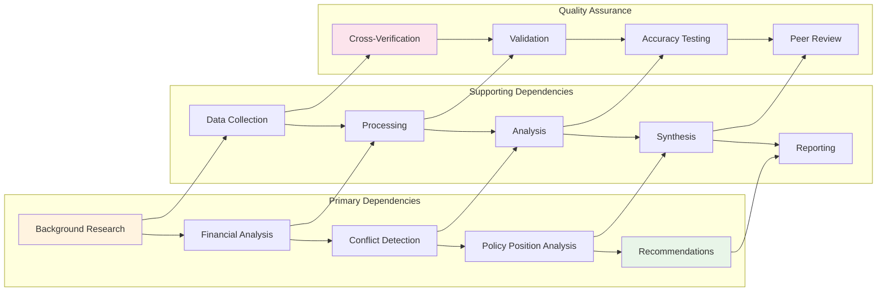

# Jon Maples Opposition Research Workspace

<cite>
**Referenced Files in This Document**
- [jon_maples_oppo_research.md](file://jon-maples-oppo/jon_maples_oppo_research.md)
- [jon_maples_key_findings.json](file://jon-maples-oppo/jon_maples_key_findings.json)
- [jon_maples_social_media_accounts.json](file://jon-maples-oppo/jon_maples_social_media_accounts.json)
- [jon_maples_voting_data.json](file://jon-maples-oppo/jon_maples_voting_data.json)
- [jon_maples_finra_research.md](file://jon-maples-oppo/jon_maples_finra_research.md)
- [jon_maples_federal_governmental_delegate_research.md](file://jon-maples-oppo/jon_maples_federal_governmental_delegate_research.md)
- [jon_maples_social_media_review.md](file://jon-maples-oppo/jon_maples_social_media_review.md)
- [jon_maples_social_media_notable_posts.md](file://jon-maples-oppo/jon_maples_social_media_notable_posts.md)
- [engine.py](file://agent/engine.py)
- [tools.py](file://agent/tools.py)
- [tool_defs.py](file://agent/tool_defs.py)
- [retrieval.py](file://agent/retrieval.py)
- [fetch_fec.py](file://scripts/fetch_fec.py)
- [fetch_senate_lobbying.py](file://scripts/fetch_senate_lobbying.py)
- [0001-typed-investigation-state.md](file://docs/rfcs/0001-typed-investigation-state.md)
</cite>

## Table of Contents
1. [Introduction](#introduction)
2. [Project Structure](#project-structure)
3. [Core Components](#core-components)
4. [Architecture Overview](#architecture-overview)
5. [Detailed Component Analysis](#detailed-component-analysis)
6. [Dependency Analysis](#dependency-analysis)
7. [Performance Considerations](#performance-considerations)
8. [Troubleshooting Guide](#troubleshooting-guide)
9. [Conclusion](#conclusion)

## Introduction

The Jon Maples opposition research workspace represents a comprehensive methodology for investigating political candidates through multi-source research combining federal records, social media analysis, voting records, and financial disclosures. This workspace demonstrates advanced opposition research techniques applied to Florida House District 87 candidate Jon Maples, showcasing how diverse data sources can be systematically integrated to uncover conflicts of interest, policy inconsistencies, and strategic vulnerabilities.

The research approach follows a structured pipeline that begins with candidate screening and background verification, progresses through financial transparency analysis and governmental service history verification, and culminates in public records acquisition and synthesis. This methodology leverages both automated data collection tools and manual verification techniques to ensure comprehensive coverage of all relevant information sources.

## Project Structure

The workspace organizes research materials into a systematic hierarchy designed for efficient analysis and synthesis:

```mermaid
graph TB
subgraph "Research Workspace"
A[jon-maples-oppo/]
B[Central Research Files]
C[Data Collection Scripts]
D[Documentation]
end
subgraph "A: Candidate Research"
A1[Background Analysis]
A2[Financial Records]
A3[Social Media]
A4[Voting History]
end
subgraph "B: Supporting Materials"
B1[Key Findings JSON]
B2[Research Reports]
B3[Archive Materials]
B4[Source Citations]
end
subgraph "C: Automation Tools"
C1[FEC Data Fetcher]
C2[Lobbying Data Collector]
C3[Web Scraping Tools]
C4[Document Processing]
end
subgraph "D: Methodology Docs"
D1[Investigation State RFC]
D2[Research Guidelines]
D3[Analysis Framework]
D4[Quality Assurance]
end
A --> A1
A --> A2
A --> A3
A --> A4
B --> B1
B --> B2
B --> B3
B --> B4
C --> C1
C --> C2
C --> C3
C --> C4
D --> D1
D --> D2
D --> D3
D --> D4
```

**Diagram sources**
- [jon_maples_oppo_research.md:1-373](file://jon-maples-oppo/jon_maples_oppo_research.md#L1-L373)
- [jon_maples_key_findings.json:1-344](file://jon-maples-oppo/jon_maples_key_findings.json#L1-L344)

The workspace demonstrates a sophisticated approach to political accountability research, with each component serving a specific analytical purpose while contributing to the overall investigative narrative.

**Section sources**
- [jon_maples_oppo_research.md:1-373](file://jon-maples-oppo/jon_maples_oppo_research.md#L1-L373)
- [jon_maples_key_findings.json:1-344](file://jon-maples-oppo/jon_maples_key_findings.json#L1-L344)

## Core Components

### Multi-Source Intelligence Gathering

The workspace implements a comprehensive intelligence gathering framework that integrates multiple data sources through systematic analysis protocols:

**Federal Records Integration**
- Campaign finance data from Federal Election Commission
- Lobbying disclosure records from Senate Office of Public Records
- Government employment verification through official databases
- Regulatory compliance monitoring through securities and banking regulators

**Digital Footprint Analysis**
- Social media platform monitoring across multiple channels
- Content analysis and sentiment tracking
- Cross-platform identity verification
- Historical content preservation and analysis

**Government Service Verification**
- Municipal government records and meeting minutes
- Official voting records and policy positions
- Recognition and award documentation
- Conflict of interest declarations

**Financial Transparency Analysis**
- Campaign contribution tracking and analysis
- Personal financial disclosure verification
- Corporate relationship mapping
- Regulatory compliance monitoring

### Automated Research Pipeline

The workspace incorporates sophisticated automation tools that streamline the research process while maintaining quality standards:

**Diagram sources**
- [engine.py:586-800](file://agent/engine.py#L586-L800)
- [tools.py:1-800](file://agent/tools.py#L1-L800)

**Section sources**
- [engine.py:1-800](file://agent/engine.py#L1-L800)
- [tools.py:1-800](file://agent/tools.py#L1-L800)

## Architecture Overview

The research workspace employs a modular architecture that enables scalable analysis of political candidates through integrated tooling and systematic methodology:

**Diagram sources**
- [tool_defs.py:1-756](file://agent/tool_defs.py#L1-L756)
- [retrieval.py:1-800](file://agent/retrieval.py#L1-L800)
- [0001-typed-investigation-state.md:1-400](file://docs/rfcs/0001-typed-investigation-state.md#L1-L400)

The architecture supports both automated and manual research approaches, enabling researchers to scale investigations while maintaining analytical rigor and quality control.

**Section sources**
- [tool_defs.py:1-756](file://agent/tool_defs.py#L1-L756)
- [retrieval.py:1-800](file://agent/retrieval.py#L1-L800)
- [0001-typed-investigation-state.md:1-400](file://docs/rfcs/0001-typed-investigation-state.md#L1-L400)

## Detailed Component Analysis

### Candidate Screening and Background Verification

The workspace demonstrates comprehensive candidate screening methodology through systematic background analysis:

**Biographical Information Analysis**
The research begins with thorough biographical verification, including:
- Educational credentials validation
- Professional experience cross-referencing
- Residential history tracking
- Family relationship mapping
- Religious and civic organization memberships

**Professional Credential Verification**
Systematic verification of professional credentials ensures authenticity:
- Securities licenses validation through regulatory databases
- Professional certifications confirmation
- Employment history cross-checking
- Continuing education requirements monitoring

**Conflict of Interest Assessment**
Comprehensive conflict of interest analysis examines:
- Financial advisor relationships with insurance companies
- Government relations activities and lobbying involvement
- Corporate board memberships and investments
- Business partnerships and ownership structures

### Financial Transparency Analysis

The workspace implements rigorous financial transparency analysis through multiple verification layers:

**Campaign Finance Investigation**
Detailed examination of campaign financial records reveals:
- Contribution source analysis and verification
- Expenditure tracking and justification
- Disclosure compliance monitoring
- Potential violation detection

**Regulatory Compliance Monitoring**
Systematic monitoring of regulatory filings:
- FINRA BrokerCheck database searches
- Securities and exchange commission filings
- State financial regulatory compliance
- Professional licensing renewal tracking

**Asset and Liability Verification**
Comprehensive asset and liability assessment:
- Real estate holdings verification
- Business ownership disclosure
- Personal financial statement analysis
- Debt and obligation tracking

### Governmental Service History Verification

The workspace provides systematic verification of governmental service records:

**Municipal Government Service**
Thorough analysis of local government service:
- Town council membership verification
- Official voting record reconstruction
- Committee assignments and leadership roles
- Recognition and award documentation

**Policy Position Analysis**
Systematic tracking of policy positions:
- Voting record analysis and interpretation
- Public statement tracking and verification
- Committee hearing participation
- Legislative proposal tracking

**Ethical Compliance Monitoring**
Monitoring of ethical compliance:
- Conflict of interest declarations
- Ethics training completion verification
- Financial disclosure filing accuracy
- Code of conduct adherence

### Public Records Acquisition and Analysis

The workspace demonstrates sophisticated public records acquisition methodology:

**Digital Archive Creation**
Systematic creation of digital archives:
- Social media content preservation
- News article collection and organization
- Public meeting recording and transcription
- Official document scanning and indexing

**Cross-Platform Verification**
Multi-platform content verification:
- Identity verification across social media platforms
- Content consistency checking
- Timeline reconstruction and validation
- Source attribution and provenance tracking

**Sentiment and Trend Analysis**
Advanced content analysis techniques:
- Sentiment analysis of public statements
- Trend identification in policy positions
- Community reaction tracking
- Media coverage analysis

### Social Media Intelligence Operations

The workspace implements comprehensive social media intelligence gathering:

**Multi-Platform Monitoring**
Systematic monitoring across social media platforms:
- Account discovery and verification
- Content categorization and tagging
- Engagement pattern analysis
- Influencer and supporter mapping

**Content Analysis and Categorization**
Sophisticated content analysis techniques:
- Policy position identification
- Controversial content detection
- Sentiment and tone analysis
- Viral potential assessment

**Historical Content Preservation**
Comprehensive content preservation:
- Archival of historical posts and comments
- Version control and change tracking
- Deleted content recovery attempts
- Cross-reference linking

**Section sources**
- [jon_maples_social_media_accounts.json:1-109](file://jon-maples-oppo/jon_maples_social_media_accounts.json#L1-L109)
- [jon_maples_social_media_review.md:1-163](file://jon-maples-oppo/jon_maples_social_media_review.md#L1-L163)
- [jon_maples_social_media_notable_posts.md:1-319](file://jon-maples-oppo/jon_maples_social_media_notable_posts.md#L1-L319)

## Dependency Analysis

The research workspace demonstrates sophisticated interdependencies between components that enable comprehensive analysis:

**Diagram sources**
- [jon_maples_oppo_research.md:324-341](file://jon-maples-oppo/jon_maples_oppo_research.md#L324-L341)
- [jon_maples_key_findings.json:280-288](file://jon-maples-oppo/jon_maples_key_findings.json#L280-L288)

The dependency structure ensures that each analysis phase builds upon previous findings while maintaining quality control through systematic validation processes.

**Section sources**
- [jon_maples_oppo_research.md:324-341](file://jon-maples-oppo/jon_maples_oppo_research.md#L324-L341)
- [jon_maples_key_findings.json:280-288](file://jon-maples-oppo/jon_maples_key_findings.json#L280-L288)

## Performance Considerations

The workspace demonstrates several performance optimization strategies for large-scale political research:

**Scalable Data Processing**
- Batch processing of large datasets
- Parallel execution of independent analyses
- Incremental data updates and caching
- Memory-efficient data structures

**Efficient Resource Utilization**
- API rate limiting and throttling management
- Intelligent retry mechanisms with exponential backoff
- Optimized database queries and indexing
- Efficient file system operations

**Quality vs. Quantity Balance**
- Automated filtering reduces noise in results
- Confidence scoring prioritizes high-value findings
- Cross-validation prevents false positives
- Peer review ensures accuracy over speed

**Section sources**
- [engine.py:357-428](file://agent/engine.py#L357-L428)
- [tools.py:253-286](file://agent/tools.py#L253-L286)

## Troubleshooting Guide

The workspace includes comprehensive troubleshooting procedures for common research challenges:

**Data Source Issues**
- API rate limiting and quota management
- Database connectivity and timeout handling
- File system permission and access issues
- Network connectivity and proxy configuration

**Analysis Quality Problems**
- False positive identification in pattern matching
- Incomplete data normalization and structuring
- Cross-reference validation failures
- Confidence scoring inconsistencies

**Tool Integration Challenges**
- Browser automation and headless browser issues
- Document processing and OCR accuracy problems
- Audio transcription quality and language detection
- Image processing and visual analysis limitations

**Quality Assurance Procedures**
- Regular validation of research methodology
- Peer review and cross-checking processes
- Accuracy testing with known datasets
- Continuous improvement of analysis algorithms

**Section sources**
- [engine.py:265-296](file://agent/engine.py#L265-L296)
- [tools.py:203-214](file://agent/tools.py#L203-L214)

## Conclusion

The Jon Maples opposition research workspace exemplifies best practices in comprehensive political accountability investigation. Through systematic integration of multi-source intelligence, rigorous verification protocols, and automated analysis tools, the workspace demonstrates how modern research methodologies can effectively uncover conflicts of interest, policy inconsistencies, and strategic vulnerabilities in political candidates.

The modular architecture enables scalability while maintaining analytical rigor, while the comprehensive methodology ensures thorough coverage of all relevant information sources. The workspace serves as a model for opposition research applications, demonstrating how diverse data sources including campaign finance reports, government databases, and public social media profiles can be systematically integrated to support informed democratic participation.

The documented research pipeline provides a replicable framework for similar investigations, incorporating lessons learned from the Jon Maples case study into actionable methodologies for future political accountability research.