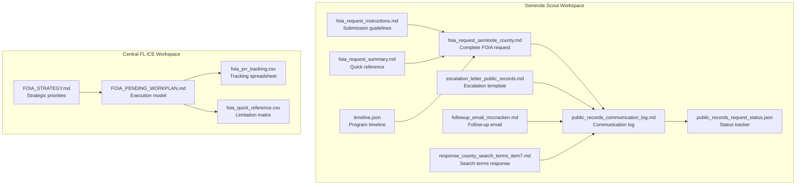
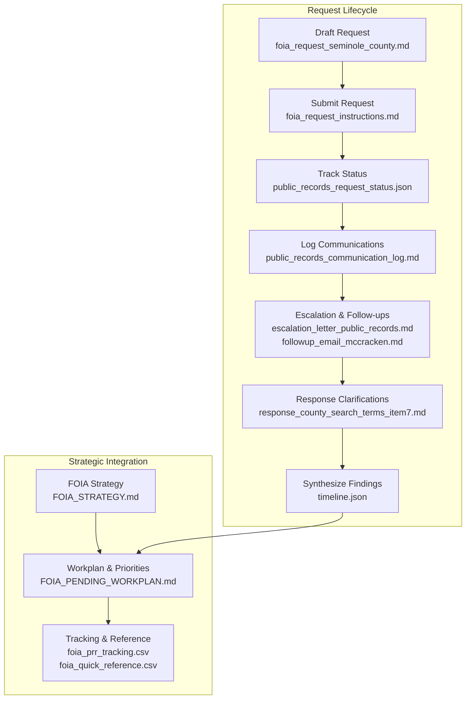
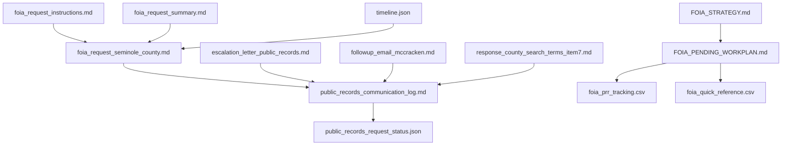

# Seminole Scout Public Records Workspace

<cite>
**Referenced Files in This Document**
- [foia_request_instructions.md](file://seminole-scout-workspace/foia_request_instructions.md)
- [foia_request_seminole_county.md](file://seminole-scout-workspace/foia_request_seminole_county.md)
- [foia_request_summary.md](file://seminole-scout-workspace/foia_request_summary.md)
- [public_records_request_status.json](file://seminole-scout-workspace/public_records_request_status.json)
- [public_records_communication_log.md](file://seminole-scout-workspace/public_records_communication_log.md)
- [timeline.json](file://seminole-scout-workspace/timeline.json)
- [escalation_letter_public_records.md](file://seminole-scout-workspace/escalation_letter_public_records.md)
- [followup_email_mccracken.md](file://seminole-scout-workspace/followup_email_mccracken.md)
- [response_county_search_terms_item7.md](file://seminole-scout-workspace/response_county_search_terms_item7.md)
- [FOIA_STRATEGY.md](file://central-fl-ice-workspace/FOIA_STRATEGY.md)
- [FOIA_PENDING_WORKPLAN.md](file://central-fl-ice-workspace/FOIA_PENDING_WORKPLAN.md)
- [foia_prr_tracking.csv](file://central-fl-ice-workspace/foia_prr_tracking.csv)
- [foia_quick_reference.csv](file://central-fl-ice-workspace/foia_quick_reference.csv)
</cite>

## Table of Contents
1. [Introduction](#introduction)
2. [Project Structure](#project-structure)
3. [Core Components](#core-components)
4. [Architecture Overview](#architecture-overview)
5. [Detailed Component Analysis](#detailed-component-analysis)
6. [Dependency Analysis](#dependency-analysis)
7. [Performance Considerations](#performance-considerations)
8. [Troubleshooting Guide](#troubleshooting-guide)
9. [Conclusion](#conclusion)
10. [Appendices](#appendices)

## Introduction
This document provides a comprehensive guide to managing FOIA requests and conducting public records investigations for the Seminole Scout microtransit program. It explains the public records acquisition methodology, including request formulation, tracking systems, response analysis, and evidence compilation. It also documents the investigation approach covering FOIA request strategies, agency communication protocols, timeline management, and evidence preservation. The guide includes detailed walkthroughs of the public records workflow from initial request drafting through response processing and finding synthesis, along with practical guidance on FOIA request writing, agency interaction protocols, and evidence organization systems. Finally, it addresses the integration of multiple public records requests, response tracking, and timeline management, and provides examples of common public records investigation patterns and strategic communication approaches used in transparency campaigns.

## Project Structure
The Seminole Scout public records workspace organizes materials around a single FOIA request for the Scout microtransit program, with supporting documents for escalation, communication logging, status tracking, and timelines. Parallel to this, the central Florida ICE workspace demonstrates a broader FOIA strategy and tracking system that can be adapted for multi-agency, multi-jurisdictional investigations.

**Diagram sources**
- [foia_request_seminole_county.md:1-262](file://seminole-scout-workspace/foia_request_seminole_county.md#L1-L262)
- [foia_request_instructions.md:1-311](file://seminole-scout-workspace/foia_request_instructions.md#L1-L311)
- [foia_request_summary.md:1-180](file://seminole-scout-workspace/foia_request_summary.md#L1-L180)
- [public_records_communication_log.md:1-183](file://seminole-scout-workspace/public_records_communication_log.md#L1-L183)
- [public_records_request_status.json:1-131](file://seminole-scout-workspace/public_records_request_status.json#L1-L131)
- [escalation_letter_public_records.md:1-271](file://seminole-scout-workspace/escalation_letter_public_records.md#L1-L271)
- [followup_email_mccracken.md:1-61](file://seminole-scout-workspace/followup_email_mccracken.md#L1-L61)
- [response_county_search_terms_item7.md:1-162](file://seminole-scout-workspace/response_county_search_terms_item7.md#L1-L162)
- [timeline.json:1-671](file://seminole-scout-workspace/timeline.json#L1-L671)
- [FOIA_STRATEGY.md:1-64](file://central-fl-ice-workspace/FOIA_STRATEGY.md#L1-L64)
- [FOIA_PENDING_WORKPLAN.md:1-63](file://central-fl-ice-workspace/FOIA_PENDING_WORKPLAN.md#L1-L63)
- [foia_prr_tracking.csv:1-18](file://central-fl-ice-workspace/foia_prr_tracking.csv#L1-L18)
- [foia_quick_reference.csv:1-17](file://central-fl-ice-workspace/foia_quick_reference.csv#L1-L17)

**Section sources**
- [foia_request_seminole_county.md:1-262](file://seminole-scout-workspace/foia_request_seminole_county.md#L1-L262)
- [foia_request_instructions.md:1-311](file://seminole-scout-workspace/foia_request_instructions.md#L1-L311)
- [foia_request_summary.md:1-180](file://seminole-scout-workspace/foia_request_summary.md#L1-L180)
- [public_records_communication_log.md:1-183](file://seminole-scout-workspace/public_records_communication_log.md#L1-L183)
- [public_records_request_status.json:1-131](file://seminole-scout-workspace/public_records_request_status.json#L1-L131)
- [escalation_letter_public_records.md:1-271](file://seminole-scout-workspace/escalation_letter_public_records.md#L1-L271)
- [followup_email_mccracken.md:1-61](file://seminole-scout-workspace/followup_email_mccracken.md#L1-L61)
- [response_county_search_terms_item7.md:1-162](file://seminole-scout-workspace/response_county_search_terms_item7.md#L1-L162)
- [timeline.json:1-671](file://seminole-scout-workspace/timeline.json#L1-L671)
- [FOIA_STRATEGY.md:1-64](file://central-fl-ice-workspace/FOIA_STRATEGY.md#L1-L64)
- [FOIA_PENDING_WORKPLAN.md:1-63](file://central-fl-ice-workspace/FOIA_PENDING_WORKPLAN.md#L1-L63)
- [foia_prr_tracking.csv:1-18](file://central-fl-ice-workspace/foia_prr_tracking.csv#L1-L18)
- [foia_quick_reference.csv:1-17](file://central-fl-ice-workspace/foia_quick_reference.csv#L1-L17)

## Core Components
- FOIA request template and instructions: Provides a complete, ready-to-submit FOIA request and submission guidelines, including preferred methods, contact information, and fee waiver language.
- Communication log and status tracker: Documents all interactions with the agency, escalation events, and timeline metrics to maintain transparency and accountability.
- Escalation and follow-up templates: Standardized letters and emails to maintain pressure and ensure compliance with Florida public records law.
- Search terms specification: A detailed response to agency clarifications, ensuring comprehensive email searches across relevant topics and timeframes.
- Timeline documentation: Chronological timeline of the Scout program’s development, providing context for request scope and historical background.
- Strategic FOIA framework: A broader methodology for multi-agency FOIA campaigns, including priority tiers, execution phases, and response readiness infrastructure.

**Section sources**
- [foia_request_seminole_county.md:1-262](file://seminole-scout-workspace/foia_request_seminole_county.md#L1-L262)
- [foia_request_instructions.md:1-311](file://seminole-scout-workspace/foia_request_instructions.md#L1-L311)
- [public_records_communication_log.md:1-183](file://seminole-scout-workspace/public_records_communication_log.md#L1-L183)
- [public_records_request_status.json:1-131](file://seminole-scout-workspace/public_records_request_status.json#L1-L131)
- [escalation_letter_public_records.md:1-271](file://seminole-scout-workspace/escalation_letter_public_records.md#L1-L271)
- [followup_email_mccracken.md:1-61](file://seminole-scout-workspace/followup_email_mccracken.md#L1-L61)
- [response_county_search_terms_item7.md:1-162](file://seminole-scout-workspace/response_county_search_terms_item7.md#L1-L162)
- [timeline.json:1-671](file://seminole-scout-workspace/timeline.json#L1-L671)
- [FOIA_STRATEGY.md:1-64](file://central-fl-ice-workspace/FOIA_STRATEGY.md#L1-L64)
- [FOIA_PENDING_WORKPLAN.md:1-63](file://central-fl-ice-workspace/FOIA_PENDING_WORKPLAN.md#L1-L63)

## Architecture Overview
The public records acquisition architecture integrates request preparation, submission, tracking, and response processing with strategic escalation and evidence synthesis. The system emphasizes:
- Structured request formulation aligned with Florida public records law
- Multi-tiered communication protocols (initial request, follow-ups, escalation)
- Automated status tracking and timeline management
- Evidence organization and synthesis workflows
- Integration with broader FOIA strategy frameworks for multi-jurisdictional campaigns

**Diagram sources**
- [foia_request_seminole_county.md:1-262](file://seminole-scout-workspace/foia_request_seminole_county.md#L1-L262)
- [foia_request_instructions.md:1-311](file://seminole-scout-workspace/foia_request_instructions.md#L1-L311)
- [public_records_request_status.json:1-131](file://seminole-scout-workspace/public_records_request_status.json#L1-L131)
- [public_records_communication_log.md:1-183](file://seminole-scout-workspace/public_records_communication_log.md#L1-L183)
- [escalation_letter_public_records.md:1-271](file://seminole-scout-workspace/escalation_letter_public_records.md#L1-L271)
- [followup_email_mccracken.md:1-61](file://seminole-scout-workspace/followup_email_mccracken.md#L1-L61)
- [response_county_search_terms_item7.md:1-162](file://seminole-scout-workspace/response_county_search_terms_item7.md#L1-L162)
- [timeline.json:1-671](file://seminole-scout-workspace/timeline.json#L1-L671)
- [FOIA_STRATEGY.md:1-64](file://central-fl-ice-workspace/FOIA_STRATEGY.md#L1-L64)
- [FOIA_PENDING_WORKPLAN.md:1-63](file://central-fl-ice-workspace/FOIA_PENDING_WORKPLAN.md#L1-L63)
- [foia_prr_tracking.csv:1-18](file://central-fl-ice-workspace/foia_prr_tracking.csv#L1-L18)
- [foia_quick_reference.csv:1-17](file://central-fl-ice-workspace/foia_quick_reference.csv#L1-L17)

## Detailed Component Analysis

### FOIA Request Formulation and Submission
- Request scope: The request comprehensively covers procurement documents, contracts, meeting minutes, financial records, performance data, planning documents, and communications related to the Scout microtransit program.
- Legal basis: The request cites Florida Statutes Chapter 119 and the Sunshine Law, establishing a strong legal foundation.
- Format preferences: Requests records in electronic formats where possible, with alternatives for large files.
- Fee waiver: Includes a fee waiver request based on public interest, with a stated willingness to pay reasonable fees up to a specified amount.
- Timeline expectations: Sets clear expectations for acknowledgment and response timelines under Florida law.

Practical guidance:
- Tailor the request to include all relevant departments and timeframes.
- Specify formats and delivery preferences to streamline processing.
- Include a fee waiver request and a stated fee cap to manage costs.
- Provide a certification statement affirming good faith and legitimate purpose.

**Section sources**
- [foia_request_seminole_county.md:20-229](file://seminole-scout-workspace/foia_request_seminole_county.md#L20-L229)
- [foia_request_instructions.md:137-166](file://seminole-scout-workspace/foia_request_instructions.md#L137-L166)
- [foia_request_summary.md:60-126](file://seminole-scout-workspace/foia_request_summary.md#L60-L126)

### Agency Communication Protocols and Escalation Strategy
- Initial submission: The request is submitted via email to the primary contact, with a clear subject line and attached request text.
- Follow-up protocol: If no acknowledgment is received within a reasonable time, a follow-up email is sent with a clear deadline for response.
- Escalation pathway: Escalation letters are sent to the County Manager and, if necessary, to the Board of County Commissioners, Florida Attorney General, and State Attorney.
- Communication logging: All interactions are documented with dates, recipients, and outcomes to maintain a clear audit trail.

Escalation effectiveness observed:
- Escalation to the County Manager resulted in a rapid response within hours, demonstrating the effectiveness of upward pressure in bureaucratic processes.
- The communication log captures the “email filtering issue” explanation and subsequent actions taken by the agency.

**Section sources**
- [public_records_communication_log.md:8-90](file://seminole-scout-workspace/public_records_communication_log.md#L8-L90)
- [escalation_letter_public_records.md:1-271](file://seminole-scout-workspace/escalation_letter_public_records.md#L1-L271)
- [followup_email_mccracken.md:1-61](file://seminole-scout-workspace/followup_email_mccracken.md#L1-L61)
- [public_records_request_status.json:31-52](file://seminole-scout-workspace/public_records_request_status.json#L31-L52)

### Timeline Management and Evidence Preservation
- Timeline documentation: The timeline provides a chronological account of the Scout program’s development, from initial direction to service transition, offering essential context for request scope and historical background.
- Status tracking: The JSON-based status tracker captures request ID, requester information, status updates, communications, timeline metrics, and strategic recommendations.
- Evidence preservation: All communications, acknowledgments, and responses are documented and stored for future reference and potential legal proceedings.

Timeline highlights:
- Initiation phase: BCC directs staff to explore transit alternatives.
- Planning phase: Research and stakeholder engagement.
- Procurement phase: RFP release and vendor proposals.
- Contract award and execution: BCC vote and contract signing.
- Launch and post-launch adjustments: Soft launch, full deployment, and budget adjustments.
- Service transition: LYNX route eliminations.

**Section sources**
- [timeline.json:1-671](file://seminole-scout-workspace/timeline.json#L1-L671)
- [public_records_request_status.json:1-131](file://seminole-scout-workspace/public_records_request_status.json#L1-L131)

### Response Analysis and Evidence Compilation
- Response clarification: The agency requested specific search terms and timeframes for communications, prompting a detailed response with comprehensive search specifications.
- Evidence synthesis: The timeline and request documents are synthesized to answer key questions about procurement fairness, cost comparisons, performance metrics, decision-making factors, and transparency concerns.
- Redaction and exemptions: The request includes provisions for redactions and exemptions, requiring agencies to cite specific statutory exemptions and provide indices of withheld records.

Evidence compilation workflow:
- Inventory received documents and cross-reference with investigation findings.
- Identify gaps and follow-up with additional requests if needed.
- Prepare synthesis reports addressing key questions and strategic recommendations.

**Section sources**
- [response_county_search_terms_item7.md:1-162](file://seminole-scout-workspace/response_county_search_terms_item7.md#L1-L162)
- [foia_request_seminole_county.md:26-130](file://seminole-scout-workspace/foia_request_seminole_county.md#L26-L130)

### Integration of Multiple Public Records Requests and Tracking Systems
- Strategic framework: The central Florida ICE workspace demonstrates a multi-agency FOIA strategy with priority tiers, execution phases, and response readiness infrastructure.
- Tracking systems: CSV-based tracking and quick-reference matrices provide standardized ways to monitor requests, agencies, target data, timelines, and success likelihoods.
- Workplan alignment: The FOIA pending workplan outlines immediate execution queues, high-priority analysis threads, and deliverables produced while FOIA responses are pending.

Integration recommendations:
- Adopt canonical FOIA strategy documents and tracking spreadsheets for multi-jurisdictional campaigns.
- Maintain a single intake log for request IDs, agencies, response dates, and extraction completion states.
- Pre-build parsers and templates for contract extraction, financial extraction, and inspection report normalization.

**Section sources**
- [FOIA_STRATEGY.md:1-64](file://central-fl-ice-workspace/FOIA_STRATEGY.md#L1-L64)
- [FOIA_PENDING_WORKPLAN.md:1-63](file://central-fl-ice-workspace/FOIA_PENDING_WORKPLAN.md#L1-L63)
- [foia_prr_tracking.csv:1-18](file://central-fl-ice-workspace/foia_prr_tracking.csv#L1-L18)
- [foia_quick_reference.csv:1-17](file://central-fl-ice-workspace/foia_quick_reference.csv#L1-L17)

### Practical Guidance on FOIA Request Writing and Agency Interaction
- Request writing tips: Be specific, polite, and professional; keep copies; follow up regularly; be willing to negotiate scope; ask for electronic formats.
- Agency interaction protocols: Document everything; maintain professional but assertive tone; set deadlines; request written confirmations; prepare for escalation.
- Evidence organization: Maintain logs, track timelines, and preserve all communications for synthesis and potential legal use.

Common patterns:
- Escalation to higher authority often yields rapid response.
- Requesting specific search terms helps agencies fulfill requests more effectively.
- Written confirmations and status updates improve accountability.

**Section sources**
- [foia_request_instructions.md:168-210](file://seminole-scout-workspace/foia_request_instructions.md#L168-L210)
- [public_records_communication_log.md:118-141](file://seminole-scout-workspace/public_records_communication_log.md#L118-L141)
- [escalation_letter_public_records.md:203-221](file://seminole-scout-workspace/escalation_letter_public_records.md#L203-L221)

## Architecture Overview
The public records acquisition architecture integrates request preparation, submission, tracking, and response processing with strategic escalation and evidence synthesis. The system emphasizes structured request formulation aligned with Florida public records law, multi-tiered communication protocols, automated status tracking, and evidence organization workflows.

**Diagram sources**
- [foia_request_seminole_county.md:1-262](file://seminole-scout-workspace/foia_request_seminole_county.md#L1-L262)
- [foia_request_instructions.md:1-311](file://seminole-scout-workspace/foia_request_instructions.md#L1-L311)
- [public_records_request_status.json:1-131](file://seminole-scout-workspace/public_records_request_status.json#L1-L131)
- [public_records_communication_log.md:1-183](file://seminole-scout-workspace/public_records_communication_log.md#L1-L183)
- [escalation_letter_public_records.md:1-271](file://seminole-scout-workspace/escalation_letter_public_records.md#L1-L271)
- [followup_email_mccracken.md:1-61](file://seminole-scout-workspace/followup_email_mccracken.md#L1-L61)
- [response_county_search_terms_item7.md:1-162](file://seminole-scout-workspace/response_county_search_terms_item7.md#L1-L162)
- [timeline.json:1-671](file://seminole-scout-workspace/timeline.json#L1-L671)
- [FOIA_STRATEGY.md:1-64](file://central-fl-ice-workspace/FOIA_STRATEGY.md#L1-L64)
- [FOIA_PENDING_WORKPLAN.md:1-63](file://central-fl-ice-workspace/FOIA_PENDING_WORKPLAN.md#L1-L63)
- [foia_prr_tracking.csv:1-18](file://central-fl-ice-workspace/foia_prr_tracking.csv#L1-L18)
- [foia_quick_reference.csv:1-17](file://central-fl-ice-workspace/foia_quick_reference.csv#L1-L17)

## Detailed Component Analysis

### Request Formulation and Legal Framework
- Legal basis: The request cites Florida Statutes Chapter 119 and the Sunshine Law, establishing a strong legal foundation for access to public records.
- Scope definition: The request specifies procurement documents, contracts, meeting minutes, financial records, performance data, planning documents, and communications.
- Format and delivery preferences: Requests records in electronic formats where possible, with alternatives for large files.
- Fee waiver and cost management: Includes a fee waiver request and a stated willingness to pay reasonable fees up to a specified amount.

Best practices:
- Align request language with Florida public records law.
- Specify departments and timeframes explicitly.
- Include format preferences and delivery methods.
- Provide a fee waiver request with a stated fee cap.

**Section sources**
- [foia_request_seminole_county.md:20-229](file://seminole-scout-workspace/foia_request_seminole_county.md#L20-L229)
- [foia_request_instructions.md:137-166](file://seminole-scout-workspace/foia_request_instructions.md#L137-L166)
- [foia_request_summary.md:60-126](file://seminole-scout-workspace/foia_request_summary.md#L60-L126)

### Communication Protocols and Escalation
- Initial submission: The request is submitted via email to the primary contact with a clear subject line and attached request text.
- Follow-up protocol: If no acknowledgment is received within a reasonable time, a follow-up email is sent with a clear deadline for response.
- Escalation pathway: Escalation letters are sent to the County Manager and, if necessary, to the Board of County Commissioners, Florida Attorney General, and State Attorney.
- Communication logging: All interactions are documented with dates, recipients, and outcomes to maintain a clear audit trail.

Escalation effectiveness:
- Escalation to the County Manager resulted in a rapid response within hours, demonstrating the effectiveness of upward pressure in bureaucratic processes.

**Section sources**
- [public_records_communication_log.md:8-90](file://seminole-scout-workspace/public_records_communication_log.md#L8-L90)
- [escalation_letter_public_records.md:1-271](file://seminole-scout-workspace/escalation_letter_public_records.md#L1-L271)
- [followup_email_mccracken.md:1-61](file://seminole-scout-workspace/followup_email_mccracken.md#L1-L61)
- [public_records_request_status.json:31-52](file://seminole-scout-workspace/public_records_request_status.json#L31-L52)

### Timeline Management and Evidence Preservation
- Timeline documentation: The timeline provides a chronological account of the Scout program’s development, from initial direction to service transition, offering essential context for request scope and historical background.
- Status tracking: The JSON-based status tracker captures request ID, requester information, status updates, communications, timeline metrics, and strategic recommendations.
- Evidence preservation: All communications, acknowledgments, and responses are documented and stored for future reference and potential legal proceedings.

**Section sources**
- [timeline.json:1-671](file://seminole-scout-workspace/timeline.json#L1-L671)
- [public_records_request_status.json:1-131](file://seminole-scout-workspace/public_records_request_status.json#L1-L131)

### Response Analysis and Evidence Compilation
- Response clarification: The agency requested specific search terms and timeframes for communications, prompting a detailed response with comprehensive search specifications.
- Evidence synthesis: The timeline and request documents are synthesized to answer key questions about procurement fairness, cost comparisons, performance metrics, decision-making factors, and transparency concerns.
- Redaction and exemptions: The request includes provisions for redactions and exemptions, requiring agencies to cite specific statutory exemptions and provide indices of withheld records.

**Section sources**
- [response_county_search_terms_item7.md:1-162](file://seminole-scout-workspace/response_county_search_terms_item7.md#L1-L162)
- [foia_request_seminole_county.md:26-130](file://seminole-scout-workspace/foia_request_seminole_county.md#L26-L130)

### Integration of Multiple Public Records Requests and Tracking Systems
- Strategic framework: The central Florida ICE workspace demonstrates a multi-agency FOIA strategy with priority tiers, execution phases, and response readiness infrastructure.
- Tracking systems: CSV-based tracking and quick-reference matrices provide standardized ways to monitor requests, agencies, target data, timelines, and success likelihoods.
- Workplan alignment: The FOIA pending workplan outlines immediate execution queues, high-priority analysis threads, and deliverables produced while FOIA responses are pending.

**Section sources**
- [FOIA_STRATEGY.md:1-64](file://central-fl-ice-workspace/FOIA_STRATEGY.md#L1-L64)
- [FOIA_PENDING_WORKPLAN.md:1-63](file://central-fl-ice-workspace/FOIA_PENDING_WORKPLAN.md#L1-L63)
- [foia_prr_tracking.csv:1-18](file://central-fl-ice-workspace/foia_prr_tracking.csv#L1-L18)
- [foia_quick_reference.csv:1-17](file://central-fl-ice-workspace/foia_quick_reference.csv#L1-L17)

## Dependency Analysis
The public records workflow depends on coordinated interactions between request preparation, submission, tracking, and response processing. Dependencies include:
- Request template dependencies: The request template depends on instructions and summary documents for completeness and legal compliance.
- Communication dependencies: The communication log depends on status tracker entries and escalation templates to maintain a coherent audit trail.
- Timeline dependencies: The timeline informs request scope and provides context for response analysis and synthesis.
- Strategic dependencies: The FOIA strategy and workplan provide overarching guidance for multi-agency campaigns and tracking systems.

**Diagram sources**
- [foia_request_seminole_county.md:1-262](file://seminole-scout-workspace/foia_request_seminole_county.md#L1-L262)
- [foia_request_instructions.md:1-311](file://seminole-scout-workspace/foia_request_instructions.md#L1-L311)
- [foia_request_summary.md:1-180](file://seminole-scout-workspace/foia_request_summary.md#L1-L180)
- [public_records_communication_log.md:1-183](file://seminole-scout-workspace/public_records_communication_log.md#L1-L183)
- [public_records_request_status.json:1-131](file://seminole-scout-workspace/public_records_request_status.json#L1-L131)
- [escalation_letter_public_records.md:1-271](file://seminole-scout-workspace/escalation_letter_public_records.md#L1-L271)
- [followup_email_mccracken.md:1-61](file://seminole-scout-workspace/followup_email_mccracken.md#L1-L61)
- [response_county_search_terms_item7.md:1-162](file://seminole-scout-workspace/response_county_search_terms_item7.md#L1-L162)
- [timeline.json:1-671](file://seminole-scout-workspace/timeline.json#L1-L671)
- [FOIA_STRATEGY.md:1-64](file://central-fl-ice-workspace/FOIA_STRATEGY.md#L1-L64)
- [FOIA_PENDING_WORKPLAN.md:1-63](file://central-fl-ice-workspace/FOIA_PENDING_WORKPLAN.md#L1-L63)
- [foia_prr_tracking.csv:1-18](file://central-fl-ice-workspace/foia_prr_tracking.csv#L1-L18)
- [foia_quick_reference.csv:1-17](file://central-fl-ice-workspace/foia_quick_reference.csv#L1-L17)

**Section sources**
- [foia_request_seminole_county.md:1-262](file://seminole-scout-workspace/foia_request_seminole_county.md#L1-L262)
- [foia_request_instructions.md:1-311](file://seminole-scout-workspace/foia_request_instructions.md#L1-L311)
- [foia_request_summary.md:1-180](file://seminole-scout-workspace/foia_request_summary.md#L1-L180)
- [public_records_communication_log.md:1-183](file://seminole-scout-workspace/public_records_communication_log.md#L1-L183)
- [public_records_request_status.json:1-131](file://seminole-scout-workspace/public_records_request_status.json#L1-L131)
- [escalation_letter_public_records.md:1-271](file://seminole-scout-workspace/escalation_letter_public_records.md#L1-L271)
- [followup_email_mccracken.md:1-61](file://seminole-scout-workspace/followup_email_mccracken.md#L1-L61)
- [response_county_search_terms_item7.md:1-162](file://seminole-scout-workspace/response_county_search_terms_item7.md#L1-L162)
- [timeline.json:1-671](file://seminole-scout-workspace/timeline.json#L1-L671)
- [FOIA_STRATEGY.md:1-64](file://central-fl-ice-workspace/FOIA_STRATEGY.md#L1-L64)
- [FOIA_PENDING_WORKPLAN.md:1-63](file://central-fl-ice-workspace/FOIA_PENDING_WORKPLAN.md#L1-L63)
- [foia_prr_tracking.csv:1-18](file://central-fl-ice-workspace/foia_prr_tracking.csv#L1-L18)
- [foia_quick_reference.csv:1-17](file://central-fl-ice-workspace/foia_quick_reference.csv#L1-L17)

## Performance Considerations
- Timeliness: Escalation to higher authority often yields rapid response, reducing overall processing time.
- Efficiency: Requesting specific search terms helps agencies fulfill requests more effectively, minimizing back-and-forth communication.
- Cost control: Including a fee waiver request and stating a fee cap helps manage costs and avoid delays due to fee disputes.
- Automation: Using tracking systems and templates streamlines the process and reduces administrative overhead.

## Troubleshooting Guide
Common issues and resolutions:
- No acknowledgment: Follow up with a phone call and send a follow-up email referencing the original request date.
- Inadequate response: Request mediation through the Florida Attorney General’s Open Government Mediation Program, file a complaint with the State Attorney’s Office, consult an attorney, or file a lawsuit as a last resort.
- Email delivery problems: Document the issue and follow up with a phone call; consider sending via certified mail to establish proof of delivery.
- Escalation effectiveness: Escalation to the County Manager was effective in this case; maintain professional but assertive tone and document all communications.

**Section sources**
- [foia_request_instructions.md:168-190](file://seminole-scout-workspace/foia_request_instructions.md#L168-L190)
- [public_records_communication_log.md:93-141](file://seminole-scout-workspace/public_records_communication_log.md#L93-L141)
- [public_records_request_status.json:63-85](file://seminole-scout-workspace/public_records_request_status.json#L63-L85)

## Conclusion
The Seminole Scout public records workspace provides a robust framework for FOIA request management and public records investigation. By combining structured request formulation, multi-tiered communication protocols, automated status tracking, and strategic escalation, investigators can effectively acquire public records, manage timelines, and synthesize findings. The integration of broader FOIA strategy frameworks enables multi-jurisdictional campaigns and ensures comprehensive evidence collection and analysis.

## Appendices
- FOIA Request Template: [foia_request_seminole_county.md:1-262](file://seminole-scout-workspace/foia_request_seminole_county.md#L1-L262)
- Submission Guidelines: [foia_request_instructions.md:1-311](file://seminole-scout-workspace/foia_request_instructions.md#L1-L311)
- Quick Reference: [foia_request_summary.md:1-180](file://seminole-scout-workspace/foia_request_summary.md#L1-L180)
- Communication Log: [public_records_communication_log.md:1-183](file://seminole-scout-workspace/public_records_communication_log.md#L1-L183)
- Status Tracker: [public_records_request_status.json:1-131](file://seminole-scout-workspace/public_records_request_status.json#L1-L131)
- Escalation Template: [escalation_letter_public_records.md:1-271](file://seminole-scout-workspace/escalation_letter_public_records.md#L1-L271)
- Follow-up Email: [followup_email_mccracken.md:1-61](file://seminole-scout-workspace/followup_email_mccracken.md#L1-L61)
- Search Terms Response: [response_county_search_terms_item7.md:1-162](file://seminole-scout-workspace/response_county_search_terms_item7.md#L1-L162)
- Program Timeline: [timeline.json:1-671](file://seminole-scout-workspace/timeline.json#L1-L671)
- FOIA Strategy: [FOIA_STRATEGY.md:1-64](file://central-fl-ice-workspace/FOIA_STRATEGY.md#L1-L64)
- Workplan: [FOIA_PENDING_WORKPLAN.md:1-63](file://central-fl-ice-workspace/FOIA_PENDING_WORKPLAN.md#L1-L63)
- Tracking Spreadsheet: [foia_prr_tracking.csv:1-18](file://central-fl-ice-workspace/foia_prr_tracking.csv#L1-L18)
- Quick Reference Matrix: [foia_quick_reference.csv:1-17](file://central-fl-ice-workspace/foia_quick_reference.csv#L1-L17)