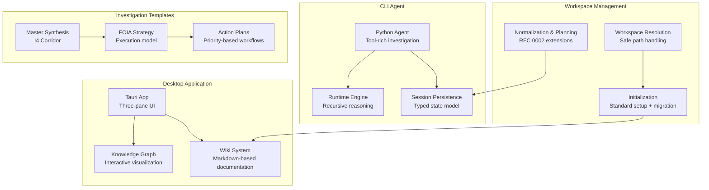
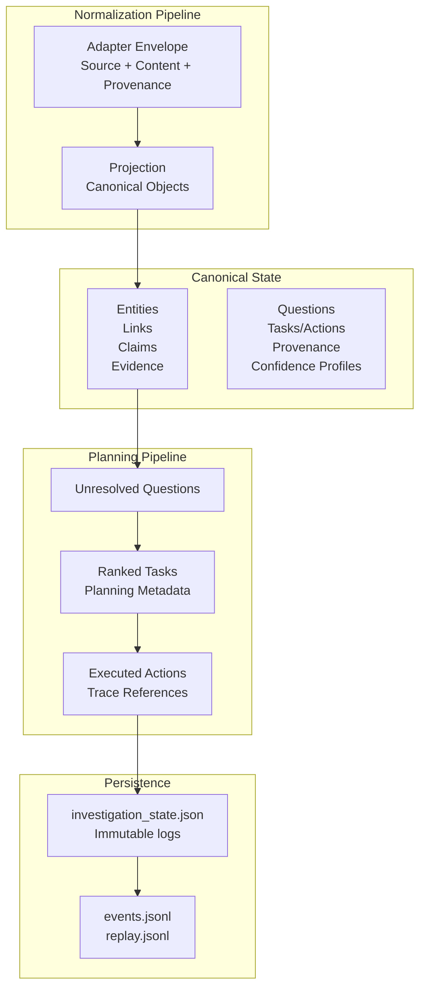
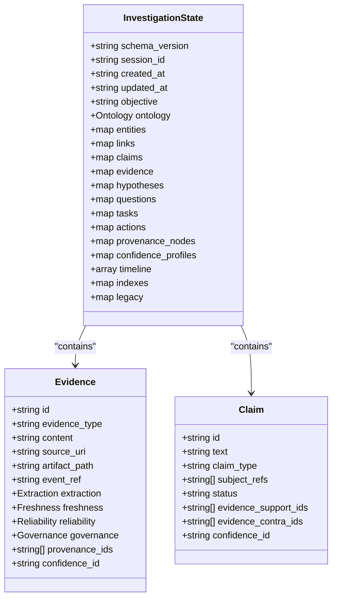
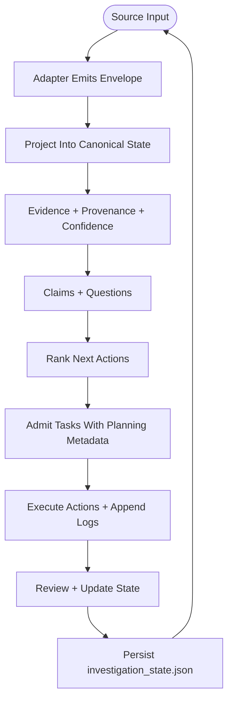
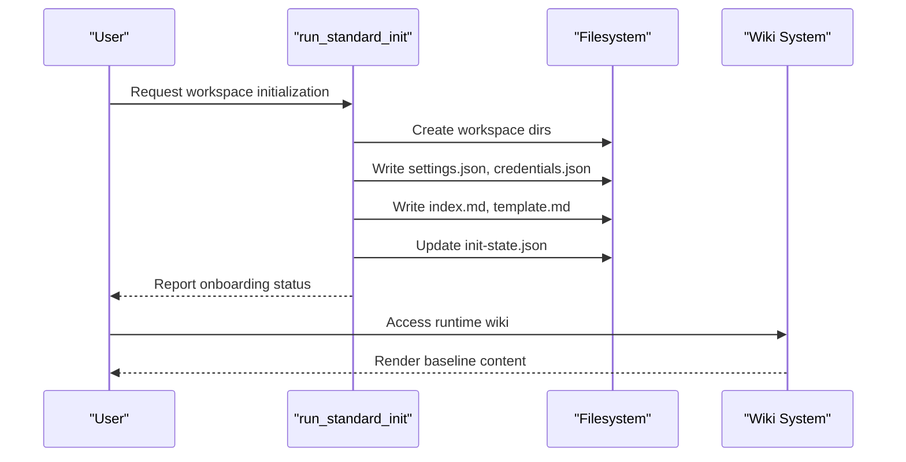
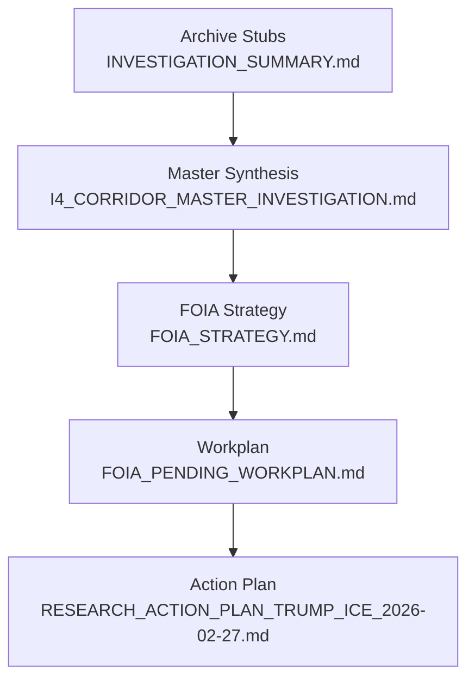
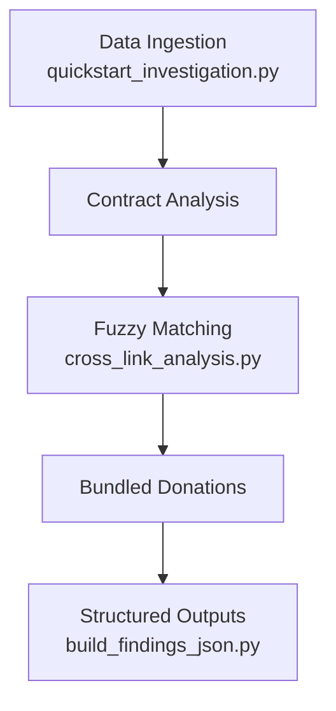
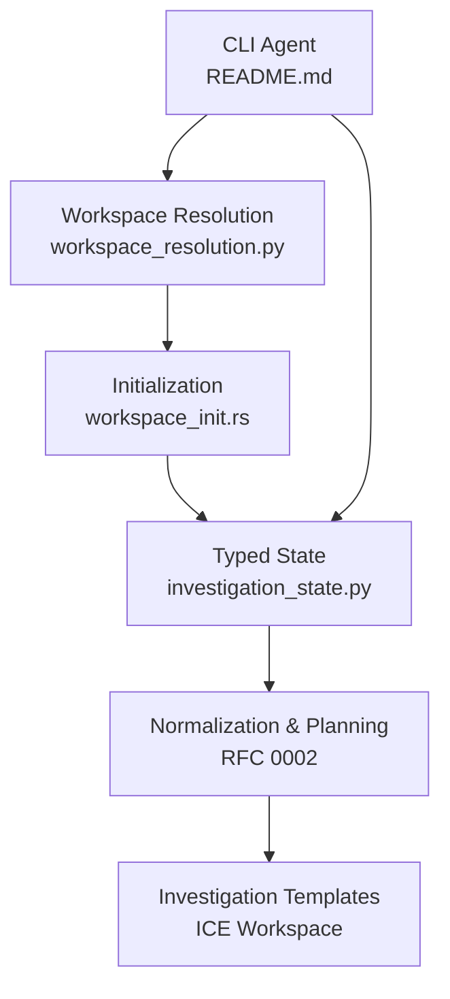

# Workspace Organization Principles

<cite>
**Referenced Files in This Document**
- [README.md](file://README.md)
- [VISION.md](file://VISION.md)
- [workspace_resolution.py](file://agent/workspace_resolution.py)
- [investigation_state.py](file://agent/investigation_state.py)
- [0001-typed-investigation-state.md](file://docs/rfcs/0001-typed-investigation-state.md)
- [0002-research-normalization-and-action-layer.md](file://docs/rfcs/0002-research-normalization-and-action-layer.md)
- [workspace_init.rs](file://openplanter-desktop/crates/op-core/src/workspace_init.rs)
- [I4_CORRIDOR_MASTER_INVESTIGATION.md](file://central-fl-ice-workspace/I4_CORRIDOR_MASTER_INVESTIGATION.md)
- [FOIA_STRATEGY.md](file://central-fl-ice-workspace/FOIA_STRATEGY.md)
- [FOIA_PENDING_WORKPLAN.md](file://central-fl-ice-workspace/FOIA_PENDING_WORKPLAN.md)
- [RESEARCH_ACTION_PLAN_TRUMP_ICE_2026-02-27.md](file://central-fl-ice-workspace/RESEARCH_ACTION_PLAN_TRUMP_ICE_2026-02-27.md)
- [ANALYSIS_SUMMARY_2026-02-27.md](file://central-fl-ice-workspace/ANALYSIS_SUMMARY_2026-02-27.md)
- [INVESTIGATION_SUMMARY.md](file://central-fl-ice-workspace/INVESTIGATION_SUMMARY.md)
- [quickstart_investigation.py](file://quickstart_investigation.py)
- [cross_link_analysis.py](file://scripts/cross_link_analysis.py)
- [build_findings_json.py](file://scripts/build_findings_json.py)
</cite>

## Table of Contents
1. [Introduction](#introduction)
2. [Project Structure](#project-structure)
3. [Core Components](#core-components)
4. [Architecture Overview](#architecture-overview)
5. [Detailed Component Analysis](#detailed-component-analysis)
6. [Dependency Analysis](#dependency-analysis)
7. [Performance Considerations](#performance-considerations)
8. [Troubleshooting Guide](#troubleshooting-guide)
9. [Conclusion](#conclusion)

## Introduction
This document establishes comprehensive workspace organization principles for systematic investigation setup and management. It synthesizes the repository's foundational concepts—ontology-first investigation state, canonical workspace initialization, and structured research methodologies—into practical guidance for setting up investigations, organizing research materials, establishing analysis workflows, and maintaining momentum. The principles emphasize reproducible organization, evidence-backed reasoning, and scalable collaboration across diverse investigation types.

## Project Structure
The repository provides a unified platform integrating:
- A desktop application with a knowledge graph and wiki-based documentation
- A Python CLI agent with tool-rich investigation workflows
- A canonical investigation state model and research normalization framework
- A structured workspace initialization system with migration support
- Real-world investigation templates and operational plans

**Diagram sources**
- [README.md:19-31](file://README.md#L19-L31)
- [workspace_resolution.py:31-99](file://agent/workspace_resolution.py#L31-L99)
- [workspace_init.rs:68-117](file://openplanter-desktop/crates/op-core/src/workspace_init.rs#L68-L117)
- [0001-typed-investigation-state.md:66-111](file://docs/rfcs/0001-typed-investigation-state.md#L66-L111)
- [0002-research-normalization-and-action-layer.md:136-230](file://docs/rfcs/0002-research-normalization-and-action-layer.md#L136-L230)

**Section sources**
- [README.md:1-118](file://README.md#L1-L118)
- [VISION.md:375-434](file://VISION.md#L375-L434)

## Core Components
This section outlines the essential components that enable systematic workspace organization and investigation management.

- **Typed Investigation State**: A canonical, versioned schema defining entities, links, claims, evidence, questions, tasks, actions, provenance, and confidence. It replaces append-only text memory with an ontology-first model for structured reasoning and incremental updates.
- **Research Normalization and Action Planning**: A deterministic adapter contract for heterogeneous inputs and a planning contract for turning unresolved questions into ranked, provenance-backed tasks and executed actions.
- **Workspace Initialization**: A standard initialization process that creates required directories, baseline wiki content, and persistent settings/credentials, with migration support for existing research materials.
- **Investigation Templates**: Structured templates for strategy, workplans, and action plans that define priorities, timelines, deliverables, and FOIA execution models.
- **Evidence Management**: A comprehensive framework for capturing, normalizing, and tracking evidence with provenance, confidence, and governance metadata.

**Section sources**
- [0001-typed-investigation-state.md:9-23](file://docs/rfcs/0001-typed-investigation-state.md#L9-L23)
- [0002-research-normalization-and-action-layer.md:10-18](file://docs/rfcs/0002-research-normalization-and-action-layer.md#L10-L18)
- [workspace_init.rs:68-117](file://openplanter-desktop/crates/op-core/src/workspace_init.rs#L68-L117)
- [I4_CORRIDOR_MASTER_INVESTIGATION.md:13-28](file://central-fl-ice-workspace/I4_CORRIDOR_MASTER_INVESTIGATION.md#L13-L28)

## Architecture Overview
The workspace architecture centers on a typed investigation state that serves as the canonical source of truth, with append-only logs preserved for traceability. The system supports both Python and Rust runtimes, ensuring interoperability and consistent state semantics.

**Diagram sources**
- [0001-typed-investigation-state.md:77-111](file://docs/rfcs/0001-typed-investigation-state.md#L77-L111)
- [0002-research-normalization-and-action-layer.md:136-230](file://docs/rfcs/0002-research-normalization-and-action-layer.md#L136-L230)

**Section sources**
- [0001-typed-investigation-state.md:243-256](file://docs/rfcs/0001-typed-investigation-state.md#L243-L256)
- [0002-research-normalization-and-action-layer.md:543-554](file://docs/rfcs/0002-research-normalization-and-action-layer.md#L543-L554)

## Detailed Component Analysis

### Typed Investigation State
The typed investigation state defines a versioned schema for canonical objects and indexes, enabling structured reasoning and incremental updates. It includes:
- Top-level metadata (schema version, session identifiers, timestamps)
- Core collections: entities, links, claims, evidence, hypotheses, questions, tasks, actions
- Provenance and confidence profiles
- Indexes for external references and tags
- Legacy compatibility fields for migration

**Diagram sources**
- [0001-typed-investigation-state.md:77-111](file://docs/rfcs/0001-typed-investigation-state.md#L77-L111)
- [0001-typed-investigation-state.md:166-176](file://docs/rfcs/0001-typed-investigation-state.md#L166-L176)
- [0001-typed-investigation-state.md:156-165](file://docs/rfcs/0001-typed-investigation-state.md#L156-L165)

**Section sources**
- [0001-typed-investigation-state.md:66-111](file://docs/rfcs/0001-typed-investigation-state.md#L66-L111)
- [investigation_state.py:35-68](file://agent/investigation_state.py#L35-L68)

### Research Normalization and Action Planning
This framework defines a deterministic adapter contract for heterogeneous inputs and a planning contract for generating canonical tasks and actions. Key elements:
- Normalized evidence envelope with source metadata, content references, provenance, freshness, reliability, extraction, and governance
- Canonical projection rules into RFC 0001 state
- Confidence composition and freshness semantics
- Question creation triggers and canonical question extension fields
- Task planning with action types, required inputs, payoff scoring, and suggested tools

**Diagram sources**
- [0002-research-normalization-and-action-layer.md:136-230](file://docs/rfcs/0002-research-normalization-and-action-layer.md#L136-L230)
- [0002-research-normalization-and-action-layer.md:409-462](file://docs/rfcs/0002-research-normalization-and-action-layer.md#L409-L462)

**Section sources**
- [0002-research-normalization-and-action-layer.md:136-230](file://docs/rfcs/0002-research-normalization-and-action-layer.md#L136-L230)
- [0002-research-normalization-and-action-layer.md:370-401](file://docs/rfcs/0002-research-normalization-and-action-layer.md#L370-L401)

### Workspace Initialization and Migration
The workspace initialization system ensures safe, reproducible setup with:
- Standard initialization creating required directories and baseline wiki content
- Initialization state tracking onboarding and migration targets
- Migration support for copying and synthesizing content from external sources
- Preservation of raw snapshots and rewriting of runtime wiki content

**Diagram sources**
- [workspace_init.rs:68-117](file://openplanter-desktop/crates/op-core/src/workspace_init.rs#L68-L117)
- [workspace_init.rs:127-168](file://openplanter-desktop/crates/op-core/src/workspace_init.rs#L127-L168)

**Section sources**
- [workspace_init.rs:68-117](file://openplanter-desktop/crates/op-core/src/workspace_init.rs#L68-L117)
- [workspace_init.rs:170-195](file://openplanter-desktop/crates/op-core/src/workspace_init.rs#L170-L195)

### Investigation Templates and Methodologies
The repository provides structured templates that demonstrate systematic investigation approaches:
- Master synthesis documents consolidating findings and contradictions
- FOIA strategy documents defining priorities, execution models, and expected outcomes
- Action plans with timelines, deliverables, and FOIA tracking
- Archive stubs and canonical pointers for legacy management

**Diagram sources**
- [I4_CORRIDOR_MASTER_INVESTIGATION.md:13-28](file://central-fl-ice-workspace/I4_CORRIDOR_MASTER_INVESTIGATION.md#L13-L28)
- [FOIA_STRATEGY.md:10-15](file://central-fl-ice-workspace/FOIA_STRATEGY.md#L10-L15)
- [FOIA_PENDING_WORKPLAN.md:10-11](file://central-fl-ice-workspace/FOIA_PENDING_WORKPLAN.md#L10-L11)
- [RESEARCH_ACTION_PLAN_TRUMP_ICE_2026-02-27.md:7-11](file://central-fl-ice-workspace/RESEARCH_ACTION_PLAN_TRUMP_ICE_2026-02-27.md#L7-L11)

**Section sources**
- [I4_CORRIDOR_MASTER_INVESTIGATION.md:10-27](file://central-fl-ice-workspace/I4_CORRIDOR_MASTER_INVESTIGATION.md#L10-L27)
- [FOIA_STRATEGY.md:10-15](file://central-fl-ice-workspace/FOIA_STRATEGY.md#L10-L15)
- [FOIA_PENDING_WORKPLAN.md:10-11](file://central-fl-ice-workspace/FOIA_PENDING_WORKPLAN.md#L10-L11)
- [RESEARCH_ACTION_PLAN_TRUMP_ICE_2026-02-27.md:7-11](file://central-fl-ice-workspace/RESEARCH_ACTION_PLAN_TRUMP_ICE_2026-02-27.md#L7-L11)

### Practical Examples and Decision-Making Frameworks
- Quick start investigation script demonstrates systematic data ingestion, normalization, and cross-dataset analysis for pay-to-play indicators.
- Cross-link analysis script illustrates entity mapping, fuzzy matching, and bundled donation detection.
- Findings JSON builder aggregates outputs into a structured findings report.

**Diagram sources**
- [quickstart_investigation.py:354-391](file://quickstart_investigation.py#L354-L391)
- [cross_link_analysis.py:399-470](file://scripts/cross_link_analysis.py#L399-L470)
- [build_findings_json.py:1-164](file://scripts/build_findings_json.py#L1-L164)

**Section sources**
- [quickstart_investigation.py:1-30](file://quickstart_investigation.py#L1-L30)
- [cross_link_analysis.py:1-25](file://scripts/cross_link_analysis.py#L1-L25)
- [build_findings_json.py:1-20](file://scripts/build_findings_json.py#L1-L20)

## Dependency Analysis
The workspace organization relies on several interdependent components that must align for effective investigation management.

**Diagram sources**
- [workspace_resolution.py:31-99](file://agent/workspace_resolution.py#L31-L99)
- [workspace_init.rs:68-117](file://openplanter-desktop/crates/op-core/src/workspace_init.rs#L68-L117)
- [investigation_state.py:35-68](file://agent/investigation_state.py#L35-L68)
- [0002-research-normalization-and-action-layer.md:136-230](file://docs/rfcs/0002-research-normalization-and-action-layer.md#L136-L230)
- [README.md:298-323](file://README.md#L298-L323)

**Section sources**
- [workspace_resolution.py:124-136](file://agent/workspace_resolution.py#L124-L136)
- [workspace_init.rs:170-195](file://openplanter-desktop/crates/op-core/src/workspace_init.rs#L170-L195)
- [README.md:298-323](file://README.md#L298-L323)

## Performance Considerations
- Use canonical typed state for efficient querying and reasoning over entities, links, claims, and evidence.
- Employ provenance and confidence profiles to reduce redundant computations and guide prioritization.
- Leverage normalized envelopes to minimize repeated extraction and normalization overhead.
- Maintain immutability of append-only logs while updating canonical state to support fast reads and deterministic migrations.

## Troubleshooting Guide
Common issues and resolutions:
- Workspace path conflicts: The workspace resolution system enforces guardrails to prevent using repository root as workspace and redirects to a workspace directory when available.
- Initialization failures: Verify required directories and baseline files are created; check initialization state for onboarding completion.
- State migration: Ensure legacy state is properly migrated into canonical objects and that provenance references are intact.
- FOIA tracking: Use canonical operational status documents and maintain a single intake log for request IDs, agencies, response dates, and extraction completion states.

**Section sources**
- [workspace_resolution.py:124-136](file://agent/workspace_resolution.py#L124-L136)
- [workspace_init.rs:127-168](file://openplanter-desktop/crates/op-core/src/workspace_init.rs#L127-L168)
- [FOIA_STRATEGY.md:58-60](file://central-fl-ice-workspace/FOIA_STRATEGY.md#L58-L60)
- [FOIA_PENDING_WORKPLAN.md:55-62](file://central-fl-ice-workspace/FOIA_PENDING_WORKPLAN.md#L55-L62)

## Conclusion
Effective workspace organization hinges on a typed, ontology-first investigation state, robust normalization and planning pipelines, and structured investigation templates. By adhering to these principles—safe workspace initialization, canonical state persistence, evidence-backed reasoning, and systematic action planning—teams can establish reproducible, scalable investigation workflows that maintain momentum, ensure transparency, and support collaborative research across diverse domains.