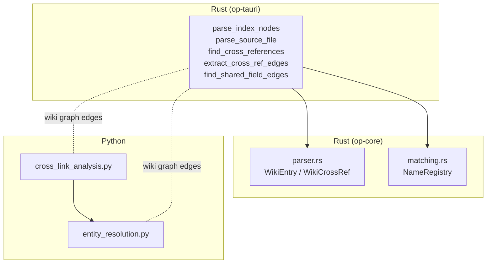
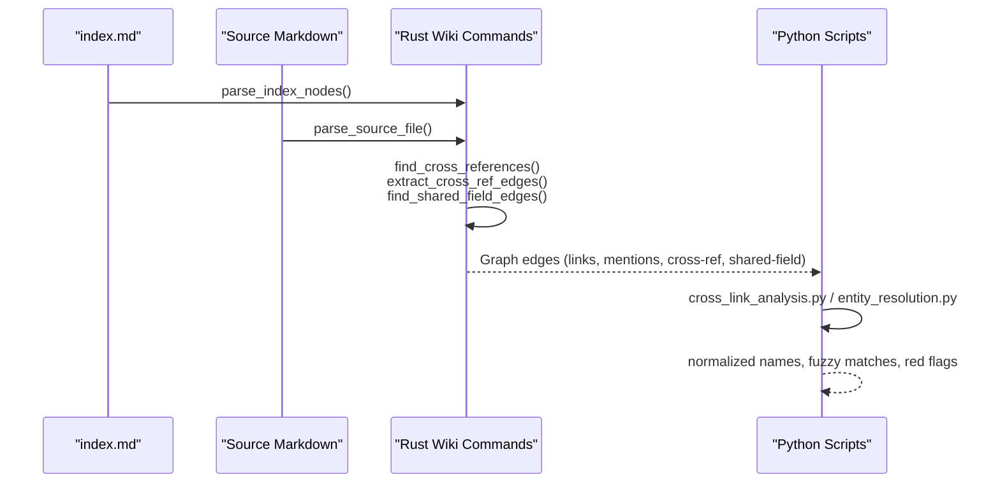
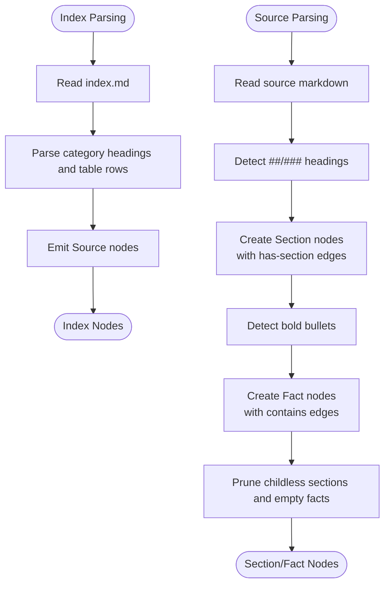
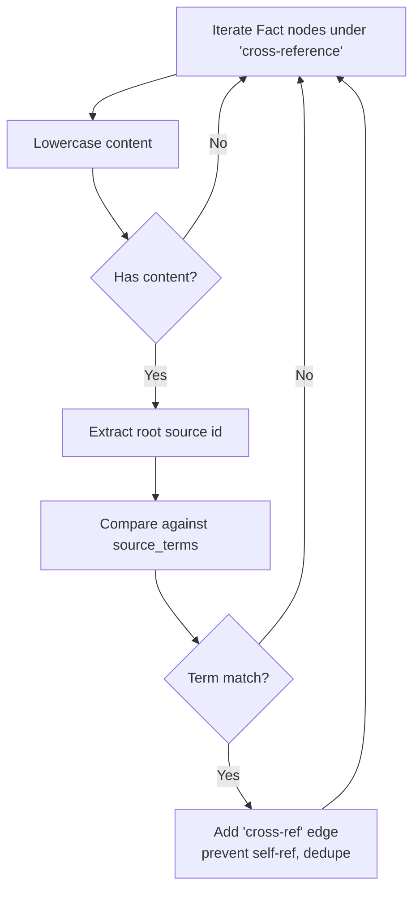
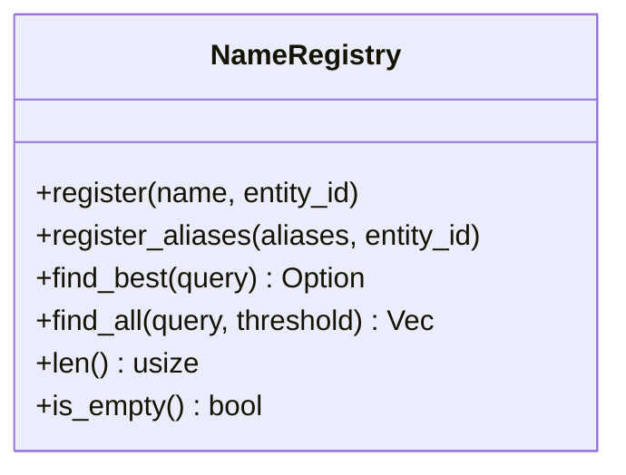
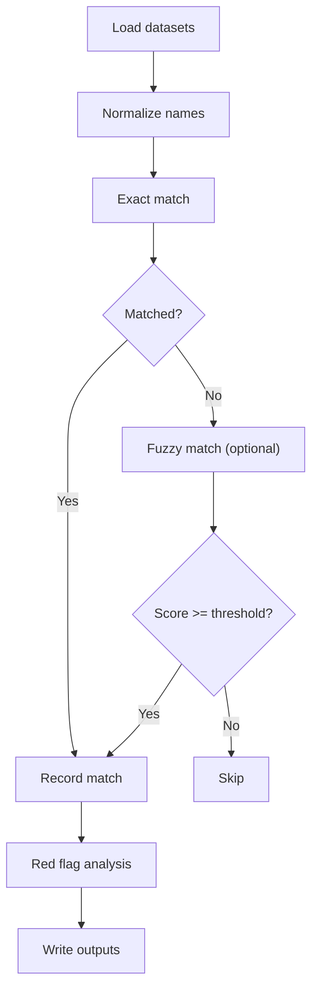
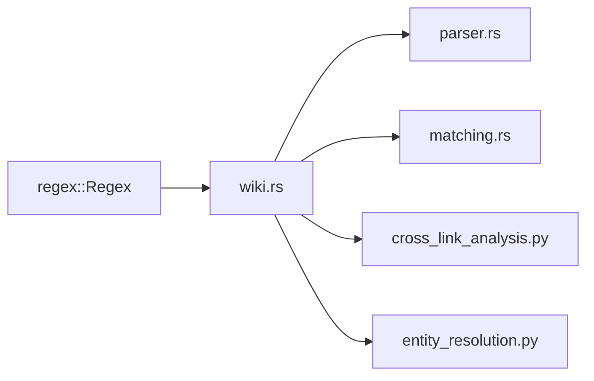

# Cross-reference Extraction

<cite>
**Referenced Files in This Document**
- [wiki.rs](file://openplanter-desktop/crates/op-tauri/src/commands/wiki.rs)
- [parser.rs](file://openplanter-desktop/crates/op-core/src/wiki/parser.rs)
- [matching.rs](file://openplanter-desktop/crates/op-core/src/wiki/matching.rs)
- [cross_link_analysis.py](file://scripts/cross_link_analysis.py)
- [entity_resolution.py](file://scripts/entity_resolution.py)
</cite>

## Table of Contents
1. [Introduction](#introduction)
2. [Project Structure](#project-structure)
3. [Core Components](#core-components)
4. [Architecture Overview](#architecture-overview)
5. [Detailed Component Analysis](#detailed-component-analysis)
6. [Dependency Analysis](#dependency-analysis)
7. [Performance Considerations](#performance-considerations)
8. [Troubleshooting Guide](#troubleshooting-guide)
9. [Conclusion](#conclusion)

## Introduction
This document describes the cross-reference extraction system designed to automatically discover entity relationships from wiki knowledge graphs. It covers:
- Regex-based extraction of markdown links and bold-text mentions
- Section parsing logic that builds hierarchical knowledge graph nodes
- Cross-reference pattern recognition across facts under dedicated sections
- The end-to-end pipeline from markdown parsing to relationship mapping
- Preprocessing and filtering logic
- Practical examples of extraction rules and relationship validation
- The Rust implementation of matching algorithms and its integration with Python processing
- Troubleshooting guidance and performance optimization for large wikis
- The relationship between extracted references and downstream entity resolution workflows

## Project Structure
The cross-reference extraction spans Rust and Python components:
- Rust: wiki graph construction, section parsing, and cross-reference edge generation
- Python: dataset-level entity resolution and cross-linking workflows

**Diagram sources**
- [wiki.rs:79-126](file://openplanter-desktop/crates/op-tauri/src/commands/wiki.rs#L79-L126)
- [parser.rs:29-86](file://openplanter-desktop/crates/op-core/src/wiki/parser.rs#L29-L86)
- [matching.rs:8-70](file://openplanter-desktop/crates/op-core/src/wiki/matching.rs#L8-L70)
- [cross_link_analysis.py:1-586](file://scripts/cross_link_analysis.py#L1-L586)
- [entity_resolution.py:1-741](file://scripts/entity_resolution.py#L1-L741)

**Section sources**
- [wiki.rs:79-126](file://openplanter-desktop/crates/op-tauri/src/commands/wiki.rs#L79-L126)
- [parser.rs:29-86](file://openplanter-desktop/crates/op-core/src/wiki/parser.rs#L29-L86)
- [matching.rs:8-70](file://openplanter-desktop/crates/op-core/src/wiki/matching.rs#L8-L70)
- [cross_link_analysis.py:1-586](file://scripts/cross_link_analysis.py#L1-L586)
- [entity_resolution.py:1-741](file://scripts/entity_resolution.py#L1-L741)

## Core Components
- Wiki index parsing and cross-reference extraction (Rust)
  - Parses index.md into Source nodes and extracts intra-wiki links
  - Builds hierarchical nodes (Sections/Facts) from source markdown
  - Detects cross-references via text-based mention matching under “cross-reference” sections
- Wiki parser utilities (Rust)
  - Index table parsing and intra-page link extraction
- Fuzzy name registry (Rust)
  - Provides fuzzy matching for entity name resolution
- Cross-dataset linking (Python)
  - Loads datasets, normalizes names, and performs entity resolution and red-flag detection
- Entity resolution pipeline (Python)
  - Matches donors/employers to vendors using multiple strategies and thresholds

**Section sources**
- [wiki.rs:79-126](file://openplanter-desktop/crates/op-tauri/src/commands/wiki.rs#L79-L126)
- [wiki.rs:309-575](file://openplanter-desktop/crates/op-tauri/src/commands/wiki.rs#L309-L575)
- [wiki.rs:578-633](file://openplanter-desktop/crates/op-tauri/src/commands/wiki.rs#L578-L633)
- [parser.rs:29-86](file://openplanter-desktop/crates/op-core/src/wiki/parser.rs#L29-L86)
- [parser.rs:88-114](file://openplanter-desktop/crates/op-core/src/wiki/parser.rs#L88-L114)
- [matching.rs:8-70](file://openplanter-desktop/crates/op-core/src/wiki/matching.rs#L8-L70)
- [cross_link_analysis.py:155-173](file://scripts/cross_link_analysis.py#L155-L173)
- [entity_resolution.py:213-244](file://scripts/entity_resolution.py#L213-L244)

## Architecture Overview
The extraction pipeline integrates Rust and Python:
- Rust constructs the wiki knowledge graph from index.md and source markdown
- Python consumes the resulting relationships to perform cross-dataset entity resolution and red-flag analysis

**Diagram sources**
- [wiki.rs:705-735](file://openplanter-desktop/crates/op-tauri/src/commands/wiki.rs#L705-L735)
- [wiki.rs:193-265](file://openplanter-desktop/crates/op-tauri/src/commands/wiki.rs#L193-L265)
- [wiki.rs:578-633](file://openplanter-desktop/crates/op-tauri/src/commands/wiki.rs#L578-L633)
- [wiki.rs:635-697](file://openplanter-desktop/crates/op-tauri/src/commands/wiki.rs#L635-L697)
- [cross_link_analysis.py:250-360](file://scripts/cross_link_analysis.py#L250-L360)
- [entity_resolution.py:309-438](file://scripts/entity_resolution.py#L309-L438)

## Detailed Component Analysis

### Rust: Wiki Index Parsing and Cross-reference Extraction
- Index parsing
  - Extracts Source nodes from index.md tables and normalizes categories
  - Produces Source nodes with id, label, category, and path
- Source file parsing
  - Converts markdown into Section and Fact nodes
  - Recognizes bold bullet patterns and indented continuations
  - Builds structural edges (has-section, contains)
- Cross-reference detection
  - Markdown link-based edges
  - Text-based mention edges using computed search terms
  - Cross-reference edges from facts under “cross-reference” sections
  - Shared-field edges across sources for fields under “data-schema” sections

**Diagram sources**
- [wiki.rs:79-126](file://openplanter-desktop/crates/op-tauri/src/commands/wiki.rs#L79-L126)
- [wiki.rs:309-575](file://openplanter-desktop/crates/op-tauri/src/commands/wiki.rs#L309-L575)

**Section sources**
- [wiki.rs:79-126](file://openplanter-desktop/crates/op-tauri/src/commands/wiki.rs#L79-L126)
- [wiki.rs:309-575](file://openplanter-desktop/crates/op-tauri/src/commands/wiki.rs#L309-L575)

### Rust: Cross-reference Pattern Recognition
- Mention-based edges
  - Precompute search terms per node (stopwords removal, acronym handling, distinctive words)
  - For each source, scan content for matches against other nodes’ terms
- Cross-reference edges from facts
  - Filter Fact nodes under “cross-reference” sections
  - Match content against source label search terms
  - Prevent self-references and deduplicate edges
- Shared-field edges
  - Group Fact nodes under “data-schema” by normalized field names
  - Connect facts across different sources sharing the same field

**Diagram sources**
- [wiki.rs:578-633](file://openplanter-desktop/crates/op-tauri/src/commands/wiki.rs#L578-L633)

**Section sources**
- [wiki.rs:128-189](file://openplanter-desktop/crates/op-tauri/src/commands/wiki.rs#L128-L189)
- [wiki.rs:193-265](file://openplanter-desktop/crates/op-tauri/src/commands/wiki.rs#L193-L265)
- [wiki.rs:578-633](file://openplanter-desktop/crates/op-tauri/src/commands/wiki.rs#L578-L633)
- [wiki.rs:635-697](file://openplanter-desktop/crates/op-tauri/src/commands/wiki.rs#L635-L697)

### Rust: Fuzzy Matching for Entity Resolution
- NameRegistry
  - Registers canonical names and aliases
  - Computes Jaro-Winkler similarity
  - Threshold-based best match and deduplication by entity id
- Typical usage
  - Build registries from known entities
  - Resolve ambiguous mentions in cross-references

**Diagram sources**
- [matching.rs:8-70](file://openplanter-desktop/crates/op-core/src/wiki/matching.rs#L8-L70)

**Section sources**
- [matching.rs:8-70](file://openplanter-desktop/crates/op-core/src/wiki/matching.rs#L8-L70)

### Python: Cross-dataset Linking and Entity Resolution
- cross_link_analysis.py
  - Loads datasets, normalizes names, and performs exact and fuzzy matching
  - Identifies red flags such as sole-source vendors who are also donors
- entity_resolution.py
  - Normalizes vendor and donor names
  - Applies multiple matching strategies (exact, aggressive normalization, token overlap)
  - Generates cross-links and red-flag summaries

**Diagram sources**
- [cross_link_analysis.py:250-360](file://scripts/cross_link_analysis.py#L250-L360)
- [entity_resolution.py:309-438](file://scripts/entity_resolution.py#L309-L438)

**Section sources**
- [cross_link_analysis.py:155-173](file://scripts/cross_link_analysis.py#L155-L173)
- [cross_link_analysis.py:250-360](file://scripts/cross_link_analysis.py#L250-L360)
- [entity_resolution.py:213-244](file://scripts/entity_resolution.py#L213-L244)
- [entity_resolution.py:309-438](file://scripts/entity_resolution.py#L309-L438)

## Dependency Analysis
- Rust components
  - wiki.rs depends on regex for link and heading detection
  - wiki.rs composes index parsing, source parsing, and edge extraction
  - parser.rs provides auxiliary parsing utilities for index.md and intra-page links
  - matching.rs provides fuzzy matching primitives
- Python components
  - cross_link_analysis.py and entity_resolution.py depend on CSV/JSON and optional rapidfuzz
- Integration
  - Rust produces Graph edges consumed by Python for cross-dataset entity resolution

**Diagram sources**
- [wiki.rs:19-21](file://openplanter-desktop/crates/op-tauri/src/commands/wiki.rs#L19-L21)
- [parser.rs:93-93](file://openplanter-desktop/crates/op-core/src/wiki/parser.rs#L93-L93)
- [matching.rs:5-5](file://openplanter-desktop/crates/op-core/src/wiki/matching.rs#L5-L5)
- [cross_link_analysis.py:17-23](file://scripts/cross_link_analysis.py#L17-L23)
- [entity_resolution.py:1-14](file://scripts/entity_resolution.py#L1-L14)

**Section sources**
- [wiki.rs:19-21](file://openplanter-desktop/crates/op-tauri/src/commands/wiki.rs#L19-L21)
- [parser.rs:93-93](file://openplanter-desktop/crates/op-core/src/wiki/parser.rs#L93-L93)
- [matching.rs:5-5](file://openplanter-desktop/crates/op-core/src/wiki/matching.rs#L5-L5)
- [cross_link_analysis.py:17-23](file://scripts/cross_link_analysis.py#L17-L23)
- [entity_resolution.py:1-14](file://scripts/entity_resolution.py#L1-L14)

## Performance Considerations
- Regex compilation
  - Precompile regexes once and reuse (already implemented via LazyLock)
- Content scanning
  - Pre-read all file contents to avoid repeated IO during cross-reference scans
- Term indexing
  - Precompute search terms per node to avoid repeated computation
- Edge deduplication
  - Use a HashSet keyed by (source, target) to prevent duplicate edges
- Filtering
  - Skip empty content and self-references early
- Python fuzzy matching
  - Optional rapidfuzz; fallback to exact matching reduces overhead
- Scalability
  - For very large wikis, consider incremental graph building and parallelization of file reads

[No sources needed since this section provides general guidance]

## Troubleshooting Guide
- Extraction accuracy issues
  - Verify bold bullet patterns and indentation are recognized correctly
  - Ensure “cross-reference” and “data-schema” section identifiers are present and consistent
  - Confirm that intra-page link targets resolve to existing Source ids
- Pattern matching problems
  - Adjust search term generation (stopwords, acronyms, distinctive words)
  - Increase thresholds cautiously to reduce false positives
- Performance optimization for large wikis
  - Reuse compiled regexes and precomputed term sets
  - Limit cross-reference scanning to relevant sections
  - Use efficient hashing and deduplication structures
- Relationship validation
  - Validate that cross-ref edges originate from facts under “cross-reference” sections
  - Confirm shared-field edges connect distinct sources with identical normalized field names
  - Review mention edges for case-insensitive matches and punctuation normalization

**Section sources**
- [wiki.rs:393-445](file://openplanter-desktop/crates/op-tauri/src/commands/wiki.rs#L393-L445)
- [wiki.rs:578-633](file://openplanter-desktop/crates/op-tauri/src/commands/wiki.rs#L578-L633)
- [wiki.rs:635-697](file://openplanter-desktop/crates/op-tauri/src/commands/wiki.rs#L635-L697)

## Conclusion
The cross-reference extraction system combines robust Rust-based wiki graph construction with Python-driven entity resolution. It leverages regex-based link detection, structured section parsing, and targeted mention matching to produce actionable relationships. The fuzzy matching primitives enable resilient entity resolution, while the Python scripts provide comprehensive cross-dataset linkage and red-flag analysis. Together, these components support automated discovery of entity relationships and informed investigative workflows.