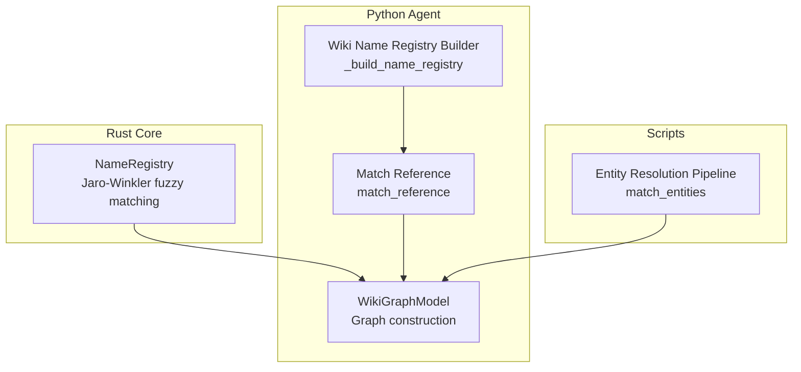
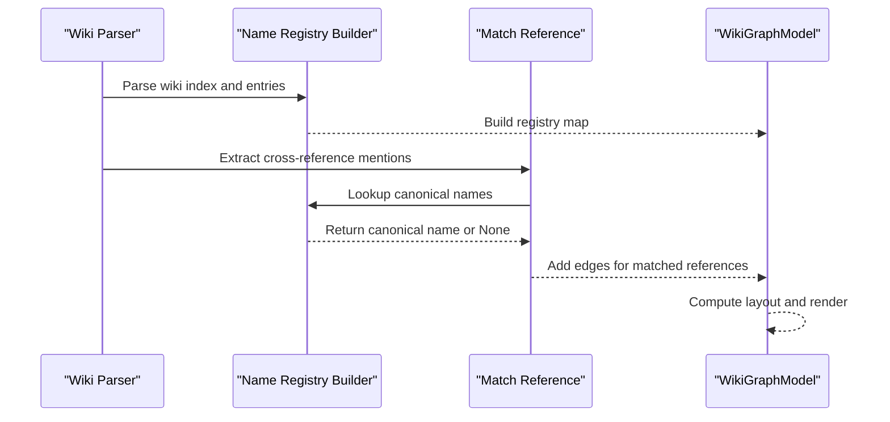
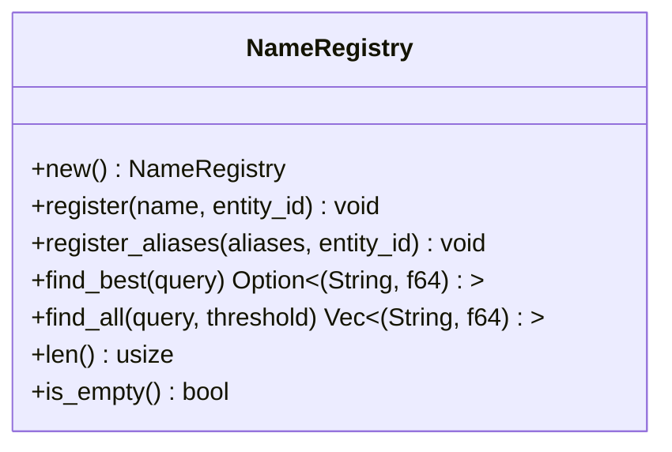
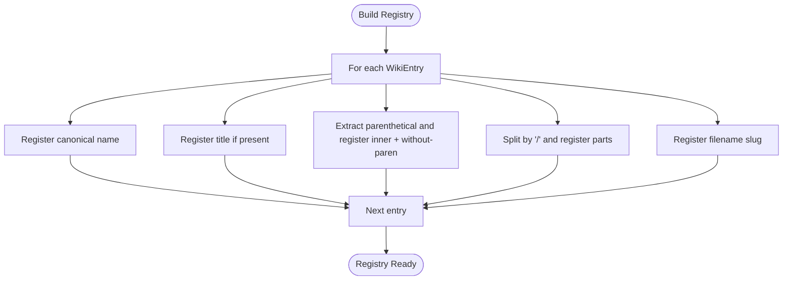
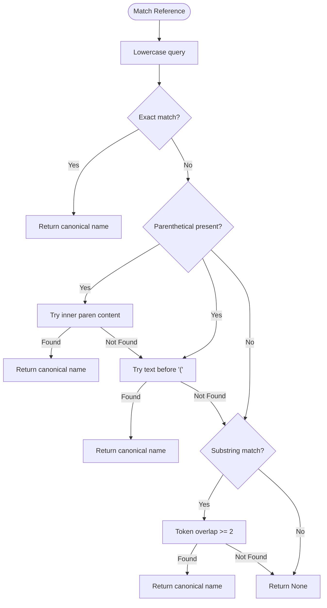
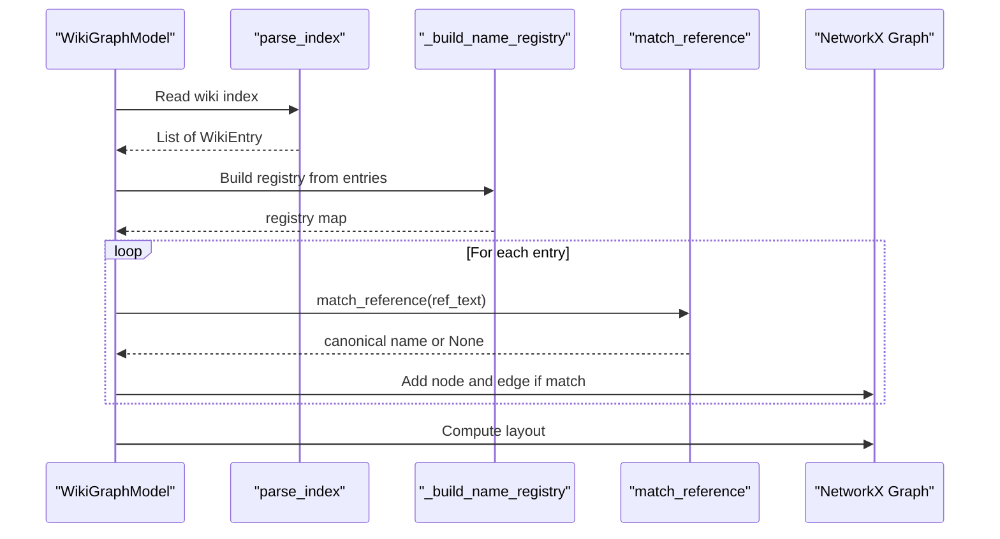
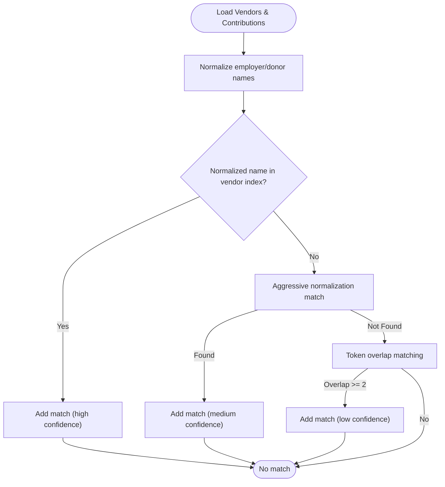
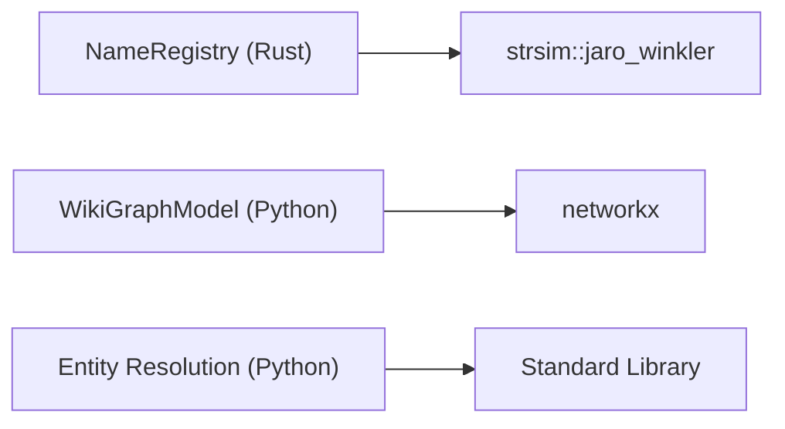

# Entity Resolution and Fuzzy Matching

<cite>
**Referenced Files in This Document**
- [matching.rs](file://openplanter-desktop/crates/op-core/src/wiki/matching.rs)
- [wiki_graph.py](file://agent/wiki_graph.py)
- [entity_resolution.py](file://scripts/entity_resolution.py)
- [prompts.py](file://agent/prompts.py)
- [test_wiki_graph.py](file://tests/test_wiki_graph.py)
</cite>

## Table of Contents
1. [Introduction](#introduction)
2. [Project Structure](#project-structure)
3. [Core Components](#core-components)
4. [Architecture Overview](#architecture-overview)
5. [Detailed Component Analysis](#detailed-component-analysis)
6. [Dependency Analysis](#dependency-analysis)
7. [Performance Considerations](#performance-considerations)
8. [Troubleshooting Guide](#troubleshooting-guide)
9. [Conclusion](#conclusion)

## Introduction
This document explains the entity resolution and fuzzy matching system used to construct name registries and enable intelligent entity linking across datasets. It covers multi-level matching strategies (exact, parenthetical variations, acronym detection, and token overlap), the name registry building process, alias registration, and matching priority systems. It also documents fuzzy matching algorithms, similarity thresholds, confidence scoring, and practical guidance for optimizing performance, handling ambiguity, and improving resolution accuracy. Finally, it describes the integration between matching and graph construction workflows.

## Project Structure
The entity resolution system spans both Rust and Python components:
- Rust-based fuzzy name registry for precise, deterministic matching with Jaro-Winkler similarity.
- Python-based multi-strategy fuzzy matcher for wiki cross-reference potential and graph construction.
- A dedicated entity resolution pipeline for cross-dataset linking (e.g., campaign finance and contracts).

**Diagram sources**
- [matching.rs:8-70](file://openplanter-desktop/crates/op-core/src/wiki/matching.rs#L8-L70)
- [wiki_graph.py:156-190](file://agent/wiki_graph.py#L156-L190)
- [wiki_graph.py:193-236](file://agent/wiki_graph.py#L193-L236)
- [wiki_graph.py:243-302](file://agent/wiki_graph.py#L243-L302)
- [entity_resolution.py:309-438](file://scripts/entity_resolution.py#L309-L438)

**Section sources**
- [matching.rs:1-161](file://openplanter-desktop/crates/op-core/src/wiki/matching.rs#L1-L161)
- [wiki_graph.py:152-302](file://agent/wiki_graph.py#L152-L302)
- [entity_resolution.py:209-438](file://scripts/entity_resolution.py#L209-L438)

## Core Components
- NameRegistry (Rust): A registry of canonical names mapped to entity IDs with fuzzy lookup using Jaro-Winkler similarity. Supports exact registration, alias registration, best-match selection, and threshold-based filtering.
- Wiki Name Registry Builder (Python): Builds a registry from wiki entries, registering full names, parenthetical aliases, slash-separated parts, and filename slugs.
- Match Reference (Python): Implements a multi-level matching strategy: exact match, parenthetical stripping, substring containment, and token overlap with generic-stopword filtering.
- WikiGraphModel (Python): Parses wiki entries, extracts cross-reference potential, builds the registry, and constructs a NetworkX graph of data sources with edges representing resolved cross-references.
- Entity Resolution Pipeline (Python): Normalizes names, builds vendor indexes, and applies multi-strategy matching across datasets with confidence scoring and red-flag analysis.

**Section sources**
- [matching.rs:8-70](file://openplanter-desktop/crates/op-core/src/wiki/matching.rs#L8-L70)
- [wiki_graph.py:156-190](file://agent/wiki_graph.py#L156-L190)
- [wiki_graph.py:193-236](file://agent/wiki_graph.py#L193-L236)
- [wiki_graph.py:243-302](file://agent/wiki_graph.py#L243-L302)
- [entity_resolution.py:209-438](file://scripts/entity_resolution.py#L209-L438)

## Architecture Overview
The system integrates three complementary workflows:
- Wiki-based entity linking: Build a name registry from wiki entries and match cross-reference mentions to canonical sources.
- Dataset-based entity resolution: Normalize and match names across datasets (e.g., campaign finance donors/employers to government contracts vendors).
- Graph construction: Use resolved matches to create a knowledge graph of data sources and their cross-references.

**Diagram sources**
- [wiki_graph.py:264-302](file://agent/wiki_graph.py#L264-L302)
- [wiki_graph.py:156-190](file://agent/wiki_graph.py#L156-L190)
- [wiki_graph.py:193-236](file://agent/wiki_graph.py#L193-L236)

## Detailed Component Analysis

### Rust NameRegistry (Fuzzy Matching)
The Rust implementation provides a deterministic, efficient fuzzy matching registry:
- Registration: Canonical names and aliases are stored as (name, entity_id) pairs.
- Matching: Lowercased query is compared to lowercased registry entries using Jaro-Winkler similarity.
- Thresholding: Results are filtered by a configurable threshold (default 0.85) and sorted by score.
- Deduplication: Multiple matches for the same entity ID are deduplicated, keeping the highest-scoring result.

**Diagram sources**
- [matching.rs:8-70](file://openplanter-desktop/crates/op-core/src/wiki/matching.rs#L8-L70)

**Section sources**
- [matching.rs:31-59](file://openplanter-desktop/crates/op-core/src/wiki/matching.rs#L31-L59)

### Python Wiki Name Registry Builder
The registry builder registers multiple variants for each wiki entry:
- Full canonical name and title.
- Parenthetical aliases and names without parentheses.
- Slash-separated parts (e.g., “A / B”).
- Filename slug derived from the entry’s relative path.

**Diagram sources**
- [wiki_graph.py:156-190](file://agent/wiki_graph.py#L156-L190)

**Section sources**
- [wiki_graph.py:156-190](file://agent/wiki_graph.py#L156-L190)

### Python Match Reference (Multi-Level Strategy)
The matching function implements a layered strategy:
1. Exact match against registry keys.
2. Parenthetical stripping: Try inner content and text before the parenthetical.
3. Substring containment: Check if the query is contained in a registry key or vice versa.
4. Token overlap: Extract tokens of length ≥ 3, remove generic stopwords, and find the best overlap with registry keys requiring at least two overlapping tokens.

**Diagram sources**
- [wiki_graph.py:193-236](file://agent/wiki_graph.py#L193-L236)

**Section sources**
- [wiki_graph.py:193-236](file://agent/wiki_graph.py#L193-L236)

### WikiGraphModel (Integration with Graph Construction)
WikiGraphModel orchestrates the end-to-end workflow:
- Parses wiki index and extracts cross-reference mentions.
- Builds the name registry and resolves references.
- Constructs a NetworkX graph with nodes for entries and edges for resolved cross-references.
- Computes a character-cell layout and supports rendering to a buffer.

**Diagram sources**
- [wiki_graph.py:243-302](file://agent/wiki_graph.py#L243-L302)
- [wiki_graph.py:156-190](file://agent/wiki_graph.py#L156-L190)
- [wiki_graph.py:193-236](file://agent/wiki_graph.py#L193-L236)

**Section sources**
- [wiki_graph.py:243-302](file://agent/wiki_graph.py#L243-L302)

### Entity Resolution Pipeline (Dataset-Level Matching)
The pipeline normalizes names and applies multi-strategy matching across datasets:
- Normalization removes suffixes (Inc, LLC, Corp, Ltd), punctuation, and collapses whitespace; aggressive normalization sorts tokens alphabetically.
- Vendor index: Build normalized-name index and token index for fuzzy matching.
- Strategies:
  - Employer exact match for individual contributions.
  - Aggressive normalization match for donors/employers.
  - Token overlap matching requiring sufficient overlap ratio and minimum token count.
- Confidence scoring: High for exact matches, medium for aggressive matches, low for token overlap.
- Red-flag analysis: Detects sole-source vendors with employee donors, bundled donations, and disproportionate donation totals.

**Diagram sources**
- [entity_resolution.py:309-438](file://scripts/entity_resolution.py#L309-L438)

**Section sources**
- [entity_resolution.py:213-244](file://scripts/entity_resolution.py#L213-L244)
- [entity_resolution.py:309-438](file://scripts/entity_resolution.py#L309-L438)

## Dependency Analysis
- Rust NameRegistry depends on the `strsim` crate for Jaro-Winkler similarity.
- Python WikiGraphModel depends on `networkx` for graph construction and rendering.
- Both systems integrate with the broader agent ecosystem and wiki-driven knowledge graph.

**Diagram sources**
- [matching.rs:5-5](file://openplanter-desktop/crates/op-core/src/wiki/matching.rs#L5-L5)
- [wiki_graph.py:17-21](file://agent/wiki_graph.py#L17-L21)
- [entity_resolution.py:7-14](file://scripts/entity_resolution.py#L7-L14)

**Section sources**
- [matching.rs:5-5](file://openplanter-desktop/crates/op-core/src/wiki/matching.rs#L5-L5)
- [wiki_graph.py:17-21](file://agent/wiki_graph.py#L17-L21)
- [entity_resolution.py:7-14](file://scripts/entity_resolution.py#L7-L14)

## Performance Considerations
- Registry size: The Rust NameRegistry stores all entries linearly. For large registries, consider:
  - Pre-filtering by category or jurisdiction where applicable.
  - Using a trie or prefix tree for initial filtering before similarity scoring.
- Similarity scoring: Jaro-Winkler is efficient but scales with the number of entries. To reduce cost:
  - Apply a pre-filter (e.g., length bounds, initial character filters).
  - Use a two-stage process: fast filter (substring or token overlap) followed by fuzzy scoring.
- Python token overlap: The token overlap strategy can be expensive for large vocabularies. Suggestions:
  - Index tokens to sets of candidate keys.
  - Limit overlap checks to keys within edit distance thresholds.
- Graph construction: For large wikis, consider incremental rebuilding and caching of the registry and cross-reference extraction.

[No sources needed since this section provides general guidance]

## Troubleshooting Guide
Common issues and resolutions:
- No matches despite apparent similarity:
  - Verify normalization steps (case, suffixes, punctuation).
  - Adjust thresholds or enable parenthetical stripping and token overlap.
- Ambiguous matches:
  - Use confidence tiers and document match type and evidence chain.
  - Prefer exact matches over fuzzy when available.
- Performance bottlenecks:
  - Profile the token overlap stage and optimize token indexing.
  - Reduce registry size by pre-filtering or partitioning by domain.
- Graph rendering anomalies:
  - Ensure cross-reference mentions use canonical names as referenced in the wiki index.
  - Validate that the registry includes all relevant aliases and parenthetical forms.

**Section sources**
- [prompts.py:108-127](file://agent/prompts.py#L108-L127)
- [wiki_graph.py:193-236](file://agent/wiki_graph.py#L193-L236)
- [entity_resolution.py:309-438](file://scripts/entity_resolution.py#L309-L438)

## Conclusion
The entity resolution system combines robust fuzzy matching (Jaro-Winkler in Rust) with a multi-strategy Python matcher to achieve high-quality entity linking across wiki and dataset sources. The name registry building process ensures comprehensive coverage of aliases, parenthetical forms, and token overlaps. By integrating these components into graph construction and dataset-level pipelines, the system enables intelligent entity linking, confidence-aware resolution, and scalable performance.