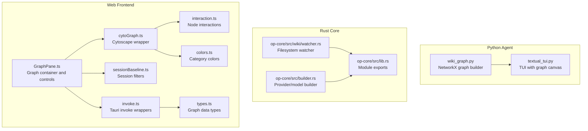
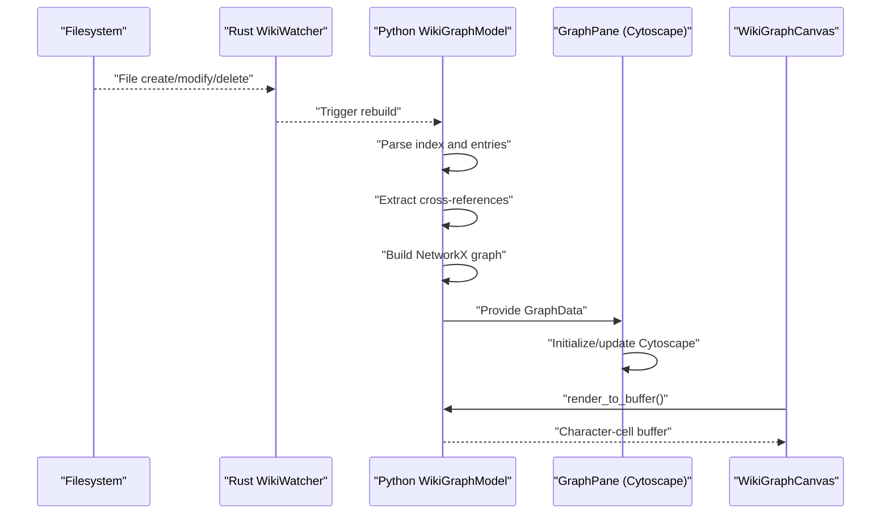
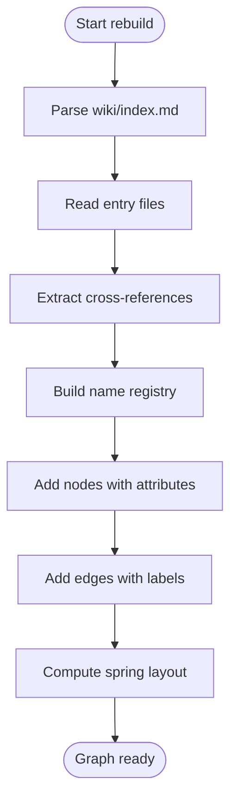
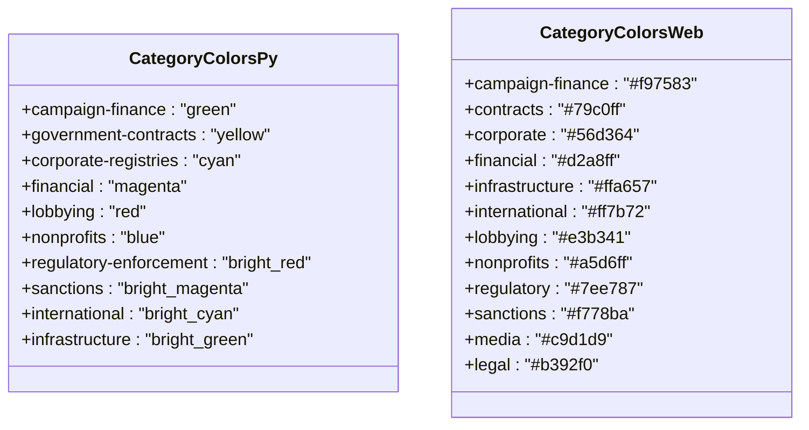
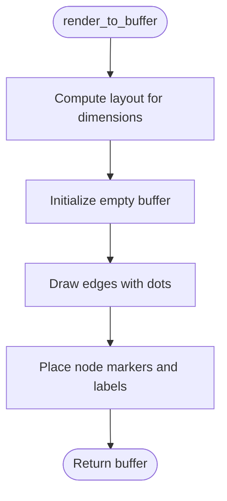
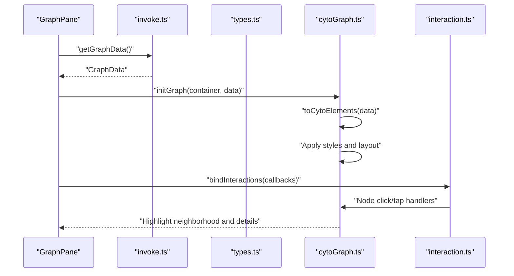
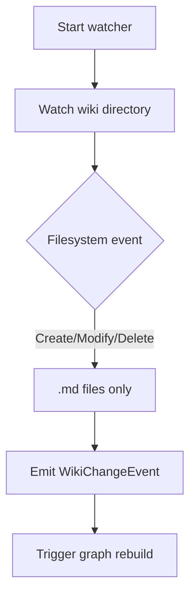
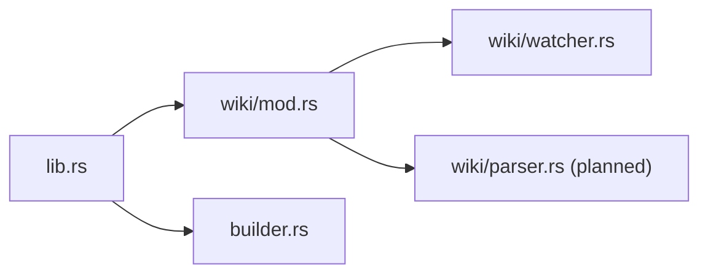
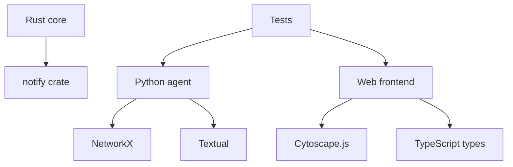

# Graph Construction and Visualization

<cite>
**Referenced Files in This Document**
- [wiki_graph.py](file://agent/wiki_graph.py)
- [textual_tui.py](file://agent/textual_tui.py)
- [cytoGraph.ts](file://openplanter-desktop/frontend/src/graph/cytoGraph.ts)
- [GraphPane.ts](file://openplanter-desktop/frontend/src/components/GraphPane.ts)
- [colors.ts](file://openplanter-desktop/frontend/src/graph/colors.ts)
- [interaction.ts](file://openplanter-desktop/frontend/src/graph/interaction.ts)
- [sessionBaseline.ts](file://openplanter-desktop/frontend/src/graph/sessionBaseline.ts)
- [types.ts](file://openplanter-desktop/frontend/src/api/types.ts)
- [invoke.ts](file://openplanter-desktop/frontend/src/api/invoke.ts)
- [watcher.rs](file://openplanter-desktop/crates/op-core/src/wiki/watcher.rs)
- [lib.rs](file://openplanter-desktop/crates/op-core/src/lib.rs)
- [builder.rs](file://openplanter-desktop/crates/op-core/src/builder.rs)
- [test_wiki_graph.py](file://tests/test_wiki_graph.py)
</cite>

## Table of Contents
1. [Introduction](#introduction)
2. [Project Structure](#project-structure)
3. [Core Components](#core-components)
4. [Architecture Overview](#architecture-overview)
5. [Detailed Component Analysis](#detailed-component-analysis)
6. [Dependency Analysis](#dependency-analysis)
7. [Performance Considerations](#performance-considerations)
8. [Troubleshooting Guide](#troubleshooting-guide)
9. [Conclusion](#conclusion)

## Introduction
This document explains the knowledge graph construction and visualization system that transforms parsed wiki entries into interactive graphs. It covers the Python-based NetworkX pipeline for graph building, category-based coloring, character-cell rendering for terminal visualization, and the Cytoscape.js-powered web visualization with real-time updates. It also documents the Rust-based filesystem watcher that enables automatic graph updates and outlines the Rust graph processing components under development.

## Project Structure
The system spans three primary areas:
- Python agent: parses wiki entries, builds NetworkX graphs, computes layouts, and renders to character cells
- Rust core: provides filesystem watching and graph processing foundations (under development)
- Web frontend: renders graphs with Cytoscape.js, supports interactive manipulation, filtering, and real-time updates

**Diagram sources**
- [wiki_graph.py:243-302](file://agent/wiki_graph.py#L243-L302)
- [textual_tui.py:279-327](file://agent/textual_tui.py#L279-L327)
- [watcher.rs:26-81](file://openplanter-desktop/crates/op-core/src/wiki/watcher.rs#L26-L81)
- [lib.rs:1-15](file://openplanter-desktop/crates/op-core/src/lib.rs#L1-L15)
- [builder.rs:1-730](file://openplanter-desktop/crates/op-core/src/builder.rs#L1-L730)
- [GraphPane.ts:47-576](file://openplanter-desktop/frontend/src/components/GraphPane.ts#L47-L576)
- [cytoGraph.ts:1-748](file://openplanter-desktop/frontend/src/graph/cytoGraph.ts#L1-L748)
- [interaction.ts:1-111](file://openplanter-desktop/frontend/src/graph/interaction.ts#L1-L111)
- [colors.ts:1-20](file://openplanter-desktop/frontend/src/graph/colors.ts#L1-L20)
- [sessionBaseline.ts:1-169](file://openplanter-desktop/frontend/src/graph/sessionBaseline.ts#L1-L169)
- [invoke.ts:1-131](file://openplanter-desktop/frontend/src/api/invoke.ts#L1-L131)
- [types.ts:89-108](file://openplanter-desktop/frontend/src/api/types.ts#L89-L108)

**Section sources**
- [wiki_graph.py:1-495](file://agent/wiki_graph.py#L1-L495)
- [textual_tui.py:1-789](file://agent/textual_tui.py#L1-L789)
- [watcher.rs:1-146](file://openplanter-desktop/crates/op-core/src/wiki/watcher.rs#L1-L146)
- [lib.rs:1-15](file://openplanter-desktop/crates/op-core/src/lib.rs#L1-L15)
- [builder.rs:1-730](file://openplanter-desktop/crates/op-core/src/builder.rs#L1-L730)
- [GraphPane.ts:1-586](file://openplanter-desktop/frontend/src/components/GraphPane.ts#L1-L586)
- [cytoGraph.ts:1-748](file://openplanter-desktop/frontend/src/graph/cytoGraph.ts#L1-L748)
- [interaction.ts:1-111](file://openplanter-desktop/frontend/src/graph/interaction.ts#L1-L111)
- [colors.ts:1-20](file://openplanter-desktop/frontend/src/graph/colors.ts#L1-L20)
- [sessionBaseline.ts:1-169](file://openplanter-desktop/frontend/src/graph/sessionBaseline.ts#L1-L169)
- [invoke.ts:1-131](file://openplanter-desktop/frontend/src/api/invoke.ts#L1-L131)
- [types.ts:1-499](file://openplanter-desktop/frontend/src/api/types.ts#L1-L499)

## Core Components
- NetworkX graph builder: parses wiki index and entries, extracts cross-references, builds nodes and edges, assigns attributes, and computes layouts
- Character-cell renderer: converts NetworkX graphs to terminal-friendly buffers using Bresenham's line algorithm for edges and short labels for nodes
- Cytoscape.js graph: converts typed graph data to Cytoscape elements, applies styles, and manages layouts and filters
- Filesystem watcher: monitors wiki directory changes and triggers graph rebuilds
- Session-based filtering: tracks baseline node sets and highlights newly added nodes

**Section sources**
- [wiki_graph.py:243-436](file://agent/wiki_graph.py#L243-L436)
- [textual_tui.py:279-335](file://agent/textual_tui.py#L279-L335)
- [cytoGraph.ts:224-380](file://openplanter-desktop/frontend/src/graph/cytoGraph.ts#L224-L380)
- [watcher.rs:26-81](file://openplanter-desktop/crates/op-core/src/wiki/watcher.rs#L26-L81)
- [sessionBaseline.ts:87-118](file://openplanter-desktop/frontend/src/graph/sessionBaseline.ts#L87-L118)

## Architecture Overview
The system integrates Python and Rust for graph processing, with a web frontend for visualization and a TUI for terminal rendering. Real-time updates propagate from filesystem changes to graph rebuilds and UI refreshes.

**Diagram sources**
- [watcher.rs:35-75](file://openplanter-desktop/crates/op-core/src/wiki/watcher.rs#L35-L75)
- [wiki_graph.py:264-302](file://agent/wiki_graph.py#L264-L302)
- [GraphPane.ts:518-541](file://openplanter-desktop/frontend/src/components/GraphPane.ts#L518-L541)
- [textual_tui.py:694-704](file://agent/textual_tui.py#L694-L704)

## Detailed Component Analysis

### NetworkX Graph Building Pipeline
The Python agent constructs a NetworkX graph from wiki entries:
- Parses the wiki index to discover categories and entry metadata
- Reads each entry file to extract titles and cross-reference mentions
- Builds a name registry for fuzzy matching and resolves cross-references
- Creates nodes with attributes (category, color, title, path) and edges with labels
- Computes a spring layout scaled to character-cell dimensions

**Diagram sources**
- [wiki_graph.py:264-302](file://agent/wiki_graph.py#L264-L302)
- [wiki_graph.py:280-299](file://agent/wiki_graph.py#L280-L299)

**Section sources**
- [wiki_graph.py:72-149](file://agent/wiki_graph.py#L72-L149)
- [wiki_graph.py:156-236](file://agent/wiki_graph.py#L156-L236)
- [wiki_graph.py:264-302](file://agent/wiki_graph.py#L264-L302)

### Category-Based Coloring System
- Python TUI uses a category-to-color mapping for ANSI colors
- Web frontend uses a separate category-to-color mapping for Cytoscape styling
- Both systems ensure consistent visual grouping by category across platforms

**Diagram sources**
- [wiki_graph.py:27-40](file://agent/wiki_graph.py#L27-L40)
- [colors.ts:2-15](file://openplanter-desktop/frontend/src/graph/colors.ts#L2-L15)

**Section sources**
- [wiki_graph.py:27-40](file://agent/wiki_graph.py#L27-L40)
- [colors.ts:1-20](file://openplanter-desktop/frontend/src/graph/colors.ts#L1-L20)

### Character-Cell Rendering for Terminal
The TUI renders the NetworkX graph to a character-cell buffer:
- Uses Bresenham's line algorithm to draw edges
- Places node markers and short labels centered on positions
- Applies per-node colors for visual distinction

**Diagram sources**
- [wiki_graph.py:348-406](file://agent/wiki_graph.py#L348-L406)
- [wiki_graph.py:409-435](file://agent/wiki_graph.py#L409-L435)
- [textual_tui.py:308-326](file://agent/textual_tui.py#L308-L326)

**Section sources**
- [wiki_graph.py:348-435](file://agent/wiki_graph.py#L348-L435)
- [textual_tui.py:279-335](file://agent/textual_tui.py#L279-L335)

### Cytoscape.js Integration and Interactive Manipulation
The web frontend initializes and updates a Cytoscape.js graph:
- Converts typed GraphData to Cytoscape elements with tier-based sizing
- Applies stylesheets with category-based colors and edge types
- Supports multiple layouts (force-directed, hierarchical, grouped, circular)
- Provides interactive filters (categories, tiers, search, session)

**Diagram sources**
- [GraphPane.ts:504-516](file://openplanter-desktop/frontend/src/components/GraphPane.ts#L504-L516)
- [invoke.ts:92-94](file://openplanter-desktop/frontend/src/api/invoke.ts#L92-L94)
- [types.ts:105-108](file://openplanter-desktop/frontend/src/api/types.ts#L105-L108)
- [cytoGraph.ts:224-268](file://openplanter-desktop/frontend/src/graph/cytoGraph.ts#L224-L268)
- [interaction.ts:25-111](file://openplanter-desktop/frontend/src/graph/interaction.ts#L25-L111)

**Section sources**
- [GraphPane.ts:47-576](file://openplanter-desktop/frontend/src/components/GraphPane.ts#L47-L576)
- [cytoGraph.ts:1-748](file://openplanter-desktop/frontend/src/graph/cytoGraph.ts#L1-L748)
- [interaction.ts:1-111](file://openplanter-desktop/frontend/src/graph/interaction.ts#L1-L111)
- [types.ts:89-108](file://openplanter-desktop/frontend/src/api/types.ts#L89-L108)

### Filesystem Watcher for Automatic Updates
The Rust watcher monitors wiki directory changes and emits events:
- Watches recursively for .md files
- Filters events to create/modify/delete kinds
- Integrates with the Python TUI and web frontend to trigger rebuilds

**Diagram sources**
- [watcher.rs:35-75](file://openplanter-desktop/crates/op-core/src/wiki/watcher.rs#L35-L75)
- [textual_tui.py:465-469](file://agent/textual_tui.py#L465-L469)
- [GraphPane.ts:518-541](file://openplanter-desktop/frontend/src/components/GraphPane.ts#L518-L541)

**Section sources**
- [watcher.rs:1-146](file://openplanter-desktop/crates/op-core/src/wiki/watcher.rs#L1-L146)
- [textual_tui.py:458-477](file://agent/textual_tui.py#L458-L477)
- [GraphPane.ts:518-541](file://openplanter-desktop/frontend/src/components/GraphPane.ts#L518-L541)

### Rust Implementation of Graph Processing Components
The Rust core module exports graph-related functionality and includes a filesystem watcher:
- Module exports: builder, config, credentials, engine, events, model, prompts, retrieval, session, settings, tools, wiki, workspace_init
- Wiki watcher: notifies on create/modify/delete events for .md files
- Builder: handles provider inference and model resolution (complementary to graph processing)

**Diagram sources**
- [lib.rs:1-15](file://openplanter-desktop/crates/op-core/src/lib.rs#L1-L15)
- [watcher.rs:26-81](file://openplanter-desktop/crates/op-core/src/wiki/watcher.rs#L26-L81)
- [builder.rs:1-730](file://openplanter-desktop/crates/op-core/src/builder.rs#L1-L730)

**Section sources**
- [lib.rs:1-15](file://openplanter-desktop/crates/op-core/src/lib.rs#L1-L15)
- [watcher.rs:1-146](file://openplanter-desktop/crates/op-core/src/wiki/watcher.rs#L1-L146)
- [builder.rs:1-730](file://openplanter-desktop/crates/op-core/src/builder.rs#L1-L730)

## Dependency Analysis
The system exhibits clear separation of concerns:
- Python agent depends on NetworkX for graph operations and Textual for terminal UI
- Rust core provides filesystem watching and serves as a foundation for graph processing
- Web frontend depends on Cytoscape.js and TypeScript types for visualization and interactivity
- Tests validate graph construction, layout computation, and character-cell rendering

**Diagram sources**
- [wiki_graph.py:17-20](file://agent/wiki_graph.py#L17-L20)
- [textual_tui.py:16-23](file://agent/textual_tui.py#L16-L23)
- [watcher.rs:6-7](file://openplanter-desktop/crates/op-core/src/wiki/watcher.rs#L6-L7)
- [cytoGraph.ts:2-6](file://openplanter-desktop/frontend/src/graph/cytoGraph.ts#L2-L6)
- [types.ts:89-108](file://openplanter-desktop/frontend/src/api/types.ts#L89-L108)
- [test_wiki_graph.py:204-239](file://tests/test_wiki_graph.py#L204-L239)

**Section sources**
- [test_wiki_graph.py:204-239](file://tests/test_wiki_graph.py#L204-L239)

## Performance Considerations
- Layout computation: Spring layout scaling is efficient for moderate graph sizes; consider layout caching or incremental updates for large graphs
- Edge drawing: Bresenham's algorithm minimizes rendering overhead; ensure buffer initialization avoids unnecessary allocations
- Web rendering: Cytoscape.js performance benefits from tier-based sizing and selective edge coloring; disable animations for large datasets if needed
- Filtering: Category and tier filters operate on DOM/class toggles; keep filter sets minimal to reduce redraw costs
- Filesystem watching: Polling-based watchers are simpler; consider platform-specific event-driven watchers for responsiveness

## Troubleshooting Guide
Common issues and resolutions:
- Missing NetworkX: The Python agent gracefully handles missing imports by returning early from rebuild
- Render errors: The TUI catches exceptions during rendering and displays an error message
- No wiki data: The TUI shows a placeholder message when no entries are found
- Web graph loading failures: The GraphPane falls back to placeholders and logs errors
- Session baseline not captured: Baseline capture is best-effort; ensure graph loads before applying filters

**Section sources**
- [wiki_graph.py:266-267](file://agent/wiki_graph.py#L266-L267)
- [textual_tui.py:315-318](file://agent/textual_tui.py#L315-L318)
- [textual_tui.py:365-372](file://agent/textual_tui.py#L365-L372)
- [GraphPane.ts:509-515](file://openplanter-desktop/frontend/src/components/GraphPane.ts#L509-L515)
- [GraphPane.ts:160-164](file://openplanter-desktop/frontend/src/components/GraphPane.ts#L160-L164)

## Conclusion
The knowledge graph system combines Python-based NetworkX graph construction, Rust-based filesystem watching, and Cytoscape.js visualization to deliver a robust, interactive graph experience across terminal and web environments. The category-based coloring, layout algorithms, and filtering mechanisms enable effective exploration of interconnected wiki data. The modular architecture supports future enhancements, including advanced graph processing in Rust and improved real-time synchronization.