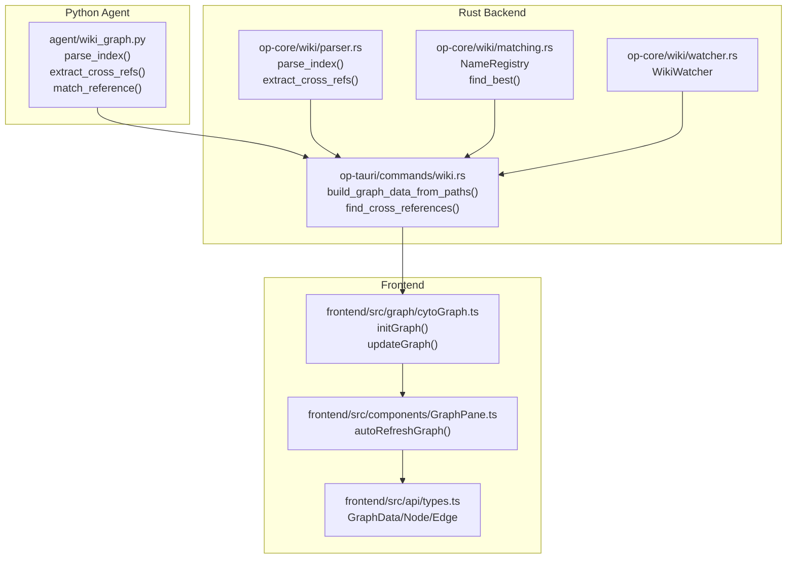
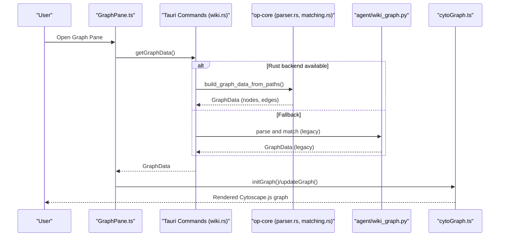
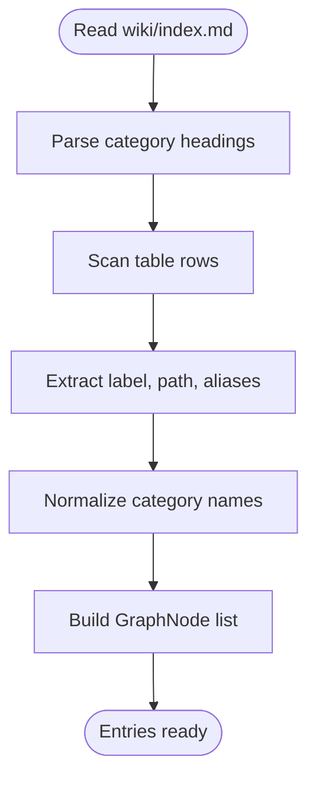
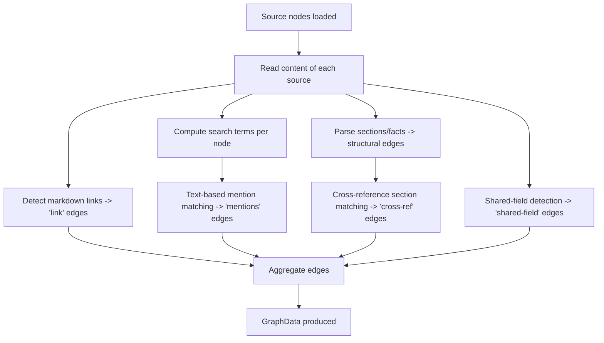
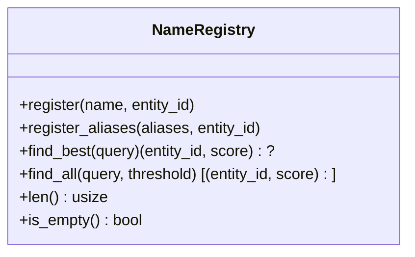
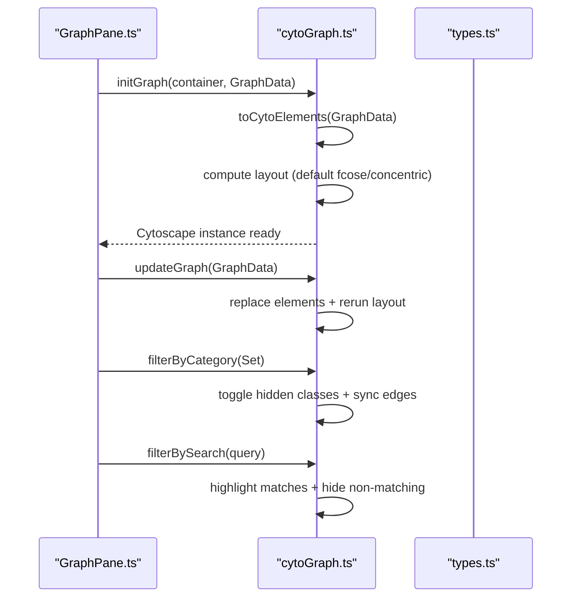
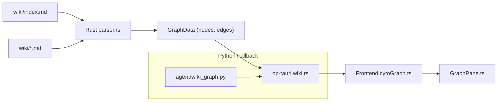

# Knowledge Graph System

<cite>
**Referenced Files in This Document**
- [wiki_graph.py](file://agent/wiki_graph.py)
- [parser.rs](file://openplanter-desktop/crates/op-core/src/wiki/parser.rs)
- [matching.rs](file://openplanter-desktop/crates/op-core/src/wiki/matching.rs)
- [watcher.rs](file://openplanter-desktop/crates/op-core/src/wiki/watcher.rs)
- [wiki.rs](file://openplanter-desktop/crates/op-tauri/src/commands/wiki.rs)
- [cytoGraph.ts](file://openplanter-desktop/frontend/src/graph/cytoGraph.ts)
- [GraphPane.ts](file://openplanter-desktop/frontend/src/components/GraphPane.ts)
- [types.ts](file://openplanter-desktop/frontend/src/api/types.ts)
- [template.md](file://wiki/template.md)
- [index.md](file://wiki/index.md)
- [entity_resolution.py](file://scripts/entity_resolution.py)
- [test_wiki_graph.py](file://tests/test_wiki_graph.py)
</cite>

## Table of Contents
1. [Introduction](#introduction)
2. [Project Structure](#project-structure)
3. [Core Components](#core-components)
4. [Architecture Overview](#architecture-overview)
5. [Detailed Component Analysis](#detailed-component-analysis)
6. [Dependency Analysis](#dependency-analysis)
7. [Performance Considerations](#performance-considerations)
8. [Troubleshooting Guide](#troubleshooting-guide)
9. [Conclusion](#conclusion)
10. [Appendices](#appendices)

## Introduction
This document explains the knowledge graph system for wiki-based entity relationship discovery in the OpenPlanter project. It covers how cross-references are extracted from wiki entries, how entity resolution and fuzzy matching work, and how the resulting graph is visualized using Cytoscape.js. It also documents the standardized wiki format, source documentation structure, and provides practical guidance for contributors and analysts working with the graph. Finally, it outlines the Rust implementation of graph processing and its integration with the Python agent, along with troubleshooting and optimization advice for large-scale investigations.

## Project Structure
The knowledge graph system spans three layers:
- Python agent layer: parses wiki entries, extracts cross-references, resolves entities, and renders a character-cell graph for the TUI.
- Rust backend layer: robustly parses wiki index and pages, detects cross-references, builds a typed graph, and exposes it to the frontend.
- Frontend layer: renders the graph with Cytoscape.js, supports filtering, layout switching, and interactive exploration.

**Diagram sources**
- [wiki_graph.py:72-149](file://agent/wiki_graph.py#L72-L149)
- [parser.rs:29-114](file://openplanter-desktop/crates/op-core/src/wiki/parser.rs#L29-L114)
- [matching.rs:8-70](file://openplanter-desktop/crates/op-core/src/wiki/matching.rs#L8-L70)
- [watcher.rs:26-81](file://openplanter-desktop/crates/op-core/src/wiki/watcher.rs#L26-L81)
- [wiki.rs:705-745](file://openplanter-desktop/crates/op-tauri/src/commands/wiki.rs#L705-L745)
- [cytoGraph.ts:336-368](file://openplanter-desktop/frontend/src/graph/cytoGraph.ts#L336-L368)
- [GraphPane.ts:220-246](file://openplanter-desktop/frontend/src/components/GraphPane.ts#L220-L246)
- [types.ts:89-108](file://openplanter-desktop/frontend/src/api/types.ts#L89-L108)

**Section sources**
- [wiki_graph.py:1-495](file://agent/wiki_graph.py#L1-L495)
- [parser.rs:1-188](file://openplanter-desktop/crates/op-core/src/wiki/parser.rs#L1-L188)
- [matching.rs:1-161](file://openplanter-desktop/crates/op-core/src/wiki/matching.rs#L1-L161)
- [watcher.rs:1-146](file://openplanter-desktop/crates/op-core/src/wiki/watcher.rs#L1-L146)
- [wiki.rs:1-1200](file://openplanter-desktop/crates/op-tauri/src/commands/wiki.rs#L1-L1200)
- [cytoGraph.ts:1-748](file://openplanter-desktop/frontend/src/graph/cytoGraph.ts#L1-L748)
- [GraphPane.ts:1-586](file://openplanter-desktop/frontend/src/components/GraphPane.ts#L1-L586)
- [types.ts:1-499](file://openplanter-desktop/frontend/src/api/types.ts#L1-L499)

## Core Components
- Wiki index parsing and entry extraction: Python and Rust parsers convert the standardized wiki index into structured entries with category, path, and aliases.
- Cross-reference extraction: Both Python and Rust extract explicit links and implicit mentions to discover relationships between sources.
- Entity resolution and fuzzy matching: Python’s registry-based matching and Rust’s Jaro-Winkler scoring enable robust entity linking.
- Graph construction: Rust composes nodes (sources, sections, facts) and edges (structural, cross-ref, shared-field) into a typed GraphData.
- Visualization: Cytoscape.js renders the graph with interactive layouts, filtering, and highlighting.

**Section sources**
- [wiki_graph.py:72-149](file://agent/wiki_graph.py#L72-L149)
- [parser.rs:29-114](file://openplanter-desktop/crates/op-core/src/wiki/parser.rs#L29-L114)
- [matching.rs:8-70](file://openplanter-desktop/crates/op-core/src/wiki/matching.rs#L8-L70)
- [wiki.rs:705-745](file://openplanter-desktop/crates/op-tauri/src/commands/wiki.rs#L705-L745)
- [cytoGraph.ts:224-368](file://openplanter-desktop/frontend/src/graph/cytoGraph.ts#L224-L368)

## Architecture Overview
The system integrates Python and Rust for robustness and performance. The Python agent handles legacy graph rendering and simple matching, while the Rust backend performs advanced parsing, cross-reference discovery, and graph composition. The frontend consumes a typed GraphData to power interactive exploration.

**Diagram sources**
- [GraphPane.ts:220-246](file://openplanter-desktop/frontend/src/components/GraphPane.ts#L220-L246)
- [wiki.rs:705-745](file://openplanter-desktop/crates/op-tauri/src/commands/wiki.rs#L705-L745)
- [parser.rs:29-114](file://openplanter-desktop/crates/op-core/src/wiki/parser.rs#L29-L114)
- [matching.rs:8-70](file://openplanter-desktop/crates/op-core/src/wiki/matching.rs#L8-L70)
- [wiki_graph.py:264-302](file://agent/wiki_graph.py#L264-L302)
- [cytoGraph.ts:336-368](file://openplanter-desktop/frontend/src/graph/cytoGraph.ts#L336-L368)

## Detailed Component Analysis

### Wiki Index Parsing and Standardized Format
- The Python parser reads wiki/index.md, extracts category headings and table rows, and produces a list of entries with title, path, and category.
- The Rust parser mirrors this behavior, normalizing categories and building a typed GraphNode list for source nodes.
- The standardized template defines required sections for each source: Summary, Access Methods, Data Schema, Coverage, Cross-Reference Potential, Data Quality, Acquisition Script, Legal & Licensing, and References.

**Diagram sources**
- [parser.rs:29-86](file://openplanter-desktop/crates/op-core/src/wiki/parser.rs#L29-L86)
- [wiki.rs:79-126](file://openplanter-desktop/crates/op-tauri/src/commands/wiki.rs#L79-L126)
- [template.md:1-41](file://wiki/template.md#L1-L41)

**Section sources**
- [parser.rs:29-86](file://openplanter-desktop/crates/op-core/src/wiki/parser.rs#L29-L86)
- [wiki.rs:79-126](file://openplanter-desktop/crates/op-tauri/src/commands/wiki.rs#L79-L126)
- [template.md:1-41](file://wiki/template.md#L1-L41)
- [index.md:1-75](file://wiki/index.md#L1-L75)

### Cross-Reference Extraction and Relationship Discovery
- Python: Scans the “Cross-Reference Potential” section for bold references and filters out generic labels. Builds edges between entries when matches are found.
- Rust: Detects markdown links between wiki files and adds “link” edges. Performs text-based mention matching using computed search terms to add “mentions” edges. Adds structural edges (“has-section”, “contains”) and specialized edges (“cross-ref”, “shared-field”) based on section contexts.

**Diagram sources**
- [wiki.rs:193-265](file://openplanter-desktop/crates/op-tauri/src/commands/wiki.rs#L193-L265)
- [wiki.rs:309-575](file://openplanter-desktop/crates/op-tauri/src/commands/wiki.rs#L309-L575)
- [wiki.rs:578-633](file://openplanter-desktop/crates/op-tauri/src/commands/wiki.rs#L578-L633)
- [wiki.rs:637-697](file://openplanter-desktop/crates/op-tauri/src/commands/wiki.rs#L637-L697)

**Section sources**
- [wiki_graph.py:105-149](file://agent/wiki_graph.py#L105-L149)
- [wiki.rs:193-265](file://openplanter-desktop/crates/op-tauri/src/commands/wiki.rs#L193-L265)
- [wiki.rs:309-575](file://openplanter-desktop/crates/op-tauri/src/commands/wiki.rs#L309-L575)
- [wiki.rs:578-633](file://openplanter-desktop/crates/op-tauri/src/commands/wiki.rs#L578-L633)
- [wiki.rs:637-697](file://openplanter-desktop/crates/op-tauri/src/commands/wiki.rs#L637-L697)

### Entity Resolution and Fuzzy Matching
- Python: Builds a name registry from canonical names, parentheticals, slash-separated parts, and slugs. Implements multi-stage matching: exact, parenthetical stripping, substring containment, and token overlap with Jaro-Winkler thresholds.
- Rust: Provides a NameRegistry with Jaro-Winkler similarity and deduplication by entity ID. Used for text-based mention matching in cross-reference discovery.

**Diagram sources**
- [matching.rs:8-70](file://openplanter-desktop/crates/op-core/src/wiki/matching.rs#L8-L70)

**Section sources**
- [wiki_graph.py:156-236](file://agent/wiki_graph.py#L156-L236)
- [matching.rs:8-70](file://openplanter-desktop/crates/op-core/src/wiki/matching.rs#L8-L70)

### Knowledge Graph Visualization with Cytoscape.js
- The frontend converts GraphData into Cytoscape elements, applies tier-based sizing, and supports multiple layouts (fcose, concentric, dagre, circle).
- Interactive features include category filtering, tier filtering, search highlighting, session-based visibility deltas, and node detail overlays.

**Diagram sources**
- [cytoGraph.ts:224-368](file://openplanter-desktop/frontend/src/graph/cytoGraph.ts#L224-L368)
- [GraphPane.ts:220-246](file://openplanter-desktop/frontend/src/components/GraphPane.ts#L220-L246)
- [types.ts:89-108](file://openplanter-desktop/frontend/src/api/types.ts#L89-L108)

**Section sources**
- [cytoGraph.ts:1-748](file://openplanter-desktop/frontend/src/graph/cytoGraph.ts#L1-L748)
- [GraphPane.ts:1-586](file://openplanter-desktop/frontend/src/components/GraphPane.ts#L1-L586)
- [types.ts:1-499](file://openplanter-desktop/frontend/src/api/types.ts#L1-L499)

### Practical Guidance: Wiki Contribution and Template Usage
- Use the standardized template to document each source: include Summary, Access Methods, Data Schema, Coverage, Cross-Reference Potential, Data Quality, Acquisition Script, Legal & Licensing, and References.
- Link new sources from wiki/index.md using the table format with Category headings and markdown links.
- Keep Cross-Reference Potential concise and precise to improve automated matching.

**Section sources**
- [template.md:1-41](file://wiki/template.md#L1-L41)
- [index.md:1-75](file://wiki/index.md#L1-L75)

### Practical Guidance: Graph Interpretation
- Nodes represent sources, sections, and facts. Edges indicate relationships: structural (“has-section”, “contains”), explicit cross-references (“link”), mentions (“mentions”), cross-reference suggestions (“cross-ref”), and shared fields (“shared-field”).
- Use category filtering to focus on domains (e.g., campaign-finance, contracts). Use tier filtering to hide facts and focus on sources/sections.
- Use search to highlight nodes by label, category, or content. Use session filtering to highlight newly added nodes in the current session.

**Section sources**
- [wiki.rs:578-633](file://openplanter-desktop/crates/op-tauri/src/commands/wiki.rs#L578-L633)
- [cytoGraph.ts:447-583](file://openplanter-desktop/frontend/src/graph/cytoGraph.ts#L447-L583)

### Example Workflows
- Relationship discovery workflow:
  - Contributor writes a new source using the template and links it in index.md.
  - Rust backend parses index and pages, detects cross-references, and constructs GraphData.
  - Frontend renders the graph; analysts explore relationships and refine queries.
- Entity categorization workflow:
  - Analysts review nodes’ categories and adjust filters to isolate relevant domains.
  - Structural edges reveal hierarchical organization (sources → sections → facts).
- Entity resolution workflow:
  - Text-based mention matching connects nodes across sources using normalized terms.
  - Optional Python-based fuzzy matching can resolve ambiguous mentions.

**Section sources**
- [wiki.rs:193-265](file://openplanter-desktop/crates/op-tauri/src/commands/wiki.rs#L193-L265)
- [wiki.rs:309-575](file://openplanter-desktop/crates/op-tauri/src/commands/wiki.rs#L309-L575)
- [cytoGraph.ts:447-583](file://openplanter-desktop/frontend/src/graph/cytoGraph.ts#L447-L583)

## Dependency Analysis
The Rust backend depends on the wiki directory structure and uses regex-based parsing to extract links and mentions. The frontend depends on a strongly-typed GraphData interface. The Python agent remains compatible as a fallback.

**Diagram sources**
- [parser.rs:29-114](file://openplanter-desktop/crates/op-core/src/wiki/parser.rs#L29-L114)
- [wiki.rs:705-745](file://openplanter-desktop/crates/op-tauri/src/commands/wiki.rs#L705-L745)
- [cytoGraph.ts:336-368](file://openplanter-desktop/frontend/src/graph/cytoGraph.ts#L336-L368)
- [GraphPane.ts:220-246](file://openplanter-desktop/frontend/src/components/GraphPane.ts#L220-L246)
- [wiki_graph.py:264-302](file://agent/wiki_graph.py#L264-L302)

**Section sources**
- [parser.rs:1-188](file://openplanter-desktop/crates/op-core/src/wiki/parser.rs#L1-L188)
- [wiki.rs:1-1200](file://openplanter-desktop/crates/op-tauri/src/commands/wiki.rs#L1-L1200)
- [cytoGraph.ts:1-748](file://openplanter-desktop/frontend/src/graph/cytoGraph.ts#L1-L748)
- [GraphPane.ts:1-586](file://openplanter-desktop/frontend/src/components/GraphPane.ts#L1-L586)
- [wiki_graph.py:1-495](file://agent/wiki_graph.py#L1-L495)

## Performance Considerations
- Prefer Rust-based parsing for large wikis: it reads all file contents upfront and computes search terms once, minimizing repeated IO and regex work.
- Use layout selection wisely: for graphs with no edges, “concentric” avoids meaningless force-directed layouts; otherwise “fcose” provides good separation.
- Filtering reduces computation: category and tier filters hide nodes/edges, improving interactivity.
- Token overlap and Jaro-Winkler thresholds should be tuned to balance recall vs. precision in entity resolution.

[No sources needed since this section provides general guidance]

## Troubleshooting Guide
Common issues and resolutions:
- No nodes/edges in the graph:
  - Verify wiki/index.md exists and is readable.
  - Ensure sources are linked properly in index.md and reside under the expected wiki directory.
- Cross-references not detected:
  - Confirm “Cross-Reference Potential” section exists and contains bold references in the expected format.
  - For Rust backend, ensure markdown links point to existing wiki files and that mention terms are distinctive enough.
- Fuzzy matches not aligning:
  - Adjust thresholds or refine entity aliases in the registry.
  - Normalize names consistently across sources to improve matching.
- Frontend not updating:
  - Trigger refresh or check for auto-refresh on agent-step and curator-done events.
  - Confirm GraphData is being returned and not empty.

**Section sources**
- [test_wiki_graph.py:204-254](file://tests/test_wiki_graph.py#L204-L254)
- [GraphPane.ts:518-541](file://openplanter-desktop/frontend/src/components/GraphPane.ts#L518-L541)
- [wiki.rs:737-745](file://openplanter-desktop/crates/op-tauri/src/commands/wiki.rs#L737-L745)

## Conclusion
The knowledge graph system combines a standardized wiki format, robust parsing and cross-reference discovery, and an interactive visualization layer. The Rust backend ensures scalability and correctness, while the frontend enables analysts to explore relationships efficiently. Contributors should adhere to the template and index format to maximize automation and graph quality.

[No sources needed since this section summarizes without analyzing specific files]

## Appendices

### Appendix A: Example Graph Construction Steps
- Add a new source using the template and link it from index.md.
- Run the Rust pipeline to parse index and pages, detect cross-references, and produce GraphData.
- Visualize in the frontend and refine filters/search to explore relationships.

**Section sources**
- [template.md:1-41](file://wiki/template.md#L1-L41)
- [index.md:1-75](file://wiki/index.md#L1-L75)
- [wiki.rs:705-745](file://openplanter-desktop/crates/op-tauri/src/commands/wiki.rs#L705-L745)
- [cytoGraph.ts:336-368](file://openplanter-desktop/frontend/src/graph/cytoGraph.ts#L336-L368)

### Appendix B: Entity Resolution Script Reference
- The entity resolution script demonstrates normalization, vendor indexing, and fuzzy matching strategies for linking donors and vendors across datasets. These techniques inform the design of fuzzy matching in the knowledge graph.

**Section sources**
- [entity_resolution.py:213-438](file://scripts/entity_resolution.py#L213-L438)