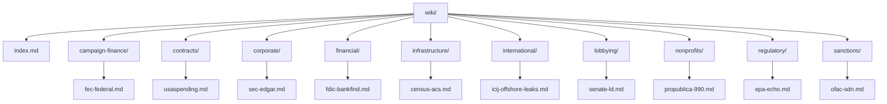
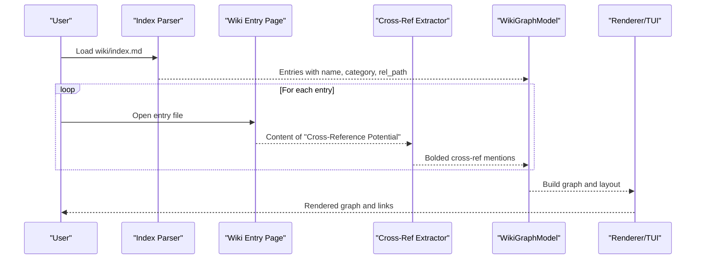
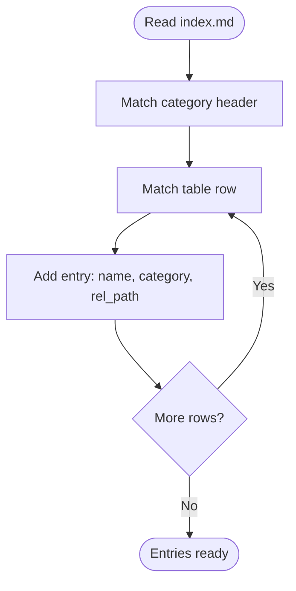
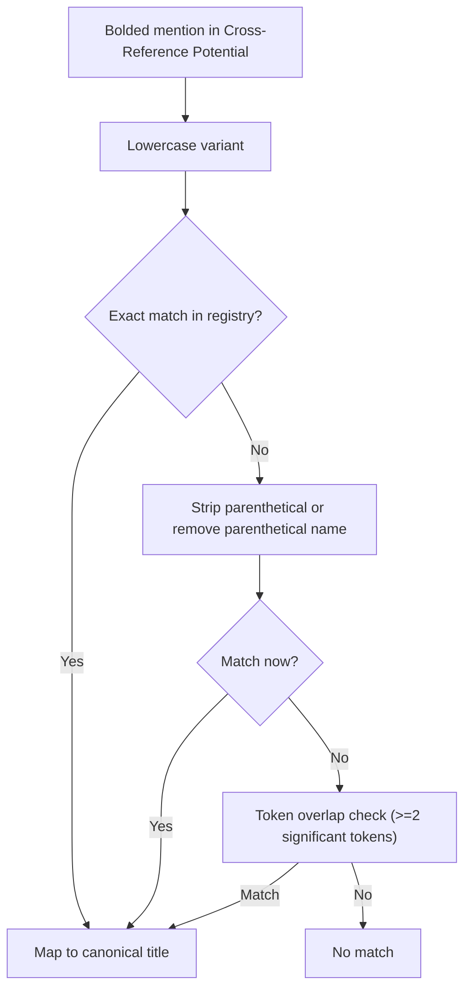
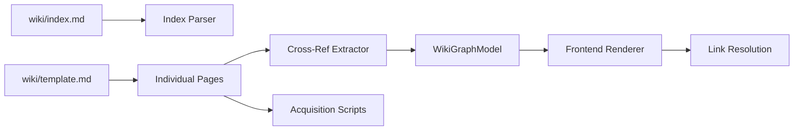

# Wiki Documentation System

<cite>
**Referenced Files in This Document**
- [wiki/index.md](file://wiki/index.md)
- [wiki/template.md](file://wiki/template.md)
- [wiki/campaign-finance/fec-federal.md](file://wiki/campaign-finance/fec-federal.md)
- [wiki/contracts/usaspending.md](file://wiki/contracts/usaspending.md)
- [wiki/regulatory/epa-echo.md](file://wiki/regulatory/epa-echo.md)
- [wiki/corporate/sec-edgar.md](file://wiki/corporate/sec-edgar.md)
- [wiki/sanctions/ofac-sdn.md](file://wiki/sanctions/ofac-sdn.md)
- [wiki/nonprofits/propublica-990.md](file://wiki/nonprofits/propublica-990.md)
- [agent/wiki_graph.py](file://agent/wiki_graph.py)
- [openplanter-desktop/crates/op-core/src/wiki/parser.rs](file://openplanter-desktop/crates/op-core/src/wiki/parser.rs)
- [openplanter-desktop/crates/op-tauri/src/commands/wiki.rs](file://openplanter-desktop/crates/op-tauri/src/commands/wiki.rs)
- [openplanter-desktop/frontend/src/wiki/linkResolution.test.ts](file://openplanter-desktop/frontend/src/wiki/linkResolution.test.ts)
- [tests/test_wiki_seed.py](file://tests/test_wiki_seed.py)
</cite>

## Table of Contents
1. [Introduction](#introduction)
2. [Project Structure](#project-structure)
3. [Core Components](#core-components)
4. [Architecture Overview](#architecture-overview)
5. [Detailed Component Analysis](#detailed-component-analysis)
6. [Dependency Analysis](#dependency-analysis)
7. [Performance Considerations](#performance-considerations)
8. [Troubleshooting Guide](#troubleshooting-guide)
9. [Conclusion](#conclusion)
10. [Appendices](#appendices)

## Introduction
This document describes the standardized wiki documentation system for data source documentation in the project. It explains the wiki directory structure, the index.md format, and the template used to create consistent, cross-referenced documentation. It also documents the markdown format requirements, cross-reference section structure, category organization, and metadata expectations. Practical guidance is provided for writing effective data source documentation, including jurisdiction information, data availability, acquisition scripts, legal and licensing notes, and integration pointers. Finally, it includes troubleshooting advice and best practices for maintaining consistency across the wiki.

## Project Structure
The wiki is organized as a hierarchical documentation tree under the wiki/ directory. Each category folder contains individual data source pages authored in Markdown. A central index.md enumerates all sources by category and links to each page. The system is designed to support:
- Consistent templates for uniformity
- Category-based organization for discoverability
- Cross-references that power graph-based navigation and discovery
- Tooling that parses index.md and extracts cross-references for internal linking and visualization

**Diagram sources**
- [wiki/index.md](file://wiki/index.md)
- [wiki/campaign-finance/fec-federal.md](file://wiki/campaign-finance/fec-federal.md)
- [wiki/contracts/usaspending.md](file://wiki/contracts/usaspending.md)
- [wiki/corporate/sec-edgar.md](file://wiki/corporate/sec-edgar.md)
- [wiki/regulatory/epa-echo.md](file://wiki/regulatory/epa-echo.md)
- [wiki/sanctions/ofac-sdn.md](file://wiki/sanctions/ofac-sdn.md)
- [wiki/nonprofits/propublica-990.md](file://wiki/nonprofits/propublica-990.md)

**Section sources**
- [wiki/index.md](file://wiki/index.md)

## Core Components
- Wiki index.md: Defines categories and enumerates data sources with human-readable names, jurisdictions, and Markdown links. It is parsed by both backend and frontend tooling to build navigable structures and cross-reference graphs.
- Template: A standard outline that ensures each data source page includes Summary, Access Methods, Data Schema, Coverage, Cross-Reference Potential, Data Quality, Acquisition Script, Legal & Licensing, and References sections.
- Category folders: Group related sources by domain (e.g., campaign-finance, contracts, regulatory) to improve discoverability and maintain organization.
- Cross-reference extraction: Tooling extracts cross-reference mentions from the “Cross-Reference Potential” section to build a knowledge graph and enable fuzzy matching across pages.

**Section sources**
- [wiki/index.md](file://wiki/index.md)
- [wiki/template.md](file://wiki/template.md)
- [agent/wiki_graph.py](file://agent/wiki_graph.py)

## Architecture Overview
The wiki system integrates parsing, graph construction, and rendering across backend and frontend layers. The index.md is parsed to extract entries and categories. Each page’s “Cross-Reference Potential” section is scanned for bolded source names, which are normalized and fuzzy-matched to canonical titles. The resulting graph powers:
- Internal linking in the UI
- Visualizations in the TUI
- Automated discovery of related data sources

**Diagram sources**
- [agent/wiki_graph.py](file://agent/wiki_graph.py)
- [openplanter-desktop/crates/op-core/src/wiki/parser.rs](file://openplanter-desktop/crates/op-core/src/wiki/parser.rs)
- [openplanter-desktop/crates/op-tauri/src/commands/wiki.rs](file://openplanter-desktop/crates/op-tauri/src/commands/wiki.rs)

## Detailed Component Analysis

### Index.md Format and Parsing
- Categories: Each category is introduced with a triple-hash heading. The parser normalizes category names to slugs for consistent routing and visualization.
- Entries: Below each category, a table lists the source name, jurisdiction, and a Markdown link to the page. The parser reads these rows to populate entries with name, category, and relative path.
- Tooling: Backend and frontend parsers both rely on the index.md structure to build navigable views and cross-reference graphs.

**Diagram sources**
- [agent/wiki_graph.py](file://agent/wiki_graph.py)
- [openplanter-desktop/crates/op-core/src/wiki/parser.rs](file://openplanter-desktop/crates/op-core/src/wiki/parser.rs)

**Section sources**
- [wiki/index.md](file://wiki/index.md)
- [agent/wiki_graph.py](file://agent/wiki_graph.py)
- [openplanter-desktop/crates/op-core/src/wiki/parser.rs](file://openplanter-desktop/crates/op-core/src/wiki/parser.rs)

### Template Usage and Sections
The template defines a standardized structure for every data source page:
- Summary: One-paragraph overview of what the dataset contains, who publishes it, and why it matters for investigations.
- Access Methods: How to obtain the data (bulk download, API, scraping, FOIA). Include URLs, authentication requirements, and rate limits.
- Data Schema: Key fields, record types, and relationships between tables. Include a field table if the schema is complex.
- Coverage: Jurisdiction, time range, update frequency, and approximate volume.
- Cross-Reference Potential: Which other data sources can be joined and on what keys.
- Data Quality: Known issues such as inconsistent formatting, missing fields, duplicates, encoding problems.
- Acquisition Script: Path to scripts in the repo that download or transform the data, or instructions for writing one.
- Legal & Licensing: Public records law citation, terms of use, or license governing redistribution and derived works.
- References: Links to official documentation, data dictionaries, and prior analyses.

**Section sources**
- [wiki/template.md](file://wiki/template.md)

### Cross-Reference Section Structure and Entity Linking
- The “Cross-Reference Potential” section uses bolded source names to indicate targets for joining. Tooling extracts these and normalizes them to canonical titles.
- Normalization includes:
  - Canonical name
  - Parenthetical content and names without parentheses
  - Slash-separated names (e.g., “ProPublica Nonprofit Explorer / IRS 990”)
  - Filename slug (e.g., “fec-federal” maps to canonical title)
- Fuzzy matching considers:
  - Exact matches
  - Parenthetical stripping
  - Substring overlaps
  - Token overlap with significant tokens excluded (e.g., generic words)
- The graph ignores self-loops and duplicate edges, and only connects entries present in the index.

**Diagram sources**
- [agent/wiki_graph.py](file://agent/wiki_graph.py)

**Section sources**
- [agent/wiki_graph.py](file://agent/wiki_graph.py)

### Example Pages and Metadata Patterns
- FEC Federal Campaign Finance: Comprehensive API documentation, bulk downloads, coverage timelines, cross-references to state systems and contracts, data quality caveats, and acquisition script guidance.
- USASpending.gov: API endpoints, award types, coverage, cross-references to state systems and SEC filings, data quality notes, and acquisition script usage.
- EPA ECHO: API endpoints, facility and enforcement schemas, coverage, cross-references to campaign finance and corporate registries, data quality issues, and acquisition script guidance.
- SEC EDGAR: JSON APIs, XBRL company facts, coverage, cross-references to campaign finance and contracts, data quality considerations, and acquisition script usage.
- OFAC SDN List: Relational CSV schema requiring joins, coverage, cross-references to corporate registries and campaign finance, data quality challenges, and acquisition script guidance.
- ProPublica Nonprofit Explorer / IRS 990: API endpoints, filing fields, coverage, cross-references to campaign finance and lobbying, data quality notes, and acquisition script guidance.

**Section sources**
- [wiki/campaign-finance/fec-federal.md](file://wiki/campaign-finance/fec-federal.md)
- [wiki/contracts/usaspending.md](file://wiki/contracts/usaspending.md)
- [wiki/regulatory/epa-echo.md](file://wiki/regulatory/epa-echo.md)
- [wiki/corporate/sec-edgar.md](file://wiki/corporate/sec-edgar.md)
- [wiki/sanctions/ofac-sdn.md](file://wiki/sanctions/ofac-sdn.md)
- [wiki/nonprofits/propublica-990.md](file://wiki/nonprofits/propublica-990.md)

### Frontend Link Resolution and Safety
- The frontend resolves wiki Markdown links safely:
  - Normalizes root-relative wiki links to canonical wiki paths
  - Preserves existing canonical wiki paths
  - Resolves relative links from the current drawer document
  - Ignores fragments, non-wiki or unsafe links, non-Markdown files, and out-of-bounds paths
- This ensures robust rendering and prevents accidental navigation outside the wiki.

**Section sources**
- [openplanter-desktop/frontend/src/wiki/linkResolution.test.ts](file://openplanter-desktop/frontend/src/wiki/linkResolution.test.ts)

### Backend and Tauri Integration
- Backend parsing:
  - Parses index.md to extract entries and categories
  - Extracts cross-references from each page and builds a NetworkX graph
- Tauri command:
  - Locates wiki directory preferring .openplanter/wiki and falling back to wiki/
  - Normalizes category headings for slug generation
- Tests:
  - Verify seeding behavior and preservation of existing files
  - Confirm hidden directories are excluded during seeding

**Section sources**
- [agent/wiki_graph.py](file://agent/wiki_graph.py)
- [openplanter-desktop/crates/op-tauri/src/commands/wiki.rs](file://openplanter-desktop/crates/op-tauri/src/commands/wiki.rs)
- [tests/test_wiki_seed.py](file://tests/test_wiki_seed.py)

## Dependency Analysis
The wiki system relies on consistent adherence to index.md and template formats. Dependencies include:
- Index.md format: Category headings and table rows define entries and categories
- Template sections: Ensure uniformity across pages for parsing and graph building
- Cross-reference section: Bolded mentions drive entity linking and graph edges
- Acquisition scripts: Provide reproducible ingestion and reduce manual effort
- Frontend link resolver: Enforces safe, canonical wiki paths

**Diagram sources**
- [agent/wiki_graph.py](file://agent/wiki_graph.py)
- [openplanter-desktop/crates/op-core/src/wiki/parser.rs](file://openplanter-desktop/crates/op-core/src/wiki/parser.rs)
- [openplanter-desktop/frontend/src/wiki/linkResolution.test.ts](file://openplanter-desktop/frontend/src/wiki/linkResolution.test.ts)

**Section sources**
- [agent/wiki_graph.py](file://agent/wiki_graph.py)
- [openplanter-desktop/crates/op-core/src/wiki/parser.rs](file://openplanter-desktop/crates/op-core/src/wiki/parser.rs)
- [openplanter-desktop/frontend/src/wiki/linkResolution.test.ts](file://openplanter-desktop/frontend/src/wiki/linkResolution.test.ts)

## Performance Considerations
- Keep cross-reference mentions concise and specific to avoid ambiguous fuzzy matches.
- Prefer exact matches and parenthetical stripping to minimize token overlap overhead.
- Use acquisition scripts for bulk downloads and API queries to reduce manual work and ensure consistency.
- Avoid overly large “Cross-Reference Potential” lists; focus on the highest-value joins to keep the graph navigable.

## Troubleshooting Guide
Common formatting issues and fixes:
- Category mismatch:
  - Symptom: Category not recognized in the graph
  - Fix: Ensure category headings use triple-hash and match expected slugs (e.g., “Campaign Finance” becomes “campaign-finance”)
  - Section sources
    - [agent/wiki_graph.py](file://agent/wiki_graph.py)
    - [openplanter-desktop/crates/op-core/src/wiki/parser.rs](file://openplanter-desktop/crates/op-core/src/wiki/parser.rs)
- Broken links:
  - Symptom: Links not clickable or broken
  - Fix: Use canonical wiki paths (e.g., “wiki/category/filename.md”) and avoid fragments or unsafe paths
  - Section sources
    - [openplanter-desktop/frontend/src/wiki/linkResolution.test.ts](file://openplanter-desktop/frontend/src/wiki/linkResolution.test.ts)
- Missing cross-references:
  - Symptom: No edges in the graph for a page
  - Fix: Use bolded source names in the “Cross-Reference Potential” section; avoid generic labels like “Join keys”
  - Section sources
    - [agent/wiki_graph.py](file://agent/wiki_graph.py)
- Incorrect category slugs:
  - Symptom: Nodes not colored or categorized properly
  - Fix: Normalize category names to lowercase with hyphens; avoid spaces and underscores
  - Section sources
    - [agent/wiki_graph.py](file://agent/wiki_graph.py)
- Seed failures:
  - Symptom: Wiki not seeded or existing files overwritten unexpectedly
  - Fix: Ensure baseline exists and hidden directories are excluded
  - Section sources
    - [tests/test_wiki_seed.py](file://tests/test_wiki_seed.py)

## Conclusion
The wiki documentation system enforces standardized, cross-referenced documentation for data sources. By adhering to the index.md format and template, contributors can produce consistent, machine-parseable pages that power graph-based navigation and discovery. Following the guidance here ensures high-quality, maintainable documentation that integrates smoothly with backend and frontend tooling.

## Appendices

### Best Practices for Writing Effective Data Source Documentation
- Use the template consistently to ensure completeness.
- Provide precise jurisdiction scoping and accurate coverage details.
- Include acquisition scripts and usage examples to streamline ingestion.
- Document legal and licensing constraints clearly.
- Focus cross-reference suggestions on high-value joins with concrete keys.
- Keep cross-reference mentions bolded and specific; avoid generic descriptors.

### Metadata Requirements Checklist
- Summary: Clear purpose and scope
- Access Methods: URLs, authentication, rate limits
- Data Schema: Field tables and relationships
- Coverage: Jurisdiction, time range, update frequency, volume
- Cross-Reference Potential: Bolded source names and join keys
- Data Quality: Known issues and limitations
- Acquisition Script: Path and usage examples
- Legal & Licensing: Restrictions and redistribution terms
- References: Official docs and prior analyses