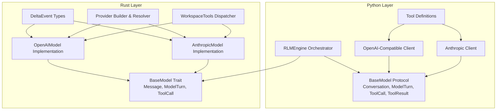
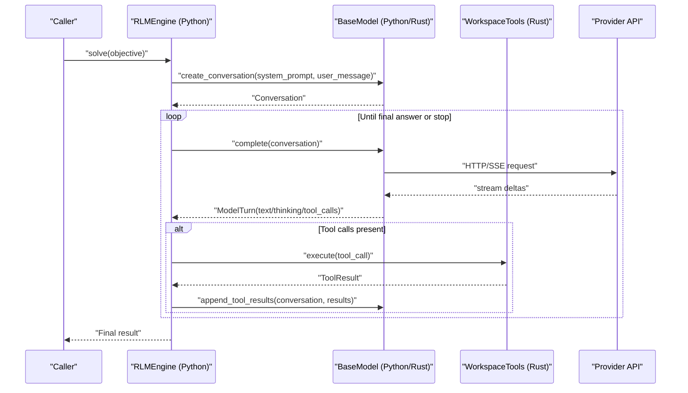
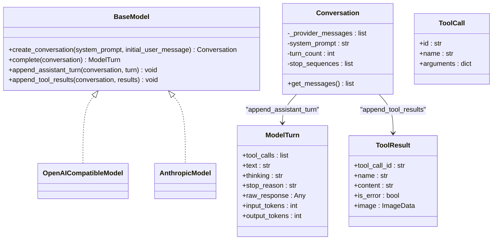
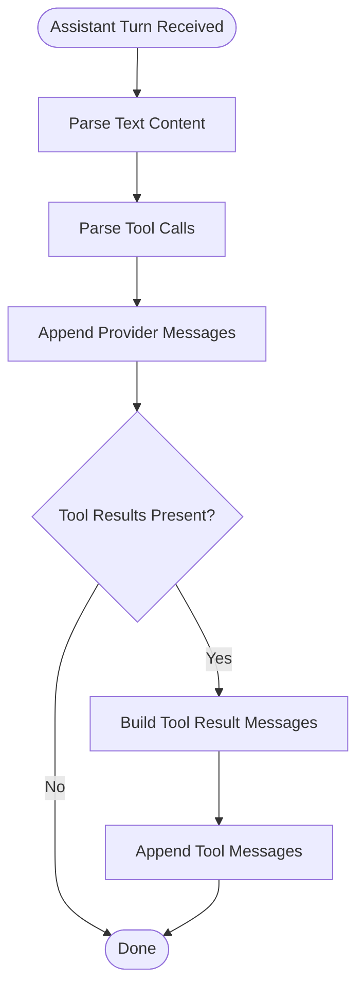
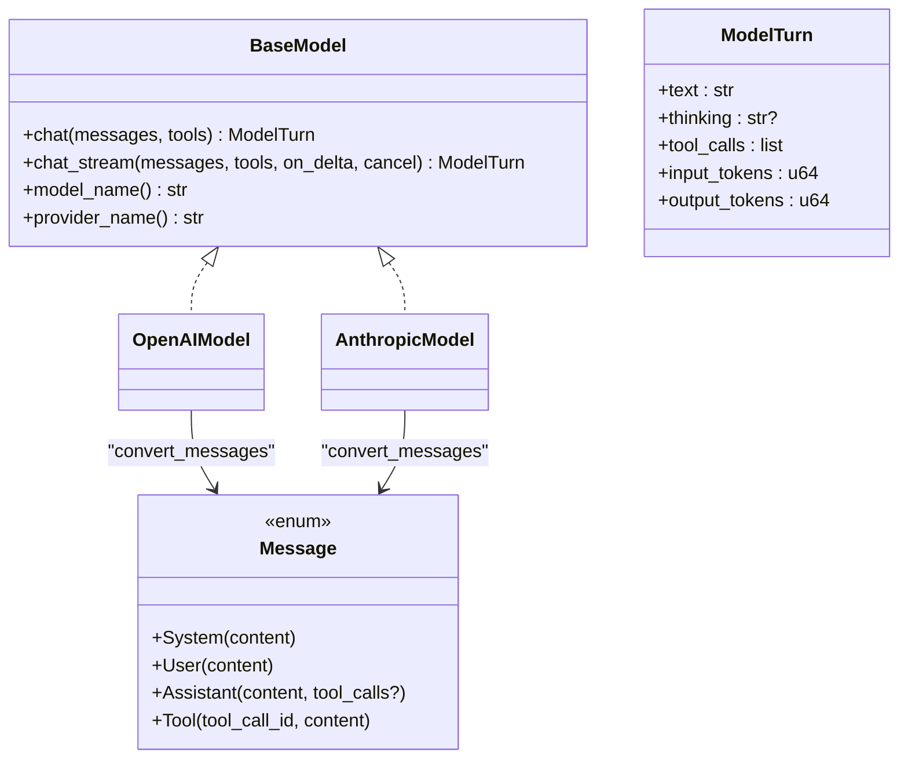
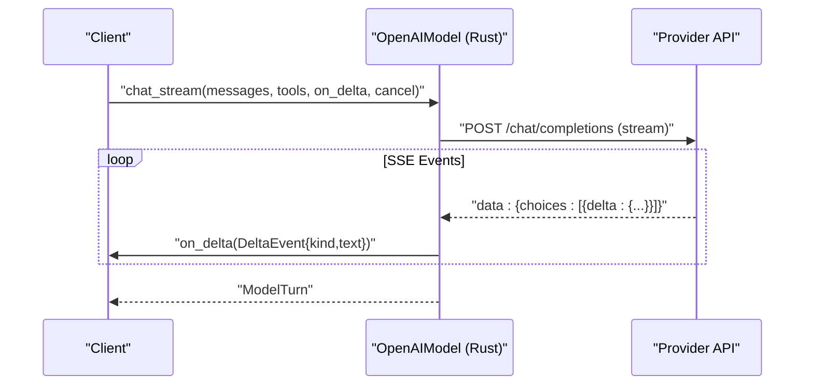
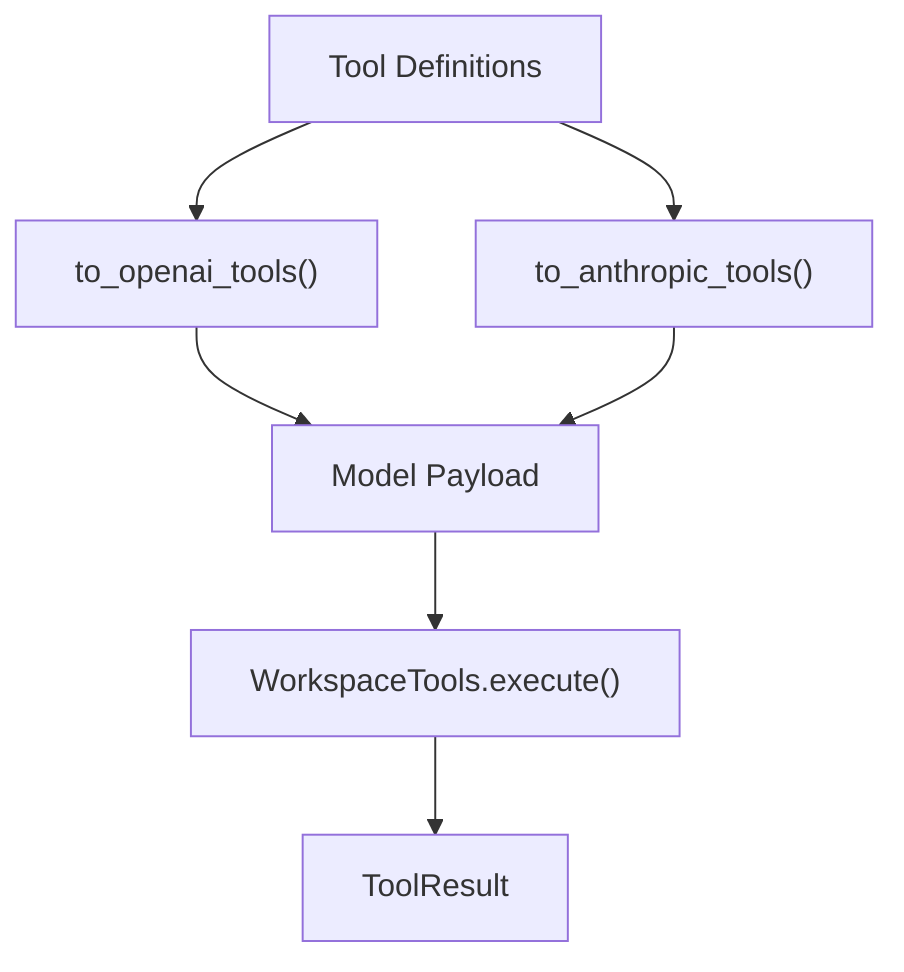
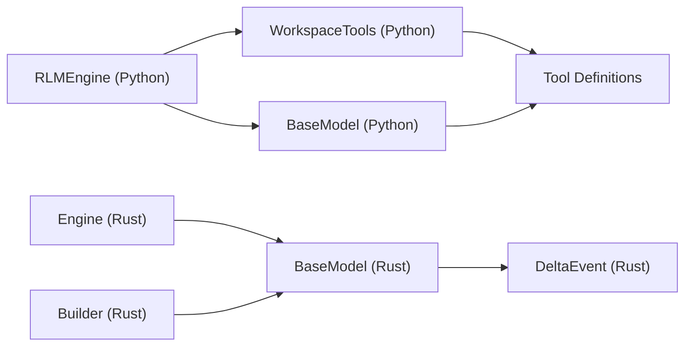

# Model Abstraction Layer

<cite>
**Referenced Files in This Document**
- [agent/model.py](file://agent/model.py)
- [agent/engine.py](file://agent/engine.py)
- [agent/tool_defs.py](file://agent/tool_defs.py)
- [openplanter-desktop/crates/op-core/src/model/mod.rs](file://openplanter-desktop/crates/op-core/src/model/mod.rs)
- [openplanter-desktop/crates/op-core/src/model/openai.rs](file://openplanter-desktop/crates/op-core/src/model/openai.rs)
- [openplanter-desktop/crates/op-core/src/model/anthropic.rs](file://openplanter-desktop/crates/op-core/src/model/anthropic.rs)
- [openplanter-desktop/crates/op-core/src/events.rs](file://openplanter-desktop/crates/op-core/src/events.rs)
- [openplanter-desktop/crates/op-core/src/builder.rs](file://openplanter-desktop/crates/op-core/src/builder.rs)
- [openplanter-desktop/crates/op-core/src/tools/mod.rs](file://openplanter-desktop/crates/op-core/src/tools/mod.rs)
</cite>

## Table of Contents
1. [Introduction](#introduction)
2. [Project Structure](#project-structure)
3. [Core Components](#core-components)
4. [Architecture Overview](#architecture-overview)
5. [Detailed Component Analysis](#detailed-component-analysis)
6. [Dependency Analysis](#dependency-analysis)
7. [Performance Considerations](#performance-considerations)
8. [Troubleshooting Guide](#troubleshooting-guide)
9. [Conclusion](#conclusion)
10. [Appendices](#appendices)

## Introduction
This document describes the model abstraction layer that provides a provider-agnostic interface for interacting with large language models. It covers the unified Python interface and the Rust implementation that powers the engine, including conversation management, turn-based interaction patterns, shared data structures, message formatting, tool calling mechanisms, and response parsing across providers. It also provides practical guidance for implementing new providers, integrating Rust and Python layers, debugging model interactions, and optimizing performance.

## Project Structure
The model abstraction spans two primary layers:
- Python layer (agent): Defines protocols, shared data structures, streaming helpers, and provider-specific clients (OpenAI-compatible and Anthropic).
- Rust layer (op-core): Implements the BaseModel trait, provider-specific model implementations, streaming event types, and tool orchestration.

**Diagram sources**
- [agent/model.py:98-103](file://agent/model.py#L98-L103)
- [agent/engine.py:504-528](file://agent/engine.py#L504-L528)
- [agent/tool_defs.py:10-586](file://agent/tool_defs.py#L10-L586)
- [openplanter-desktop/crates/op-core/src/model/mod.rs:61-84](file://openplanter-desktop/crates/op-core/src/model/mod.rs#L61-L84)
- [openplanter-desktop/crates/op-core/src/model/openai.rs:31-43](file://openplanter-desktop/crates/op-core/src/model/openai.rs#L31-L43)
- [openplanter-desktop/crates/op-core/src/model/anthropic.rs:13-20](file://openplanter-desktop/crates/op-core/src/model/anthropic.rs#L13-L20)
- [openplanter-desktop/crates/op-core/src/events.rs:71-87](file://openplanter-desktop/crates/op-core/src/events.rs#L71-L87)
- [openplanter-desktop/crates/op-core/src/builder.rs:235-232](file://openplanter-desktop/crates/op-core/src/builder.rs#L235-L232)
- [openplanter-desktop/crates/op-core/src/tools/mod.rs:56-95](file://openplanter-desktop/crates/op-core/src/tools/mod.rs#L56-L95)

**Section sources**
- [agent/model.py:98-103](file://agent/model.py#L98-L103)
- [agent/engine.py:504-528](file://agent/engine.py#L504-L528)
- [openplanter-desktop/crates/op-core/src/model/mod.rs:61-84](file://openplanter-desktop/crates/op-core/src/model/mod.rs#L61-L84)

## Core Components
- BaseModel protocol (Python) and trait (Rust): Define the contract for provider-agnostic model interactions, including creating conversations, completing turns, appending assistant turns, and appending tool results.
- Conversation: Opaque state container for provider messages, system prompt, turn count, and stop sequences.
- ModelTurn: Encapsulates assistant output (text/thinking/tool calls), stop reason, raw response, and token usage.
- ToolCall and ToolResult: Standardized representations for tool invocations and results across providers.
- Streaming helpers: SSE parsing, delta accumulation, and error classification for robust streaming across providers.
- Tool definitions: Provider-neutral tool schemas with converters for OpenAI and Anthropic tool formats.

**Section sources**
- [agent/model.py:45-88](file://agent/model.py#L45-L88)
- [agent/model.py:98-103](file://agent/model.py#L98-L103)
- [agent/model.py:400-571](file://agent/model.py#L400-L571)
- [agent/tool_defs.py:716-756](file://agent/tool_defs.py#L716-L756)
- [openplanter-desktop/crates/op-core/src/model/mod.rs:22-38](file://openplanter-desktop/crates/op-core/src/model/mod.rs#L22-L38)
- [openplanter-desktop/crates/op-core/src/model/mod.rs:61-84](file://openplanter-desktop/crates/op-core/src/model/mod.rs#L61-L84)

## Architecture Overview
The abstraction layer separates concerns:
- Python orchestrator (RLMEngine) manages conversation lifecycle, tool orchestration, and policy decisions.
- Python model clients handle provider-specific HTTP/SSE interactions and response parsing.
- Rust engine (when used) provides a strongly typed, async model trait with streaming deltas and structured error handling.
- Tool definitions and converters ensure consistent tool schemas across providers.

**Diagram sources**
- [agent/engine.py:586-628](file://agent/engine.py#L586-L628)
- [agent/model.py:1020-1187](file://agent/model.py#L1020-L1187)
- [openplanter-desktop/crates/op-core/src/model/openai.rs:664-736](file://openplanter-desktop/crates/op-core/src/model/openai.rs#L664-L736)
- [openplanter-desktop/crates/op-core/src/model/anthropic.rs:195-460](file://openplanter-desktop/crates/op-core/src/model/anthropic.rs#L195-L460)
- [openplanter-desktop/crates/op-core/src/tools/mod.rs:280-722](file://openplanter-desktop/crates/op-core/src/tools/mod.rs#L280-L722)

## Detailed Component Analysis

### Python BaseModel Protocol and Conversation Management
- BaseModel defines four methods: create_conversation, complete, append_assistant_turn, and append_tool_results.
- Conversation holds provider messages, system prompt, turn count, and stop sequences; exposes a safe copy of messages.
- OpenAI-compatible client builds provider payloads, streams SSE events, accumulates deltas, parses tool calls, and appends tool results as provider-native messages.
- Anthropic client mirrors the same lifecycle, converting tool results into content blocks and handling thinking modes.

**Diagram sources**
- [agent/model.py:98-103](file://agent/model.py#L98-L103)
- [agent/model.py:82-88](file://agent/model.py#L82-L88)
- [agent/model.py:70-88](file://agent/model.py#L70-L88)
- [agent/model.py:45-68](file://agent/model.py#L45-L68)
- [agent/model.py:778-1017](file://agent/model.py#L778-L1017)
- [agent/model.py:1023-1261](file://agent/model.py#L1023-L1261)

**Section sources**
- [agent/model.py:98-103](file://agent/model.py#L98-L103)
- [agent/model.py:82-88](file://agent/model.py#L82-L88)
- [agent/model.py:70-88](file://agent/model.py#L70-L88)
- [agent/model.py:45-68](file://agent/model.py#L45-L68)
- [agent/model.py:778-1017](file://agent/model.py#L778-L1017)
- [agent/model.py:1023-1261](file://agent/model.py#L1023-L1261)

### Message Formatting and Tool Calling Mechanisms
- OpenAI-compatible client:
  - Converts ModelTurn into provider-native messages and appends tool results as "tool" role messages.
  - Supports images by embedding base64 image data into user messages.
  - Condenses older tool results to reduce context size.
- Anthropic client:
  - Converts ModelTurn into content blocks including text and tool_use blocks.
  - Appends tool results as user messages containing tool_result blocks.
  - Merges consecutive tool_result blocks into a single user message to satisfy API constraints.
- Tool definitions:
  - Provider-neutral schemas define tool capabilities.
  - Converters produce OpenAI function tools and Anthropic input schemas.

**Diagram sources**
- [agent/model.py:967-997](file://agent/model.py#L967-L997)
- [agent/model.py:1189-1225](file://agent/model.py#L1189-L1225)
- [agent/tool_defs.py:716-756](file://agent/tool_defs.py#L716-L756)

**Section sources**
- [agent/model.py:967-997](file://agent/model.py#L967-L997)
- [agent/model.py:1189-1225](file://agent/model.py#L1189-L1225)
- [agent/tool_defs.py:716-756](file://agent/tool_defs.py#L716-L756)

### Rust Model Trait and Implementations
- BaseModel trait (Rust) defines async chat and chat_stream methods, plus model/provider name accessors.
- Message and ModelTurn types mirror Python counterparts with serialization support.
- OpenAIModel implementation:
  - Converts Message enums to provider payloads, handles reasoning_effort and thinking configurations.
  - Streams SSE, forwards deltas via DeltaEvent, and reconstructs final ModelTurn.
  - Includes structured RateLimitError and fallback base URL switching for Z.AI.
- AnthropicModel implementation:
  - Converts Message enums to Anthropic content blocks, merges tool_result blocks, and streams thinking/text/tool deltas.
  - Supports adaptive thinking for Opus 4.6 and enabled thinking budgets for older models.

**Diagram sources**
- [openplanter-desktop/crates/op-core/src/model/mod.rs:61-84](file://openplanter-desktop/crates/op-core/src/model/mod.rs#L61-L84)
- [openplanter-desktop/crates/op-core/src/model/mod.rs:41-58](file://openplanter-desktop/crates/op-core/src/model/mod.rs#L41-L58)
- [openplanter-desktop/crates/op-core/src/model/openai.rs:118-166](file://openplanter-desktop/crates/op-core/src/model/openai.rs#L118-L166)
- [openplanter-desktop/crates/op-core/src/model/anthropic.rs:63-136](file://openplanter-desktop/crates/op-core/src/model/anthropic.rs#L63-L136)

**Section sources**
- [openplanter-desktop/crates/op-core/src/model/mod.rs:61-84](file://openplanter-desktop/crates/op-core/src/model/mod.rs#L61-L84)
- [openplanter-desktop/crates/op-core/src/model/openai.rs:118-166](file://openplanter-desktop/crates/op-core/src/model/openai.rs#L118-L166)
- [openplanter-desktop/crates/op-core/src/model/anthropic.rs:63-136](file://openplanter-desktop/crates/op-core/src/model/anthropic.rs#L63-L136)

### Streaming and Delta Events
- Python streaming:
  - Reads SSE events, raises structured errors, and accumulates deltas into final responses.
  - Provides callbacks for live text/thinking/tool-call updates.
- Rust streaming:
  - Uses reqwest-eventsource to stream SSE, emitting DeltaEvent for text, thinking, tool call start, and tool call args.
  - Supports cancellation and structured rate-limit classification.

**Diagram sources**
- [openplanter-desktop/crates/op-core/src/model/openai.rs:476-661](file://openplanter-desktop/crates/op-core/src/model/openai.rs#L476-L661)
- [openplanter-desktop/crates/op-core/src/events.rs:71-87](file://openplanter-desktop/crates/op-core/src/events.rs#L71-L87)

**Section sources**
- [agent/model.py:297-356](file://agent/model.py#L297-L356)
- [agent/model.py:400-474](file://agent/model.py#L400-L474)
- [openplanter-desktop/crates/op-core/src/model/openai.rs:476-661](file://openplanter-desktop/crates/op-core/src/model/openai.rs#L476-L661)
- [openplanter-desktop/crates/op-core/src/events.rs:71-87](file://openplanter-desktop/crates/op-core/src/events.rs#L71-L87)

### Tool Definitions and Execution
- Provider-neutral tool definitions define capabilities and parameters.
- Converters produce OpenAI function tools and Anthropic input schemas.
- WorkspaceTools dispatches tool calls, enforces scopes (full workspace vs. wiki-only), and clips observations.

**Diagram sources**
- [agent/tool_defs.py:10-586](file://agent/tool_defs.py#L10-L586)
- [agent/tool_defs.py:716-756](file://agent/tool_defs.py#L716-L756)
- [openplanter-desktop/crates/op-core/src/tools/mod.rs:280-722](file://openplanter-desktop/crates/op-core/src/tools/mod.rs#L280-L722)

**Section sources**
- [agent/tool_defs.py:10-586](file://agent/tool_defs.py#L10-L586)
- [agent/tool_defs.py:716-756](file://agent/tool_defs.py#L716-L756)
- [openplanter-desktop/crates/op-core/src/tools/mod.rs:280-722](file://openplanter-desktop/crates/op-core/src/tools/mod.rs#L280-L722)

### Implementing New Providers
To add a new provider:
- Define a new struct implementing BaseModel (Rust) or a new class implementing BaseModel (Python) with the required methods.
- Implement message conversion and payload building for the provider’s API.
- Integrate streaming with SSE/event sourcing and map provider deltas to DeltaEvent.
- Add provider inference and endpoint resolution (builder.rs) and tool schema converters (tool_defs.py).
- Ensure error classification and rate-limit handling are consistent with existing providers.

Practical steps:
- Rust: Add a new module under op-core/src/model and implement BaseModel. Mirror OpenAIModel/AnthropicModel patterns for streaming and payload construction.
- Python: Add a new provider client similar to OpenAICompatibleModel/AnthropicModel, including SSE parsing and delta forwarding.

**Section sources**
- [openplanter-desktop/crates/op-core/src/builder.rs:235-232](file://openplanter-desktop/crates/op-core/src/builder.rs#L235-L232)
- [agent/tool_defs.py:716-756](file://agent/tool_defs.py#L716-L756)
- [openplanter-desktop/crates/op-core/src/model/openai.rs:118-166](file://openplanter-desktop/crates/op-core/src/model/openai.rs#L118-L166)
- [openplanter-desktop/crates/op-core/src/model/anthropic.rs:63-136](file://openplanter-desktop/crates/op-core/src/model/anthropic.rs#L63-L136)

### Debugging Model Interactions
Common debugging strategies:
- Enable streaming deltas to observe live text, thinking, and tool-call argument updates.
- Inspect ModelTurn fields (text, tool_calls, stop_reason, raw_response) for provider-specific nuances.
- Use structured errors (RateLimitError, HTTPModelError) to detect rate limits and provider-side failures.
- For Rust, leverage DeltaEvent emissions and structured RateLimitError with retry_after_sec for backoff strategies.
- Validate tool call arguments and results by logging ToolCall.id and ToolResult.content.

**Section sources**
- [agent/model.py:198-251](file://agent/model.py#L198-L251)
- [openplanter-desktop/crates/op-core/src/model/openai.rs:349-402](file://openplanter-desktop/crates/op-core/src/model/openai.rs#L349-L402)
- [openplanter-desktop/crates/op-core/src/events.rs:71-87](file://openplanter-desktop/crates/op-core/src/events.rs#L71-L87)

## Dependency Analysis
- Python engine depends on BaseModel implementations and WorkspaceTools for tool execution.
- Rust engine depends on BaseModel trait and DeltaEvent types for streaming.
- Both layers depend on tool definitions for consistent tool schemas.
- Provider inference and endpoint resolution are centralized in builder.rs for Rust and mirrored in Python.

**Diagram sources**
- [agent/engine.py:504-528](file://agent/engine.py#L504-L528)
- [openplanter-desktop/crates/op-core/src/builder.rs:235-232](file://openplanter-desktop/crates/op-core/src/builder.rs#L235-L232)
- [openplanter-desktop/crates/op-core/src/model/mod.rs:61-84](file://openplanter-desktop/crates/op-core/src/model/mod.rs#L61-L84)
- [openplanter-desktop/crates/op-core/src/events.rs:71-87](file://openplanter-desktop/crates/op-core/src/events.rs#L71-L87)
- [agent/tool_defs.py:10-586](file://agent/tool_defs.py#L10-L586)

**Section sources**
- [agent/engine.py:504-528](file://agent/engine.py#L504-L528)
- [openplanter-desktop/crates/op-core/src/builder.rs:235-232](file://openplanter-desktop/crates/op-core/src/builder.rs#L235-L232)
- [openplanter-desktop/crates/op-core/src/model/mod.rs:61-84](file://openplanter-desktop/crates/op-core/src/model/mod.rs#L61-L84)
- [openplanter-desktop/crates/op-core/src/events.rs:71-87](file://openplanter-desktop/crates/op-core/src/events.rs#L71-L87)
- [agent/tool_defs.py:10-586](file://agent/tool_defs.py#L10-L586)

## Performance Considerations
- Streaming: Prefer streaming APIs to reduce latency and enable live feedback. Use structured deltas to minimize UI refresh overhead.
- Context management: Condense tool results and prune old messages to keep conversations within provider context windows.
- Retry and backoff: Implement exponential backoff for rate-limited requests and consider fallback endpoints for providers like Z.AI.
- Token usage: Monitor input/output tokens to estimate costs and adjust model parameters (e.g., reasoning_effort, thinking) for cost/performance trade-offs.
- Parallel writes: Use parallel write scopes to coordinate file writes safely and avoid conflicts.

[No sources needed since this section provides general guidance]

## Troubleshooting Guide
- Rate limits: Detect via structured RateLimitError or HTTP 429; inspect provider_code and retry_after_sec for backoff scheduling.
- SSE errors: Raise structured errors for invalid status codes and malformed chunks; ensure proper event parsing and delta forwarding.
- Tool call mismatches: Verify tool definitions and converters; ensure arguments are valid JSON and match provider schemas.
- Conversation pruning: Use condense_conversation to reduce context size when approaching limits.

**Section sources**
- [agent/model.py:198-251](file://agent/model.py#L198-L251)
- [agent/model.py:400-474](file://agent/model.py#L400-L474)
- [openplanter-desktop/crates/op-core/src/model/openai.rs:349-402](file://openplanter-desktop/crates/op-core/src/model/openai.rs#L349-L402)

## Conclusion
The model abstraction layer provides a robust, provider-agnostic interface for model interactions, with strong support for conversation management, turn-based workflows, tool calling, and streaming. The Python and Rust implementations share common data structures and patterns, enabling seamless integration and extensibility. By following the guidelines in this document, developers can implement new providers, debug interactions effectively, and optimize performance across diverse model ecosystems.

## Appendices

### Practical Examples

- Implementing a new provider (Rust):
  - Create a new module under op-core/src/model and implement BaseModel.
  - Add provider inference and endpoint resolution in builder.rs.
  - Map provider deltas to DeltaEvent and handle structured errors consistently.

- Implementing a new provider (Python):
  - Add a new provider client class implementing BaseModel.
  - Integrate SSE parsing and delta forwarding similar to existing clients.
  - Add tool schema converters and integrate with tool definitions.

- Extending the abstraction layer:
  - Add new fields to shared data structures (ModelTurn, Message) with backward compatibility.
  - Extend tool definitions and converters to support new capabilities.

- Handling provider-specific differences:
  - Normalize payload formats and message roles across providers.
  - Support provider-specific features (e.g., thinking, reasoning_effort) with graceful fallbacks.

[No sources needed since this section provides general guidance]