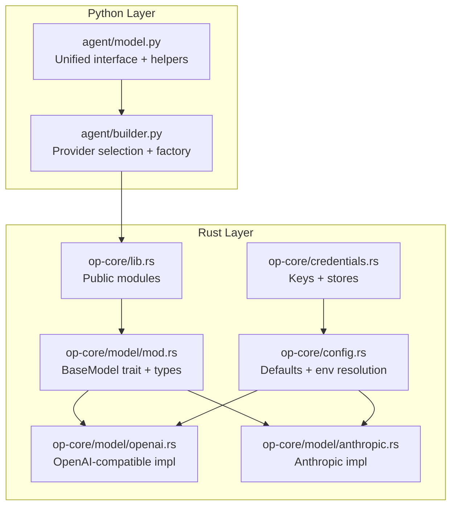
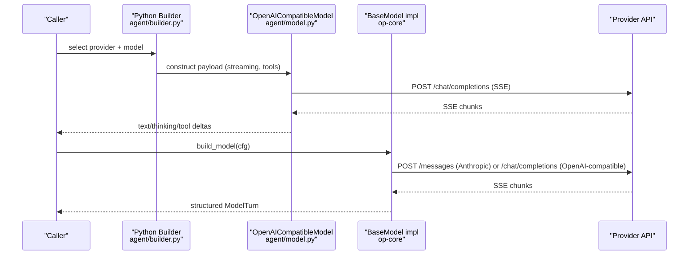
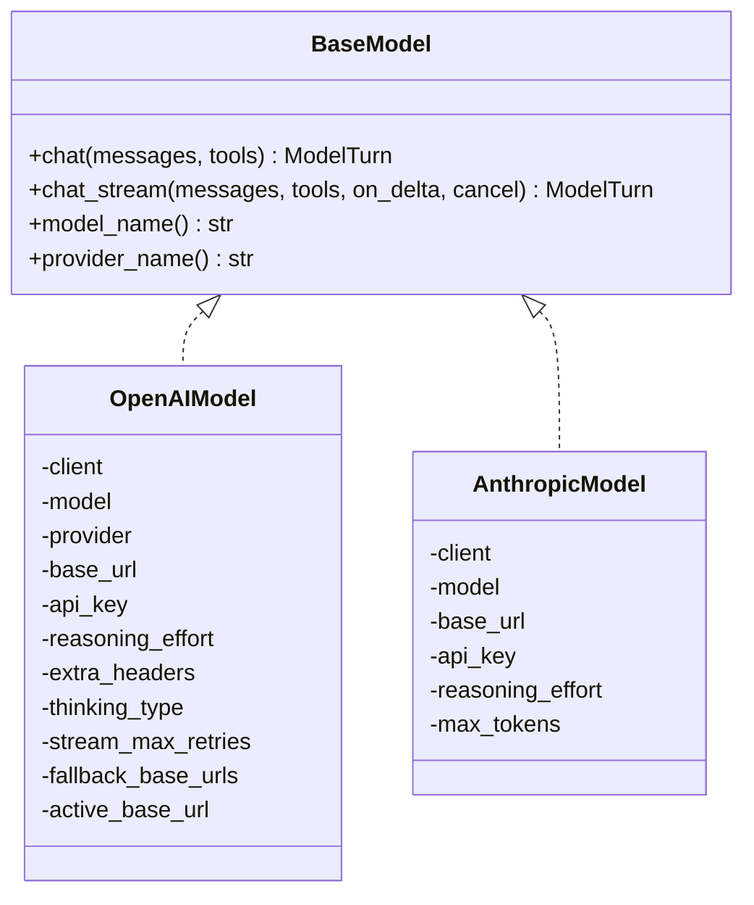
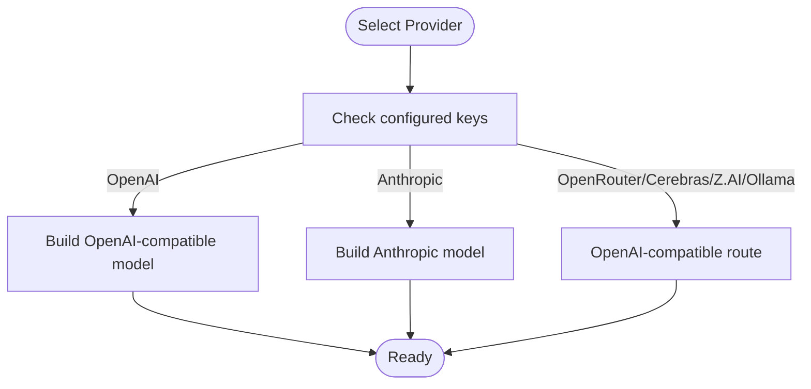
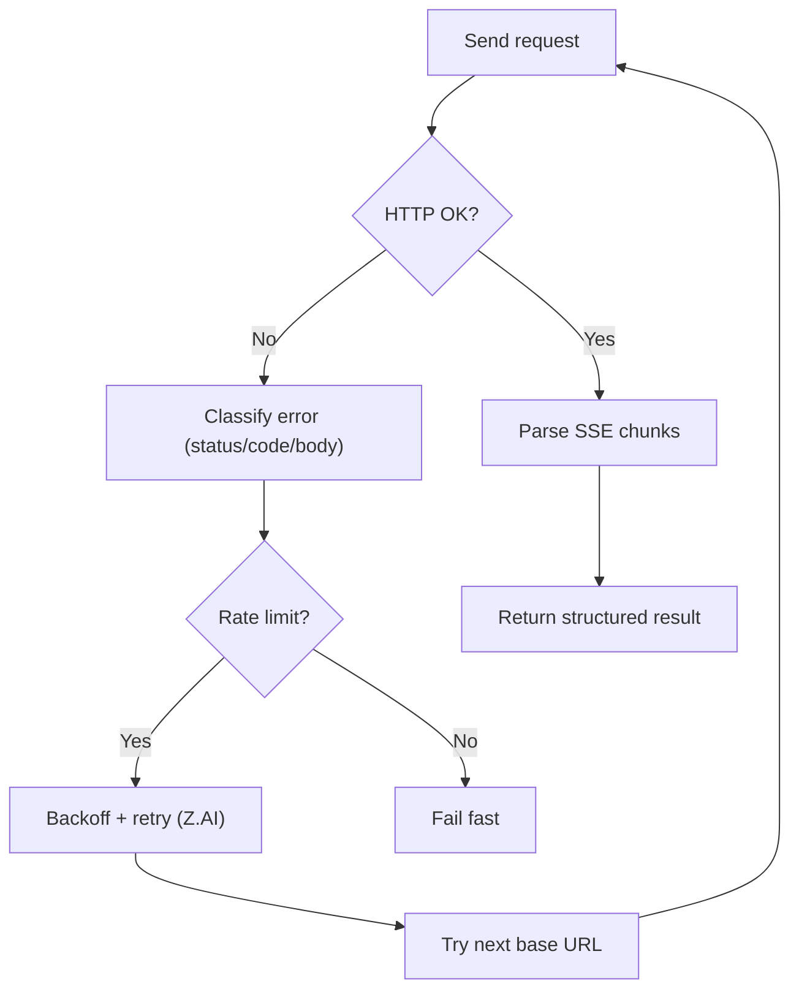
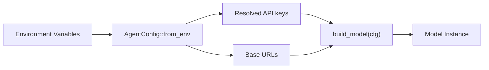
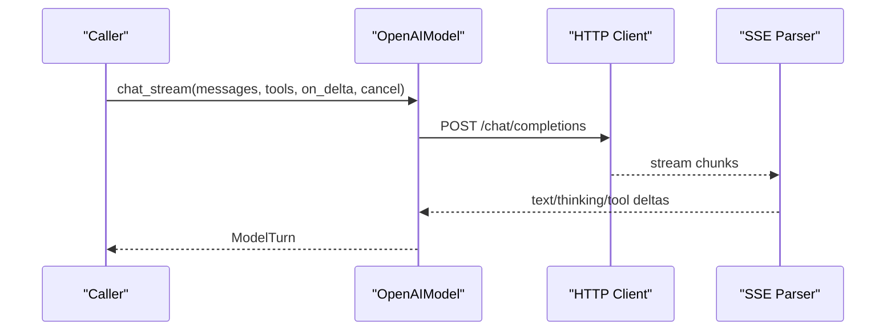
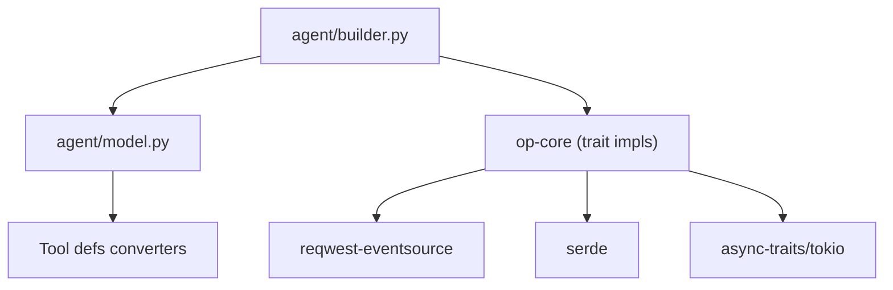

# Multi-provider AI Integration

<cite>
**Referenced Files in This Document**
- [model.py](file://agent/model.py)
- [builder.py](file://agent/builder.py)
- [mod.rs](file://openplanter-desktop/crates/op-core/src/model/mod.rs)
- [openai.rs](file://openplanter-desktop/crates/op-core/src/model/openai.rs)
- [anthropic.rs](file://openplanter-desktop/crates/op-core/src/model/anthropic.rs)
- [config.rs](file://openplanter-desktop/crates/op-core/src/config.rs)
- [credentials.rs](file://openplanter-desktop/crates/op-core/src/credentials.rs)
- [lib.rs](file://openplanter-desktop/crates/op-core/src/lib.rs)
- [config.rs](file://openplanter-desktop/crates/op-tauri/src/commands/config.rs)
- [test_settings.py](file://tests/test_settings.py)
</cite>

## Table of Contents
1. [Introduction](#introduction)
2. [Project Structure](#project-structure)
3. [Core Components](#core-components)
4. [Architecture Overview](#architecture-overview)
5. [Detailed Component Analysis](#detailed-component-analysis)
6. [Dependency Analysis](#dependency-analysis)
7. [Performance Considerations](#performance-considerations)
8. [Troubleshooting Guide](#troubleshooting-guide)
9. [Conclusion](#conclusion)
10. [Appendices](#appendices)

## Introduction
This document explains the multi-provider AI integration that enables a provider-agnostic model abstraction across OpenAI, Anthropic, OpenRouter, Cerebras, Z.AI, and Ollama (local). It covers unified interfaces, model selection and management, rate limiting and retry mechanisms, performance tuning, provider configuration and authentication, endpoint customization, practical provider selection guidance, cost and reliability considerations, Rust model implementations, and troubleshooting and monitoring recommendations.

## Project Structure
The multi-provider integration spans two layers:
- Python layer (agent): Provides a unified interface for OpenAI-compatible providers and streaming helpers, plus model selection and configuration helpers.
- Rust layer (op-core): Implements a provider-agnostic trait and concrete providers (OpenAI-compatible, Anthropic) with robust error classification, SSE streaming, and retry/backoff logic.

**Diagram sources**
- [lib.rs:1-15](file://openplanter-desktop/crates/op-core/src/lib.rs#L1-L15)
- [mod.rs:1-85](file://openplanter-desktop/crates/op-core/src/model/mod.rs#L1-L85)
- [openai.rs:1-120](file://openplanter-desktop/crates/op-core/src/model/openai.rs#L1-L120)
- [anthropic.rs:1-60](file://openplanter-desktop/crates/op-core/src/model/anthropic.rs#L1-L60)
- [config.rs:34-45](file://openplanter-desktop/crates/op-core/src/config.rs#L34-L45)
- [credentials.rs:10-29](file://openplanter-desktop/crates/op-core/src/credentials.rs#L10-L29)
- [model.py:98-103](file://agent/model.py#L98-L103)
- [builder.py:195-222](file://agent/builder.py#L195-L222)

**Section sources**
- [lib.rs:1-15](file://openplanter-desktop/crates/op-core/src/lib.rs#L1-L15)
- [mod.rs:60-85](file://openplanter-desktop/crates/op-core/src/model/mod.rs#L60-L85)
- [openai.rs:31-43](file://openplanter-desktop/crates/op-core/src/model/openai.rs#L31-L43)
- [anthropic.rs:13-20](file://openplanter-desktop/crates/op-core/src/model/anthropic.rs#L13-L20)
- [config.rs:34-45](file://openplanter-desktop/crates/op-core/src/config.rs#L34-L45)
- [credentials.rs:10-29](file://openplanter-desktop/crates/op-core/src/credentials.rs#L10-L29)
- [model.py:98-103](file://agent/model.py#L98-L103)
- [builder.py:195-222](file://agent/builder.py#L195-L222)

## Core Components
- Unified Python interface: Defines a BaseModel protocol and shared helpers for HTTP/SSE streaming, error parsing, and conversation state. It supports OpenAI-compatible providers and includes model listing helpers for OpenAI, Anthropic, OpenRouter, and Ollama.
- Rust provider implementations: A trait-based abstraction with two concrete providers:
  - OpenAI-compatible: Supports OpenAI, OpenRouter, Cerebras, Z.AI, and Ollama via a unified /chat/completions path. Includes robust error classification, SSE streaming, and retry/backoff logic.
  - Anthropic: Implements Anthropic Messages API with SSE streaming and structured tool-call handling.
- Configuration and credentials: Centralized configuration with defaults, environment variable resolution, and credential stores for secure key management.

**Section sources**
- [model.py:98-103](file://agent/model.py#L98-L103)
- [model.py:609-771](file://agent/model.py#L609-L771)
- [mod.rs:60-85](file://openplanter-desktop/crates/op-core/src/model/mod.rs#L60-L85)
- [openai.rs:31-43](file://openplanter-desktop/crates/op-core/src/model/openai.rs#L31-L43)
- [anthropic.rs:13-20](file://openplanter-desktop/crates/op-core/src/model/anthropic.rs#L13-L20)
- [config.rs:254-437](file://openplanter-desktop/crates/op-core/src/config.rs#L254-L437)
- [credentials.rs:10-29](file://openplanter-desktop/crates/op-core/src/credentials.rs#L10-L29)

## Architecture Overview
The system routes model requests through a provider-agnostic interface. The Python layer constructs payloads and streams responses, while the Rust layer encapsulates provider-specific logic behind a shared trait.

**Diagram sources**
- [builder.py:195-222](file://agent/builder.py#L195-L222)
- [model.py:819-965](file://agent/model.py#L819-L965)
- [openai.rs:476-661](file://openplanter-desktop/crates/op-core/src/model/openai.rs#L476-L661)
- [anthropic.rs:207-451](file://openplanter-desktop/crates/op-core/src/model/anthropic.rs#L207-L451)

## Detailed Component Analysis

### Provider-agnostic model abstraction
- Python: The BaseModel protocol defines conversation lifecycle and turn handling. Helpers manage HTTP/SSE, error parsing, and conversation state. Model listing functions expose provider model catalogs.
- Rust: The BaseModel trait defines chat and chat_stream methods, plus metadata. Implementations handle provider differences transparently.

**Diagram sources**
- [mod.rs:60-85](file://openplanter-desktop/crates/op-core/src/model/mod.rs#L60-L85)
- [openai.rs:31-43](file://openplanter-desktop/crates/op-core/src/model/openai.rs#L31-L43)
- [anthropic.rs:13-20](file://openplanter-desktop/crates/op-core/src/model/anthropic.rs#L13-L20)

**Section sources**
- [model.py:98-103](file://agent/model.py#L98-L103)
- [mod.rs:60-85](file://openplanter-desktop/crates/op-core/src/model/mod.rs#L60-L85)
- [openai.rs:31-43](file://openplanter-desktop/crates/op-core/src/model/openai.rs#L31-L43)
- [anthropic.rs:13-20](file://openplanter-desktop/crates/op-core/src/model/anthropic.rs#L13-L20)

### Model selection and management
- Provider detection and routing: The Python builder selects providers based on configuration and available keys. It constructs OpenAI-compatible models for OpenAI, OpenRouter, Cerebras, Z.AI, and Ollama, and Anthropic models for Anthropic.
- Rust builder: Resolves endpoint and API key per provider, validates model-provider compatibility, and builds the appropriate model instance.
- Defaults and aliases: Configuration defines default models per provider and normalizes model aliases for convenience.

**Diagram sources**
- [builder.py:195-222](file://agent/builder.py#L195-L222)
- [builder.rs:154-184](file://openplanter-desktop/crates/op-core/src/builder.rs#L154-L184)
- [builder.rs:218-239](file://openplanter-desktop/crates/op-core/src/builder.rs#L218-L239)
- [config.rs:34-45](file://openplanter-desktop/crates/op-core/src/config.rs#L34-L45)

**Section sources**
- [builder.py:195-222](file://agent/builder.py#L195-L222)
- [builder.py:294-326](file://agent/builder.py#L294-L326)
- [builder.rs:154-184](file://openplanter-desktop/crates/op-core/src/builder.rs#L154-L184)
- [builder.rs:218-239](file://openplanter-desktop/crates/op-core/src/builder.rs#L218-L239)
- [config.rs:34-45](file://openplanter-desktop/crates/op-core/src/config.rs#L34-L45)
- [test_settings.py:241-277](file://tests/test_settings.py#L241-L277)

### Rate limiting and retry mechanisms
- Python: Parses provider error bodies and Retry-After headers, raises structured rate-limit errors, and supports SSE streaming with timeouts and retries.
- Rust: Classifies rate-limit errors from HTTP status, provider codes, and SSE payloads; implements backoff and retry strategies for Z.AI and OpenAI-compatible providers; tracks active base URL and fallbacks.

**Diagram sources**
- [model.py:198-217](file://agent/model.py#L198-L217)
- [openai.rs:349-368](file://openplanter-desktop/crates/op-core/src/model/openai.rs#L349-L368)
- [openai.rs:682-727](file://openplanter-desktop/crates/op-core/src/model/openai.rs#L682-L727)

**Section sources**
- [model.py:198-217](file://agent/model.py#L198-L217)
- [model.py:359-398](file://agent/model.py#L359-L398)
- [openai.rs:280-309](file://openplanter-desktop/crates/op-core/src/model/openai.rs#L280-L309)
- [openai.rs:349-368](file://openplanter-desktop/crates/op-core/src/model/openai.rs#L349-L368)
- [openai.rs:682-727](file://openplanter-desktop/crates/op-core/src/model/openai.rs#L682-L727)

### Performance tuning strategies
- Streaming and timeouts: Configure first-byte and stream timeouts, and adjust max retries for SSE streams.
- Reasoning and thinking: Toggle reasoning_effort and thinking modes per provider constraints; avoid conflicting parameters (e.g., temperature with thinking).
- Local models: Increase first-byte timeouts for Ollama to accommodate cold starts.
- Token accounting: Use returned usage fields to monitor prompt and completion tokens.

**Section sources**
- [model.py:819-965](file://agent/model.py#L819-L965)
- [model.py:1048-1187](file://agent/model.py#L1048-L1187)
- [openai.rs:168-208](file://openplanter-desktop/crates/op-core/src/model/openai.rs#L168-L208)
- [anthropic.rs:138-192](file://openplanter-desktop/crates/op-core/src/model/anthropic.rs#L138-L192)

### Provider configuration, authentication, and endpoints
- Environment-driven configuration: Centralized AgentConfig loads keys and endpoints from environment variables with sensible defaults and normalization.
- Credential stores: Secure workspace- and user-level credential stores with permission enforcement.
- Endpoint customization: Providers accept configurable base URLs; special handling for Anthropic base URL and Foundry proxy endpoints.

**Diagram sources**
- [config.rs:441-674](file://openplanter-desktop/crates/op-core/src/config.rs#L441-L674)
- [credentials.rs:290-334](file://openplanter-desktop/crates/op-core/src/credentials.rs#L290-L334)
- [credentials.rs:337-380](file://openplanter-desktop/crates/op-core/src/credentials.rs#L337-L380)
- [builder.rs:234-239](file://openplanter-desktop/crates/op-core/src/builder.rs#L234-L239)

**Section sources**
- [config.rs:441-674](file://openplanter-desktop/crates/op-core/src/config.rs#L441-L674)
- [credentials.rs:290-334](file://openplanter-desktop/crates/op-core/src/credentials.rs#L290-L334)
- [credentials.rs:337-380](file://openplanter-desktop/crates/op-core/src/credentials.rs#L337-L380)
- [builder.rs:154-184](file://openplanter-desktop/crates/op-core/src/builder.rs#L154-L184)
- [builder.rs:234-239](file://openplanter-desktop/crates/op-core/src/builder.rs#L234-L239)

### Practical provider selection guidance
- OpenAI ecosystem: Use OpenAI for broad compatibility and tool-calling; Foundry proxies enable Azure-hosted models.
- Anthropic: Use Anthropic for strong reasoning and tool-use; consider Opus 4.6 adaptive thinking.
- OpenRouter/Cerebras: Route via OpenAI-compatible interface; choose models aligned with your workload.
- Z.AI: Pay-as-you-go or coding plans; supports thinking toggles; includes built-in retry/backoff.
- Ollama: Local inference with minimal latency; requires local setup and tuned timeouts.

**Section sources**
- [config.rs:34-45](file://openplanter-desktop/crates/op-core/src/config.rs#L34-L45)
- [config.rs:171-240](file://openplanter-desktop/crates/op-core/src/config.rs#L171-L240)
- [config.rs:523-527](file://openplanter-desktop/crates/op-core/src/config.rs#L523-L527)
- [builder.py:195-222](file://agent/builder.py#L195-L222)
- [anthropic.rs:39-42](file://openplanter-desktop/crates/op-core/src/model/anthropic.rs#L39-L42)

### Cost optimization and reliability considerations
- Cost: Prefer Foundry OpenAI base URL for reduced latency and potential cost benefits; leverage provider-specific features (e.g., Z.AI plan selection).
- Reliability: Enable retries and backoff for Z.AI; monitor rate limits and adjust concurrency; use conversation condensation to reduce token usage.
- Observability: Capture structured ModelTurn fields (input/output tokens) and provider codes for billing and debugging.

**Section sources**
- [config.rs:10-16](file://openplanter-desktop/crates/op-core/src/config.rs#L10-L16)
- [openai.rs:682-727](file://openplanter-desktop/crates/op-core/src/model/openai.rs#L682-L727)
- [model.py:998-1017](file://agent/model.py#L998-L1017)
- [anthropic.rs:1227-1260](file://openplanter-desktop/crates/op-core/src/model/anthropic.rs#L1227-L1260)

### Rust model implementations and integration patterns
- OpenAI-compatible model:
  - Builds provider-specific payloads and headers.
  - Streams SSE, parses deltas, and reconstructs final responses.
  - Implements fallback base URLs and Z.AI-specific retry/backoff.
- Anthropic model:
  - Converts messages to Anthropic format, merges tool results, and streams SSE events.
  - Handles thinking modes and token accounting.

**Diagram sources**
- [openai.rs:476-661](file://openplanter-desktop/crates/op-core/src/model/openai.rs#L476-L661)
- [openai.rs:664-736](file://openplanter-desktop/crates/op-core/src/model/openai.rs#L664-L736)

**Section sources**
- [openai.rs:168-208](file://openplanter-desktop/crates/op-core/src/model/openai.rs#L168-L208)
- [openai.rs:476-661](file://openplanter-desktop/crates/op-core/src/model/openai.rs#L476-L661)
- [openai.rs:664-736](file://openplanter-desktop/crates/op-core/src/model/openai.rs#L664-L736)
- [anthropic.rs:138-192](file://openplanter-desktop/crates/op-core/src/model/anthropic.rs#L138-L192)
- [anthropic.rs:207-451](file://openplanter-desktop/crates/op-core/src/model/anthropic.rs#L207-L451)

## Dependency Analysis
- Python layer depends on:
  - Standard library for HTTP/SSE and JSON parsing.
  - Tool definitions conversion for provider tool schemas.
- Rust layer depends on:
  - reqwest-eventsource for SSE.
  - async traits and tokio for concurrency.
  - Serde for serialization/deserialization.
- Cross-layer integration:
  - Python builder delegates to Rust model instances via the BaseModel trait abstraction.

**Diagram sources**
- [model.py:12-13](file://agent/model.py#L12-L13)
- [builder.py:195-222](file://agent/builder.py#L195-L222)
- [openai.rs:1-18](file://openplanter-desktop/crates/op-core/src/model/openai.rs#L1-L18)
- [anthropic.rs:1-11](file://openplanter-desktop/crates/op-core/src/model/anthropic.rs#L1-L11)

**Section sources**
- [model.py:12-13](file://agent/model.py#L12-L13)
- [builder.py:195-222](file://agent/builder.py#L195-L222)
- [openai.rs:1-18](file://openplanter-desktop/crates/op-core/src/model/openai.rs#L1-L18)
- [anthropic.rs:1-11](file://openplanter-desktop/crates/op-core/src/model/anthropic.rs#L1-L11)

## Performance Considerations
- Streaming vs. non-streaming: Prefer streaming for responsive UX and incremental processing.
- Timeouts: Tune first-byte and stream timeouts per provider characteristics (e.g., Ollama longer cold-start times).
- Payload size: Condense tool results in older turns to reduce context length and token costs.
- Retry strategy: Use exponential backoff for transient failures; cap retry-after durations.

[No sources needed since this section provides general guidance]

## Troubleshooting Guide
- Authentication failures:
  - Verify API keys are present and not placeholders for Foundry endpoints.
  - Confirm provider-specific base URLs and OAuth tokens when applicable.
- Rate limits:
  - Inspect structured rate-limit errors and provider codes; honor Retry-After values.
  - Adjust concurrency and backoff parameters.
- SSE/streaming issues:
  - Check timeouts and network connectivity; ensure SSE event parsing succeeds.
- Provider mismatches:
  - Validate model-provider compatibility; use alias normalization and provider detection logic.

**Section sources**
- [config.rs:179-240](file://openplanter-desktop/crates/op-core/src/config.rs#L179-L240)
- [model.py:198-217](file://agent/model.py#L198-L217)
- [openai.rs:349-368](file://openplanter-desktop/crates/op-core/src/model/openai.rs#L349-L368)
- [test_settings.py:279-294](file://tests/test_settings.py#L279-L294)

## Conclusion
The multi-provider AI integration achieves a provider-agnostic model abstraction by combining a unified Python interface with robust Rust implementations. It supports OpenAI, Anthropic, OpenRouter, Cerebras, Z.AI, and Ollama via a shared trait, offers comprehensive error classification and retry/backoff, and provides flexible configuration and credential management. This design enables reliable, cost-conscious, and high-performance AI workflows across diverse providers.

## Appendices

### Provider configuration examples and defaults
- Default models per provider and model alias normalization are defined centrally.
- Environment variables drive base URLs, API keys, and feature toggles.

**Section sources**
- [config.rs:34-45](file://openplanter-desktop/crates/op-core/src/config.rs#L34-L45)
- [config.rs:122-149](file://openplanter-desktop/crates/op-core/src/config.rs#L122-L149)
- [config.rs:441-674](file://openplanter-desktop/crates/op-core/src/config.rs#L441-L674)

### Monitoring recommendations for multi-provider environments
- Track provider codes and retry-after values for rate-limit visibility.
- Log structured ModelTurn metrics (input/output tokens) for cost attribution.
- Observe SSE stream timeouts and error distributions per provider.

**Section sources**
- [openai.rs:305-309](file://openplanter-desktop/crates/op-core/src/model/openai.rs#L305-L309)
- [openai.rs:349-368](file://openplanter-desktop/crates/op-core/src/model/openai.rs#L349-L368)
- [anthropic.rs:254-263](file://openplanter-desktop/crates/op-core/src/model/anthropic.rs#L254-L263)